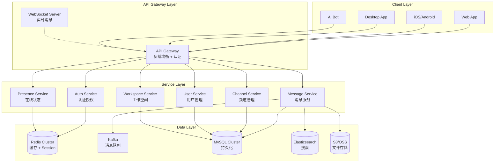
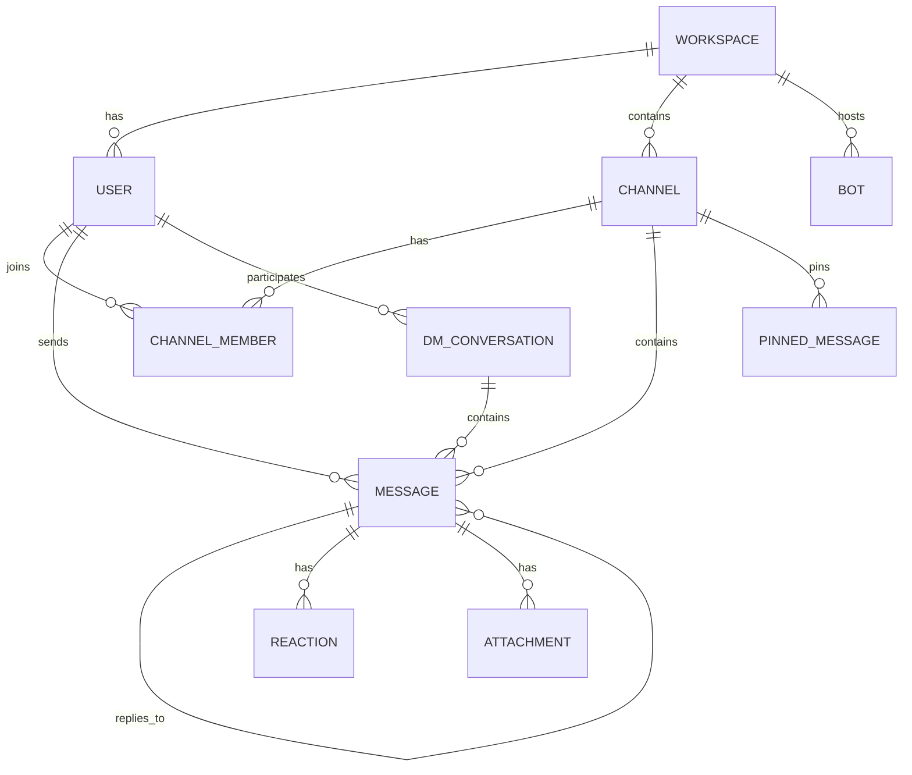
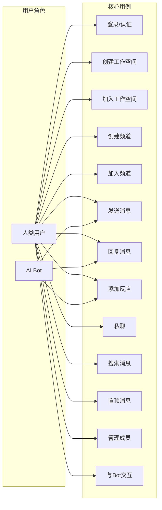
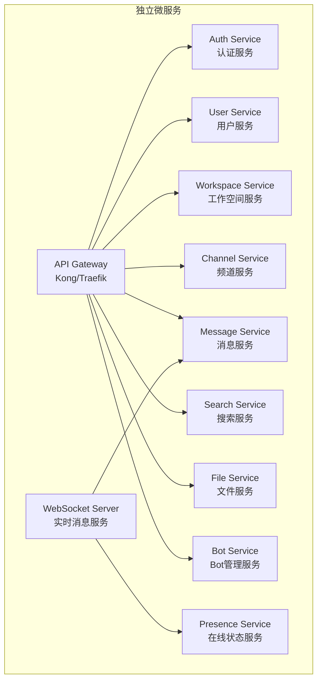
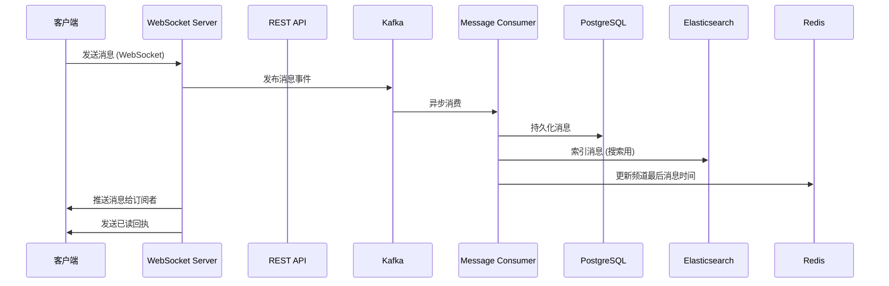
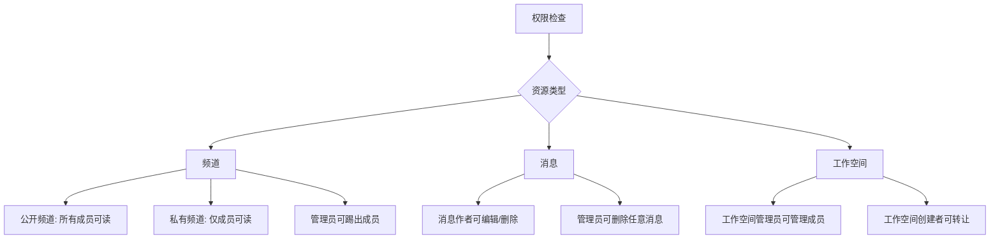
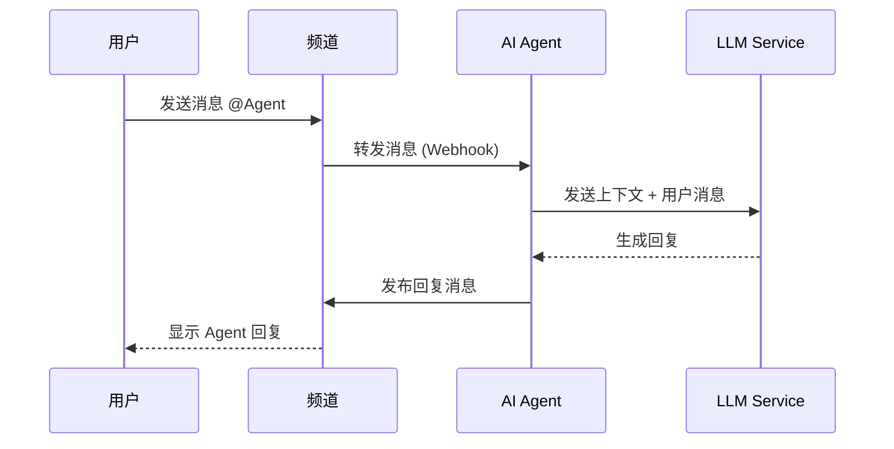
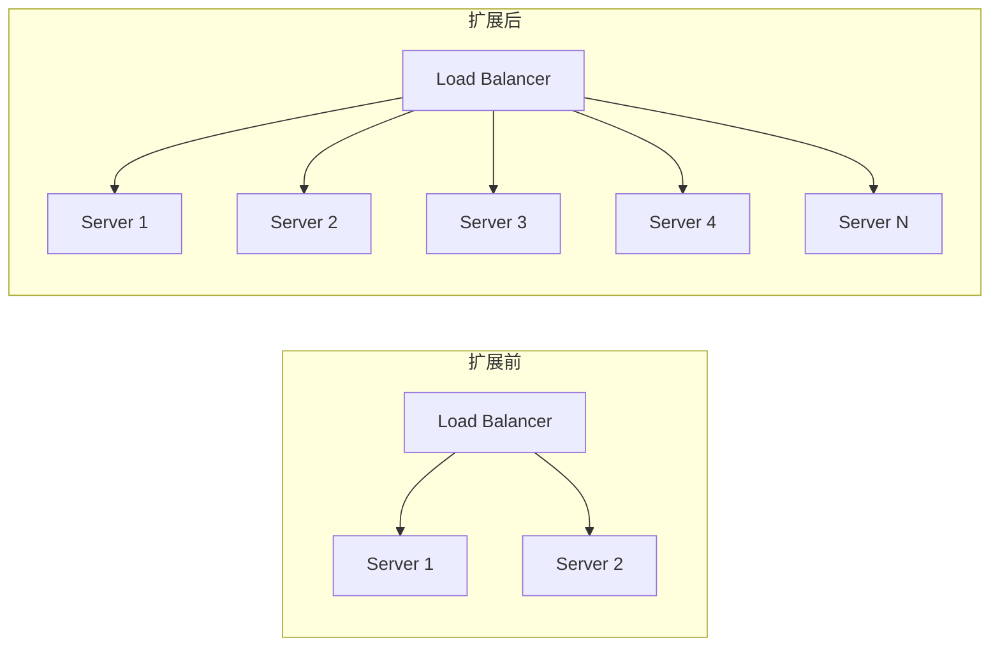

> 版本: v1.0
> 日期: 2026-02-13
> 作者: AI Agent 协调项目组

---

## 1. 项目概述

### 1.1 目标

构建一个支持 AI Agent 协调工作的企业级聊天平台，核心特性：

- **多租户 Workspace**：支持多个独立的工作空间
- **频道通信**：支持公开频道(#)和私聊(DM)
- **实时消息**：毫秒级消息推送
- **AI Agent 接入**：支持后期接入 AI Agent 进行自动化协作
- **消息持久化**：完整的历史消息检索

### 1.2 High-Level 架构图



---

## 2. 核心概念与术语

| 术语 | 英文 | 定义 |
|------|------|------|
| 工作空间 | Workspace | 独立的组织单元，包含多个频道和成员 |
| 频道 | Channel | 消息交流的容器，分为公开和私有 |
| 消息 | Message | 用户发送的内容，支持富文本、附件 |
| 线程 | Thread | 消息的回复链，用于专题讨论 |
| 用户 | User | 系统使用者，可以是人类或 AI Agent |
| 机器人 | Bot | AI Agent 的实体表示 |
| 表情 | Emoji | 消息反应和自定义表情 |
| 提及 | Mention | @用户 或 @频道 的引用 |
| 片段 | Snippet | 代码块或文本片段的共享 |

---

## 3. 实体关系图 (ER Diagram)



### 3.1 核心实体定义

#### Workspace (工作空间)
```python
class Workspace:
    id: UUID              # 主键
    name: str             # 工作空间名称
    slug: str             # URL 标识 (e.g., "acme-corp")
    owner_id: UUID        # 所有者用户ID
    plan: str             # 免费/付费计划
    settings: JSON        # 工作空间配置
    created_at: datetime
    updated_at: datetime
```

#### Channel (频道)
```python
class Channel:
    id: UUID              # 主键
    workspace_id: UUID    # 外键 -> Workspace
    name: str             # 频道名称
    topic: str            # 频道主题
    purpose: str          # 频道描述
    is_private: bool      # 公开/私有频道
    channel_type: enum   # public, private, dm, group_dm
    created_by: UUID      # 创建者
    member_count: int
    last_message_at: datetime
    created_at: datetime
```

#### Message (消息)
```python
class Message:
    id: UUID              # 主键
    channel_id: UUID     # 外键 -> Channel
    user_id: UUID        # 外键 -> User (发送者)
    parent_id: UUID      # 外键 -> Message (如果是回复)
    message_type: enum   # message, file_share, system
    content: text        # 消息内容 (Markdown)
    blocks: JSON         # 富消息 Block Kit
    metadata: JSON       # 额外元数据
    is_thread_root: bool # 是否是线程根消息
    reply_count: int     # 回复数量
    is_pinned: bool
    files: JSON          # 附件列表
    mentions: JSON       # @提及列表
    reactions: JSON      # 表情反应
    created_at: datetime
    updated_at: datetime
```

#### User (用户)
```python
class User:
    id: UUID              # 主键
    workspace_id: UUID    # 主工作空间 (可跨空间)
    username: str         # 用户名 (唯一)
    display_name: str    # 显示名称
    email: str            # 邮箱
    avatar_url: str       # 头像
    status: str           # 在线/离线/忙碌
    timezone: str         # 时区
    is_bot: bool          # 是否是 Bot
    bot_id: UUID          # 如果是 Bot，关联的 Bot 实体
    created_at: datetime
```

#### Bot (AI Agent)
```python
class Bot:
    id: UUID              # 主键
    workspace_id: UUID    # 外键 -> Workspace
    name: str             # Bot 名称
    description: str     # Bot 描述
    avatar_url: str
    owner_id: UUID        # Bot 所有者
    bot_token: str        # API Token
    capabilities: JSON   # 支持的能力
    is_active: bool
    created_at: datetime
```

#### ChannelMember (频道成员)
```python
class ChannelMember:
    id: UUID
    channel_id: UUID      # 外键 -> Channel
    user_id: UUID         # 外键 -> User
    role: enum            # member, admin, owner
    is_muted: bool        # 静音
    notifications: JSON   # 通知设置
    joined_at: datetime
```

---

## 4. 用例图 (Use Case Diagram)



---

## 5. API 设计

### 5.1 REST API 概览

| 方法 | 路径 | 描述 |
|------|------|------|
| POST | /auth/login | 用户登录 |
| POST | /auth/logout | 用户登出 |
| GET | /workspaces | 获取用户的工作空间列表 |
| POST | /workspaces | 创建新工作空间 |
| GET | /workspaces/{id}/channels | 获取工作空间的频道列表 |
| POST | /workspaces/{id}/channels | 创建频道 |
| GET | /channels/{id}/messages | 获取频道消息历史 |
| POST | /channels/{id}/messages | 发送消息 |
| PUT | /messages/{id} | 编辑消息 |
| DELETE | /messages/{id} | 删除消息 |
| POST | /messages/{id}/reactions | 添加反应 |
| GET | /users/{id} | 获取用户信息 |
| POST | /bots | 注册新 Bot |

### 5.2 WebSocket 消息事件

```python
# 客户端订阅主题
{
    "type": "subscribe",
    "channel_ids": ["channel_uuid_1", "channel_uuid_2"],
    "dm_user_ids": ["user_uuid_1"]
}

# 服务端推送消息
{
    "type": "message",
    "channel_id": "channel_uuid",
    "message": {
        "id": "msg_uuid",
        "content": "Hello world",
        "user_id": "user_uuid",
        "timestamp": "2026-02-13T10:00:00Z"
    }
}

# 用户在线状态变化
{
    "type": "presence_update",
    "user_id": "user_uuid",
    "status": "online"  # online, away, dnd
}
```

---

## 6. 技术架构

### 6.1 推荐技术栈

| 层级 | 技术选择 | 理由 |
|------|----------|------|
| **前端 Web** | React + TypeScript | 成熟的 Slack Web 技术栈 |
| **移动端** | React Native | 跨平台，代码复用 |
| **桌面端** | Electron | 与 Slack 桌面版相同技术 |
| **后端 API** | Python FastAPI | 高性能异步，支持 Agent 集成 |
| **WebSocket** | FastAPI + WebSocket | 统一技术栈 |
| **数据库** | PostgreSQL | JSON 支持，ACID 可靠 |
| **缓存** | Redis Cluster | Session + 实时状态 |
| **消息队列** | Kafka | 高吞吐消息处理 |
| **搜索** | Elasticsearch | 全文搜索 |
| **文件存储** | S3/MinIO | 海量文件存储 |
| **部署** | Kubernetes | 云原生扩展 |

### 6.2 服务拆分策略



---

## 7. 消息流转架构



### 7.1 消息分区策略

```python
# 按频道ID哈希分区，保证同一频道消息有序
class MessagePartitioner:
    def partition(self, topic, key, value):
        channel_id = value['channel_id']
        return hash(channel_id) % num_partitions
```

---

## 8. 核心功能模块

### 8.1 认证授权模块

```python
# JWT Token 结构
class JWTPayload:
    sub: str              # user_id
    workspace_id: str     # 当前工作空间
    exp: int              # 过期时间
    iat: int              # 签发时间
    roles: list[str]      # 用户角色
    bot_id: str           # 如果是 Bot 请求
```

### 8.2 权限模型



### 8.3 消息功能矩阵

| 功能 | 公开频道 | 私有频道 | DM | 群 DM |
|------|---------|---------|-----|-------|
| 发送消息 | ✓ | ✓ | ✓ | ✓ |
| @全体 | ✓ (管理员) | ✗ | ✗ | ✗ |
| 引用消息 | ✓ | ✓ | ✓ | ✓ |
| 创建线程 | ✓ | ✓ | ✓ | ✓ |
| 表情回复 | ✓ | ✓ | ✓ | ✓ |
| 置顶消息 | ✓ (管理员) | ✓ (管理员) | ✗ | ✗ |
| 文件上传 | ✓ | ✓ | ✓ | ✓ |
| 搜索 | ✓ | ✓ | ✓ | ✓ |

---

## 9. Bot (AI Agent) 接入设计

### 9.1 Bot 类型

```python
class BotType:
    # 1. 经典 Bot - 被动响应命令
    CLASSIC = "classic"

    # 2. 事件驱动 Bot - 订阅事件流
    EVENT_DRIVEN = "event_driven"

    # 3. AI Agent - 主动交互 + LLM
    AI_AGENT = "ai_agent"
```

### 9.2 Bot 事件订阅

```python
# Bot 可以订阅的事件类型
class BotEventSubscription:
    message_posted: bool      # 新消息
    reaction_added: bool      # 添加反应
    user_joined_channel: bool # 用户加入频道
    file_shared: bool         # 分享文件
    mentions: list[str]      # 特定提及
```

### 9.3 Agent 通信协议



---

## 10. 数据分片策略

### 10.1 按 Workspace 分片

```sql
-- 每个 Workspace 独立数据库实例
-- 适用于: 多租户隔离、计费独立
workspace_db_001 = workspace_001
workspace_db_002 = workspace_002
```

### 10.2 按 Channel 分片

```sql
-- 同一 Workspace 内按 Channel ID 分片
-- 适用于: 消息量大、平衡负载
shard_id = channel_id % num_shards
```

---

## 11. 扩展性设计

### 11.1 水平扩展策略



### 11.2 容量规划

| 指标 | 小型 (100人) | 中型 (1000人) | 大型 (10000人) |
|------|-------------|--------------|---------------|
| DAU | 50% | 40% | 30% |
| 消息量/天 | 10K | 100K | 1M |
| 存储增长/月 | 1GB | 10GB | 100GB |
| WebSocket 连接 | 100 | 1K | 10K |

---

## 12. 下一步计划

- [ ] 确定技术选型最终版本
- [ ] 设计详细的 API 规范 (OpenAPI)
- [ ] 设计数据库 DDL
- [ ] 实现最小可行性产品 (MVP)
- [ ] 设计 Bot SDK

---

*文档创建时间: 2026-02-13*
