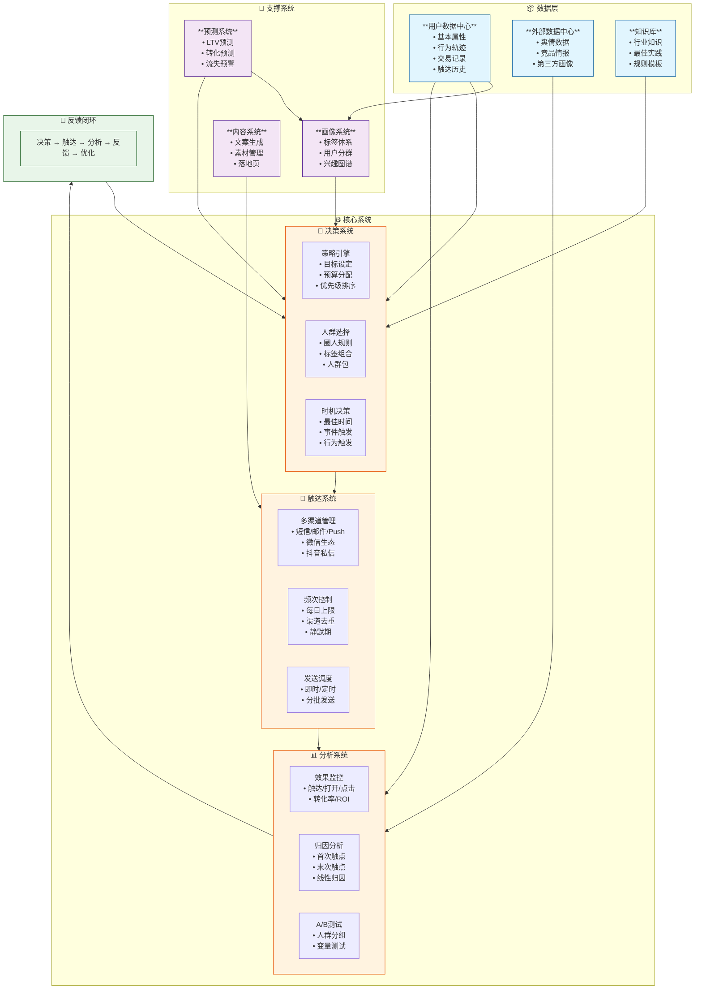
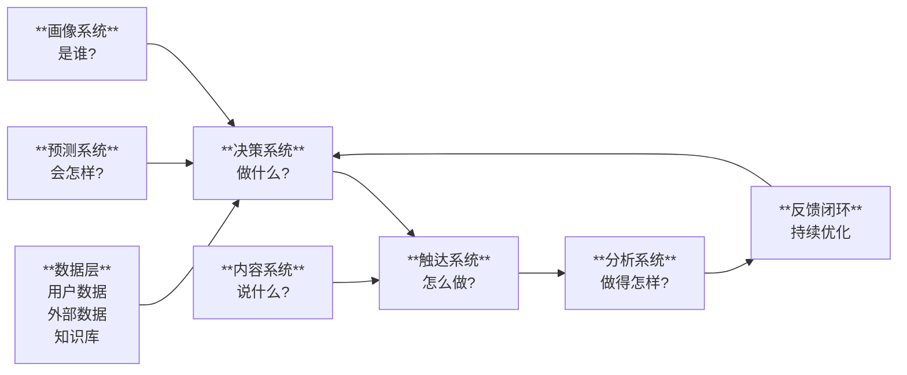
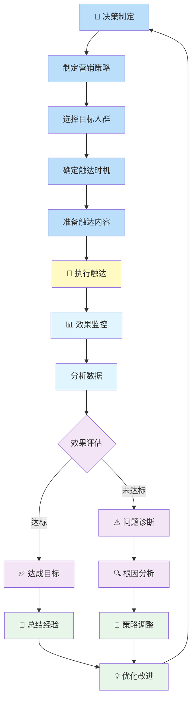

# 全自动营销系统架构

## 系统架构图

```mermaid
flowchart TB
    subgraph DATA["📦 数据层"]
        USER["
        **用户数据中心**
        • 基本属性
        • 行为轨迹
        • 交易记录
        • 触达历史
        "]
        EXTERNAL["
        **外部数据中心**
        • 舆情数据
        • 竞品情报
        • 第三方画像
        "]
        KB["
        **知识库**
        • 行业知识
        • 最佳实践
        • 规则模板
        "]
    end

    subgraph CORE["⚙️ 核心系统"]
        subgraph DECISION["🎯 决策系统"]
            STRATEGY["
            策略引擎
            • 目标设定
            • 预算分配
            • 优先级排序
            "]
            CROWD["
            人群选择
            • 圈人规则
            • 标签组合
            • 人群包
            "]
            TIMING["
            时机决策
            • 最佳时间
            • 事件触发
            • 行为触发
            "]
        end

        subgraph REACH["🚀 触达系统"]
            CHANNEL["
            多渠道管理
            • 短信/邮件/Push
            • 微信生态
            • 抖音私信
            "]
            FREQ["
            频次控制
            • 每日上限
            • 渠道去重
            • 静默期
            "]
            DISPATCH["
            发送调度
            • 即时/定时
            • 分批发送
            "]
        end

        subgraph ANALYSIS["📊 分析系统"]
            MONITOR["
            效果监控
            • 触达/打开/点击
            • 转化率/ROI
            "]
            ATTRIBUTION["
            归因分析
            • 首次触点
            • 末次触点
            • 线性归因
            "]
            AB["
            A/B测试
            • 人群分组
            • 变量测试
            "]
        end
    end

    subgraph SUPPORT["🔧 支撑系统"]
        PREDICT["
        **预测系统**
        • LTV预测
        • 转化预测
        • 流失预警
        "]
        PROFILE["
        **画像系统**
        • 标签体系
        • 用户分群
        • 兴趣图谱
        "]
        CONTENT["
        **内容系统**
        • 文案生成
        • 素材管理
        • 落地页
        "]
    end

    subgraph FEEDBACK["🔄 反馈闭环"]
        LOOP["决策 → 触达 → 分析 → 反馈 → 优化"]
    end

    %% 数据流向
    USER --> DECISION
    USER --> PROFILE
    USER --> ANALYSIS
    EXTERNAL --> ANALYSIS
    KB --> DECISION

    %% 系统间流向
    DECISION --> REACH
    REACH --> ANALYSIS
    ANALYSIS --> FEEDBACK
    FEEDBACK --> DECISION

    PREDICT --> DECISION
    PREDICT --> PROFILE
    PROFILE --> DECISION
    CONTENT --> REACH

    %% 样式
    classDef data fill:#e1f5fe,stroke:#01579b
    classDef core fill:#fff3e0,stroke:#e65100
    classDef support fill:#f3e5f5,stroke:#4a148c
    classDef feedback fill:#e8f5e9,stroke:#1b5e20

    class USER,EXTERNAL,KB data
    class DECISION,REACH,ANALYSIS core
    class PREDICT,PROFILE,CONTENT support
    class FEEDBACK,LOOP feedback
```

---

## 系统关系图

```mermaid
flowchart LR
    A["
    **数据层**
    用户数据
    外部数据
    知识库
    "] --> B["
    **决策系统**
    做什么?
    "]
    B --> C["
    **触达系统**
    怎么做?
    "]
    C --> D["
    **分析系统**
    做得怎样?
    "]
    D --> E["
    **反馈闭环**
    持续优化
    "]
    E --> B

    F["
    **预测系统**
    会怎样?
    "] --> B
    G["
    **画像系统**
    是谁?
    "] --> B
    H["
    **内容系统**
    说什么?
    "] --> C
```

---

## 反馈闭环详解

```mermaid
flowchart TB
    START["📌 决策制定"] --> STEP1["制定营销策略"]
    STEP1 --> STEP2["选择目标人群"]
    STEP2 --> STEP3["确定触达时机"]
    STEP3 --> STEP4["准备触达内容"]

    STEP4 --> EXEC["🚀 执行触达"]
    EXEC --> MONITOR["📊 效果监控"]
    MONITOR --> ANALYZE["分析数据"]

    ANALYZE --> ASSESS{"效果评估"}
    ASSESS -->|达标| SUCCESS["✅ 达成目标"]
    ASSESS -->|未达标| ISSUE["⚠️ 问题诊断"]

    SUCCESS --> FEEDBACK["📝 总结经验"]
    ISSUE --> ROOT["🔍 根因分析"]
    ROOT --> ADJUST["🔧 策略调整"]

    FEEDBACK --> IMPROVE["💡 优化改进"]
    ADJUST --> IMPROVE
    IMPROVE --> START

    classDef start fill:#bbdefb
    classDef exec fill:#fff9c4
    classDef monitor fill:#e1f5fe
    classDef decision fill:#f3e5f5
    classDef improve fill:#e8f5e9

    class START,STEP1,STEP2,STEP3,STEP4 start
    class EXEC exec
    class MONITOR,ANALYZE monitor
    class ASSESS,SUCCESS,ISSUE,ROOT decision
    class FEEDBACK,ADJUST,IMPROVE improve
```
