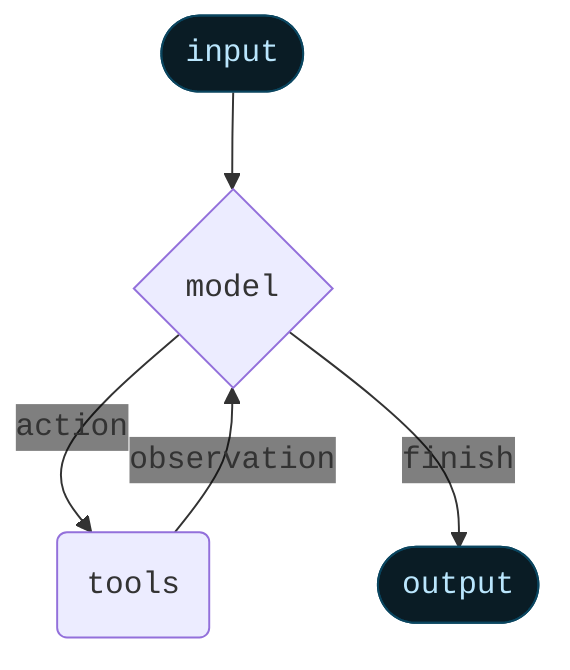

## Agents

智能体将语言模型与工具结合起来，创建能够推理任务、决定使用哪些工具并迭代寻找解决方案的系统。

### 核心组件

* Model
  * Static model
  * Dynamic model

* Tools
  * Multiple tool calls in sequence (triggered by a single prompt)
  * Parallel tool calls when appropriate
  * Dynamic tool selection based on previous results
  * Tool retry logic and error handling
  * State persistence across tool calls

For more information, see [Tools](/oss/python/langchain/tools).