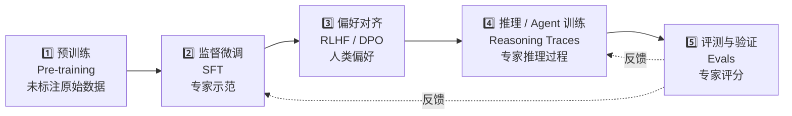

# 前言：为什么写这篇文章

在 [[Mercor_深度调研_20260903.md]] 的调研过程中，最常被问到的不是 "Mercor 怎么估值"，也不是 "AI 面试怎么做"，而是更基础的问题：

> "Mercor 卖的是数据对吧？但 OpenAI / Anthropic 训练大模型的数据不全都是标注的吧？到底什么算 '标注'？"

这些看似基础的问题，**实际上是理解整个 AI 数据产业链的入口**。我尝试用一篇文章把这些问题讲透，作为 Mercor 调研报告的姊妹篇。

阅读完这篇文章，你会理解：

1. 行业里到底有多少种 "数据"，各自扮演什么角色；
2. Mercor / Scale AI / Surge AI 卖的是哪一类，**为什么这一类的单价能到 $200/小时**；
3. 国内做类似业务，**应该聚焦哪一类、避开哪一类**。

---

# 一、先纠正术语："知识标注" 不是一个标准行业名词

在 AI 训练数据领域，行业里实际使用的是下面这一组术语：

| 中文术语 | 英文 | 含义 | 典型场景 |
|---|---|---|---|
| **数据标注** | Data Annotation / Labeling | 给原始数据打标签（画框、转写、分类） | 图像识别、语音转写、文本分类 |
| **数据采集** | Data Collection | 按需采集新的原始数据 | 无人车路采、特定人群访谈录音 |
| **人类反馈强化学习** | RLHF | 让人类对模型输出排序打分，训练 reward model | ChatGPT 早期对齐的核心方法 |
| **监督微调数据** | SFT | 专家写的高质量 "问题→答案" 示范 | 让模型学会回答特定领域问题 |
| **偏好数据** | DPO / Preference Data | 同一问题的两种答案 + 人类偏好 | 让模型学会 "哪个回答更好" |
| **推理轨迹** | Reasoning Traces / CoT | 专家一步步写出推理过程的样本 | 训练 o1 / o3 类推理模型 |
| **评测数据** | Evals | 专家对模型输出按 rubric 评分 | APEX、SuperCLUE、HumanEval |
| **智能体轨迹** | Agent Trajectories | 人类专家操作 Agent 的工具调用序列 | 训练 Agent 完成多步任务 |
| **红队对抗** | Red Teaming | 人类故意攻击模型找漏洞 | 安全测试、越狱检测 |

**你说的 "知识标注"，按字面意思最接近的是 "expert annotation"（专家级标注）或 "knowledge work labeling"（知识工作型标注）**——也就是上表中 SFT / RLHF / CoT / Evals 这一组，而不是传统的 "画框 / 转写" 那种 "苦力标注"。

Mercor 卖的就是这一类。**它和传统数据标注公司（海天瑞声、数据堂、Appen）的本质区别就在这里**——传统公司做的是 "给原始数据贴标签"，Mercor 做的是 "请专家产出 AI 想要学的内容"。

> 注：如果你确实想问 "知识图谱标注"（Knowledge Graph Annotation），那是给知识图谱做实体关系标注，属于完全不同的领域，跟 Mercor 没太大关系。

---

# 二、一个大模型完整的训练流程要吃 5 类数据

很多非从业者把 "训练 AI" 想成一件单一的事，但实际上 **GPT-5 级别的模型训练是一个 5 阶段的流水线，每一阶段吃不同类型的数据**：

下面分别讲每一类。

## 2.1 预训练数据（Pre-training Data）

**这一类数据 99% 是没有标注的原始文本/图片/音频。**

- 来源：Common Crawl 网页爬虫、GitHub 代码库、arXiv 论文、电子书、新闻存档、视频字幕……
- 典型规模：Llama 3 用 ~15 万亿 token [1]，GPT-4 据传用 ~13 万亿 token；
- 单位成本：基本接近 0（爬虫免费）或几美分 / 百万 token；
- 关键特征：**量大、便宜、几乎不标**。

预训练是大模型训练的 "地基"，决定了模型的 "通识" 水平——能不能写通顺的句子、能不能理解基本的世界知识。但 **2024 年以后，所有前沿实验室都发现单纯堆预训练数据的边际收益已经接近 0**——把数据从 10 万亿 token 翻倍到 20 万亿 token，模型能力提升不到 5%。

**所以 "预训练数据" 不是一个有商业机会的赛道**，它被 OpenAI / Anthropic / Google 这种大厂自己垄断（自己有爬虫、有算力、有人工标注预算）。

## 2.2 监督微调数据（SFT Data）

**这一类数据 100% 是专家示范——人类专家写出 "问题→答案" 的成对样本**。

- 例子：一个 PhD 化学家被问 "解释苯环的亲电取代反应机理"，写出 ~500 字的标准答案；
- 典型规模：100 万-1 亿条样本；
- 单位成本：$1-10 / 条（取决于领域专业度）；
- 关键特征：**质量比量重要，专家比众包重要**。

SFT 数据的作用是 "教模型怎么回答问题"——让模型从 "会续写句子" 升级到 "会按人类期望的方式回答"。**这是 Mercor / Surge AI / Scale AI 的主战场之一**。

## 2.3 偏好对齐数据（RLHF / DPO Data）

**这一类数据 100% 是人类的偏好判断**。

- 例子：同一个问题 "写一首关于秋天的诗"，模型给出 A、B 两个回答，专家按 "哪个更好" 排序；
- 典型规模：10 万-1000 万对比较；
- 单位成本：$3-15 / 对；
- 关键特征：**专家之间的判断一致性比答案的专业度更重要**。

RLHF 是 ChatGPT 早期 "对齐" 的核心技术——它让模型学会 "哪个回答更符合人类偏好"。**OpenAI 早期用的 RLHF 数据集是行业转折点**，直接催生了 ChatGPT 的成功，也让 Scale AI 成为 2021-2023 年最重要的 AI 数据供应商。

## 2.4 推理 / Agent 轨迹数据（Reasoning Traces / Agent Trajectories）

**这一类数据是 2024-2026 年增长最快、单位价值最高的部分**。

- 例子：一个 PhD 数学家被问 "证明黎曼猜想的一个简化版本"，写出 ~2000 字的逐步推理 trace；或者一个投行 VP 被要求 "为这笔并购案建模 DCF"，写下 ~500 字的 Excel 操作步骤；
- 典型规模：10 万-100 万条；
- 单位成本：**$30-500 / 条**；
- 关键特征：**单条样本的信息密度极高，是预训练数据的 100-1000 倍**。

这一类数据直接对应 OpenAI o1/o3、Anthropic Claude reasoning、DeepSeek R1 这些 **"推理模型"** 的训练。**Mercor 增长最快的业务线就是这一类**，也是为什么 Anthropic / Google 在 2025-2026 年成为 Mercor 前 2 大客户。

## 2.5 评测数据（Eval Data）

**这一类数据 100% 是专家按 rubric 评分**。

- 例子：让 GPT-5 和 Claude Opus 4.5 分别写一份法律意见书，由 5 位资深律师独立打分（0-10 分），输出对比报告；
- 典型规模：数千-数 万条；
- 单位成本：**$50-500 / 条**；
- 关键特征：**质量要求最高，关系到 AI 公司自己的模型评估报告可信度**。

这一类数据的买家主要是 AI 实验室自己（用来发布自家模型的 leaderboard）和企业 AI 团队（用来选型）。**APEX 系列基准（Mercor）、SuperCLUE（中文）、LiveBench、HumanEval 都是这个赛道的产物**。

---

# 三、5 类数据全景对比

把上面 5 类数据放在一起对比，可以看出 **"标注" vs "未标注" 远不是一个 0/1 的区别，而是 5 个完全不同的子市场**：

| 类别 | 是否标注 | 体量规模 | 单位成本 | 主要来源 | Mercor / Scale 占比 |
|---|---|---|---|---|---|
| **预训练** | ❌ 几乎全是未标注 | 10-100 万亿 token | 极低（爬虫免费） | Common Crawl、GitHub、arXiv | 0% |
| **监督微调 SFT** | ✅ 100% 专家示范 | 100 万-1 亿条 | $1-10 / 条 | 内部标注 + Mercor / Surge | 30-40% |
| **偏好对齐 RLHF / DPO** | ✅ 100% 人类偏好 | 10 万-1000 万对 | $3-15 / 对 | Mercor / Surge / Scale | 40-50% |
| **推理 / Agent 轨迹** | ✅ 100% 专家生成 | 10 万-100 万条 | $30-500 / 条 | Mercor 核心业务 | **80%+** |
| **评测 Evals** | ✅ 100% 专家评分 | 数千-数 万条 | $50-500 / 条 | APEX、SuperCLUE、内部 | 100% |

**关键观察**：

1. **从预训练到评测，"标注比例" 从 0% 升到 100%，"单位价值" 上升 3-5 个数量级**；
2. **Mercor / Scale / Surge 占据的几乎全部是 "高价值" 部分**（SFT / RLHF / CoT / Evals），而不是 "低价值" 部分（预训练）；
3. **预训练数据是规模游戏，标注数据是质量游戏**——前者赢者通吃，后者可以分赛道胜出。

---

# 四、正面回答：OpenAI / Anthropic 买的数据全是标注的吗？

**不是的。**

实际的钱是怎么花的？根据 The Information、Sacra 和 Mercor 自己的公开数据 [2][3][4]：

- **OpenAI / Anthropic 整体训练预算**：
  - 预训练算力 + 数据 ≈ 60-70%（但数据本身接近 0 边际成本，主要是 GPU / 电费贵）；
  - **后训练（RLHF + CoT + SFT）≈ 20-30%，是 Mercor / Surge 真正在抢的部分**；
  - 评测 ≈ 5%；
- **Mercor 2026 H1 营收 ≈ 6.14 亿美元**（年化 ~12 亿）[2]——这只是整个 AI 数据产业链里 "专家标注" 这一小块。

**举个具体例子**：

> OpenAI 训练 GPT-5 据传花了 **几十亿美元**。其中：
>
> - 算力 + 电费 ≈ 80%（$20-40 亿）；
> - 预训练数据采购 ≈ 2%（几亿美元，主要是合规清洗）；
> - **后训练专家数据（Mercor / Scale / Surge 抢的部分）≈ 10-15%**（几亿美元）；
> - 评测 ≈ 3%。

也就是说，**Mercor / Scale / Surge 三家加在一起，每年从 OpenAI / Anthropic / Google 拿走的总盘子大概在 $30-50 亿美元量级**——这跟很多人想象的 "AI 数据是千亿美元市场" 是不一样的。

但**单位经济完全不一样**：

- 卖 1 万亿 token 预训练数据给 OpenAI，可能只赚 $1 亿（被 Common Crawl 挤压到几乎没利润）；
- 卖 10 万条专家推理 trace 给 OpenAI，能赚 $1 亿（**每条 $1000+**，且基本没有竞争）。

---

# 五、为什么 "专家数据" 单价这么高？

这是个非常反直觉的事——为什么一个人类专家花 1 小时写出的几百字内容，能值几百美元？我用三个角度解释。

## 5.1 经济学角度：稀缺性的非对称性

地球上有 50 亿人能写普通文本（爬虫随便抓），但**只有 ~5000 万持证医师 / 律师 / PhD / 资深工程师** 能写出对训练 AI 有价值的高质量专业内容。

这一类人就算时薪 $200，也比爬虫数据稀缺 10000 倍——**供给曲线决定了价格**。

Mercor 的策略本质是：**把稀缺性货币化**。一个印度律师给美国 AI 实验室写 1 小时法律分析，市场上几乎没有替代供应商，定价权完全在 Mercor 一边。

## 5.2 信息论角度：信息熵的差异

爬虫数据里 99% 是模板化的废话（"Click here to buy"、商品描述、SEO 软文、复读机般的论坛回复）。**一个 PhD 写的推理 trace 每一行都包含大量 "高密度新信息"**——这是 Shannon 信息论意义上的真实差异，不是营销话术。

**用 token 等效的概念来量化**：

| 数据类型 | 1000 token 中的 "新信息" 占比 | 信息密度倍率 |
|---|---|---|
| 普通网页爬虫 | ~5% | 1× |
| 知乎高质量回答 | ~30% | 6× |
| 资深工程师的代码评审 | ~60% | 12× |
| PhD 的推理 trace | ~80% | **16×** |
| 资深律师的法律意见书 | ~90% | **18×** |

**Mercor 卖的本质上是 16-18 倍的信息密度**，定价当然不一样。

## 5.3 商业角度：替代成本极高

假设你是 OpenAI 的训练负责人，你想让 GPT 在 "处理复杂并购合同" 任务上达到资深律师的水平：

- **不需要专家数据的方案**：把模型做到 AGI 水平（成本：百亿美元级 + 5-10 年）；
- **用 Mercor 专家数据的方案**：每年花 $5000 万-1 亿美元采购 10 万小时律师级 RLHF + CoT 监督数据。

**人类专家数据是 "便宜的捷径"**——这就是它的定价逻辑。

对 OpenAI 来说，**花 $1 亿买专家数据 vs 多花 $100 亿 + 5 年等 AGI 突破**，前者显然划算。这就是为什么 Mercor 的客户愿意付 $95-200/小时的专家时薪——对客户来说这是 "ROI 最高" 的资本支出。

---

# 六、对国内创业 / 投资人的具体启示

## 6.1 选赛道时，先问 "我要卖哪一类数据"

国内很多 AI 数据公司（包括海天瑞声）目前主要在做 "传统标注"（图像、语音、文本转写），**这部分的红海已经被压到 $0.5-3/小时**（看 BOSS 直聘上的 "数据标注" 招聘信息 [5]）。

**你真正应该做的，是 Mercor 那一类 "专家生成 + RLHF + CoT + 评测"**——国内做这部分的玩家还很少。

具体而言，按 "客户单价 / 单位价值" 排序：

1. **评测 Evals**（客单价最高，但需要权威性）——参考 APEX、SuperCLUE；
2. **推理 / Agent 轨迹**（增长最快、单位价值高）——Mercor 核心业务；
3. **偏好对齐 RLHF / DPO**（量最大）——Scale AI / Surge AI 主战场；
4. **监督微调 SFT**（稳定增长）——传统标注公司转型方向；
5. **预训练数据**（除非你有自己的大模型业务，**不要碰**）。

## 6.2 客户的付费意愿差异巨大

| 数据类型 | 国内客户的心理价位 | 你能赚到的毛利 |
|---|---|---|
| 传统标注（画框/转写） | 1-5 元/条 | 20-40% |
| 专家 SFT / RLHF | 50-500 元/条 | 50-70% |
| 推理 trace / Agent trajectory | 1000-5000 元/条 | 60-80% |
| 评测 | 5000-50000 元/个 benchmark | 70-90% |

**你的客户结构决定你的客单价，决定你能不能撑得起 "持证专家池" 的固定成本**。如果只能接到第一类的活，是养不起 1000+ 持证医师律师的。

## 6.3 真正的客户群不是 "大模型厂商"，而是 "行业大模型 + 政企 AI 落地"

中国大模型厂商（智谱、月之暗面、MiniMax 等）目前 RLHF 预算确实在涨，但**单一客户的预算量级比 OpenAI 小 1-2 个数量级**。你的真正机会在：

- **金融大模型**（中信、招行、平安的 AI 团队）——需要 "金融领域专家标注 + 评测"；
- **法律大模型**（北大法宝、华宇等）——需要 "资深律师级 RLHF"；
- **医疗大模型**（京东、医联等）——需要 "三甲主任医师级 RLHF"；
- **政企 AI 转型**（央企 / 国企的 AI Agent 项目）——需要 "行业专家示范 + Agent 评测"。

**这 4 类客户每一类都是 10-50 亿 ARR 的潜在市场**，且分散度高，正好规避 Mercor 那种 "客户集中度 91%" 的结构性风险。

## 6.4 警惕 "数据工厂" 模式的边际陷阱

如果你做的是 "人海战术 + 平台抽佣"（Mercor 模式），你的固定成本主要是：

- AI 面试系统（一次性 ~500 万人民币研发）；
- 专家招募 + 合规（每年 ~1000 万人民币）；
- 付款 + 履约系统（每年 ~300 万人民币）；
- 销售 + 客户成功（每年 ~500 万人民币）。

**总固定成本约 2500 万人民币 / 年**。在客单价 50 元 / 条的市场上，你需要 **50 万条有效样本 / 年** 才能打平；在客单价 5000 元 / 条的市场上，你只需要 **5000 条 / 年**——后者更容易做到，因为客户更少、单笔更大、对质量更敏感。

**所以 "走专家路线" 反而比 "走规模化路线" 在国内更可行**。

---

# 七、常见误解的澄清

## 误解 1：AI 公司买的数据越多越好

**错**。2024 年以后，"数据量" 已经不重要了——**数据质量和数据多样性** 才是核心瓶颈。一个博士写的 1000 字推理 trace，价值可能超过 1000 万 token 爬虫数据。

## 误解 2：标注 = 画框 = 苦力活

**部分对，但过时了**。2016-2022 年的数据标注确实是 "画框 / 转写 / 打标签"，时薪 5-15 美元。但 2024 年以后，高价值标注已经变成 "博士写推理 / 律师审合同 / 医生诊断" 这种知识工作，时薪 100-500 美元。

## 误解 3：开源数据集可以替代付费数据

**部分对，但有天花板**。开源数据集（如 MMLU、HumanEval、SuperCLUE）适合做 "通用能力评测"，但 **垂直领域（金融 / 法律 / 医疗 / 政企）的高质量数据几乎不可能开源**——因为涉及到客户隐私、商业机密、监管限制。

## 误解 4：标注数据可以由 AI 自动生成

**部分对，但有上限**。合成数据（synthetic data）确实能解决 "量" 的问题，但 **"质" 的问题——特别是 "高经济价值任务" 的专家判断——目前还无法由 AI 完全替代**。这是因为：AI 训练的目标函数就是 "拟合人类判断"，而 "什么是好判断" 这个 meta-level 问题，必须由人类来回答。

---

# 八、总结

| 问题 | 答案 |
|---|---|
| 什么是 "知识标注"？ | 不是标准术语。最接近 "专家级标注 / expert annotation"，即 SFT / RLHF / CoT / Evals 这类 |
| OpenAI/Anthropic 买的数据全是标注的吗？ | **不是**。预训练数据 95%+ 是未标注爬虫；但后训练 + 评测 100% 是标注 / 专家生成的——而这正是 Mercor 卖的部分 |
| 标注数据 vs 未标注数据哪个更值钱？ | 单位价值：**标注数据贵 100-1000 倍**；总体价值：**预训练未标注数据占训练预算大头，但增长见顶**；标注数据是增量主战场 |
| Mercor / Scale / Surge 卖的是哪类？ | 主要卖后 4 类（SFT / RLHF / CoT / Evals），不卖第 1 类（预训练） |
| 对国内创业的启示？ | 避开传统标注红海，聚焦专家级后训练数据；客户从 "大模型厂商" 转向 "行业大模型 + 政企 AI"；走专家路线而不是规模化路线 |

---

# 九、推荐阅读

如果你想进一步深入某个子话题：

1. **Mercor 深度调研**：[[Mercor_深度调研_20260903.md]]——本文的姊妹篇，重点在商业模式 / 技术架构 / 融资历史 / 中国复制可行性。
2. **Mercor Monty 工程博客** [6]：AI 面试系统的工程实现细节。
3. **Mercor Payments 系统博客** [4]：年化 $7 亿流水的支付系统如何设计。
4. **APEX 评测白皮书** [7]：Mercor 的 AI 能力评测方法论。
5. **SuperCLUE 月报** [8]：中文大模型评测基准。
6. **Llama 3 技术报告** [1]：了解预训练数据的规模和类型。

---

# 引用

[1] Meta AI. "The Llama 3 Herd of Models" (2024). <https://arxiv.org/abs/2407.21783>

[2] The Information. "Mercor's Fast Growth Relies on Biggest AI Companies, Documents Show". <https://www.theinformation.com/articles/mercors-fast-growth-relies-biggest-ai-companies-documents-show>

[3] Sacra. "Mercor revenue, valuation & funding". <https://sacra.com/c/mercor>

[4] Mercor Blog. "When you go from $2 million a month to $2 million a day". <https://www.mercor.com/blog/when-you-go-from-2-million-a-month-to-2-million-a-day>

[5] BOSS 直聘. "数据标注员招聘信息". <https://www.zhipin.com/zhaopin/544b9f148959ee780HR92N-8>

[6] Mercor Engineering Blog. "Engineering Monty: Scaling an AI Interviewer". <https://www.mercor.com/blog/monty-engineering-deep-dive>

[7] arXiv. "The AI Productivity Index (APEX)". <https://arxiv.org/html/2509.25721v1>

[8] SuperCLUE. "中文大模型基准测评 2025 年 9 月报告". <https://www.cluebenchmarks.com/superclue_2509>

---

# 附录：本文章与 Mercor 调研报告的关系

本文是 [[Mercor_深度调研_20260903.md]] 的**姊妹篇 / 前置读物**。

- 如果你**还没读过** Mercor 调研报告，建议先读本文——本文解释了 "Mercor 卖的数据到底是什么"；
- 如果你**已经读过** Mercor 调研报告，本文补齐了 "AI 训练数据全景" 的基础框架，帮助你理解 Mercor 在整个产业链中的位置；
- 两份报告的**目标读者都是**：计划在 AI 数据赛道创业 / 投资 / 战略决策的从业者。

---

> **声明**：本文基于 2026-09-03 时点的公开信息撰写。所有 "市场数据"、"定价基准" 均来自公开报道，可能因后续事件而显著变化。"标注数据 vs 未标注数据" 的 5 类划分是当前业界共识，但随着多模态、Agent、AGI 等新范式发展，分类边界可能会进一步演化。
