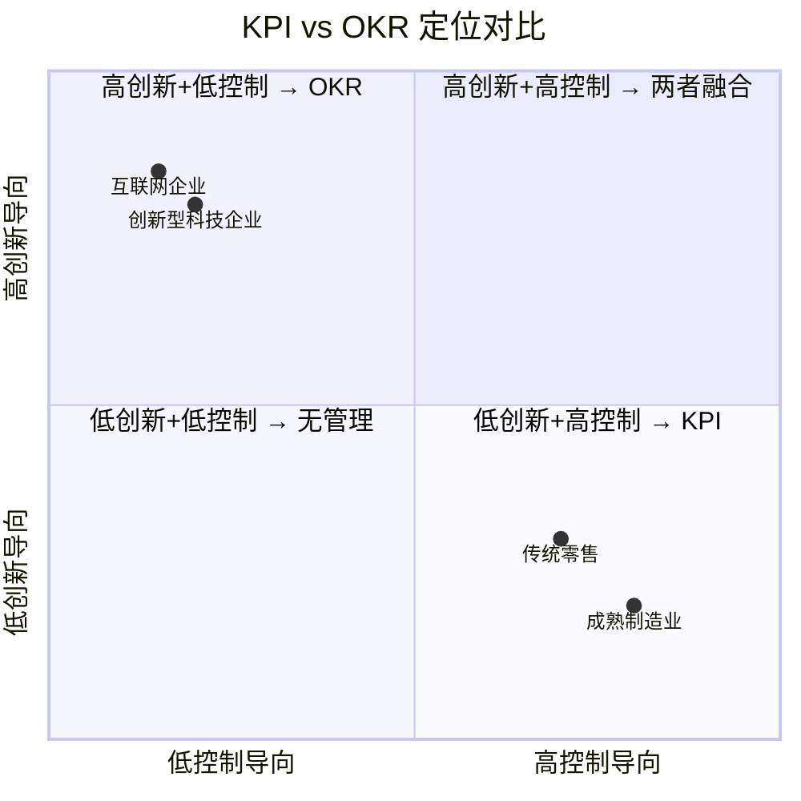

> **报告日期**: 2026-04-13
> **研究方式**: 文献综述 + 行业实践分析
> **适用范围**: 企业绩效管理体系设计与优化参考

---

## 执行摘要

OKR（Objectives and Key Results，目标与关键成果法）与 KPI（Key Performance Indicators，关键绩效指标）是当今企业绩效管理领域最核心的两套目标管理框架。本报告通过系统梳理两者的起源脉络、理论基础与实践差异，结合国内外大量企业实施案例，从目标定位、制定逻辑、评价体系、适用场景四大维度展开深度对比分析。

研究发现，OKR 与 KPI 并非简单的优劣之分，而是服务于不同管理哲学与组织发展阶段的管理工具。KPI 源于工业化时代泰勒科学管理原理，强调量化控制与结果达成，适合业务成熟、环境稳定的组织；OKR 起源于德鲁克目标管理理论，由英特尔安迪·葛洛夫发明、约翰·杜尔在谷歌发扬光大，强调战略对齐、挑战性目标与创新驱动，适合快速变化、需要突破性成长的组织 [1][2]。

在数字化转型加速的 2025 年，单纯依赖其中一种工具已难以满足复杂商业环境的需求。越来越多的企业开始探索 OKR 与 KPI 的智能化融合路径——以 OKR 进行战略顶层设计，以 KPI 量化执行落地，两者在 AI 技术支撑下实现数据互通与动态校准。本报告最后针对不同发展阶段、不同行业特征的企业提出了差异化选择建议。

---

## 一、引言

### 1.1 研究背景

绩效管理是企业战略落地的核心抓手。传统绩效管理以年度考核为主，强调结果导向与量化评估；然而在VUCA（易变性、不确定性、复杂性、模糊性）成为商业环境常态的今天，越来越多的企业发现传统 KPI 体系的局限性——过度聚焦短期目标、抑制创新活力、难以适应快速变化。

与此同时，以谷歌、字节跳动等科技企业为代表的 OKR 实践，在全球范围内引发了关于目标管理范式的重新思考。OKR 于 2014 年传入中国，2015 年后百度、华为、字节跳动等企业相继采用，至 2026 年已扩展至传统制造业领域 [1]。

### 1.2 研究范围与方法

本报告聚焦以下核心问题：

- OKR 与 KPI 的本质差异究竟是什么？
- 两种框架各自的优势与局限何在？
- 企业应如何根据自身情况做出选择？
- OKR 与 KPI 的融合实践是否可行？

研究方法以文献综述与案例分析为主，参考资料涵盖百度百科、知乎、行业专业报告及企业管理实践案例，所有引用均注明来源。

---

## 二、概念溯源与理论基础

### 2.1 KPI 的历史沿革

关键绩效指标（KPI）的理论基础可追溯至 20 世纪初的科学管理运动。其早期雏形与弗雷德里克·温斯洛·泰勒的**科学管理理论**密切相关——通过对工作进行分解并研究时间与动作，设定工人的工作量标准，形成了 KPI 的早期雏形 [3]。

进入 20 世纪中叶，**杜邦分析体系**的兴起将净资产收益率分解为多个财务比率，使企业能够从宏观层面评估整体绩效，推动了财务绩效评估的发展。同期，彼得·德鲁克的**目标管理（MBO）** 理论提出"企业目标应转化为可衡量的具体指标"，直接将 KPI 的发展推向体系化阶段 [1]。

KPI 的核心哲学是**控制与效率**。它假设：在相对稳定的环境中，通过设定明确、可量化的指标，能够最大程度地确保组织行为与企业目标保持一致。KPI 的设计遵循 SMART 原则——具体（Specific）、可衡量（Measurable）、可实现（Attainable）、相关性（Relevant）和时限性（Time-bound）[3]。其"二八原理"（即 80% 的工作任务由 20% 的关键行为完成）进一步强化了聚焦核心指标的思维方式。

### 2.2 OKR 的诞生与发展

OKR（目标与关键成果法）的历史可追溯至 1970 年代。**英特尔公司创始人安迪·葛洛夫**（Andy Grove）在应对半导体行业高度不确定性时，意识到传统 MBO 体系过于缓慢和官僚，无法适应快速变化的技术环境。于是他对 MBO 进行了创造性改造，提出将目标拆分为两件事：你想去哪里（Objective），以及你怎么知道自己到了那里（Key Results）[4]。

1999 年，**约翰·杜尔**（John Doerr）——时为英特尔 VP、后成为著名风险投资人——将这套方法带入了创立不到一年的谷歌公司，并在随后的二十多年里将其体系化。杜尔在 2018 年出版的《Measure What Matters》一书中系统阐述了 OKR 的方法论，使这一管理工具在全球范围内得到广泛传播 [2]。

OKR 的核心哲学是**对齐与突破**。与 KPI 不同，OKR 从一开始就不是作为绩效考核工具设计的——它是对齐工具。谷歌明确规定 OKR 不与薪酬和晋升直接挂钩，并认为 60%-70% 的完成率是健康的，100% 完成反而说明目标设定缺乏野心 [5]。

### 2.3 两者理论基础的本质区别

| 维度 | KPI | OKR |
|------|-----|-----|
| 管理哲学 | 科学管理：控制与效率 | 知识时代：对齐与突破 |
| 核心假设 | 环境稳定，结果可预测 | 环境不确定，需持续校准 |
| 目标性质 | 保守可达，需 100% 达成 | 野心挑战，鼓励 60-70% 达成 |
| 与薪酬关系 | 直接挂钩 | 完全脱钩 |
| 理论先驱 | 泰勒科学管理 + 德鲁克 MBO | 德鲁克 MBO + 葛洛夫目标管理 |

---

## 三、深度对比分析

### 3.1 目标定位：量化标尺 vs 挑战驱动

**KPI 以量化指标锚定运营效率**，如同一把刚性的量化标尺，将战略目标拆解为可执行的具体任务，确保个体行为与企业整体目标高度对齐。以半导体行业为例，某晶圆制造企业通过部署测试数据实时监控系统，将封装测试良品率提升至 99.8%，生产效率提高 30%——这种以结果为导向的指标体系，是稳定期业务的"压舱石"[6]。

**OKR 以挑战性目标激发突破创新**，更强调方向的正确性而非数值的精确性，鼓励团队跳出舒适区，探索突破性创新。某科技企业在 OKR 实践中设定了"构建行业首个 AI 驱动的智能制造平台"的战略目标，尽管季度目标完成率仅 65%，但过程中诞生的自适应调度算法使生产排程效率提升 40%，远超传统 KPI 体系的预期 [6]。

两者的根本差异体现在对"目标"的定义上：**KPI 关注"要我做的事"（要我做什么就做什么），OKR 聚焦"我要做的事"（监控我主动想做的事）**[1]。

### 3.2 制定逻辑：单向分解 vs 多维互动

**KPI 的制定遵循自上而下的单向分解逻辑**。企业战略目标逐级拆解为企业级 KPI、部门级 KPI、岗位级 KPI，每个岗位都有明确的量化指标。这种方式清晰高效，但容易陷入"指标传递陷阱"——上级指标层层下压，基层员工只关注短期数字，忽视战略本质 [6]。

**OKR 倡导多维互动的制定逻辑**。OKR 存在于公司、团队和个人三个层面，大多数目标由管理层定义，但鼓励自下而上的参与，且 60% 的目标最初来源于底层 [5]。在字节跳动的实践中，所有人的 OKR 全公司可见，入职第一天的实习生也能查看张一鸣的 OKR，透明本身成为了一种管理机制——社会压力替代了考核压力 [4]。

OKR 还引入了"OKR 集市"的概念：团队确认的 OKR 被放置在公共平台上，员工可以自由选择感兴趣的 OKR 来实施，这种自下而上的方式极大地激发了员工的主动性和创造力 [7]。

### 3.3 评价体系：结果强制 vs 过程引导

**KPI 强调结果导向**，必须 100% 完成，做不到就要承担相应后果。KPI 通常与薪酬、晋升直接挂钩，这种刚性约束确保了执行力度，但也可能导致员工为达成数字而采取短期行动，甚至出现"考核期末修改 KPI 甚至弄虚作假"的现象 [8]。

以某互联网公司为例，制定者错误地以"页面浏览量"来衡量"用户喜欢"，员工为完成 KPI 把原本在一个页面完成的事情分到多个页面，最终 KPI 达成了，用户反而更讨厌这个产品 [8]。这正是 KPI "过度量化"陷阱的典型案例。

**OKR 强调过程导向与持续复盘**。OKR 不与绩效考核直接挂钩，分数永远不是最重要的，重要的是"接下来怎么做"。谷歌建议每个季度的 OKR 得分在 0.6-0.7 之间；0.4 以下不意味着失败，而是需要判断项目是否应继续进行 [5]。这种设计极大降低了员工设定挑战性目标的心理负担，鼓励冒险和创新。

### 3.4 实施过程差异

| 维度 | KPI | OKR |
|------|-----|-----|
| **目标制定方式** | 领导制定，员工执行 | 上下级共同制定，全员参与 |
| **执行周期** | 通常年度固定 | 季度或月度灵活调整 |
| **目标调整** | 周期内基本不变 | 可动态校准和优化 |
| **数据透明度** | 通常保密，仅相关方知晓 | 全公司公开透明 |
| **协作方式** | 以部门为单位执行 | 跨部门目标对齐与协同 |
| **反馈频率** | 周期末评估 | 持续跟进与周期性复盘 |

---

## 四、各自优势与局限性

### 4.1 KPI 的优势与局限

#### KPI 的核心优势

**量化性强，便于衡量**：KPI 提供了具体的数值标准，通过明确的量化指标衡量绩效，便于跨时期、跨人员的比较与评估 [9]。这对需要精确管理运营效率的组织至关重要。

**持续性**：KPI 通常用于长期跟踪，有助于持续监控和改进业务流程，不因短期波动而频繁调整 [9]。稳定的指标体系使组织能够建立历史基准，进行趋势分析。

**与薪酬挂钩的激励效应**：当 KPI 与薪酬、晋升直接关联时，能够为员工提供清晰的努力方向和经济激励，在成熟稳定的业务环境中效果显著。

**明确性**：KPI 明确指出需要达成的具体数值或标准，易于理解和执行，降低了沟通成本 [9]。

#### KPI 的局限性

**过度量化**：KPI 可能过于关注可量化的指标，忽视难以量化但同样重要的业务方面 [9]。当"可测量"凌驾于"有价值"之上时，组织行为就会发生扭曲。

**可能导致短视行为**：员工可能为达成 KPI 而采取短期行动，损害长期利益。在快速变化的商业环境中，这可能导致组织错失战略性转型机会 [9]。

**更新频率低**：KPI 的设定通常不够灵活，难以快速适应市场和业务的变化，在需要敏捷应对的领域尤为受限 [9]。

**可能造成内部竞争**：当绩效直接与奖励挂钩时，KPI 可能导致员工之间不健康的竞争，损害团队协作精神 [9]。

### 4.2 OKR 的优势与局限

#### OKR 的核心优势

**灵活性**：OKR 允许快速适应变化，目标和关键结果可根据业务环境动态调整。2025 年，智能 OKR 工具已支持按月甚至按周调整关键成果，动态调整机制日益成熟 [10]。

**透明度**：OKR 鼓励全公司范围内的目标共享，增强团队协作与跨部门沟通。字节跳动的实践表明，透明本身就能产生管理效果 [4]。

**激励性**：通过设定具有挑战性的目标，OKR 能够激发员工的积极性和创造力，鼓励"跳一跳才能摸到"的进取精神。

**对齐性**：OKR 有助于确保个人目标与组织战略目标保持一致，将分散的精力聚焦于少数关键战略目标，减少内耗 [1]。

**驱动创新文化**：OKR 通常不与薪酬直接挂钩，这极大地降低了员工设定挑战性目标的心理负担，鼓励冒险和创新 [1]。

#### OKR 的局限性

**非强制性**：OKR 不直接与绩效考核挂钩，可能导致部分缺乏自我驱动的员工缺乏执行动力，对人才密度要求较高 [9]。

**过度自由**：OKR 的自由设定可能导致目标过于宽泛或不一致，如果没有良好的管理机制，容易出现目标碎片化问题。

**实施难度**：OKR 需要良好的沟通和协调机制，对于一些组织文化偏向控制导向的企业，实施起来可能比较困难 [9]。

**短期聚焦风险**：OKR 通常按周期（季度）设定，可能导致忽视长期战略目标，需要与战略规划进行有效衔接。

### 4.3 KPI 与 OKR 优劣势总览

---

## 五、适用场景分析

### 5.1 按企业发展阶段选择

| 发展阶段 | 推荐框架 | 理由 |
|---------|---------|------|
| **初创期 / 探索期** | OKR | 需要快速适应市场变化，鼓励创新和探索，员工通常自驱力强 |
| **快速扩张期** | OKR + KPI 融合 | 需要战略突破（OKR）与运营底线（KPI）并行 |
| **成熟稳定期** | KPI 为主，OKR 为辅 | 业务流程稳定，重点是效率提升与成本控制 |
| **转型期 / 衰退期** | OKR | 需要突破性变革，改变既有模式 |

初创企业或处于快速扩张阶段的企业通常更适合采用 OKR，因为它们需要不断创新和适应市场变化，更注重战略目标的实现和突破性发展 [11]。

成熟稳定期的企业可能更适合 KPI，因为它们注重业务的稳定性和效率，更关注可预测的业绩指标，已建立了较为完善的绩效评估体系 [11]。

### 5.2 按行业特征选择

**互联网 / 科技 / 创意行业**：更适合 OKR。这类行业业务模式变化快，需要不断创新，OKR 能更好地适应动态环境。例如，可以设定"用户增长 10 倍"这样的挑战性目标 [11]。

**制造业 / 传统服务业**：更适合 KPI。这类行业产品线成熟，生产流程稳定，KPI 能有效监控和管理生产、销售等环节的绩效，关注生产线效率、产品合格率等具体指标 [11]。

**金融 / 医疗**：可根据业务单元分别采用不同框架——创新业务线采用 OKR，成熟业务线采用 KPI。

### 5.3 按组织文化适配

**KPI 适合**的组织文化：强调纪律、规范和层级管理，结果导向、强调个人绩效，以控制为核心的管理哲学。

**OKR 适合**的组织文化：鼓励创新、开放和员工自主管理，以赋能和激发为核心的管理哲学，强调信任与透明 [11]。

---

## 六、OKR 与 KPI 融合实践

### 6.1 融合的理论基础

越来越多的企业意识到，OKR 与 KPI 并非"非此即彼"的对立关系，而是可以优势互补的管理工具组合。2025 年的行业趋势显示，约 85% 的高增长企业已采用季度甚至月度目标刷新机制，单一工具已难以满足复杂管理需求 [10]。

融合的核心逻辑是：**用 OKR 做战略，用 KPI 做执行**——OKR 聚焦战略突破与目标对齐，KPI 确保运营底线与执行落地 [10]。

### 6.2 融合模式案例

**案例一：Moka 绩效系统的动态权重融合**

Moka 绩效系统通过动态权重算法实现 OKR 与 KPI 的有机结合。某互联网企业在制定"年度用户增长 30%"的 OKR 时，系统自动拆解出"月活增长率 ≥8%"、"新用户留存率 ≥45%"等 KPI 指标，确保战略可执行。最终数据显示，融合模式使企业战略目标传递准确率从 65% 提升至 91% [10]。

**案例二：制造企业的分层融合**

某制造企业在季度考核中，对管理层采用 OKR 评估战略落地效果，对执行层采用 KPI 监控生产指标。考核周期从 4 周缩短至 2 周，目标完成率提升 22% [10]。

**案例三：智能拆解引擎**

2025 年，AI 技术使 OKR 与 KPI 的融合进一步智能化。通过自然语言处理（NLP）解析企业战略文件，系统自动生成符合 SMART 原则的 OKR 目标集，并基于组织架构图谱将目标智能拆解为各部门 KPI 指标，实现"战略-目标-指标"的自动转化 [10]。

### 6.3 融合的注意事项

需要特别指出的是，**并非所有"融合"都是真正有效的融合**。有一种做法是把 OKR 的方法论用于确定目标，再用 KPI 的方法论确定权重和行动举措——这种"拉郎配"的做法实际上会改变 OKR 的初衷，最终沦为另一种形式的 KPI，无法达到预期效果 [1]。

真正的融合需要保持两套工具各自的核心逻辑：**OKR 保持与考核的脱钩**，**KPI 保持量化的刚性**。融合不是混合，而是在不同管理层面使用最适合的工具。

---

## 七、2025-2026 年新趋势

### 7.1 AI 驱动的目标管理智能化

2025 年，OKR 管理平台开始集成 AI 智能辅助功能。通过大数据分析实现目标智能推荐、进度异常预警、战略文件自动解析等技术创新。飞书 OKR、钉钉蒲公英 OKR 等专业工具逐步普及，提供目标对齐、进度跟踪、智能诊断等全流程支持 [1]。

AI 还带来了预测性绩效分析——系统通过 200+ 行为数据点预测员工未来 6 个月表现，准确率达 75%，使绩效管理从事后评估转变为事前预警 [10]。

### 7.2 持续绩效对话的兴起

传统的年度评估正在被持续对话所取代。集成在企业微信/钉钉中的轻量化工具使 1 对 1 沟通频次提升 3 倍。AI 助手能分析沟通记录，识别潜在冲突并提供改善建议，某制造企业借此将困难对话处理时间缩短 40% [10]。

### 7.3 绩效管理的范式转变

绩效管理正从"考核工具"进化为"发展引擎"。系统不再仅是目标追踪工具，而是演变为员工发展平台，提供个性化发展建议、导师匹配、晋升路径推荐等功能 [10]。核心岗位继任准备度提升 55%，员工留存率显著改善。

---

## 八、综合建议

### 8.1 选择决策框架

企业在选择 OKR 和 KPI 时，建议按以下优先级进行评估：

1. **评估组织发展阶段**：探索期选 OKR，成熟稳定期选 KPI
2. **分析业务特征**：创新业务用 OKR，运营业务用 KPI
3. **审视组织文化**：开放创新文化适合 OKR，控制规范文化适合 KPI
4. **考量员工特质**：知识型/自驱型员工适合 OKR，执行型员工适合 KPI
5. **明确管理目标**：追求突破用 OKR，追求稳定用 KPI

### 8.2 分层实施建议

| 组织层级 | 推荐方案 | 实施重点 |
|---------|---------|---------|
| 公司战略层 | OKR | 方向对齐，突破性目标设定 |
| 部门管理层 | OKR + KPI 融合 | 战略承接与运营保障并重 |
| 执行层岗位 | KPI 为主 | 明确指标，量化考核 |
| 创新研发岗位 | OKR | 探索性目标，过程激励 |

### 8.3 实施 OKR 的关键成功要素

基于谷歌、字节跳动等企业的成功经验，OKR 实施需关注以下要素 [5][12]：

1. **获得管理层承诺**：OKR 必须是自上而下的战略决策，而非 HR 部门的单独行动
2. **保持与考核脱钩**：这是 OKR 有效性的根基，脱钩一旦打破，激励效应随之消失
3. **全公司透明公开**：透明本身即管理，社会压力替代考核压力
4. **目标要有野心**：鼓励设定"跳一跳才能摸到"的目标，0.6-0.7 的完成率是健康的
5. **建立复盘机制**：周期性的 OKR 复盘比完成率本身更重要
6. **循序渐进推进**：建议从试点团队开始，逐步扩展至全公司

---

## 九、局限性与未来展望

### 9.1 研究局限性

本报告存在以下局限性：

- 研究以中文互联网公开资料为主，部分引用来自企业营销内容，可能存在一定偏差
- OKR 与 KPI 的融合实践尚处于早期阶段，长期效果有待更多实证数据验证
- 不同行业的对比分析深度不一，互联网和科技行业案例较为丰富，传统行业案例相对薄弱
- 2025-2026 年 AI 与绩效管理融合趋势尚处发展早期，部分技术应用处于早期探索阶段

### 9.2 未来展望

展望未来，绩效管理领域可能出现以下趋势：

- **AI 全流程嵌入**：从目标设定、进度追踪到绩效评估，AI 将深度参与每个环节
- **实时反馈常态化**：年度评估将彻底让位于持续绩效对话
- **融合模式标准化**：OKR 与 KPI 的融合将形成更成熟的实施方法论
- **员工发展引擎化**：绩效管理从评判工具进化为个人成长平台

---

## 十、参考文献

[1] 百度百科. OKR. https://baike.baidu.com/item/OKR/2996251

[2] 百度百科. 这就是OKR. https://baike.baidu.com/item/这就是OKR/23272300

[3] 百度百科. 关键性能指示器. https://baike.baidu.com/item/关键性能指示器/3379823

[4] 百家号. OKR死于2026. https://baijiahao.baidu.com/s?id=1862223304115478352

[5] 哔哩哔哩. 谷歌绩效考核方式OKR. https://www.bilibili.com/read/cv28481613/

[6] 百家号. KPI与OKR:解码企业目标管理的双引擎. https://baijiahao.baidu.com/s?id=1860602252688334203

[7] CSDN. 2024年Go最新OKR和KPI的区别. https://blog.csdn.net/2401_84926700/article/details/138832828

[8] 知乎. OKR与KPI的优劣对比，哪个比较好？. https://zhuanlan.zhihu.com/p/712620911

[9] 百家号. OKR与KPI的优劣对比如何？. https://baijiahao.baidu.com/s?id=1819830595016409086

[10] Moka. 2025绩效系统趋势报告：OKR与KPI的智能化融合. https://www.mokahr.com/blog/25912.html

[11] 百家号. OKR与KPI：企业绩效管理方法的选择指南. https://baijiahao.baidu.com/s?id=1829450809939215289

[12] 知乎. 目标管理分不清OKR和KPI？一文看懂两者核心差异与落地方法. https://baijiahao.baidu.com/s?id=1860411765679386124

---

*本报告由 Claude Code 基于公开资料研究生成，仅供决策参考，不构成商业建议。*
