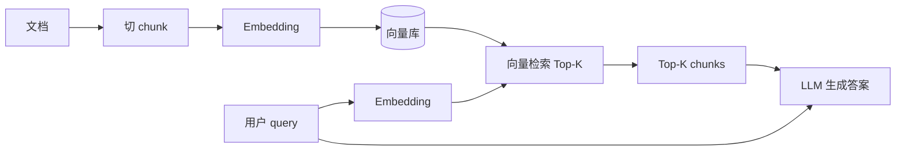
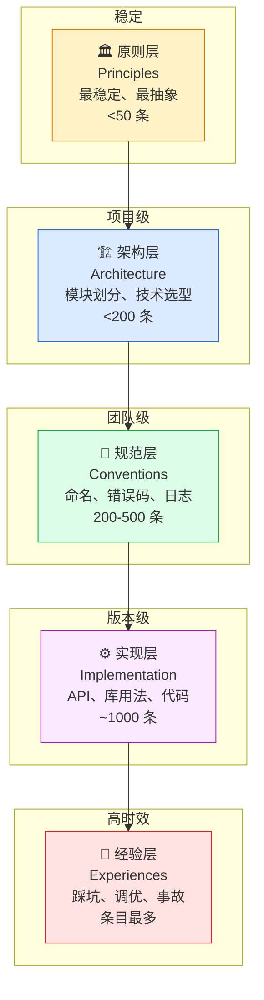
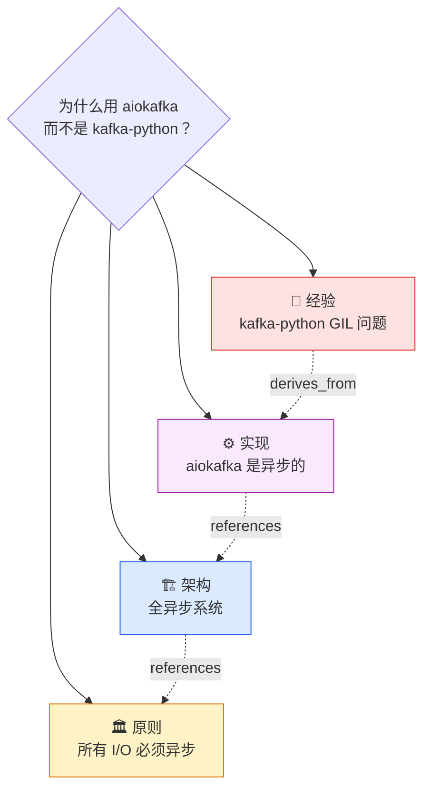
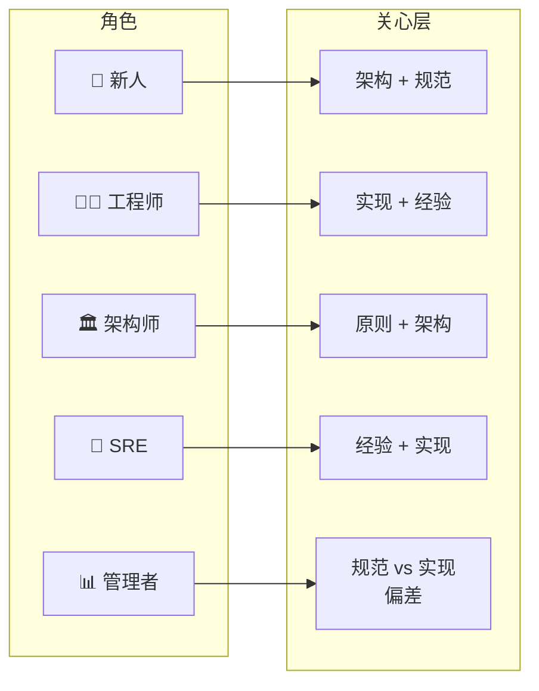
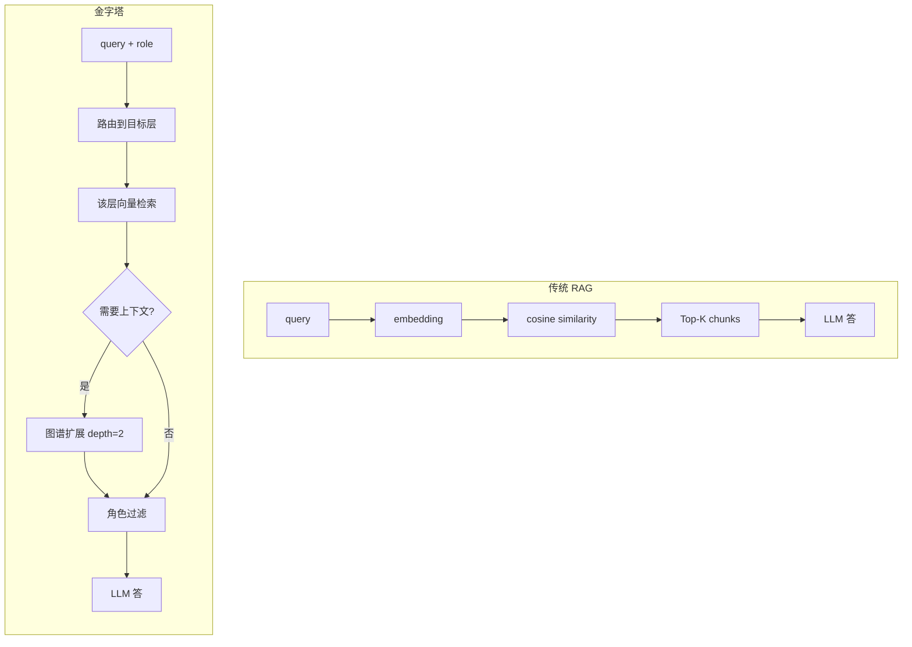
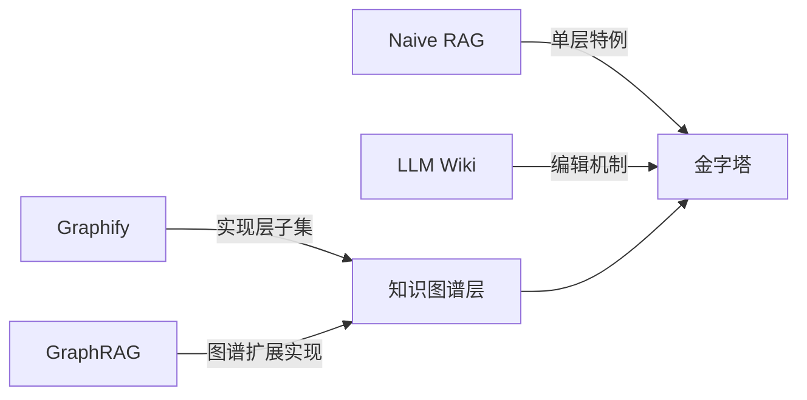
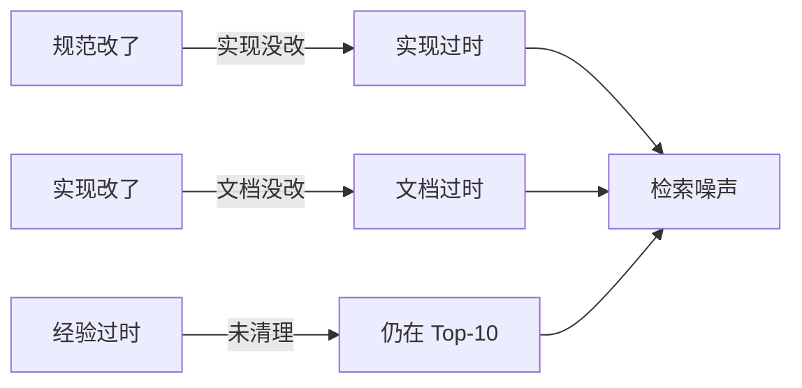
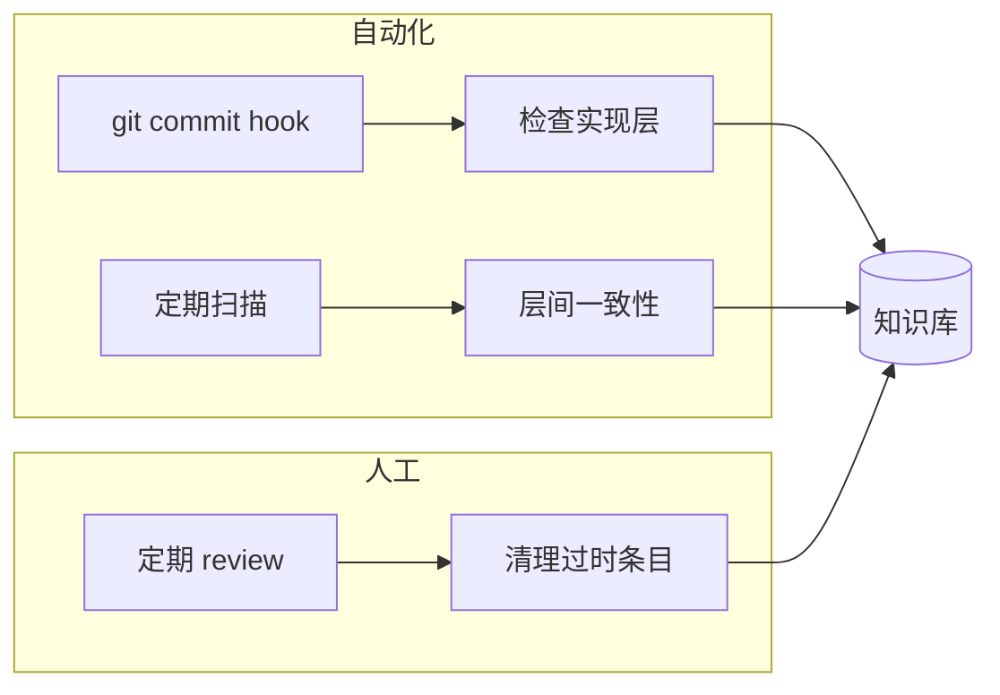
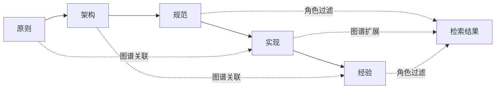

# 知识库分层编排：从 RAG 到 Agent-native Knowledge Context Layer

> **核心命题**：工程知识天然分稳定性层级，RAG 把一切压平成 chunk 是天花板最低的解法。本文提出"金字塔"五层结构（原则 → 架构 → 规范 → 实现 → 经验），结合角色感知与知识图谱关联，把检索从"找相似 chunk"升级为"按结构路由 + 按角色过滤 + 按关联扩展"。

---

## 目录

- [执行摘要](#执行摘要)
- [一、知识库的根本困境](#一知识库的根本困境)
- [二、知识库方法论全景：从平铺到结构化](#二知识库方法论全景从平铺到结构化)
- [三、金字塔：一种新的知识工程范式](#三金字塔一种新的知识工程范式)
- [四、同步机制：知识库不是一次性的](#四同步机制知识库不是一次性的)
- [五、测评结果与局限性](#五测评结果与局限性)
- [六、总结与延伸阅读](#六总结与延伸阅读)

---

## 执行摘要

> [!info] 三分钟读完
> **问题**：传统 RAG 把所有文档切成 chunk，粒度混乱、缺关联、保鲜难，无法支撑中大型团队的工程知识库。
> **方案**：把知识按稳定性分成五层（原则/架构/规范/实现/经验），每层配不同检索策略；层间用知识图谱串接；用户角色决定"看哪几层"。
> **结论**：相比 Naive RAG，多了一个路由和一个图谱，工程量没增加多少，但对中大型团队的工程知识库，效果有质的差别。

| 维度 | Naive RAG | 金字塔（本文方案） |
|------|-----------|---------------------|
| 知识形态 | 任意 chunk | 五层结构化条目 |
| 粒度控制 | 无 | 按层强制粒度 |
| 跨条目关联 | 弱（散点） | 知识图谱显式建模 |
| 角色适配 | 无 | 按角色路由到子集 |
| 保鲜机制 | 重 embed | 来源追溯 + 版本化 + 失效检测 |
| 实现复杂度 | 低 | 中（多一个路由 + 一个图谱） |

---

## 一、知识库的根本困境

### 1.1 RAG 的天花板

RAG（Retrieval-Augmented Generation）的标准流程：



**四个根本缺陷**：

> [!warning] RAG 的四个根本缺陷
>
> 1. **每次从零推导** — 正如 Karpathy 在 LLM Wiki 设计文档中指出：*"the LLM is rediscovering knowledge from scratch on every question. There's no accumulation of learned knowledge over time."*
> 2. **粒度混乱** — "用 Y Combinator 推荐的命名规范"和"昨天踩的 bug"可能落在同一个 Top-10 里
> 3. **连点不成线** — chunk 是独立单元，返回散点，调用方拼不出全貌
> 4. **保鲜难** — 文档更新后，向量库可能还在用旧版本的语义

### 1.2 四个常见症状

| # | 症状 | 根本原因 |
|---|------|----------|
| 1 | **检索噪声** | Top-10 里 6 条不相关，只能事后 rerank |
| 2 | **粒度错位** | 用户问"为什么这么设计"，召回的是"实现细节" |
| 3 | **上下文割裂** | 回答缺一段关键引用，系统不知道该往哪儿找 |
| 4 | **维护失控** | 条目越来越多，没人知道"哪些过时了""哪些缺引用" |

---

## 二、知识库方法论全景：从平铺到结构化

### 2.1 范式一：Naive RAG — 平铺向量检索

```python
def naive_rag(query):
    chunks = vector_search(query, top_k=10)
    return llm(query + chunks)
```

- **优点**：简单、快、能跑
- **缺点**：粒度混乱、缺关联、保鲜靠手动重 embed

### 2.2 范式二：LLM Wiki — 持续编译的知识工件

Karpathy 提出：让 LLM 主动维护一份"已学知识"的工件——每读一份文档就更新 Wiki，每回答一个问题也更新 Wiki。

- **优点**：知识有累积、有结构（Wiki 本身有目录）
- **缺点**：单条文档视角，缺少跨条目的关联；大规模工程知识库维护成本高

### 2.3 范式三：Graphify — 代码即图谱

把代码本身解析成知识图谱：函数 → 调用 → 类 → 模块。

- **优点**：结构化、机器可读、自动化
- **缺点**：只覆盖"代码"这一种知识形态；架构、规范、经验类知识落不进去

### 2.4 范式四：GraphRAG — 图谱增强的检索

把图谱（Neo4j 社区发现、实体关系抽取）加到 RAG 前面做召回，弥补 Naive RAG 的"散点"问题。

- **优点**：跨条目关联被显式建模
- **缺点**：建图成本高；图谱自身的维护和保鲜没有解决

### 2.5 四种范式的理论对比

| 维度    | Naive RAG | LLM Wiki | Graphify | GraphRAG |
| ----- | :-------: | :------: | :------: | :------: |
| 知识形态  |   任意文档    |   自由文本   |   仅代码    |   任意文档   |
| 结构化程度 |     无     |   人工目录   |  强（AST）  |  中（图谱）   |
| 跨条目关联 |     弱     |    中     |    强     |    强     |
| 保鲜机制  |  重 embed  |   增量编辑   |   代码同步   |   重构图    |
| 检索机制  |   向量相似度   |  关键词+目录  |   图遍历    |   图+向量   |
| 维护成本  |     低     |    中     |    低     |    高     |
| 适合规模  |     小     |    中     |    中     |    大     |

---

## 三、金字塔：一种新的知识工程范式

### 3.1 金字塔解决了什么

核心命题：**工程知识天然分稳定性层级**——越靠近顶层越稳定，越靠近底层越易变。让系统知道"用户问的是哪一层"，再决定怎么检索。



### 3.2 五层分层设计

| 层级 | 内容 | 稳定性 | 数量级 | 校验机制 |
|------|------|--------|--------|----------|
| **原则层 Principles** | 设计哲学、跨项目准则 | 跨项目/跨时间 | < 50 | Code Review |
| **架构层 Architecture** | 模块划分、技术选型 | 项目级 | < 200 | 架构评审 |
| **规范层 Conventions** | 命名、目录、错误码、日志 | 团队级 | 200-500 | Lint / 校验脚本 |
| **实现层 Implementation** | API 用法、库选型、代码片段 | 随版本变化 | ~1000 | 单元测试 |
| **经验层 Experiences** | 踩坑、调优、事故复盘 | 高时效 | 最多 | 周期性 review |

**五层典型条目示例**：

- **原则**：事件驱动优于轮询；状态机优于隐式状态；所有 I/O 必须异步
- **架构**：API 网关 + 微服务 + 事件总线；读写分离 + CQRS
- **规范**：错误码用 4 位数字，首位表示模块；日志必须含 trace_id
- **实现**：用 aiokafka 而不是 kafka-python；如何用 Prometheus client 暴露指标
- **经验**：在 K8s 上部署时记得设置 PodDisruptionBudget；某次事故的根因是 X

### 3.3 知识图谱：跨层关联

光有层还不够——同一个问题可能跨越多层。

> [!example] 跨层示例
> **问题**："为什么我们用 aiokafka 而不是 kafka-python？"
>
> - 经验层：上次线上 kafka-python 的 GIL 问题
> - 实现层：aiokafka 是异步的
> - 架构层：整个系统基于 asyncio
> - 原则层：所有 I/O 必须异步

**图谱建模**：



**节点类型**：原则 / 架构 / 规范 / 实现 / 经验
**边类型**：`derives_from`（源自）、`references`（引用）、`contradicts`（反例）、`relates_to`（相关）

```json
{
  "node": "用 aiokafka 而不是 kafka-python",
  "layer": "implementation",
  "edges": [
    {"type": "derives_from", "to": "经验：kafka-python GIL 问题"},
    {"type": "references", "to": "架构：全异步系统"},
    {"type": "references", "to": "原则：I/O 必须异步"}
  ]
}
```

### 3.4 角色感知：不同人看不同层

同一个问题，不同角色关心的层不同。



| 角色 | 典型问题 | 主要看 |
|------|----------|--------|
| 新人 | "代码怎么组织？" | 架构 + 规范 |
| 工程师 | "这个 API 怎么调？" | 实现 + 经验 |
| 架构师 | "为什么这么设计？" | 原则 + 架构 |
| SRE | "线上出问题了怎么办？" | 经验 + 实现 |
| 管理者 | "我们的技术债有哪些？" | 规范 vs 实现 偏差 |

### 3.5 检索机制：结构化路由 vs 向量相似度



**当前实现：分层关键词打分 + 图谱扩展**

```python
def pyramid_search(query, role):
    # 1. 判断目标层
    target_layer = route_by_query_and_role(query, role)

    # 2. 在该层检索
    candidates = vector_search(query, layer=target_layer, top_k=10)

    # 3. 图谱扩展（可选）
    if needs_context(query):
        candidates = expand_via_graph(candidates, depth=2)

    # 4. 角色过滤
    candidates = filter_by_role(candidates, role)

    return candidates
```

**关键词打分路由**：对每个层定义一组关键词——"为什么"倾向原则/架构、"怎么用"倾向实现、"踩坑"倾向经验。

### 3.6 金字塔与其他范式的关系



| 范式 | 与金字塔的关系 |
|------|----------------|
| **Naive RAG** | 金字塔的单层特例（不做路由、不做图谱扩展） |
| **LLM Wiki** | 可作为金字塔的"编辑机制"——LLM 主动维护各层 |
| **Graphify** | 是金字塔图谱层的子集（只覆盖实现层） |
| **GraphRAG** | 是金字塔图谱扩展的实现方式之一 |

---

## 四、同步机制：知识库不是一次性的

### 4.1 知识库的"腐烂"问题

知识库不是一次性的，它在持续腐烂：



### 4.2 知识保鲜的方法论

> [!success] 保鲜三原则
>
> 1. **来源可追溯** — 每条知识都能追溯到来源（代码 commit、设计文档、事故复盘）
> 2. **版本化** — 知识条目本身有版本，可以回滚
> 3. **失效检测** — 自动检测"实现变了但规范没变""规范变了但经验没变"

### 4.3 增量同步机制

**检测层间不一致**：

```python
def detect_inconsistencies():
    # 规范变了，但实现没引用最新规范
    for rule in conventions:
        if rule.last_modified > last_implementation_check(rule):
            flag(rule, "implementation_outdated")

    # 经验过时了（相关代码已删除）
    for exp in experiences:
        if not references_still_exist(exp):
            flag(exp, "obsolete_experience")
```

**触发机制**：



---

## 五、测评结果与局限性

### 5.1 实验条件

内部工程知识库约 3000 条目，覆盖后端 / 前端 / SRE 三条线。

### 5.2 局限性声明

> [!warning] 方法论边界
> 本文是**方法论介绍**，附带简化的实现思路，不是开箱即用的产品。
>
> - 路由关键词需要根据团队语料调
> - 图谱建图成本前期较高
> - 保鲜机制依赖团队的 commit 习惯

**适合**：

- ✅ 有完整工程实践的中大型团队
- ✅ 知识库规模 > 1000 条
- ✅ 已经为知识保鲜付出过维护成本

**不适合**：

- ❌ 小团队或早期项目（先用 Notion + 标签即可）
- ❌ 一次性 / 静态知识（如 SDK 文档）

---

## 六、总结与延伸阅读

### 6.1 核心观点回顾

工程知识库的核心矛盾，是知识的**结构性**与检索系统的**扁平性**之间的冲突。RAG 用向量把一切压平成 chunk，是最廉价的解法，也是天花板最低的解法。

**金字塔把"层次"显式建模**：



这并不比 Naive RAG 复杂多少——多了一个路由、一个图谱——但对中大型团队的工程知识库，效果有质的差别。

### 6.2 延伸阅读

| 主题 | 推荐 |
|------|------|
| Karpathy LLM Wiki 原始设计文档 | "LLM Wiki" by Andrej Karpathy |
| GraphRAG 实战 | PageIndex / LightRAG（[[PageIndex与LightRAG调研报告]]） |
| LangChain / LlamaIndex 中的图谱检索 | [[LangChain学习笔记]] |
| 个人知识库最佳实践 | [[Karpathy_LLM_Wiki_打造个人知识库深度报告]] |

### 6.3 与本知识库的关系

本文提出的"金字塔"和"LLM Wiki"两条线高度相关。可以借鉴的核心思想：

1. **结构化优先于压平** — 不要把 Obsidian 笔记单纯压平喂给 RAG
2. **角色感知路由** — 不同入口（新手指南 / API 参考 / 事故复盘）走不同检索路径
3. **保鲜机制** — 笔记要带来源 commit / 版本号，定期扫描过时条目

### 6.4 引用

```
原标题：知识库分层编排：从 RAG 到 Agent-native Knowledge Context Layer
作者：阿里技术官方账号
发布日期：2026-06-11
原链接：https://developer.aliyun.com/article/1740819
转载源（用于本研究）：https://zhuanlan.zhihu.com/p/2050613582593779556
```

---

> [!quote] 编辑注
> 本文是阿里云开发者社区的"阿里技术"专栏文章，原站点对程序化访问有防盗链拦截（HTTP 411），本文通过知乎转载源提取并校对。所有 Mermaid 图、表格、分层均为本报告为可读性所做的重排，不代表原作者图表。
