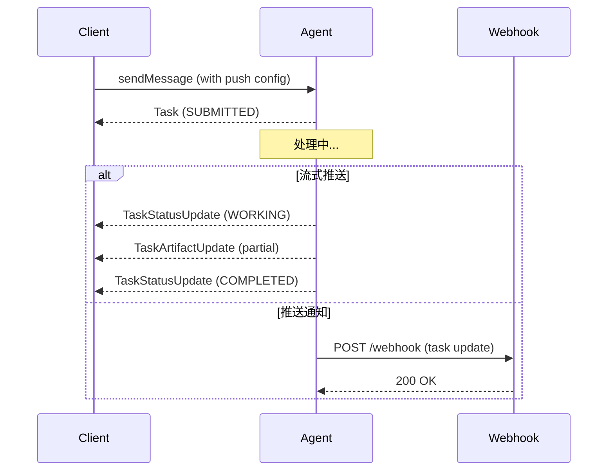
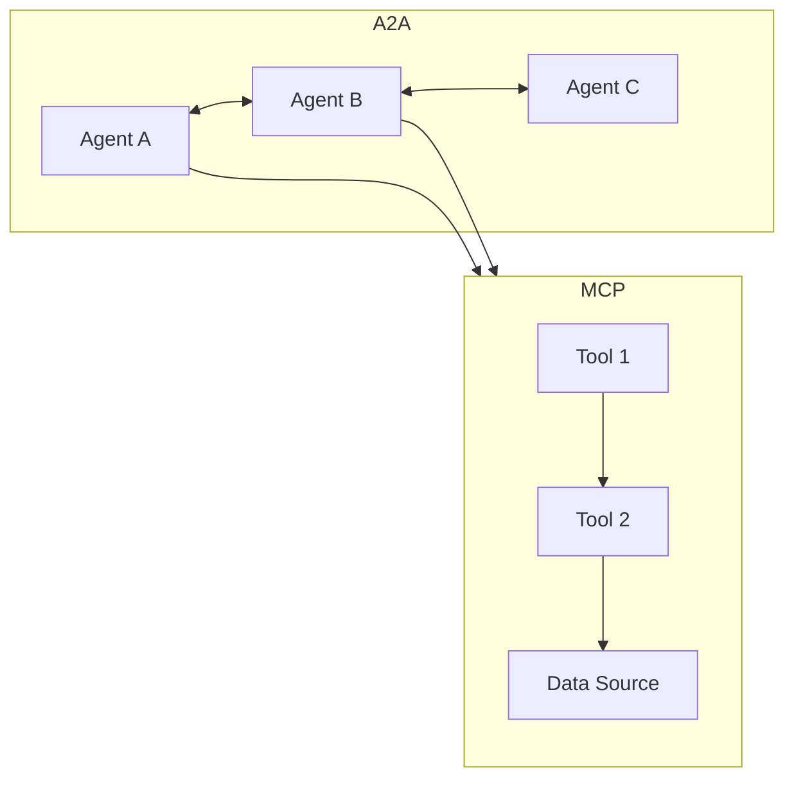

# A2A (Agent-to-Agent) 协议入门教程

> 本文介绍 A2A 协议的核心概念和 Python 实现，帮助你理解如何让不同框架、不同供应商构建的 AI Agent 相互通信。

## 什么是 A2A 协议

A2A（Agent-to-Agent）是一个**开放标准协议**，旨在实现 AI Agent 之间的无缝通信与协作。它为使用不同框架和供应商构建的 Agent 提供了一种通用语言，促进互操作性，打破信息孤岛。

### 为什么需要 A2A

在多 Agent 系统中，传统的解决方案是将 Agent 封装为工具（类似 MCP 的做法）。但这种方法有局限性：

| 传统方案               | A2A 方案             |
| ---------------------- | -------------------- |
| Agent 被包装成工具调用 | Agent 以完整形式暴露 |
| 只能执行预定义函数     | 支持自主推理和协商   |
| 状态无法保持           | 支持多轮对话和长任务 |
| 每个集成需要定制开发   | 标准化接口，开箱即用 |

### A2A 在 Agent 技术栈中的位置

```
┌─────────────────────────────────────┐
│           User Interface            │
├─────────────────────────────────────┤
│         Orchestration Agent         │  ← A2A Client
│    (协调多个专业 Agent)              │
├─────────────────────────────────────┤
│  ┌─────────┐ ┌─────────┐ ┌───────┐ │
│  │ Flight  │ │ Hotel   │ │ Currency│ │  ← A2A Server
│  │ Agent   │ │ Agent   │ │ Agent  │ │     (专业 Agent)
│  └─────────┘ └─────────┘ └───────┘ │
├─────────────────────────────────────┤
│           MCP / Tools               │  ← Agent 调用外部工具
│        (连接数据和资源)              │
└─────────────────────────────────────┘
```

## 核心概念

### 1. Agent Card - Agent 的身份证

Agent Card 是一个 JSON 元数据文档，描述 Agent 的身份、能力、端点和认证需求。客户端通过解析它来确定如何与 Agent 交互。

```python
from a2a.types import (
    AgentCard,
    AgentCapabilities,
    AgentSkill,
    AgentInterface,
)

# 定义 Agent 的技能
skill = AgentSkill(
    id='code_review',
    name='Code Review Agent',
    description='Analyzes code for bugs and improvements',
    tags=['code', 'review', 'quality'],
    examples=['Review my PR', 'Check this code for issues'],
)

# 定义 Agent Card
agent_card = AgentCard(
    name='Code Review Agent',
    description='AI agent for automated code review',
    version='1.0.0',
    default_input_modes=['text/plain', 'application/json'],
    default_output_modes=['text/plain', 'application/json'],

    # 声明 Agent 能力
    capabilities=AgentCapabilities(
        streaming=True,          # 支持流式响应
        push_notifications=True, # 支持推送通知
        extended_agent_card=True # 支持扩展的 Agent Card
    ),

    # 声明支持的协议接口
    supported_interfaces=[
        AgentInterface(
            protocol_binding='JSONRPC',
            url='http://localhost:8000',
        )
    ],

    skills=[skill]
)
```

### 2. Task - 任务

Task 是 A2A 中的核心工作单元，具有唯一 ID 和定义的生命周期。

```python
from a2a.types.a2a_pb2 import TaskState

# Task 的可能状态
task_states = [
    TaskState.TASK_STATE_UNSPECIFIED,      # 未知状态
    TaskState.TASK_STATE_SUBMITTED,         # 已提交
    TaskState.TASK_STATE_WORKING,           # 处理中
    TaskState.TASK_STATE_COMPLETED,         # 已完成 ✓
    TaskState.TASK_STATE_FAILED,            # 失败 ✗
    TaskState.TASK_STATE_CANCELED,          # 已取消
    TaskState.TASK_STATE_INPUT_REQUIRED,     # 需要用户输入
    TaskState.TASK_STATE_AUTH_REQUIRED,      # 需要认证
    TaskState.TASK_STATE_REJECTED,          # 被拒绝
]
```

### 3. Message 和 Part - 消息内容

Message 代表客户端与 Agent 之间的一次通信，包含角色（user/agent）和一个或多个 Part。

Part 是内容的最小单元，支持多种格式：

```python
from a2a.types.a2a_pb2 import Role
from a2a.helpers import new_text_message, new_data_message

# 文本消息
text_message = new_text_message(
    text="Hello, how can you help me?",
    role=Role.ROLE_USER
)

# 结构化数据消息
data_message = new_data_message(
    data={"query": "weather", "location": "Beijing"},
    media_type="application/json",
    role=Role.ROLE_USER
)
```

### 4. Artifact - 产物

Artifact 是 Agent 生成的有形成果（文档、图片、结构化数据），区别于一般消息。

```python
from a2a.helpers import new_text_artifact

# 创建文本产物
artifact = new_text_artifact(
    name='review_report',
    description='Code review report',
    text='# Code Review Report\n\n## Issues Found\n...'
)
```

### 5. 流式响应与推送通知

A2A 支持多种任务更新机制：



## 快速开始：构建 A2A Agent

### 安装依赖

```bash
pip install a2a-sdk
```

### 创建 Agent 执行器

```python
# agent_executor.py
from a2a.server.agent_execution import AgentExecutor, RequestContext
from a2a.server.events import EventQueue
from a2a.helpers import (
    new_task_from_user_message,
    new_text_artifact,
    new_text_message,
)
from a2a.types.a2a_pb2 import (
    TaskArtifactUpdateEvent,
    TaskState,
    TaskStatus,
    TaskStatusUpdateEvent,
)

class MyAgentExecutor(AgentExecutor):
    """自定义 Agent 执行器"""

    async def execute(
        self,
        context: RequestContext,
        event_queue: EventQueue,
    ) -> None:
        """执行业务逻辑"""
        # 1. 发送任务已接收事件
        task = context.current_task or new_task_from_user_message(
            context.message
        )
        await event_queue.enqueue_event(task)

        # 2. 发送处理中状态
        await event_queue.enqueue_event(
            TaskStatusUpdateEvent(
                task_id=context.task_id,
                context_id=context.context_id,
                status=TaskStatus(
                    state=TaskState.TASK_STATE_WORKING,
                    message=new_text_message('Processing your request...'),
                ),
            )
        )

        # 3. 执行核心逻辑
        user_message = context.message.parts[0].text
        result = await self.process(user_message)

        # 4. 返回产物
        await event_queue.enqueue_event(
            TaskArtifactUpdateEvent(
                task_id=context.task_id,
                context_id=context.context_id,
                artifact=new_text_artifact(name='result', text=result),
            )
        )

        # 5. 标记完成
        await event_queue.enqueue_event(
            TaskStatusUpdateEvent(
                task_id=context.task_id,
                context_id=context.context_id,
                status=TaskStatus(state=TaskState.TASK_STATE_COMPLETED),
            )
        )

    async def cancel(self, context: RequestContext, event_queue: EventQueue):
        """取消任务（可选）"""
        raise Exception('Cancellation not supported')

    async def process(self, input_text: str) -> str:
        """核心处理逻辑 - 这里集成你的 AI 模型"""
        # TODO: 接入你的 LLM
        return f"Processed: {input_text}"
```

### 启动 A2A Server

```python
# server.py
import uvicorn
from a2a.server.request_handlers import DefaultRequestHandler
from a2a.server.routes import create_agent_card_routes, create_jsonrpc_routes
from a2a.server.tasks import InMemoryTaskStore
from a2a.types import AgentCard, AgentCapabilities, AgentSkill, AgentInterface
from agent_executor import MyAgentExecutor
from starlette.applications import Starlette

# 定义 Agent Card
agent_card = AgentCard(
    name='My First A2A Agent',
    description='A simple example of A2A protocol',
    version='0.1.0',
    default_input_modes=['text/plain'],
    default_output_modes=['text/plain'],
    capabilities=AgentCapabilities(streaming=True),
    supported_interfaces=[
        AgentInterface(protocol_binding='JSONRPC', url='http://localhost:8000')
    ],
    skills=[
        AgentSkill(
            id='greeting',
            name='Greeting',
            description='Responds with a greeting',
            tags=['greeting', 'hello'],
            examples=['hi', 'hello'],
        )
    ],
)

# 创建请求处理器
request_handler = DefaultRequestHandler(
    agent_executor=MyAgentExecutor(),
    task_store=InMemoryTaskStore(),
    agent_card=agent_card,
)

# 构建路由
routes = []
routes.extend(create_agent_card_routes(agent_card))
routes.extend(create_jsonrpc_routes(request_handler, '/'))

app = Starlette(routes=routes)

if __name__ == '__main__':
    uvicorn.run(app, host='127.0.0.1', port=8000)
```

### 客户端调用

```python
# client.py
import asyncio
import httpx
from a2a.client import A2ACardResolver, ClientConfig, create_client
from a2a.helpers import new_text_message
from a2a.types.a2a_pb2 import Role, SendMessageRequest
from a2a.utils.constants import AGENT_CARD_WELL_KNOWN_PATH

async def main():
    base_url = 'http://127.0.0.1:8000'

    async with httpx.AsyncClient() as httpx_client:
        # 1. 获取 Agent Card（服务发现）
        resolver = A2ACardResolver(
            httpx_client=httpx_client,
            base_url=base_url,
        )
        agent_card = await resolver.get_agent_card()
        print(f"Discovered agent: {agent_card.name}")

        # 2. 创建客户端（支持流式）
        config = ClientConfig(streaming=True)
        client = await create_client(agent=agent_card, client_config=config)

        # 3. 发送消息
        message = new_text_message('Hello, how are you?', role=Role.ROLE_USER)
        request = SendMessageRequest(message=message)

        # 4. 接收响应（流式）
        print("Response:")
        async for chunk in client.send_message(request):
            print(f"  {chunk}")

        await client.close()

if __name__ == '__main__':
    asyncio.run(main())
```

## A2A 与 MCP 的关系

| 维度         | MCP                  | A2A                |
| ------------ | -------------------- | ------------------ |
| **定位**     | Agent ↔ 工具/数据    | Agent ↔ Agent      |
| **交互模式** | 请求-响应            | 协作协商           |
| **状态保持** | 无状态调用           | 多轮对话           |
| **典型场景** | 查询数据库、调用 API | 委托任务、协作推理 |

**两者互补**：A2A Agent 在处理任务时，内部可以使用 MCP 调用各种工具和数据源。

## A2A 与 MCP 的关键区别



## 最佳实践

### 1. Agent Card 设计

- 使用精确的技能描述，便于客户端匹配
- 声明准确的输入/输出模式
- 提供示例查询帮助理解能力

### 2. 错误处理

```python
# 客户端应处理各种错误
from a2a.types.a2a_pb2 import TaskState

if task.status.state == TaskState.TASK_STATE_FAILED:
    # 获取错误信息
    error_msg = task.status.message.parts[0].text
    print(f"Task failed: {error_msg}")
elif task.status.state == TaskState.TASK_STATE_INPUT_REQUIRED:
    # 需要用户输入
    print("Agent needs more information")
```

### 3. 流式响应

```python
# 对于长任务使用流式响应
streaming_config = ClientConfig(streaming=True)
client = await create_client(agent=agent_card, client_config=streaming_config)

async for event in client.send_message(request):
    if hasattr(event, 'task'):
        print(f"Task status: {event.task.status.state}")
    elif hasattr(event, 'status_update'):
        print(f"Update: {event.status_update.status.message}")
    elif hasattr(event, 'artifact_update'):
        print(f"Artifact: {event.artifact_update.artifact.name}")
```

## 参考资源

- [A2A 协议官网](https://a2a-protocol.org/)
- [官方规范文档](https://a2a-protocol.org/latest/specification/)
- [Python SDK (a2a-sdk)](https://github.com/a2aproject/a2a-python)
- [官方示例代码](https://github.com/a2aproject/a2a-samples)

## 总结

A2A 协议为多 Agent 系统提供了标准化的通信方式，其核心价值在于：

1. **互操作性**：不同框架的 Agent 可以无缝协作
2. **Agent 原生**：不把 Agent 当工具，而是真正的协作伙伴
3. **企业级**：内置安全、认证、流式支持
4. **扩展性**：支持自定义扩展

掌握 A2A，将为构建复杂的多 Agent 系统奠定基础。
