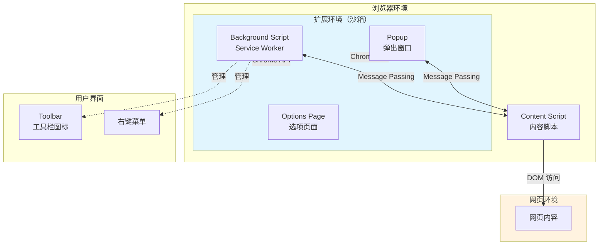
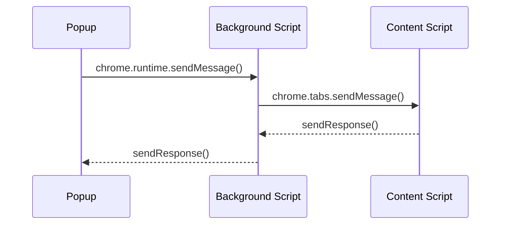
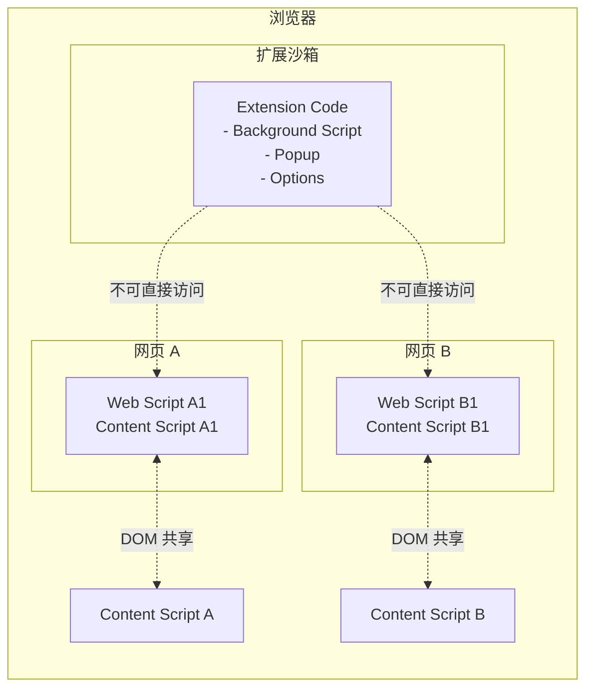

# Chrome Extension 核心概念与原理

在[《Build Your First Chrome Extension》](../学习笔记和教程/Chrome%20Extension%20开发入门教程.md)教程中，你已经学会了如何构建一个可用的扩展。本文档将深入解释 Chrome Extension 的底层原理，帮助你理解**为什么**这样工作，以及**如何**构建更复杂的扩展。

<Note>
本文适合想要深入理解 Chrome Extension 的开发者。不需要跟着操作，重点是理解概念。
</Note>

## Chrome Extension 的本质

Chrome Extension 实际上是一个**打包在 `.crx` 文件中的小型网站**。它使用标准的 Web 技术（HTML、CSS、JavaScript）构建，运行在浏览器的隔离环境中。

```
Chrome Extension = Web App + Browser APIs + 沙箱隔离
```

与普通 Web 应用的主要区别：

| 特性 | 普通 Web 应用 | Chrome Extension |
|------|--------------|------------------|
| 运行环境 | 服务器 + 浏览器 | 仅浏览器 |
| 访问 API | REST API / GraphQL | Chrome Browser API |
| 页面通信 | HTTP/WebSocket | Content Script / Message Passing |
| 发布方式 | 部署到服务器 | 上传至 Chrome Web Store |

## Manifest V3 架构

Manifest 是扩展的清单文件，定义了扩展的元数据、权限和组件。Chrome 目前主要使用 **Manifest V3**（简称 MV3）。

### Manifest 文件结构解析

```json
{
  "manifest_version": 3,
  "name": "Extension Name",
  "version": "1.0",
  "description": "扩展描述",
  "permissions": ["tabs", "storage"],
  "host_permissions": ["https://*.example.com/*"],
  "action": { ... },
  "background": { ... },
  "content_scripts": [{ ... }]
}
```

各字段的作用：

| 字段 | 作用 | 必须 |
|------|------|------|
| `manifest_version` | 声明使用的 Manifest 版本 | ✅ |
| `name` / `version` | 扩展的名称和版本号 | ✅ |
| `description` | 扩展描述（Chrome Web Store 显示用） | ❌ |
| `permissions` | 请求的普通权限 | 根据功能 |
| `host_permissions` | 请求的主机访问权限 | 根据功能 |
| `action` | 工具栏按钮配置 | ❌ |
| `background` | 后台脚本配置 | ❌ |
| `content_scripts` | 内容脚本配置 | ❌ |

### Manifest V2 与 V3 的核心区别

| 特性 | V2 | V3 |
|------|----|----|
| 后台脚本 | Background Pages（持久运行） | Service Workers（事件驱动） |
| 网络请求 | `web_accessible_resources` | `DeclarativeNetRequest` |
| 执行模式 | 允许远程代码 | 仅允许本地代码 |
| 权限 | 启动时授予 | 按需授予（Prominent Disclosure） |

<V3Warning>

**Manifest V3 带来的最大变化**：

1. **Background Pages → Service Workers**：后台脚本不再持久运行，而是按需触发后终止
2. **远程代码限制**：不允许加载外部 CDN 的脚本，必须打包所有代码
3. **权限收紧**：敏感权限需要用户明确授权

</V3Warning>

## 扩展组件详解

Chrome Extension 由多种组件构成，理解它们的角色和通信方式是关键。

### 组件关系图



### 1. Background Script / Service Worker

**作用**：扩展的"后台大脑"，负责管理扩展的生命周期、监听浏览器事件、调用 Chrome API。

```javascript
// background.js - 事件驱动的后台脚本
chrome.runtime.onInstalled.addListener(() => {
  console.log('扩展已安装或更新');
});

// 监听来自内容脚本或弹出窗口的消息
chrome.runtime.onMessage.addListener((message, sender, sendResponse) => {
  if (message.type === 'GET_DATA') {
    // 处理请求并返回响应
    sendResponse({ data: '处理结果' });
  }
  return true; // 异步响应需要返回 true
});

// 监听标签页变化
chrome.tabs.onUpdated.addListener((tabId, changeInfo, tab) => {
  if (changeInfo.status === 'complete') {
    console.log('页面加载完成:', tab.url);
  }
});
```

**特点**：
- 不直接操作网页 DOM
- 生命周期由 Chrome 管理（安装、更新、事件触发时启动，无事件后终止）
- 可以调用所有 Chrome API
- 可以在扩展图标上显示徽章（badge）

### 2. Popup（弹出窗口）

**作用**：用户点击工具栏图标时显示的小窗口。

```
┌─────────────────────────┐
│ 弹出窗口 (Popup)        │
│                         │
│ - 显示当前状态          │
│ - 提供快捷操作          │
│ - 生命周期：点击打开     │
│            关闭消失     │
└─────────────────────────┘
```

**特点**：
- 当用户关闭弹出窗口时，脚本立即停止
- 可以使用 `chrome.action` API 控制弹出窗口
- 与 Background Script 通过 Message Passing 通信

### 3. Content Script（内容脚本）

**作用**：注入到网页中的脚本，可以直接访问和修改网页 DOM。

```javascript
// content.js - 运行在网页上下文中
// 可以直接访问网页 DOM
const heading = document.querySelector('h1');
heading.textContent = '已被内容脚本修改';

// 监听来自扩展的消息
chrome.runtime.onMessage.addListener((message, sender, sendResponse) => {
  if (message.action === 'GET_TITLE') {
    sendResponse({ title: document.title });
  }
});
```

**特点**：
- 与网页共享 DOM（但运行在隔离的 JavaScript 上下文）
- 无法直接调用大多数 Chrome API（需通过 Message Passing）
- 可以访问 `window` 对象（独立于网页的 JavaScript）
- 作用域是目标网页，而非整个浏览器

### 4. Options Page（选项页面）

**作用**：扩展的设置页面，用户可以通过右键菜单 → 选项 访问。

与现代 Web 应用相同，可以是简单的 HTML 页面，也可以是复杂的 React 应用。

## 组件间通信机制

扩展的各个组件运行在隔离的环境中，它们之间的通信依赖以下机制：

### 1. Message Passing（消息传递）

这是最核心的通信方式，适用于几乎所有场景：



**示例场景**：Popup 需要获取当前页面的内容

```javascript
// popup.js - 发送消息
chrome.tabs.query({ active: true, currentWindow: true }, function(tabs) {
  chrome.tabs.sendMessage(tabs[0].id, { action: 'getContent' }, function(response) {
    console.log('页面内容:', response.content);
  });
});
```

```javascript
// content.js - 接收消息
chrome.runtime.onMessage.addListener(function(request, sender, sendResponse) {
  if (request.action === 'getContent') {
    sendResponse({ content: document.body.innerText });
  }
  return true; // 保持消息通道开放以支持异步响应
});
```

### 2. Storage API（存储共享）

如果需要持久化数据在各组件间共享：

```javascript
// 保存数据（任何组件都可以）
chrome.storage.local.set({ key: 'value' });

// 读取数据（任何组件都可以）
chrome.storage.local.get('key', function(result) {
  console.log(result.key);
});
```

| 存储类型 | 用途 | 容量 |
|----------|------|------|
| `chrome.storage.local` | 本地存储 | 约 10MB |
| `chrome.storage.sync` | 同步到 Google 账户 | 约 100KB |
| `chrome.storage.session` | 会话存储（内存） | 约 10MB |

### 3. 广播消息

Background Script 可以向所有内容脚本广播消息：

```javascript
// background.js
chrome.tabs.query({}, function(tabs) {
  tabs.forEach(tab => {
    chrome.tabs.sendMessage(tab.id, { action: 'UPDATE' });
  });
});
```

## 权限系统详解

权限决定了扩展可以访问哪些浏览器功能和网页内容。

### 权限分类

```
┌─────────────────────────────────────────────────────────────┐
│                      权限类型                               │
├─────────────────────────────────────────────────────────────┤
│                                                             │
│  ┌─────────────────────┐    ┌─────────────────────────┐   │
│  │   主机权限          │    │      API 权限           │   │
│  │   (Host Permissions)│    │  (API Permissions)      │   │
│  │                      │    │                          │   │
│  │  - <all_urls>        │    │  - tabs                  │   │
│  │  - https://*.com/*   │    │  - storage               │   │
│  │  - file:///*         │    │  - activeTab             │   │
│  │                      │    │  - scripting            │   │
│  └─────────────────────┘    └─────────────────────────┘   │
│                                                             │
│  ┌─────────────────────────────────────────────────────┐   │
│  │              限制性权限                               │   │
│  │              (Restricted Permissions)                 │   │
│  │                                                        │   │
│  │  需要 "Prominent Disclosure" 用户明确同意：            │   │
│  │  - bookmarks / history / tabs                          │   │
│  │  - webRequest / webRequestBlocking                    │   │
│  │  - debugger / desktopCapture                          │   │
│  └─────────────────────────────────────────────────────┘   │
└─────────────────────────────────────────────────────────────┘
```

### 权限请求时机

| Manifest V2 | Manifest V3 |
|------------|--------------|
| 安装时全部授予 | 普通权限安装时授予 |
| | **Prominent 权限**首次使用时授予 |

### 最佳实践

1. **最小权限原则**：只请求必需的功能
2. **使用 `activeTab`**：代替 `<all_urls>` 的首选方案
3. **明确声明主机权限**：而非使用通配符

```json
// ❌ 不推荐 - 权限过大
{
  "permissions": ["<all_urls>"],
  "content_scripts": [{ "matches": ["<all_urls>"] }]
}

// ✅ 推荐 - 精确指定
{
  "permissions": ["activeTab", "scripting"],
  "host_permissions": ["https://specific-site.com/*"],
  "content_scripts": [{ "matches": ["https://specific-site.com/*"] }]
}
```

## 安全模型

Chrome Extension 运行在浏览器的一个隔离环境中，具有特定的安全边界。

### 沙箱隔离



**隔离规则**：
- Content Script 与网页 JavaScript 共享 DOM，但**不共享变量**
- Content Script 与扩展其他组件不共享作用域
- 网页无法访问扩展的内部 API

### 攻击面分析

| 攻击向量 | 防护机制 |
|----------|----------|
| XSS（跨站脚本） | Content Script 运行在隔离环境 |
| CSP（内容安全策略） | Manifest V3 禁止远程代码 |
| 权限滥用 | 最小权限原则 + Prominent Disclosure |
| 社会工程 | 用户必须主动安装扩展 |

### Manifest V3 的安全增强

```mermaid
mindmap
    root((MV3 安全))
        远程代码禁止
            所有代码打包
            无 eval()
            无内联脚本
        权限控制
            Prominent Disclosure
            按需授予
            可撤销
        API 限制
                declarativeNetRequest
                替代 webRequest
                更严格的 host permissions
```

## 生命周期管理

理解扩展组件的生命周期对于调试和性能优化至关重要。

### 各组件生命周期

| 组件 | 启动时机 | 终止时机 | 示例 |
|------|----------|----------|------|
| **Background Script** | 安装/事件触发 | 闲置超时（约 30 秒） | `onInstalled`, `onMessage` |
| **Popup** | 用户点击图标 | 用户关闭/点击外部 | 点击打开，关闭消失 |
| **Content Script** | 网页加载 | 网页关闭 | 自动注入 |
| **Options Page** | 用户打开 | 用户关闭 | 右键 → 选项 |

### 生命周期图示

```
时间线 ──────────────────────────────────────────────────────────→

Background Script:
┌──────────┐                    ┌──────────────────┐
│ 安装时启动 │                    │ onMessage 触发   │     (休眠) ...
└──────────┘                    └──────────────────┘

Content Script:
┌─────────────────────────────────┐
│ 随网页加载                      │ 网页关闭
└─────────────────────────────────┘

Popup:
     ┌────────┐
     │ 用户点击 │ 关闭
     └────────┘
```

### 调试技巧

1. **查看 Background Script 日志**：`chrome://extensions/` → 开发人员模式 → 服务工作者链接
2. **检查 Content Script**：打开开发者工具，切换到扩展的上下文
3. **监控消息传递**：使用 `chrome.runtime.lastError` 检查错误

## 常用 API 速查

### 标签页操作

```javascript
// 获取当前活动标签
chrome.tabs.query({ active: true, currentWindow: true }, callback);

// 创建新标签
chrome.tabs.create({ url: 'https://example.com' });

// 修改标签
chrome.tabs.update({ url: 'https://new-url.com' });

// 关闭标签
chrome.tabs.remove(tabId);
```

### 消息传递

```javascript
// 发送消息
chrome.runtime.sendMessage({ type: 'ACTION' });
chrome.tabs.sendMessage(tabId, { type: 'ACTION' });

// 接收消息
chrome.runtime.onMessage.addListener((message, sender, response) => {
  // 处理消息
});
```

### 存储

```javascript
// 保存
chrome.storage.local.set({ key: value });
chrome.storage.sync.set({ key: value });

// 读取
chrome.storage.local.get(['key1', 'key2'], callback);

// 删除
chrome.storage.local.remove('key');
chrome.storage.local.clear();
```

### UI 操作

```javascript
// 设置弹出窗口
chrome.action.setPopup({ popup: 'popup.html' });

// 设置徽章
chrome.action.setBadgeText({ text: '3' });
chrome.action.setBadgeBackgroundColor({ color: '#FF0000' });

// 显示通知
chrome.notifications.create({
  type: 'basic',
  iconUrl: 'icon.png',
  title: '标题',
  message: '内容'
});
```

## 总结

Chrome Extension 的核心概念可以归纳为：

| 概念 | 关键点 |
|------|--------|
| **Manifest** | 扩展的清单，定义元数据、权限、组件 |
| **Background Script** | 事件驱动，处理逻辑，调用 Chrome API |
| **Popup** | 临时 UI，用户交互入口 |
| **Content Script** | 运行在网页中，访问/修改 DOM |
| **Message Passing** | 组件间通信的唯一方式 |
| **权限系统** | 最小权限，按需授予 |
| **安全模型** | 沙箱隔离，禁止远程代码 |

理解这些核心概念后，你就可以构建更复杂的扩展，如：

- 拦截/修改网络请求
- 管理书签和历史记录
- 与外部 API 集成
- 实现跨标签页状态同步
- 构建完整的设置界面

## 相关资源

- [Chrome Extension 官方文档](https://developer.chrome.com/docs/extensions/)
- [Manifest V3 迁移指南](https://developer.chrome.com/docs/extensions/develop/migrate/what-is-mv3)
- [Chrome API 参考](https://developer.chrome.com/docs/extensions/reference/api/)