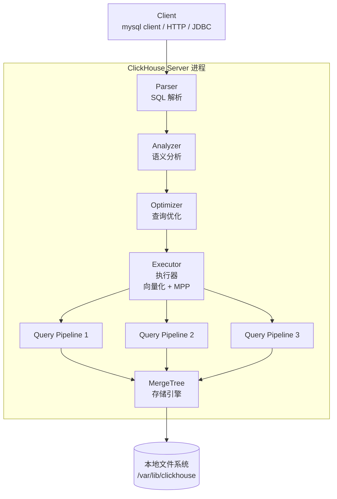
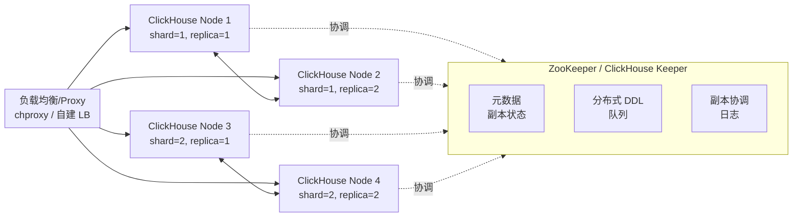
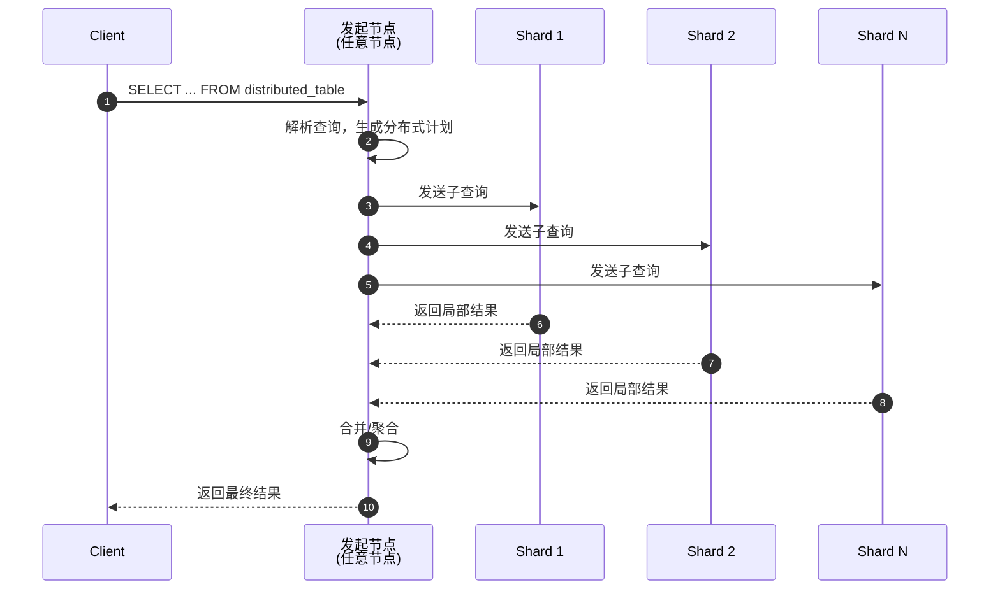
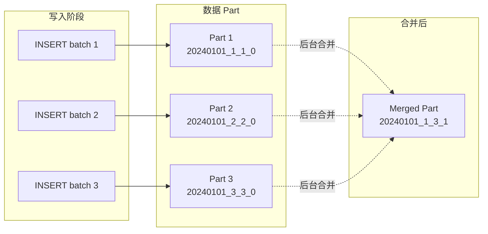
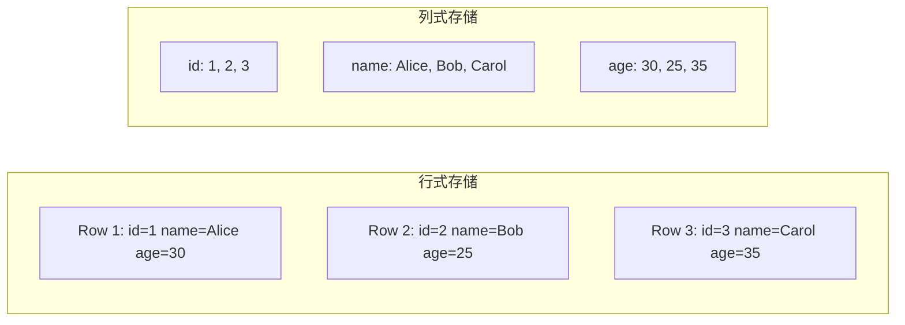
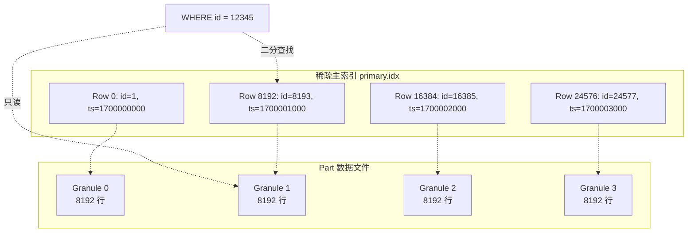
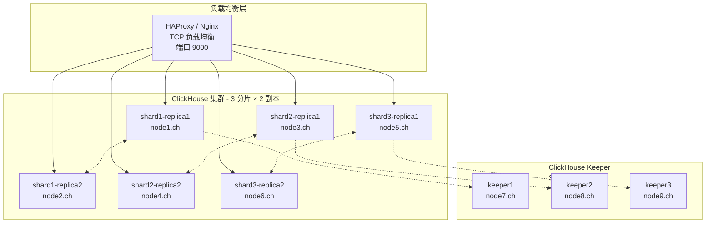

# ClickHouse 深度教程：从架构到实践

> 面向有 Hadoop 生态经验（理解 HDFS、MapReduce、YARN、Hive、Spark、HBase）的工程师，系统讲解 ClickHouse 的架构、存储引擎与工程实践。

## 目录

1. [为什么是 ClickHouse：与 Hadoop 生态的对比](#一为什么是-clickhouse与-hadoop-生态的对比)
2. [整体架构设计](#二整体架构设计)
3. [存储引擎深度解析](#三存储引擎深度解析)
4. [集群搭建与配置](#四集群搭建与配置)
5. [SQL 使用与查询优化](#五sql-使用与查询优化)
6. [数据集成：从 Kafka/HDFS/MySQL 到 ClickHouse](#六数据集成从-kafkahdfsmysql-到-clickhouse)
7. [运维、监控与故障排查](#七运维、监控与故障排查)
8. [实战案例与最佳实践](#八实战案例与最佳实践)

---

## 一、为什么是 ClickHouse：与 Hadoop 生态的对比

### 1.1 定位差异

ClickHouse 是一个 **OLAP 引擎**（在线分析处理），由俄罗斯 Yandex 公司于 2016 年开源，2021 年独立成为公司。它的设计目标是：**对海量结构化数据进行亚秒级分析查询**。

如果从 Hadoop 生态出发理解，它最像的组合是：

| 维度 | Hadoop 生态 | ClickHouse |
|------|------------|-----------|
| 存储 | HDFS（HDFS + Parquet/ORC） | 本地文件系统（自带 MergeTree） |
| 计算 | MapReduce / Spark / Tez | 内置 MPP 查询引擎 |
| 元数据 | Hive Metastore | 自管理（ZooKeeper/Keeper） |
| 资源调度 | YARN | 无（直接绑定 CPU 资源） |
| 查询语言 | Hive SQL / Spark SQL | ClickHouse SQL（类 ANSI SQL + 扩展） |
| 索引 | 粗粒度（分区+分桶） | 细粒度（稀疏主索引 + 跳跃索引） |
| 延迟 | 分钟～小时级 | 毫秒～秒级 |

**核心差异**：Hadoop 是"先存后算"的批处理范式，ClickHouse 是"边存边算"的实时分析范式。前者适合超大规模离线 ETL，后者适合交互式分析与监控。

### 1.2 适用场景

✅ **适合**：

- 用户行为分析（PV/UV、漏斗、留存）
- 日志分析（NGINX、APM、业务日志）
- 实时监控（指标看板、APM、告警）
- 商业智能（BI 报表、自助分析）
- 时序数据（Metrics、IoT，但 InfluxDB/TimescaleDB 更专业）

❌ **不适合**：

- 事务处理（OLTP）：用 MySQL/PostgreSQL
- 大宽表频繁更新：CH 支持但代价大，用 HBase/Cassandra
- 复杂事务和 JOIN 频繁事务场景：CH 的 JOIN 实现简单
- 超大规模离线批处理：CH 单查询有内存上限，用 Spark

### 1.3 为什么这么快：本质原因

ClickHouse 的"快"来自 5 个根本设计决策（详见后文章节）：

1. **列式存储**：只读需要的列，减少 I/O 10×+
2. **数据压缩**：同列同质数据压缩比 5-10×，减少 I/O
3. **向量引擎**：CPU SIMD 指令 + 批量处理，一个 cycle 处理千行
4. **分布式 + 本地计算**：数据在哪，计算在哪，避免 Shuffle
5. **预排序与稀疏索引**：跳过 99% 数据，类似 Parquet 的 Row Group 但更激进

> 一句话：**ClickHouse = 列式存储 + 向量化执行 + 稀疏索引 + 分布式 MPP**，缺一不可。

---

## 二、整体架构设计

### 2.1 单节点架构

ClickHouse 的单节点架构看似简单，但它把"数据库"和"存储引擎"合二为一，没有传统 RDBMS 的 Buffer Pool、WAL、Undo Log 这些东西。



**关键点**：

- **Parser + Analyzer + Optimizer + Executor**：类似传统数据库，但 Optimizer 相对朴素（不像 Oracle/CBO 那么激进，因为存储已经决定了大部分性能）
- **没有 WAL**：ClickHouse 不写日志文件来保证 ACID，对写不做事务保证（除了一些 `Lightweight DELETE` 和事务相关功能）
- **存储和计算耦合**：与 Hadoop 不同，CH 没有"存储层"和"计算层"的分离。节点既是计算节点也是存储节点。
- **每个查询都是独立的 Pipeline**：CH 不维护像 Spark 的 RDD 血统，它每次查询都直接执行 Pipeline

### 2.2 集群架构

ClickHouse 集群的核心概念是 **分片（Shard）+ 副本（Replica）**，与 Elasticsearch / MongoDB / HBase 的"分片"概念类似但更灵活。



**核心组件**：

| 组件 | 作用 | 对比 Hadoop |
|------|------|------------|
| Shard | 数据水平切分，每个 Shard 持有数据子集 | 类似 HDFS 的 Block 分布，但带计算 |
| Replica | 同 Shard 的多份副本，提供高可用 | 类似 HDFS 的副本机制（默认 3 副本） |
| ZooKeeper / Keeper | 协调副本状态、分布式 DDL | 类似 YARN 的 ResourceManager，但 CH 用 ZK |
| Distributed 表 | 逻辑表，查询时路由到各 Shard | 类似 Hive 的外表，但 CH 的本地查询能力更强 |
| ClickHouse Keeper | 自研的 ZooKeeper 替代品（推荐使用） | — |

> **重要**：ClickHouse 的"副本"不是 HDFS 那种"数据 block 复制"，而是 **每个分片上的一个完整节点**。副本之间通过 ZooKeeper/Keeper 同步数据（异步多主复制），节点对等，没有主备。

### 2.3 分布式查询执行

当客户端发起查询时，分布式表的执行流程：



**分布式查询的两种模式**：

1. **Distributed 表**：逻辑表，查询时自动分发。简单但灵活度低。
2. **remote 函数 / remote_secure**：手动指定远程节点。更灵活，常用于跨集群查询。

```sql
-- Distributed 表查询
SELECT count() FROM distributed_events;

-- 远程表查询（直接访问远端）
SELECT * FROM remote('shard2-node', currentDatabase(), events);

-- 跨集群查询
SELECT * FROM remote('cluster_other', currentDatabase(), events);
```

### 2.4 与 Hadoop 的一致性模型对比

这是 ClickHouse 设计上**最重要也最容易被误解**的差异：

| 特性 | ClickHouse | Hadoop/HBase | HDFS |
|------|-----------|-------------|------|
| 写入一致性 | 最终一致（副本异步复制） | HBase 强一致（ZAB 协议） | 强一致（写流水线） |
| 副本同步 | 异步多主 | 同步（强一致读） | 同步（写流水线） |
| CAP 取向 | AP（可用性 + 分区容忍） | CP | CA（单 Namenode）/ CP（HA） |
| 故障时数据丢失风险 | **可能**（副本未同步部分丢失） | 极低（WAL + MemStore） | 极低 |
| 读时是否一致 | 最终一致，可读到旧副本 | 强一致 | 强一致 |

**实战含义**：

- 不能用 ClickHouse 做"事务性"系统（订单、账户、库存）
- 副本间短暂的数据延迟是正常的（毫秒级）
- 多主架构意味着**任意节点都能写**，但同一行在不同节点同时写可能冲突（CH 没有锁，靠 `version` 列解决）
- 如果你对强一致有要求，需要在应用层做幂等或在 ZK 上做协调

---

## 三、存储引擎深度解析

> 这是 ClickHouse 最值得深入的部分，也是理解其性能的关键。

### 3.1 MergeTree 家族：CH 的存储基石

**MergeTree 是 ClickHouse 最基础、最重要的存储引擎**，其他引擎（如 Replacing、Summing、Aggregating）都是在它之上的变体。

它的核心思想类似 **LSM-Tree**（Log-Structured Merge-Tree），但针对 OLAP 场景做了大量优化：



**关键概念**：

- **Part（数据部分）**：每次 INSERT 在磁盘上生成一个不可变的"Part"目录，类似 HBase 的 HFile
- **命名规则**：`{partition_id}_{min_block_num}_{max_block_num}_{level}`
- **合并（Merge）**：后台异步任务把多个小 Part 合并成大 Part，类似 HBase 的 Compaction
- **不可变性**：写入的 Part 不可修改，修改/删除通过新 Part + 标记实现（类似 LSM-Tree）

> **与 HBase 对比**：
>
> - HBase 的 HFile 是 B+Tree 索引；CH 的 Part 是稀疏索引 + 列文件
> - HBase 的 MemStore 是行存；CH 的 Part 写入直接是列存
> - HBase 的 Compaction 是 Major + Minor；CH 的 Merge 更激进，几乎一直在做

### 3.2 列式存储原理

ClickHouse 是严格的列式存储，与 Parquet/ORC 思想一致，但存储格式是私有的 `MergeTree` 格式。



**为什么列式对 OLAP 快**：

1. **I/O 减少**：查询 `SELECT count(), avg(age)` 只读 `id` 和 `age` 两列，不读 `name`
2. **压缩比高**：同一列同质数据（如所有 `age` 值）压缩比可达 5-10×
3. **向量执行**：CPU 处理连续同类型数据可用 SIMD 指令（如 AVX-512）
4. **缓存友好**：一列数据连续加载到 CPU 缓存，不像行存那么碎片

**ClickHouse 的列文件结构**：

```text
data/parts/202401_1_3_1/
├── checksums.txt
├── columns.txt           # 列元数据
├── count.txt             # 行数
├── primary.idx           # 稀疏主索引（每 8192 行一个 entry）
├── [column].bin          # 列数据（压缩后）
├── [column].mrk          # 列的 marks（每 8192 行的偏移）
├── [column].cmrk         # 压缩 marks
├── partition.dat         # 分区信息
├── minmax_[column].idx   # 分区内每列的 min/max（用于分区裁剪）
└── skp_idx_[idx].idx     # 跳跃索引（如果有）
```

**关键文件**：

- `primary.idx`：每 N 行（默认 8192）记录主键字段，查询时二分查找定位
- `[col].mrk`：记录每个 granule（默认 8192 行）在 `.bin` 文件的偏移
- `[col].bin`：实际的列数据，按 block 压缩存储

### 3.3 主键与稀疏索引

这是 ClickHouse 与传统数据库（B+Tree 聚簇索引）最大的不同。



**核心特性**：

1. **稀疏索引**：每 8192 行才有一个索引项（可配置 `index_granularity`），所以索引非常小，几乎全部加载到内存
2. **二分查找定位 granule**：`WHERE id = 12345` 通过二分查找找到 `12345` 在哪个 granule，只读取那个 granule
3. **不像 MySQL InnoDB 的聚簇索引**：CH 的主键**不是唯一的**，允许重复值
4. **数据按主键排序存储**：插入时按主键排序，类似 HBase 的 rowkey 设计
5. **查询可能读取多个 granule**：`WHERE id > 100 AND id < 200` 可能会跨多个 granule

**主键设计原则（黄金法则）**：

```sql
CREATE TABLE events (
    event_time DateTime,
    user_id    UInt64,
    event_type String,
    -- ... 其他字段
)
ENGINE = MergeTree()
PARTITION BY toYYYYMM(event_time)
ORDER BY (user_id, event_time)  -- 关键！决定了排序顺序和索引
PRIMARY KEY (user_id);          -- 与 ORDER BY 不同，PRIMARY KEY 用于一级索引的列
```

**实战技巧**：

- **ORDER BY 是灵魂**：选经常 WHERE 的列、基数高的列、单调递增的列（如时间）
- **避免基数过低的列放首位**：`ORDER BY (is_paid)` 几乎没用
- **基数过高的列放首位也不好**：`ORDER BY (uuid)` 让索引退化为"全表读"
- **时间字段通常放在 ORDER BY 第二位**：保证时间相近的数据物理相邻

### 3.4 跳跃索引（Skip Index）

主索引只能按主键过滤，对于非主键列的查询，CH 提供**跳跃索引**（类似二级索引）：

```sql
CREATE TABLE events (
    event_time DateTime,
    user_id    UInt64,
    url        String,
    status     UInt16,
    body       String
)
ENGINE = MergeTree()
ORDER BY (event_time, user_id)
-- 跳跃索引：在 status 列上做 minmax
SETTINGS index_granularity = 8192,
  -- 语法：INDEX name column TYPE type GRANULARITY n
  -- type 可选：minmax / set / bloom_filter / tokenbf / ngrambf
```

**跳跃索引类型**：

| 类型 | 适用场景 | 例子 |
|------|---------|------|
| `minmax` | 数值范围 | `WHERE amount > 100` |
| `set` | 低基数枚举 | `WHERE status IN (200, 404)` |
| `bloom_filter` | 任意等值 | `WHERE url = 'specific/path'` |
| `tokenbf` | 长字符串分词 | `WHERE body LIKE '%error%'` |
| `ngrambf` | 模糊匹配 | `WHERE body LIKE '%error%'` |

> 与 Elasticsearch 的 doc_values + postings 对比，CH 的跳跃索引粒度更粗（8192 行），但开销低。

### 3.5 特殊 MergeTree 引擎

#### 3.5.1 ReplacingMergeTree

解决重复数据问题（与 Spark 的 `dropDuplicates` 类似）：

```sql
CREATE TABLE events_replacing (
    event_time DateTime,
    user_id    UInt64,
    event_type String,
    version    UInt64
)
ENGINE = ReplacingMergeTree(version)  -- 用 version 列保留最新版本
PARTITION BY toYYYYMM(event_time)
ORDER BY (user_id, event_time);
```

**注意**：`ReplacingMergeTree` 的去重只在 **Merge 期间** 发生，不能保证查询时无重复！必须配合 `SELECT ... FINAL` 或在查询时手动去重。

#### 3.5.2 SummingMergeTree

预聚合表（类似 Spark 的 `reduceByKey`）：

```sql
CREATE TABLE metrics_summing (
    metric_name  String,
    ts           DateTime,
    value        UInt64
)
ENGINE = SummingMergeTree()
PARTITION BY toYYYYMM(ts)
ORDER BY (metric_name, ts);
-- 相同 (metric_name, ts) 的 value 会被预聚合
-- 但是查询时仍要加 GROUP BY 保证正确性
```

#### 3.5.3 AggregatingMergeTree

存储预计算聚合结果，类似 Cube：

```sql
CREATE TABLE metrics_agg
ENGINE = AggregatingMergeTree()
PARTITION BY toYYYYMM(ts)
ORDER BY (metric_name, ts)
AS SELECT
    metric_name,
    ts,
    quantileState(0.95)(value) AS p95_value,    -- 存中间状态
    sumState(value)             AS sum_value
FROM raw_metrics
GROUP BY metric_name, ts;

-- 查询时合并状态
SELECT
    metric_name,
    quantileMerge(0.95)(p95_value) AS p95,    -- 算出最终分位数
    sumMerge(sum_value)            AS total
FROM metrics_agg
GROUP BY metric_name;
```

#### 3.5.4 CollapsingMergeTree / VersionedCollapsingMergeTree

通过 `sign` 列（1 或 -1）实现"删除"，避免重写：

```sql
CREATE TABLE events_collapsing (
    event_time DateTime,
    user_id    UInt64,
    event_type String,
    sign       Int8   -- +1 表示出现，-1 表示消失
)
ENGINE = CollapsingMergeTree(sign)
PARTITION BY toYYYYMM(event_time)
ORDER BY (user_id, event_time);
```

### 3.6 其他常用引擎速览

| 引擎 | 用途 | 典型场景 |
|------|------|---------|
| `Log` | 小表（< 1M 行），无索引 | 字典表、配置表 |
| `TinyLog` | 更小的 Log | 临时表 |
| `Memory` | 内存表 | 临时表（重启丢失） |
| `Distributed` | 分布式表（逻辑表） | 集群入口表 |
| `Merge` | 跨表 UNION 查询 | 物化视图 + 实时表合并 |
| `MaterializedView` | 物化视图 | 实时聚合、查询加速 |
| `Live View` | 实时视图（已废弃） | — |
| `Kafka` | Kafka 消费引擎 | 流式接入 |
| `HDFS` | HDFS 文件读取 | 离线数据导入 |
| `MySQL` / `PostgreSQL` | 异构数据库代理 | 数据同步 |
| `JDBC` | JDBC 桥接 | 数据库联邦查询 |
| `Dictionary` | 字典（内存 KV） | 维度关联 |
| `URL` | HTTP/HDFS 文件 | 简单文件读取 |
| `File` | 本地文件 | ETL 中转 |

---

## 四、集群搭建与配置

### 4.1 单机部署

#### 4.1.1 安装方式

**Debian/Ubuntu**：

```bash
# 添加 Yandex 仓库（2024 年后官方仓库可能变更，建议查最新）
sudo apt-get install -y apt-transport-https ca-certificates curl gnupg
curl -fsSL 'https://packages.clickhouse.com/rpm/lts/repo.key' | sudo gpg --dearmor -o /usr/share/keyrings/clickhouse-keyring.gpg
ARCH=$(dpkg --print-architecture)
echo "deb [signed-by=/usr/share/keyrings/clickhouse-keyring.gpg arch=${ARCH}] https://packages.clickhouse.com/deb stable main" | sudo tee /etc/apt/sources.list.d/clickhouse.list
sudo apt-get update
sudo apt-get install -y clickhouse-server clickhouse-client
```

**启动**：

```bash
sudo systemctl enable clickhouse-server
sudo systemctl start clickhouse-server

# 默认密码为空，可以这样设
sudo -u clickhouse clickhouse-client --password="" --query "ALTER USER default SET PASSWORD='YourStrongPassword'"
```

**目录结构**：

```text
/etc/clickhouse-server/
├── config.d/         # 用户配置（推荐放这）
├── config.xml        # 主配置
├── users.xml         # 用户配置
└── ...

/var/lib/clickhouse/
├── data/             # 数据文件（按库/表/分区）
├── metadata/         # 元数据（CREATE TABLE 语句）
├── tmp/              # 临时文件
└── format_schemas/   # Protobuf/Avro schema
/var/log/clickhouse-server/
├── clickhouse-server.log
└── clickhouse-server.err.log
```

#### 4.1.2 关键配置参数

`/etc/clickhouse-server/config.d/01-config.xml`：

```xml
<clickhouse>
    <!-- 监听端口（默认 8123 HTTP，9000 native，9009 集群互联） -->
    <listen_host>0.0.0.0</listen_host>

    <!-- 路径（默认已经是这样） -->
    <path>/var/lib/clickhouse/</path>
    <tmp_path>/var/lib/clickhouse/tmp/</tmp_path>

    <!-- 集群配置（在另一文件，见 4.2） -->
    <include_from>/etc/clickhouse-server/config.d/metrika.xml</include_from>

    <!-- 远程服务器配置 -->
    <remote_servers>
        <my_cluster>
            <!-- 分片 1 -->
            <shard>
                <internal_replication>true</internal_replication>
                <replica><host>node1</host><port>9000</port></replica>
                <replica><host>node2</host><port>9000</port></replica>
            </shard>
            <!-- 分片 2 -->
            <shard>
                <internal_replication>true</internal_replication>
                <replica><host>node3</host><port>9000</port></replica>
                <replica><host>node4</host><port>9000</port></replica>
            </shard>
        </my_cluster>
    </remote_servers>

    <!-- ZK 配置 -->
    <zookeeper>
        <node><host>zk1</host><port>2181</port></node>
        <node><host>zk2</host><port>2181</port></node>
        <node><host>zk3</host><port>2181</port></node>
    </zookeeper>

    <!-- 宏配置（每个节点不同） -->
    <macros>
        <shard>1</shard>
        <replica>node1</replica>
    </macros>

    <!-- 性能调优 -->
    <max_connections>4096</max_connections>
    <keep_alive_timeout>3</keep_alive_timeout>
    <max_concurrent_queries>100</max_concurrent_queries>
    <uncompressed_cache_size>1073741824</uncompressed_cache_size>  <!-- 1GB -->
    <mark_cache_size>1073741824</mark_cache_size>                  <!-- 1GB -->
    <total_memory_profiler_step>4194304</total_memory_profiler_step>

    <!-- Merge 调度（默认已经不错，小集群可调高） -->
    <background_pool_size>16</background_pool_size>
    <background_schedule_pool_size>128</background_schedule_pool_size>

    <!-- 用户配额 -->
    <profiles>
        <default>
            <max_memory_usage>10000000000</max_memory_usage>
            <use_uncompressed_cache>1</use_uncompressed_cache>
            <load_balancing>random</load_balancing>
        </default>
    </profiles>
</clickhouse>
```

### 4.2 集群部署

#### 4.2.1 拓扑规划

生产环境的典型拓扑：



**集群规模经验**：

- 中小规模：3 分片 × 2 副本 = 6 节点
- 大规模：6-12 分片 × 2-3 副本 = 12-36 节点
- 单节点推荐配置：32 核 / 128GB 内存 / 4TB NVMe SSD
- 副本间建议不同机架/可用区部署

#### 4.2.2 副本与分片

**创建本地表（每个节点都要执行）**：

```sql
-- 在所有节点上创建本地表（macros.shard 和 macros.replica 会自动替换）
CREATE TABLE events_local ON CLUSTER my_cluster (
    event_time  DateTime,
    user_id     UInt64,
    event_type  LowCardinality(String),
    payload     String
)
ENGINE = ReplicatedMergeTree(
    '/clickhouse/tables/{shard}/events_local',  -- ZK 上的路径
    '{replica}'                                  -- 副本名
)
PARTITION BY toYYYYMM(event_time)
ORDER BY (user_id, event_time);
```

**创建分布式表（在任意节点创建一次，会通过 ZK 同步到所有节点）**：

```sql
CREATE TABLE events ON CLUSTER my_cluster AS events_local
ENGINE = Distributed(
    my_cluster,        -- 集群名
    currentDatabase(), -- 数据库名
    events_local,      -- 本地表
    cityHash64(user_id)  -- 分片键（sharding key）
);
```

> **重点**：
>
> - `ReplicatedMergeTree` 是数据存储引擎
> - `Distributed` 是查询路由引擎（透明分片）
> - 写入时直接写本地表（`events_local`），不要写 Distributed 表（除非用 `insert_distributed_sync=1`）
> - 查询时查 Distributed 表，自动分发到各 Shard

**推荐写入模式**：

```sql
-- 错误：直接写 Distributed（会产生大量小 part）
INSERT INTO events SELECT * FROM ...

-- 正确：写本地表
INSERT INTO events_local SELECT * FROM ...
```

#### 4.2.3 ZooKeeper vs ClickHouse Keeper

| 维度 | ZooKeeper | ClickHouse Keeper |
|------|----------|-------------------|
| 协议 | ZAB | Raft |
| 性能 | 中等 | 更优（针对性优化） |
| 运维 | 单独部署，Java 栈 | CH 内置，C++ 实现 |
| 兼容性 | 标准 ZK | 兼容 ZK 协议（客户端） |
| 推荐 | 历史项目 | **新项目首选** |

**ClickHouse Keeper 配置示例**（节点 7）：

```xml
<clickhouse>
    <keeper_server>
        <tcp_port>9181</tcp_port>
        <server_id>1</server_id>
        <log_storage_path>/var/lib/clickhouse/coordination/log</log_storage_path>
        <snapshot_storage_path>/var/lib/clickhouse/coordination/snapshots</snapshot_storage_path>
        <coordination_settings>
            <operation_timeout_ms>10000</operation_timeout_ms>
            <session_timeout_ms>30000</session_timeout_ms>
            <raft_logs_level>warning</raft_logs_level>
        </coordination_settings>
        <raft_configuration>
            <server><id>1</id><hostname>node7</hostname><port>9234</port></server>
            <server><id>2</id><hostname>node8</hostname><port>9234</port></server>
            <server><id>3</id><hostname>node9</hostname><port>9234</port></server>
        </raft_configuration>
    </keeper_server>
</clickhouse>
```

### 4.3 容器化部署

#### 4.3.1 Docker 快速启动

```bash
docker run -d \
  --name clickhouse-server \
  -p 8123:8123 -p 9000:9000 -p 9009:9009 \
  -v /var/lib/clickhouse:/var/lib/clickhouse \
  -e CLICKHOUSE_DB=default \
  -e CLICKHOUSE_USER=default \
  -e CLICKHOUSE_PASSWORD=your_password \
  clickhouse/clickhouse-server:24.3
```

#### 4.3.2 Kubernetes Operator

生产环境推荐使用 Operator（[Altinity/clickhouse-operator](https://github.com/Altinity/clickhouse-operator)）：

```yaml
apiVersion: clickhouse.altinity.com/v1
kind: ClickHouseInstallation
metadata:
  name: chi-prod
spec:
  configuration:
    clusters:
      - name: cluster-prod
        layout:
          shardsCount: 3
          replicasCount: 2
        settings:
          max_memory_usage: 10000000000
    zookeeper:
      nodes:
        - host: zookeeper-0.zookeeper
          port: 2181
  templates:
    podTemplate: chi-default
    dataVolumeClaimTemplate: chi-default-volume
```

---

## 五、SQL 使用与查询优化

### 5.1 数据类型：CH 的"复杂类型"

CH 的类型系统支持嵌套、数组、元组、Map，这让它比传统 RDBMS 更灵活：

```sql
CREATE TABLE user_behavior (
    user_id        UInt64,
    event_time     DateTime,
    -- 数组类型
    tags           Array(String),
    -- 元组类型
    geo            Tuple(country String, city String, lat Float64, lon Float64),
    -- Map 类型（key 必须是基本类型）
    attributes     Map(String, String),
    -- 嵌套类型（类似 NoSQL 的嵌套文档）
    sessions       Nested(
            session_id  String,
            start_time  DateTime,
            duration    UInt32
        )
)
ENGINE = MergeTree()
ORDER BY (user_id, event_time);

-- 插入嵌套数据
INSERT INTO user_behavior VALUES (
    1, now(),
    ['vip', 'tech'],                          -- Array
    ('CN', 'Beijing', 39.9, 116.4),           -- Tuple
    {'browser': 'Chrome', 'os': 'macOS'},     -- Map
    [('s1', now(), 300), ('s2', now(), 600)]  -- Nested
);

-- 查询嵌套字段
SELECT
    user_id,
    geo.country,
    geo.2 AS latitude,
    attributes['browser'] AS browser,
    sessions.session_id,
    sessions.duration
FROM user_behavior;
```

**特殊类型**：

- `LowCardinality(String)`：低基数字符串（如状态码、性别），内部用字典压缩，比普通 String 快 5-10×
- `Nullable(T)`：允许 NULL，但**有性能代价**（每列多一个标记文件）。能用 0/空字符串替代就别用 Nullable
- `DateTime64(precision, timezone)`：高精度时间戳
- `IPv4` / `IPv6`：原生 IP 类型，支持 `IPv4CIDRToRange` 等函数

### 5.2 DDL 详解

#### 建表模板

```sql
CREATE TABLE [IF NOT EXISTS] [db.]table_name [ON CLUSTER cluster]
(
    name1 [type1] [DEFAULT|MATERIALIZED|ALIAS expr1] [COMMENT 'comment for column'],
    name2 [type2] [DEFAULT|MATERIALIZED|ALIAS expr2] [COMMENT 'comment for column'],
    ...
    INDEX idx_name1 expr1 TYPE type1(args) GRANULARITY n,
    INDEX idx_name2 expr2 TYPE type2(args) GRANULARITY n,
    PROJECTION prj_name (SELECT ...)
)
ENGINE = engine
  [PARTITION BY expr]
  [ORDER BY expr]
  [PRIMARY KEY expr]
  [SAMPLE BY expr]
  [TTL expr [DELETE|TO DISK 'xxx'|TO VOLUME 'xxx'] [WHERE condition]]
  [SETTINGS name=value, ...]
```

#### 关键 SETTINGS

```sql
CREATE TABLE events (...)
ENGINE = MergeTree()
ORDER BY (user_id, event_time)
PARTITION BY toYYYYMM(event_time)
SETTINGS
    index_granularity = 8192,           -- 索引粒度（默认 8192，不要轻易改）
    min_bytes_for_wide_part = 0,        -- 何时转宽表（每个列单独文件）
    min_rows_for_wide_part = 0,
    storage_policy = 'default',         -- 存储策略（冷热分层）
    ttl_only_drop_parts = 0,            -- TTL 删除是否只删整个 part
    ratio_of_defaults_for_sparse_serialization = 0.9375;
```

#### 物化列 vs 别名列 vs 默认值

```sql
CREATE TABLE events (
    event_time DateTime,
    event_date Date MATERIALIZED toDate(event_time),    -- 物化列：自动计算，存储
    event_hour UInt8 MATERIALIZED toHour(event_time),  -- 物化列：常用于分区
    ts         DateTime DEFAULT now(),                  -- 默认值：不显式指定时填充
    dt         ALIAS toDate(event_time)                 -- 别名：查询时计算，不存储
)
ENGINE = MergeTree()
PARTITION BY event_date
ORDER BY (event_time);
```

### 5.3 查询优化：10 条黄金法则

#### 法则 1：主键过滤

```sql
-- ✅ 使用主键字段过滤
SELECT * FROM events WHERE user_id = 123 AND event_time >= '2024-01-01';

-- ❌ 过滤非主键字段，全表扫描
SELECT * FROM events WHERE url = '/api/users';
```

#### 法则 2：分区裁剪

```sql
-- ✅ 按分区字段过滤（CH 会自动只读相关 part）
SELECT * FROM events WHERE event_time >= '2024-01-01' AND event_time < '2024-02-01';

-- ❌ 用函数包装导致分区失效
SELECT * FROM events WHERE toYYYYMM(event_time) = '2024-01';  -- CH 优化器会识别，但还是推荐直接写范围
```

#### 法则 3：避免 SELECT *

```sql
-- ✅ 只取需要的列
SELECT user_id, count() FROM events GROUP BY user_id;

-- ❌ SELECT *，把所有列读出来
SELECT * FROM events;
```

#### 法则 4：预聚合优于实时计算

```sql
-- ✅ 用 SummingMergeTree / AggregatingMergeTree
CREATE TABLE events_daily
ENGINE = SummingMergeTree()
PARTITION BY toYYYYMM(event_date)
ORDER BY (user_id, event_date)
AS SELECT
    toDate(event_time) AS event_date,
    user_id,
    count() AS pv,
    sum(amount) AS total_amount
FROM events
GROUP BY user_id, event_date;

-- ❌ 每次查询都实时 GROUP BY 几亿行
```

#### 法则 5：JOIN 优化

CH 支持多种 JOIN，**性能差异巨大**：

```sql
-- ✅ ASOF JOIN：时间最近匹配（金融场景必备）
SELECT
    trades.symbol,
    trades.price,
    quotes.bid,
    trades.time AS trade_time,
    quotes.time AS quote_time
FROM trades
ASOF LEFT JOIN quotes
ON trades.symbol = quotes.symbol
AND trades.time >= quotes.time;

-- ✅ Dictionary JOIN：维度表走内存字典（10-100× 快于普通 JOIN）
SELECT
    e.user_id,
    e.event_type,
    d.user_segment   -- 字典维度
FROM events e
LEFT JOIN users_dict AS d ON e.user_id = d.user_id;

-- 普通 JOIN（不推荐大表 JOIN）
SELECT * FROM events e JOIN users u ON e.user_id = u.id;
```

**JOIN 性能排序**（从快到慢）：

1. 字典 JOIN（内存）
2. ASOF JOIN（时间近邻）
3. 大表 + 小表 JOIN（小表放右）
4. 大表 + 大表 JOIN（最差）

#### 法则 6：用 EXPLAIN 看执行计划

```sql
-- 语法树
EXPLAIN AST SELECT ...;

-- 执行计划
EXPLAIN SELECT ...;
EXPLAIN PLAN SELECT ...;
EXPLAIN PIPELINE SELECT ...;
EXPLAIN ESTIMATE SELECT ...;  -- 估算读取的行数/字节数

-- 关键观察：
-- 1. Pipeline 中是否有 MergeSorting（说明有 ORDER BY，需要排序）
-- 2. 是否有 ExpressionTransform 中复杂计算
-- 3. Reading 的 part 数 / granule 数（应该接近实际数据量）
```

#### 法则 7：LIMIT 大数据查询

```sql
-- ✅ 即使是 OLAP，也加 LIMIT
SELECT * FROM events ORDER BY event_time DESC LIMIT 100;

-- ❌ 不加 LIMIT，CH 会把所有结果物化再返回
SELECT * FROM events ORDER BY event_time DESC;
```

#### 法则 8：用近似函数

```sql
-- ✅ 近似去重（5% 误差，速度快 1000×）
SELECT uniqHLL12(user_id) FROM events;
SELECT uniqCombined(user_id) FROM events;     -- 更快但稍大误差
SELECT quantiles(0.5, 0.95, 0.99)(response_time) FROM events;

-- ❌ 精确去重（慢）
SELECT uniqExact(user_id) FROM events;
```

#### 法则 9：避免实时大表 JOIN

```sql
-- ✅ 物化视图预 JOIN
CREATE MATERIALIZED VIEW user_event_enriched
ENGINE = MergeTree()
ORDER BY (user_id, event_time)
AS SELECT
    e.*,
    u.user_segment,
    u.country
FROM events e
LEFT JOIN users u ON e.user_id = u.id;

-- 查询时直接读物化视图
SELECT count() FROM user_event_enriched WHERE country = 'CN';
```

#### 法则 10：用物化视图加速

```sql
-- 创建聚合物化视图
CREATE MATERIALIZED VIEW events_hourly_mv
ENGINE = SummingMergeTree()
PARTITION BY toYYYYMM(hour)
ORDER BY (user_id, hour)
AS SELECT
    toStartOfHour(event_time) AS hour,
    user_id,
    count() AS pv,
    uniqState(url) AS urls  -- 用 State 系列函数支持增量聚合
FROM events
GROUP BY user_id, hour;
```

### 5.4 物化视图 vs Projection

CH 有两种"预计算"机制，功能相似但实现不同：

| 维度 | 物化视图（Materialized View） | Projection（投影） |
|------|---------------------------|-------------------|
| 触发 | INSERT 时同步生成 | INSERT 时同步生成 |
| 存储 | 独立表 | 存储在原表 Part 内 |
| 查询 | 需要显式查视图 | 自动选择最优 projection |
| 修改 | 单独 ALTER/DROP | 跟原表一起管理 |
| 灵活性 | 高（独立表） | 低（受限于原表 schema） |

```sql
-- Projection 示例
CREATE TABLE events (
    event_time DateTime,
    user_id    UInt64,
    url        String,
    status     UInt16
)
ENGINE = MergeTree()
ORDER BY (event_time, user_id)
PROJECTION p_status_200 (
    SELECT
        event_time,
        user_id,
        count() FILTER (WHERE status = 200) AS s200,
        count() FILTER (WHERE status = 404) AS s404
    GROUP BY event_time, user_id
);

-- 查询时自动选择
SELECT user_id, sum(s200) FROM events WHERE event_time >= today() GROUP BY user_id;
-- CH 会判断使用 p_status_200 投影
```

**推荐**：聚合查询用 **物化视图**（更灵活），多维度排序用 **Projection**（透明）。

---

## 六、数据集成：从 Kafka/HDFS/MySQL 到 ClickHouse

### 6.1 从 Kafka 实时接入

CH 自带 Kafka 引擎，直接消费 Kafka topic：

```sql
-- 创建 Kafka 表
CREATE TABLE events_kafka (
    event_time DateTime,
    user_id    UInt64,
    url        String,
    raw        String  -- 原始 JSON 字段
)
ENGINE = Kafka()
SETTINGS
    kafka_broker_list = 'kafka1:9092,kafka2:9092,kafka3:9092',
    kafka_topic_list = 'user_events',
    kafka_group_name = 'clickhouse_consumer',
    kafka_format = 'JSONEachRow',
    kafka_num_consumers = 3,        -- 每个节点起的消费者数
    kafka_max_block_size = 65536;   -- 批量大小

-- 创建物化视图实时落地到 MergeTree
CREATE MATERIALIZED VIEW events_kafka_mv TO events AS
SELECT
    parseDateTimeBestEffort(JSONExtractString(raw, 'event_time')) AS event_time,
    toUInt64(JSONExtractString(raw, 'user_id')) AS user_id,
    JSONExtractString(raw, 'url') AS url
FROM events_kafka;
```

> **生产实践**：Kafka 引擎消费速度快但容错弱，**生产环境推荐用 ClickHouse 自己的 Kafka 消费 + 应用层 ACK**，或者用 Vector / Flink 做中转（更可控）。

### 6.2 从 HDFS 读取数据

CH 支持直接读 HDFS 上的文件，类似 Hive 的外表：

```sql
-- 创建 HDFS 表（只读）
CREATE TABLE events_hdfs (
    event_time DateTime,
    user_id    UInt64,
    url        String
)
ENGINE = HDFS('hdfs://namenode:9000/data/events/*.parquet', 'parquet');

-- 直接查询
SELECT count() FROM events_hdfs WHERE event_time >= '2024-01-01';

-- 或者 INSERT INTO 本地表
INSERT INTO events SELECT * FROM events_hdfs;
```

**支持的文件格式**：`Parquet`、`ORC`、`CSV`、`JSONEachRow`、`Avro`、`Protobuf`、`Native`、`Arrow`。

### 6.3 从 MySQL/PostgreSQL 同步

#### 6.3.1 实时同步（CDC）

```sql
-- PostgreSQL 实时同步
CREATE DATABASE pg_sync ENGINE = MaterializedPostgreSQL(
    'postgres-host:5432',
    'postgres',
    'pg_user',
    'pg_password',
    'public',
    'default',
    'events'
);

-- MySQL 实时同步（已弃用，推荐用 MaterializedMySQL 或 Debezium）
```

> 实时同步通过解析 binlog/WAL 实现，但**稳定性不如专业 CDC 工具**（Debezium、Airbyte、Vector）。

#### 6.3.2 批量同步

```sql
-- MySQL 表代理
CREATE TABLE mysql_users (
    id    UInt64,
    name  String,
    email String
)
ENGINE = MySQL('mysql-host:3306', 'db', 'users', 'user', 'password');

-- 查询时直接拉取（每次查询都连 MySQL，不缓存）
SELECT * FROM mysql_users WHERE id = 1;
```

### 6.4 批量导入数据

#### 6.4.1 clickhouse-client

```bash
# CSV 导入
clickhouse-client --query "INSERT INTO events FORMAT CSV" < events.csv

# 从 MySQL 直接导出再导入
mysqldump --no-create-info --tab=/tmp/events mysql_db events
clickhouse-client --query "INSERT INTO events FORMAT TSV" < /tmp/events.txt
```

#### 6.4.2 clickhouse-local

不启动服务，本地处理数据（类似 Spark 的 local mode）：

```bash
# 把 JSON 转 Parquet
clickhouse-local --input-format=JSONEachRow \
  --output-format=Parquet \
  --query "SELECT * FROM table" \
  < input.json > output.parquet
```

#### 6.4.3 远程函数

CH 23+ 支持远程函数，可以自定义 Python 处理：

```sql
-- 注册远程函数
CREATE REMOTE FUNCTION my_func AS (x) -> x + 1;

-- 使用
SELECT my_func(value) FROM events;
```

### 6.5 与 BI 工具集成

CH 兼容 MySQL 协议，几乎所有 BI 工具都能直连：

| BI 工具 | 连接方式 | 备注 |
|--------|---------|------|
| Grafana | ClickHouse 官方插件 | **推荐** |
| Metabase | MySQL 驱动 | 配置简单 |
| Superset | ClickHouse 驱动 | 官方支持 |
| Tableau | MySQL 驱动 | 注意驱动兼容性 |
| Redash | ClickHouse 驱动 | 开源 |
| DBeaver | ClickHouse 驱动 | 数据库 IDE |

Grafana 配置示例（`grafana.ini`）：

```ini
[plugins]
plugin = grafana-clickhouse-datasource

[[datasources]]
type = vertamed
url = http://clickhouse:8123
database = default
username = default
# 启用 ad-hoc 过滤
```

---

## 七、运维、监控与故障排查

### 7.1 关键系统表

CH 提供丰富的 `system.*` 表用于运维：

```sql
-- 当前正在运行的查询
SELECT * FROM system.processes;

-- 查询历史（query_log）
SELECT
    type, event_time, query_duration_ms,
    query_kind, read_rows, read_bytes,
    result_rows, memory_usage,
    substring(query, 1, 100) AS query_snippet
FROM system.query_log
WHERE event_time > now() - INTERVAL 1 hour
ORDER BY query_duration_ms DESC
LIMIT 20;

-- 当前 Merge 任务
SELECT * FROM system.merges;

-- 当前 Part 信息
SELECT
    database, table, partition,
    count() AS part_count,
    sum(bytes_on_disk) AS total_bytes,
    sum(rows) AS total_rows
FROM system.parts
WHERE active
GROUP BY database, table, partition
ORDER BY total_bytes DESC
LIMIT 20;

-- 副本状态（ReplicatedMergeTree）
SELECT * FROM system.replicas WHERE is_readonly;

-- ZooKeeper 状态
SELECT * FROM system.zookeeper WHERE path='/';

-- 当前连接
SELECT * FROM system.metrics WHERE metric LIKE '%Connection%';
```

### 7.2 性能诊断

#### 看慢查询

```sql
-- 开启慢查询日志（默认 ≥ 60s）
SET log_queries = 1;
SET log_queries_min_query_duration_ms = 1000;

-- 查最近慢查询
SELECT
    query_id,
    query_duration_ms,
    read_rows, read_bytes,
    memory_usage,
    ProfileEvents.Values[indexOf(ProfileEvents.Names, 'DiskReadElapsedMicroseconds')] AS disk_read_us
FROM system.query_log
WHERE event_time > now() - INTERVAL 1 day
ORDER BY query_duration_ms DESC
LIMIT 50;
```

#### 看磁盘 I/O

```sql
-- 当前所有指标的实时值
SELECT * FROM system.metrics WHERE metric LIKE '%Disk%';

-- 实时监控表
SELECT * FROM system.events WHERE event LIKE '%Read%';
```

#### 看内存使用

```sql
-- 单查询内存峰值
SELECT
    query_id,
    peak_memory_usage,
    query
FROM system.query_log
WHERE event_time > now() - INTERVAL 1 HOUR
ORDER BY peak_memory_usage DESC
LIMIT 10;
```

### 7.3 常见故障与处理

#### 故障 1：副本不同步

**症状**：副本间数据不一致，`is_readonly=1`。

**排查**：

```sql
-- 查看副本状态
SELECT * FROM system.replicas FORMAT Vertical;

-- 查看 ZK 队列
SELECT * FROM system.replication_queue WHERE last_exception != '';
```

**修复**：

```sql
-- 强制恢复（慎用，会从 ZK 拉取元数据）
SYSTEM RESTART REPLICA events_local;

-- 重建副本（数据完全重传）
SYSTEM DROP REPLICA 'replica_name' FROM ZKPATH '/clickhouse/tables/{shard}/events_local';
-- 然后在出问题节点执行：SYSTEM ATTACH REPLICA ...
```

#### 故障 2：磁盘写满

**预防**：

```sql
-- 配置存储策略（冷热分层）
<storage_configuration>
    <disks>
        <hot_disk>
            <path>/mnt/nvme/</path>
        </hot_disk>
        <cold_disk>
            <path>/mnt/hdd/</path>
        </cold_disk>
    </disks>
    <policies>
        <hot_to_cold>
            <volumes>
                <hot>
                    <disk>hot_disk</disk>
                    <max_data_part_size_bytes>1073741824</max_data_part_size_bytes>
                </hot>
                <cold>
                    <disk>cold_disk</disk>
                </cold>
            </volumes>
            <move_factor>0.2</move_factor>
        </hot_to_cold>
    </policies>
</storage_configuration>

-- 表指定策略
CREATE TABLE events (...) ENGINE = MergeTree() SETTINGS storage_policy = 'hot_to_cold';

-- TTL 自动迁移
ALTER TABLE events MODIFY TTL event_time + INTERVAL 7 DAY TO VOLUME 'cold';
```

#### 故障 3：合并风暴

**症状**：CPU 飙满，I/O 疯狂，查询变慢。

**原因**：一次性导入大量数据，生成大量小 Part。

**处理**：

```sql
-- 查看合并队列
SELECT * FROM system.merges;

-- 临时降低合并并发
SETTINGS background_pool_size = 4;

-- 强制合并小 Part
OPTIMIZE TABLE events FINAL;

-- 或者按分区合并
OPTIMIZE TABLE events PARTITION '2024-01' FINAL;
```

#### 故障 4：单查询 OOM

**症状**：`Memory limit (total) exceeded`

**处理**：

```sql
-- 增加查询内存（注意是 per-server 不是单查询）
SET max_memory_usage = 50000000000;  -- 50GB

-- 或者限制单查询内存
SET max_memory_usage_for_user = 20000000000;

-- 大查询拆小
-- 用 LIMIT / SAMPLE / 分区裁剪
```

### 7.4 备份与恢复

#### clickhouse-backup 工具（推荐）

```bash
# 安装
wget https://github.com/AlexAkulov/clickhouse-backup/releases/download/v2.4.2/clickhouse-backup.tar.gz
tar -xf clickhouse-backup.tar.gz && cd clickhouse-backup

# 备份
./clickhouse-backup create backup_2024_01_15
./clickhouse-backup create --tables='db.events' backup_events_only

# 上传到 S3
./clickhouse-backup create --upload=1 backup_remote_2024_01_15 \
  --config=config-s3.yml

# 恢复
./clickhouse-backup restore backup_2024_01_15
./clickhouse-backup restore --schema backup_events_only  -- 只恢复 schema
./clickhouse-backup restore --data backup_events_only     -- 只恢复数据
```

#### 原生 backup/restore 命令

```sql
-- 备份
BACKUP DATABASE db TO File('backup_2024_01_15.zip');

-- 恢复
RESTORE DATABASE db FROM File('backup_2024_01_15.zip');
```

### 7.5 升级策略

| 版本类型 | 含义 | 升级建议 |
|---------|------|---------|
| Stable | 稳定版 | 生产用 |
| LTS | 长期支持版（推荐） | 生产首选 |
| Testing | 测试版 | 仅测试环境 |
| 升级路径 | Stable → Stable | 通常兼容，但**主版本变更（22.x → 23.x）可能需测试** |

```bash
# 滚动升级（保留数据）
sudo apt-get update
sudo apt-get install clickhouse-server=23.8.* clickhouse-client=23.8.*
sudo systemctl restart clickhouse-server

# 重大升级（停机）
sudo systemctl stop clickhouse-server
sudo apt-get install clickhouse-server=24.3.*
sudo systemctl start clickhouse-server
```

---

## 八、实战案例与最佳实践

### 8.1 案例 1：用户行为分析系统

**需求**：日活 1000 万，行为日志每日 5 亿条，需要支持：

- 实时 DAU/MAU
- 用户漏斗分析
- 留存分析
- 用户分群（按最近 30 天行为）

**表设计**：

```sql
-- 原始事件表
CREATE TABLE events ON CLUSTER my_cluster (
    event_time  DateTime CODEC(DoubleDelta, ZSTD(3)),
    user_id     UInt64 CODEC(ZSTD(1)),
    session_id  UUID CODEC(ZSTD(1)),
    event_type  LowCardinality(String) CODEC(ZSTD(1)),
    page_url    String CODEC(ZSTD(3)),
    duration_ms UInt32 CODEC(DoubleDelta, ZSTD(1)),
    attributes  Map(String, String) CODEC(ZSTD(1))
)
ENGINE = ReplicatedMergeTree(
    '/clickhouse/tables/{shard}/events',
    '{replica}'
)
PARTITION BY toYYYYMM(event_time)
ORDER BY (user_id, event_time)
TTL event_time + INTERVAL 90 DAY DELETE
SETTINGS
    index_granularity = 8192;

-- DAU 物化视图（按天）
CREATE MATERIALIZED VIEW events_dau_mv ON CLUSTER my_cluster
ENGINE = SummingMergeTree()
PARTITION BY toYYYYMM(day)
ORDER BY (day)
AS SELECT
    toDate(event_time) AS day,
    uniqState(user_id) AS dau
FROM events
GROUP BY day;

-- 查询 DAU
SELECT
    day,
    uniqMerge(dau) AS dau
FROM events_dau_mv
WHERE day >= today() - 30
GROUP BY day
ORDER BY day;

-- 漏斗分析（3 步）
WITH
    step1 AS (SELECT user_id FROM events WHERE event_time >= today() - INTERVAL 7 DAY AND event_type = 'view_home'),
    step2 AS (SELECT user_id FROM events WHERE event_time >= today() - INTERVAL 7 DAY AND event_type = 'view_product'),
    step3 AS (SELECT user_id FROM events WHERE event_time >= today() - INTERVAL 7 DAY AND event_type = 'purchase')
SELECT
    (SELECT count() FROM step1) AS step1_users,
    (SELECT count() FROM step2) AS step2_users,
    (SELECT count() FROM step3) AS step3_users;

-- 留存（Day-N 留存）
SELECT
    cohort,
    day_offset,
    count() AS retained_users
FROM (
    SELECT
        toDate(first_event) AS cohort,
        dateDiff('day', first_event, event_time) AS day_offset,
        user_id
    FROM (
        SELECT
            user_id,
            min(event_time) AS first_event
        FROM events
        GROUP BY user_id
    ) first
    INNER JOIN events USING (user_id)
    WHERE day_offset IN (1, 3, 7, 14, 30)
    GROUP BY cohort, day_offset, user_id
)
GROUP BY cohort, day_offset
ORDER BY cohort, day_offset;
```

### 8.2 案例 2：日志分析（NGINX/APM）

**需求**：实时分析 NGINX 访问日志，支持 UV/PV、错误率、慢请求、Top URL。

**表设计**：

```sql
CREATE TABLE nginx_logs ON CLUSTER my_cluster (
    ts              DateTime CODEC(DoubleDelta, ZSTD(3)),
    remote_addr     IPv4 CODEC(ZSTD(1)),
    request_method  LowCardinality(String) CODEC(ZSTD(1)),
    request_path    String CODEC(ZSTD(3)),
    status          UInt16 CODEC(ZSTD(1)),
    body_bytes_sent UInt32 CODEC(ZSTD(1)),
    request_time    Float32 CODEC(Gorilla, ZSTD(1)),
    upstream_time   Float32 CODEC(Gorilla, ZSTD(1)),
    user_agent      String CODEC(ZSTD(3))
)
ENGINE = ReplicatedMergeTree('/clickhouse/tables/{shard}/nginx_logs', '{replica}')
PARTITION BY toDate(ts)
ORDER BY (ts, request_path)
TTL toDate(ts) + INTERVAL 30 DAY DELETE;

-- 写入（通过 Vector/Filebeat/Kafka）
-- Vector 配置示例：
# [sources.nginx]
# type = file
# include = ["/var/log/nginx/access.log"]
#
# [transforms.parse]
# type = remap
# sources = ["nginx"]
# mapping = '''
#   .ts = format_timestamp!(.timestamp, format: "%+")
#   .request_method = parse_regex!(.message, r'^(?P<method>\w+) ')
#   ...
# '''
#
# [sinks.clickhouse]
# type = clickhouse
# inputs = ["parse"]
# endpoint = "http://clickhouse:8123"
# database = "default"
# table = "nginx_logs"
```

**常用查询**：

```sql
-- 最近 1 小时 UV/PV
SELECT
    count() AS pv,
    uniq(remote_addr) AS uv
FROM nginx_logs
WHERE ts >= now() - INTERVAL 1 HOUR;

-- 错误率（按分钟）
SELECT
    toStartOfMinute(ts) AS minute,
    countIf(status >= 500) / count() AS error_rate,
    countIf(status >= 500) AS error_count,
    count() AS total_count
FROM nginx_logs
WHERE ts >= now() - INTERVAL 1 HOUR
GROUP BY minute
ORDER BY minute;

-- Top 10 慢请求
SELECT
    request_path,
    count() AS cnt,
    quantile(0.95)(request_time) AS p95,
    quantile(0.99)(request_time) AS p99
FROM nginx_logs
WHERE ts >= now() - INTERVAL 1 DAY
GROUP BY request_path
ORDER BY p95 DESC
LIMIT 10;

-- 按状态码分布
SELECT
    status,
    count() AS cnt,
    bar(cnt, 0, 1000000, 50) AS bar
FROM nginx_logs
WHERE ts >= now() - INTERVAL 1 HOUR
GROUP BY status
ORDER BY cnt DESC;
```

### 8.3 案例 3：实时指标监控（类似 Prometheus）

**需求**：10 万个指标，每 10 秒一次数据点，需要：

- 实时分位数（P50/P95/P99）
- 多维度下钻
- 长期存储

**表设计**（用 AggregatingMergeTree）：

```sql
-- 原始指标
CREATE TABLE metrics_raw ON CLUSTER my_cluster (
    ts            DateTime,
    metric_name   LowCardinality(String),
    labels        Map(String, String),
    value         Float64
)
ENGINE = ReplicatedMergeTree('/clickhouse/tables/{shard}/metrics_raw', '{replica}')
PARTITION BY toYYYYMM(ts)
ORDER BY (metric_name, ts);

-- 预聚合（10 秒粒度）
CREATE MATERIALIZED VIEW metrics_10s_mv ON CLUSTER my_cluster
ENGINE = AggregatingMergeTree()
PARTITION BY toYYYYMM(ts)
ORDER BY (metric_name, labels, ts)
AS SELECT
    toStartOfInterval(ts, INTERVAL 10 SECOND) AS ts,
    metric_name,
    labels,
    quantilesState(0.5, 0.95, 0.99)(value) AS q_states,
    avgState(value) AS avg_state,
    countState() AS cnt_state,
    maxState(value) AS max_state,
    minState(value) AS min_state
FROM metrics_raw
GROUP BY metric_name, labels, ts;

-- 查询某指标 P95
SELECT
    ts,
    metric_name,
    labels['region'] AS region,
    quantileMerge(0.95)(q_states) AS p95,
    avgMerge(avg_state) AS avg_val
FROM metrics_10s_mv
WHERE metric_name = 'http_request_duration'
  AND ts >= now() - INTERVAL 1 HOUR
GROUP BY ts, metric_name, region
ORDER BY ts;
```

### 8.4 综合最佳实践清单

**架构层面**：

- ✅ 副本数量 ≥ 2（生产）
- ✅ ZK/Keeper 独立部署 3 节点
- ✅ 跨机房副本部署（避免机架级故障）
- ✅ 监控 ZK 状态（CH 强依赖）

**Schema 层面**：

- ✅ 选对 `ORDER BY`（最关键的调优）
- ✅ 用 `LowCardinality` 包装低基数字符串
- ✅ 用 `CODEC` 选择列压缩算法（`ZSTD(1-3)` 是安全默认）
- ✅ 避免 `Nullable`，用 0/空串代替
- ✅ TTL 设置保留期，避免磁盘爆炸
- ✅ 大表按时间分区（`PARTITION BY toYYYYMM(...)`）

**查询层面**：

- ✅ 加 LIMIT
- ✅ 主键过滤
- ✅ 用近似函数（`uniq`、`quantile`）
- ✅ 避免 `SELECT *`
- ✅ 用预聚合替代实时 GROUP BY

**写入层面**：

- ✅ 批量写入（10 万+ 一次）
- ✅ 写本地表，不是 Distributed
- ✅ 用 `INSERT ... SELECT` 而不是逐行 INSERT
- ✅ 高频小批量 → 加 buffer 表合并

**运维层面**：

- ✅ 监控：`system.merges`、`system.replicas`、`system.query_log`
- ✅ 告警：磁盘使用 > 80%、ZK session 超时、慢查询
- ✅ 定期备份（clickhouse-backup + S3）
- ✅ 升级测试：先在测试集群验证

### 8.5 何时不用 ClickHouse

| 场景 | 替代方案 | 原因 |
|------|---------|------|
| 事务处理 | MySQL / PostgreSQL | CH 无强事务 |
| 时序数据（高基数标签） | InfluxDB / TimescaleDB / VictoriaMetrics | CH 时序优化弱 |
| 全文搜索 | Elasticsearch / OpenSearch | CH 全文检索弱 |
| 频繁单行更新 | HBase / Cassandra | CH 更新代价大 |
| 超大规模离线 ETL | Spark / Hive | CH 单集群规模有限 |
| 图查询 | Neo4j / JanusGraph | CH 无图模型 |

---

## 附录 A：常用函数速查

```sql
-- 字符串
format(pattern, args...), extract(text, pattern), replaceRegexpOne, splitByChar, trim, lower, upper

-- 时间
now(), today(), yesterday(), toStartOfHour, toStartOfDay, toStartOfMonth, toYYYYMM, toUnixTimestamp, dateDiff, dateAdd

-- 数组
arrayMap, arrayFilter, arrayJoin, arrayConcat, arrayDistinct, arraySort, arrayReverse, has(array, elem)

-- 聚合
count, sum, avg, min, max, uniq, uniqExact, uniqCombined, quantiles, quantileExact, groupArray, groupUniqArray

-- JSON
JSONExtract, JSONExtractString, JSONExtractInt, JSONHas, visitParamExtractRaw, JSONLength

-- IP
IPv4NumToString, IPv4StringToNum, IPv4CIDRToRange, isIPAddressInRange

-- 类型转换
toInt8/16/32/64, toUInt8/16/32/64, toFloat32/64, toString, toDate, toDateTime, CAST

-- 条件
if, multiIf, CASE, coalesce, nullIf

-- 数学
round, floor, ceil, abs, pow, sqrt, exp, log, log2, log10

-- 字典
dictGet('dict_name', 'attr', key), dictHas
```

## 附录 B：性能调优参数清单

```xml
<!-- config.xml 性能相关 -->
<max_connections>4096</max_connections>
<keep_alive_timeout>3</keep_alive_timeout>
<max_concurrent_queries>200</max_concurrent_queries>
<max_server_memory_usage>0</max_server_memory_usage>  <!-- 0=不限 -->
<total_memory_profiler_step>4194304</total_memory_profiler_step>
<uncompressed_cache_size>8589934592</uncompressed_cache_size>  <!-- 8GB -->
<mark_cache_size>8589934592</mark_cache_size>                  <!-- 8GB -->
<mmap_cache_size>1000</mmap_cache_size>
<compiled_expression_cache_size>134217728</compiled_expression_cache_size>  <!-- 128MB -->
<background_pool_size>16</background_pool_size>
<background_schedule_pool_size>128</background_schedule_pool_size>

<!-- 表级设置 -->
SETTINGS
  index_granularity = 8192,
  index_granularity_bytes = 10485760,  -- 10MB 自适应粒度
  min_bytes_for_wide_part = 10485760,
  enable_mixed_granularity_parts = 1,
  min_merge_bytes_to_use_direct_io = 1073741824;
```

## 附录 C：推荐的监控指标

通过 Prometheus + clickhouse-exporter 采集：

```yaml
# prometheus.yml
scrape_configs:
  - job_name: 'clickhouse'
    static_configs:
      - targets: ['clickhouse-exporter:9116']
```

**关键告警**：

| 指标 | 告警阈值 | 说明 |
|------|---------|------|
| `ClickHouseMetrics_ReadonlyReplica` | > 0 | 副本只读 |
| `ClickHouseAsyncMetrics_MemoryTracking` | > 80% 总内存 | 内存压力 |
| `ClickHouseAsyncMetrics_Uptime` | < 60s（重启） | 实例重启 |
| `ClickHouseAsyncMetrics_DistributedFilesToInsert` | > 100 | 分布式文件积压 |
| `ClickHouseMetrics_PartsActive` | > 100 | 合并跟不上 |
| `ClickHouseAsyncMetrics_ZooKeeperSession` | 0 | ZK 断开 |
| `ClickHouseAsyncMetrics_DiskAvailable_*` | < 20% | 磁盘空间 |
| 慢查询（query_log） | > 10s 突增 | 查询性能恶化 |

---

## 参考资料

1. **官方文档**：[https://clickhouse.com/docs](https://clickhouse.com/docs/) — 最权威
2. **官方博客**：<https://clickhouse.com/blog> — 性能优化案例
3. **GitHub**：[https://github.com/ClickHouse/ClickHouse](https://github.com/ClickHouse/ClickHouse)
4. **Altinity 文档**：[https://docs.altinity.com](https://docs.altinity.com) — 运维最佳实践
5. **实战案例库**：<https://github.com/ClickHouse/ClickHouse/tree/master/docs/en/introduction>
6. **替代资料**：
   - 《ClickHouse 原理解析与应用实践》朱凯
   - DataFun、QCon 上的 ClickHouse 演讲（B 站有搬运）

---

**版本**：v1.0
**最后更新**：2024-12
**适用版本**：ClickHouse 23.x / 24.x（LTS）
