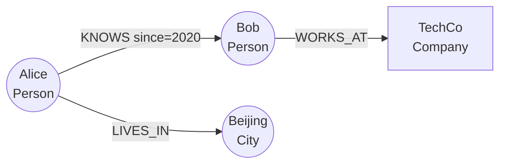

# Cypher 查询语言入门教程

> 本文系统讲解 Cypher 查询语言的核心语法。Cypher 是 Neo4j 发明的声明式图查询语言，现已成为 **openCypher** 标准，并构成 ISO/IEC 39075 **GQL（Graph Query Language）** 标准的核心。Memgraph、Apache AGE、Amazon Neptune 等主流图数据库均兼容不同子集的 Cypher [1]。
>
> 本教程示例兼容 Neo4j 5.26 LTS 与 Memgraph 3.8，差异处会单独标注。

## 一、为什么学习 Cypher

Cypher 用 ASCII 艺术风格描述图模式，可读性远胜 SQL 的多表 JOIN：

```cypher
// 这条 Cypher 语句一目了然：在北京的朋友
MATCH (p:Person {city: 'Beijing'})-[:KNOWS]->(friend)
RETURN friend.name
```

对照 SQL：

```sql
SELECT f.name
FROM person p
JOIN friendship fs ON p.id = fs.from_person_id
JOIN person f ON f.id = fs.to_person_id
WHERE p.city = 'Beijing';
```

随着 GQL 在 2024 年成为 ISO 标准，Cypher 语法的工程价值进一步上升。本教程按"由浅入深"组织：

1. **基础概念**：节点、关系、模式、变量
2. **CRUD**：CREATE / MATCH / SET / DELETE / MERGE
3. **过滤与函数**：WHERE / 运算符 / 函数
4. **聚合与排序**：count / sum / WITH / ORDER BY
5. **路径与图遍历**：最短路径、变长关系
6. **高级特性**：UNWIND、OPTIONAL MATCH、子查询、向量检索
7. **管理命令**：索引、约束、SHOW、EXPLAIN
8. **跨方言差异**：Neo4j / Memgraph / Apache AGE

## 二、基础概念

### 2.1 图数据模型

| 概念 | ASCII 符号 | 说明 |
|------|----------|------|
| **节点** | `( )` 或 `(p)` | 圆括号；小写变量标识 |
| **标签** | `:Person` | 节点类型，分隔符 `:` |
| **关系** | `-[ ]->` 或 `-[r]->` | 方括号；箭头表示方向 |
| **关系类型** | `:KNOWS` | 大写驼峰，分隔符 `:` |
| **属性** | `{key: value}` | JSON 风格的键值对 |
| **路径** | `p = ()-[]->()` | `=` 绑定到路径变量 |



对应 Cypher 表示：

```cypher
CREATE (a:Person {name: 'Alice'})
       <-[:KNOWS {since: 2020}]-(b:Person {name: 'Bob'})
       -[:WORKS_AT]->(:Company {name: 'TechCo'}),
       (a)-[:LIVES_IN]->(:City {name: 'Beijing'});
```

### 2.2 节点语法

```cypher
// 匿名节点（不绑定变量）
CREATE (:Person {name: 'Alice', age: 30});

// 具名节点
CREATE (alice:Person {name: 'Alice'}) RETURN alice;

// 多标签
CREATE (alice:Person:Employee {name: 'Alice'});

// 空节点（极少见）
CREATE ();

// 完整语法
(变量:标签1:标签2 {属性键: 值, ...})
```

### 2.3 关系语法

```cypher
// 有方向关系
(alice)-[:KNOWS]->(bob);

// 无方向关系（双向匹配）
(alice)-[:KNOWS]-(bob);

// 任意类型关系
(alice)-[]->(bob);

// 多重关系（多跳合并写）
(a)-[:KNOWS]->(b)-[:WORKS_AT]->(c);

// 关系属性
(alice)-[r:KNOWS {since: 2020, weight: 0.8}]->(bob);

// 关系变量可省略，但建议保留便于引用
```

### 2.4 标识符与变量

| 类别 | 规则 | 示例 |
|------|------|------|
| **变量** | 字母开头，可含数字/下划线，**区分大小写** | `n`, `alice`, `user_1` |
| **标签** | 驼峰或下划线 | `Person`, `Tech_Company` |
| **关系类型** | 驼峰或下划线 | `KNOWS`, `WORKS_AT` |
| **属性键** | 驼峰或下划线 | `firstName`, `created_at` |
| **关键字** | 全大写，需反引号转义 | `` `NODE` ``, `` `limit` `` |

```cypher
// 关键字作为标识符需要反引号
CREATE (n:`User` {`order`: 1});
```

## 三、CRUD 操作

### 3.1 CREATE - 创建

```cypher
// 创建单个节点
CREATE (n:Person {name: 'Alice', age: 30});

// 返回创建结果
CREATE (n:Person {name: 'Bob'}) RETURN n;

// 创建关系（同一语句内）
CREATE (a:Person {name: 'Alice'})-[:KNOWS]->(b:Person {name: 'Bob'});

// 创建复杂图
CREATE
  (alice:Person {name: 'Alice'})-[:FRIEND]->(bob:Person {name: 'Bob'}),
  (bob)-[:FRIEND]->(charlie:Person {name: 'Charlie'}),
  (alice)-[:FRIEND]->(charlie);

// 创建时使用变量引用已存在节点
MATCH (alice:Person {name: 'Alice'}), (bob:Person {name: 'Bob'})
CREATE (alice)-[:KNOWS {since: 2020}]->(bob);
```

### 3.2 MATCH - 匹配

MATCH 是 Cypher 的"SELECT"，描述要查询的**模式**而不是操作步骤：

```cypher
// 匹配所有 Person 节点
MATCH (p:Person) RETURN p;

// 带属性过滤
MATCH (p:Person {name: 'Alice'}) RETURN p;

// 匹配关系
MATCH (a:Person)-[r:KNOWS]->(b:Person) RETURN a, r, b;

// 多次出现同一标签（不同变量）
MATCH (a:Person)-[:KNOWS]->(b:Person) RETURN a, b;

// 无向匹配
MATCH (a:Person)-[:KNOWS]-(b:Person) RETURN a, b;
```

### 3.3 RETURN - 返回

```cypher
// 返回节点
MATCH (p:Person) RETURN p;

// 返回特定属性
MATCH (p:Person) RETURN p.name, p.age;

// 别名
MATCH (p:Person) RETURN p.name AS name, p.age AS age;

// 字面量 + 节点
MATCH (p:Person) RETURN 'person' AS label, p;

// DISTINCT 去重
MATCH (a:Person)-[:KNOWS]->(b:Person) RETURN DISTINCT a;
```

### 3.4 SET - 设置属性/标签

```cypher
// 设置单个属性
MATCH (p:Person {name: 'Alice'}) SET p.age = 31 RETURN p;

// 设置多个属性
MATCH (p:Person {name: 'Alice'})
SET p.age = 31, p.city = 'Beijing'
RETURN p;

// 添加标签
MATCH (p:Person {name: 'Alice'})
SET p:Employee:Manager
RETURN p;

// 移除属性（用 NULL 不会删除键，需用 REMOVE）
MATCH (p:Person {name: 'Alice'}) SET p.age = NULL RETURN p;
```

### 3.5 DELETE - 删除

```cypher
// 删除节点（必须有前提：节点无关系或已 DETACH）
MATCH (p:Person {name: 'Bob'}) DELETE p;

// DETACH DELETE 同时删除关系
MATCH (p:Person {name: 'Bob'}) DETACH DELETE p;

// 删除关系
MATCH ()-[r:KNOWS {since: 2019}]->() DELETE r;

// 删除所有节点（慎用！）
MATCH (n) DETACH DELETE n;
```

### 3.6 REMOVE - 移除属性/标签

```cypher
// 移除属性
MATCH (p:Person {name: 'Alice'}) REMOVE p.age RETURN p;

// 移除标签
MATCH (p:Person {name: 'Alice'}) REMOVE p:Manager RETURN p;
```

### 3.7 MERGE - 幂等创建

MERGE 是 Cypher 的"upsert"——存在则匹配，不存在则创建：

```cypher
// 基本 MERGE
MERGE (p:Person {email: 'alice@example.com'}) RETURN p;

// ON CREATE / ON MATCH
MERGE (p:Person {email: 'alice@example.com'})
ON CREATE SET p.createdAt = timestamp(), p.count = 1
ON MATCH  SET p.count = p.count + 1, p.lastSeen = timestamp()
RETURN p;

// MERGE 关系
MATCH (a:Person {name: 'Alice'}), (b:Person {name: 'Bob'})
MERGE (a)-[r:KNOWS]->(b)
ON CREATE SET r.since = 2020
RETURN r;
```

> ⚠️ **MERGE 性能陷阱**：MERGE 内部是 MATCH + 条件 CREATE。如果 `(:Person {name: 'Alice'})` 没有索引，会触发全图扫描。务必为 MERGE 的属性组合建立唯一约束（自动创建索引）。

## 四、模式匹配进阶

### 4.1 变长关系（路径长度）

```cypher
// 1 到 3 跳的 KNOWS 关系
MATCH (a:Person {name: 'Alice'})-[:KNOWS*1..3]->(b)
RETURN DISTINCT b.name;

// 恰好 2 跳
MATCH (a:Person)-[:KNOWS*2]->(b) RETURN b;

// 无上界（慎用，可能爆栈）
MATCH (a:Person {name: 'Alice'})-[:KNOWS*]->(b) RETURN b;

// 关系可以是多种类型
MATCH (a:Person)-[:KNOWS|FAMILY*1..2]->(b) RETURN b;
```

### 4.2 路径变量与函数

```cypher
// 绑定路径到变量 p
MATCH p = (a:Person {name: 'Alice'})-[:KNOWS*]->(b:Person {name: 'Eve'})
RETURN p;

// 路径长度
MATCH p = (a)-[:KNOWS*]->(b)
RETURN a.name, length(p) AS hops;

// 路径节点
MATCH p = (a)-[*]->(b)
RETURN nodes(p);

// 路径关系
MATCH p = (a)-[*]->(b)
RETURN relationships(p);

// 最短路径（Cypher 内置）
MATCH (a:Person {name: 'Alice'}),
      (b:Person {name: 'Eve'}),
      p = shortestPath((a)-[:KNOWS*]-(b))
RETURN p, length(p) AS len;

// Neo4j 5+ 全最短路径
MATCH (a:Person {name: 'Alice'}),
      (b:Person {name: 'Eve'}),
      p = allShortestPaths((a)-[:KNOWS*]-(b))
RETURN p;
```

### 4.3 路径谓词

```cypher
// 路径上所有节点年龄都 > 20
MATCH p = (a:Person)-[:KNOWS*1..3]->(b:Person)
WHERE all(n IN nodes(p) WHERE n.age > 20)
RETURN p;

// 路径上至少一个节点是北京人
MATCH p = (a:Person)-[:KNOWS*1..3]->(b:Person)
WHERE any(n IN nodes(p) WHERE n.city = 'Beijing')
RETURN p;

// 路径上没有任何 Manager
MATCH p = (a:Person)-[:KNOWS*1..3]->(b:Person)
WHERE none(n IN nodes(p) WHERE n:Manager)
RETURN p;

// 路径上节点数量恰好 4
MATCH p = (a)-[:KNOWS*]->(b)
WHERE length(p) = 4
RETURN p;

// 路径上每个关系类型都不同
MATCH p = (a)-[*]->(b)
WHERE size(relationships(p)) = size(apoc.coll.toSet([r IN relationships(p) | type(r)]))
RETURN p;
```

### 4.4 OPTIONAL MATCH - 可选匹配

OPTIONAL MATCH 类似 SQL 的 LEFT JOIN：模式不匹配时返回 null 而非丢失行：

```cypher
// 找出所有人及其朋友（没有朋友的也返回，friends 为 null）
MATCH (a:Person)
OPTIONAL MATCH (a)-[:KNOWS]->(friend)
RETURN a.name, collect(friend.name) AS friends;

// 找出 2020 年前认识的朋友
MATCH (a:Person {name: 'Alice'})
OPTIONAL MATCH (a)-[r:KNOWS]->(friend)
WHERE r.since < 2020
RETURN a.name, friend.name;
```

## 五、数据过滤与函数

### 5.1 WHERE 子句

```cypher
// 等值
MATCH (p:Person) WHERE p.name = 'Alice' RETURN p;

// 多条件
MATCH (p:Person)
WHERE p.age >= 18 AND p.city = 'Beijing'
RETURN p;

// IN 列表
MATCH (p:Person)
WHERE p.city IN ['Beijing', 'Shanghai', 'Shenzhen']
RETURN p;

// 范围 BETWEEN（部分实现）
MATCH (p:Person)
WHERE p.age BETWEEN 20 AND 30
RETURN p;

// 存在性检查
MATCH (p:Person)
WHERE exists(p.email)
RETURN p;

// 字符串匹配
MATCH (p:Person)
WHERE p.name STARTS WITH 'A'
RETURN p;

MATCH (p:Person)
WHERE p.name CONTAINS 'li'
RETURN p;

MATCH (p:Person)
WHERE p.name ENDS WITH 'e'
RETURN p;

// 正则
MATCH (p:Person)
WHERE p.name =~ 'A.*e'
RETURN p;
```

### 5.2 运算符

| 类别 | 运算符 |
|------|--------|
| **算术** | `+`, `-`, `*`, `/`, `%`, `^` |
| **比较** | `=`, `<>`, `<`, `>`, `<=`, `>=`, `IS NULL`, `IS NOT NULL` |
| **字符串** | `STARTS WITH`, `ENDS WITH`, `CONTAINS`, `+`（拼接） |
| **逻辑** | `AND`, `OR`, `NOT`, `XOR` |
| **列表** | `IN`, `=`, `<>` |
| **属性存在** | `exists(p.key)` 或 `p.key IS NOT NULL` |
| **范围** | `<x> BETWEEN <a> AND <b>` |

```cypher
// 算术
MATCH (p:Person) RETURN p.age + 1 AS next_year_age;

// 列表运算
WITH [1, 2, 3] AS list
RETURN list[0] AS first, size(list) AS len,
       list + [4, 5] AS appended,
       [x IN list WHERE x > 1] AS filtered;
```

### 5.3 函数库（按类别）

#### 标量函数

```cypher
// 字符串
RETURN toUpper('hello'),        // 'HELLO'
       toLower('WORLD'),        // 'world'
       trim('  spaced  '),      // 'spaced'
       replace('hello', 'l', 'r'), // 'herro'
       split('a,b,c', ','),     // ['a', 'b', 'c']
       size('hello'),           // 5
       substring('hello', 1, 3); // 'ell'

// 数值
RETURN abs(-5),          // 5
       round(3.7),       // 4
       ceil(3.2),        // 4
       floor(3.8),       // 3
       rand();           // [0, 1)

// 逻辑
RETURN coalesce(null, 'default'),  // 'default'
       toBoolean('true');           // true
```

#### 时间函数

```cypher
RETURN datetime() AS now,
       datetime('2026-08-21T10:00:00') AS specific,
       date() AS today,
       time() AS curr_time;

// 访问分量
WITH datetime() AS dt
RETURN dt.year, dt.month, dt.day, dt.hour, dt.minute, dt.second;

// 时间算术
WITH datetime() AS now
RETURN now + duration({days: 7}) AS next_week;

// Duration 字面量
RETURN duration('P1Y2M10DT3H');  // 1年2月10天3小时
```

#### 类型转换

```cypher
RETURN toInteger('42'),     // 42
       toFloat('3.14'),     // 3.14
       toString(42),        // '42'
       toBoolean('true');   // true
```

#### 列表函数

```cypher
WITH [3, 1, 4, 1, 5, 9, 2, 6] AS nums
RETURN size(nums) AS len,             // 8
       head(nums) AS first,           // 3
       tail(nums) AS rest,            // [1, 4, 1, 5, 9, 2, 6]
       last(nums) AS last_el,         // 6
       reverse(nums) AS rev,          // [6, 2, 9, 5, 1, 4, 1, 3]
       reduce(acc = 0, x IN nums | acc + x) AS sum,  // 31
       [x IN nums WHERE x > 3] AS filtered,          // [4, 5, 9, 6]
       apoc.coll.sort(nums) AS sorted;
```

> ⚠️ `apoc.coll.sort` 等 APOC 函数仅 Neo4j 可用。Memgraph 用 `mg.util.sort` 或原生函数。

#### 空间函数（Neo4j）

```cypher
WITH point({longitude: 116.40, latitude: 39.90}) AS beijing,
     point({longitude: 121.47, latitude: 31.23}) AS shanghai
RETURN distance(beijing, shanghai) AS km;  // ~1067 公里
```

## 六、聚合与排序

### 6.1 聚合函数

| 函数 | 用途 |
|------|------|
| `count(n)` | 行数，count(*) 计所有行 |
| `sum(n)` | 求和（忽略 null） |
| `avg(n)` | 平均值 |
| `min(n)` / `max(n)` | 最值 |
| `collect(n)` | 聚合为列表 |
| `count(DISTINCT n)` | 去重计数 |
| `stDev(n)` / `percentileDisc(n, p)` | 统计 |

```cypher
// 每个城市的用户数
MATCH (p:Person)-[:LIVES_IN]->(c:City)
RETURN c.name AS city, count(p) AS population
ORDER BY population DESC;

// 多个聚合
MATCH (p:Person)
RETURN avg(p.age) AS avg_age,
       min(p.age) AS min_age,
       max(p.age) AS max_age,
       count(p) AS total,
       collect(p.name)[..3] AS sample_names;
```

### 6.2 GROUP BY（隐式）

Cypher 没有显式 GROUP BY，**RETURN 中非聚合字段自动成为分组键**：

```cypher
// 按城市分组：每个城市的人数和平均年龄
MATCH (p:Person)-[:LIVES_IN]->(c:City)
RETURN c.name AS city,
       count(p) AS count,
       avg(p.age) AS avg_age
ORDER BY count DESC;
```

### 6.3 ORDER BY / LIMIT / SKIP

```cypher
MATCH (p:Person)
RETURN p.name, p.age
ORDER BY p.age DESC, p.name ASC   // 多字段排序
SKIP 10                          // 跳过前 10 行
LIMIT 5;                         // 取 5 行

// 取第 11~15 名（分页）
MATCH (p:Person)
RETURN p
ORDER BY p.score DESC
SKIP 10 LIMIT 5;
```

### 6.4 WITH - 管道（最重要的高级特性）

WITH 是 Cypher 的"管道"，允许将前一段结果作为后一段的输入：

```cypher
// 找出超过 5 个朋友的"社交达人"
MATCH (p:Person)-[:KNOWS]->(friend)
WITH p, count(friend) AS friend_count
WHERE friend_count > 5
RETURN p.name, friend_count
ORDER BY friend_count DESC;

// 聚合后再展开
MATCH (p:Person)-[:LIVES_IN]->(c:City)
WITH c, count(p) AS pop
ORDER BY pop DESC LIMIT 5
WITH collect(c) AS top_cities
UNWIND top_cities AS city
MATCH (city)<-[:LIVES_IN]-(p:Person)
RETURN city.name, p.name;
```

## 七、高级特性

### 7.1 UNWIND - 列表展开

```cypher
// 展开字面量列表
UNWIND [1, 2, 3] AS x
RETURN x * 2 AS doubled;

// 实际用法：批量插入
WITH [
  {name: 'Alice', age: 30},
  {name: 'Bob', age: 28},
  {name: 'Charlie', age: 35}
] AS people
UNWIND people AS person
MERGE (p:Person {name: person.name})
SET p.age = person.age;
```

### 7.2 CASE 表达式

```cypher
MATCH (p:Person)
RETURN p.name,
       CASE
         WHEN p.age < 18 THEN 'minor'
         WHEN p.age < 60 THEN 'adult'
         ELSE 'senior'
       END AS category;

// 简单 CASE
MATCH (p:Person)
RETURN p.name,
       CASE p.role
         WHEN 'admin' THEN '管理员'
         WHEN 'user'  THEN '用户'
         ELSE '访客'
       END AS role_label;
```

### 7.3 UNION / UNION ALL

```cypher
// 合并两个查询的结果（去重）
MATCH (p:Person) RETURN p.name AS name
UNION
MATCH (c:Company) RETURN c.name AS name;

// 不去重
MATCH (p:Person) RETURN p.name AS name
UNION ALL
MATCH (c:Company) RETURN c.name AS name;
```

### 7.4 子查询（Cypher 5 标准）

#### EXISTS 子查询

```cypher
MATCH (p:Person)
WHERE EXISTS {
  MATCH (p)-[:ACTED_IN]->(:Movie {year: 2020})
}
RETURN p.name;
```

#### COUNT 子查询

```cypher
MATCH (p:Person)
WHERE COUNT {
  MATCH (p)-[:DIRECTED]->(:Movie)
} > 2
RETURN p.name AS director, COUNT { MATCH (p)-[:DIRECTED]->(m:Movie) } AS film_count;
```

#### COLLECT 子查询

```cypher
MATCH (p:Person)
RETURN p.name,
       COLLECT {
         MATCH (p)-[:ACTED_IN]->(m:Movie)
         RETURN m.title
       } AS movies;
```

> ⚠️ 子查询在 Apache AGE 中支持有限，迁移需验证。

### 7.5 向量检索（Neo4j 5.11+ / Memgraph 3.0+）

```cypher
// Neo4j：使用 db.index.vector.queryNodes
CALL db.index.vector.queryNodes('movie_embedding', 5, $query_embedding)
YIELD node, score
RETURN node.title, score;

// Memgraph：使用 vector_search 函数
MATCH (m:Movie)
WITH vector_search([m IN collect(m) | m], $query_embedding, 5) AS results
UNWIND results AS r
RETURN r.node.title, r.score;
```

### 7.6 动态标签 / 关系类型

```cypher
// 通过参数化避免拼接字符串
WITH 'Person' AS labelName
CALL apoc.create.nodes([labelName], [{name: 'Alice'}]) YIELD node
RETURN node;

// Neo4j 5 推荐用 apoc.dynamic 替代字符串拼接
```

## 八、管理与调优

### 8.1 索引

```cypher
// 单属性索引
CREATE INDEX person_name FOR (p:Person) ON (p.name);

// 复合索引（多属性）
CREATE INDEX person_name_age FOR (p:Person) ON (p.name, p.age);

// 关系属性索引
CREATE INDEX rel_since FOR ()-[r:KNOWS]-() ON (r.since);

// 文本索引（Neo4j 5+）
CREATE INDEX person_name_text FOR (p:Person) ON (p.name)
OPTIONS { indexProvider: 'text-2.0' };

// 向量索引（Neo4j 5.11+）
CREATE VECTOR INDEX doc_vec IF NOT EXISTS
FOR (d:Document) ON (d.embedding)
OPTIONS {
  indexConfig: {
    `vector.dimensions`: 1536,
    `vector.similarity_function`: 'cosine'
  }
};

// Memgraph 向量索引
CREATE VECTOR INDEX doc_vec
ON :Document(embedding)
WITH DIMENSION 1536, TYPE "hnsw";

// 查看索引
SHOW INDEXES;

// 删除索引
DROP INDEX person_name;
```

### 8.2 约束（自动创建索引）

```cypher
// 唯一约束
CREATE CONSTRAINT person_email_unique FOR (p:Person) REQUIRE p.email IS UNIQUE;

// 属性存在约束
CREATE CONSTRAINT person_name_exists FOR (p:Person) REQUIRE p.name IS NOT NULL;

// 节点键（多属性唯一）
CREATE CONSTRAINT person_node_key
FOR (p:Person) REQUIRE (p.id, p.email) IS NODE KEY;

// 属性类型约束（Neo4j 5+）
CREATE CONSTRAINT person_age_type
FOR (p:Person) REQUIRE p.age IS :: INTEGER;

// 关系属性约束
CREATE CONSTRAINT knows_since_exists
FOR ()-[r:KNOWS]-() REQUIRE r.since IS NOT NULL;

// 查看约束
SHOW CONSTRAINTS;
```

### 8.3 SHOW 命令（Cypher 5）

```cypher
SHOW DATABASES;
SHOW TABLES;
SHOW INDEXES;
SHOW CONSTRAINTS;
SHOW USERS;
SHOW ROLES;
SHOW PRIVILEGES;
SHOW PROCEDURES;
SHOW FUNCTIONS;
SHOW TRANSACTIONS;
```

### 8.4 查询分析与调优

```cypher
// EXPLAIN：显示执行计划（不执行）
EXPLAIN
MATCH (p:Person {city: 'Beijing'})-[:KNOWS]->(f)
RETURN f.name;

// PROFILE：执行并显示实际统计
PROFILE
MATCH (p:Person {city: 'Beijing'})-[:KNOWS]->(f)
RETURN f.name;
```

**PROFILE 输出关键指标**：

| 字段 | 含义 |
|------|------|
| `db hits` | 数据库访问次数（越少越好） |
| `Rows` | 该算子输出行数 |
| `EstimatedRows` | 优化器估算 |
| `Memory` | 算子占用内存 |
| `Time` | 算子执行时间 |

```cypher
// 终止慢查询（Neo4j 5+）
SHOW TRANSACTIONS YIELD transactionId, currentQuery
WHERE currentQuery CONTAINS 'long_running_pattern';
TERMINATE TRANSACTION 'transaction-uuid';

// Memgraph 类似
SHOW QUERIES;
TERMINATE QUERY <query_id>;
```

## 九、调用 Cypher 的最佳实践

### 9.1 参数化查询（防注入）

```python
# 永远不要拼接 Cypher 字符串！
# 错误：
query = f"MATCH (p:Person {{name: '{user_input}'}}) RETURN p"

# 正确：参数化
query = "MATCH (p:Person {name: $name}) RETURN p"
session.run(query, name=user_input)
```

### 9.2 命名规范

| 类别 | 命名风格 | 示例 |
|------|---------|------|
| 标签 | PascalCase | `Person`, `TechCompany` |
| 关系类型 | UPPER_SNAKE_CASE 或 PascalCase | `KNOWS`, `WORKS_AT` |
| 属性键 | camelCase 或 snake_case | `firstName`, `created_at` |
| 变量 | camelCase | `alice`, `firstFriend` |

### 9.3 性能优化清单

```cypher
-- ✓ 为 WHERE / MATCH 使用的属性建立索引
CREATE INDEX ON :Person(name);

-- ✓ 用 LIMIT 避免无界返回
MATCH (n) RETURN n LIMIT 100;

-- ✓ 优先使用 MERGE 而非 MATCH + CREATE
MERGE (p:Person {id: $id}) RETURN p;

-- ✓ 避免在 MATCH 中使用全图扫描
-- 错误 MATCH (n) WHERE n.name = 'Alice'
-- 正确 MATCH (n:Person {name: 'Alice'})

-- ✓ OPTIONAL MATCH 会拖慢查询，按需使用

-- ✓ 用 PROFILE 验证是否走索引
PROFILE MATCH (p:Person {name: 'Alice'}) RETURN p;

-- ✓ 用 DETACH DELETE 一次清空（慎用！）
MATCH (n) DETACH DELETE n;

-- ✓ 变长关系设置上限
MATCH (a)-[:KNOWS*1..5]->(b)  -- 不要用 *（无上界）
```

## 十、跨方言差异

虽然都兼容 openCypher，三大主流实现在细节上有差异：

| 特性 | Neo4j 5.26 LTS | Memgraph 3.8 | Apache AGE 1.7/1.8 |
|------|----------------|--------------|---------------------|
| **驱动协议** | Bolt | Bolt | PostgreSQL（psycopg2） |
| **Cypher 版本** | 完整 Cypher 5 + GQL | openCypher + 扩展 | openCypher **子集** |
| **子查询** | EXISTS / COUNT / COLLECT | 支持 | 部分支持 |
| **EXPLAIN / PROFILE** | ✅ | ✅ `EXPLAIN` | 通过 PostgreSQL EXPLAIN |
| **SHOW 系列** | 完整 | 部分（SHOW INDEX INFO 等） | 通过 PG 系统表 |
| **SHOW PROCEDURES** | ✅ | ✅ `CALL mg.procedures()` | N/A |
| **APOC 函数** | 完整 | 部分（`apoc.*` 子集 + MAGE） | N/A |
| **向量检索** | `db.index.vector.queryNodes()` | `vector_search()` 函数 | 依赖 pgvector |
| **创建图** | 隐式（用数据库） | 隐式 | `SELECT create_graph('g')` |
| **Cypher 调用** | 原生 | 原生 | `SELECT * FROM cypher('g', $$...$$)` |
| **事务** | 显式 / 隐式 / Managed | 显式 / Managed | PG 标准事务 |
| **写冲突重试** | 需手动 | 需手动 | 由 PG 处理 |
| **MATCH() 复杂度** | `*` 无上界禁止 | `*` 允许但要小心 | `*` 性能差 |

### 10.1 Apache AGE 的 Cypher 子集限制

```cypher
-- ❌ AGE 不支持：Cypher 5 的 EXISTS 子查询
MATCH (p:Person)
WHERE EXISTS { MATCH (p)-[:KNOWS]->(:Person) }  -- AGE 部分支持
RETURN p;

-- ✓ AGE 替代方案：用 WITH + 列表判断
MATCH (p:Person)-[:KNOWS]->(:Person)
WITH p, count(*) AS cnt
WHERE cnt > 0
RETURN p;

-- ❌ AGE 不支持：复合函数调用
-- ❌ AGE 不支持：变量长度列表属性访问
-- ✓ AGE 支持：基础 MATCH / CREATE / MERGE / DELETE / SET
```

### 10.2 跨方言写法对照

```cypher
// Neo4j: 查看所有函数
SHOW FUNCTIONS;

// Memgraph: 通过过程
CALL mg.functions() YIELD *;

// AGE: 通过 PG 系统表
SELECT proname FROM pg_proc WHERE pronamespace = 'ag_catalog'::regnamespace;
```

## 十一、实战案例

### 11.1 数据建模：电影数据库

```cypher
// 节点
CREATE (matrix:Movie {title: 'The Matrix', year: 1999, plot: 'A computer hacker learns about the true nature of reality.'})
CREATE (keanu:Person {name: 'Keanu Reeves', born: 1964})
CREATE (carrie:Person {name: 'Carrie-Anne Moss', born: 1967})
CREATE (lana:Person {name: 'Lana Wachowski', born: 1965})
CREATE (keanu)-[:ACTED_IN {role: 'Neo'}]->(matrix)
CREATE (carrie)-[:ACTED_IN {role: 'Trinity'}]->(matrix)
CREATE (lana)-[:DIRECTED]->(matrix);
```

### 11.2 查询：科幻电影的所有导演

```cypher
MATCH (m:Movie)
WHERE m.plot CONTAINS 'reality' OR m.title CONTAINS 'Matrix'
MATCH (m)<-[:DIRECTED]-(director:Person)
RETURN m.title, collect(director.name) AS directors;
```

### 11.3 推荐：与指定演员合作过的导演

```cypher
MATCH (keanu:Person {name: 'Keanu Reeves'})-[:ACTED_IN]->(m:Movie)
      <-[:DIRECTED]-(director:Person)
RETURN director.name, count(DISTINCT m) AS films_with_keanu
ORDER BY films_with_keanu DESC;
```

### 11.4 图算法调用（Memgraph MAGE）

```cypher
// PageRank
CALL pagerank.get() YIELD node, rank
WHERE node:Movie
RETURN node.title, round(rank * 1000) / 1000 AS score
ORDER BY score DESC LIMIT 5;

// Neo4j GDS 类似：
// CALL gds.pageRank.stream('my-graph')
// YIELD nodeId, score
// RETURN gds.util.asNode(nodeId).title AS title, score
```

### 11.5 端到端 RAG 检索（Neo4j 向量 + Cypher）

```cypher
// 1. 召回相关文档
CALL db.index.vector.queryNodes('doc_embedding', 10, $query_embedding)
YIELD node AS doc, score

// 2. 沿图遍历（文档→提及的实体→相关实体）
MATCH (doc)-[:MENTIONS]->(entity)
MATCH (entity)-[:RELATED_TO*1..2]-(related)
WHERE NOT (related) IN collect(entity)  // 去重

// 3. 排序、拼接 prompt
WITH doc, score, collect(DISTINCT related.name) AS related_names
RETURN doc.text AS content,
       score,
       apoc.text.join(related_names, ', ') AS related_entities
ORDER BY score DESC;
```

## 十二、参考资源

### 官方文档

- [Neo4j Cypher 手册](https://neo4j.com/docs/cypher-manual/5/)
- [Neo4j GQL 标准](https://www.gqlstandards.org/)
- [Memgraph Cypher 文档](https://memgraph.com/docs/querying)
- [Apache AGE Cypher 文档](https://age.apache.org/age-manual/master/intro/cypher.html)
- [openCypher 项目](https://www.opencypher.org/)

### 学习资源

- [Neo4j GraphAcademy（免费课程）](https://graphacademy.neo4j.com/)
- [Memgraph Jupyter 教程](https://github.com/memgraph/jupyter-memgraph-tutorials)
- [Apache AGE 教程](https://age.apache.org/getstarted/)

### 工具

- [Neo4j Browser](https://browser.neo4j.io/)（在线试用）
- [Memgraph Lab](https://memgraph.com/docs/memgraph-lab)
- [Cypher Cheat Sheet](https://neo4j.com/docs/cypher-manual/current/clauses/)

## 参考来源

[1] Neo4j Cypher Manual 5。<https://neo4j.com/docs/cypher-manual/5/introduction/>

[3] openCypher 规范。<https://www.opencypher.org/>

[4] GQL 国际标准（ISO/IEC 39075）。<https://www.iso.org/standard/76120.html>

[5] Neo4j 向量索引。<https://neo4j.com/docs/cypher-manual/current/indexes/semantic-indexes/vector-indexes/>

[6] Memgraph 3.8 发布博客。<https://memgraph.com/blog/memgraph-3-8-release-atomic-graphrag-vector-single-store-parallel-runtime>

[7] Apache AGE Cypher 格式。<https://age.apache.org/age-manual/master/intro/cypher.html>

[8] Neo4j Cypher 5 新特性。<https://neo4j.com/blog/developer/cypher-5-whats-new/>
