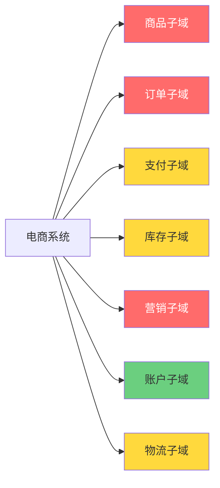
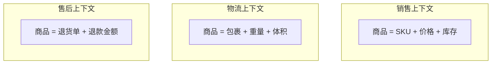
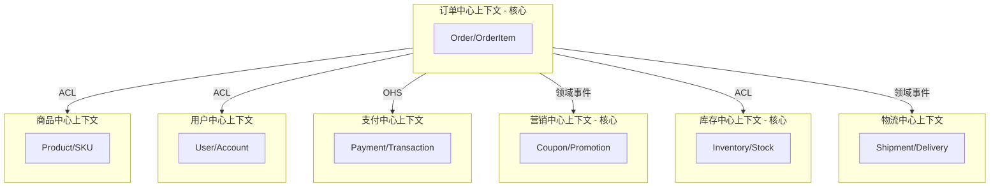
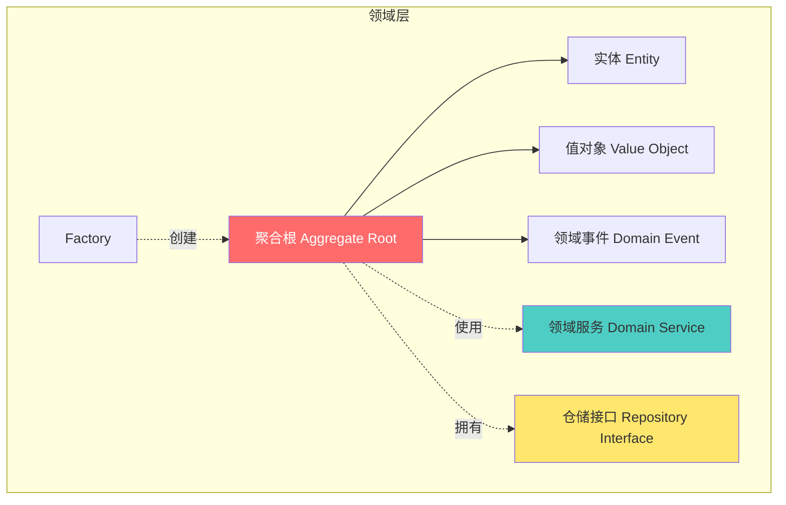
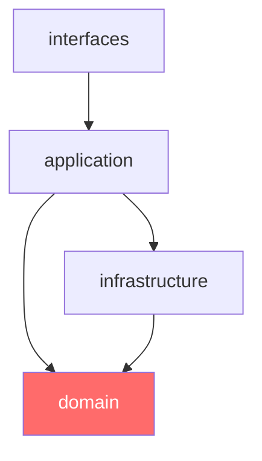
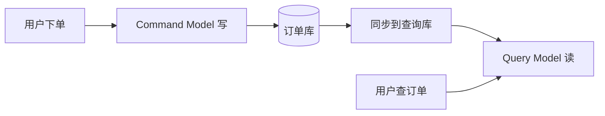
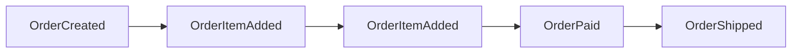
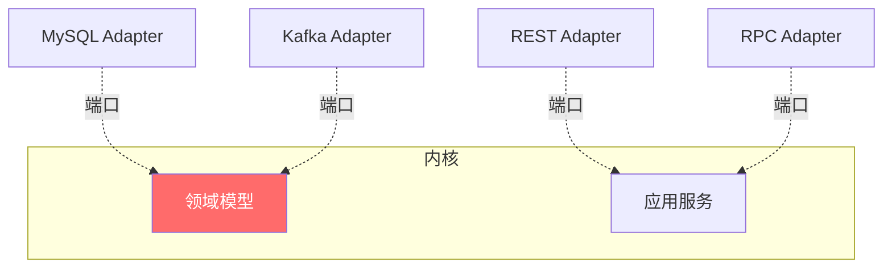
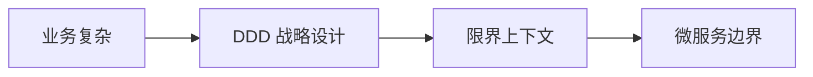

# DDD 领域驱动设计入门教程：从三层架构到领域建模

> 本教程面向**长期使用 Spring Boot + 三层架构（MVC）的专业程序员**，目标是把"领域驱动设计（Domain-Driven Design）"这套看似高大上的方法论，落到你每天写的 Service / Repository / Controller 上。
>
> 读完本文你将：
> 1. 理解 DDD 解决了三层架构解决不了的什么问题
> 2. 掌握 DDD 的战略设计（子域、限界上下文、上下文映射）
> 3. 掌握 DDD 的战术设计（实体、值对象、聚合、领域服务、领域事件、仓储）
> 4. 能在 Spring Boot 工程中落地 DDD 项目结构
> 5. 看懂 CQRS、Event Sourcing、六边形架构这些进阶话题的方向

---

## 目录

- [第 1 章：为什么我们写的代码总是"腐烂"](#第-1-章为什么我们写的代码总是腐烂)
- [第 2 章：DDD 不是什么、是什么](#第-2-章ddd-不是什么是什么)
- [第 3 章：战略设计 —— 拆业务](#第-3-章战略设计--拆业务)
- [第 4 章：战术设计 —— 写模型](#第-4-章战术设计--写模型)
- [第 5 章：Spring Boot 实战 —— 完整订单案例](#第-5-章spring-boot-实战--完整订单案例)
- [第 6 章：项目结构与工程化](#第-6-章项目结构与工程化)
- [第 7 章：进阶话题与常见误区](#第-7-章进阶话题与常见误区)
- [附录：参考资源](#附录参考资源)

---

## 第 1 章：为什么我们写的代码总是"腐烂"

### 1.1 一个你肯定见过的故事

假设你用 Spring Boot + MyBatis + 三层架构做了个电商订单系统。一开始很清晰：

```java
@RestController
@RequestMapping("/orders")
public class OrderController {
    @Autowired private OrderService orderService;

    @PostMapping
    public Order create(@RequestBody CreateOrderRequest req) {
        return orderService.create(req);
    }
}

@Service
public class OrderService {
    @Autowired private OrderDao orderDao;
    @Autowired private UserDao userDao;
    @Autowired private InventoryDao inventoryDao;

    @Transactional
    public Order create(CreateOrderRequest req) {
        // 1. 校验参数
        // 2. 查用户
        // 3. 查库存
        // 4. 算价格
        // 5. 减库存
        // 6. 写订单
        // 7. 通知
    }
}

@Repository
public interface OrderDao { ... }
```

上线 3 个月，业务跑得很顺。然后产品开始加需求：

| 需求变更 | 你的痛苦 |
|---|---|
| 订单要支持多种优惠叠加 | Service 越来越长，从 50 行变 300 行 |
| 订单状态机变复杂 | if-else 嵌套 5 层，加个新状态要改 8 个文件 |
| 想把订单拆成独立微服务 | 不知道从哪儿切，DAO 之间互相调用 |
| 团队从 3 人变 20 人 | 改一个需求要联调 5 个服务，互相冲突 |
| 新人入职看不懂代码 | 改一处崩三处，测试覆盖率为 0 |

最后你打开 Service 文件，发现它有 1200 行，方法参数 8 个，里面全是 `if (type == 1) { ... } else if (type == 2) { ... }`。

**这就是"代码腐烂"——业务越复杂，代码越难维护。**

### 1.2 三层架构的核心问题：贫血模型

你写过的 `Order` 实体类大概率长这样：

```java
@Data
public class Order {
    private Long id;
    private Long userId;
    private String status;
    private BigDecimal totalAmount;
    private List<OrderItem> items;
    private Date createdAt;
}
```

它只是一堆字段 + getter/setter，**没有任何业务行为**。所有逻辑都在 `OrderService` 里。

这种模型叫**"贫血领域模型"（Anemic Domain Model）**——它是反 OO 的，本质上是一个 DTO（数据传输对象）伪装成了领域对象。

> Martin Fowler：*Anemic Domain Model 是反模式。* 如果你只用对象做数据容器，所有行为都在 Service 里，那你写的其实是"C 语言 + Spring 容器"。

### 1.3 真实根因：业务复杂度与技术复杂度混在一起

三层架构不会"教你"如何组织业务。它的分层是**技术视角**的：

```text
Controller  →  表现层（HTTP、序列化）
Service     →  业务层（看上去很"业务"，但其实只是"事务脚本"）
Dao         →  数据访问层（SQL）
```

问题在于：
- 业务被压扁在 Service 层，**没有内聚**到"订单"、"用户"这些业务概念上
- 业务规则散落在 if-else 里，**没有自己的名字**
- 数据库表结构成了"事实标准"，**代码反而成了表的翻译层**

**DDD 的核心主张**：软件复杂性来自业务，不是来自技术。我们应该**用业务的语言组织代码**，让代码成为业务的镜像。

---

## 第 2 章：DDD 不是什么、是什么

### 2.1 DDD 不是框架，不是 ORM

很多人误以为 DDD 是某种"框架"或者"高级 ORM"。这是最大的误解。

DDD 的本质是一套**建模方法论 + 沟通约定**，由 Eric Evans 在 2003 年的同名书提出。它不绑定任何技术栈，但和 Spring、Axon、COLA 等框架配合得最好。

### 2.2 DDD 的两大板块

| 板块 | 解决什么问题 | 核心工具 |
|---|---|---|
| **战略设计（Strategic Design）** | 如何拆分一个复杂业务系统 | 通用语言、子域、限界上下文、上下文映射 |
| **战术设计（Tactical Design）** | 在一个限界上下文内如何写代码 | 实体、值对象、聚合、领域服务、领域事件、仓储 |

打个比方：
- **战略设计**是城市规划：哪里是商业区、哪里是住宅区、哪里是工业区
- **战术设计**是盖房子：房子里的房间、厨房、卫生间怎么布局

### 2.3 DDD 的中心思想：通用语言（Ubiquitous Language）

DDD 第一条原则：

> **开发者、业务专家（产品/运营）必须使用同一套语言沟通。这套语言要直接体现在代码里。**

举个例子：

❌ 三层架构下，产品说"下单"，开发听到的是"INSERT INTO orders"。两边语言不通。

✅ DDD 下，产品说"**创建订单**"，开发也用 `Order.create()`、`createOrder` 这个方法名。这就是**通用语言**。

通用语言不是名词表，而是**贯穿需求文档、代码、单元测试、UML 图的统一词汇**。它需要持续演化，但一旦确定，**所有人的沟通效率都会提升**。

### 2.4 DDD 和"设计模式"的关系

DDD 不等于"贫血模型 + Repository + Factory 模式"。这些**战术模式只是 DDD 的工具集**。

真正区分"用 DDD"和"只是用 DDD 模式"的，是**有没有站在业务视角建模**。

```java
// ❌ 只是用了 DDD 模式，但思维还是三层
@Entity
public class Order {
    private Long id;
    private OrderStatus status;
}

@Service
public class OrderDomainService {
    public void pay(Order order) { ... }  // 行为都在 Service
}

// ✅ 真正的 DDD：行为归属到领域对象
@Entity
public class Order {
    private OrderStatus status;
    private List<OrderItem> items;
    private Money totalAmount;

    public void pay(Money paidAmount) {
        if (status != OrderStatus.UNPAID) {
            throw new OrderAlreadyPaidException(id);
        }
        if (!paidAmount.equals(totalAmount)) {
            throw new PaymentAmountMismatchException();
        }
        this.status = OrderStatus.PAID;
        registerEvent(new OrderPaidEvent(this.id, this.totalAmount));
    }
}
```

差异：**业务行为从 Service 搬回了 Order 本身**。Service 只负责编排，Order 自己负责"何为已支付"。

---

## 第 3 章：战略设计 —— 拆业务

> 战略设计回答的问题是：**一个复杂的业务系统，应该怎么切分？**

### 3.1 子域（Subdomain）：业务的"自然边界"

把整个业务想象成一片大陆，上面有**核心域（Core Domain）**、**支撑子域（Supporting Subdomain）**、**通用子域（Generic Subdomain）**。

以电商系统为例：



| 类型 | 含义 | 例子 | 资源投入 |
|---|---|---|---|
| **核心域** | 公司的核心竞争力，最复杂、最易变 | 订单、商品、营销 | 最好的人、最多的时间 |
| **支撑子域** | 业务必需但不是核心竞争力 | 支付、物流 | 适当投入 |
| **通用子域** | 业界通用解决方案，可外包 | 用户管理、权限、通知 | 能买就买（用 SaaS） |

**关键判断**：哪些是核心域？问自己两个问题：
1. 没了它公司会死吗？
2. 竞争对手能轻易抄走吗？

如果两个都"是"，那大概率是核心域。

### 3.2 限界上下文（Bounded Context）：代码的"物理边界"

子域是**业务视角**的切分，限界上下文是**代码视角**的切分。

> 一个限界上下文 = 一份通用语言 + 一个独立的代码工程 + 一套独立的部署单元

举例：同样是"商品"这个词，在不同上下文里含义不同：



它们都叫"商品"，但**模型、字段、行为完全不同**。如果强行用一个 `Product` 类兼容所有上下文，就成了"上帝类"。

**所以：每个限界上下文里，"商品"是一个独立的领域模型**，名字可能都不一样（`Sku`、`Package`、`ReturnableItem`）。

### 3.3 上下文映射（Context Map）：限界上下文之间怎么打交道

限界上下文之间不能"老死不相往来"，它们要协作。**Context Map 描述这种协作关系**：

| 模式 | 关系 | 例子 |
|---|---|---|
| **合作关系（Partnership）** | 两个上下文同进退，团队紧密协作 | 订单和支付 |
| **客户-供应商（Customer-Supplier）** | 上游决定接口，下游提需求 | 订单（下游）调用支付（上游） |
| **防腐层（ACL, Anti-Corruption Layer）** | 下游为了不被上游污染，加一层翻译 | 订单调用老系统时写的 Adapter |
| **开放主机服务（OHS）** | 上游提供明确稳定的 API（REST/gRPC） | 支付对外暴露的 OpenAPI |
| **发布语言（Published Language）** | 双方用 JSON Schema / Avro 这种共享格式通信 | 上下游用 Kafka + Avro 传消息 |
| **共享内核（Shared Kernel）** | 双方共享一小段代码 | 共同引用 `commons-ddd` |

> 真实项目里，**防腐层（ACL）是最常用的**。它的作用是：上游怎么变，我都不受冲击。

### 3.4 战略设计实战：拆一个电商系统

假设你接到一个"老电商系统重构"的需求，原系统是一个 50 万行代码的 Spring Boot 单体。第一步是**画上下文地图**：



**关键产出物**：
1. 一份**上下文地图**（上面这种图）
2. 每个上下文的**通用语言词汇表**（写代码的"字典"）
3. 每个上下文的**业务边界说明**（什么属于这里，什么不属于）

战略设计做完，你就能回答"为什么这么拆"——这是和领导、架构师对齐的关键。

### 3.5 战略设计中的常见错误

❌ **按技术分层拆**："Order 全部归一个微服务，但里面有商品、用户、支付逻辑" —— 这是按表名分，不是按业务分

❌ **拆得太细**："订单创建"和"订单查询"分两个上下文 —— 过早优化

❌ **完全没有战略设计**：上来就写代码，写完发现表结构满天飞

✅ **正确节奏**：
1. 业务专家 + 架构师 + 资深开发一起梳理**子域**
2. 用**事件风暴（Event Storming）**找出领域事件、聚合、命令
3. 圈出**限界上下文**
4. 画**上下文地图**，确定集成方式
5. 再开始写代码

---

## 第 4 章：战术设计 —— 写模型

> 战术设计回答的问题：**在一个限界上下文内，每个业务概念怎么用代码表达？**

战术设计的核心是**聚合**。所有其他概念（实体、值对象、仓储、领域事件）都是为聚合服务的。

### 4.1 实体（Entity）

**有唯一标识（ID）、生命周期可变**的对象。两个实体即使所有字段都相同，也不相等（因为 ID 不同）。

```java
public class Order {
    @Getter
    private final OrderId id;  // 唯一标识

    private OrderStatus status;
    private List<OrderItem> items;
    private Money totalAmount;
    private UserId buyerId;

    // 行为归属
    public void addItem(ProductId productId, int quantity, Money price) {
        // 业务规则：未支付状态才能加商品
        if (status != OrderStatus.UNPAID) {
            throw new OrderCannotBeModifiedException(id);
        }
        OrderItem item = new OrderItem(productId, quantity, price);
        this.items.add(item);
        recalculateTotalAmount();
    }

    private void recalculateTotalAmount() {
        this.totalAmount = items.stream()
            .map(OrderItem::subtotal)
            .reduce(Money.ZERO, Money::add);
    }
}
```

**实体的特征**：
- 有 ID（`OrderId` 是值对象，下文讲）
- 有**生命周期**（创建 → 修改 → 销毁）
- **可变**（状态会变）
- **相等性通过 ID 判断**（不是字段）

### 4.2 值对象（Value Object）

**没有唯一标识、不可变、纯粹描述一个值**的对象。两个值对象字段相同就相等。

```java
// Money 是经典的值对象
public class Money {
    private final BigDecimal amount;
    private final Currency currency;

    public Money(BigDecimal amount, Currency currency) {
        if (amount == null) throw new IllegalArgumentException("amount required");
        if (currency == null) throw new IllegalArgumentException("currency required");
        this.amount = amount;
        this.currency = currency;
    }

    public Money add(Money other) {
        if (!currency.equals(other.currency)) {
            throw new CurrencyMismatchException();
        }
        return new Money(amount.add(other.amount), currency);
    }

    // 相等性通过字段判断
    @Override
    public boolean equals(Object o) {
        if (this == o) return true;
        if (!(o instanceof Money)) return false;
        Money money = (Money) o;
        return amount.compareTo(money.amount) == 0
            && currency.equals(money.currency);
    }

    @Override
    public int hashCode() {
        return Objects.hash(amount, currency);
    }
}
```

**值对象的特征**：
- **没有 ID**
- **不可变**（setter 不存在，只能 new 一个新的）
- **无副作用**（`add` 返回新对象，不修改 this）
- **相等性通过字段判断**

**为什么值对象重要？**

❌ 三层架构的写法：
```java
public class Order {
    private BigDecimal amount;
    private String currency;  // 用 String，编译器无法防呆
}

// 然后到处写
if ("CNY".equals(currency)) { ... }
if (amount.compareTo(other) > 0) { ... }
```

✅ DDD 写法：
```java
if (money.currency() == Currency.CNY) { ... }
if (money.isGreaterThan(other)) { ... }
```

值对象让"金额"变成一个**概念**，而不是两个散字段。它会自动帮你检查币种、自动实现相等性、自动实现四则运算的语义。

**常见值对象**：`Money`、`Address`、`DateRange`、`Email`、`PhoneNumber`、`OrderId`（注意：ID 通常是值对象！）。

### 4.3 聚合（Aggregate）与聚合根（Aggregate Root）

**这是 DDD 战术设计最核心的概念。**

> 聚合 = 一组紧密相关的领域对象的集合，**对外以聚合根为唯一入口**。
> 聚合根 = 聚合的主实体，拥有全局唯一 ID，外部只能通过它访问聚合内的对象。

**为什么需要聚合？**

考虑 `Order` 和 `OrderItem`：
- `Order` 有自己的 ID（订单号）
- `OrderItem` 是订单的一个商品行
- `OrderItem` 离开 `Order` 没有意义（它没有独立的生命周期）

如果 `Order` 和 `OrderItem` 都暴露 setter，外部可能这样：
```java
// 灾难代码
order.getItems().get(0).setQuantity(999);  // 绕过 Order 改 Item
order.setStatus(PAID);
orderDao.save(order);
// 状态机一致性破坏
```

**聚合的约束**：
1. **外部只能持有聚合根的引用**（不能直接拿 `OrderItem`）
2. **修改必须通过聚合根的方法**（`order.changeItemQuantity(itemId, 999)`）
3. **一个事务只修改一个聚合**（这是性能与一致性的权衡）
4. **跨聚合用 ID 引用，不用对象引用**

```java
// Order 是聚合根
public class Order {
    private final OrderId id;
    private final UserId buyerId;  // 用 ID 引用 User，不持有 User 对象
    private final List<OrderItem> items;  // 内部对象
    private OrderStatus status;

    // 只能通过 Order 修改 Item
    public void changeItemQuantity(ProductId productId, int newQuantity) {
        if (status != OrderStatus.UNPAID) {
            throw new OrderCannotBeModifiedException(id);
        }
        OrderItem item = findItem(productId)
            .orElseThrow(() -> new OrderItemNotFoundException(id, productId));
        item.changeQuantity(newQuantity);
        recalculateTotalAmount();
    }
}
```

**怎么识别聚合？**

一个简单的判断：**"删除根对象时，里面的对象是否也应该一起删除？"**
- 删除订单时，订单项也应该删 → OrderItem 属于 Order 聚合
- 删除订单时，不应该删除用户 → User 不属于 Order 聚合
- 删除订单时，不应该删除商品 → Product 不属于 Order 聚合

### 4.4 领域服务（Domain Service）

**当某个业务行为不属于任何实体/值对象，但又有明确的业务含义时**，用领域服务。

```java
// 价格计算不属于 Order 自身（因为还需要查促销、查会员价）
// 也不属于任何单独的对象
// 这就是领域服务的用武之地
@Service
public class PricingService {

    public Money calculatePrice(Order order, List<Coupon> coupons) {
        Money base = order.totalAmount();
        Money discounted = applyCoupons(base, coupons);
        return applyMemberDiscount(order.buyerId(), discounted);
    }
}
```

**领域服务 vs 应用服务**：
- **领域服务**：承载**业务规则**（不依赖基础设施）
- **应用服务**：承载**用例编排**（事务、安全、调用仓储）

```java
// 应用服务：负责编排
@Service
@Transactional
public class OrderApplicationService {
    @Autowired private OrderRepository orderRepository;
    @Autowired private PricingService pricingService;
    @Autowired private InventoryService inventoryService;
    @Autowired private DomainEventPublisher eventPublisher;

    public OrderId createOrder(CreateOrderCommand cmd) {
        // 1. 创建聚合
        Order order = Order.create(cmd.buyerId(), cmd.items());
        // 2. 业务校验
        inventoryService.reserve(order.items());
        // 3. 业务计算
        Money finalPrice = pricingService.calculatePrice(order, cmd.coupons());
        order.applyPrice(finalPrice);
        // 4. 持久化
        orderRepository.save(order);
        // 5. 发布领域事件
        eventPublisher.publish(new OrderCreatedEvent(order.id()));
        return order.id();
    }
}
```

### 4.5 领域事件（Domain Event）

**过去发生的事实**。用过去时命名。事件一旦发布就不可变。

```java
public class OrderCreatedEvent implements DomainEvent {
    private final OrderId orderId;
    private final UserId buyerId;
    private final Money totalAmount;
    private final Instant occurredAt;

    @Override
    public Instant occurredAt() { return occurredAt; }
}
```

**领域事件的作用**：
1. **解耦限界上下文**（订单下单后，通知库存、营销、物流）
2. **记录业务事实**（事件溯源 Event Sourcing 的基础）
3. **支持最终一致性**（不用分布式事务）

**Spring 中怎么发布事件？**

```java
public abstract class AggregateRoot {
    private final List<DomainEvent> domainEvents = new ArrayList<>();

    protected void registerEvent(DomainEvent event) {
        domainEvents.add(event);
    }

    public List<DomainEvent> pullEvents() {
        List<DomainEvent> events = List.copyOf(domainEvents);
        domainEvents.clear();
        return events;
    }
}

@Entity
public class Order extends AggregateRoot {
    public void pay(Money amount) {
        // ... 业务逻辑
        registerEvent(new OrderPaidEvent(this.id, amount));
    }
}
```

仓储保存聚合时，发布它的事件：

```java
@Repository
public class JpaOrderRepository implements OrderRepository {

    @PersistenceContext private EntityManager em;

    public void save(Order order) {
        em.persist(order);
        // 发布领域事件
        order.pullEvents().forEach(event ->
            ApplicationEventPublisher.publishEvent(event)
        );
    }
}
```

### 4.6 仓储（Repository）

**聚合的持久化抽象**。每个聚合根对应一个 Repository。

```java
// 领域层定义接口
public interface OrderRepository {
    Optional<Order> findById(OrderId id);
    void save(Order order);
    void delete(OrderId id);
    List<Order> findByBuyer(UserId buyerId, int page, int size);
}

// 基础设施层实现
@Repository
public class JpaOrderRepository implements OrderRepository {
    @PersistenceContext private EntityManager em;

    @Override
    public Optional<Order> findById(OrderId id) {
        return Optional.ofNullable(em.find(Order.class, id.value()));
    }

    @Override
    @Transactional
    public void save(Order order) {
        if (order.getId() == null) {
            em.persist(order);
        } else {
            em.merge(order);
        }
    }
}
```

**关键约束**：
- Repository 接口在**领域层**（在 `domain` 包）
- 实现类在**基础设施层**（在 `infrastructure` 包）
- 依赖倒置：领域不依赖 Spring/JPA
- 仓储**只针对聚合根**（不要为 `OrderItem` 建 Repository）

### 4.7 Factory

**当构造一个聚合很复杂时**，用 Factory 封装构造逻辑。

```java
public class OrderFactory {
    public static Order create(UserId buyerId, List<OrderItem> items) {
        if (items == null || items.isEmpty()) {
            throw new EmptyOrderException();
        }
        Order order = new Order(OrderId.generate(), buyerId, OrderStatus.UNPAID);
        items.forEach(order::addItem);
        return order;
    }
}

// 也可以放在领域服务里
public class OrderFactory {
    public Order createFromCart(Cart cart, PricingService pricing) {
        // 复杂的购物车转订单逻辑
    }
}
```

### 4.8 战术设计全景图



---

## 第 5 章：Spring Boot 实战 —— 完整订单案例

> 我们把前面所有的概念，落到一个 Spring Boot 工程里。

### 5.1 项目结构

```text
order-service/
├── src/main/java/com/example/order/
│   ├── OrderApplication.java
│   │
│   ├── interfaces/                  # 用户接口层（Controller / DTO）
│   │   ├── OrderController.java
│   │   ├── CreateOrderRequest.java
│   │   └── OrderResponse.java
│   │
│   ├── application/                 # 应用层（用例编排）
│   │   ├── OrderApplicationService.java
│   │   ├── CreateOrderCommand.java
│   │   └── OrderQueryService.java
│   │
│   ├── domain/                      # 领域层（核心业务）
│   │   ├── model/                   # 实体、值对象、聚合根
│   │   │   ├── Order.java
│   │   │   ├── OrderItem.java
│   │   │   ├── OrderId.java
│   │   │   ├── OrderStatus.java
│   │   │   └── Money.java
│   │   ├── event/                   # 领域事件
│   │   │   ├── OrderCreatedEvent.java
│   │   │   └── OrderPaidEvent.java
│   │   ├── service/                 # 领域服务
│   │   │   └── PricingService.java
│   │   ├── repository/              # 仓储接口
│   │   │   └── OrderRepository.java
│   │   └── factory/                 # Factory
│   │       └── OrderFactory.java
│   │
│   └── infrastructure/              # 基础设施层
│       ├── persistence/             # 仓储实现
│       │   ├── JpaOrderRepository.java
│       │   └── OrderEntity.java     # JPA 实体（领域 ↔ 数据库的映射）
│       ├── messaging/              # 事件发布
│       │   └── SpringEventPublisher.java
│       └── config/                  # 配置
│           └── DomainConfig.java
│
├── src/main/resources/
│   └── application.yml
└── pom.xml
```

**分层依赖原则**（重要）：



- `interfaces` → `application` → `domain`
- `infrastructure` → `domain`（实现 domain 的接口）
- `domain` **不依赖任何外层**（这是 DDD 的灵魂）

### 5.2 领域层代码

#### 聚合根：Order

```java
package com.example.order.domain.model;

import com.example.order.domain.event.DomainEvent;
import com.example.order.domain.event.OrderCreatedEvent;
import com.example.order.domain.event.OrderPaidEvent;
import lombok.Getter;

import java.time.Instant;
import java.util.ArrayList;
import java.util.Collections;
import java.util.List;

public class Order {

    @Getter
    private final OrderId id;
    @Getter
    private final UserId buyerId;
    @Getter
    private final Instant createdAt;

    private OrderStatus status;
    private List<OrderItem> items;
    private Money totalAmount;

    // 仅供 JPA 反序列化使用
    protected Order() {
        this.id = null;
        this.buyerId = null;
        this.createdAt = null;
        this.items = new ArrayList<>();
        this.totalAmount = Money.ZERO;
        this.status = null;
    }

    private Order(OrderId id, UserId buyerId) {
        this.id = id;
        this.buyerId = buyerId;
        this.createdAt = Instant.now();
        this.items = new ArrayList<>();
        this.totalAmount = Money.ZERO;
        this.status = OrderStatus.UNPAID;
    }

    // 工厂方法创建
    public static Order create(UserId buyerId) {
        if (buyerId == null) {
            throw new IllegalArgumentException("buyerId required");
        }
        Order order = new Order(OrderId.generate(), buyerId);
        order.registerEvent(new OrderCreatedEvent(order.id, order.buyerId, order.createdAt));
        return order;
    }

    // 行为：添加商品
    public void addItem(ProductId productId, int quantity, Money unitPrice) {
        ensureModifiable();
        OrderItem item = new OrderItem(productId, quantity, unitPrice);
        this.items.add(item);
        recalculateTotalAmount();
    }

    // 行为：支付
    public void pay(Money paidAmount) {
        if (status != OrderStatus.UNPAID) {
            throw new OrderAlreadyPaidException(id);
        }
        if (!paidAmount.equals(this.totalAmount)) {
            throw new PaymentAmountMismatchException(id, totalAmount, paidAmount);
        }
        this.status = OrderStatus.PAID;
        registerEvent(new OrderPaidEvent(this.id, this.totalAmount, Instant.now()));
    }

    private void ensureModifiable() {
        if (status != OrderStatus.UNPAID) {
            throw new OrderCannotBeModifiedException(id, status);
        }
    }

    private void recalculateTotalAmount() {
        this.totalAmount = items.stream()
            .map(OrderItem::subtotal)
            .reduce(Money.ZERO, Money::add);
    }

    // === 事件管理 ===
    private final List<DomainEvent> domainEvents = new ArrayList<>();

    protected void registerEvent(DomainEvent event) {
        domainEvents.add(event);
    }

    public List<DomainEvent> pullEvents() {
        List<DomainEvent> events = Collections.unmodifiableList(new ArrayList<>(domainEvents));
        domainEvents.clear();
        return events;
    }

    // getters for status, items, totalAmount
    public OrderStatus status() { return status; }
    public List<OrderItem> items() { return Collections.unmodifiableList(items); }
    public Money totalAmount() { return totalAmount; }
}
```

#### 值对象：Money

```java
public class Money {
    public static final Money ZERO = new Money(BigDecimal.ZERO, Currency.CNY);
    private final BigDecimal amount;
    private final Currency currency;

    public Money(BigDecimal amount, Currency currency) {
        this.amount = Objects.requireNonNull(amount, "amount");
        this.currency = Objects.requireNonNull(currency, "currency");
        if (amount.signum() < 0) {
            throw new IllegalArgumentException("amount must be non-negative");
        }
    }

    public Money add(Money other) {
        requireSameCurrency(other);
        return new Money(this.amount.add(other.amount), this.currency);
    }

    public Money multiply(int factor) {
        return new Money(this.amount.multiply(BigDecimal.valueOf(factor)), this.currency);
    }

    public boolean isGreaterThan(Money other) {
        requireSameCurrency(other);
        return this.amount.compareTo(other.amount) > 0;
    }

    private void requireSameCurrency(Money other) {
        if (!this.currency.equals(other.currency)) {
            throw new CurrencyMismatchException(this.currency, other.currency);
        }
    }

    @Override
    public boolean equals(Object o) {
        if (this == o) return true;
        if (!(o instanceof Money)) return false;
        Money money = (Money) o;
        return amount.compareTo(money.amount) == 0 && currency.equals(money.currency);
    }

    @Override
    public int hashCode() {
        return Objects.hash(amount, currency);
    }
}
```

#### 仓储接口（在 domain 层定义）

```java
public interface OrderRepository {
    Optional<Order> findById(OrderId id);
    void save(Order order);
    List<Order> findByBuyer(UserId buyerId, int page, int size);
}
```

### 5.3 基础设施层代码

#### JPA 仓储实现

```java
package com.example.order.infrastructure.persistence;

import com.example.order.domain.model.Order;
import com.example.order.domain.model.OrderId;
import com.example.order.domain.model.UserId;
import com.example.order.domain.repository.OrderRepository;
import org.springframework.beans.factory.annotation.Autowired;
import org.springframework.context.ApplicationEventPublisher;
import org.springframework.stereotype.Repository;

import java.util.List;
import java.util.Optional;

@Repository
public class JpaOrderRepository implements OrderRepository {

    @Autowired private OrderJpaMapper mapper;
    @Autowired private ApplicationEventPublisher eventPublisher;

    @Override
    public Optional<Order> findById(OrderId id) {
        return mapper.findById(id.value()).map(OrderJpaMapper::toDomain);
    }

    @Override
    public Order save(Order order) {
        OrderJpaEntity entity = mapper.toEntity(order);
        mapper.save(entity);
        // 发布领域事件
        order.pullEvents().forEach(eventPublisher::publishEvent);
        return order;
    }

    @Override
    public List<Order> findByBuyer(UserId buyerId, int page, int size) {
        return mapper.findByBuyer(buyerId.value(), page, size).stream()
            .map(OrderJpaMapper::toDomain)
            .toList();
    }
}
```

#### JPA 实体（基础设施层，不污染领域）

```java
@Entity
@Table(name = "orders")
public class OrderJpaEntity {

    @Id
    private Long id;
    private Long buyerId;
    private String status;
    private BigDecimal totalAmount;
    private String currency;
    private Instant createdAt;

    @OneToMany(cascade = CascadeType.ALL, fetch = FetchType.LAZY)
    @JoinColumn(name = "order_id")
    private List<OrderItemJpaEntity> items;

    // getters and setters for JPA
}
```

> 注意：`OrderJpaEntity` 完全是**数据库视角**的对象，**不包含任何业务行为**。它和领域对象 `Order` 之间用 `OrderJpaMapper` 转换。这是 DDD 中常见的"领域对象 vs JPA 实体"分离策略。

### 5.4 应用层代码

```java
@Service
@Transactional
public class OrderApplicationService {

    @Autowired private OrderRepository orderRepository;
    @Autowired private InventoryService inventoryService;
    @Autowired private PricingService pricingService;

    public OrderId createOrder(CreateOrderCommand cmd) {
        // 1. 创建订单聚合
        Order order = Order.create(cmd.buyerId());
        cmd.items().forEach(item ->
            order.addItem(item.productId(), item.quantity(), item.unitPrice())
        );

        // 2. 库存预占
        inventoryService.reserve(order.items());

        // 3. 价格计算（含优惠）
        Money finalPrice = pricingService.calculatePrice(order, cmd.coupons());
        order.applyPrice(finalPrice);

        // 4. 持久化
        orderRepository.save(order);

        return order.id();
    }

    public void payOrder(PayOrderCommand cmd) {
        Order order = orderRepository.findById(cmd.orderId())
            .orElseThrow(() -> new OrderNotFoundException(cmd.orderId()));
        order.pay(cmd.paidAmount());
        orderRepository.save(order);
    }
}
```

### 5.5 用户接口层（Controller）

```java
@RestController
@RequestMapping("/api/orders")
public class OrderController {

    @Autowired private OrderApplicationService orderAppService;

    @PostMapping
    public ResponseEntity<CreateOrderResponse> create(@RequestBody @Valid CreateOrderRequest req) {
        CreateOrderCommand cmd = OrderDtoMapper.toCommand(req);
        OrderId orderId = orderAppService.createOrder(cmd);
        return ResponseEntity.ok(new CreateOrderResponse(orderId.value()));
    }

    @PostMapping("/{orderId}/pay")
    public ResponseEntity<Void> pay(@PathVariable Long orderId, @RequestBody PayOrderRequest req) {
        orderAppService.payOrder(new PayOrderCommand(new OrderId(orderId), new Money(req.getAmount(), Currency.CNY)));
        return ResponseEntity.ok().build();
    }
}
```

### 5.6 贫血 vs 充血对比

**同一个"支付订单"业务，差别有多大？**

#### ❌ 贫血模型 + 三层架构

```java
@Service
public class OrderService {
    @Transactional
    public void pay(Long orderId, BigDecimal amount) {
        Order order = orderDao.findById(orderId).orElseThrow();

        // 业务规则散落在 Service
        if (!"UNPAID".equals(order.getStatus())) {
            throw new RuntimeException("订单已支付");
        }
        if (order.getTotalAmount().compareTo(amount) != 0) {
            throw new RuntimeException("金额错误");
        }
        order.setStatus("PAID");
        orderDao.update(order);

        // 顺便发个消息通知
        messageService.send(order.getBuyerId(), "订单已支付");
    }
}
```

问题：
- 业务规则在 Service，要查 8 个文件才能完整理解"支付"的业务
- 业务行为无法复用，别的 Service 想用就得复制
- 没有事务边界外的事件机制
- "订单已支付"这种业务概念没有名字

#### ✅ DDD 充血模型

```java
// 业务规则全部在 Order 里
public class Order {
    public void pay(Money paidAmount) {
        if (status != OrderStatus.UNPAID) {
            throw new OrderAlreadyPaidException(id);
        }
        if (!paidAmount.equals(totalAmount)) {
            throw new PaymentAmountMismatchException(id, totalAmount, paidAmount);
        }
        this.status = OrderStatus.PAID;
        registerEvent(new OrderPaidEvent(this.id, this.totalAmount, Instant.now()));
    }
}

// Service 只编排
@Service
public class OrderApplicationService {
    public void payOrder(PayOrderCommand cmd) {
        Order order = orderRepository.findById(cmd.orderId())
            .orElseThrow(() -> new OrderNotFoundException(cmd.orderId()));
        order.pay(cmd.paidAmount());
        orderRepository.save(order);
    }
}
```

收益：
- **业务行为有家**：`Order.pay()` 就是"订单支付"的全部业务
- **业务规则显式**：每一行 if 都是业务规则，不会被埋在事务里
- **领域事件自动产生**：`OrderPaidEvent` 自动随支付发生
- **测试容易**：直接 `new Order(...).pay(...)` 就能单元测试

### 5.7 测试策略

DDD 工程的测试分三层：

```java
// 1. 领域层单元测试（无 Spring、无数据库）
class OrderTest {
    @Test
    void shouldThrowWhenPayingUnpaidOrder() {
        Order order = Order.create(new UserId(1L));
        order.addItem(new ProductId(1L), 1, new Money(BigDecimal.TEN, Currency.CNY));
        order.pay(new Money(BigDecimal.TEN, Currency.CNY));

        assertThat(order.status()).isEqualTo(OrderStatus.PAID);
        assertThat(order.pullEvents()).hasSize(2);  // Created + Paid
    }
}

// 2. 应用层集成测试（带 Spring、Mock 仓储）
@SpringBootTest
class OrderApplicationServiceTest {
    @MockBean private OrderRepository orderRepository;
    @Autowired private OrderApplicationService service;

    @Test
    void shouldCreateOrder() {
        // given
        when(orderRepository.save(any())).thenAnswer(inv -> inv.getArgument(0));

        // when
        OrderId id = service.createOrder(new CreateOrderCommand(...));

        // then
        assertThat(id).isNotNull();
        verify(orderRepository).save(any(Order.class));
    }
}

// 3. 接口层 MockMvc 测试
@WebMvcTest(OrderController.class)
class OrderControllerTest {
    @Autowired private MockMvc mockMvc;
    @MockBean private OrderApplicationService service;
    // ...
}
```

**领域层测试应该是最快的**（毫秒级），因为不依赖任何基础设施。

---

## 第 6 章：项目结构与工程化

### 6.1 完整目录结构（生产级）

```text
order-service/
├── src/main/java/com/example/order/
│   ├── interfaces/                    # 用户接口层
│   │   ├── web/                       # REST API
│   │   │   ├── OrderController.java
│   │   │   └── dto/
│   │   └── mq/                        # 消息队列消费
│   │       └── PaymentEventConsumer.java
│   │
│   ├── application/                   # 应用层
│   │   ├── service/
│   │   │   ├── OrderApplicationService.java
│   │   │   └── OrderQueryService.java
│   │   ├── command/                   # CQRS - Command
│   │   │   ├── CreateOrderCommand.java
│   │   │   └── PayOrderCommand.java
│   │   └── query/                     # CQRS - Query
│   │       └── OrderDetailView.java
│   │
│   ├── domain/                        # 领域层（最核心，最纯净）
│   │   ├── model/                     # 实体、值对象
│   │   ├── aggregate/                 # 聚合根（如果项目大可以再分）
│   │   ├── event/
│   │   ├── service/                   # 领域服务
│   │   ├── repository/                # 仓储接口
│   │   ├── factory/                   # Factory
│   │   └── exception/                 # 领域异常
│   │
│   ├── infrastructure/                # 基础设施层
│   │   ├── persistence/               # 仓储实现
│   │   ├── messaging/                 # 事件发布
│   │   ├── external/                  # 外部服务调用
│   │   └── config/                    # 配置
│   │
│   └── OrderApplication.java
│
├── src/test/java/com/example/order/
│   ├── domain/                        # 领域层测试
│   ├── application/                   # 应用层测试
│   ├── interfaces/                    # 接口层测试
│   └── infrastructure/                # 基础设施层测试
│
└── pom.xml
```

### 6.2 依赖倒置的具体做法

`domain` 包**绝对不能** import 以下包：

| 禁止 import | 原因 |
|---|---|
| `org.springframework.*` | 领域不应依赖 Spring |
| `javax.persistence.*` / `jakarta.persistence.*` | 领域不应依赖 JPA |
| `org.apache.ibatis.*` | 领域不应依赖 MyBatis |
| `com.example.order.infrastructure.*` | 领域不依赖基础设施 |

> 如果你的 `Order.java` 里出现了 `@Entity`、`@Autowired`，说明领域层被污染了。

**领域层应该只依赖**：
- `java.*` / `javax.*` 标准库
- 自己的领域类
- 工具类（如 `commons-lang3`，`guava`）

### 6.3 Maven 依赖设计

可以用 Maven module 强制依赖方向：

```xml
<modules>
    <module>order-domain</module>     <!-- 纯领域，无 Spring -->
    <module>order-application</module> <!-- 依赖 order-domain -->
    <module>order-infrastructure</module> <!-- 依赖 order-domain -->
    <module>order-interfaces</module>  <!-- 依赖 application, infrastructure -->
    <module>order-app</module>         <!-- 启动模块 -->
</modules>
```

每个 module 的 `pom.xml` 只声明它**真正需要的依赖**。这从构建层面保证了分层不被破坏。

### 6.4 常用开源框架推荐

| 框架 | 作用 | 推荐度 |
|---|---|---|
| **Spring Boot** | 整体基础设施 | ⭐⭐⭐⭐⭐ |
| **Spring Data JPA** | ORM | ⭐⭐⭐⭐ |
| **MyBatis-Plus** | ORM（如果团队熟） | ⭐⭐⭐ |
| **MapStruct** | DTO ↔ Domain 转换 | ⭐⭐⭐⭐ |
| **Lombok** | 减少样板代码 | ⭐⭐⭐⭐⭐ |
| **Spring Modulith** | Spring 官方的模块化支持 | ⭐⭐⭐⭐ |
| **Axon Framework** | 完整 DDD + CQRS + ES | ⭐⭐⭐ |
| **COLA** | 阿里开源的 DDD 架构模板 | ⭐⭐⭐ |

国内团队最常用的是 **Spring Boot + MapStruct + Lombok + Spring Modulith**。

### 6.5 通用语言怎么落地？

通用语言不是文档，是**代码中的命名约定**：

```java
// 业务专家说"创建订单"，代码里就叫 createOrder
public OrderId createOrder(CreateOrderCommand cmd) { ... }

// 业务专家说"支付订单"，代码里就叫 payOrder
public void payOrder(PayOrderCommand cmd) { ... }

// 业务专家说"已支付的订单"，代码里就叫 PaidOrder 或 OrderPaid
// 而不是 orderWithStatusPAID
```

**几个具体动作**：
1. 在 `domain-glossary.md` 里维护一份"业务术语表"
2. 业务专家说的每个新词，**必须**反映到代码命名上
3. 命名冲突时（比如"商品"在不同上下文含义不同），用不同类名

---

## 第 7 章：进阶话题与常见误区

### 7.1 CQRS（Command Query Responsibility Segregation）

**读写分离**。把"修改"（Command）和"查询"（Query）拆成两套模型。



**为什么？**
- 读和写的模型需求不同：写要强一致，读要高性能
- 报表查询可能 JOIN 10 张表，订单聚合根本不需要
- 写库和读库用不同技术（MySQL 写 + ES 读）

**落地建议**：不要一上来就 CQRS，先把单库读写做对，等读成为瓶颈再分。

### 7.2 事件溯源（Event Sourcing）

**不存当前状态，只存事件流**。当前状态 = 所有事件重放的结果。



**优点**：
- 完整审计日志
- 可以重放到任意时间点
- 自然支持事件驱动

**缺点**：
- 复杂（聚合快照、事件版本、Schema 演化）
- 不适合所有场景

**国内落地**：除金融、IoT 等少数场景外，一般不用完整 Event Sourcing，但**"领域事件"值得用**。

### 7.3 六边形架构（Hexagonal Architecture）

又叫**端口-适配器架构**。和 DDD 是天然搭配：



**"端口"是接口（domain/repository/OrderRepository）**，"适配器"是实现（infrastructure/persistence/JpaOrderRepository）。

这种架构的好处：**换数据库、换消息队列、换 RPC 框架都不影响业务**。

### 7.4 微服务与 DDD

**DDD 是微服务拆分的最佳前置工作**。



没有 DDD 战略设计的微服务拆分，会得到一堆"分布式单体"——服务拆了，但调用链还是紧紧的。

### 7.5 常见误区

#### ❌ 误区 1：以为 DDD = 充血模型

充血模型只是 DDD 的战术工具。**没有战略设计的充血模型 = 高级三层架构**。

#### ❌ 误区 2：所有项目都上 DDD

**DDD 适合复杂业务系统**。一个 CRUD 管理系统，强行 DDD 反而增加复杂度。

判断标准：
- 业务规则多、变化多 → 上 DDD
- 简单 CRUD → 三层架构就够

#### ❌ 误区 3：聚合拆分过细

一个常见的错误是把每个实体都做成聚合根。结果事务太多，性能崩。

**正确做法**：**先按一致性边界聚合，实在有性能问题再拆分**。80% 的情况下一个聚合就够了。

#### ❌ 误区 4：领域层"看起来纯"但其实是技术驱动

```java
// ❌ 这是"假 DDD"
public class Order {
    @Id
    @GeneratedValue
    private Long id;  // 直接用 Long 而不是 OrderId 值对象
    @Enumerated(EnumType.STRING)
    private OrderStatus status;
    @Column(name = "total_amount")
    private BigDecimal totalAmount;
}

// ✅ 真 DDD：领域类无注解
public class Order {
    private final OrderId id;  // 值对象
    private OrderStatus status;
    private Money totalAmount;  // 值对象
}
```

#### ❌ 误区 5：上来就搞战术，忽略战略

很多团队读完书就写实体、聚合、值对象，但**从来没有做过上下文地图、事件风暴**。这就像不打地基就盖楼。

**正确顺序**：
1. 业务梳理（事件风暴、领域故事）
2. 战略设计（子域、限界上下文、上下文地图）
3. 战术设计（实体、聚合、值对象）
4. 编码

#### ❌ 误区 6：忽略"通用语言"的建立

DDD 最重要的活动是**业务专家和开发者持续对话**。没有这个，DDD 就是开发者的自嗨。

### 7.6 团队如何平滑过渡到 DDD？

不要"一夜 DDD 化"。推荐节奏：

1. **第一阶段（1-2 个月）**：在**新模块**用 DDD，老模块保持不动
2. **第二阶段（3-6 个月）**：识别老模块里的"核心域"，用 DDD 重构
3. **第三阶段（6-12 个月）**：把整个核心链路迁移到 DDD
4. **第四阶段（持续）**：用 DDD 指导新需求、新模块的开发

**关键：找业务最复杂、改动最频繁的模块作为试点**。从那里出效果，再推广。

### 7.7 学习路径推荐

| 阶段 | 资源 | 预计时间 |
|---|---|---|
| 入门 | 《领域驱动设计精粹》 Vaughn Vernon | 1-2 周 |
| 进阶 | 《实现领域驱动设计》 Vaughn Vernon | 1-2 月 |
| 实战 | 《企业应用架构模式》 Martin Fowler | 2-3 月 |
| 精进 | 《领域驱动设计》 Eric Evans（原书） | 持续 |
| 工具 | COLA 架构、Axon Framework 文档 | 实战中 |

> Eric Evans 原书值得一读，但作为**字典**而非**入门书**。先读精粹，再读原书。

### 7.8 DDD 在国内实践的常见调整

| 概念 | 严格 DDD | 国内实践 |
|---|---|---|
| 事件溯源 | 必备 | 大部分项目不用 |
| 限界上下文 | 一个 = 一个微服务 | 一个 = 一个模块或一个工程 |
| 仓储 | 每个聚合根一个 | 常用，但不绝对 |
| 领域服务 | 无状态 | 经常承载一些跨聚合逻辑 |
| 通用语言 | 业务专家 + 开发者共建 | 实际只有开发团队维护 |

DDD 是**思想**，不是**教条**。结合团队实际调整是合理的。

---

## 附录：参考资源

### 书籍

- 《领域驱动设计精粹》 Vaughn Vernon —— 入门首选
- 《实现领域驱动设计》 Vaughn Vernon —— 实战进阶
- 《领域驱动设计》 Eric Evans —— 原著，参考手册
- 《企业应用架构模式》 Martin Fowler —— 必读经典
- 《微服务架构设计模式》 Chris Richardson —— 微服务 + DDD

### 国内开源项目

- [COLA](https://github.com/alibaba/COLA) - 阿里开源的DDD架构模板
- [Axon Framework](https://github.com/AxonFramework/AxonFramework) - 完整 DDD + CQRS + ES

### 博客与社区

- 阿里云云栖社区 DDD 系列
- InfoQ 中文站 DDD 专题
- 知乎 DDD 话题
- [DDD-China 社区](http://ddd-china.com/)

### 工具

- [Miro](https://miro.com/) - 画上下文地图
- [Whimsical](https://whimsical.com/) - 协作画图
- [PlantUML](https://plantuml.com/) - 文本画 UML
- [Mermaid](https://mermaid.js.org/) - Markdown 画图（本教程用）

### 推荐实践

1. **事件风暴（Event Storming）**：业务专家 + 开发者一起梳理领域事件
2. **示例映射（Example Mapping）**：用具体例子澄清业务规则
3. **影响映射（Impact Mapping）**：连接业务目标与技术决策
4. **领域故事（Domain Storytelling）**：用自然语言讲故事找上下文

---

## 写在最后

DDD 不是一个能"学完就用"的技术，它是一种**思考方式**。从你写下第一行 `Order` 类的时候，就可以开始用 DDD 思想：

- **这个字段该不该放在这里？** —— 想清楚对象边界
- **这段 if 是不是业务规则？** —— 该不该有名字
- **两个对象怎么协作？** —— 是不是应该用领域事件
- **这个 Service 方法为什么这么长？** —— 是不是有聚合缺失

你不需要一开始就把 DDD 全部用上。先从一个值对象、一个领域事件、一个聚合开始，**让它在代码里自然生长**。

> **DDD 的目标不是"用上 DDD"，而是"让代码说业务的语言"。**

---

如果对哪一章有疑问，或者想看更深入的案例（比如完整的商品中心、营销中心、支付中心），欢迎反馈。
