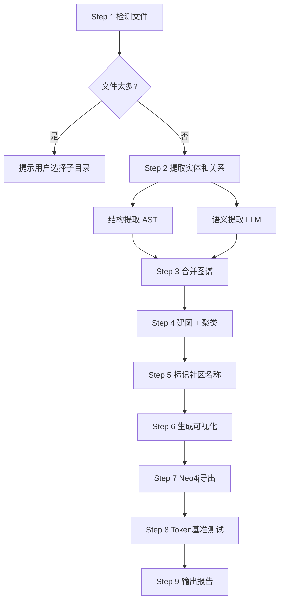

> Graphify: 任意输入（代码、文档、论文、图片）→ 知识图谱 → 社区聚类 → HTML + JSON + 审计报告

## 简介

Graphify 是基于 Karpathy `/raw` 文件夹工作流理念打造的知识图谱工具。它将任意文件夹中的文件（代码、笔记、论文、图片等）转化为可导航的知识图谱，具备以下核心能力：

| 能力 | 说明 |
|------|------|
| **持久化图谱** | 关系存储在 `graphify-out/graph.json`，跨会话保留 |
| **诚实审计** | 每条边标注 `EXTRACTED` / `INFERRED` / `AMBIGUOUS`，区分发现 vs 推断 |
| **跨文档惊喜** | 社区检测自动发现跨文件的隐藏关联 |
| **多格式输出** | 交互式 HTML、GraphRAG JSON、Obsidian Vault |

### 适用场景

- 新接手一个代码库 → 理解架构后再动手
- 阅读清单（论文 + 推文 + 笔记）→ 一个可导航图谱
- 研究语料库（引文图 + 概念图一体化）
- 个人 `/raw` 文件夹 → 持续积累，随取随用

## 安装

### 前置依赖

- Python 3.9+
- 网络（首次安装及语义提取时需要）

### 安装 graphify

```bash
# 方式一：通过 pip 安装
pip install graphifyy

# 方式二（pipx，隔离环境推荐）
pipx install graphifyy

# 方式三：系统级安装
pip install graphifyy --break-system-packages
```

安装后验证：

```bash
graphify --version   # 查看版本
python3 -c "import graphify; print(graphify.__version__)"
```

### 更新

```bash
pip install graphifyy --upgrade
```

## 基本使用

### 触发命令

在 Claude Code 中输入：

```
/graphify
```

这会对当前目录（Obsidian Vault 根目录）运行完整管道。

指定路径：

```
/graphify <path>
```

### 完整流程（9 步）

Graphify 执行一个 9 步管道，处理流程如下：



#### Step 1 - 检测文件

自动扫描目录下所有支持的文件类型：

| 类型  | 扩展名                                          |
| --- | -------------------------------------------- |
| 代码  | `.py`, `.ts`, `.js`, `.go`, `.rs`, `.java` 等 |
| 文档  | `.md`, `.txt`, `.pdf`, `.docx`               |
| 图片  | `.png`, `.jpg`, `.webp`                      |

输出示例：

```
Corpus: 45 files · ~12,000 words
  code:     30 files (.py .ts .go ...)
  docs:     10 files (.md .txt ...)
  papers:   3 files (.pdf ...)
  images:   2 files
```

> **注意**: 如果文件超过 200 个或总词数超过 200 万，Graphify 会提示你选择子目录。

#### Step 2 - 提取实体和关系

分为两个并行部分：

**A. 结构提取（免费，自动）**
- 对代码文件运行 AST 分析
- 提取：import、函数定义、类定义等结构关系

**B. 语义提取（消耗 token）**
- LLM 读取文档、论文、图片内容
- 提取：命名实体、概念、引文关系
- 同时识别隐含关系（`INFERRED`）

#### Step 3 - 建图、聚类与分析

- 使用 NetworkX 构建图结构
- Louvain 算法进行社区检测
- 计算各社区的内聚度分数
- 生成审计报告

#### Step 4 - 标记社区

为每个社区起一个 2-5 字的名字，例如：
- "注意力机制"
- "训练流程"
- "数据加载"

#### Step 5 - 生成输出

最终生成以下文件到 `graphify-out/` 目录：

| 文件 | 说明 |
|------|------|
| `graph.html` | 交互式图谱，浏览器打开 |
| `GRAPH_REPORT.md` | 审计报告（含神节点、意外连接、建议问题）|
| `graph.json` | GraphRAG 可用的原始图数据 |
| `graph.svg` | 矢量图（需加 `--svg` 参数）|
| `obsidian/` | Obsidian Vault（需加 `--obsidian` 参数）|

## 进阶用法

### 深度提取模式

```bash
/graphify <path> --mode deep
```

更彻底的语义提取，生成更丰富的 `INFERRED` 边。

### 增量更新

文件有变动后，只重新提取变更部分（节省 token）：

```bash
/graphify <path> --update
```

### 仅重聚类

不重新提取，只更改聚类参数后重新聚类：

```bash
/graphify <path> --cluster-only
```

### 跳过可视化

只需报告和 JSON，不需要 HTML：

```bash
/graphify <path> --no-viz
```

### 导出 SVG

导出矢量图，可嵌入 Obsidian、Notion 或 GitHub README：

```bash
/graphify <path> --svg
```

### 导出 GraphML

导出为 GraphML 格式，可导入 Gephi、yEd 等专业图分析工具：

```bash
/graphify <path> --graphml
```

### Neo4j 集成

**生成 Cypher 文件（手动导入）:**

```bash
/graphify <path> --neo4j
# 生成 graphify-out/cypher.txt
# 导入命令:
cypher-shell < graphify-out/cypher.txt
```

**直接推送到 Neo4j:**

```bash
/graphify <path> --neo4j-push bolt://localhost:7687
# 会提示输入用户名/密码，或在命令中指定：
# --neo4j-push bolt://localhost:7687 --neo4j-user neo4j --neo4j-password xxx
```

### MCP 服务器模式

将图谱作为 MCP 服务暴露给其他 AI Agent 查询：

```bash
/graphify <path> --mcp
```

然后在 Claude Desktop 中配置：

```json
{
  "mcpServers": {
    "graphify": {
      "command": "python3",
      "args": ["-m", "graphify.serve", "/absolute/path/to/graphify-out/graph.json"]
    }
  }
}
```

### 监听模式（自动重建）

监控文件夹变化，代码变更自动重建图谱：

```bash
python3 -m graphify.watch <path> --debounce 3
```

- **纯代码变更**：自动重跑 AST + 重建，无需 LLM
- **文档/图片变更**：写入 `.needs_update` 标记，手动运行 `/graphify --update`

按 `Ctrl+C` 停止。

### Git 提交钩子

每次 `git commit` 后自动重建图谱：

```bash
graphify hook install    # 安装
graphify hook status     # 查看状态
graphify hook uninstall  # 卸载
```

### 添加 URL 到图谱

从网络抓取内容并加入语料库：

```bash
# 基本用法
/graphify add <url>

# 指定作者
/graphify add <url> --author "Author Name"

# 指定贡献者
/graphify add <url> --contributor "Your Name"
```

支持自动检测：Twitter/X、arXiv 论文、PDF、图片、任意网页。

### 查询图谱

**广度优先（BFS）- 获取上下文：**

```bash
/graphify query "<question>"
```

**深度优先（DFS）- 追踪路径：**

```bash
/graphify query "<question>" --dfs
```

**限制 token 预算：**

```bash
/graphify query "<question>" --budget 1500
```

### 找两节点间最短路径

```bash
/graphify path "AuthModule" "Database"
```

### 解释某个节点

```bash
/graphify explain "SwinTransformer"
```

### Obsidian Vault 输出

将图谱生成为 Obsidian Vault，支持图谱视图和 Canvas：

```bash
# 输出到默认路径
/graphify <path> --obsidian

# 输出到自定义 Obsidian 路径
/graphify <path> --obsidian --obsidian-dir ~/vaults/my-project
```

生成的 Obsidian Vault 结构：

```
obsidian/
├── graph.canvas          # Canvas 文件，社区分组布局
├── _COMMUNITY_*.md       # 社区总览笔记，含内聚度分数
└── [节点名].md           # 每个概念一个笔记
```

在 Obsidian 中打开该目录为 Vault，即可：
- **图谱视图** - 节点按社区着色
- **graph.canvas** - 结构性社区布局
- **Dataview 查询** - 按社区组织内容

## 输出说明

### graph.html（交互式图谱）

浏览器直接打开，无需服务器。功能：
- 缩放、拖拽
- 点击节点查看详情
- 按社区筛选
- 搜索节点

### GRAPH_REPORT.md（审计报告）

包含以下章节：

- **God Nodes**：度数最高的节点，知识的枢纽
- **Surprising Connections**：跨社区的意外连接，隐藏的关联
- **Suggested Questions**：图谱能回答的最有价值的问题
- **Token 使用统计**：本次运行和历史累计 token 消耗

### graph.json（GraphRAG 数据）

```json
{
  "nodes": [
    {
      "id": "entity_id",
      "label": "人类可读名称",
      "file_type": "code|document|paper|image",
      "source_file": "relative/path",
      "source_location": "file:line",
      "source_url": null
    }
  ],
  "links": [
    {
      "source": "node_id",
      "target": "node_id",
      "relation": "calls|implements|references|cites|conceptually_related_to",
      "confidence": "EXTRACTED|INFERRED|AMBIGUOUS",
      "confidence_score": 1.0,
      "weight": 1.0
    }
  ]
}
```

### 边类型说明

| 关系类型 | 说明 | 置信度 |
|----------|------|--------|
| `EXTRACTED` | 源码/文档中明确存在的关系 | 1.0 |
| `INFERRED` | 基于上下文合理推断的关系 | 0.4-0.9 |
| `AMBIGUOUS` | 不确定的关系，待人工审核 | 0.1-0.3 |

## 与 Obsidian 的集成

### 在 Obsidian 中查看图谱

1. 生成 Vault：`/graphify <path> --obsidian`
2. 在 Obsidian 中「打开保险库」→ 选择 `graphify-out/obsidian/` 目录
3. 使用 Obsidian 自带「打开图谱视图」即可看到彩色节点社区图

### 生成 Canvas 可视化

```bash
# 在生成 Vault 时自动生成 Canvas
/graphify <path> --obsidian
```

Canvas 文件按社区组织节点，适合手动微调布局。

### 配合 Dataview 使用

社区笔记包含 Dataview 查询，可按社区聚合所有相关节点：

````markdown
```dataview
TABLE file.ctime as Created
FROM "_COMMUNITY_Attention"
SORT file.ctime DESC
```
````

## 常见问题

### Q: 安装失败，提示找不到 graphifyy

> graphify 的 PyPI 包名是 `graphifyy`（双 y）。注意不是 `graphify`。

### Q: 语义提取消耗太多 token

使用增量更新模式 `--update`，只提取新文件和变更文件：

```bash
/graphify <path> --update
```

### Q: 大语料库（>200 文件）如何处理

分批次运行，先对子目录单独 graphify：

```bash
# 只处理 src 目录
/graphify ./src

# 只处理 docs 目录
/graphify ./docs
```

### Q: graph.html 打不开，图谱太大

超过 5000 个节点时不生成 HTML，改用 Obsidian Vault 查看：

```bash
/graphify <path> --obsidian
```

### Q: Neo4j 连接失败

确保 Neo4j 正在运行，并检查端口：

```bash
# 检查 bolt 端口
neo4j status

# 默认连接信息
# URI: bolt://localhost:7687
# 用户名: neo4j
# 密码: (首次启动时设置的密码)
```

### Q: 想删除图谱重新开始

```bash
rm -rf graphify-out/
```

下次运行会从头开始。

### Q: 如何只提取代码，不消耗 token

纯代码项目：

```bash
/graphify <path>
```

Step 2 的语义提取部分会跳过，因为代码结构关系（import、函数调用）已被 AST 完全覆盖。

## 参考资料

- GitHub: [safishamsi/graphify](https://github.com/safishamsi/graphify)
- Claude Code Skill: `~/.claude/skills/graphify/SKILL.md`
- 版本: 0.3.22
