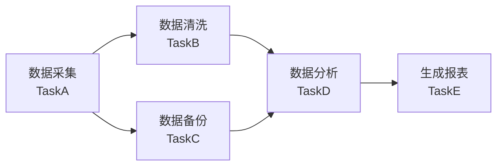

> 本教程基于 PowerJob 最新版本（4.x）编写，涵盖从环境搭建到高级特性的完整实践指南。
>
> **信息来源**：腾讯云开发者社区 [1](https://cloud.tencent.com/developer/article/2402898)、CSDN 技术博客 [2](https://blog.csdn.net/gitblog_00537/article/details/155331996)、阿里云开发者社区 [3](https://developer.aliyun.com/article/1680726)

## 目录

- [1. 简介与核心概念](#1-简介与核心概念)
- [2. 快速入门：3 分钟启动调度中心](#2-快速入门3-分钟启动调度中心)
- [3. Spring Boot 快速集成](#3-spring-boot-快速集成)
- [4. 处理器（Processor）开发详解](#4-处理器processor开发详解)
- [5. 工作流（DAG）编排](#5-工作流dag编排)
- [6. MapReduce 分布式计算](#6-mapreduce-分布式计算)
- [7. Docker Compose 部署生产环境](#7-docker-compose-部署生产环境)
- [8. 与 XXL-JOB 对比分析](#8-与-xxl-job-对比分析)
- [9. 常见问题与解决方案](#9-常见问题与解决方案)

---

## 1. 简介与核心概念

### 1.1 什么是 PowerJob

PowerJob（原名 OhMyScheduler）是全新一代分布式任务调度与计算框架，由 Java 开发，专为企业级任务调度场景设计 [1](https://cloud.tencent.com/developer/article/2402898)。它是继第一代 Quartz（单机锁）和第二代 XXL-JOB（数据库锁）之后的**第三代任务调度框架**，核心特点是**无锁化调度**，支持水平扩展。

PowerJob 官网文档：http://www.powerjob.tech/ [1](https://cloud.tencent.com/developer/article/2402898)

### 1.2 核心架构

PowerJob 采用**调度中心 + 执行器**的分离式架构：

```
┌─────────────────────────────────────────────────────────┐
│                      PowerJob 架构                        │
│                                                         │
│  ┌──────────────────┐         ┌──────────────────────┐  │
│  │  调度中心 (Server) │◄──────►│   执行器 (Worker)集群  │  │
│  │                  │         │                      │  │
│  │  • 任务调度       │         │  • 任务执行           │  │
│  │  • 状态管理       │         │  • 状态上报           │  │
│  │  • Web 控制台     │         │  • 日志采集           │  │
│  │  • 高可用集群     │         │  • 故障转移           │  │
│  └────────┬─────────┘         └──────────┬───────────┘  │
│           │                               │              │
│           │      ┌─────────────┐          │              │
│           └─────►│  数据库      │◄─────────┘              │
│                  │  MySQL/PG   │                         │
│                  └─────────────┘                         │
└─────────────────────────────────────────────────────────┘
```

### 1.3 核心特性一览

| 特性类别 | 具体功能 |
|---------|---------|
| **定时策略** | CRON 表达式、固定频率、固定延迟、API 触发 [1](https://cloud.tencent.com/developer/article/2402898) |
| **执行模式** | 单机执行、广播执行、Map 执行、MapReduce 执行 [1](https://cloud.tencent.com/developer/article/2402898) |
| **工作流** | DAG 可视化编排、上下游数据传递、嵌套工作流 [1](https://cloud.tencent.com/developer/article/2402898) |
| **执行器** | Spring Bean、Java 类、Shell、Python、HTTP、SQL 等 [1](https://cloud.tencent.com/developer/article/2402898) |
| **高可用** | 无锁化调度、多节点集群、故障转移与恢复 [1](https://cloud.tencent.com/developer/article/2402898) |
| **运维** | 在线日志、实时监控、Web 控制台 [1](https://cloud.tencent.com/developer/article/2402898) |

### 1.4 适用场景

- **定时任务**：每天凌晨数据同步、生成报表、订单超时处理 [1](https://cloud.tencent.com/developer/article/2402898)
- **广播任务**：集群日志清理、配置统一刷新 [1](https://cloud.tencent.com/developer/article/2402898)
- **分布式计算**：海量数据处理 ETL、MapReduce 大规模并行计算 [1](https://cloud.tencent.com/developer/article/2402898)
- **延迟任务**：订单过期检查、消息延迟投递 [1](https://cloud.tencent.com/developer/article/2402898)
- **工作流编排**：数据处理流水线、多阶段依赖任务 [1](https://cloud.tencent.com/developer/article/2402898)

---

## 2. 快速入门：3 分钟启动调度中心

### 2.1 环境要求

| 组件 | 要求 |
|-----|------|
| JDK | 1.8+（推荐 JDK 11+）|
| 数据库 | MySQL 5.7+ / PostgreSQL / Oracle / SQL Server [1](https://cloud.tencent.com/developer/article/2402898) |
| Docker | 可选，用于 Docker 部署 |

### 2.2 Docker 一键启动（推荐）

这是最快的方式，官方提供开箱即用的 Docker Compose 配置 [4](https://blog.csdn.net/gitblog_00757/article/details/151695829)：

```bash
# 克隆项目获取 docker-compose.yml
git clone https://github.com/PowerJob/PowerJob.git
cd PowerJob

# 一键启动所有服务（包含内置 H2 数据库，用于快速测试）
docker-compose up -d

# 查看服务状态
docker-compose ps
```

服务启动后访问 **http://localhost:7700**，默认账号密码为 **admin/admin** [4](https://blog.csdn.net/gitblog_00757/article/details/151695829)。

### 2.3 源码构建启动

适用于需要自定义配置的生产环境 [2](https://blog.csdn.net/gitblog_00537/article/details/155331996)：

**Step 1：获取源码**

```bash
git clone https://github.com/PowerJob/PowerJob.git
cd PowerJob
```

**Step 2：创建数据库**

```sql
CREATE DATABASE powerjob DEFAULT CHARACTER SET utf8mb4 COLLATE utf8mb4_unicode_ci;
```

**Step 3：导入数据表**

```bash
# PowerJob 会自动建表，但也可以手动导入
mysql -u root -p powerjob < others/sql/schema/powerjob_mysql_5.1.0.sql
```

**Step 4：修改配置文件**

编辑 `powerjob-server/powerjob-server-starter/src/main/resources/application-daily.properties`：

```properties
# 数据库配置
spring.datasource.core.jdbc-url=jdbc:mysql://localhost:3306/powerjob?useUnicode=true&characterEncoding=UTF-8
spring.datasource.core.username=root
spring.datasource.core.password=your_password

# 连接池配置
spring.datasource.core.hikari.maximum-pool-size=20
spring.datasource.core.hikari.minimum-idle=5

# 初始化管理员密码
oms.auth.initiliaze.admin.password=admin123
```

**Step 5：启动服务**

```bash
cd powerjob-server/powerjob-server-starter
mvn spring-boot:run
```

启动成功后访问 **http://localhost:7700** [2](https://blog.csdn.net/gitblog_00537/article/details/155331996)。

### 2.4 注册应用

首次登录后需要注册执行器应用：

1. 点击「应用管理」→「新增应用」
2. 填写应用名称（如 `powerjob-demo`）和控制台密码
3. 记住这个 **appName**，后续客户端配置需要用到 [2](https://blog.csdn.net/gitblog_00537/article/details/155331996)

---

## 3. Spring Boot 快速集成

### 3.1 添加 Maven 依赖

在 Spring Boot 项目的 `pom.xml` 中添加依赖 [5](https://blog.51cto.com/u_15668812/13479676)：

```xml
<dependency>
    <groupId>tech.powerjob</groupId>
    <artifactId>powerjob-worker-spring-boot-starter</artifactId>
    <version>4.3.3</version>
</dependency>
```

> ⚠️ **注意**：客户端版本需要与 Server 版本保持一致 [5](https://blog.51cto.com/u_15668812/13479676)

### 3.2 配置文件

在 `application.yml` 中添加配置 [5](https://blog.51cto.com/u_15668812/13479676)：

```yaml
powerjob:
  worker:
    enabled: true
    # 应用名称，需与控制台注册的应用名一致
    app-name: powerjob-demo
    # PowerJob Server 地址
    server-address: 127.0.0.1:7700
    # 存储端口，用于 Server 与 Worker 通信
    store-strategy: ot_db
    # 线程池大小，根据任务负载调整
    thread-pool-size: 10
    # Akka 通信端口
    akka-port: 27777
```

### 3.3 启用 PowerJob

Spring Boot 会自动配置，但也可以显式启用 [5](https://blog.51cto.com/u_15668812/13479676)：

```java
@SpringBootApplication
@EnablePowerJob  // 可选，starter 已自动启用
public class PowerJobDemoApplication {
    public static void main(String[] args) {
        SpringApplication.run(PowerJobDemoApplication.class, args);
    }
}
```

启动应用后，在控制台的「应用管理」中刷新，确认应用已在线注册。

---

## 4. 处理器（Processor）开发详解

### 4.1 处理器类型概述

PowerJob 支持四种处理器接口 [1](https://cloud.tencent.com/developer/article/2402898)：

| 接口 | 适用场景 | 说明 |
|-----|---------|------|
| `BasicProcessor` | 简单单机任务 | 最基础的处理器接口 |
| `StandaloneProcessor` | 需要任务上下文的单机任务 | 支持获取任务参数和上下文信息 |
| `BroadcastProcessor` | 广播任务 | 所有 Worker 同时执行 |
| `MapReduceProcessor` | 大规模分布式计算 | 支持 Map 和 Reduce 两个阶段 |

### 4.2 BasicProcessor — 简单处理器

最简单的处理器示例 [5](https://blog.51cto.com/u_15668812/13479676)：

```java
import lombok.extern.slf4j.Slf4j;
import org.springframework.stereotype.Component;
import tech.powerjob.worker.core.processor.ProcessResult;
import tech.powerjob.worker.core.processor.TaskContext;
import tech.powerjob.worker.core.processor.sdk.BasicProcessor;

@Slf4j
@Component
public class DemoSimpleJobHandler implements BasicProcessor {

    @Override
    public ProcessResult process(TaskContext context) {
        // 获取任务参数
        String jobParams = context.getJobParams();

        log.info("=== 开始执行简单任务 ===");
        log.info("任务参数: {}", jobParams);
        log.info("任务ID: {}", context.getJobId());
        log.info("实例ID: {}", context.getInstanceId());

        // 执行业务逻辑
        try {
            // 模拟业务处理
            Thread.sleep(1000);
            log.info("任务执行完成!");
            return new ProcessResult(true, "SUCCESS");
        } catch (Exception e) {
            log.error("任务执行失败", e);
            return new ProcessResult(false, "FAILED: " + e.getMessage());
        }
    }
}
```

### 4.3 StandaloneProcessor — 支持数据传递

支持从工作流上下游获取数据 [1](https://cloud.tencent.com/developer/article/2402898)：

```java
import tech.powerjob.worker.core.processor.ProcessResult;
import tech.powerjob.worker.core.processor.TaskContext;
import tech.powerjob.worker.core.processor.sdk.StandaloneProcessor;
import java.util.Map;

public class DataProcessJob implements StandaloneProcessor {

    @Override
    public ProcessResult process(TaskContext context) {
        // 从工作流上下文获取上游数据
        Map<String, Object> workflowData = context.getWorkflowData();

        if (workflowData != null && workflowData.containsKey("上游任务数据")) {
            Object upstreamData = workflowData.get("上游任务数据");
            log.info("接收到上游数据: {}", upstreamData);
        }

        // 获取当前任务参数
        String params = context.getJobParams();

        // 业务处理...
        return new ProcessResult(true, "处理完成");
    }
}
```

### 4.4 BroadcastProcessor — 广播任务

广播任务会在所有在线的 Worker 上同时执行 [1](https://cloud.tencent.com/developer/article/2402898)：

```java
import tech.powerjob.worker.core.processor.ProcessResult;
import tech.powerjob.worker.core.processor.TaskContext;
import tech.powerjob.worker.core.processor.sdk.BroadcastProcessor;

public class LogCleanJob implements BroadcastProcessor {

    @Override
    public ProcessResult process(TaskContext context) {
        // 获取当前 Worker 的标识
        String workerAddress = context.getWorkerAddress();
        log.info("Worker[{}] 开始执行日志清理任务", workerAddress);

        // 清理当前机器的日志
        String logPath = "/var/logs/application.log";
        // 实际项目中执行: rm -f ${logPath}

        log.info("Worker[{}] 日志清理完成", workerAddress);
        return new ProcessResult(true, "清理完成");
    }
}
```

### 4.5 在控制台创建任务

1. 进入「任务管理」→「新建任务」[2](https://blog.csdn.net/gitblog_00537/article/details/155331996)
2. 填写任务基本信息：

| 配置项 | 说明 | 示例值 |
|-------|------|--------|
| 任务名称 | 任务描述性名称 | `DemoSimpleJob` |
| 任务类型 | 处理器类型 | `Java` |
| 处理器信息 | 处理器全类名 | `com.example.job.DemoSimpleJobHandler` |
| 定时类型 | 调度策略 | `CRON` / `固定频率` / `API` |
| CRON 表达式 | 时间规则 | `0 0 2 * * ?`（每天凌晨2点）|
| 任务参数 | 传递给处理器的参数 | `{"type":"daily"}` |

3. 点击「保存」后，可在「任务列表」中手动触发或查看执行记录

### 4.6 任务执行日志

PowerJob 提供**在线日志**功能，执行器产生的日志可以在前端控制台实时显示 [1](https://cloud.tencent.com/developer/article/2402898)。进入「任务实例」→「更多」→「日志」，即可查看实时日志输出。

---

## 5. 工作流（DAG）编排

### 5.1 工作流概述

PowerJob 支持通过 DAG（有向无环图）可视化编排任务依赖关系 [1](https://cloud.tencent.com/developer/article/2402898)。这对于需要**任务 A 执行完成后才能执行任务 B** 的场景非常有用。

### 5.2 DAG 核心概念

PowerJob 的 DAG 模型包含三类节点 [6](https://blog.csdn.net/Txx318026/article/details/157293055)：

| 节点类型 | 类型值 | 说明 |
|--------|-------|------|
| **JOB** | 1 | 普通任务节点 |
| **DECISION** | 2 | 判断节点，用于条件分支 |
| **NESTED_WORKFLOW** | 3 | 嵌套工作流节点 |

### 5.3 创建工作流

在控制台「工作流管理」中创建工作流：



### 5.4 工作流任务处理器

工作流中的每个节点本身都是 PowerJob 任务，因此可以享受任务的所有基础能力（故障转移、MapReduce、在线运维、实时日志等）[1](https://cloud.tencent.com/developer/article/2402898)。

```java
// 数据采集任务
@Component
public class DataCollectionJob implements BasicProcessor {
    @Override
    public ProcessResult process(TaskContext context) {
        log.info("开始采集数据...");
        List<Data> data = fetchDataFromSource();

        // 通过上下文向下游传递数据
        context.setWorkflowData("collectedData", data);

        return new ProcessResult(true, "采集完成");
    }
}

// 数据分析任务（依赖数据采集）
@Component
public class DataAnalysisJob implements StandaloneProcessor {
    @Override
    public ProcessResult process(TaskContext context) {
        // 获取上游传递的数据
        @SuppressWarnings("unchecked")
        List<Data> data = (List<Data>) context.getWorkflowData().get("collectedData");

        if (data == null) {
            return new ProcessResult(false, "未获取到上游数据");
        }

        log.info("开始分析 {} 条数据...", data.size());
        // 分析处理...

        return new ProcessResult(true, "分析完成");
    }
}
```

### 5.5 上下游数据传递

PowerJob 支持跨节点数据传递，通过 `Map<String, Object>` 上下文在 DAG 中流转数据 [6](https://blog.csdn.net/Txx318026/article/details/157293055)：

```java
// 上游任务：设置数据
context.setWorkflowData("result", analysisResult);

// 下游任务：获取数据
Map<String, Object> workflowData = context.getWorkflowData();
Object upstreamResult = workflowData.get("result");
```

> 💡 **提示**：传递的数据需要可序列化（JSON），建议单个数据小于 1MB [6](https://blog.csdn.net/Txx318026/article/details/157293055)

---

## 6. MapReduce 分布式计算

### 6.1 什么是 MapReduce

对于需要处理海量数据的场景（如离线计算、日志分析），PowerJob 内置了 MapReduce 编程模型 [7](https://baijiahao.baidu.com/s?id=1678508537938008961)。与 XXL-JOB 的静态分片不同，PowerJob 支持**动态分片**，可以根据在线 Worker 数量自动均匀分配任务。

### 6.2 MapReduce 处理器

```java
import tech.powerjob.worker.core.processor.ProcessResult;
import tech.powerjob.worker.core.processor.TaskContext;
import tech.powerjob.worker.core.processor.sdk.MapReduceProcessor;
import tech.powerjob.common.Task;
import java.util.ArrayList;
import java.util.List;

public class DataProcessMRJob implements MapReduceProcessor {

    /**
     * Map 阶段：任务拆分
     * @param taskContext 任务上下文
     * @return 子任务列表
     */
    @Override
    public List<Task> split(TaskContext taskContext) {
        // 获取总数据量
        int totalData = 100000;
        // 根据在线 Worker 数量计算分片数
        int shardCount = taskContext.getRunningWorkerAddresses().size();
        int dataPerShard = totalData / shardCount;

        List<Task> subtasks = new ArrayList<>();
        for (int i = 0; i < shardCount; i++) {
            Task subtask = new Task();
            subtask.setTaskName("data_shard_" + i);
            subtask.setTaskParams(i * dataPerShard + "," + ((i + 1) * dataPerShard));
            subtasks.add(subtask);
        }

        log.info("MapReduce: 生成了 {} 个子任务", subtasks.size());
        return subtasks;
    }

    /**
     * Process 阶段：处理单个子任务
     * @param task 子任务
     * @param taskContext 上下文
     * @return 处理结果
     */
    @Override
    public ProcessResult process(Task task, TaskContext taskContext) {
        // 解析子任务参数
        String[] range = task.getTaskParams().split(",");
        int start = Integer.parseInt(range[0]);
        int end = Integer.parseInt(range[1]);

        log.info("开始处理数据区间: [{}, {})", start, end);

        // 处理数据...
        int processed = processDataRange(start, end);

        log.info("处理完成，共处理 {} 条数据", processed);
        return new ProcessResult(true, "processed:" + processed);
    }

    private int processDataRange(int start, int end) {
        // 实际数据处理逻辑
        return end - start;
    }
}
```

### 6.3 MapReduce vs 静态分片

| 特性 | MapReduce | 静态分片（XXL-JOB）|
|-----|-----------|------------------|
| 分片方式 | 动态，根据在线 Worker 数量自动分配 | 静态，需要手动指定分片数 |
| 结果聚合 | 支持 Reduce 阶段自动汇总 | 不支持 |
| 灵活性 | 高，可自定义拆分策略 | 低，分片数固定 |
| 适用场景 | 海量数据、复杂计算 | 简单批量处理 |

---

## 7. Docker Compose 部署生产环境

### 7.1 生产级 docker-compose.yml

以下配置包含完整的生产环境设置，包括数据库、邮件通知等 [8](https://blog.csdn.net/m0_38040684/article/details/143415774)：

```yaml
version: '3.8'

services:
  powerjob-server:
    image: powerjob/powerjob-server:latest
    container_name: powerjob-server
    restart: always
    ports:
      - "7700:7700"
    environment:
      - TZ=Asia/Shanghai
      - PARAMS=--spring.profiles.active=product
        --spring.datasource.core.jdbc-url=jdbc:mysql://mysql:3306/powerjob?useUnicode=true&characterEncoding=UTF-8&serverTimezone=Asia/Shanghai
        --spring.datasource.core.username=root
        --spring.datasource.core.password=your_password
        --oms.auth.initiliaze.admin.password=admin123
        # 邮件通知配置（可选）
        --spring.mail.host=smtp.qq.com
        --spring.mail.port=587
        --spring.mail.username=your_email@qq.com
        --spring.mail.password=your_auth_code
    depends_on:
      mysql:
        condition: service_healthy

  mysql:
    image: mysql:8.0
    container_name: powerjob-mysql
    restart: always
    environment:
      MYSQL_ROOT_PASSWORD: your_password
      MYSQL_DATABASE: powerjob
    ports:
      - "3306:3306"
    volumes:
      - mysql-data:/var/lib/mysql
    healthcheck:
      test: ["CMD", "mysqladmin", "ping", "-h", "localhost"]
      interval: 10s
      timeout: 5s
      retries: 5

volumes:
  mysql-data:
```

### 7.2 启动集群

```bash
# 后台启动所有服务
docker-compose up -d

# 查看服务状态
docker-compose ps

# 查看日志
docker-compose logs -f powerjob-server
```

### 7.3 配置外部数据库

如果使用已有的 MySQL 数据库，只需修改连接配置：

```bash
docker run -d \
  --name powerjob-server \
  -p 7700:7700 \
  -e PARAMS="--spring.profiles.active=product \
    --spring.datasource.core.jdbc-url=jdbc:mysql://YOUR_MYSQL_HOST:3306/powerjob \
    --spring.datasource.core.username=root \
    --spring.datasource.core.password=YOUR_PASSWORD \
    --oms.auth.initiliaze.admin.password=admin123" \
  powerjob/powerjob-server:latest
```

---

## 8. 与 XXL-JOB 对比分析

### 8.1 核心差异

| 对比维度 | PowerJob | XXL-JOB |
|---------|----------|--------|
| **架构** | 完全分布式，无锁化调度 [7](https://baijiahao.baidu.com/s?id=1678508537938008961) | 集中式调度，数据库锁 [7](https://baijiahao.baidu.com/s?id=1678508537938008961) |
| **调度精度** | 毫秒级（理论上可达 1ms）| 秒级（默认），毫秒需额外配置 |
| **分布式计算** | 内置 MapReduce 模型 | 仅支持静态分片广播 |
| **工作流** | 原生支持 DAG 可视化编排 | 不支持 |
| **执行器** | Java/Go/Python/Shell/HTTP/SQL | 主要 Java，少量脚本 |
| **依赖** | 仅需关系型数据库 | 仅需关系型数据库 |
| **社区活跃度** | 活跃增长中 | 成熟稳定 |

### 8.2 选型建议

**选择 PowerJob 如果你需要**：
- ✅ 海量数据的分布式计算（MapReduce）
- ✅ 复杂的任务依赖编排（DAG 工作流）
- ✅ 高精度的定时调度（毫秒级）
- ✅ 多语言执行器支持
- ✅ 现代化、可扩展的架构

**选择 XXL-JOB 如果你**：
- ✅ 只需要简单的定时任务
- ✅ 偏好成熟稳定、社区文档丰富的框架
- ✅ 团队已有 XXL-JOB 使用经验
- ✅ 不想引入新的学习成本

---

## 9. 常见问题与解决方案

### Q1: Server 和 Worker 不在同一服务器，如何配置？

确保 Worker 配置的 `server-address` 指向 Server 的可访问地址 [9](https://cloud.tencent.com/developer/article/1824232)：

```yaml
powerjob:
  worker:
    server-address: http://YOUR_SERVER_IP:7700
```

### Q2: 任务执行失败后如何重试？

在创建/编辑任务时，配置「任务失败重试次数」和「重试间隔」[1](https://cloud.tencent.com/developer/article/2402898)。PowerJob 支持故障转移，只要执行器集群有足够的计算节点，任务就能顺利完成。

### Q3: MySQL 8.0 连接问题

PowerJob 某些版本对 MySQL 8.0 的默认认证方式支持不好，需要在连接字符串中指定认证插件 [10](https://blog.csdn.net/mac99/article/details/150758285)：

```properties
spring.datasource.core.jdbc-url=jdbc:mysql://localhost:3306/powerjob?useUnicode=true&characterEncoding=UTF-8&allowPublicKeyRetrieval=true&serverTimezone=Asia/Shanghai
```

### Q4: 如何查看任务执行日志？

1. 进入「任务实例列表」，找到对应的任务实例
2. 点击「日志」按钮
3. PowerJob 支持**在线实时日志**，无需登录服务器即可查看 [1](https://cloud.tencent.com/developer/article/2402898)

### Q5: 客户端版本与服务端版本不一致怎么办？

确保客户端 `powerjob-worker-spring-boot-starter` 版本与 Server 版本一致 [5](https://blog.51cto.com/u_15668812/13479676)。版本不匹配可能导致注册失败或功能异常。

---

## 参考资料

1. 腾讯云 - 分布式任务调度: PowerJob 简介: https://cloud.tencent.com/developer/article/2402898
2. CSDN - 快速上手: 3步部署 PowerJob 企业级分布式任务调度框架: https://blog.csdn.net/gitblog_00537/article/details/155331996
3. 阿里云 - SpringBoot 集成 PowerJob 从环境搭建到处理器与工作流开发: https://developer.aliyun.com/article/1680726
4. CSDN - 3分钟部署 PowerJob Docker Compose 一键集群方案: https://blog.csdn.net/gitblog_00757/article/details/151695829
5. 51CTO - Spring Boot 与 PowerJob 详细整合教程 (2025版): https://blog.51cto.com/u_15668812/13479676
6. CSDN - PowerJob 深度解析: DAG 工作流与 MapReduce 分布式计算: https://blog.csdn.net/Txx318026/article/details/157293055
7. 百家号 - PowerJob 应对庞大任务的锦囊妙计: MapReduce: https://baijiahao.baidu.com/s?id=1678508537938008961
8. CSDN - Docker Compose 部署 PowerJob (局域网模式): https://blog.csdn.net/m0_38040684/article/details/143415774
9. 腾讯云 - Java 分布式任务调度平台 PowerJob 快速开始+配置详解: https://cloud.tencent.com/developer/article/1824232
10. CSDN - PowerJob vs XXL-Job: 从零搭建分布式任务调度系统的实战对比: https://blog.csdn.net/mac99/article/details/150758285
