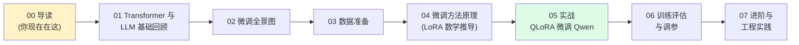

# LLM 微调入门教程 · 导读与学习路线

> 本教程面向**有编程经验、数学基础尚可、但只用过 ChatGPT 类产品**的同学。
> 我们会从 Transformer 的核心直觉出发，一路走到真正用 QLoRA 在自己的数据上微调出一个可用的领域助手。

## 写在前面

微调（fine-tuning）这件事，在 2023 年之前还是大公司的专利——动辄几百张 A100、几百万美元的训练成本。LoRA（2021）和 QLoRA（2023）出现之后，**消费级单卡 GPU（24GB 显存）就能微调 7B~13B 级别的模型**。这彻底改变了这门技术的可及性。

本教程不打算重复论文里的证明，也不打算罗列所有方法的清单。我们只回答三个问题：

1. **什么时候**应该微调？（而不是继续用 prompt engineering 或者 RAG）
2. **怎么微调**？（数据怎么准备、参数怎么选、代码怎么写）
3. **怎么知道微调成功了**？（评估、调参、避坑）

## 你将学到什么

完成本教程后，你将能够：

- **判断**一个业务问题该用 prompt / RAG / 微调 中的哪种方案
- **理解** Full Fine-tuning、LoRA、QLoRA 的数学原理与显存差异
- **端到端** 完成一次 QLoRA 微调：环境 → 数据 → 训练 → 评估 → 推理
- **读懂** 训练日志并诊断过拟合、欠拟合、loss spike 等问题
- **了解** DPO、ORPO 等对齐方法与继续预训练的区别
- **知道** 多卡训练、模型合并、量化和部署的下一步路径

## 阅读顺序



| 章节 | 必读？ | 学完你能做什么 |
|------|-------|---------------|
| 00 导读 | ✅ | 知道本教程在教什么、怎么读 |
| 01 Transformer 基础 | ✅ | 理解 attention、token、训练目标这些"行话" |
| 02 微调全景图 | ✅ | 决策：什么场景该用微调 |
| 03 数据准备 | ✅ | 把原始文本转成可训练的数据集 |
| 04 微调方法原理 | ✅ | 理解 LoRA 为什么能用 0.1% 参数逼近全量微调 |
| 05 实战 | ⭐ 重点 | 亲手跑通一次 QLoRA 微调 |
| 06 评估与调参 | ✅ | 不再"训完看心情判断好坏" |
| 07 进阶 | 选读 | 知道下一步往哪走 |

> 建议至少按 00 → 01 → 02 → 05 → 06 的顺序走一遍。其它章节按需深入。

## 目标读者画像

我们假设你：

- ✅ 至少写过 1 年 Python（懂 `dict`、`list comprehension`、`async`、类型注解）
- ✅ 会用 PyTorch 或 NumPy 做过矩阵运算（理解 shape、broadcast、softmax）
- ✅ 有大学本科水平的线性代数和概率论基础（矩阵乘法、SVD、KL 散度）
- ✅ 装过 PyTorch，跑过简单的模型训练循环
- ⚠️ 但只把 LLM 当黑盒用过，没读过 Transformer 论文

如果你完全是 LLM 新手，建议先补一下 01；如果只想"先跑起来再说"，可以直接跳到 05，但 02 还是建议读一下。

## 环境准备

### 硬件最低要求

| 配置 | 能微调的模型大小 | 推荐用途 |
|------|----------------|---------|
| 单卡 12GB（RTX 3060/4060） | 7B 用 QLoRA（4bit） | 学习、小实验 |
| 单卡 24GB（RTX 3090/4090） | 13B 用 QLoRA，或 7B 用 LoRA | 个人项目 ✅ 推荐 |
| 单卡 48GB（RTX A6000/4090） | 70B 用 QLoRA | 中型项目 |
| 多卡 80GB（A100/H100） | 70B+ 全量微调 | 生产训练 |

**本教程默认 24GB 显存**，所有命令都基于此配置。如果你只有 12GB，把 `batch_size` 调到 1、把序列长度降到 1024 即可。

### 软件依赖

> 推荐使用 `conda` 或 `uv` 管理环境。完整 `requirements.txt` 在文末附录。

最小可运行集合：

```bash
# 核心
pip install torch==2.3.0 --index-url https://download.pytorch.org/whl/cu121
pip install transformers==4.43.0
pip install accelerate==0.33.0
pip install peft==0.11.0          # LoRA / QLoRA
pip install trl==0.9.6            # SFT/DPO Trainer
pip install bitsandbytes==0.43.0  # 4bit 量化（QLoRA 必须）
pip install datasets==2.20.0
pip install sentencepiece          # Qwen tokenizer 依赖

# 可选：监控 & 推理加速
pip install wandb
pip install vllm                  # 训练后推理
```

> 💡 **国内网络**：上面有些包从 PyPI 下载慢，可以在命令前加 `export https_proxy=http://127.0.0.1:7890`，或者用国内的清华/阿里镜像。

### 一行自检

安装完之后跑一下，确认环境正确：

```python
import torch
import transformers
import peft
import trl
import bitsandbytes as bnb

print(f"PyTorch       : {torch.__version__}")
print(f"CUDA 可用     : {torch.cuda.is_available()}")
print(f"GPU 型号      : {torch.cuda.get_device_name(0) if torch.cuda.is_available() else '无'}")
print(f"显存大小      : {torch.cuda.get_device_properties(0).total_memory / 1e9:.1f} GB" if torch.cuda.is_available() else "")
print(f"Transformers  : {transformers.__version__}")
print(f"PEFT          : {peft.__version__}")
print(f"TRL           : {trl.__version__}")
```

**你应当看到**类似这样的输出（数字版本号可能略有不同）：

```
PyTorch       : 2.3.0+cu121
CUDA 可用     : True
GPU 型号      : NVIDIA GeForce RTX 4090
显存大小      : 24.0 GB
Transformers  : 4.43.0
PEFT          : 0.11.0
TRL           : 0.9.6
```

如果 `CUDA 可用` 是 `False`，说明 PyTorch 安装的是 CPU 版本，需要重新装带 CUDA 的版本。

## 一个可复现的最小示例数据

为了在 05 章能够真正跑起来，我们准备一个**超小的演示数据集**——10 条"客服话术改写"指令。你可以在任何编辑器里手敲出来，也可以在 `datasets` 里下载：

```jsonl
{"instruction": "把这句话改得更礼貌：给我退款。",
 "input": "",
 "output": "您好，麻烦帮我处理一下退款，谢谢。"}
{"instruction": "把这句话改得更礼貌：怎么这么慢？",
 "input": "",
 "output": "您好，请问预计还需要多久呢？我这边比较着急。"}
```

数据放在 `data/train.jsonl`，每行一个 JSON 对象。这种格式叫 **Alpaca 格式**，是 03 章要详细讲的内容之一。

## 阅读约定

- 💡 **小贴士**：补充性的背景知识，可以跳过
- ⚠️ **警告**：踩过的坑，不看一定会浪费时间
- 📐 **数学框**：需要纸笔推导的部分，第一次看可以跳过细节
- 🔗 **链接**：指向教程内其它章节或外部资源
- 代码块右上角的 `{3-4}` 等标注表示**高亮行**，重点看这几行

## 下一步

如果你已经准备好了环境 → 直接跳到 [01-Transformer 与 LLM 基础回顾](01-Transformer与LLM基础回顾.md)。

如果你想先了解"为什么我的场景需要微调" → 跳到 [02-微调全景图](02-微调全景图.md)。

如果你是急性子、想直接看代码 → 跳到 [05-实战：用 QLoRA 微调 Qwen](05-实战：用QLoRA微调Qwen.md)，但要记得回来补前面的基础。

---

## 附录：本教程推荐的延伸阅读

| 资源 | 类型 | 说明 |
|------|-----|-----|
| [The Illustrated Transformer](https://jalammar.github.io/illustrated-transformer/) | 图解 | Jay Alammar 的可视化讲解，01 章核心参考 |
| [LoRA 论文](https://arxiv.org/abs/2106.09685) | 论文 | 7 页短文，LoRA 的原始论文 |
| [QLoRA 论文](https://arxiv.org/abs/2305.14314) | 论文 | 引入 NF4 量化的关键工作 |
| [Hugging Face PEFT 文档](https://huggingface.co/docs/peft) | 文档 | 实战用的 API 参考 |
| [TRL 文档](https://huggingface.co/docs/trl) | 文档 | SFT/DPO Trainer 必看 |
| [Qwen2.5 技术报告](https://qwenlm.github.io/blog/qwen2.5/) | 技术报告 | 05 章实战用的 base model |
