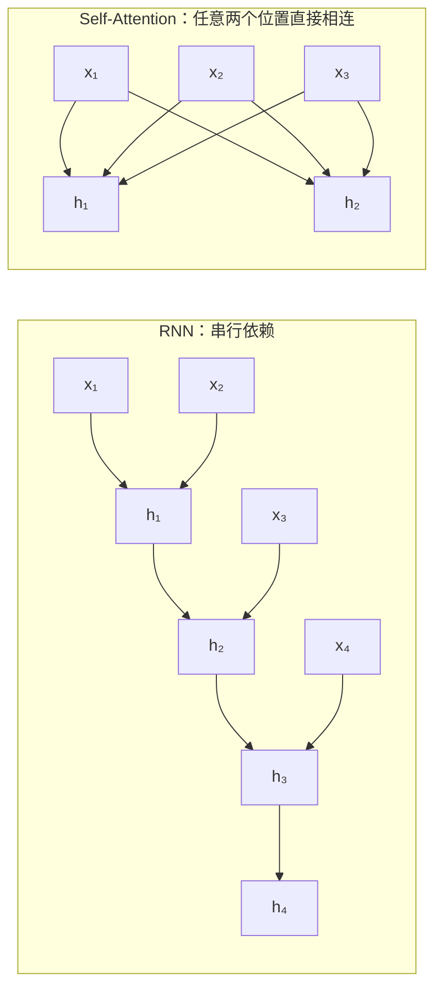
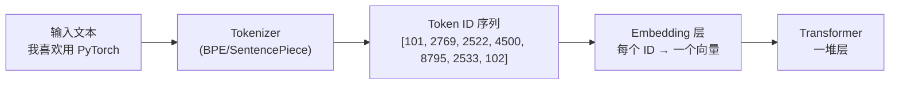
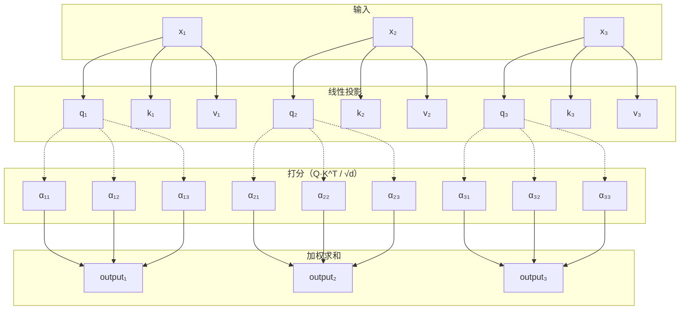
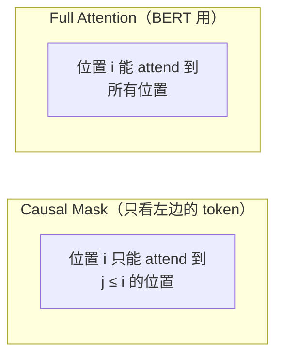
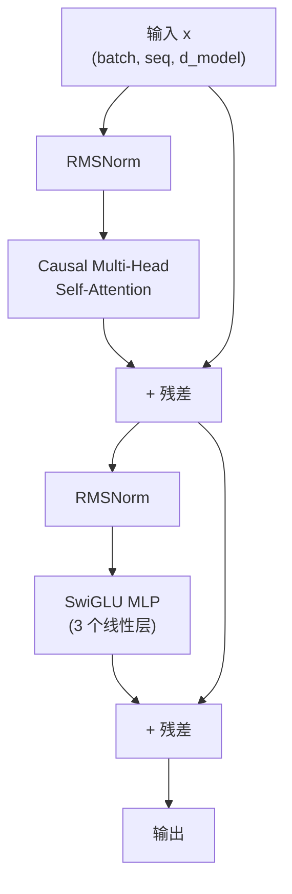
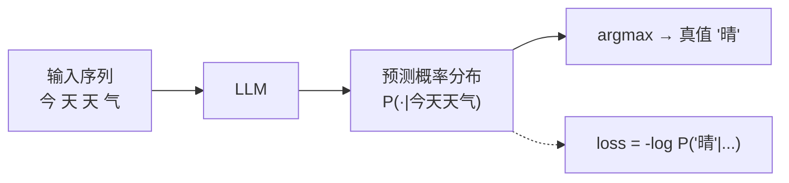

# 01 · Transformer 与 LLM 基础回顾

> 这一章是**全教程的行话扫盲**。如果下面这些名词你都已经熟，可以跳过；
> 如果只是听过没见过，那就花 20 分钟读完。后面所有章节都会用到这里的概念。

## 1. 从 RNN 到 Transformer

在 Transformer（2017）出现之前，处理序列的主流架构是 RNN/LSTM：



RNN 的两个致命问题：

- **串行计算**：第 $t$ 步必须等 $t-1$ 步算完，无法并行
- **长程依赖丢失**：句子太长时，句首的信息传到句尾已经被稀释

Transformer 用 **Self-Attention** 解决了这两个问题：序列中任意两个位置直接相连，且整条序列可以一次性并行计算。

## 2. Token：模型的"字"

模型不直接处理汉字或英文单词，而是处理 **token**——这是经过分词后的最小单位。



举几个 Qwen2.5 实际的例子（用 `transformers` 跑出来的）：

```python
from transformers import AutoTokenizer

tok = AutoTokenizer.from_pretrained("Qwen/Qwen2.5-7B-Instruct")

text = "我喜欢用 PyTorch 训练模型。"
ids = tok.encode(text)
print(f"文本：{text}")
print(f"Tokens: {tok.convert_ids_to_tokens(ids)}")
print(f"IDs   : {ids}")
```

**你应该看到：**

```
文本：我喜欢用 PyTorch 训练模型。
Tokens: ['我喜欢', '用', ' Py', 'Torch', ' 训练', '模型', '。']
IDs   : [104061, 10297, 6454, 79802, 115509, 43631, 37028]
```

💡 **几个关键点**：

| 概念 | 解释 |
|------|------|
| Token | 中文可能 1 字 1 token，也可能 2 字 1 token；英文 BPE 子词 |
| 词表大小 (vocab_size) | Qwen2.5 是 151,643；Llama-3 是 128,000 |
| 序列长度 (seq_len) | 一次能处理的最大 token 数；Qwen2.5 是 32K |
| 特殊 token | `<|im_start|>`、`<|im_end|>` 等用来标记对话边界 |
| Chat template | 决定多轮对话怎么拼成一个字符串，05 章会详细讲 |

## 3. Self-Attention：核心中的核心

### 3.1 直觉

想象你正在读这句话：

> "**小明**在北京工作，他的**他**指代的是谁？"

你大脑里发生的事情：读到"他"这个字的时候，会**自动回看**整句话，找到"小明"。Self-Attention 就是把这个"自动回看"的过程变成数学。

### 3.2 数学形式

📐 **Query-Key-Value 三剑客**

对于输入序列的每一个位置 $i$，我们有三个向量：

- **Query** $q_i$：当前位置"在找什么"
- **Key** $k_j$：其它位置"被找的标签"
- **Value** $v_j$：其它位置"实际携带的信息"

注意力分数的算法：

$$
\text{Attention}(Q, K, V) = \text{softmax}\!\left(\frac{Q K^\top}{\sqrt{d_k}}\right) V
$$

其中 $d_k$ 是 key 的维度。

### 3.3 一张图看懂



### 3.4 Causal Mask：单向注意

LLM 是**生成式**的——预测下一个 token 时，不能偷看后面的答案。所以在训练时需要把"未来位置"的注意力分数屏蔽掉：

$$
\alpha_{ij} =
\begin{cases}
\frac{q_i \cdot k_j}{\sqrt{d_k}}, & j \le i \\
-\infty, & j > i
\end{cases}
$$



可视化（`■` = 可见，`□` = 被 mask）：

```
位置 i    1  2  3  4  5
   1      ■  □  □  □  □
   2      ■  ■  □  □  □
   3      ■  ■  ■  □  □
   4      ■  ■  ■  ■  □
   5      ■  ■  ■  ■  ■
```

### 3.5 Multi-Head：并行多个"注意力视角"

一个注意力头只能捕捉一种关系。Multi-Head 把 Q/K/V 切成 $h$ 份，每份独立做注意力，最后拼起来：

$$
\text{MHA}(Q, K, V) = \text{Concat}(\text{head}_1, \dots, \text{head}_h) W^O
$$
$$
\text{head}_i = \text{Attention}(Q W_i^Q, K W_i^K, V W_i^V)
$$

类比：一篇文章可以分析"语法结构"、也可以分析"语义角色"——Multi-Head 就是让模型同时从多个角度审视。

## 4. 一个完整的 Transformer Block

Decoder-only LLM（如 Qwen、Llama）的每一层大致是这样：



两个关键组件：

1. **RMSNorm**：比 LayerNorm 更简洁的归一化，去掉了均值中心化
2. **SwiGLU MLP**：用 SiLU 激活的 GLU，Qwen/Llama 都用这个而不是 ReLU

每一层的输出形状和输入完全一样（`batch × seq × d_model`），这样可以堆任意多层。

## 5. LLM 的训练目标：下一个 token 预测

LLM 本质上是一个**超大的条件概率模型**：

$$
P(t_{i+1} \mid t_1, t_2, \dots, t_i)
$$

训练时，给一段文本，让模型预测下一个 token，loss 是交叉熵：

$$
\mathcal{L} = -\frac{1}{N} \sum_{i=1}^{N} \log P(t_{i+1} \mid t_{\le i})
$$



💡 **为什么这个目标能产生"智能"？**

- 训练数据是全人类文本
- 要预测下一个 token 准确，必须学到语法、常识、推理、代码……
- 这就是 scaling law 的理论基础：参数够多、数据够大，"预测下一个 token" 就涌现出各种能力

## 6. 一个最小的 GPT 玩具实现

为了让你真正理解内部在干什么，下面 50 行 PyTorch 代码实现了一个**超小**的 Decoder-only Transformer：

```python {1,4,15-18,28-35}
import torch
import torch.nn as nn
import torch.nn.functional as F

class CausalAttention(nn.Module):
    """一个头的 Causal Self-Attention。"""
    def __init__(self, d_model, head_dim, max_len):
        super().__init__()
        self.q = nn.Linear(d_model, head_dim, bias=False)
        self.k = nn.Linear(d_model, head_dim, bias=False)
        self.v = nn.Linear(d_model, head_dim, bias=False)
        # causal mask：上三角为 -inf
        self.register_buffer("mask", torch.triu(torch.full((max_len, max_len), float("-inf")), diagonal=1))

    def forward(self, x):  # x: (B, T, d_model)
        B, T, _ = x.shape
        q, k, v = self.q(x), self.k(x), self.v(x)              # (B, T, head_dim)
        scores = q @ k.transpose(-2, -1) / (q.size(-1) ** 0.5)  # (B, T, T)
        scores = scores + self.mask[:T, :T]                    # 把未来的位置打成 -inf
        weights = F.softmax(scores, dim=-1)                    # (B, T, T)
        return weights @ v                                      # (B, T, head_dim)


class TinyGPT(nn.Module):
    def __init__(self, vocab_size, d_model=128, n_heads=4, n_layers=2, max_len=64):
        super().__init__()
        self.token_emb = nn.Embedding(vocab_size, d_model)
        self.pos_emb   = nn.Embedding(max_len, d_model)
        head_dim = d_model // n_heads
        self.blocks = nn.ModuleList([
            nn.ModuleDict({
                "attn": CausalAttention(d_model, head_dim, max_len),
                "norm1": nn.LayerNorm(d_model),
                "mlp":  nn.Sequential(nn.Linear(d_model, 4*d_model), nn.GELU(), nn.Linear(4*d_model, d_model)),
                "norm2": nn.LayerNorm(d_model),
            }) for _ in range(n_layers)
        ])
        self.head = nn.Linear(d_model, vocab_size, bias=False)

    def forward(self, ids):                # ids: (B, T)
        B, T = ids.shape
        x = self.token_emb(ids) + self.pos_emb(torch.arange(T, device=ids.device))
        for blk in self.blocks:
            x = x + blk["attn"](blk["norm1"](x))   # 残差 + attn
            x = x + blk["mlp"](blk["norm2"](x))    # 残差 + mlp
        return self.head(x)                          # (B, T, vocab_size)


# 假装训练一步
model = TinyGPT(vocab_size=1000)
ids = torch.randint(0, 1000, (2, 16))                # 2 条序列，每条 16 个 token
logits = model(ids)                                  # (2, 16, 1000)
loss = F.cross_entropy(logits.view(-1, 1000), ids.view(-1))
print(f"随机初始化 loss 应该是 ≈ ln(1000) = {torch.log(torch.tensor(1000.)):.2f}")
print(f"实际 loss : {loss.item():.2f}")
```

**你应该看到：**

```
随机初始化 loss 应该是 ≈ ln(1000) = 6.91
实际 loss : 6.93
```

这个 `6.93` 接近 `ln(1000) ≈ 6.91` 是好事——说明模型确实在均匀随机地猜（这正是初始状态应该的样子）。训练过程中这个数字会逐步下降到 2~3 左右。

## 7. 关键参数对照表

读 LLM 论文/技术报告时，下面这些参数你必须认识：

| 参数 | 符号 | Qwen2.5-7B 实际值 | 说明 |
|------|------|-------------------|------|
| 参数量 | $N$ | 7.6B | 模型权重总数 |
| 隐藏维度 | $d_{\text{model}}$ | 3584 | 每个 token 表示的向量长度 |
| 层数 | $L$ | 28 | Transformer block 堆叠的层数 |
| 注意力头数 | $h$ | 28 | Q/K/V 各分这么多头 |
| 单头维度 | $d_k$ | 128 | $d_{\text{model}} / h$ |
| 词表大小 | $V$ | 151,643 | tokenizer 能识别多少个 token |
| 最大序列长度 | $T$ | 32,768 | 一次能处理多长 |
| 训练 token 数 | $D$ | 18T (18 万亿) | Qwen2.5 训练用的总 token |

## 8. 用 Hugging Face 跑一次真正的推理

理论看完了，跑一次 Qwen2.5 看看真实模型的输出：

```python
from transformers import AutoModelForCausalLM, AutoTokenizer
import torch

model_id = "Qwen/Qwen2.5-1.5B-Instruct"   # 先用 1.5B 试试，5GB 显存就够
tokenizer = AutoTokenizer.from_pretrained(model_id)
model = AutoModelForCausalLM.from_pretrained(
    model_id,
    torch_dtype=torch.bfloat16,
    device_map="auto",
)

# 用 chat template 组织对话
messages = [
    {"role": "system", "content": "你是一个简洁的助手。"},
    {"role": "user",   "content": "用一句话解释 Self-Attention。"},
]
prompt = tokenizer.apply_chat_template(messages, tokenize=False, add_generation_prompt=True)

inputs = tokenizer(prompt, return_tensors="pt").to(model.device)
outputs = model.generate(**inputs, max_new_tokens=128, temperature=0.7, do_sample=True)
print(tokenizer.decode(outputs[0][inputs.input_ids.size(1):], skip_special_tokens=True))
```

**你应该看到：**模型用中文给出一段关于 Self-Attention 的解释。

## 9. 你应该掌握的"行话清单"

读后续章节前，请确认你认识下面这些术语：

- [ ] Token / Tokenizer / Vocab / Chat template
- [ ] Embedding / Hidden state / $d_{\text{model}}$
- [ ] Self-Attention / Query / Key / Value / Softmax
- [ ] Causal mask / Multi-Head Attention
- [ ] RMSNorm / LayerNorm / 残差连接 (residual)
- [ ] MLP / FFN / SwiGLU
- [ ] Causal Language Modeling / Next-token prediction
- [ ] Cross-entropy loss / Perplexity
- [ ] bf16 / fp16 / fp32 / int8 / int4 (量化精度)
- [ ] Batch size / Sequence length / Gradient accumulation

如果某一项不确定，先 Google 一下再继续。

## 10. 小结

- **LLM = 巨大的 Decoder-only Transformer + 海量文本 + 下一个 token 预测**
- Self-Attention 让任意两个位置直接通信
- Causal mask 让模型只能看到"过去"
- 训练目标 = 最大化下一个 token 的对数似然

下一步：了解 [02-微调全景图](02-微调全景图.md)，我们会把上面这个"通用 LLM"逐步改造成"领域专家"。
