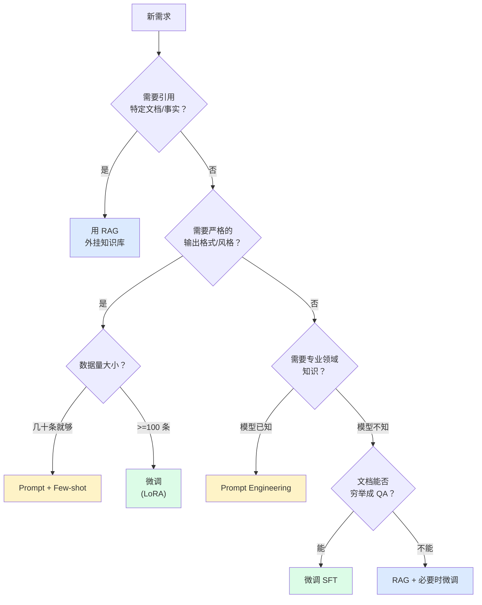
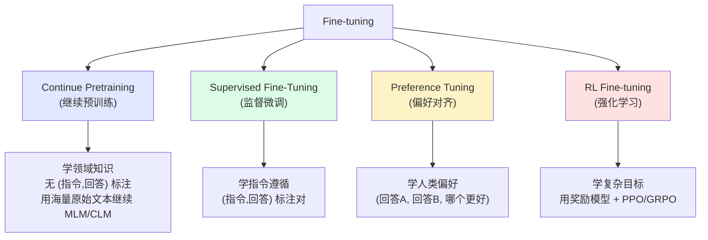
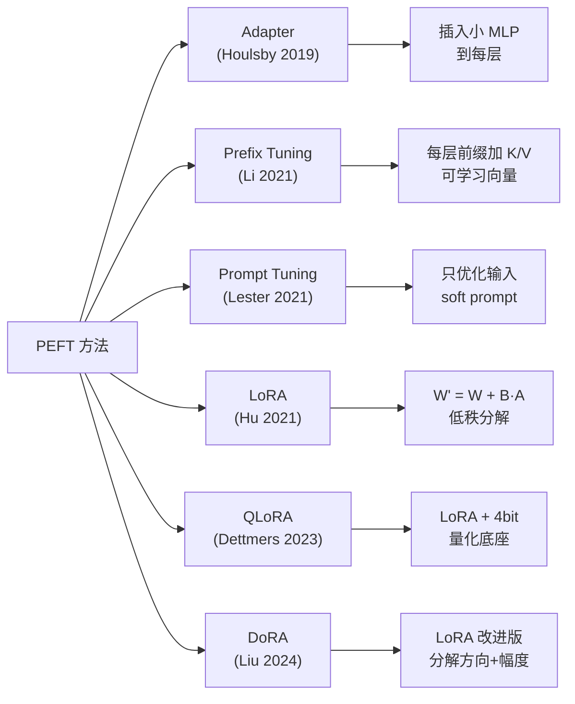

# 02 · 微调全景图：什么时候该微调、用哪种微调

> 本章解决一个战略问题：**面对一个新需求，你应该在 prompt、RAG、微调 之间如何选择？**
> 以及如果你选了微调，又该选哪种微调方法。

## 1. 问题的提出

假设你接到一个需求：

> "我们公司是做法律咨询的，希望做一个 AI 助手，能用我们过往 1000 份合同范本的风格回答问题。"

现在你有 4 种主流技术路径：

| 技术 | 改的是什么 | 需要的数据量 | 成本 |
|------|----------|-----------|------|
| **Prompt Engineering** | 提示词 | 0 | 几乎为 0 |
| **RAG (检索增强生成)** | 外挂知识库 | 文档 100~10000 份 | 中 |
| **In-Context Learning** | 提示词里的例子 | 几~几十个 | 低 |
| **Fine-tuning (微调)** | 模型参数 | 100~100000 条 (问,答) 对 | 中~高 |

一个错误的直觉："微调最强大，所以我应该用微调。" 实际上：

- **微调 ≠ 解决一切问题**
- 很多场景 prompt + RAG 已经足够
- 强行上微调可能引入新问题（灾难性遗忘、幻觉增多）

## 2. 决策树



## 3. 三个核心场景对比

### 场景 A：客服话术标准化

**需求**：把所有客服回复改成统一的礼貌风格，且必须出现"亲""感谢您的支持"等关键词。

**最适合**：**微调**（监督微调 SFT）

**为什么**：

- 输出格式严格，prompt 难以稳定控制
- 风格学习在 prompt 里很难表达清楚
- 几百条示例数据就够

### 场景 B：企业内部知识问答

**需求**：让模型能基于公司内部 Wiki 回答"我们公司年假怎么请"。

**最适合**：**RAG**（先 RAG，不够再微调）

**为什么**：

- 知识每天都在变，微调追不上
- Wiki 文档结构化，直接检索比让模型记住更可靠
- 微调还可能引入幻觉

### 场景 C：通用对话能力增强

**需求**：让模型在多轮对话中更"听话"，理解复杂的指令。

**最适合**：**Prompt + 微调底座模型**

**为什么**：

- 通用能力应该由基础模型提供
- 自己微调通用对话大概率不如用 Instruct 版本
- 应当选一个已经对齐好的 Instruct 模型

## 4. 微调的四种类型

确定了"要微调"之后，又面临"用哪种微调"。下面是当前（2026 年初）的主流分类：



### 4.1 监督微调 SFT（Supervised Fine-Tuning）

**目标**：让模型学会"按指令回答"

**数据格式**：`(instruction, output)` 对，比如 Alpaca 格式：

```json
{
  "instruction": "把以下句子翻译成英文",
  "input": "今天天气真好",
  "output": "The weather is really nice today."
}
```

**Loss**：只在 `output` 部分计算 cross-entropy，`instruction` 部分 mask 掉。

这是**本教程的主线**，05 章会端到端教你跑一遍。

### 4.2 继续预训练 CPT（Continue Pre-Training）

**目标**：让模型学到你领域的基础知识（比如医学、法律专有名词）

**数据格式**：纯文本，无标注

**Loss**：标准的 next-token prediction，全文本都参与 loss

**什么时候需要**：

- 你的领域术语/概念模型基本不懂（比如小众方言、古文）
- 你准备做 SFT 但模型连基础概念都不认识

⚠️ **警告**：CPT 容易让模型"变笨"——它会把原来学到的指令遵循能力冲淡。所以通常在 CPT 之后还要再 SFT 一遍。

### 4.3 偏好对齐 DPO/IPO/ORPO

**目标**：让模型的回答更符合人类偏好（更有用、更无害、更诚实）

**数据格式**：`(prompt, chosen, rejected)` 三元组

```json
{
  "prompt": "解释什么是过拟合",
  "chosen": "过拟合是指模型在训练数据上表现很好，但在新数据上表现差...",
  "rejected": "过拟合就是模型太聪明了..."
}
```

**DPO（Direct Preference Optimization）**：直接用二分类 loss 优化，不需要单独训练 reward model 和 PPO 循环。2023 年提出，目前最主流。

**ORPO**：把 SFT 和 DPO 合二为一，更省显存。

### 4.4 强化学习 PPO/GRPO

**目标**：和 DPO 类似，但更灵活，可以对接复杂奖励信号（比如推理正确性）

**问题**：训练不稳定、需要 reward model、显存开销大

**什么时候用**：当你的"好"无法用偏好数据表达，而需要精确打分时（比如数学题要对、代码要跑通）

07 章会进一步讨论。

## 5. 参数高效微调（PEFT）的几种方法

即使确定了"做 SFT"，又面临参数高效方法的选型。



### 对比矩阵

| 方法 | 可训练参数比例 | 显存节省 | 性能（vs 全量） | 推理额外开销 | 推荐度 |
|------|--------------|---------|----------------|------------|-------|
| Full FT | 100% | 1× | 100%（基准） | 无 | ⭐⭐ 训练成本高 |
| Adapter | 1~5% | 3~5× | 95~98% | 推理变慢 | ⭐ |
| Prefix Tuning | 0.1~1% | 5~10× | 90~95% | 推理变慢 | ⭐ |
| LoRA | 0.1~5% | 3~5× | 95~99% | **无**（可合并） | ⭐⭐⭐⭐⭐ |
| QLoRA | 0.1~5% | **10~13×** | 93~98% | 无（合并后） | ⭐⭐⭐⭐⭐ |
| DoRA | 0.1~5% | 3~5× | 96~100% | 无 | ⭐⭐⭐⭐ |

**结论**：**LoRA / QLoRA 是当前主流**。04 章会深入 LoRA 的数学原理。

## 6. 一个真实案例的需求拆解

假设你在做**企业内部代码审查助手**：

| 子需求 | 推荐方案 | 原因 |
|-------|---------|------|
| 熟悉公司内部代码库 | **RAG** | 库太大每天在变 |
| 按公司编码规范审查 | **SFT 微调** | 规范细节几百条示例就能学会 |
| 回答礼貌专业 | **基础 Instruct 模型已具备** | 不需要微调 |
| 多语言（中英混排） | **基础模型选择** | 选本身就支持多语言的底座 |
| 拒绝敏感请求 | **RLHF/DPO** | 用偏好数据训练拒绝能力 |

可以看出：**一个完整产品往往是多种技术的组合**。

## 7. 选型 checklist

在动手微调前，先回答下面这些问题：

- [ ] 这个问题**必须靠微调解决**吗？试过 prompt 和 RAG 了吗？
- [ ] 准备好**至少 100 条高质量 (指令,回答) 数据**了吗？
- [ ] 这些数据的**分布**能代表真实使用场景吗？
- [ ] 有**评估集**或者**人能判断好坏的标准**吗？
- [ ] 能接受模型**可能变笨一点点**（灾难性遗忘的风险）吗？
- [ ] 预算/时间允许**几次迭代调参**吗？

如果有任何一项打 `❌`，先回去补。否则直接进入 [03-数据准备](03-数据准备.md)。

## 8. 小结

| 决策点 | 选择 |
|-------|------|
| 是否要微调 | 视场景而定；prompt/RAG 优先 |
| 微调哪种 | SFT 最常用；CPT 补知识；DPO 调偏好 |
| 用什么 PEFT | LoRA / QLoRA 是当前事实标准 |
| 整体策略 | 微调 + RAG + 好 Prompt，三件套配合 |

下一步：[03-数据准备](03-数据准备.md) — 数据是微调的命脉。
