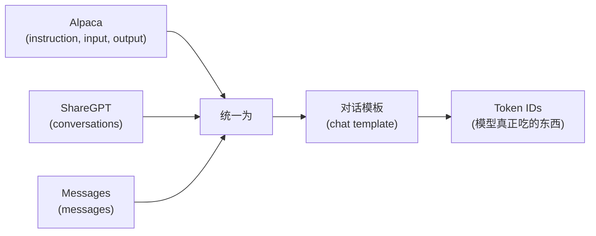
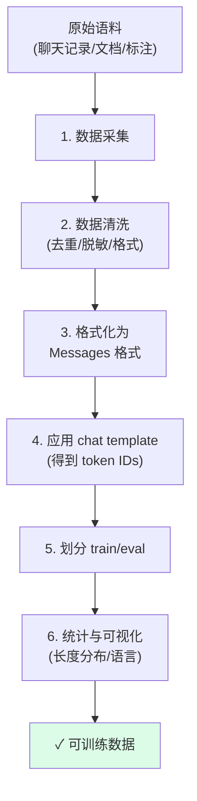
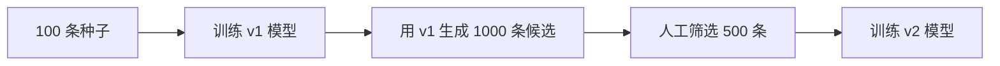

# 03 · 数据准备：微调的命脉

> "**数据质量 > 数据数量 > 模型架构 > 调参**"
>
> ——这句话在微调圈子里被反复验证。本章教你把"原始语料"变成模型能直接吃的数据集。

## 1. 为什么数据最重要

一个有趣的对照实验（来自多家团队的实证）：

| 场景 | 训练数据量 | 训练耗时 | 模型表现 |
|------|----------|---------|---------|
| 用 1000 条高质量 + 精心清洗的数据 | 1000 | 1 小时 | 80 分 |
| 用 100000 条网络爬来的脏数据 | 10万 | 30 小时 | 55 分 |

数据清洗的 ROI 远高于调参。下面所有内容都围绕"如何获得 100 条高质量数据"展开。

## 2. 主流数据格式

不同框架对数据格式的定义略有不同，但本质都是"指令-回答"对。

### 2.1 Alpaca 格式（最经典）

```json
{
  "instruction": "把以下句子翻译成英文",
  "input": "今天天气真好",
  "output": "The weather is really nice today."
}
```

- `instruction`：任务描述
- `input`：可选输入（可为空）
- `output`：期望的回答

适合**单轮、有明确输入**的任务。

### 2.2 ShareGPT 格式（多轮对话）

```json
{
  "conversations": [
    {"from": "human", "value": "你好"},
    {"from": "gpt",   "value": "你好，有什么可以帮你的？"},
    {"from": "human", "value": "讲个笑话"},
    {"from": "gpt",   "value": "为什么程序员总是穿黑衣？因为他们不想吸引 bug。"}
  ]
}
```

适合**多轮对话、聊天机器人**。

### 2.3 OpenAI Chat Messages 格式（最现代）

```json
{
  "messages": [
    {"role": "system",    "content": "你是一个法律助手"},
    {"role": "user",      "content": "什么是不可抗力？"},
    {"role": "assistant", "content": "不可抗力是指..."}
  ]
}
```

这是 OpenAI / Hugging Face trl 当前推荐的标准。

### 2.4 三种格式的对比



**关键认知**：Alpaca/ShareGPT/Messages 都是"逻辑数据"；真正喂给模型的是 `tokenizer.apply_chat_template(...)` 之后的字符串 + token ID。

## 3. Chat Template：很多人忽略的关键

每个模型的 chat template 都**不一样**。错用 chat template = 模型表现奇怪。

```python
from transformers import AutoTokenizer

# 同一个对话，不同模型的 chat template 长得完全不同
messages = [
    {"role": "system", "content": "你是助手"},
    {"role": "user",   "content": "你好"},
]

for model_id in ["Qwen/Qwen2.5-7B-Instruct", "meta-llama/Meta-Llama-3-8B-Instruct"]:
    tok = AutoTokenizer.from_pretrained(model_id)
    print(f"=== {model_id} ===")
    print(tok.apply_chat_template(messages, tokenize=False, add_generation_prompt=True))
    print()
```

**你应该看到：**

```
=== Qwen/Qwen2.5-7B-Instruct ===
<|im_start|>system
你是助手<|im_end|>
<|im_start|>user
你好<|im_end|>
<|im_start|>assistant


=== meta-llama/Meta-Llama-3-8B-Instruct ===
<|begin_of_text|><|start_header_id|>system<|end_header_id|>

你是助手<|eot_id|><|start_header_id|>user<|end_header_id|>

你好<|eot_id|><|start_header_id|>assistant<|end_header_id|>


```

⚠️ **警告**：如果你的数据是用 ChatGPT 的格式（`[{"role":"user","content":"..."}]`）准备的，但喂给 Qwen 用了 Qwen 的 chat template，一切正常；但如果你**直接拿字符串 `"用户: 你好\n助手:"` 去拼**，模型大概率学坏。

## 4. 数据准备的完整流程



### 4.1 数据采集

来源优先级：

| 来源 | 适合场景 | 注意事项 |
|------|---------|---------|
| 业务真实日志（脱敏后） | 客服/工具调用 | 一定要脱敏；用户隐私 |
| 人工标注 | 高质量、小规模 | 贵但可靠 |
| GPT-4/Gemini 生成 | 中等质量、规模化 | 需人工抽检 |
| 开源数据集 | 通用任务 | 注意 license |
| Wikipedia/教科书 | 继续预训练 | 注意时效和领域 |

💡 **小数据 + 高质量 > 大数据 + 噪声**。

### 4.2 数据清洗

必做的几件事：

```python
import json
import re
from collections import Counter

def clean_dataset(input_path, output_path):
    seen = set()           # 用于去重
    too_short = 0
    too_long = 0
    kept = 0

    with open(input_path) as fin, open(output_path, "w") as fout:
        for line in fin:
            ex = json.loads(line)
            inst = ex.get("instruction", "").strip()
            out = ex.get("output", "").strip()

            # 1. 去重：用 (inst, out) 作为 key
            key = (inst, out)
            if key in seen:
                continue
            seen.add(key)

            # 2. 长度过滤
            if len(inst) < 5 or len(out) < 5:
                too_short += 1
                continue
            if len(inst) + len(out) > 8000:        # 字符数估算
                too_long += 1
                continue

            # 3. 简单脱敏：手机号、邮箱、身份证
            out = re.sub(r"1[3-9]\d{9}", "[PHONE]", out)
            out = re.sub(r"[\w.]+@[\w.]+", "[EMAIL]", out)
            out = re.sub(r"\d{17}[\dXx]", "[ID]", out)

            # 4. 标准化空白
            inst = re.sub(r"\s+", " ", inst)
            out = re.sub(r"\s+", " ", out)

            ex["instruction"] = inst
            ex["output"] = out
            fout.write(json.dumps(ex, ensure_ascii=False) + "\n")
            kept += 1

    print(f"保留 {kept}，过短 {too_short}，过长 {too_long}")

clean_dataset("data/raw.jsonl", "data/train.jsonl")
```

### 4.3 格式化为 Messages

```python
import json

def alpaca_to_messages(in_path, out_path):
    """把 Alpaca 格式转成 Messages 格式"""
    with open(in_path) as fin, open(out_path, "w") as fout:
        for line in fin:
            ex = json.loads(line)
            user = ex["instruction"]
            if ex.get("input"):
                user += "\n\n" + ex["input"]

            new = {
                "messages": [
                    {"role": "user",      "content": user},
                    {"role": "assistant", "content": ex["output"]},
                ]
            }
            fout.write(json.dumps(new, ensure_ascii=False) + "\n")

alpaca_to_messages("data/train.jsonl", "data/train_messages.jsonl")
```

### 4.4 应用 chat template + Tokenize

这一步由训练代码（05 章会用到）自动完成。但手工跑一遍帮你理解：

```python
from transformers import AutoTokenizer

tok = AutoTokenizer.from_pretrained("Qwen/Qwen2.5-7B-Instruct")

ex = {
    "messages": [
        {"role": "user",      "content": "你好"},
        {"role": "assistant", "content": "你好！很高兴见到你。"},
    ]
}

# 关键：apply_chat_template + return_assistant_tokens_mask
out = tok.apply_chat_template(
    ex["messages"],
    tokenize=True,
    return_dict=True,
    return_assistant_tokens_mask=True,    # ← 关键！用于只计算 assistant 的 loss
)
print("input_ids   :", out["input_ids"][:30], "...")
print("mask        :", out["assistant_masks"][:30], "...")
print("decoded     :", tok.decode(out["input_ids"]))
```

**你应该看到**类似这样的输出：

```
input_ids   : [151644, 8948, 198, ..., 151645, ...]
mask        : [0, 0, 0, ..., 1, 1, 1, ..., 0]
decoded     : <|im_start|>system\n<|im_end|>\n<|im_start|>user\n你好<|im_end|>\n<|im_start|>assistant\n你好！很高兴见到你。<|im_end|>\n
```

💡 **`assistant_masks`**：在 assistant 内容部分为 1，其它部分为 0。训练时只对 mask=1 的位置算 loss——这样模型就只学"怎么回答"，不学"用户的提问长什么样"。

### 4.5 划分 Train / Eval

```python
import json
import random

def split(path, eval_ratio=0.05, seed=42):
    random.seed(seed)
    data = [json.loads(l) for l in open(path)]
    random.shuffle(data)
    n_eval = max(50, int(len(data) * eval_ratio))    # 至少 50 条
    return data[n_eval:], data[:n_eval]

train, eval_ = split("data/train_messages.jsonl", eval_ratio=0.05)

with open("data/train.jsonl", "w") as f:
    for ex in train: f.write(json.dumps(ex, ensure_ascii=False) + "\n")
with open("data/eval.jsonl",  "w") as f:
    for ex in eval_ : f.write(json.dumps(ex, ensure_ascii=False) + "\n")

print(f"Train: {len(train)}, Eval: {len(eval_)}")
```

⚠️ **Eval 集千万不要混进 Train**——否则你看到的 eval loss 永远漂亮，但模型在新数据上一塌糊涂。

### 4.6 长度分布统计

训练前**必须**看一眼长度分布，否则会被 OOM 坑死：

```python
import json
from transformers import AutoTokenizer
import numpy as np

tok = AutoTokenizer.from_pretrained("Qwen/Qwen2.5-7B-Instruct")
lens = []

with open("data/train.jsonl") as f:
    for line in f:
        ex = json.loads(line)
        text = tok.apply_chat_template(ex["messages"], tokenize=False)
        lens.append(len(tok.encode(text)))

lens = np.array(lens)
print(f"样本数      : {len(lens)}")
print(f"平均长度    : {lens.mean():.0f}")
print(f"P50 / P90 / P95 / P99: {np.percentile(lens, [50, 90, 95, 99])}")
print(f"最大长度    : {lens.max()}")

# 推荐 max_seq_length 设置
p95 = int(np.percentile(lens, 95))
print(f"\n建议 max_seq_length = {p95} (覆盖 95% 数据) 或 {lens.max()} (全覆盖，更耗显存)")
```

**典型输出：**

```
样本数      : 1000
平均长度    : 287
P50 / P90 / P95 / P99: [142 567  892  1843]
最大长度    : 2105

建议 max_seq_length = 892 (覆盖 95% 数据) 或 2105 (全覆盖，更耗显存)
```

如果你看到 P99 已经 4000+，说明数据里有几个超长样本，考虑：

1. 截断 / 拆分长样本
2. 或者把 `max_seq_length` 调大（但显存占用是平方级增长）

## 5. 数据增强技巧

数据量不够怎么办？

### 5.1 用 GPT 生成更多

```python
# 用 GPT-4/Gemini 根据种子数据生成变体
SEED_EXAMPLES = [
    {"instruction": "把以下句子翻译成英文", "input": "今天天气真好", "output": "The weather is really nice today."},
]

PROMPT = """你是一个数据增强助手。基于下面的种子样本，生成 5 个语义相似但表达不同的变体。
要求：
1. instruction 可以改写，但语义不变
2. input 可以用同义词替换
3. output 保持同样的翻译质量
4. 用 JSONL 格式输出

种子样本：
{seed}
"""
```

⚠️ **关键**：生成的数据**必须人工抽检**，否则模型会学到你不想学的偏见。

### 5.2 简单文本增强

| 技术 | 适用 | 示例 |
|------|------|------|
| 同义词替换 | 翻译、文本分类 | "好" ↔ "优秀" |
| 回译（中文→英文→中文） | 通用 | 用翻译 API 来回翻 |
| 模板化 | 结构化任务 | 把变量填进不同槽位 |

### 5.3 自训练 + 人工筛选



这是 bootstrapping，工业界常用。

## 6. 几条数据原则

| 原则 | 解释 |
|------|------|
| **质量 > 数量** | 100 条精挑细选 > 10000 条网络爬的 |
| **多样性 > 数量** | 同一类问题不要重复太多，要覆盖各种 case |
| **代表真实分布** | eval 集要反映真实使用场景 |
| **避免偏见集中** | 不要全是同一长度、同一风格 |
| **包含失败案例** | 主动构造一些"应该拒绝/不知道"的样本 |
| **不要混入 prompt injection 样本** | 否则模型可能学坏 |

## 7. 一个端到端的最小数据准备脚本

把上面的步骤串起来：

```python
"""data_prep.py — 从原始 JSONL 到可训练 dataset 的完整流程"""
import json
import re
import random
import numpy as np
from transformers import AutoTokenizer

MODEL_ID = "Qwen/Qwen2.5-7B-Instruct"
MAX_LEN  = 2048

def load_raw(path):
    return [json.loads(l) for l in open(path)]

def clean(ex):
    inst = re.sub(r"\s+", " ", ex.get("instruction", "")).strip()
    out  = re.sub(r"\s+", " ", ex.get("output", "")).strip()
    # 脱敏
    out = re.sub(r"1[3-9]\d{9}", "[PHONE]", out)
    out = re.sub(r"[\w.]+@[\w.]+", "[EMAIL]", out)
    return {"instruction": inst, "input": ex.get("input", ""), "output": out}

def to_messages(ex):
    user = ex["instruction"]
    if ex.get("input"):
        user += "\n\n" + ex["input"]
    return {"messages": [
        {"role": "user",      "content": user},
        {"role": "assistant", "content": ex["output"]},
    ]}

def dedupe(data):
    seen, out = set(), []
    for ex in data:
        k = (ex["instruction"], ex["output"])
        if k in seen: continue
        seen.add(k); out.append(ex)
    return out

def main():
    raw = load_raw("data/raw.jsonl")
    print(f"原始 {len(raw)} 条")

    cleaned = [clean(ex) for ex in raw]
    cleaned = dedupe(cleaned)
    print(f"清洗+去重后 {len(cleaned)} 条")

    msgs = [to_messages(ex) for ex in cleaned]

    # 划分
    random.seed(42); random.shuffle(msgs)
    n_eval = max(50, int(len(msgs) * 0.05))
    train, eval_ = msgs[n_eval:], msgs[:n_eval]
    print(f"Train {len(train)} / Eval {len(eval_)}")

    # 长度统计
    tok = AutoTokenizer.from_pretrained(MODEL_ID)
    lens = [len(tok.encode(tok.apply_chat_template(ex["messages"], tokenize=False))) for ex in train]
    print(f"长度 P50/P95/P99: {np.percentile(lens, [50, 95, 99]).astype(int).tolist()}")

    # 写出
    for path, data in [("data/train.jsonl", train), ("data/eval.jsonl", eval_)]:
        with open(path, "w") as f:
            for ex in data:
                f.write(json.dumps(ex, ensure_ascii=False) + "\n")
        print(f"写出 {path}")

if __name__ == "__main__":
    main()
```

**运行它，你应该看到：**

```
原始 1000 条
清洗+去重后 987 条
Train 938 / Eval 49
长度 P50/P95/P99: [142, 887, 1456]
写出 data/train.jsonl
写出 data/eval.jsonl
```

## 8. 小结

| 步骤 | 工具 | 关键点 |
|------|------|-------|
| 采集 | 业务/人工/GPT | 质量 > 数量 |
| 清洗 | 正则 + 去重 | 脱敏、长度过滤 |
| 格式化 | 几行 Python | 统一 Messages 格式 |
| Chat template | `apply_chat_template` | 必须和模型匹配 |
| 划分 | random split | Train ≠ Eval |
| 长度统计 | numpy | 决定 `max_seq_length` |

**数据搞定了，下一步进入理论时间**：[04-微调方法原理](04-微调方法原理.md) — 重点搞懂 LoRA 为什么这么强。
