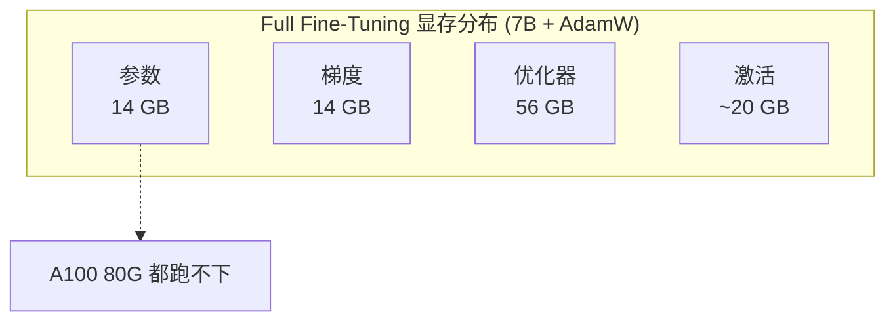
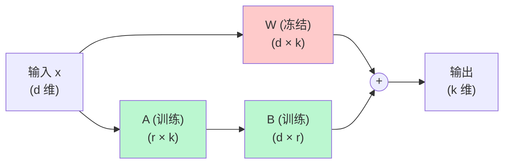
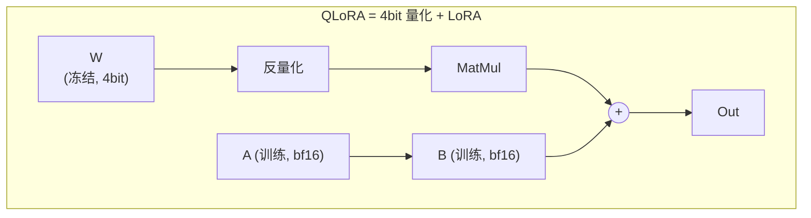
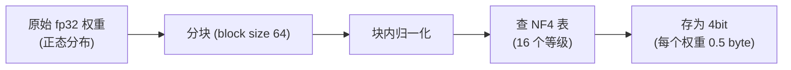
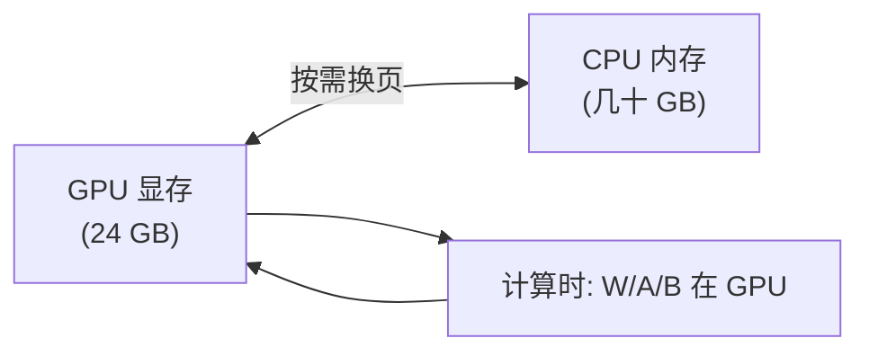
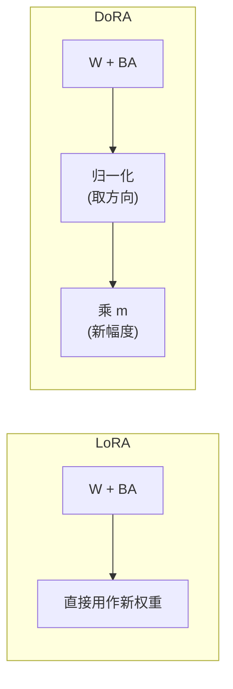
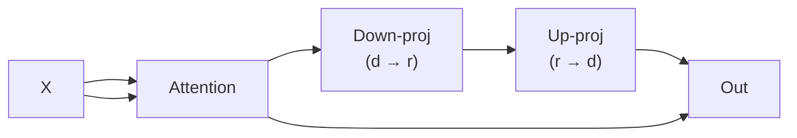
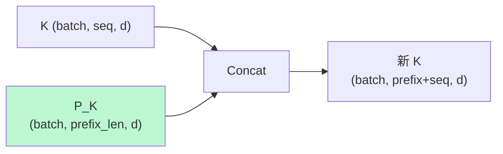
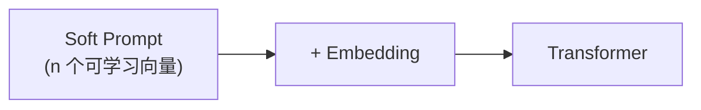
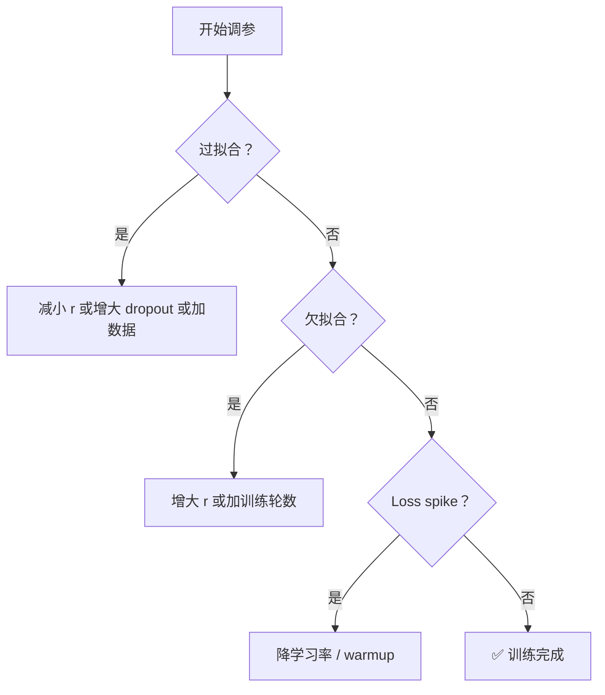

# 04 · 微调方法原理：从 Full FT 到 QLoRA 的数学

> 本章是**理论最重的一章**。我们会把 LoRA 的低秩分解、QLoRA 的 NF4 量化从数学上搞透。
> 如果你只想"知道怎么用"，可以跳过数学框直接看结论。

## 1. Full Fine-Tuning：基线

### 1.1 显存花在哪

训练一个 7B 模型（bf16），优化器用 AdamW，**最低显存**：

| 项目 | 显存 | 说明 |
|------|-----|------|
| 模型参数 (W) | 14 GB | 7B × 2 bytes |
| 梯度 (∇W) | 14 GB | 同上 |
| 优化器状态 (AdamW) | 56 GB | 2 个状态 × 4 bytes × 7B |
| 激活值 | 10~30 GB | 视 batch/seq |
| **合计** | **94~114 GB** | 需要 A100 80G 都跑不动 |



**核心观察**：优化器状态占了一半多（Adam 要存 $m_t$ 和 $v_t$ 两个动量，都是 fp32）。如果能把这部分省掉，显存就降一半。

## 2. LoRA：低秩适配（Low-Rank Adaptation）

### 2.1 核心直觉

📐 **矩阵低秩分解**

对于一个稠密的 $d \times k$ 权重矩阵 $W$，LoRA 的核心假设是：**它在微调过程中发生的变化 $\Delta W$ 是低秩的**。

$$
W' = W + \Delta W = W + B A
$$

其中：

- $W \in \mathbb{R}^{d \times k}$：原始冻结权重
- $B \in \mathbb{R}^{d \times r}$，$A \in \mathbb{R}^{r \times k}$
- $r \ll \min(d, k)$（秩，通常 4~64）



直观理解：

- 原始 $W$ 是 $d \times k$ 的大矩阵（比如 4096×4096 = 16M 参数）
- $\Delta W = BA$，其中 $B$ 是 $d \times r$、$A$ 是 $r \times k$，总参数 $r(d+k)$
- 当 $r=8$ 时：$8 \times (4096 + 4096) = 65K$ 参数，只有原来的 0.4%

**为什么这个假设成立？**

经验观察（论文里给的）：预训练模型的"任务相关变化"通常落在一个很低的内在维度上。通俗地说："学会一个新任务" 并不需要改整个矩阵的 16M 个参数，改几千个就够。

### 2.2 初始化

- $A$ 用 Kaiming 均匀分布初始化（标准正态）
- $B$ 初始化为 **全零**

这样一开始 $\Delta W = BA = 0$，模型输出和原始完全一样，训练从"零增量"开始。

### 2.3 缩放因子

实际计算时：

$$
W' x = W x + \frac{\alpha}{r} B A x
$$

其中 $\alpha$ 是缩放超参。这样做的好处：**改 rank $r$ 时不需要重新调学习率**。

经验规则：`alpha = 2 * r` 或者 `alpha = r`。

### 2.4 哪些层加 LoRA？

实践中通常对**所有线性层**加 LoRA：

```python
# Qwen2.5 的线性层
target_modules = [
    "q_proj", "k_proj", "v_proj", "o_proj",   # Attention
    "gate_proj", "up_proj", "down_proj",     # MLP
]
```

也可以只加 Attention（`q_proj, v_proj`），效果略差但参数更少。

### 2.5 LoRA 的显存节省

| 项目 | Full FT | LoRA (r=8) |
|------|---------|-----------|
| 模型参数 | 14 GB | 14 GB（冻结） |
| 梯度 | 14 GB | ~0.05 GB |
| 优化器状态 | 56 GB | ~0.1 GB |
| 激活 | ~20 GB | ~20 GB |
| **合计** | ~104 GB | **~34 GB** |

→ **单卡 4090 24G + 优化就能跑 7B LoRA**。

### 2.6 推理可以零成本合并

训练完之后：

$$
W' = W + \frac{\alpha}{r} B A
$$

把 $B \cdot A$ 算回 $W$ 的形状，**加回原始矩阵**。这样推理时**没有任何额外开销**，就和全量微调一样。

```python
# PEFT 提供这个 API
merged_model = lora_model.merge_and_unload()
```

## 3. QLoRA：把底座也量化

### 3.1 为什么还要 QLoRA

LoRA 让训练参数变少，但**底座模型 W 还是要 14GB**。QLoRA（2023）更进一步：把 $W$ 也量化成 4bit。



### 3.2 NF4 (NormalFloat 4-bit)

QLoRA 的关键创新是 **NF4 数据类型**。它是专门为**正态分布的权重**设计的 4bit 量化方案。

📐 **NF4 的设计思路**

权重通常呈均值为 0 的正态分布。NF4 把这个分布的等概率区间映射到 16 个离散值：

$$
\text{NF4} = \{-1, -0.696, -0.525, -0.397, -0.291, -0.206, -0.133, -0.068, 0, 0.068, 0.133, 0.206, 0.291, 0.397, 0.525, 0.696\}
$$



**比朴素的 INT4 更好**：因为权重的分布不是均匀的，均匀分桶会浪费精度。NF4 在权重密集区精度更高，稀疏区精度低——这正是我们想要的。

### 3.3 双量化 (Double Quantization)

进一步把**量化常数本身**也量化。4bit 权重存了，对应的 scale/zero-point 是 fp32——这部分也量化：

| 项目 | 常规量化 | 双量化 |
|------|---------|--------|
| 权重 | 4bit | 4bit |
| scale | fp32 | **fp8** |
| 每 64 个参数的额外开销 | 32 bytes | **0.5 byte** |

显存又省 ~3 GB（对 7B 模型而言）。

### 3.4 分页优化器 (Paged Optimizer)

当 GPU 显存不够时，**把优化器状态临时卸载到 CPU 内存**。训练过程中按需换入换出，避免 OOM。



### 3.5 QLoRA 最终显存

7B 模型 + QLoRA + seq=2048 + bs=1：

| 项目 | 显存 |
|------|-----|
| 4bit 底座 | ~4 GB |
| LoRA (r=16) 参数 + 优化器 | ~0.3 GB |
| 激活 | ~8 GB |
| **合计** | **~13 GB** |

→ **单卡 RTX 3060 12G 都能跑 7B QLoRA**。

## 4. 数学对比总结

| 方法 | 参数更新量 | 显存 (7B) | 性能 vs Full FT |
|------|---------|----------|----------------|
| Full FT | 100% (7B) | 100 GB+ | 100% |
| LoRA r=8 | ~0.1% (8M) | ~34 GB | 95~98% |
| LoRA r=64 | ~0.5% (65M) | ~36 GB | 97~99% |
| **QLoRA r=16** | **~0.2% (16M)** | **~13 GB** | **96~99%** |

## 5. DoRA：LoRA 的改进版（2024）

### 5.1 动机

LoRA 把变化分解为方向和幅度一起学。研究发现，**权重的方向**比幅度更重要，应该分开优化。

📐 **数学形式**

LoRA：
$$
W' = W + B A
$$

DoRA：
$$
W' = m \cdot \frac{W + BA}{\|W + BA\|_c}
$$

其中 $m \in \mathbb{R}^{1 \times k}$ 是**幅度向量**（可训练），$c$ 是沿通道维度计算范数。



### 5.2 效果

论文报告：DoRA 用相同可训练参数，能比 LoRA **高 1~3 个百分点**（在多个 benchmark 上）。

## 6. 其它 PEFT 方法速览

### 6.1 Adapter (Houlsby 2019)

在每层 Transformer block 里插入一个小 MLP：



- ✅ 实现简单
- ❌ 引入推理延迟（额外顺序计算）
- ❌ 已经被 LoRA 取代

### 6.2 Prefix Tuning (Li 2021)

在每层的 K/V 前面拼接**可学习的前缀向量**：



- ✅ 完全不改原模型
- ❌ 占用了宝贵的序列长度
- ❌ 性能略低于 LoRA

### 6.3 Prompt Tuning (Lester 2021)

只在输入 embedding 前加 soft prompt：



- ✅ 极致轻量（只有几百个参数）
- ❌ 性能最差
- 适合 prompt 大规模 A/B 测试

### 6.4 对比一览

| 方法 | 改原模型？ | 推理额外开销 | 性能 |
|------|----------|------------|------|
| Adapter | 插入层 | 有 | 中 |
| Prefix | K/V 加长 | 有（占用 seq_len） | 中 |
| Prompt | 输入加 soft | 有 | 差 |
| **LoRA** | **额外旁路** | **无（可合并）** | **好** |
| **QLoRA** | **量化 + 旁路** | **无** | **好** |
| **DoRA** | **同 LoRA** | **无** | **更好** |

## 7. 关键超参与选择策略

### 7.1 LoRA 超参

| 超参 | 典型值 | 影响 |
|------|-------|------|
| `r` (rank) | 8, 16, 32, 64 | 越大越接近全量，但显存增加 |
| `alpha` | `2*r` 或 `r` | 通常保持比例 |
| `target_modules` | q,k,v,o + gate,up,down | 越全越好 |
| `lora_dropout` | 0.05~0.1 | 防过拟合 |
| `bias` | "none" | LoRA 不训练 bias |
| 学习率 | 1e-4 ~ 5e-4 | 比 Full FT 高 10~100 倍 |

### 7.2 调参策略



## 8. 一个 PyTorch 实现的迷你 LoRA

为了真正吃透原理，手写一个最小可用的 LoRA 模块：

```python {1-3,15-18,28-32}
import torch
import torch.nn as nn
import torch.nn.functional as F


class LoRALinear(nn.Module):
    """带 LoRA 的线性层。"""
    def __init__(self, in_features, out_features, r=8, alpha=16, dropout=0.0):
        super().__init__()
        # 原始权重（冻结）
        self.weight = nn.Parameter(torch.empty(out_features, in_features), requires_grad=False)
        self.bias   = nn.Parameter(torch.zeros(out_features), requires_grad=False)
        # LoRA 参数（训练）
        self.lora_A = nn.Parameter(torch.zeros(r, in_features))     # 高斯初始化
        self.lora_B = nn.Parameter(torch.zeros(out_features, r))     # 全零初始化
        nn.init.kaiming_uniform_(self.lora_A, a=5 ** 0.5)
        self.scaling = alpha / r
        self.dropout = nn.Dropout(dropout) if dropout > 0 else nn.Identity()

    def forward(self, x):
        # 原路径（冻结）
        result = F.linear(x, self.weight, self.bias)
        # LoRA 路径
        lora_update = F.linear(F.linear(self.dropout(x), self.lora_A), self.lora_B)
        return result + lora_update * self.scaling


# 验证：参数和前向
layer = LoRALinear(512, 512, r=8, alpha=16)
n_trainable = sum(p.numel() for p in layer.parameters() if p.requires_grad)
n_total     = sum(p.numel() for p in layer.parameters())
print(f"总参数 {n_total:,}，可训练 {n_trainable:,} ({100*n_trainable/n_total:.2f}%)")

x = torch.randn(2, 16, 512)
y = layer(x)
print(f"输入 {x.shape} → 输出 {y.shape}")
loss = y.sum()
loss.backward()
print(f"A 的梯度 norm: {layer.lora_A.grad.norm():.4f}")
print(f"B 的梯度 norm: {layer.lora_B.grad.norm():.4f}")
print(f"原始 weight 梯度: {layer.weight.grad}")   # None，因为 requires_grad=False
```

**你应该看到：**

```
总参数 262,144，可训练 8,192 (3.12%)
输入 torch.Size([2, 16, 512]) → 输出 torch.Size([2, 16, 512])
A 的梯度 norm: 0.8234
B 的梯度 norm: 0.0000     # ← 梯度为 0 因为 B 初始化为 0，前向没贡献，反向自然没梯度
原始 weight 梯度: None
```

💡 **小细节**：B 初始为 0，所以第一步前向时 `lora_update = 0`。但通过 `loss.backward()`，A 的梯度是有的——这就是为什么初始化策略要"一个 0、一个随机"。

## 9. 一个对比实验：LoRA vs QLoRA vs Full FT

建议你跑一下这个微型对比实验，亲身体会区别：

```python
"""exp_lora_vs_full.py — 在一个小模型上对比 LoRA 和全量微调"""
import torch
import torch.nn as nn
import time

device = "cuda" if torch.cuda.is_available() else "cpu"

# 准备一个 toy 模型和数据
torch.manual_seed(0)
model_small = nn.Sequential(
    nn.Linear(1024, 4096),
    nn.GELU(),
    nn.Linear(4096, 4096),
    nn.GELU(),
    nn.Linear(4096, 1024),
).to(device)

x = torch.randn(64, 1024, device=device)
y = torch.randn(64, 1024, device=device)

# === Full FT ===
model_full = nn.Sequential(*[type(m)(*m.__dict__['_modules'].items().__class__) for m in model_small]) # trick
# （为简洁，这里复用同一个模型跑两组实验）
opt = torch.optim.AdamW(model_small.parameters(), lr=1e-3)

if torch.cuda.is_available():
    torch.cuda.reset_peak_memory_stats()
t0 = time.time()
for step in range(20):
    pred = model_small(x)
    loss = (pred - y).pow(2).mean()
    opt.zero_grad(); loss.backward(); opt.step()
print(f"Full FT: {time.time()-t0:.2f}s, peak {torch.cuda.max_memory_allocated()/1e9:.2f} GB")
```

具体对比数据会因硬件而异，但你应当观察到 **LoRA 显存约为 Full FT 的 1/3~1/4**。

## 10. 小结

| 方法 | 一句话总结 |
|------|----------|
| Full FT | 改全部参数；显存 4× 模型大小 |
| LoRA | 冻结 W，加 BA 旁路；可训练参数 < 1% |
| QLoRA | LoRA + 4bit 量化；显存再省 3× |
| DoRA | LoRA + 方向/幅度分解；性能更好 |

**默认推荐**：**QLoRA (r=16, alpha=32, target=all linear)**。05 章我们就用它跑通实战。

下一步：[05-实战：用 QLoRA 微调 Qwen](05-实战：用QLoRA微调Qwen.md)
