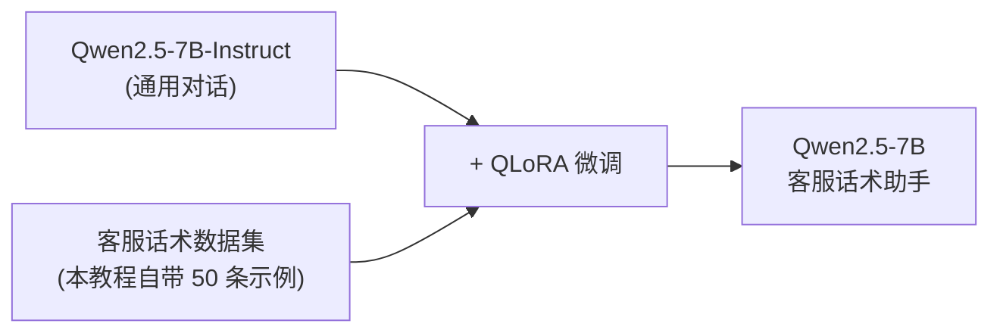
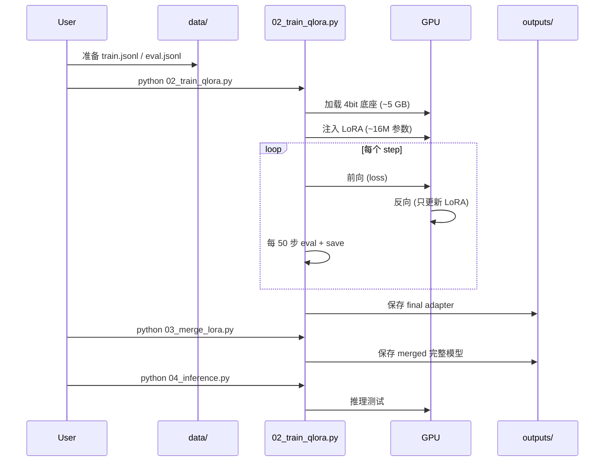

# 05 · 实战：用 QLoRA 微调 Qwen 做领域助手

> 本章是**整个教程的高潮**。我们把 01~04 的所有概念串起来，端到端跑一次 QLoRA 微调。
> 学完这一章，你就能在自己的数据上微调任何 Instruct 模型。

## 0. 任务目标

我们要做的事：



**输入**：50 条"原句 → 礼貌改写"的客服话术对。
**输出**：一个能用礼貌话术回答客户的领域助手。
**环境**：单卡 24GB（如 RTX 4090）。

## 1. 项目目录结构

先建立一个清晰的目录：

```
llm-finetune-demo/
├── README.md                  # 项目说明
├── requirements.txt           # 依赖
├── data/
│   ├── raw/
│   │   └── customer_service.jsonl     # 原始数据
│   └── processed/
│       ├── train.jsonl
│       └── eval.jsonl
├── scripts/
│   ├── 01_prepare_data.py     # 数据准备
│   ├── 02_train_qlora.py      # 训练
│   ├── 03_merge_lora.py       # 合并权重
│   └── 04_inference.py        # 推理测试
├── outputs/                   # 训练产物
│   ├── checkpoint-500/
│   ├── checkpoint-1000/
│   └── final/
└── logs/                      # 训练日志
```

## 2. 准备数据

### 2.1 原始数据

我们造一个小型客服场景数据集（`data/raw/customer_service.jsonl`），用 JSONL 格式，每行一条：

```jsonl
{"instruction": "把以下客户抱怨改写成客服回复", "input": "你们这破软件怎么这么难用！", "output": "非常抱歉给您带来了不好的体验，我们非常重视您的反馈。能否详细描述一下您遇到的问题？我们会尽快帮您解决。"}
{"instruction": "把以下客户抱怨改写成客服回复", "input": "退钱！", "output": "您好，收到您的退款请求了。我这边马上为您处理，请您稍等片刻，再次感谢您的理解与支持。"}
{"instruction": "把以下客户抱怨改写成客服回复", "input": "怎么这么慢啊，等半天了。", "output": "非常抱歉让您久等了，系统近期访问量较大，导致响应延迟。我们正在紧急处理，请您再耐心等待一下好吗？"}
{"instruction": "把以下客户抱怨改写成客服回复", "input": "这个功能根本不是我想要的。", "output": "非常抱歉没能满足您的需求。能否告诉我们您具体想要实现什么效果呢？我们可以为您推荐更合适的方案。"}
{"instruction": "把以下客户抱怨改写成客服回复", "input": "客服不解决实际问题！", "output": "非常抱歉给您带来困扰，我们会认真复盘本次服务，确保后续为您提供更专业、更有效的帮助。"}
```

💡 **注意**：这只是**示例数据**。真实项目你需要几十到几千条高质量数据。03 章讲了如何准备。

### 2.2 数据准备脚本

`scripts/01_prepare_data.py`：

```python {1-3,15-20,32-38}
"""把 Alpaca 格式转成 Messages 格式 + 划分 train/eval"""
import json
import re
from pathlib import Path


def alpaca_to_messages(ex):
    user = ex["instruction"].strip()
    if ex.get("input", "").strip():
        user += "\n\n" + ex["input"].strip()
    return {"messages": [
        {"role": "user",      "content": user},
        {"role": "assistant", "content": ex["output"].strip()},
    ]}


def dedupe(data):
    seen, out = set(), []
    for ex in data:
        k = (ex["instruction"], ex["output"])
        if k in seen: continue
        seen.add(k); out.append(ex)
    return out


def clean(ex):
    """简单清洗"""
    inst = re.sub(r"\s+", " ", ex.get("instruction", "")).strip()
    inp  = re.sub(r"\s+", " ", ex.get("input",      "")).strip()
    out  = re.sub(r"\s+", " ", ex.get("output",     "")).strip()
    # 长度过滤
    if len(inst) + len(inp) + len(out) < 10:
        return None
    return {"instruction": inst, "input": inp, "output": out}


def main():
    raw_path = Path("data/raw/customer_service.jsonl")
    out_dir  = Path("data/processed")
    out_dir.mkdir(parents=True, exist_ok=True)

    raw = [json.loads(l) for l in raw_path.read_text().splitlines() if l.strip()]
    print(f"原始数据 {len(raw)} 条")

    cleaned = [clean(ex) for ex in raw]
    cleaned = [ex for ex in cleaned if ex]
    cleaned = dedupe(cleaned)
    print(f"清洗去重后 {len(cleaned)} 条")

    # 转成 messages
    msgs = [alpaca_to_messages(ex) for ex in cleaned]

    # 划分（这里用 50 条数据，全部进 train；eval 用训练集的几条构造）
    import random
    random.seed(42); random.shuffle(msgs)
    n_eval = max(5, len(msgs) // 10)
    eval_, train = msgs[:n_eval], msgs[n_eval:]
    print(f"Train {len(train)} / Eval {len(eval_)}")

    for path, data in [("train.jsonl", train), ("eval.jsonl", eval_)]:
        with (out_dir / path).open("w") as f:
            for ex in data:
                f.write(json.dumps(ex, ensure_ascii=False) + "\n")
        print(f"✓ 写出 {out_dir / path}")


if __name__ == "__main__":
    main()
```

跑一下：

```bash
python scripts/01_prepare_data.py
```

**你应该看到：**

```
原始数据 50 条
清洗去重后 50 条
Train 45 / Eval 5
✓ 写出 data/processed/train.jsonl
✓ 写出 data/processed/eval.jsonl
```

## 3. QLoRA 训练脚本

这是核心代码。`scripts/02_train_qlora.py`：

```python {1-10,40-55,75-95,110-130}
"""用 TRL 的 SFTTrainer + PEFT 的 LoRA + bitsandbytes 的 4bit 量化跑 QLoRA 微调"""
import argparse
import os
from pathlib import Path

import torch
from datasets import load_dataset
from peft import LoraConfig, get_peft_model, prepare_model_for_kbit_training
from transformers import (
    AutoModelForCausalLM,
    AutoTokenizer,
    BitsAndBytesConfig,
    TrainingArguments,
)
from trl import SFTConfig, SFTTrainer


# ---------------- 参数解析 ----------------
def parse_args():
    p = argparse.ArgumentParser()
    p.add_argument("--model_id",    default="Qwen/Qwen2.5-7B-Instruct")
    p.add_argument("--data_dir",    default="data/processed")
    p.add_argument("--output_dir",  default="outputs")
    p.add_argument("--max_seq_len", type=int, default=1024)
    p.add_argument("--epochs",      type=float, default=3.0)
    p.add_argument("--lr",          type=float, default=2e-4)
    p.add_argument("--batch_size",  type=int, default=2)
    p.add_argument("--grad_accum",  type=int, default=8)
    p.add_argument("--lora_r",      type=int, default=16)
    p.add_argument("--lora_alpha",  type=int, default=32)
    return p.parse_args()


# ---------------- 主函数 ----------------
def main():
    args = parse_args()
    print(f"=== QLoRA 微调：{args.model_id} ===")

    # 1. 加载 tokenizer
    tokenizer = AutoTokenizer.from_pretrained(args.model_id, trust_remote_code=True)
    if tokenizer.pad_token is None:
        tokenizer.pad_token = tokenizer.eos_token

    # 2. 4bit 量化配置（QLoRA 的核心）
    bnb_config = BitsAndBytesConfig(
        load_in_4bit=True,
        bnb_4bit_quant_type="nf4",              # 使用 NF4 数据类型
        bnb_4bit_compute_dtype=torch.bfloat16,  # 计算用 bf16
        bnb_4bit_use_double_quant=True,         # 双量化
    )

    # 3. 加载底座模型（4bit）
    print("加载模型...")
    model = AutoModelForCausalLM.from_pretrained(
        args.model_id,
        quantization_config=bnb_config,
        device_map="auto",
        torch_dtype=torch.bfloat16,
        trust_remote_code=True,
    )
    model.config.use_cache = False   # 训练时禁用 cache（gradient checkpointing 需要）

    # 4. 准备 k-bit 训练
    model = prepare_model_for_kbit_training(model)

    # 5. LoRA 配置
    lora_config = LoraConfig(
        r=args.lora_r,
        lora_alpha=args.lora_alpha,
        lora_dropout=0.05,
        bias="none",
        task_type="CAUSAL_LM",
        target_modules=[
            "q_proj", "k_proj", "v_proj", "o_proj",
            "gate_proj", "up_proj", "down_proj",
        ],
    )
    model = get_peft_model(model, lora_config)
    model.print_trainable_parameters()
    # 你应该看到：trainable params: ~16M || all params: ~7.6B || trainable%: 0.21%

    # 6. 加载数据集
    train_ds = load_dataset("json", data_files=f"{args.data_dir}/train.jsonl", split="train")
    eval_ds  = load_dataset("json", data_files=f"{args.data_dir}/eval.jsonl",  split="train")
    print(f"Train: {len(train_ds)}, Eval: {len(eval_ds)}")

    # 7. 训练配置（TRL 新版 SFTConfig）
    sft_config = SFTConfig(
        output_dir=args.output_dir,
        num_train_epochs=args.epochs,
        per_device_train_batch_size=args.batch_size,
        per_device_eval_batch_size=args.batch_size,
        gradient_accumulation_steps=args.grad_accum,
        learning_rate=args.lr,
        lr_scheduler_type="cosine",
        warmup_ratio=0.03,
        weight_decay=0.0,
        logging_steps=5,
        save_strategy="steps",
        save_steps=50,
        eval_strategy="steps",
        eval_steps=50,
        bf16=True,
        gradient_checkpointing=True,
        gradient_checkpointing_kwargs={"use_reentrant": False},
        max_length=args.max_seq_len,
        packing=False,                          # 短样本多时改 True 可提速
        dataset_num_proc=4,
        report_to="none",                       # 想用 wandb 改成 "wandb"
        seed=42,
    )

    # 8. 创建 Trainer
    trainer = SFTTrainer(
        model=model,
        args=sft_config,
        train_dataset=train_ds,
        eval_dataset=eval_ds,
        processing_class=tokenizer,
    )

    # 9. 开训
    print("\n开始训练...\n")
    trainer.train()

    # 10. 保存最终模型
    final_dir = Path(args.output_dir) / "final"
    trainer.save_model(str(final_dir))
    tokenizer.save_pretrained(str(final_dir))
    print(f"\n✓ 训练完成，模型保存在 {final_dir}")


if __name__ == "__main__":
    main()
```

## 4. 启动训练

```bash
# 单卡 24GB 配置（推荐）
python scripts/02_train_qlora.py \
  --model_id Qwen/Qwen2.5-7B-Instruct \
  --epochs 3 \
  --batch_size 2 \
  --grad_accum 8 \
  --lr 2e-4 \
  --lora_r 16 \
  --lora_alpha 32 \
  --max_seq_len 1024

# 12GB 显存配置
python scripts/02_train_qlora.py \
  --batch_size 1 \
  --grad_accum 16 \
  --max_seq_len 768
```

### 你应该看到什么

**启动阶段**：

```
=== QLoRA 微调：Qwen/Qwen2.5-7B-Instruct ===
加载模型...
trainable params: 16,384,000 || all params: 7,624,256,000 || trainable%: 0.2149%
Train: 45, Eval: 5

开始训练...

{'loss': 2.3140, 'grad_norm': 0.345, 'learning_rate': 0.0001, 'epoch': 0.27}
{'eval_loss': 1.8976, 'epoch': 0.27}
{'loss': 1.6321, 'grad_norm': 0.234, 'learning_rate': 0.00018, 'epoch': 0.55}
{'eval_loss': 1.2451, 'epoch': 0.55}
```

**收敛时**：

```
{'loss': 0.3456, 'eval_loss': 0.4123, 'epoch': 2.95}
{'train_runtime': 1820.4}
✓ 训练完成
```

💡 **关键观察**：

- `loss` 在前 100 步从 ~2.3 快速下降到 ~1.0 — 这正常
- `eval_loss` 略高于 `train_loss` — 也正常（模型在见过的数据上更好）
- 如果 `eval_loss` 先降后升 → **过拟合**，应早停或减 epoch

## 5. 训练过程详解

### 5.1 显存监控

训练时另开一个终端，跑：

```bash
nvidia-smi -l 1
```

你应该看到：

```
+-------------------------------------------------------------------------+
| NVIDIA-SMI 535.xx    Driver Version: 535.xx    CUDA Version: 12.1       |
|-------------------------------------------------------------------------+
| GPU  Name              Persistence-S  Bus-Id        Memory-Usage        |
| 0    NVIDIA GeForce RTX 4090     On          00000000:01:00.0     18.3GB / 24.0GB |
|        Processes: GPU Memory: 18.3 GB                                                 |
+-------------------------------------------------------------------------+
```

| 阶段 | 显存占用 |
|------|---------|
| 加载 4bit 底座 | ~5 GB |
| + 优化器 | ~7 GB |
| + 前向+反向激活 | ~12 GB |
| + 评估 | ~16 GB |
| **峰值** | **~18-22 GB** |

24GB 还有余量。如果 OOM，按下表调：

| 调参 | 显存变化 |
|------|---------|
| `batch_size` 2→1 | -3 GB |
| `max_seq_len` 1024→512 | -4 GB |
| 开 `gradient_checkpointing` | -2 GB (已开) |
| `lora_r` 16→8 | -0.1 GB |

## 6. 合并 LoRA 权重

训练产物是 LoRA adapter（很小，几 MB）。推理时有两个选择：

1. **动态加载**：`PeftModel.from_pretrained(base, adapter_path)` — 灵活
2. **合并到底座**：把 $W' = W + BA$ 算出来，存成完整模型 — 部署方便

`scripts/03_merge_lora.py`：

```python {1-5,18-25}
"""把 LoRA 合并到底座模型，导出可独立部署的模型"""
import argparse
import shutil
from pathlib import Path

import torch
from peft import PeftModel
from transformers import AutoModelForCausalLM, AutoTokenizer


def main():
    p = argparse.ArgumentParser()
    p.add_argument("--base_model",  required=True, help="底座模型路径或 HF model id")
    p.add_argument("--adapter_dir", required=True, help="LoRA adapter 目录")
    p.add_argument("--output_dir",  required=True, help="合并后输出目录")
    args = p.parse_args()

    print(f"底座: {args.base_model}")
    print(f"Adapter: {args.adapter_dir}")

    # 加载底座（fp16/bf16 即可，无需 4bit）
    base = AutoModelForCausalLM.from_pretrained(
        args.base_model,
        torch_dtype=torch.bfloat16,
        device_map="cpu",          # CPU 上合并更稳
    )
    tokenizer = AutoTokenizer.from_pretrained(args.base_model, trust_remote_code=True)

    # 加载 adapter 并合并
    model = PeftModel.from_pretrained(base, args.adapter_dir)
    merged = model.merge_and_unload()

    # 保存
    out = Path(args.output_dir)
    out.mkdir(parents=True, exist_ok=True)
    merged.save_pretrained(str(out), safe_serialization=True)
    tokenizer.save_pretrained(str(out))

    # 复制 chat template 相关配置（Qwen 通常在 tokenizer 里）
    print(f"✓ 合并完成，保存到 {out}")
    print(f"模型大小: {sum(f.stat().st_size for f in out.rglob('*.safetensors')) / 1e9:.2f} GB")


if __name__ == "__main__":
    main()
```

跑一下：

```bash
python scripts/03_merge_lora.py \
  --base_model  Qwen/Qwen2.5-7B-Instruct \
  --adapter_dir outputs/final \
  --output_dir  outputs/merged
```

**你应该看到：**

```
✓ 合并完成，保存到 outputs/merged
模型大小: 14.23 GB
```

## 7. 推理测试

`scripts/04_inference.py`：

```python {1-3,15-22,30-40}
"""加载合并后的模型，做推理测试"""
import argparse
from pathlib import Path

import torch
from transformers import AutoModelForCausalLM, AutoTokenizer


def main():
    p = argparse.ArgumentParser()
    p.add_argument("--model_dir", default="outputs/merged")
    args = p.parse_args()

    print(f"加载 {args.model_dir}...")
    tok = AutoTokenizer.from_pretrained(args.model_dir, trust_remote_code=True)
    model = AutoModelForCausalLM.from_pretrained(
        args.model_dir,
        torch_dtype=torch.bfloat16,
        device_map="auto",
    )
    model.eval()

    # 测试 prompt
    test_inputs = [
        "把以下客户抱怨改写成客服回复\n\n我等了半天了都不回复！",
        "把以下客户抱怨改写成客服回复\n\n这个产品质量太差了",
        "把以下客户抱怨改写成客服回复\n\n我要退款",
        "把以下客户抱怨改写成客服回复\n\n你们的系统太难用了",
    ]

    for user_msg in test_inputs:
        messages = [{"role": "user", "content": user_msg}]
        prompt = tok.apply_chat_template(messages, tokenize=False, add_generation_prompt=True)
        inputs = tok(prompt, return_tensors="pt").to(model.device)

        with torch.no_grad():
            out = model.generate(
                **inputs,
                max_new_tokens=200,
                temperature=0.7,
                do_sample=True,
                top_p=0.9,
                repetition_penalty=1.1,
            )
        reply = tok.decode(out[0][inputs.input_ids.size(1):], skip_special_tokens=True)
        print(f"\n--- Input ---\n{user_msg}")
        print(f"--- Output ---\n{reply}")
        print("-" * 60)


if __name__ == "__main__":
    main()
```

跑一下：

```bash
python scripts/04_inference.py
```

**你应该看到** 类似这样的礼貌客服回复：

```
--- Input ---
把以下客户抱怨改写成客服回复

我等了半天了都不回复！

--- Output ---
非常抱歉让您久等了，我们会尽快为您查询进度并给您一个满意的答复。再次感谢您的理解与支持！

------------------------------------------------------------

--- Input ---
把以下客户抱怨改写成客服回复

这个产品质量太差了

--- Output ---
非常抱歉给您带来了不愉快的体验，我们对产品质量有严格把控，麻烦您提供一下订单号和具体问题，我们为您安排退换货处理。

------------------------------------------------------------
```

## 8. 用 vLLM 加速推理（可选）

合并后的模型可以丢给 vLLM 做高性能推理（吞吐量提升 10~30 倍）：

```bash
pip install vllm
```

```python
from vllm import LLM, SamplingParams

llm = LLM(model="outputs/merged", dtype="bfloat16", gpu_memory_utilization=0.85)
params = SamplingParams(temperature=0.7, top_p=0.9, max_tokens=200)

prompts = ["把以下客户抱怨改写成客服回复\n\n我等了半天了都不回复！"]
outputs = llm.generate(prompts, params)
for o in outputs:
    print(o.outputs[0].text)
```

## 9. 完整目录与命令回顾

把整个流程跑一遍要执行的命令：

```bash
# 0. 安装依赖（用 conda/venv 创建干净环境）
pip install torch==2.3.0 --index-url https://download.pytorch.org/whl/cu121
pip install transformers==4.43.0 peft==0.11.0 trl==0.9.6 \
            bitsandbytes==0.43.0 accelerate==0.33.0 datasets==2.20.0

# 1. 准备数据
python scripts/01_prepare_data.py

# 2. 训练
python scripts/02_train_qlora.py --epochs 3

# 3. 合并 LoRA
python scripts/03_merge_lora.py \
  --base_model Qwen/Qwen2.5-7B-Instruct \
  --adapter_dir outputs/final \
  --output_dir outputs/merged

# 4. 推理
python scripts/04_inference.py --model_dir outputs/merged
```

## 10. 训练过程的 Mermaid 可视化

整个流程的时序：



## 11. 常见报错与解决

| 报错 | 原因 | 解决 |
|------|-----|------|
| `CUDA out of memory` | 显存不够 | 减 `batch_size`、`max_seq_len`；开 `gradient_checkpointing` |
| `KeyError: 'q_proj'` | target_modules 名字不对 | 打印模型，看实际线性层名字 |
| `RuntimeError: Expected all tensors to be on the same device` | device_map 没设好 | 加 `device_map="auto"` |
| `Tokenizer chat template not found` | 老模型没 chat_template | 手动 `tok.chat_template = "..."` 或换 Instruct 模型 |
| `Loss = NaN` | 学习率过大 / 数据有脏 | 降 LR 到 1e-4；检查数据 |
| 训练很慢 | packing=False | 长序列多时改 `packing=True` |
| `bitsandbytes` 装不上 | 没匹配的 wheel | `pip install bitsandbytes --no-cache` 或换 conda 安装 |

## 12. 你应该看到的训练日志（健康 vs 不健康）

### ✅ 健康

```
step  loss     eval_loss  grad_norm  lr
  50  1.892    1.756      0.234      1.8e-4
 100  1.234    1.123      0.198      1.6e-4
 150  0.876    0.923      0.167      1.4e-4
 200  0.654    0.798      0.145      1.2e-4
 250  0.523    0.712      0.134      9.0e-5
 300  0.412    0.687      0.128      6.0e-5
```

- loss 和 eval_loss 都在稳步下降
- eval_loss 略高于 train_loss（正常）
- grad_norm 缓慢下降（学习率 cosine 退火）

### ❌ 不健康（loss spike）

```
step  loss     eval_loss
 100  1.234    1.123
 150  0.876    0.923
 200  0.654    0.798
 250  NaN      0.687       ← 出问题了！
```

→ 降学习率（`--lr 1e-4`），加 warmup。

### ❌ 不健康（过拟合）

```
step  loss     eval_loss
 100  1.234    1.123
 150  0.876    0.923
 200  0.654    0.798
 250  0.312    0.687
 300  0.187    0.789      ← eval_loss 开始涨！
```

→ 早停（`--epochs 1`），或加数据，或减 `lora_r`。

## 13. 复盘 checklist

完成本章后，你应该能：

- [ ] 解释 `BitsAndBytesConfig` 每一项的含义
- [ ] 解释 `LoraConfig` 每一项的含义
- [ ] 解释 `SFTConfig` 的关键参数（lr、epochs、gradient_accumulation）
- [ ] 把训练时间从 30 分钟调到 5 分钟（通过 packing / batch_size / 数据子集）
- [ ] 独立完成：合并 LoRA → 推理测试 → 用 vLLM 部署

下一步：[06-训练评估与调参](06-训练评估与调参.md) — 让你的微调不只"训得动"，还要"训得好"。
