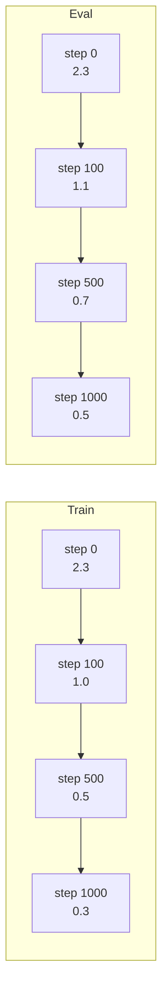
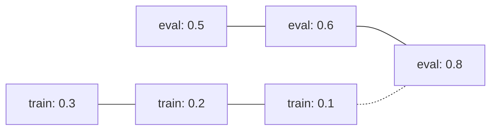
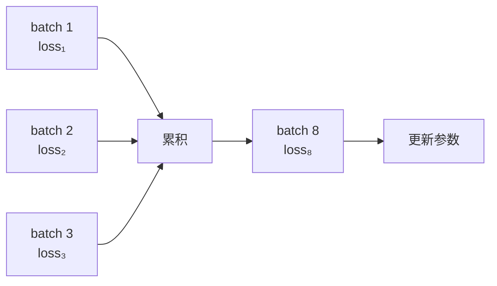

# 06 · 训练评估与调参：从"训得动"到"训得好"

> 上一章我们跑通了一次 QLoRA 微调。本章解决两个问题：
>
> 1. **怎么知道微调成功了**？（评估方法）
> 2. **怎么调得更好**？（超参调优）

## 1. Loss 曲线阅读指南

Loss 是微调过程的"心电图"。读懂它能告诉你模型在干什么。

### 1.1 健康的 Loss 曲线



特点：

- ✅ Loss 稳步下降
- ✅ Train loss < Eval loss（通常）
- ✅ 两者差距不大（< 0.3）
- ✅ 没有尖刺

### 1.2 过拟合



```
step   train_loss  eval_loss
 100   1.234       1.123
 500   0.456       0.687
1000   0.234       0.789   ← eval loss 上涨！
1500   0.123       0.891
```

**诊断**：eval_loss 在某点之后开始涨。

**对策**：

| 方法 | 适用 |
|------|------|
| 减 epoch | 最直接 |
| 增大 `lora_dropout` | 0.05 → 0.1 |
| 减小 `lora_r` | 16 → 8 |
| 加数据 | 永远是好方法 |
| 增 `weight_decay` | 0.0 → 0.01 |

### 1.3 欠拟合

```
step   train_loss  eval_loss
 100   2.123       2.089
 500   1.987       1.945
1000   1.876       1.832
```

**诊断**：train 和 eval loss 都高，且下降很慢。

**对策**：

| 方法 | 适用 |
|------|------|
| 增 epoch | 多训练 |
| 增 `lora_r` | 16 → 64 |
| 增学习率 | 2e-4 → 5e-4 |
| 检查数据 | 可能数据有错 |
| 换 base model | 可能底座选错了 |

### 1.4 Loss Spike

```
step   loss    grad_norm
 200   0.65   0.18
 250   8.42   ← 突然飙升！
 300   0.71   0.20
```

**诊断**：某一步 loss 突然飙到很大。

**常见原因**：

1. 数据里有脏样本（极端长度的文本、特殊字符）
2. 学习率过大
3. 梯度爆炸

**对策**：

- 加 `max_grad_norm=1.0`（梯度裁剪）
- 降学习率（`--lr 1e-4`）
- 检查数据里的"巨长样本"

在 `TrainingArguments` 里加：

```python
TrainingArguments(
    ...
    max_grad_norm=1.0,            # 梯度裁剪
    warmup_ratio=0.1,             # 加大 warmup
)
```

## 2. Loss 之外的评估指标

### 2.1 为什么单看 Loss 不够

Loss 是 token-level 的平均交叉熵。它衡量的是**模型对每个 token 的预测有多准**，但：

- 一个回答里 95% 的 token 是模板化的客套话，5% 是关键信息 → Loss 主要在衡量客套话学得像不像
- Loss 不能告诉你回答是否**有用、相关、安全**
- Loss 低 ≠ 回答好

所以需要**业务级评估**。

### 2.2 困惑度（Perplexity, PPL）

最常用的"无参考答案"评估指标：

$$
\text{PPL} = \exp\left(-\frac{1}{N}\sum_{i=1}^{N} \log P(t_i | t_{<i})\right)
$$

直觉：**模型在每个位置有多少"选择犹豫"**。PPL=10 表示平均每个位置相当于在 10 个等概率词中选。

```python
import math
loss = 0.5            # cross_entropy
ppl  = math.exp(loss) # ≈ 1.65
```

**评估方法**：在 eval 集上算 PPL，越低越好。

```python
from datasets import load_dataset
import torch, math
from transformers import AutoModelForCausalLM, AutoTokenizer

model.eval()
eval_ds = load_dataset("json", data_files="data/processed/eval.jsonl", split="train")
tok = AutoTokenizer.from_pretrained("outputs/merged")

total_loss, total_tokens = 0, 0
for ex in eval_ds:
    text = tok.apply_chat_template(ex["messages"], tokenize=False)
    ids = tok.encode(text, return_tensors="pt").to(model.device)
    with torch.no_grad():
        out = model(ids, labels=ids)
    total_loss   += out.loss.item() * ids.size(1)
    total_tokens += ids.size(1)

ppl = math.exp(total_loss / total_tokens)
print(f"Eval PPL: {ppl:.2f}")   # ← 越低越好
```

### 2.3 BLEU / ROUGE（传统 NLP 指标）

⚠️ **警告**：在 LLM 时代这两个指标**争议很大**。

| 指标 | 衡量 | 局限 |
|------|-----|------|
| BLEU | n-gram 重叠率 | 同一个意思换种说法 BLEU 很低 |
| ROUGE-L | 最长公共子序列 | 同上 |
| BERTScore | 语义相似度 | 更鲁棒但仍然不完美 |

**什么时候有用**：翻译、摘要、严格的格式复现。
**什么时候不灵**：开放式生成、多答案合理。

```python
# 用 sacrebleu 算 BLEU
from sacrebleu import corpus_bleu
hypotheses = ["您好，请问有什么可以帮您？"]
references = [["您好，很高兴为您服务。请问有什么需要？"]]
score = corpus_bleu(hypotheses, references)
print(f"BLEU: {score.score:.2f}")   # 通常 0-40 都算正常
```

### 2.4 LLM-as-a-Judge（用 GPT-4 当评委）

2024 年起最主流的"高级"评估方法——**让一个更强的模型给微调模型的输出打分**：

```python
import openai

JUDGE_PROMPT = """你是严格的评审，对比【参考答案】和【模型回答】。
给出 1-5 分（5 分最好）和简短理由。

【参考答案】
{reference}

【模型回答】
{prediction}

按以下格式输出：
分数: <1-5>
理由: <一句话>"""


def judge(reference, prediction):
    resp = openai.chat.completions.create(
        model="gpt-4o",
        messages=[{"role": "user", "content": JUDGE_PROMPT.format(
            reference=reference, prediction=prediction
        )}],
    )
    return resp.choices[0].message.content


# 在 eval 集上跑
for ex in eval_ds:
    pred = generate(model, ex["messages"][0]["content"])
    score_text = judge(ex["messages"][1]["content"], pred)
    print(f"Q: {ex['messages'][0]['content']}")
    print(f"Score: {score_text}\n")
```

**优势**：

- 接近人类判断
- 可以给开放式回答打分
- 成本低（每个样本几分钱）

**劣势**：

- 仍可能有偏见（位置偏见、长度偏见）
- 依赖一个外部"法官"

### 2.5 人工评估（黄金标准）

| 方法 | 适合 | 成本 |
|------|------|------|
| 单盲评分（评分人不知道哪个是微调后） | A/B 对比 | 高 |
| 双盲评分（评分人和被评模型都不知道分组） | 学术论文 | 极高 |
| 抽样对比 10 条 | 个人项目 | 低 |
| 真实用户反馈 | 上线后 | 中 |

💡 **建议**：开发阶段用 LLM-as-a-Judge，上线前做一轮人工评估。

## 3. 构建一个好的 Eval 集

Eval 集的质量决定了你对模型真实能力的判断。

### 3.1 Eval 集的设计原则

| 原则 | 解释 |
|------|------|
| **分布代表真实场景** | 长度、风格、难度都要像真实使用 |
| **覆盖各种 case** | 简单 / 中等 / 困难 / 边界情况 |
| **和 train 集不重叠** | 不能有任何 sample 泄露 |
| **至少 50 条** | 太少统计意义弱；太少方差大 |
| **持续更新** | 用户用出来的失败 case 要加进去 |

### 3.2 Eval 集的元信息标注

```json
{
  "id": "qa-0042",
  "messages": [...],
  "meta": {
    "category": "退款咨询",
    "difficulty": "中等",
    "expected_keywords": ["退款", "订单号", "工作日"],
    "max_score": 5,
    "reviewer": "zhaoxin"
  }
}
```

这样你评估时可以**分类统计**——比如"退款类问题得分多少"。

### 3.3 一个分类评估脚本

```python
import json
from collections import defaultdict

# 假设每个样本的预测、参考答案、类别已知
results = [
    {"category": "退款",   "score": 4, "ref": "...", "pred": "..."},
    {"category": "退款",   "score": 5, "ref": "...", "pred": "..."},
    {"category": "功能",   "score": 3, "ref": "...", "pred": "..."},
    {"category": "投诉",   "score": 2, "ref": "...", "pred": "..."},
]

by_cat = defaultdict(list)
for r in results:
    by_cat[r["category"]].append(r["score"])

print(f"{'类别':<10} {'样本数':<6} {'平均分':<6}")
for cat, scores in by_cat.items():
    print(f"{cat:<10} {len(scores):<6} {sum(scores)/len(scores):.2f}")
```

**你应该看到**：

```
类别         样本数   平均分
退款         2        4.50
功能         1        3.00
投诉         1        2.00
```

一眼看出"投诉类"是弱项。

## 4. 关键超参详解

### 4.1 学习率（最敏感）

| 模型规模 | LoRA 推荐 LR | QLoRA 推荐 LR |
|---------|------------|--------------|
| < 1B | 1e-3 ~ 5e-3 | 5e-4 ~ 2e-3 |
| 1~7B | 5e-4 ~ 2e-4 | 1e-4 ~ 5e-4 |
| 7~13B | 2e-4 ~ 5e-5 | 5e-5 ~ 2e-4 |
| > 13B | 5e-5 ~ 2e-5 | 2e-5 ~ 1e-4 |

📐 **直觉**：可训练参数越少（LoRA < Full FT），学习率要**越大**。LoRA 通常 1e-4 ~ 5e-4；Full FT 通常 1e-5 ~ 5e-5。

### 4.2 Epoch vs Step

- **Epoch**：完整遍历数据集的次数
- **Step**：一个 batch 的反向传播

| 数据量 | 推荐 Epoch | 说明 |
|-------|----------|------|
| < 100 条 | 5~10 | 小数据要反复学 |
| 100~1000 | 3~5 | 中等 |
| 1000~10000 | 2~3 | 标准 |
| > 10000 | 1~2 | 大数据一遍就够 |

💡 **经验**：宁可训 3 个 epoch + early stop，也不要硬训 10 个 epoch 让模型过拟合。

### 4.3 Batch Size 与梯度累积

显存不够时，**梯度累积**（gradient accumulation）能模拟大 batch：

```python
# 实际 batch = per_device_train_batch_size * gradient_accumulation_steps
per_device_train_batch_size = 2      # 一次吃 2 条
gradient_accumulation_steps = 8      # 累积 8 次再更新
# 等效 batch size = 16
```



**等效 batch size** 对训练稳定性影响很大：

- 太小：loss 震荡，训练不稳定
- 太大：泛化可能变差（Large Batch Optimization 的经典问题）

推荐：**等效 batch size = 16~64** 之间调。

### 4.4 LoRA Rank 选择

| Rank | 参数量 (7B) | 适用场景 |
|------|------------|---------|
| 4 | ~4M | 任务简单（风格学习） |
| 8 | ~8M | 默认起点 |
| 16 | ~16M | **最常用** |
| 32 | ~33M | 复杂任务 |
| 64 | ~65M | 接近全量 |
| 128 | ~130M | 几乎等价全量 |

**调参策略**：从 16 开始，如果欠拟合就加倍，过拟合就减半。

### 4.5 全部超参速查表

| 超参 | 起点 | 调参方向 |
|------|-----|---------|
| `learning_rate` | 2e-4 | loss 不降就增；loss spike 就降 |
| `num_train_epochs` | 3 | eval_loss 涨就减；欠拟合就增 |
| `per_device_train_batch_size` | 显存上限 | OOM 就减；用 grad_accum 补偿 |
| `gradient_accumulation_steps` | 等效 bs=16~64 | 训练震荡就增 |
| `lora_r` | 16 | 欠拟合增，过拟合减 |
| `lora_alpha` | 2*r | 保持 2:1 比例即可 |
| `lora_dropout` | 0.05 | 过拟合增 |
| `warmup_ratio` | 0.03 | loss spike 就增到 0.1 |
| `weight_decay` | 0.0 | 一般不开；过拟合时 0.01 |
| `max_grad_norm` | 1.0 | 防止梯度爆炸 |
| `max_seq_len` | 数据 P95 | 显存不够就降到 P90 |

## 5. 训练加速技巧

### 5.1 Packing

把多条短样本拼成一条长序列，减少 padding 浪费：

```python
SFTConfig(
    packing=True,
    max_length=2048,
)
```

⚠️ 注意：packing 后**不同样本的 loss 会混在一起**。trl 0.9+ 的实现已经处理好（按 attention mask 隔离），可以放心用。

### 5.2 Flash Attention 2

```bash
pip install flash-attn --no-build-isolation
```

```python
model = AutoModelForCausalLM.from_pretrained(
    ...,
    attn_implementation="flash_attention_2",
)
```

加速 30~50%，显存省 20%。

### 5.3 数据预处理缓存

第一次 tokenize 后保存到磁盘，下次直接 load：

```python
from datasets import load_from_disk

tokenized = train_ds.map(tokenize_fn, batched=True, remove_columns=train_ds.column_names, num_proc=4)
tokenized.save_to_disk("data/tokenized_train")
# 下次：
# tokenized = load_from_disk("data/tokenized_train")
```

### 5.4 优化器选择

| 优化器 | 显存 | 速度 | 收敛 |
|-------|-----|------|------|
| AdamW | 高 | 中 | 稳定 |
| Adafactor | 中 | 中 | 略差 |
| 8-bit AdamW | 低 | 中 | 接近 AdamW |
| Lomo | 极低 | 慢 | 实验性 |

推荐：显存紧时用 `8-bit AdamW`（`bitsandbytes` 提供）：

```python
import bitsandbytes as bnb
optimizer = bnb.optim.PagedAdamW8bit(model.parameters(), lr=2e-4)
```

## 6. 常见训练问题诊断表

| 症状 | 可能原因 | 排查方法 |
|------|---------|---------|
| Loss 不下降 | 学习率太低 / 数据有问题 | 增 LR；打印数据样本 |
| Loss = NaN | 脏数据 / LR 太大 | 降 LR；检查 max value |
| Eval loss 一直涨 | 过拟合 | 早停、加 dropout、减 r |
| 显存 OOM | batch/seq 太大 | 减 bs / seq；开 gradient_checkpointing |
| 训练慢 | packing 未开 / 没用 flash attn | 开 packing + flash_attn |
| 推理输出乱码 | chat template 不对 | 检查 `apply_chat_template` |
| 微调后变笨 | 灾难性遗忘 | 降 LR；混一些通用数据 |
| 学不到任务 | 数据太相似 | 加数据多样性；增 r |
| 推理有 hallucination | 数据噪声大 | 清洗数据 |

## 7. 训练监控：Weights & Biases 集成

把训练可视化，方便远程监控：

```bash
pip install wandb
wandb login
```

```python
SFTConfig(
    ...
    report_to="wandb",
    run_name="qwen2.5-7b-customer-service-v1",
)
```

W&B 会自动记录 loss、grad_norm、learning_rate 等。

## 8. 一个完整的调参实验记录模板

```markdown
# 实验记录：customer-service-v3

## 配置
- base: Qwen2.5-7B-Instruct
- lora_r: 16, lora_alpha: 32
- lr: 2e-4
- epoch: 3
- batch: 2 * 8 (grad accum) = 16
- 数据: 500 条客服话术

## 结果
| Metric | 值 |
|--------|---|
| Train Loss | 0.34 |
| Eval Loss | 0.52 |
| Eval PPL | 1.68 |
| LLM-as-Judge 平均分 | 4.2/5 |

## 对比
- v1 (lr=5e-4): 训练崩塌 (loss spike at step 200)
- v2 (lr=1e-4, r=8): 欠拟合 (eval loss 0.78)
- v3 (lr=2e-4, r=16): ✅ 当前最佳

## 下一步尝试
- v4: r=32，看能否再涨 0.2 分
- 加 100 条长对话样本
```

**永远保留实验记录**。否则你下周就忘了上周为什么这么调。

## 9. 小结

| 主题 | 关键点 |
|------|-------|
| Loss 阅读 | 健康 / 过拟合 / 欠拟合 / spike 四种模式 |
| 评估 | PPL 是底线；LLM-as-Judge 是趋势；人工是黄金标准 |
| 超参 | LR 最敏感；r 从 16 开始；epoch 宁少勿多 |
| 加速 | packing + flash_attn + 8bit optimizer |
| 实验管理 | 每次实验都要记录 |

下一步：[07-进阶与工程实践](07-进阶与工程实践.md) — DPO、多卡、部署。
