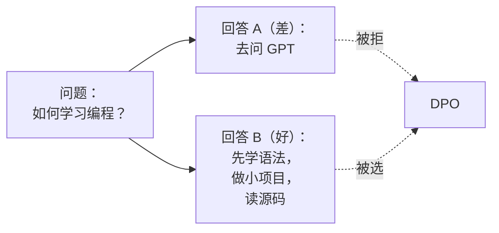
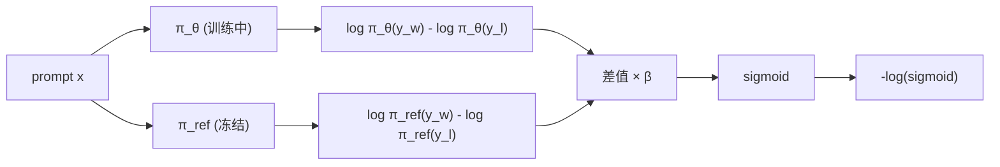
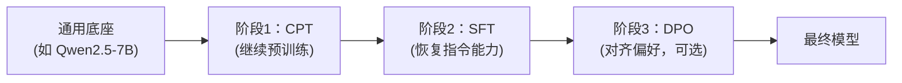
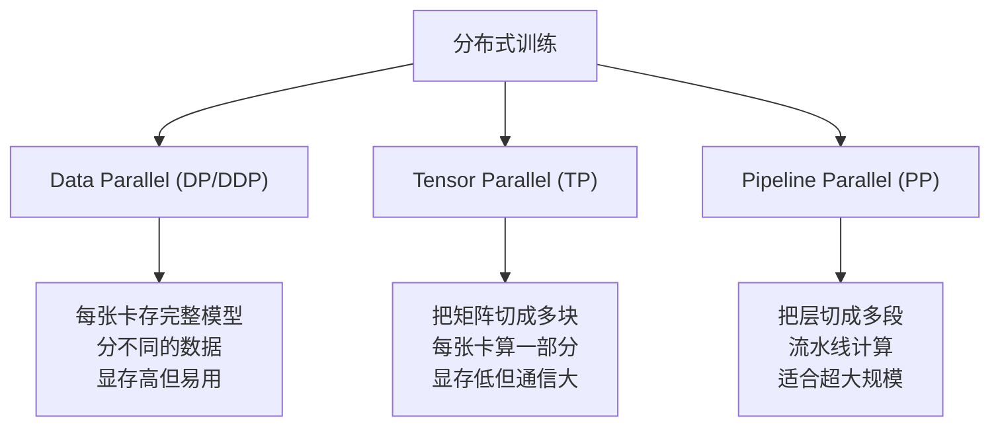
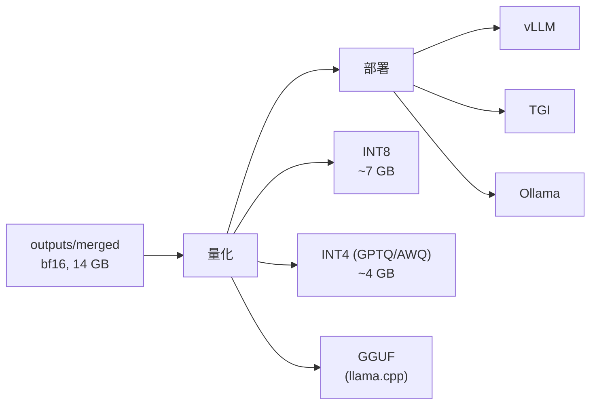
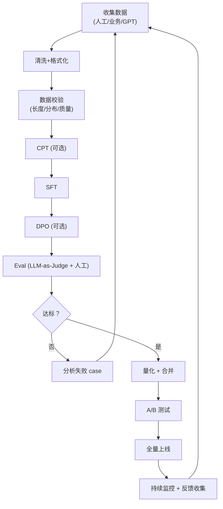
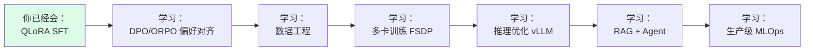

# 07 · 进阶与工程实践：从单卡到生产部署

> 本章覆盖你"训出一个能用的模型"之后的下一步：
> 偏好对齐（DPO/ORPO）、多卡训练（FSDP/DeepSpeed）、量化部署、常见工程坑。

## 1. 偏好对齐：从 SFT 到 DPO

### 1.1 为什么需要偏好对齐

SFT 教会模型"按指令回答"，但**回答有多种合理方式**。SFT 只能学一种（你标注的那个）。偏好对齐让模型理解"哪种更好"。



### 1.2 数据格式

DPO 用 `(prompt, chosen, rejected)` 三元组：

```jsonl
{"prompt": "如何学习编程？", "chosen": "建议先学 Python 基础语法，然后做小项目...", "rejected": "去问 GPT 就行了。"}
{"prompt": "如何学英语？", "chosen": "每天坚持听写 30 分钟...", "rejected": "学英语没用。"}
```

### 1.3 DPO 数学原理

📐 **DPO Loss**

给定 prompt $x$、chosen $y_w$、rejected $y_l$，DPO 直接优化一个二分类 loss：

$$
\mathcal{L}_{\text{DPO}} = -\log\sigma\!\left(\beta \log\frac{\pi_\theta(y_w|x)}{\pi_{\text{ref}}(y_w|x)} - \beta \log\frac{\pi_\theta(y_l|x)}{\pi_{\text{ref}}(y_l|x)}\right)
$$

其中：

- $\pi_\theta$：正在训练的模型
- $\pi_{\text{ref}}$：参考模型（一般就是 SFT 后的模型，冻结）
- $\beta$：温度参数（通常 0.1）
- $\sigma$：sigmoid

**直觉**：让 chosen 的概率**比** rejected 高得**越多**越好，同时不能让模型偏离参考模型太远。



### 1.4 用 TRL 跑 DPO

```python
from trl import DPOTrainer, DPOConfig
from datasets import load_dataset
from peft import LoraConfig
from transformers import AutoModelForCausalLM, AutoTokenizer

model_id = "outputs/merged"   # SFT 后的模型
tok = AutoTokenizer.from_pretrained(model_id)
model = AutoModelForCausalLM.from_pretrained(model_id, torch_dtype=torch.bfloat16, device_map="auto")

# DPO 也支持 LoRA（推荐）
lora_config = LoraConfig(
    r=16, lora_alpha=32,
    target_modules=["q_proj", "k_proj", "v_proj", "o_proj"],
    lora_dropout=0.05, bias="none", task_type="CAUSAL_LM",
)

dpo_config = DPOConfig(
    output_dir="outputs/dpo",
    num_train_epochs=2,
    per_device_train_batch_size=2,
    gradient_accumulation_steps=4,
    learning_rate=5e-5,            # DPO 的 LR 比 SFT 低
    beta=0.1,                       # 温度
    logging_steps=10,
    save_strategy="epoch",
    bf16=True,
)

train_ds = load_dataset("json", data_files="data/preference.jsonl", split="train")
trainer = DPOTrainer(
    model=model,
    ref_model=None,    # None 表示用 peft adapter 自动 disable 得到 ref model
    args=dpo_config,
    train_dataset=train_ds,
    processing_class=tok,
    peft_config=lora_config,
)
trainer.train()
```

### 1.5 ORPO：SFT + DPO 合二为一

ORPO（2024）把 SFT 和 DPO 合并成一个 loss：

$$
\mathcal{L}_{\text{ORPO}} = \mathcal{L}_{\text{SFT}} + \lambda \cdot \mathcal{L}_{\text{odds}}
$$

```python
from trl import ORPOTrainer, ORPOConfig

orpo_config = ORPOConfig(
    output_dir="outputs/orpo",
    num_train_epochs=3,
    per_device_train_batch_size=2,
    learning_rate=1e-4,
    beta=0.1,                       # ORPO 里的 odds ratio 系数
    ...
)

trainer = ORPOTrainer(
    model=model,
    args=orpo_config,
    train_dataset=train_ds,
    processing_class=tok,
)
```

**优势**：只用 1 个模型（不需要 ref_model），显存省一半。

### 1.6 三种对齐方法对比

| 方法 | 模型数 | 显存 (7B) | 数据 | 训练成本 |
|------|-------|----------|------|---------|
| PPO | 4 | ~80 GB | 偏好 | 高 |
| DPO | 2 | ~30 GB | 偏好 | 中 |
| **ORPO** | **1** | **~16 GB** | **偏好** | **低** |

## 2. 继续预训练（CPT）

### 2.1 什么时候需要

- 你有大量领域文档（论文、专利、内部 Wiki）
- 想让模型"通读"这些文档

### 2.2 数据格式

纯文本流，不需要 (指令, 回答) 对：

```jsonl
{"text": "根据中华人民共和国宪法第一条..."}
{"text": "深度学习是机器学习的一个分支..."}
```

### 2.3 CPT 的坑

⚠️ **灾难性遗忘**：CPT 会冲淡模型的指令遵循能力。

**推荐配方**：



```python
# CPT 阶段：和 SFT 几乎一样，只是用 causal LM loss，文本全程参与 loss
SFTConfig(
    ...,
    dataset_text_field="text",   # 注意不是 messages
    max_length=2048,
    packing=True,                # CPT 一般开 packing
)
```

## 3. 多卡训练

### 3.1 三种并行方式



### 3.2 推荐：FSDP（Fully Sharded Data Parallel）

PyTorch 原生的 FSDP 把模型参数、梯度、优化器状态都切分到各卡：

```bash
# 单机多卡
torchrun --nproc_per_node=4 scripts/02_train_qlora.py

# 多机多卡
torchrun --nproc_per_node=8 --nnodes=2 --node_rank=0 \
         --master_addr=master --master_port=29500 \
         scripts/02_train_qlora.py
```

```python
# 在训练脚本里启用 FSDP
from transformers import TrainingArguments

TrainingArguments(
    ...,
    fsdp="full_shard auto_wrap",          # 关键
    fsdp_transformer_layer_cls_to_wrap="Qwen2DecoderLayer",  # 包哪一层
)
```

### 3.3 DeepSpeed ZeRO

微软的 DeepSpeed 提供类似的切分：

```python
TrainingArguments(
    ...,
    deepspeed="ds_config_zero3.json",
)
```

`ds_config_zero3.json`：

```json
{
  "train_batch_size": 32,
  "zero_optimization": {
    "stage": 3,
    "offload_optimizer": { "device": "cpu" },
    "offload_param": { "device": "cpu" }
  },
  "bf16": { "enabled": true }
}
```

### 3.4 FSDP vs DeepSpeed 对比

| 特性 | FSDP | DeepSpeed ZeRO |
|------|------|---------------|
| 集成度 | PyTorch 原生 | 需要额外安装 |
| 速度 | 通常略快 | 高度优化 |
| 易用性 | 配置简单 | 配置灵活但复杂 |
| 生态 | Hugging Face 优先支持 | Microsoft 生态 |
| 推荐 | ✅ 个人/小团队 | 企业级 |

## 4. 模型量化与部署

### 4.1 训练完 → 部署的流程



### 4.2 用 bitsandbytes 量化（简单但慢）

```python
from transformers import AutoModelForCausalLM, BitsAndBytesConfig

bnb_config = BitsAndBytesConfig(load_in_4bit=True, bnb_4bit_quant_type="nf4")
model = AutoModelForCausalLM.from_pretrained("outputs/merged", quantization_config=bnb_config)
```

### 4.3 用 GPTQ 量化（推荐生产）

```bash
pip install auto-gptq optimum
```

```python
from auto_gptq import AutoGPTQForCausalLM
from transformers import AutoTokenizer

model = AutoGPTQForCausalLM.from_pretrained("outputs/merged", quantize_config)
tok = AutoTokenizer.from_pretrained("outputs/merged")

# 准备校准数据（用来估算量化参数）
calib_data = [ex["text"] for ex in load_dataset("wikitext", "wikitext-2-raw-v1", split="train").select(range(128))]

# 量化
model.quantize(calib_data, batch_size=4)
model.save_quantized("outputs/gptq_int4")
```

### 4.4 用 AWQ 量化（更小但更准）

```bash
pip install autoawq
```

```python
from awq import AutoAWQForCausalLM
model = AutoAWQForCausalLM.from_pretrained("outputs/merged")
quant_config = {"w_bit": 4, "q_group_size": 128}
model.quantize(tokenizer, quant_config=quant_config, calib_data=calib_data)
model.save_quantized("outputs/awq_int4")
```

### 4.5 GGUF 格式（llama.cpp / Ollama）

想在 Mac/树莓派/CPU 上跑？转 GGUF：

```bash
# 安装 llama.cpp
git clone https://github.com/ggerganov/llama.cpp
cd llama.cpp && make

# 转换
python convert_hf_to_gguf.py ../outputs/merged --outfile ../outputs/qwen-customer.gguf --outtype q4_k_m
```

然后用 Ollama 一行启动：

```bash
ollama create qwen-customer -f Modelfile
ollama run qwen-customer
```

### 4.6 vLLM 部署

```bash
pip install vllm
```

```python
from vllm import LLM, SamplingParams

llm = LLM(
    model="outputs/merged",
    dtype="bfloat16",
    gpu_memory_utilization=0.85,
    max_model_len=4096,
)

sampling = SamplingParams(temperature=0.7, top_p=0.9, max_tokens=512)

# 批量推理
prompts = ["用户问题1", "用户问题2", ...]
outputs = llm.generate(prompts, sampling)

# 起 OpenAI 兼容的 server
# vllm serve outputs/merged --port 8000
```

## 5. 工程实践 Checklist

部署前的工程清单：

- [ ] 模型格式正确（safetensors 而不是 bin）
- [ ] tokenizer 和模型能独立加载
- [ ] chat template 写在 tokenizer_config.json 里
- [ ] README 里写清楚 base model 和训练数据来源
- [ ] license 检查（Qwen 是 Apache 2.0；Llama 是 Llama3 Community License）
- [ ] 输出接 guardrail（检测 PII、敏感词）
- [ ] rate limiting（防止被刷）
- [ ] 监控（latency、token 消耗、异常率）
- [ ] A/B 测试框架

## 6. 常见工程坑

### 6.1 推理输出乱码 / 多余的 `<|im_end|>`

**原因**：generation 没正确处理 EOS token。

```python
out = model.generate(
    **inputs,
    max_new_tokens=512,
    eos_token_id=tok.eos_token_id,         # ← 关键
    pad_token_id=tok.pad_token_id,
)
```

### 6.2 中间出现 `<|im_start|>` 字符

**原因**：模型没学到正确停止。

**解决**：

- 检查 SFT 数据 assistant 的最后是不是有 EOS token
- 用 `apply_chat_template` 时确认 `add_generation_prompt=True`

### 6.3 显存随着推理释放不掉

```python
del model
torch.cuda.empty_cache()
```

### 6.4 QLoRA 训练后合并报错

```python
# 加载时别用 4bit
base = AutoModelForCausalLM.from_pretrained(
    args.base_model,
    torch_dtype=torch.bfloat16,
    device_map="cpu",         # ← CPU 上合并
)
```

### 6.5 大数据集加载慢

```python
# 用 Arrow 格式 + mmap
dataset = load_dataset("parquet", data_files="data/train.parquet", split="train")
```

### 6.6 LoRA 在多轮对话里"遗忘"前面的内容

**原因**：训练数据全是单轮。

**解决**：训练数据加多轮对话样本；或用更大的 `lora_r`。

### 6.7 模型越狱 / 输出违规内容

- 训练数据里加一些"应该拒绝"的样本
- 推理层加 moderation（如 OpenAI Moderation API）
- 用 RLHF/DPO 强化安全拒绝能力

## 7. 训练到上线的工作流



## 8. 推荐的下一步学习路径



### 推荐资源

| 主题 | 资源 |
|------|------|
| DPO 论文 | <https://arxiv.org/abs/2305.18290> |
| ORPO 论文 | <https://arxiv.org/abs/2403.07691> |
| FSDP 文档 | <https://pytorch.org/docs/stable/fsdp.html> |
| vLLM 文档 | <https://docs.vllm.ai/> |
| 生产 LLM | <https://huggingface.co/docs/text-generation-inference> |
| OpenAI Evals | <https://github.com/openai/evals> |

### 推荐数据集来源

| 平台 | URL |
|------|-----|
| HuggingFace Hub | <https://huggingface.co/datasets> |
| 魔搭社区 | <https://modelscope.cn/datasets> |
| 启智社区 | <https://opencsg.com/datasets> |

## 9. 小结

| 主题 | 关键 |
|------|------|
| 对齐方法 | DPO 主流；ORPO 更省；PPO 复杂 |
| 多卡 | FSDP 简单；DeepSpeed ZeRO-3 灵活 |
| 量化 | GPTQ/AWQ 生产；GGUF 端侧；bnb 临时 |
| 部署 | vLLM 高吞吐；Ollama 简单；TGI HuggingFace 官方 |
| 工程 | 训练→评估→量化→A/B→监控→迭代 |

到这里，本教程的核心内容就结束了。你已经具备：

- ✅ **判断**该用 prompt / RAG / 微调
- ✅ **独立完成** QLoRA 微调
- ✅ **诊断** 训练中的常见问题
- ✅ **量化部署** 你的微调模型
- ✅ **知道** DPO/ORPO/FSDP 等下一步

回到 [00-导读与学习路线](00-导读与学习路线.md) 看看你学到了什么。

---

## 附录：常用 Cheat Sheet

### 训练命令

```bash
# 单卡 QLoRA
python scripts/02_train_qlora.py --epochs 3 --lr 2e-4

# 多卡 FSDP
torchrun --nproc_per_node=4 scripts/02_train_qlora.py
```

### 合并命令

```bash
python scripts/03_merge_lora.py \
  --base_model Qwen/Qwen2.5-7B-Instruct \
  --adapter_dir outputs/final \
  --output_dir outputs/merged
```

### 推理命令

```bash
# Transformers
python scripts/04_inference.py

# vLLM server
vllm serve outputs/merged --port 8000

# Ollama
ollama create qwen-customer -f Modelfile
ollama run qwen-customer
```

### 调试技巧

```bash
# 显存监控
watch -n 1 nvidia-smi

# Loss 监控
tensorboard --logdir outputs/runs

# 单步调试（确认数据正确）
python -c "from datasets import load_dataset; ds = load_dataset('json', data_files='data/train.jsonl'); print(ds['train'][0])"
```

祝训练顺利 🚀
