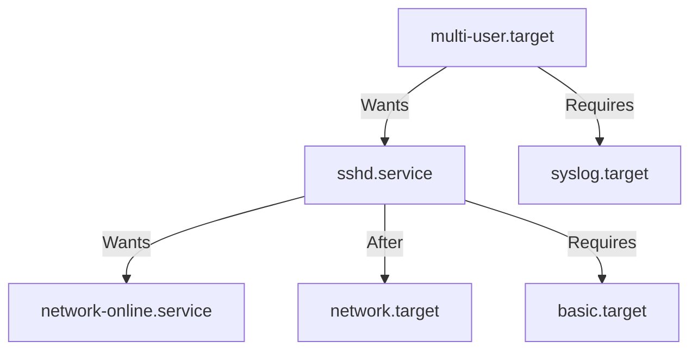
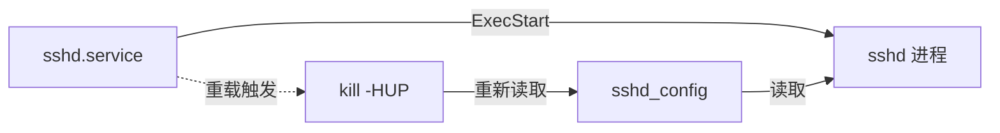
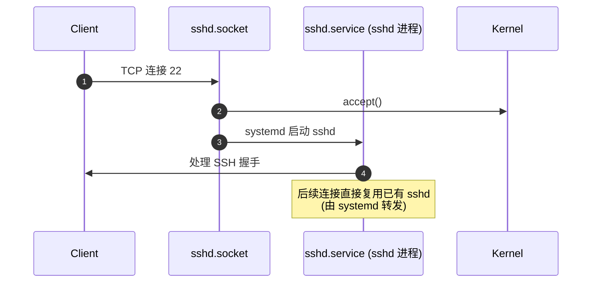
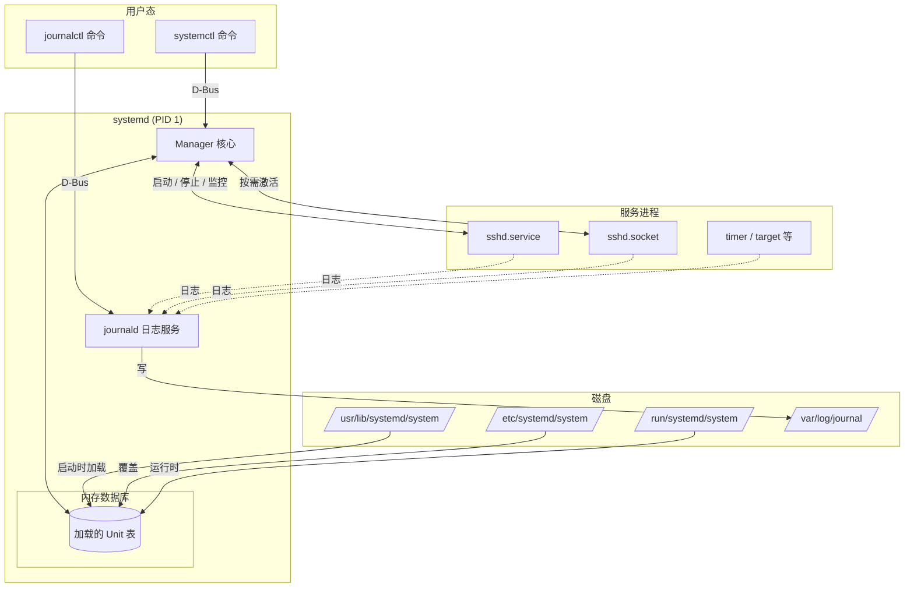

# Linux systemctl 原理、配置与操作实战 —— 以 sshd 为例

> 本文从 systemd 的整体架构出发，讲清楚 `systemctl` 命令背后的事件链，并以 `sshd.service` 为线索，串起「查看 → 修改配置 → 启停服务 → 开机自启 → 排障」的完整实操。适合第一次接触 systemd 的运维/后端工程师。

## 一、systemd 是什么，为什么要用 systemctl

### 1.1 从 SysV 到 systemd

在 systemd 出现之前，Linux 主要用 **SysVinit**（/etc/init.d/ 脚本）和 **Upstart** 来管理服务。它们有几个共同痛点：

- **串行启动**：服务一个接一个启动，机器越久越慢。
- **脚本碎片**：每个服务一个 shell 脚本，风格各异、难维护。
- **依赖靠手工**：要写一堆 `chkconfig` / `update-rc.d` 维护开机顺序。
- **进程孤儿无追踪**：守护进程 fork 之后，PID 关系就丢了。

**systemd** 是 Linux 系统和服务管理器，由 Lennart Poettering 主导（2010 年起），目前已经是几乎所有主流发行版（Ubuntu 16.04+、Debian 8+、CentOS 7+、RHEL 7+、Arch、Fedora）的默认 init。它的核心特性：

| 特性          | 解决的问题                              |
| ------------- | --------------------------------------- |
| 按需启动      | 桌面不启动就不加载蓝牙、打印等服务      |
| 并行启动      | 用 socket / D-Bus 激活，依赖自动解析    |
| 统一配置      | 全部服务用 `.service` / `.target` 描述  |
| cgroup 追踪   | 进程都在 systemd 视野内，PID 1 是真老大 |
| 日志统一      | `journalctl` 集中存放内核与服务日志      |

### 1.2 systemctl 的角色

systemd 由三个核心组件组成：

```mermaid
flowchart LR
    User[用户 / 管理员] -->|systemctl / journalctl| Systemd[systemd (PID 1)]
    Systemd -->|加载 & 管理| Units[Unit 文件集合]
    Systemd -->|fork / cgroup| Procs[所有用户态进程]
    Systemd -->|写入| Journal[journald 二进制日志]
    Procs -.->|日志| Journal
    Units -.->|触发| Journal
```

- **systemd**：`/sbin/init`（PID 1），总管一切。
- **systemctl**：用户面命令，**不直接** 操作进程，而是通过 D-Bus 协议把请求发给 PID 1。
- **journald**：日志守护进程，配合 `journalctl` 使用。

> 一句话总结：**systemctl 是 systemd 的 CLI 前端，所有「启停服务、改开机自启」的操作，本质都是「修改 unit 文件 + 让 systemd 重新加载 + 触发激活事件」**。

## 二、核心概念：Unit、Target、依赖

在动手敲命令之前，必须先理解三个概念，否则看 systemd 文档会懵。

### 2.1 Unit —— 一切资源的抽象

Unit 是 systemd 管理的对象，每个 Unit 对应一个配置文件，类型用后缀区分：

| 后缀           | 含义              | 示例                         |
| -------------- | ----------------- | ---------------------------- |
| `.service`     | 系统服务          | `sshd.service`               |
| `.socket`      | 套接字（按需激活） | `sshd.socket`                |
| `.target`      | 一组 Unit 的合集   | `multi-user.target`          |
| `.timer`       | 定时任务（替代 cron）| `apt-daily.timer`          |
| `.mount`       | 挂载点            | `home.mount`                 |
| `.path`        | 文件/目录监视     | `-.path`                      |

> **sshd 同时存在 `sshd.service` 和 `sshd.socket` 两种 unit**——这是 systemd 的「socket 激活」机制，下文会展开。

### 2.2 Target ——「运行级别」的现代等价物

SysV 有 `runlevel 0~6`，systemd 用 **target** 替代。target 本身不做事，只是把一组 unit 打包。常见 target：

| Target                | 用途                                | 对应旧 runlevel |
| --------------------- | ----------------------------------- | --------------- |
| `poweroff.target`     | 关机                                | 0               |
| `rescue.target`       | 单用户救援模式                      | 1               |
| `multi-user.target`   | 多用户命令行（**服务器最常用**）    | 3               |
| `graphical.target`    | 多用户 + 图形界面                   | 5               |
| `reboot.target`       | 重启                                | 6               |

可以用下面这条命令直接看到「当前系统默认进入哪个 target」：

```bash
systemctl get-default
# graphical.target   # 桌面机
# multi-user.target  # 服务器
```

### 2.3 依赖关系

systemd 启动服务的顺序不是手写的，而是**声明式依赖**自动解出来的。每个 unit 文件里有几类关键字：



- `Requires=`：硬依赖，目标失败本 unit 也启动失败。
- `Wants=`：软依赖，目标失败不影响本 unit（**推荐用 Wants 而不是 Requires**）。
- `After=` / `Before=`：只控制**启动顺序**，不控制是否启动。
- `Conflicts=`：不能与某些 unit 同启（如 sshd 与 sshd-keygen@ 在某些发行版）。

## 三、Unit 文件结构详解（以 sshd 为例）

### 3.1 Unit 文件放在哪里

systemd 按「优先级从低到高」依次读取这些目录：

| 目录                              | 用途                              |
| --------------------------------- | --------------------------------- |
| `/usr/lib/systemd/system/`        | **发行版自带**，RPM/DEB 安装的（**最低优先级**，不要手动改） |
| `/etc/systemd/system/`            | **管理员覆盖**，自定义 unit 放这里 |
| `/run/systemd/system/`            | 运行时生成                       |

> 高优先级会**完全覆盖**低优先级同名文件，而不是合并。要改发行版 unit，**正确做法**是 `systemctl edit sshd.service`，它会在 `/etc/systemd/system/` 下生成一个 `sshd.service.d/override.conf` 片段文件。

### 3.2 sshd.service 拆解

在 CentOS/RHEL 系列上，cat 一下原文件：

```bash
cat /usr/lib/systemd/system/sshd.service
```

得到的内容通常长这样（已加注释）：

```ini
[Unit]
Description=SSH server daemon           # 给 systemctl list-units 看的人话
Documentation=man:sshd(8) man:sshd_config(5)
After=network.target                    # 等网络起来再启
After=auditd.service                   # 审计服务先启
ConditionPathExists=!/etc/ssh/sshd_not_to_be_run  # 如果有这个文件，整个服务直接不启

[Service]
Type=notify                             # 启动完成时，sshd 会通过 sd_notify 通知 systemd
EnvironmentFile=-/etc/sysconfig/sshd    # 加载环境变量（- 表示文件不存在也不报错）
ExecStartPre=/usr/sbin/sshd-keygen      # 启动前生成 host key
ExecStart=/usr/sbin/sshd -D $OPTIONS    # 真正的启动命令，-D 表示前台跑（方便 systemd 监控）
ExecReload=/bin/kill -HUP $MAINPID      # 重载配置的命令
KillMode=process                        # 杀进程时只杀主进程，不连累子进程
Restart=on-failure                      # 失败自动重启
RestartPreventExitStatus=255            # 255 是 sshd 主动退出的 code，不算失败

[Install]
WantedBy=multi-user.target              # systemctl enable 时会创建符号链接到这个 target
```

字段含义速查：

| 区块       | 关键字                | 作用                                     |
| ---------- | --------------------- | ---------------------------------------- |
| `[Unit]`   | `Description`         | 描述                                     |
|            | `After` / `Before`    | 顺序依赖                                 |
|            | `Requires` / `Wants`  | 强制 / 可选依赖                          |
|            | `ConditionPathExists` | 启动前置条件                             |
| `[Service]`| `Type=`               | `simple` / `forking` / `notify` / `oneshot` |
|            | `ExecStart`           | 启动命令                                 |
|            | `ExecReload`          | 重载配置（对应 `systemctl reload`）      |
|            | `Restart=`            | 何时重启                                 |
|            | `EnvironmentFile`     | 环境变量文件                             |
| `[Install]`| `WantedBy=`           | enable 时挂到哪个 target                 |

> **`Type=notify` 很重要**：sshd 启动后会主动通知 systemd「我准备好了」，systemd 才知道「这个服务真的起来了」，再去启动依赖它的 unit。如果用 `Type=simple`，systemd 启动 fork 就认为成功，可能导致「端口还没 bind，依赖它的服务就连过来失败」。

## 四、操作实战

### 4.1 环境假设

- OS：Rocky Linux 9 / Ubuntu 24.04（systemd v254+）
- 服务：`sshd`（OpenSSH server）
- 操作账号：root 或具备 `sudo` 权限的用户

### 4.2 第一步：查看服务的「全貌」

```bash
# 列出所有运行中的 service
systemctl list-units --type=service

# 只看 sshd 相关
systemctl list-units --type=service | grep ssh

# 看 sshd 是否启用开机自启（loaded/enabled/running 三件套）
systemctl status sshd.service
```

典型输出：

```
● sshd.service - SSH server daemon
     Loaded: loaded (/usr/lib/systemd/system/sshd.service; enabled; preset: enabled)
     Active: active (running) since Mon 2025-01-15 10:23:45 CST; 2h ago
   Main PID: 1180 (sshd)
      Tasks: 1 (limit: 2271)
     Memory: 5.4M
        CPU: 169ms
     CGroup: /system.slice/sshd.service
             └─1180 sshd: /usr/sbin/sshd -D [listener] 0 of 10-100 startups
```

这段信息密度很高，记住三个关键词就够了：

- **Loaded**：unit 文件路径 + 是否 enable。
- **Active**：当前状态（`active (running)` / `inactive (dead)` / `failed`）。
- **Main PID**：主进程 PID，要 `kill` 时用它。

### 4.3 第二步：修改 sshd 配置

sshd 的「业务配置」是 `/etc/ssh/sshd_config`，**不是** unit 文件。两者关系是：



典型操作：禁止 root 登录、改端口。

```bash
sudo cp /etc/ssh/sshd_config /etc/ssh/sshd_config.bak   # 改前先备份
sudo vi /etc/ssh/sshd_config

# 改两行
Port 2222
PermitRootLogin no
```

> ⚠️ **千万不要** 在改完配置后只 `systemctl restart sshd` 就立刻断开当前 SSH。先用 `-t` 做配置语法检查，并保留当前 SSH 会话：

```bash
sudo sshd -t                 # -t = test mode，只检查不启动
sudo sshd -T | grep -i port  # -T = 打印最终生效的配置（包含默认值）
```

### 4.4 第三步：让 systemd 感知改动

改完 `sshd_config` 后，需要让 sshd **重新读取配置**——两种方式，行为不同：

| 命令                       | 行为                              | 适用场景                  |
| -------------------------- | --------------------------------- | ------------------------- |
| `systemctl reload sshd`    | 执行 `kill -HUP $MAINPID`，不重启进程 | 改端口**除外**（端口不能热更） |
| `systemctl restart sshd`   | 先 stop、再 start                  | 改端口、算法、密钥等核心配置 |
| `systemctl try-reload-or-restart sshd` | 能 reload 就 reload，否则 restart | 不确定时最稳妥             |

```bash
# 重载配置（连接不断开）
sudo systemctl reload sshd

# 或者重启（会断开所有 SSH 客户端，服务器上别用！）
sudo systemctl restart sshd

# 确认服务还活着
sudo systemctl status sshd
```

### 4.5 第四步：开机自启

server 关机再开机后，服务是否自动起来由 `[Install]` 段决定。

```bash
# 启用开机自启（创建符号链接到 multi-user.target.wants/）
sudo systemctl enable sshd.service

# 同时立即启动
sudo systemctl enable --now sshd.service

# 关闭开机自启（保留当前运行状态）
sudo systemctl disable sshd.service

# 禁用 + 立即停掉
sudo systemctl disable --now sshd.service

# 看看链接到底建在哪
systemctl is-enabled sshd
ls -l /etc/systemd/system/multi-user.target.wants/sshd.service
```

`is-enabled` 还会返回 `static` / `indirect` / `disabled` 等状态：

| 输出         | 含义                                                          |
| ------------ | ------------------------------------------------------------- |
| `enabled`    | 已创建符号链接，开机会启                                      |
| `enabled-runtime` | 运行时启用了，重启后失效                                 |
| `disabled`   | 没有符号链接                                                  |
| `static`     | unit 文件没有 `[Install]` 段，被别的 unit `WantedBy=` 间接拉起 |
| `masked`     | 被 `systemctl mask` 屏蔽，任何方式都启不来                     |
| `not-found`  | unit 文件找不到                                               |

### 4.6 第五步：查看日志

```bash
# 实时跟踪 sshd 日志（默认只显示本次启动以来的）
sudo journalctl -u sshd -f

# 查最近 100 条
sudo journalctl -u sshd -n 100 --no-pager

# 查从昨天开始的失败记录
sudo journalctl -u sshd --since "yesterday" --grep -i "fail\|error"

# 查某次失败的详细原因
sudo journalctl -u sshd -p err -b   # -b 表示本次启动

# 跨服务 + 关键字组合
sudo journalctl _SYSTEMD_UNIT=sshd.service PRIORITY=3
```

> `journald` 的日志默认存在 `/var/log/journal/`，重启可能丢失。要持久化：`mkdir /var/log/journal && systemctl restart systemd-journald`。

### 4.7 进阶：mask / unmask / edit

```bash
# 完全屏蔽，连手动 start 都不行（应急安全场景，如误操作风险）
sudo systemctl mask sshd.service
sudo ln -s /dev/null /etc/systemd/system/sshd.service

# 解除屏蔽
sudo systemctl unmask sshd.service

# 修改 unit 文件（推荐方式，不会被包管理器覆盖）
sudo systemctl edit sshd.service
# 这条命令会打开编辑器，保存到 /etc/systemd/system/sshd.service.d/override.conf
# 加完配置后：
sudo systemctl daemon-reload
sudo systemctl restart sshd.service
```

`daemon-reload` 是必须的——systemd 启动时已经把 unit 文件加载进内存，改完文件要它重新读取。

## 五、socket 激活：sshd.socket 为什么存在

这是一个很多人忽略的细节。你会发现 `systemctl list-unit-files | grep ssh` 通常有两个 unit：

```bash
sshd.service    enabled   ...
sshd.socket     disabled  ...
```

`sshd.socket` 监听 22 端口，**只有连接真正到来**，才激活 `sshd.service`。这就是 systemd 的「socket 激活」机制：



好处：

1. **省资源**：长时间没人连，sshd 进程根本不会起来。
2. **可并发监听**：socket 和 service 可以分开扩缩容。

但**默认是关闭的**（`sshd.socket` 是 disabled），生产服务器一般直接用 `sshd.service` 即可。要启用：

```bash
sudo systemctl disable --now sshd.service
sudo systemctl enable --now sshd.socket
```

> 提示：`sshd.socket` 在云上 / 容器内（端口映射走 iptables）经常不能正常工作，**服务器场景优先用 `sshd.service`**。

## 六、故障排查清单

下面是一份**sshd 排障 checklist**，按出现频率排序：

### 6.1 `systemctl status sshd` 报 `failed`

```bash
sudo systemctl status sshd -l    # -l 显示完整日志
sudo journalctl -u sshd -n 50 --no-pager
```

常见原因：

- 配置文件语法错：`sshd -t` 会指出第几行。
- `/var/run/sshd` 目录不存在（容器场景多见）：`mkdir -p /var/run/sshd && chmod 0755 /var/run/sshd`。
- 端口被占：`ss -tlnp | grep :22`。

### 6.2 `systemctl start sshd` 卡住 / 超时

多半是 `Type=notify` 模式下 sshd 启动失败但没立刻退出。看：

```bash
sudo systemctl start sshd --no-block
sudo journalctl -u sshd -f
```

或者直接前台跑 sshd 看报错：

```bash
sudo /usr/sbin/sshd -D
```

### 6.3 修改配置后服务没生效

99% 是忘了一步中的某个：

1. 改了 `sshd_config` → 没 `sshd -t` → 直接 reload → sshd 静默退出了。
2. 改了 `sshd.service` → 没 `systemctl daemon-reload` → restart 也是旧的启用了旧配置。
3. 改了 `/etc/ssh/sshd_config.d/*.conf` 里的 include 文件 → 主文件里同选项**覆盖**了它。

### 6.4 enable 之后没生效

- `systemctl is-enabled sshd` 看状态。
- 检查是不是被 `mask` 了：`ls -l /etc/systemd/system/sshd.service`，出现 `/dev/null` 就是 mask。
- 看是不是在容器里，systemd 可能是 **假的**（PID 1 不是 systemd）。用 `cat /proc/1/comm` 看，期望值是 `systemd`。

## 七、systemctl 常用命令速查表

按使用频率排序，**收藏这个骨架足以应对 90% 场景**：

```bash
# 查看
systemctl status <unit>           # 详细状态
systemctl is-active <unit>        # active/inactive 简化输出
systemctl is-enabled <unit>       # enabled/disabled 简化输出
systemctl list-units --type=service
systemctl list-unit-files --type=service   # 列出所有 unit 文件（不管启没启用）
systemctl show <unit>             # 转储所有属性（机器友好）

# 生命周期
systemctl start <unit>
systemctl stop <unit>
systemctl restart <unit>
systemctl reload <unit>           # 只重载配置
systemctl try-reload-or-restart <unit>

# 开机自启
systemctl enable <unit>
systemctl enable --now <unit>    # enable + start 一起做
systemctl disable <unit>
systemctl mask <unit>             # 完全屏蔽
systemctl unmask <unit>

# 配置
systemctl edit <unit>             # 编辑 override 片段
systemctl cat <unit>              # 拼接所有片段一起显示（看真正生效的）
systemctl daemon-reload           # 改完 unit 文件必跑

# 故障
systemctl reset-failed <unit>     # 清掉 failed 标记
journalctl -u <unit> -e --no-pager  # 末尾日志
```

## 八、一张图总结 systemctl 的工作原理



完整链路：**用户敲 `systemctl restart sshd` → systemctl 经 D-Bus 发给 PID 1 → Manager 找到 sshd.service 内存对象 → 执行 stop（kill MAINPID）→ 执行 start（ExecStart 起的 sshd 进程）→ Type=notify 收到 sd_notify 后标记 active → 全过程日志写入 journald**。

---

## 附录：推荐阅读

- `man systemd.unit`、`man systemd.service`、`man systemd.socket`、`man systemctl`
- 官方文档：<https://www.freedesktop.org/software/systemd/man/latest/>
- 《systemd System and Service Manager》—— Lennart Poettering 原始设计文档
