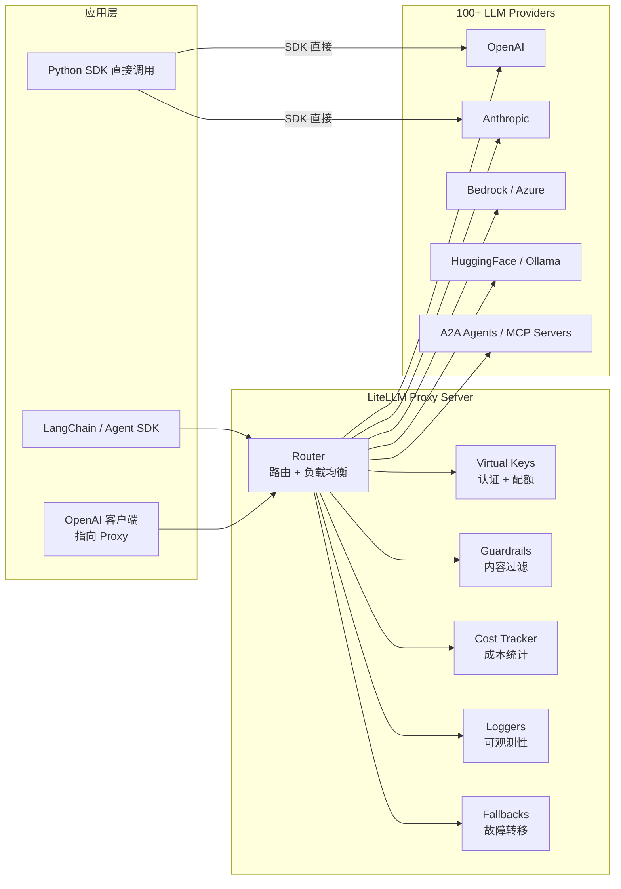
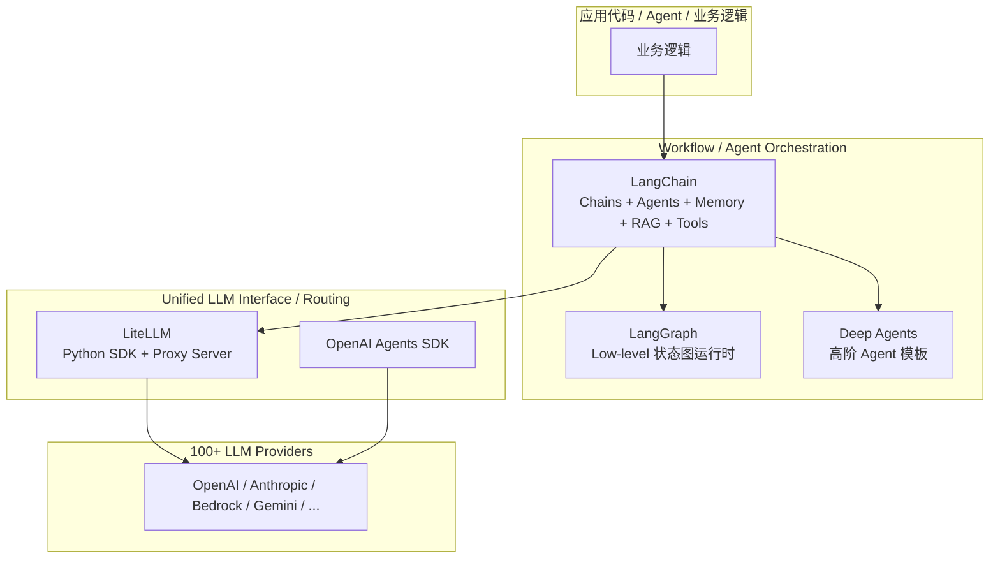
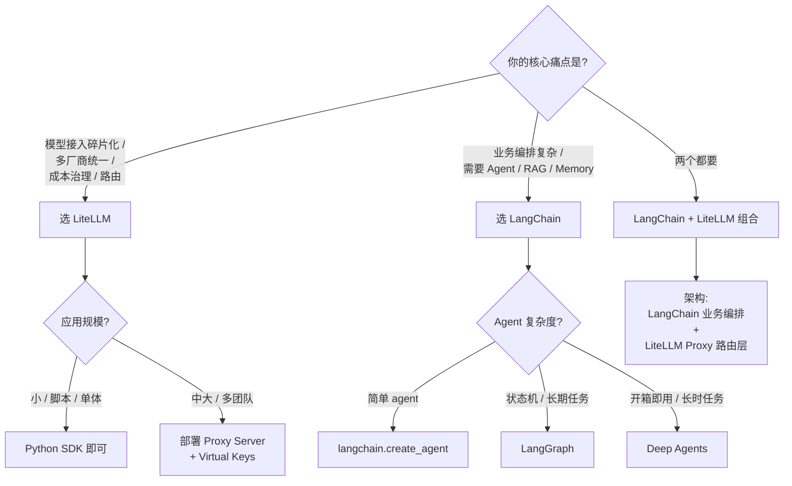

# LiteLLM 入门教程与 LangChain 对比分析

> 调研日期：2026-07-08
> 官方文档：<https://docs.litellm.ai/>
> GitHub 仓库：<https://github.com/BerriAI/litellm>
> 维护方：BerriAI（Y Combinator W23）
> 当前版本：v1.45+
> License：MIT

---

## 目录

- [[#一、执行摘要]]
- [[#二、LiteLLM 是什么]]
- [[#三、架构与核心概念]]
- [[#四、快速上手]]
- [[#五、核心特性详解]]
- [[#六、LiteLLM 与 LangChain 对比分析]]
- [[#七、适用场景与最佳实践]]
- [[#八、局限性]]
- [[#九、参考文献]]

---

## 一、执行摘要

LiteLLM 是一个由 BerriAI 维护的开源 **AI Gateway / LLM 统一接口库**，核心价值是用 OpenAI 兼容的 API 格式调用 100+ LLM 厂商（OpenAI、Anthropic、Google、Bedrock、Azure、HuggingFace、自托管模型等），并提供生产级的路由、负载均衡、Fallback、虚拟 Key、成本治理、可观测性等基础设施能力 [1][2]。截至 2026 年中，GitHub Stars 已超过 5 万，被 Stripe、Google ADK、OpenAI Agents SDK、Netflix、OpenHands 等项目采用 [2]。

LiteLLM 同时提供两种使用形态：**Python SDK**（嵌入应用内）和 **Proxy Server / AI Gateway**（独立部署的中心化网关）[1]。这两种形态决定了它既适合个人开发者的脚本场景，也适合企业级多团队、多模型、多账户的 LLM 接入治理。

在与 **LangChain** 的关系上，两者经常被并列比较，但**定位完全不同** [3][5]：

- **LiteLLM** = **统一接口 + 路由层**，是一个"无状态的纯函数库"，把厂商差异隐藏在 OpenAI 格式之下。
- **LangChain** = **应用编排框架 + Agent Harness**，是一个"有状态的抽象层"，提供 Chains、Agents、Memory、Retrieval、Tools 等完整应用开发组件。

简单来说：**LiteLLM 解决"怎么调模型"，LangChain 解决"怎么用模型构建应用"** [3]。两者完全可以结合使用：LangChain 做上层编排，LiteLLM 走下层调用 + 路由。

本教程会先带你快速掌握 LiteLLM（架构、快速上手、核心特性），然后用一整章做 LiteLLM vs LangChain 的横向对比，最后给出选型建议。

---

## 二、LiteLLM 是什么

### 2.1 一句话定义

**LiteLLM 是一个开源 AI Gateway**：让你用 OpenAI 的 `chat.completions` 接口格式，调用 100+ LLM 提供商 [1]。

```python
# 同一个 completion() 函数，调用三家不同厂商
from litellm import completion

completion(model="openai/gpt-4o",      messages=[...])   # OpenAI
completion(model="anthropic/claude-sonnet-4-20250514", messages=[...])  # Anthropic
completion(model="bedrock/us.anthropic.claude-opus-4-20250514-v1:0", messages=[...])  # AWS Bedrock
```

返回的永远是 OpenAI 格式的 `ModelResponse`，业务代码无需关心厂商差异 [1]。

### 2.2 起源与发展

- **作者**：BerriAI 团队（Krrish Dholakia 等），Y Combinator W23 投资 [2][4]
- **初衷**：解决多 LLM 接入的 SDK 碎片化问题（每加一个模型就要写一套集成）[4]
- **演进**：从最初的 Python 适配层，逐步发展为包含 Proxy Server（AI Gateway）、Virtual Keys、Spend Tracking、Guardrails、A2A / MCP 协议网关的完整平台 [1][2]
- **采用者**：Stripe、Netflix、OpenAI Agents SDK、Google ADK、Greptile、OpenHands 等 [2]

### 2.3 关键指标

| 指标 | 数值 / 说明 |
| --- | --- |
| GitHub Stars | 52K+（README 标识）[2] |
| 支持厂商 | 100+ LLM 提供商 [1][2] |
| PyPI 包 | `litellm`（核心 SDK）、`litellm[proxy]`（含网关）[1] |
| 维护方 | BerriAI，YC W23 |
| 许可证 | MIT（核心开源） |
| 官方宣称性能 | 8ms P95 latency @ 1k RPS [2]（注：此为 LiteLLM 官方自述 benchmark） |
| Observability 集成 | 40+（Langfuse、Datadog、MLflow、Helicone、OpenTelemetry 等）[11] |

---

## 三、架构与核心概念

### 3.1 双形态：Python SDK + Proxy Server

LiteLLM 提供两种使用形态，理解它们是上手的关键 [1]：

| 形态 | 部署位置 | 适用场景 | 类比 |
| --- | --- | --- | --- |
| **Python SDK** | 嵌入在你的 Python 应用里 | 单体应用、脚本、Notebook、嵌入到 LangChain / Agent SDK | 像 `requests` 库 |
| **Proxy Server (AI Gateway)** | 独立服务，对外暴露 OpenAI 兼容 HTTP API | 多团队共享、企业治理、跨语言接入、统一审计 | 像 API Gateway（Nginx/Kong） |

### 3.2 工作流程图



### 3.3 关键概念

| 概念 | 含义 |
| --- | --- |
| **`completion()`** | 统一入口函数，OpenAI 兼容签名，返回 OpenAI 格式的 `ModelResponse` [1] |
| **Model Name 格式** | `<provider>/<model>`，例如 `openai/gpt-4o`、`anthropic/claude-sonnet-4-20250514` [1] |
| **Router** | 多部署路由 + 负载均衡 + Fallback 引擎 [9] |
| **Virtual Key** | 代理签发的虚拟 API Key，可设置预算、过期、限速 [1] |
| **Spend Tracking** | 按 key / 用户 / 团队 / 组织维度统计费用 [10] |
| **Guardrails** | 调用前/后的内容过滤、PII 脱敏、安全检查 [18] |
| **Callback** | 异步钩子，用于日志、Tracing、Cost 上报 [11] |
| **A2A Protocol** | Agent-to-Agent 协议网关，转发到 LangGraph、Vertex AI Agent Engine 等 [2] |
| **MCP Gateway** | 转发 Model Context Protocol 工具调用 [2] |

---

## 四、快速上手

### 4.1 安装

```bash
# 仅 Python SDK
pip install litellm
# 或 uv
uv add litellm

# 含 Proxy Server（AI Gateway）
pip install 'litellm[proxy]'
# 或 uv
uv tool install 'litellm[proxy]'
```

来源：[1]

### 4.2 Python SDK：第一次调用

```python
from litellm import completion
import os

os.environ["OPENAI_API_KEY"] = "sk-..."

response = completion(
    model="openai/gpt-4o",
    messages=[{"role": "user", "content": "Hello, how are you?"}],
)
print(response.choices[0].message.content)
```

输出统一是 OpenAI `ModelResponse` 格式，无论底层是哪个厂商 [1]：

```python
ModelResponse(
    id='chatcmpl-abc123',
    created=1773782130,
    model='gpt-4o-2024-08-06',
    object='chat.completion',
    choices=[
        Choices(
            finish_reason='stop',
            index=0,
            message=Message(content='Hello! ...', role='assistant')
        )
    ],
    usage=Usage(prompt_tokens=13, completion_tokens=12, total_tokens=25)
)
```

**流式调用**：加 `stream=True` 即可 [1]：

```python
for chunk in completion(
    model="openai/gpt-4o",
    messages=[{"role": "user", "content": "Write a short poem"}],
    stream=True,
):
    print(chunk.choices[0].delta.content or "", end="")
```

**统一异常处理**：LiteLLM 把所有厂商错误映射到 OpenAI 异常类型，已有的 try/except 直接可用 [1]：

```python
import litellm

try:
    litellm.completion(model="anthropic/claude-instant-1",
                       messages=[{"role": "user", "content": "Hey!"}])
except litellm.AuthenticationError as e:
    print(f"Bad API key: {e}")
except litellm.RateLimitError as e:
    print(f"Rate limited: {e}")
except litellm.APIError as e:
    print(f"API error: {e}")
```

### 4.3 Proxy Server：第一次部署

最简启动（单模型）[1]：

```bash
litellm --model openai/gpt-4o
# Proxy running on http://0.0.0.0:4000
```

客户端用标准 OpenAI SDK 接入，无需改业务代码 [1]：

```python
import openai

client = openai.OpenAI(api_key="anything", base_url="http://0.0.0.0:4000")
response = client.chat.completions.create(
    model="gpt-4o",
    messages=[{"role": "user", "content": "Hello!"}],
)
```

### 4.4 Proxy + config.yaml（推荐生产用法）

创建 `config.yaml` [1]：

```yaml
model_list:
  - model_name: gpt-4o                 # 对外暴露的别名
    litellm_params:
      model: openai/gpt-4o
      api_key: os.environ/OPENAI_API_KEY
  - model_name: claude-sonnet-4
    litellm_params:
      model: anthropic/claude-sonnet-4-20250514
      api_key: os.environ/ANTHROPIC_API_KEY

litellm_settings:
  callbacks: ["langfuse"]              # 全局可观测性

general_settings:
  master_key: sk-litellm-master        # Proxy 管理密钥
```

启动：

```bash
litellm --config config.yaml
```

之后所有调用走 `http://0.0.0.0:4000`，业务代码不用关心底层用了哪家模型。

---

## 五、核心特性详解

### 5.1 统一 API

最核心的卖点。LiteLLM 把所有厂商的 SDK 调用转换成 OpenAI 的 `chat.completions` 格式，业务层只面对一种数据结构 [1][4]。InfoWorld 的评价是：LiteLLM 像一个"LLM 的万能遥控器"[4]。

### 5.2 路由与负载均衡

Proxy 的 Router 内置多种路由策略 [9]：

| 策略 | 说明 | 适用场景 |
| --- | --- | --- |
| `simple-shuffle`（默认） | 随机分发 | 通用 |
| `least-busy` | 发到活跃请求最少的部署 | 高并发 |
| `usage-based-routing` | 按 RPM/TPM 使用率 | 严格限速 |
| `latency-based-routing` | 发到延迟最低的部署 | 延迟敏感 |
| `cost-based-routing` | 发到最便宜的部署 | 成本敏感 |
| `order`（priority） | 按优先级顺序试 | 主备部署 |

典型配置 [9]：

```yaml
model_list:
  - model_name: gpt-4
    litellm_params:
      model: azure/gpt-4-primary
      api_key: os.environ/AZURE_API_KEY
      order: 1                          # 最高优先级
  - model_name: gpt-4
    litellm_params:
      model: azure/gpt-4-secondary
      api_key: os.environ/AZURE_API_KEY_2
      order: 2                          # 备选
  - model_name: gpt-4-fallback
    litellm_params:
      model: openai/gpt-4
      api_key: os.environ/OPENAI_API_KEY

router_settings:
  routing_strategy: simple-shuffle
  num_retries: 2
  timeout: 30
  redis_host: <redis-host>              # 多实例共享状态
  redis_port: 1992
  fallbacks:
    - gpt-4: [gpt-4-fallback]           # 模型级 fallback
```

### 5.3 Fallback 与重试

当主模型失败（连接错误、404、429 等）时，自动按顺序尝试下一组部署 [9]。`fallbacks` 用于跨模型名 fallback（GPT-4 全挂则降级到 GPT-3.5）；`order` 用于同模型名下的部署优先级 [9]。

### 5.4 成本治理（Spend Tracking）

LiteLLM 内置**按 key / 用户 / 团队 / 组织**的成本统计和预算管控 [10]。这是 LiteLLM 相对 LangChain 最显著的差异化能力之一 [3]：

- 内置 100+ 模型的 Token 单价表
- 自动按响应计算费用，累积到虚拟 Key
- 可设月度/日度预算，超限自动 429
- 暴露 `/spend/logs`、`/global/spend/keys` 等 API

### 5.5 可观测性

通过 callback 系统集成 40+ 平台 [11]：

```python
import litellm

# 一行代码开启三个观测平台
litellm.success_callback = ["langfuse", "mlflow", "helicone"]

response = litellm.completion(
    model="gpt-4o",
    messages=[{"role": "user", "content": "Hi!"}],
)
```

支持列表（部分）[11]：

- Tracing / Observability：Langfuse、MLflow、Helicone、Lunary、Traceloop、OpenTelemetry、Datadog
- Logging：Supabase、PostHog、Mixpanel、Sentry
- 兼容 OpenTelemetry v1，可对接 Jaeger / Zipkin / Datadog / New Relic [11]

每条请求都会附带 `StandardLoggingPayload`，包含 `response_cost`、`cost_breakdown`、`trace_id`、`call_type` 等字段 [11]。

### 5.6 Guardrails（护栏）

支持 4 类执行时机 [18]：

- **Pre-call**：请求发出前检查（如屏蔽敏感词）
- **During-call**：流式响应中实时干预
- **Post-call**：响应回来后过滤 / 脱敏
- **Logging-only**：仅记录不阻断

内置支持：

- LiteLLM Content Filter（正则 + 关键字，零依赖）[18]
- Presidio PII / PHI Masking
- Bedrock Guardrails
- 自定义 Guardrail（Python 回调）
- 策略模板（澳大利亚 PII、医疗 PII 等合规包）[18]

### 5.7 A2A + MCP Gateway（新形态）

2026 年的 LiteLLM 已不只路由 LLM，还路由 **Agent** 和 **MCP 工具** [2]：

- **A2A Protocol**：把 LangGraph、Vertex AI Agent Engine、Azure AI Foundry、Bedrock AgentCore、Pydantic AI 等 Agent 暴露成统一入口
- **MCP Gateway**：代理 MCP 工具调用，配合 Virtual Key 做访问控制

这意味着 LiteLLM 在向"统一 AI 资源网关"演进，而不仅是 LLM 网关 [2]。

---

## 六、LiteLLM 与 LangChain 对比分析

### 6.1 定位差异

这是理解两者区别的根本 [3][5][6]。



**LangChain = 编排框架**：关心"怎么用模型构建应用"（Chains、Agents、Memory、Retrieval、Tools）[5][6]。

**LiteLLM = 接口 + 路由层**：关心"怎么把请求送到正确的模型"（统一 API、路由、限速、计量）[1][3]。

### 6.2 核心架构对比

| 维度 | LangChain | LiteLLM |
| --- | --- | --- |
| **首要目标** | Agent 工程平台（orchestration + harness）[5] | LLM 路由 / Gateway [1] |
| **抽象层级** | 高（chains、agents、memory 等抽象类） | 低（一个 `completion()` 函数）[1][3] |
| **包结构** | `langchain-core`、`langchain-community`、`langchain_openai` 等 partner 包、`langchain`、`langgraph`、`deepagents`[8][13] | 单一 `litellm` 包 + `[proxy]` extra [1] |
| **典型调用** | `agent = create_agent(model=..., tools=...); agent.invoke({"messages":...})` [5] | `completion(model="openai/gpt-4o", messages=[...])` [1] |
| **状态管理** | LangGraph 提供持久化、检查点、人机协同 [12] | 无状态（不持久化你的业务会话）[3] |
| **Agent 能力** | 强（tool calling、planning、subagent、virtual FS）[5][13] | 弱（只有 fallback / LB，算不上 agent）[3] |
| **核心可观测性** | LangSmith（商业产品）[5] | Callback 系统 + 40+ 开源/商业集成 [11] |
| **成本治理** | 需依赖 LangSmith 或自建仪表盘 [3] | 内置（per key/user/team spend tracking + budget）[3][10] |
| **厂商覆盖** | 通过 partner 包 + community 集成（覆盖广但模块化）[8] | 100+ 厂商，统一 OpenAI 格式 [1][2] |
| **学习曲线** | 较陡（模块多、抽象深、版本变更频繁）[3] | 极平（pip install + 一个函数搞定）[3][4] |
| **生产部署** | 偏框架嵌入（业务代码里） | 偏网关（独立服务，OpenAI 兼容 HTTP）[1] |

### 6.3 功能矩阵

| 能力 | LangChain | LiteLLM |
| --- | --- | --- |
| 统一多厂商 API | ✅（`init_chat_model` / 各 partner 包）[5] | ✅✅（核心卖点，100+ 厂商一键通）[1] |
| 函数/工具调用 | ✅✅（核心抽象 `BaseTool`、tool calling 中间件）[5] | ✅（透传 OpenAI format）[1] |
| Agent 循环 | ✅✅✅（`create_agent`、planning、subagent）[5] | ❌（无内置 agent runtime） |
| Memory / 持久化 | ✅✅（短期 + 长期 memory）[5] | ❌ |
| RAG / Retrieval | ✅✅（Document Loaders、Splitters、VectorStores）[7] | ❌ |
| Structured Output | ✅✅（Pydantic schema 强约束）[5] | ✅（via Pydantic 校验）[4] |
| Streaming | ✅✅（astream_events）[5] | ✅（`stream=True`）[1] |
| 路由 / 负载均衡 | ❌ | ✅✅✅（5 种策略 + Redis 共享）[9] |
| Fallback / 重试 | 部分（依赖应用层） | ✅✅✅（`order` + `fallbacks` 配置式）[9] |
| 虚拟 Key + 配额 | ❌ | ✅✅✅（per key/team/org 配额 + 限速）[1][10] |
| Spend Tracking | 需 LangSmith | ✅✅（内置）[3][10] |
| Guardrails | 通过 LangSmith Guardrails | ✅✅（内置 + Presidio + Bedrock）[18] |
| 可观测性集成 | ✅（LangSmith 主推）[5] | ✅✅（40+ callback）[11] |
| MCP 集成 | ✅✅（First-class）[5] | ✅（MCP Gateway）[2] |
| A2A 协议 | ✅（LangGraph 内置） | ✅（A2A Gateway 转发）[2] |
| OpenAI 兼容 HTTP | ❌ | ✅✅（Proxy 直接兼容 OpenAI SDK）[1] |

> 图例：✅ 基本有 / ✅✅ 强项 / ✅✅✅ 杀手锏 / ❌ 不涉及

### 6.4 可以结合使用

两者**不是互斥的**，事实上很多生产栈是**LangChain 编排 + LiteLLM 路由** [3][15]：

```python
# 在 LangChain 中通过 LiteLLM Router 调用模型
from langchain_community.chat_models import ChatLiteLLM
from langchain.agents import create_agent

llm = ChatLiteLLM(
    model="gpt-4o",
    api_base="http://litellm-proxy:4000",   # 指向 LiteLLM Proxy
    api_key="sk-virtual-key-xxx",
)

agent = create_agent(model=llm, tools=[...], system_prompt="...")
```

或者反过来用：LiteLLM Proxy 作为 AI Gateway 统一处理所有 LLM 调用（业务方是 LangChain、纯 SDK、Claude Agent SDK 都行），Proxy 层做路由、限速、计量、审计 [3]。

### 6.5 选型决策树



**经验法则**（来自 TrueFoundry 的生产观察）[3]：

- 还在原型期 → LangChain 出活快
- 已有多厂商路由 / 成本失控 → LiteLLM 立竿见影
- 已经成为多团队共享平台 → 两者都需要，或考虑托管 AI Gateway

### 6.6 两者都解决不了的"企业级硬骨头"

引用 TrueFoundry 对 100+ 客户落地经验的总结 [3]：

- **集中化的成本治理**：两者都没原生提供"在基础设施层强制按团队限预算"（LiteLLM 有，但多团队配置需要 UI 编排）
- **审计与合规导出**：日志都有，但生成可审计的合规报表需要二次工程
- **私有部署 / 自托管模型**：都假设模型由外部托管，自托管 / VPC 内模型需要额外架构
- **跨团队 RBAC**：分配不同团队的 LLM 访问权限不是一等公民
- **统一可观测性**：跨厂商的 prompt / cost / latency / error 单一视图需要定制

> 如果团队规模 ≥ 50 人或月 LLM 花费 ≥ $5,000，建议评估**托管 AI Gateway**（如 TrueFoundry、Portkey、Bifrost 等）作为 LiteLLM 之上的增强层 [3]。

---

## 七、适用场景与最佳实践

### 7.1 LiteLLM 适用场景

- **多模型 A/B / Shadow Testing**：同一业务并行打多家模型，对比质量与成本
- **Fallback 容灾**：主厂商挂掉自动降级到备厂商（OpenAI → Anthropic → 自托管）
- **多区域 / 多账户限速**：按 region 拆 API key，自动 round-robin
- **企业 LLM 入口**：统一一个 OpenAI 兼容网关，背后挂各厂商
- **跨语言接入**：Node / Go / Java / Rust 客户端用 OpenAI SDK 直连 LiteLLM Proxy，无需写适配
- **2026 新场景**：A2A Agent 路由、MCP 工具代理

### 7.2 最佳实践

1. **永远用 Proxy + config.yaml**：单模型 CLI 启动只适合 demo，生产必上 config [1]
2. **配 Redis**：多实例部署必须 `redis_host` / `redis_port`，否则路由状态不一致 [9]
3. **开 callback 做 Tracing**：哪怕只用 Langfuse 一个，也比裸奔好 [11]
4. **Budget 必须设**：每条虚拟 Key 都设月度预算，避免失控 [10]
5. **Guardrails 至少加一条 PII**：哪怕本地正则实现 [18]
6. **测试用 mock_testing**：LiteLLM 提供 `mock_testing_rate_limit_error` 等开关，方便注入失败测试 fallback 路径 [9]
7. **观察响应 Header 里的 `model_id`**：验证负载均衡是否真的生效 [9]
8. **structured output 用 Pydantic schema**：跨厂商获得一致校验 [4]

### 7.3 不建议的场景

- 你只需要调 OpenAI 一家 → 直接用 OpenAI SDK，不需要 LiteLLM
- 你的核心痛点是 Agent 编排 / RAG → 选 LangChain / LlamaIndex，LiteLLM 只是底层调用层
- 单体应用、单团队、月度 LLM 花费 < $500 → 直接 SDK，Proxy 反而是负担

---

## 八、局限性

> 注：以下观点综合官方文档和第三方独立分析（如 TrueFoundry、Markaicode）[3][14]，仅供参考。**官方基准与第三方实测可能存在分歧**，建议在自有场景下 benchmark。

### 8.1 已知短板

1. **抽象层无 Agent 能力**：只能路由调用，不能定义 Agent 循环 / 状态机 / Memory
2. **企业治理需自建**：SSO、RBAC、细粒度审计需自己接 [3]
3. **不托管模型**：纯网关层，模型还是要外部跑
4. **版本演进快**：大量新功能（Guardrails、A2A、MCP）持续叠加，文档偶有滞后
5. **延迟敏感场景的争议**：官方宣称 8ms P95 @ 1k RPS [2]，但第三方对比认为其在高并发下延迟上升较快 [3]
6. **Python 生态为主**：虽然 Proxy 暴露 OpenAI 兼容 HTTP，但 SDK 主要绑定 Python（另有 JS / Go SDK，但生态弱）

### 8.2 与 LangChain 比的弱点

- 没有 `create_agent` 这种高阶 agent 抽象 [5]
- 没有 RAG / VectorStore / DocumentLoader 等应用层组件 [7]
- 没有 LangSmith 那种开箱即用的 trace / evaluate 平台 [5]
- 社区与教程：LangChain 在 RAG / Agent 教程上更丰富

### 8.3 与 LangChain 比的优势

- 真正"零厂商代码改动"——OpenAI 兼容 HTTP，连业务方都不用知道是 LiteLLM [1]
- 内建成本治理（spend tracking + budget + per-team 配额）[10]
- 内建 5 种路由策略 + order-based fallback + 模型级 fallback [9]
- 不强加抽象层，可作为 LangChain / Agent SDK / 纯 SDK 任意栈的下层

---

## 九、参考文献

[1] LiteLLM 官方文档首页 - Getting Started. <https://docs.litellm.ai/docs/>

[2] BerriAI/litellm - GitHub README. <https://github.com/BerriAI/litellm>

[3] TrueFoundry Blog - LiteLLM vs LangChain: A Hands-On Comparison. <https://www.truefoundry.com/blog/litellm-vs-langchain>

[4] Serdar Yegulalp - LiteLLM: An open-source gateway for unified LLM access. InfoWorld. <https://www.infoworld.com/article/3975290/litellm-an-open-source-gateway-for-unified-llm-access.html>

[5] LangChain 官方文档 - LangChain overview. <https://docs.langchain.com/oss/python/langchain/overview>

[6] LangChain 官方文档 - Frameworks, runtimes, and harnesses. <https://docs.langchain.com/oss/python/concepts/products>

[7] LangChain 官方文档 - Component architecture. <https://docs.langchain.com/oss/python/langchain/component-architecture>

[8] LangChain GitHub README. <https://github.com/langchain-ai/langchain>

[9] LiteLLM 官方文档 - Proxy Load Balancing. <https://docs.litellm.ai/docs/proxy/load_balancing>

[10] LiteLLM 官方文档 - Spend Tracking. <https://docs.litellm.ai/docs/proxy/cost_tracking>

[11] DeepWiki - BerriAI/litellm Observability and Logging. <https://deepwiki.com/BerriAI/litellm/6-observability-and-logging>

[12] LangChain 官方文档 - LangGraph overview. <https://docs.langchain.com/oss/python/langgraph/overview>

[13] LangChain Deep Agents GitHub. <https://github.com/langchain-ai/deepagents>

[14] RightAIChoice - LangChain vs LiteLLM: Which Should You Pick in 2026? <https://rightaichoice.com/compare/langchain-vs-litellm>

[15] HookFlow - LangChain vs LiteLLM — AI Tool Comparison 2026. <https://hookflow.ai/compare/langchain-vs-litellm>

[16] LiteLLM 官方文档 - SDK Quickstart. <https://docs.litellm.ai/docs/learn/sdk_quickstart>

[17] LangChain Reference - BaseChatModel. <https://reference.langchain.com/python/langchain-core/language_models/chat_models/BaseChatModel>

[18] LiteLLM 官方文档 - Guardrails Quick Start. <https://docs.litellm.ai/docs/proxy/guardrails/quick_start>

[19] LangChain Blog - Doubling down on Deep Agents. <https://www.langchain.com/blog/doubling-down-on-deepagents>

[20] LangChain Blog - Agent Frameworks, Runtimes, and Harnesses- oh my! <https://www.langchain.com/blog/agent-frameworks-runtimes-and-harnesses-oh-my>

[21] MortalApps - LangChain vs LiteLLM vs SDK: State Leakage Tradeoffs. <https://mortalapps.com/python/ai-agents/llm-framework-tradeoffs/>

---

## 附：方法论与假设

- **调研日期**：2026-07-08
- **调研方法**：deep-research 标准模式（6 阶段：SCOPE → PLAN → RETRIEVE → TRIANGULATE → SYNTHESIZE → PACKAGE），并行检索 6+ 组查询，抓取 5 篇关键文章
- **核心来源**：LiteLLM 官方文档（docs.litellm.ai）、GitHub README、LangChain 官方文档（docs.langchain.com）、InfoWorld 独立评测、TrueFoundry 客户落地观察
- **重要假设**：
  - 技术读者已熟悉 Python、OpenAI API、HTTP
  - 对比维度选择"应用编排 vs 接口路由"作为主轴
  - 选型建议按团队规模 / 花费规模划分，避免一刀切
- **争议点**：LiteLLM 的延迟性能（官方 8ms P95 vs 第三方认为高并发下退化），本教程在 §2.3 和 §8.1 同时记录双方说法
- **未深入**：LiteLLM Enterprise 商业版定价、LiteLLM + LangGraph 的官方集成示例
