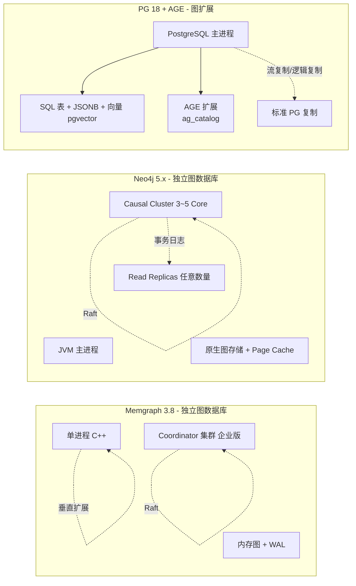
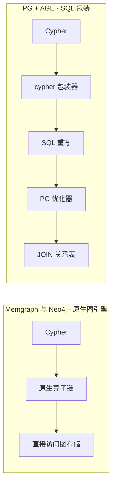
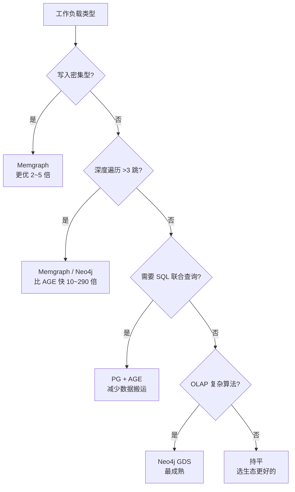
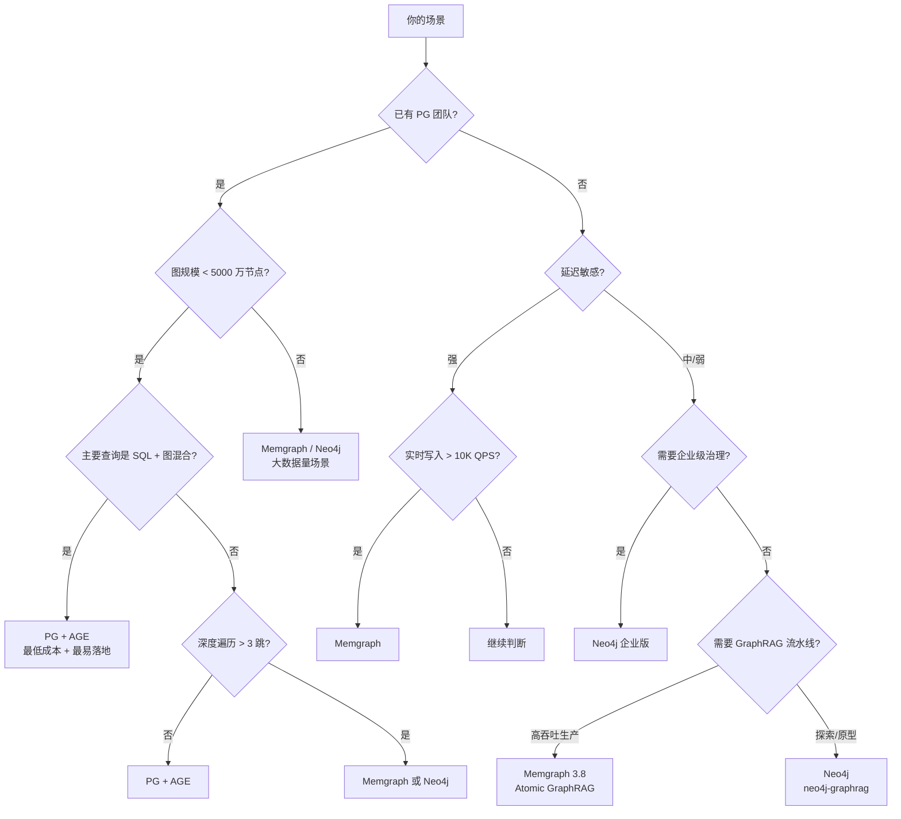

# Memgraph vs Neo4j vs PostgreSQL + Apache AGE 对比报告（2026 年版）

> **报告时间**：2026 年 8 月
> **对比对象**：
>
> - Memgraph 3.8.x（2026 年 2 月发布）
> - Neo4j 5.26 LTS（5.x 系列最终 LTS，维护至 2028 年 6 月）/ Neo4j 2026.x 新特性系列
> - PostgreSQL 18 + Apache AGE 1.8.0（2026 年 7 月发布）/ AGE 1.7.0 for PG 17/18
>
> **对比维度**：架构、性能、生态、Python 支持、部署运维、AI / GraphRAG、成本、适用场景
> **适用读者**：正在评估图数据库选型的架构师、技术负责人、后端 / AI 工程师

## 0. 执行摘要

三个产品都兼容 openCypher（Apache AGE 是 openCypher 子集），但在**架构定位**上属于不同物种：

| 维度 | Memgraph 3.8 | Neo4j 5.26 LTS / 2026.x | PostgreSQL + Apache AGE 1.7/1.8 |
|------|--------------|--------------------------|----------------------------------|
| **核心定位** | 独立图数据库，内存优先 + C++ 内核 | 独立图数据库，JVM + 全栈企业图平台 | PostgreSQL 上的图扩展，复用关系数据库 |
| **形态** | 单进程 + 集群副本 | DBMS + Causal Cluster | PostgreSQL 扩展 |
| **典型性能优势** | 写入 41× 低延迟、3~8× 高吞吐（官方白皮书）[1] | 大集群、OLAP（GDS）、生态成熟 | 复用 PG 工具链，与 pgvector 组合实现"图 + 向量"一体化 |
| **查询语言** | openCypher + 动态图算法扩展 | openCypher + Cypher 5（GQL 标准） | openCypher 子集 + SQL（同一实例） |
| **Python 集成** | `neo4j` 驱动 + GQLAlchemy + langchain-memgraph | `neo4j` 6.x 驱动 + graphdatascience + neo4j-graphrag | psycopg2 + apache-age-python |
| **AI 创新** | Atomic GraphRAG、Vector Single Store、Parallel Runtime | 向量索引、neo4j-graphrag 组合检索 | 依赖 pgvector 实现向量检索 |
| **生产成熟度** | 中（社区版功能受限，企业版成熟） | 高（最成熟的图数据库生态） | 中-高（依赖 PG 自身成熟度，但项目历史上有过解散开发团队事件）[7][8] |
| **云服务** | Memgraph Cloud（AWS 6 区） | AuraDB（Free / Pro / Business Critical / VDC）[2] | 任意 PG 托管服务（AWS RDS、Azure Database、Citus、自建） |
| **许可证** | 社区版（AGPLv3）+ 企业版 | 社区版（GPLv3）+ 企业版 | Apache License 2.0（AGE 本身） |
| **推荐场景** | 实时风控、流图分析、嵌入式 AI Agent | 通用 OLTP/OLAP、大集群、企业治理 | 已有 PG 基础设施、中等规模图 + SQL 混合需求 |

**一句话总结**：

- **Memgraph** —— 极致写入性能 + 低延迟 + AI 原生
- **Neo4j** —— 成熟生态 + 企业治理 + 大规模集群
- **PostgreSQL + Apache AGE** —— 复用 PG 基础设施，与 SQL/JSON/向量混用，单数据库搞定多模型

## 1. 引言

### 1.1 为什么需要三方对比

图数据库选型常陷入"非此即彼"的二元思维，但 2024~2026 年的真实趋势是**多模型融合**。PostgreSQL + Apache AGE 代表了一类新选择：在已有关系数据库上叠加图能力，避免引入新的基础设施。

三方覆盖了三种典型部署心智：

| 心智 | 代表方案 |
|------|---------|
| **性能优先** | Memgraph（内存优先，C++ 无 GC） |
| **生态优先** | Neo4j（最广的图数据库生态） |
| **栈整合优先** | PostgreSQL + Apache AGE（少一个数据库，少一份运维） |

### 1.2 报告范围与方法

- **范围**：架构设计、Python 开发体验、性能、生态、AI 能力、部署运维、成本
- **不涵盖**：多模数据库对比（如 ArangoDB）、原生列式图数据库（如 TigerGraph、NebulaGraph）
- **数据来源**：官方文档、官方博客、第三方基准（GraphIndex、Latent Space、AIMultiple、rizlabs）、GitHub Issues、社区评测 [1][3][4][5][6]

### 1.3 关键背景：Apache AGE 的项目状态

Apache AGE 是 Apache 顶级项目，曾由 Bitnine（AGEDB 母公司）主导开发，**2024 年 10 月 Bitnine 解散了 AGE 开发团队**，项目交由 Apache 接手 [7]。2025~2026 年恢复发布节奏：

| 版本 | PG 版本 | 发布日期 | 关键变化 |
|------|---------|---------|---------|
| 1.6.0 | PG 12~17 | 2025.09~10 | 新增 PG 17 支持 |
| 1.7.0 | PG 17/18 | 2026.01~02 | RLS 支持、改用 pg COPY 替代 libcsv |
| 1.8.0 | PG 18 | 2026.07 | create_subgraph()、pg_upgrade 支持 |

> AGE 路线图曾长期不支持 PG 17（社区 Issue #2111），直到 1.6.0 才补齐。生产部署需评估其长期支持力度 [8]。

## 2. 架构对比

### 2.1 总体架构



**架构本质差异**：

| 维度 | Memgraph | Neo4j | PG + AGE |
|------|----------|-------|----------|
| **架构哲学** | 图优先，性能为王 | 图优先，企业通用 | 关系优先，叠加图能力 |
| **存储引擎** | 内存图（可选磁盘） | 原生图存储 | 关系表 + `agtype` |
| **运行模式** | 单进程 | JVM 进程 | PG 主进程 + 共享库扩展 |
| **多模型** | ❌（仅图 + 向量索引） | ❌（仅图 + 向量） | ✅（SQL + JSON + 图 + 向量 + 全文本） |
| **扩容** | 垂直 + 集群副本 | 水平集群（Cluster + Replicas） | PG 标准主从 + Citus 分片 |

### 2.2 存储引擎差异

| 存储能力 | Memgraph | Neo4j | PG + AGE |
|---------|----------|-------|----------|
| **图存储方式** | 内存中的邻接表 + 属性存储 | 节点/关系文件（neostore.*）定长记录 | 关系表：`ag_vertex`、`ag_edge`（内部表） |
| **属性存储** | 类型紧凑编码 | 属性链 + 类型链 | `agtype`（类似 JSONB） |
| **数据规模上限** | 单实例内存上限（社区版），数十亿节点 | 单实例数十亿关系 | 取决于 PG 表大小（理论 TB 级） |
| **持久化** | WAL + 快照（每 30 秒） | WAL + 检查点 | 沿用 PG WAL + 备份机制 |
| **索引** | Label/Property/Edge/Vector | Property/Composite/Vector/Full-text | B-tree/GIN/GiST + pgvector HNSW/IVFFlat |
| **图遍历实现** | 内存指针跳转（O(1) 邻居） | 文件定长记录指针跳转 | 表 JOIN + 过滤，依赖 PG 优化器 |

> 关键差异：**AGE 的图遍历本质是 SQL 查询**，每次 Cypher 调用要通过 `cypher()` 包装器翻译为 SQL，PG 优化器再决定执行计划。这带来**两次转换开销**和**优化器不确定性**——是 AGE 性能故事的核心约束 [4]。

### 2.3 查询引擎差异

| 能力 | Memgraph | Neo4j | PG + AGE |
|------|----------|-------|----------|
| **查询语言** | openCypher + 动态图算法扩展 | openCypher + Cypher 5（GQL 标准） | openCypher 子集 + 嵌入 SQL |
| **执行模型** | 自研执行引擎 + Parallel Runtime | Cypher 5 + JIT | `cypher()` 函数 → SQL → PG 执行器 |
| **EXISTS 子查询** | ✅ | ✅ | ✅ |
| **计划缓存** | ✅ | ✅ | 部分（PG 计划缓存作用于生成的 SQL） |
| **并行执行** | ✅（3.8 Parallel Runtime） | ✅（部分算子） | ✅（PG 并行查询，但图 JOIN 通常不并行） |
| **混合查询** | 部分（Cypher + Python 内置函数） | 部分（SQL via APOC） | ✅（Cypher + SQL 同实例原生混用） |

## 3. 性能对比

### 3.1 三方在多个基准中的表现

性能是最容易产生争议的维度。综合多个独立基准给出**多角度**判断：

| 基准来源 | 数据规模 | Memgraph | Neo4j | PG + AGE | 备注 |
|---------|---------|----------|-------|-----------|------|
| **Latent Space RCTE vs AGE** [4] | 1.14M 边，KG 检索 | — | — | 同 PG 实例下比 RCTE **慢 290 倍** | cypher() 包装 ~13ms/次 + PG 计划生成开销 |
| **Latent Space 8 引擎** [3] | u=50 RPS, Go 驱动 | 22,462 RPS | 14,541 RPS | 78 RPS（基准较弱） | AGE 在 OLTP 高并发场景差距明显 |
| **BAEM1N 公平基准** [6] | 1K 节点, 2K 边 | — | 1-hop 慢 14.9×（3-hop） | 1-hop 快 6/8 | 小数据量 OLTP，AGE 优于 Neo4j |
| **rizlabs Piggie 基准** [5] | 10K~1M 节点，12 工作负载 | — | — | **全部胜出**（AGE + pgvector） | 但含 Piggie SDK 算法 vs Neo4j GDS |
| **Memgraph 官方白皮书** [1] | 千万级，混合负载 | 41× 低延迟、3~8× 吞吐 | 基线 | — | 厂商自有 Benchgraph 工具 |
| **GraphIndex GraphRAG** [9] | 10M 实体，GraphRAG | 中（multi-hop 优） | 中（GDS 算法优） | 中（依赖 RCTE 备份方案） | 工作负载决定胜负 |

> ⚠️ 注意：**AGE 的性能高度依赖查询类型与数据规模**。小数据 OLTP 上 AGE 优秀甚至超越 Neo4j，但深度遍历 + 复杂 Cypher 时差距显著。

### 3.2 性能差异的根本原因



**AGE 的性能瓶颈**：

1. **`cypher()` 包装器开销**：每次调用约 13ms 的 Cypher→SQL 翻译 [4]
2. **PG 计划生成开销**：每次 SQL 重新生成执行计划，高并发下累积
3. **复杂图 JOIN**：PG 优化器不擅长图遍历，常生成次优执行计划
5. **`@>` 操作符选择性**：PG 18 引入 `matchingsel selectivity` 后引发性能回归（已知 Issue #2356）[10]

**AGE 的性能优势**：

1. **小数据 + 简单查询**：OLTP 单跳 + 简单过滤，PG 优化器执行得很好
2. **SQL + Cypher 混用**：避免数据在多个系统间搬运
3. **与 pgvector 共用**：向量检索 + 图遍历一次连接完成

### 3.3 综合性能判断



**实际建议**：

| 场景 | 推荐 |
|------|------|
| 实时写入 > 10K QPS | Memgraph |
| 高并发深度遍历 | Memgraph / Neo4j |
| 复杂 OLAP（图算法） | Neo4j GDS |
| **SQL + 图混用、统一基础设施** | **PG + AGE** |
| **小到中等规模 + 已有 PG** | **PG + AGE** |
| 大集群水平扩展 | Neo4j |

## 4. Python 开发体验

### 4.1 驱动与 SDK 对比

| 包名 | Memgraph | Neo4j | PG + AGE |
|------|----------|-------|----------|
| `neo4j`（Python Driver 6.x） | ✅ | ✅ | ❌（Bolt 不兼容，AGE 不暴露 Bolt） |
| `pymgclient` / `psycopg2` | ❌ / ❌ | ❌ / ❌ | ✅ `psycopg2-binary` + `apache-age-python` |
| `apache-age-python`（官方） | ❌ | ❌ | ✅ 含 Cypher 解析（基于 ANTLR） |
| `gqlalchemy`（OGM） | ✅ | ✅ | ❌ |
| `graphdatascience` | ❌ | ✅ | ❌ |
| `neo4j-graphrag` | ❌ | ✅ | ❌ |
| `langchain-neo4j` | 部分 | ✅ | ❌ |
| `langchain-memgraph` | ✅ | ❌ | ❌ |
| `langchain` 通用图存储 | ✅ | ✅ | ✅ 通过自定义 CypherChain |
| `langchain-age`（社区） | ❌ | ❌ | ✅ 社区维护 |
| `pgvector`（Python） | ❌ | ❌ | ✅ 直接 psycopg2 访问 |

### 4.2 代码风格对比

**Memgraph / Neo4j**（共享 Bolt + openCypher）：

```python
from neo4j import GraphDatabase

driver = GraphDatabase.driver("bolt://localhost:7687", auth=("neo4j", "password"))
with driver.session() as session:
    session.run("CREATE (:Person {name: $n})", n="Alice")
```

**PG + AGE**（通过 psycopg2）：

```python
import psycopg2
from age import Age

# 连接 PG
conn = psycopg2.connect(
    host="localhost", port=5432,
    dbname="mydb", user="postgres", password="postgres"
)

# 初始化 AGE 扩展
age = Age(conn)
age.init()  # 一次性

# 创建图
with conn.cursor() as cur:
    cur.execute("SELECT create_graph('my_graph')")

# Cypher 查询
with conn.cursor() as cur:
    cur.execute("""
        SELECT * FROM cypher('my_graph', $$
            CREATE (p:Person {name: 'Alice'})
        $$) AS (result agtype);
    """)
conn.commit()
```

### 4.3 三方代码迁移成本

| 迁移方向 | 成本 | 关键改动 |
|---------|------|---------|
| Memgraph → Neo4j | 低 | 同 Bolt + 同 openCypher，认证、多数据库切换 |
| Neo4j → Memgraph | 低 | 同上，GDS 过程 → MAGE 过程 |
| **任意 → PG + AGE** | **中-高** | 换 psycopg2，Cypher 通过 `cypher()` 函数嵌入 SQL，GDS/MAGE 不可用，需手写 SQL JOIN |
| **PG + AGE → 任意** | **中** | SQL JOIN 拆为 Cypher，需要重新设计数据模型 |

> 注意：PG + AGE 的 Cypher 是 **openCypher 子集**，部分高级语法（如 EXISTS subquery 部分细节）不支持，迁移需重新评估。

### 4.4 开发体验评分

| 维度 | Memgraph | Neo4j | PG + AGE |
|------|----------|-------|----------|
| **驱动成熟度** | 高（用 Neo4j 驱动） | 高（官方） | 中（社区维护的 apache-age-python） |
| **文档质量** | 中 | 高 | 中（官方手册详细，但示例少） |
| **错误信息可读性** | 中 | 高 | 中（错误常来自 PG，需 PG 知识） |
| **LangChain 集成** | ✅ | ✅（最成熟） | ✅ 社区包 |
| **可视化工具** | Memgraph Lab | Bloom + Browser | pgAdmin + 第三方（如 Graphileon） |
| **笔记本友好度** | ✅ | ✅ | ✅ |
| **Cypher 子集支持** | 完整 + 扩展 | 完整（Cypher 5） | 子集（无 MATCH 高级模式） |

## 5. AI 与 GraphRAG 对比

### 5.1 三方 AI 能力矩阵

| 能力 | Memgraph 3.8 | Neo4j 5.26 / 2026.x | PG + AGE + pgvector |
|------|--------------|--------------------------|------------------------|
| **原生向量索引** | ✅ HNSW，Single Store 节省 85% 内存 | ✅ HNSW（5.11+），支持 cosine/euclidean | ❌ 需 `pgvector` 扩展（HNSW/IVFFlat） |
| **GraphRAG 范式** | Atomic GraphRAG：单 Cypher 完成端到端 | neo4j-graphrag：组合式检索器 | pgvector + Cypher 混合 |
| **Text2Cypher** | `MemgraphQAChain` | `GraphCypherQAChain` | 自建（无官方） |
| **实体抽取** | `add_documents()` 自动 | 同等 | 自建 |
| **混合检索** | vector_search + Cypher | `db.index.vector.queryNodes()` + Cypher | pgvector + AGE Cypher 同实例 |
| **多跳推理** | ✅ 强 | ✅ 强 | ✅ 中（依赖 SQL JOIN 性能） |

### 5.2 PG + AGE 的差异化优势：图 + 向量 + SQL 一体化

这是 Apache AGE + pgvector 组合的核心吸引力。在同一个 PostgreSQL 实例中：

```sql
-- 1. 向量检索（pgvector）
WITH similar_docs AS (
    SELECT id, content,
           embedding <=> $1::vector AS distance
    FROM documents
    ORDER BY embedding <=> $1::vector
    LIMIT 10
)
-- 2. 图扩展（Apache AGE）
SELECT d.id, d.content, related.author, related.cited_by
FROM similar_docs d,
LATERAL cypher('citation_graph', $$
    MATCH (doc {id: $id})-[:CITED_BY]->(author)
    RETURN author.name, count(*) AS citations
$$, jsonb_build_object('id', d.id::text)) AS related(author agtype, citations agtype);
```

一个 SQL 查询完成"向量召回 + 图遍历 + 关联作者引用统计"，**无需跨数据库网络**，延迟比组合多个系统低一个数量级 [5]。

### 5.3 三方 GraphRAG 范式对比

| 范式 | Memgraph Atomic GraphRAG | Neo4j neo4j-graphrag | PG + AGE + pgvector |
|------|---------------------------|----------------------|----------------------|
| **执行模型** | 单 Cypher 查询 | 多阶段检索器链 | 单 SQL 查询（CTE + LATERAL） |
| **网络往返** | 0 | 多次 | 0 |
| **灵活性** | 中（查询固定） | 高（可组合） | 高（任意 SQL） |
| **延迟** | 极低 | 中（多跳） | 低 |
| **调试难度** | 中（单查询但复杂） | 低 | 中（需 SQL 知识） |

## 6. 集群、高可用与扩展

| 能力 | Memgraph | Neo4j | PG + AGE |
|------|----------|-------|----------|
| **集群协议** | 企业版 Raft（Coordinator） | Core 间 Raft + Replica 异步 | 沿用 PG 流复制 / 逻辑复制 |
| **社区版 HA** | MAIN + REPLICAs（无自动转移） | ❌（单实例） | ✅ PG 流复制自动支持 |
| **自动故障转移** | ✅ 企业版 | ✅（Raft） | ✅（PG patroni 等工具） |
| **读扩展** | 副本只读 | Read Replicas 水平扩展 | PG 只读副本 + Citus 分片 |
| **水平扩展** | ❌（社区版受限） | ✅ | ✅（Citus 分布式 PG） |
| **跨数据中心** | 复制拓扑 | Replica 拓扑 | PG BDR / logical replication |
| **运维生态** | 中（Memgraph Lab + 自有工具） | 高（Neo4j Ops Manager） | 极高（PG 工具链全行业最丰富） |

**判断**：

- Neo4j 在图原生集群（带 Raft 共识）最成熟
- **PG + AGE 复用 PG 整套集群生态**——这是其最大优势之一
- Memgraph 在中小规模 + 社区版可用，HA 需要付费

## 7. 部署与运维

| 维度 | Memgraph | Neo4j | PG + AGE |
|------|----------|-------|----------|
| **Docker 镜像** | 官方 `memgraph/memgraph` | 官方 `neo4j:5.26` | 官方 `apache/age`（PG 镜像集成） |
| **Kubernetes** | Memgraph Operator（企业） | Neo4j Helm Chart | 任意 PG K8s 方案（Zalando、CloudNativePG） |
| **备份** | 快照 + WAL 复制 | 企业版在线备份 | `pg_dump` / `pg_basebackup` / WAL-G |
| **监控** | Memgraph Lab + Prometheus 集成 | Prometheus + JMX + 自有指标 | PG 生态（pg_stat、pg_exporter、Datadog） |
| **升级路径** | 滚动升级（企业版） | 滚动升级（Cluster） | PG 标准升级 + AGE 扩展升级脚本 |
| **DBA 技能要求** | 新（Memgraph 专有） | 新（Neo4j 专有） | **低**（团队多已具备 PG 能力） |

> **关键运维优势**：PG + AGE 极大降低运维门槛——DBA 不需要新学一套工具。但代价是**性能与图原生能力**。

## 8. 成本与许可证

### 8.1 三方成本模型

| 维度 | Memgraph | Neo4j | PG + AGE |
|------|----------|-------|----------|
| **社区版许可** | AGPLv3（修改需开源） | GPLv3 | Apache 2.0（AGE 本身） + PG BSD |
| **企业版许可** | 商业 | 商业 | N/A（开源生态） |
| **云服务** | Memgraph Cloud（按内存 GB） | AuraDB Free/Pro/BC/VDC | 任意 PG 服务（AWS RDS、Azure、Citus Cloud、Neon、Supabase） |
| **AuraDB 免费** | 无 | ≤200K 节点 + 400K 关系 | 多数 PG 服务有免费层（如 Neon、Supabase） |
| **总体拥有成本** | 中（云 + 企业版订阅） | 中-高（云 + 企业版订阅） | **低**（复用 PG 基础设施） |

### 8.2 总成本对比（典型中型部署）

假设：单实例 16GB RAM、中等图规模（5000 万节点 + 1 亿关系）：

| 项目 | Memgraph | Neo4j | PG + AGE |
|------|----------|-------|----------|
| **数据库软件** | 社区版免费 / 企业版 ~$3K~10K/年 | 社区版免费 / 企业版 ~$5K~50K/年 | **Apache 2.0 免费** |
| **托管服务** | Memgraph Cloud ~$1K~3K/月 | AuraDB Pro ~$1K~3K/月 | RDS PG ~$200~500/月 |
| **运维人力** | 新技能培训 | 新技能培训 | **复用 PG 团队** |
| **图算法成本** | 免费（MAGE） | GDS 需付费 | 需自研或第三方（Apache TinkerPop 等） |

> PG + AGE 在总拥有成本上通常**最具优势**，前提是已有 PG 团队且数据规模在中等以下。

## 9. 适用场景决策树



### 9.1 明确推荐 Memgraph 的场景

- **实时风控/反欺诈**：毫秒级延迟、写入密集、环检测
- **流式图分析**：社交网络实时影响力、推荐
- **AI Agent 记忆层**：低延迟、Atomic GraphRAG
- **嵌入式分析**：单进程优势，无需图集群
- **写吞吐敏感**：>10K QPS 持续写入
- **中小规模生产**：单实例或小集群够用

### 9.2 明确推荐 Neo4j 的场景

- **大型企业 OLTP + OLAP 混合负载**：Causal Cluster 成熟
- **严格治理与多租户**：角色级权限、多数据库隔离、Composite DB
- **跨数据源联邦查询**：Composite DB
- **强 OLAP 图算法**：GDS 库完整，60+ 算法成熟
- **海量生态集成**：已有大量 Neo4j 教程、工具、合作伙伴
- **生产级备份恢复**：企业版在线备份与时间点恢复

### 9.3 明确推荐 PostgreSQL + Apache AGE 的场景

- **已有 PostgreSQL 基础设施**：避免运维多套数据库
- **SQL + 图联合查询**：避免数据跨系统搬运
- **图 + 向量一体化（pgvector）**：单实例完成 RAG 流水线
- **小到中等规模图**（< 5000 万节点）：AGE 性能可接受
- **重视开源可控**：Apache 2.0 + PG BSD，无锁定风险
- **成本敏感**：免费软件 + 通用 PG 云服务
- **DBA 团队熟悉 PG**：学习成本最低

### 9.4 决策矩阵

| 关键问题 | 倾向 Memgraph | 倾向 Neo4j | 倾向 PG + AGE |
|---------|---------------|-------------|----------------|
| 已有 PG 团队与基础设施？ | ❌ | ❌ | ✅ |
| 主要查询是 SQL + Cypher 混合？ | ❌ | ❌ | ✅ |
| 需要 pgvector 同实例一体化？ | ❌ | ❌ | ✅ |
| 延迟预算 < 10ms？ | ✅ | ❌ | ❌ |
| 需要 60+ 算法的 GDS？ | ❌ | ✅ | ❌ |
| 需要 Atomic GraphRAG 单查询流水线？ | ✅ | ❌ | ❌ |
| 需要 Composite DB 联邦？ | ❌ | ✅ | ❌ |
| 图规模 > 1 亿节点？ | ✅ | ✅ | ❌ |
| 需要企业级 SLA 与支持？ | ❌ | ✅ | ❌（依赖 PG 服务商） |
| 重视许可证开源性？ | ❌ | ❌ | ✅ |

## 10. 风险与限制

### 10.1 Memgraph 的风险

- **市场认知度低**：人才市场熟练度低于 Neo4j，招聘更难
- **企业版付费门槛**：HA / 集群 / CDC 等关键能力需企业版
- **生态相对薄弱**：第三方工具、BI 集成比 Neo4j 少
- **JVM/大数据集成少**：Hadoop、Spark Connector 不如 Neo4j 完善

### 10.2 Neo4j 的风险

- **JVM GC 影响**：大堆下 GC 暂停可能影响 P99 延迟
- **资源占用高**：同等数据量内存占用通常高于 Memgraph
- **企业版功能锁定**：很多关键能力（Cluster、Backup、细粒度权限）需付费
- **新版本迁移成本**：5.x → 2026.x 涉及存储格式与 API 演进

### 10.3 PG + Apache AGE 的特殊风险

- **项目历史风险**：2024 年 10 月 Bitnine 解散开发团队，未来支持力度不确定 [7][8]
- **PG 版本支持滞后**：PG 17 长期无官方支持，直到 1.6.0（2025.09）才补齐
- **深度遍历性能差**：3 跳以上性能损失明显（PG 优化器不擅长图 JOIN）[4]
- **Cypher 子集限制**：不是完整 openCypher，部分高级语法不可用
- **图算法库缺失**：无内置 PageRank / Louvain 等，需依赖外部实现
- **运维调试需 PG 知识**：性能问题常需要 PG 优化器技能
- **`@>` 操作符选择性回归**：PG 18 引入的 `matchingsel` 在 MATCH 中引发性能下降（已知 Issue #2356）[10]

### 10.4 共同风险

- **GQL 标准还在演进**：跨数据库迁移在某些细节（如自定义过程、扩展语法）仍需改写
- **图模型学习曲线**：建模者需要从关系型思维转向图思维
- **超大规模图（>100B 边）**：三者都不擅长，需考虑 NebulaGraph / TigerGraph / Spark GraphFrames

## 11. 总结

三个产品都是 2026 年的合理选项，但**选哪个不取决于技术能力上限，而取决于业务场景与团队约束**：

| 核心诉求 | 推荐 |
|---------|------|
| 极致写入性能 + 低延迟 + AI 原生 | **Memgraph** |
| 成熟生态 + 企业治理 + 大规模集群 | **Neo4j** |
| 复用 PG + SQL/JSON/向量一体化 + 开源可控 | **PG + Apache AGE** |

> 不要陷入"性能数字"陷阱：基准差异在生产环境中往往被业务逻辑、索引设计、查询模式等吞噬。
>
> **务实策略**：先用 `PG + AGE` 验证图模型可行性（最低成本），再根据性能瓶颈决定是否迁移到 `Memgraph` 或 `Neo4j`。

## 附录 A：参考基准与方法

| 来源 | 类型 | 数据规模 | 测试时间 | 备注 |
|------|------|---------|---------|------|
| Memgraph 白皮书 [1] | 官方 | 千万级 | 2025 | 厂商自有 Benchgraph 工具 |
| AIMultiple [11] | 独立 | 38 万节点 | 2026.04 | 三方对比，含 FalkorDB |
| Latent Space RCTE vs AGE [4] | 独立 | 1.14M 边 | 2026 | 揭示 AGE 的 cypher() 包装开销 |
| Latent Space 8 引擎 [3] | 独立 | 多规模 | 2026 | 横向对比 AGE、Memgraph、Neo4j 等 |
| rizlabs Piggie 基准 [5] | 独立 | 10K~1M | 2026 | AGE + pgvector 全工作负载胜出（含赞助色彩） |
| BAEM1N 公平基准 [6] | 独立 | 1K 节点 | 2026 | 小数据 OLTP：AGE 6/8 胜 Neo4j |
| GraphIndex GraphRAG [9] | 独立 | 10M 实体 | 2026 | GraphRAG 工作负载专项 |

## 附录 B：迁移路径建议

### B.1 Neo4j → Memgraph

1. **Cypher 兼容层验证**：Memgraph 支持 openCypher + 大部分 Neo4j 扩展
2. **驱动层零改动**：`neo4j` Python 驱动连接 Memgraph
3. **数据迁移**：`neo4j-admin dump` + `mgconsole` + Cypher 重放
4. **API 替换**：GDS 过程 → MAGE 过程

### B.2 Memgraph → Neo4j

1. **Cypher 兼容**：反向更顺，Neo4j 是 openCypher 主导方
2. **数据迁移**：`mgconsole` dump + `neo4j-admin load`
3. **API 替换**：MAGE 过程 → GDS 过程

### B.3 任意 → PG + AGE

1. **驱动层重构**：从 Bolt 客户端迁移到 psycopg2
2. **Cypher 子集验证**：AGE 不支持部分高级语法（如 `EXISTS` 子查询部分细节）
3. **图模型重构**：Cypher 模式 → SQL 表 JOIN 思维
4. **算法自研**：内置算法库缺失，需依赖 PostgreSQL 扩展或外部实现
5. **性能验证**：深度遍历场景务必压测（性能可能下降 10~290 倍）[4]

### B.4 PG + AGE → 任意

1. **SQL JOIN → Cypher 模式重写**
2. **数据迁移**：PG `pg_dump` → Cypher 重放
3. **依赖清理**：移除 pgvector 依赖（目标数据库有原生向量）或保留

## 附录 C：参考资源

### Memgraph

- [Memgraph 官方文档](https://memgraph.com/docs/)
- [Memgraph 3.8 发布博客](https://memgraph.com/blog/memgraph-3-8-release-atomic-graphrag-vector-single-store-parallel-runtime)
- [Memgraph vs Neo4j 性能白皮书](https://memgraph.com/white-paper/performance-benchmark-graph-databases)

### Neo4j

- [Neo4j 5 Operations Manual](https://neo4j.com/docs/operations-manual/5/)
- [Neo4j Python Driver](https://neo4j.com/docs/python-manual/current/)
- [Neo4j GraphRAG for Python](https://neo4j.com/docs/neo4j-graphrag-python/current/)
- [Neo4j 定价](https://neo4j.com/pricing/)

### Apache AGE

- [Apache AGE 官方文档](https://age.apache.org/age-manual/master/)
- [Apache AGE GitHub](https://github.com/apache/age)
- [Apache AGE Releases](https://github.com/apache/age/releases)
- [Apache AGE Python Driver](https://github.com/apache/age/blob/master/drivers/python/README.md)
- [Project Status Discussion #2150](https://github.com/apache/age/discussions/2150)（项目状态）
- [2026 Roadmap Discussion #2305](https://github.com/apache/age/discussions/2305)
- [Apache AGE vs Neo4j - PuppyGraph](https://www.puppygraph.com/learn/apache-age-vs-neo4j)
- [Trendyol 迁移实践](https://medium.com/trendyol-tech/migrating-graph-operations-to-apache-age-from-writes-to-reads-3b8334628e1c)

### 通用基准

- [AIMultiple Graph Database Benchmark](https://aimultiple.com/graph-databases)
- [Latent Space 8 引擎图数据库基准](https://jaesolshin.com/posts/graph-db-benchmark-8-engines/)
- [GraphIndex Neo4j vs Memgraph vs Kuzu Benchmark](https://graphindex.io/blog/neo4j-memgraph-kuzu-benchmark)
- [rizlabs Piggie 基准](https://rizlabs.com/can-one-postgresql-replace-your-graph-database-and-your-vector-database/)

## 参考来源

[1] Memgraph 官方性能白皮书，2025。<https://memgraph.com/white-paper/performance-benchmark-graph-databases>

[2] Neo4j AuraDB 定价，2026。<https://neo4j.com/pricing/>

[3] Latent Space 8 引擎图数据库基准，2026。<https://jaesolshin.com/posts/graph-db-benchmark-8-engines/>

[4] Latent Space RCTE vs AGE 290× Gap，2026。<https://jaesolshin.com/posts/graph-db-benchmark-rcte-vs-age/>

[5] rizlabs Piggie 基准（AGE + pgvector vs Neo4j/Kuzu/NebulaGraph），2026。<https://rizlabs.com/can-one-postgresql-replace-your-graph-database-and-your-vector-database/>

[6] BAEM1N Neo4j vs AGE 公平基准，2026。<https://github.com/BAEM1N/langchain-age/commit/d0e431028c3875cdfd303e01f38b46113b88ab6c>

[7] Apache AGE 项目状态 Discussion #2150，2024~2026。<https://github.com/apache/age/discussions/2150>

[8] PostgreSQL 17 长期不被支持 Issue #2111。<https://github.com/apache/age/issues/2111>

[9] GraphIndex Neo4j vs Memgraph vs Kuzu GraphRAG Benchmark，2026。<https://graphindex.io/blog/neo4j-memgraph-kuzu-benchmark>

[10] Critical TPS drop in PG 18 branch caused by matchingsel selectivity。<https://github.com/apache/age/issues/2356>

[11] AIMultiple Graph Database Benchmark，2026 年 4 月。<https://aimultiple.com/graph-databases>

[12] Memgraph Atomic GraphRAG 发布博客，2026 年 2 月。<https://memgraph.com/blog/memgraph-3-8-release-atomic-graphrag-vector-single-store-parallel-runtime>
