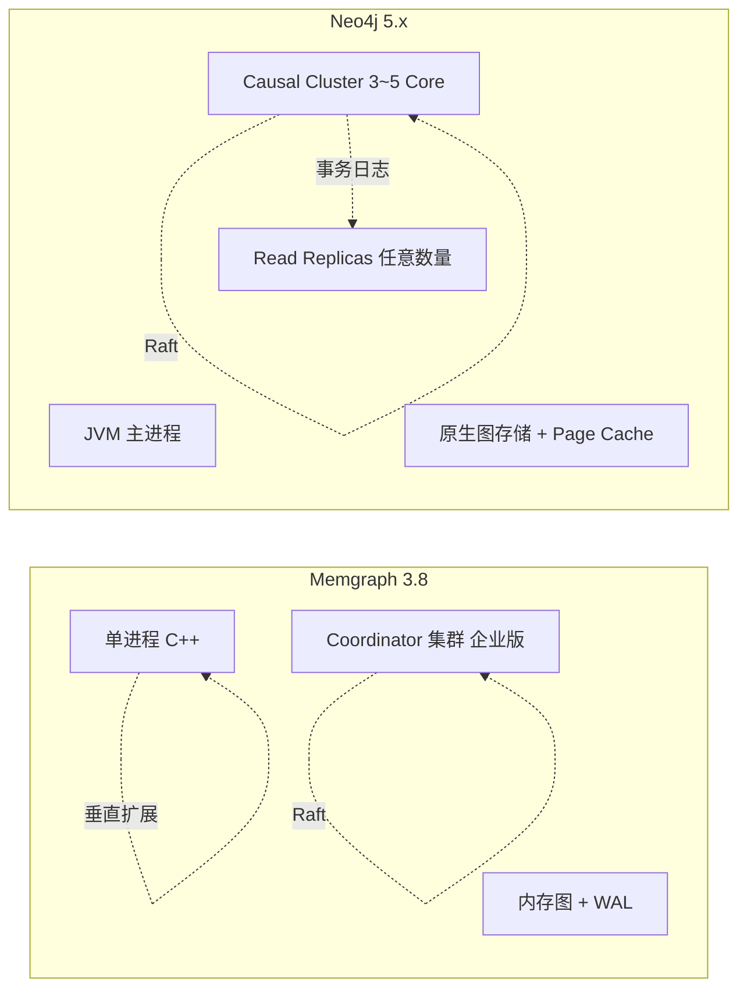
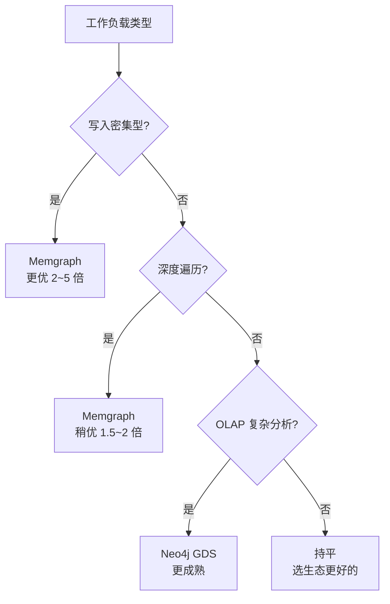
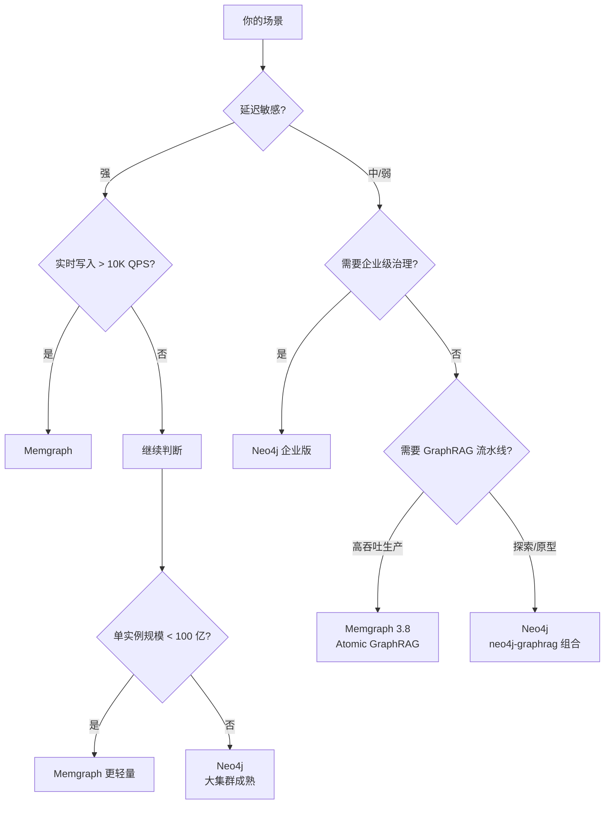

# Memgraph vs Neo4j 对比报告（2026 年版）

> **报告时间**：2026 年 8 月
> **对比对象**：Memgraph 3.8.x vs Neo4j 5.26 LTS（5.x 系列最终 LTS，维护至 2028 年 6 月）/ Neo4j 2026.x 新特性系列
> **对比维度**：架构、性能、生态、Python 支持、部署运维、AI / GraphRAG、成本、适用场景
> **适用读者**：正在评估图数据库选型的架构师、技术负责人、后端 / AI 工程师

## 0. 执行摘要

Memgraph 与 Neo4j 都是兼容 openCypher 与 Bolt 协议的原生图数据库，但在架构哲学、目标场景和商业模型上有明显差异。本报告基于 2026 年的最新发布版本，对两者进行系统性对比。

**核心结论（TL;DR）**：

| 维度 | Memgraph 3.8 | Neo4j 5.26 LTS / 2026.x |
|------|--------------|--------------------------|
| **核心定位** | 内存优先、C++ 内核、实时分析 + AI | 通用 OLTP/OLAP、JVM、全栈企业图平台 |
| **典型性能优势** | 写入 41× 低延迟、3~8× 高吞吐 [1] | 大集群、生态成熟、OLAP 能力强 |
| **架构差异** | 单进程（可垂直扩展），C++ 无 GC | DBMS + Causal Cluster，Raft 共识 |
| **Python 集成** | 兼容 Neo4j 驱动 + GQLAlchemy OGM + langchain-memgraph | 官方 neo4j-driver + graphdatascience + neo4j-graphrag |
| **AI 创新** | Atomic GraphRAG、Vector Single Store、Parallel Runtime | 5.26 LTS 稳定 + 2026.x 向量索引与 SEARCH clause |
| **云服务** | Memgraph Cloud（AWS 6 区，最大 32GB / 8 核） | AuraDB（Free / Pro / Business Critical / VDC）[2] |
| **许可证** | 社区版（AGPLv3）+ 企业版 | 社区版（GPLv3）+ 企业版 |
| **推荐场景** | 实时风控、流图分析、嵌入式 AI Agent | 通用 OLTP、企业混合负载、严格治理 |

**一句话总结**：选 Memgraph 当你需要**极致写入性能与低延迟**；选 Neo4j 当你需要**成熟生态、企业治理、跨数据库联邦**或已经押注其全栈工具。

## 1. 引言

### 1.1 为什么写这份报告

图数据库市场已从"是否使用图数据库"演进到"如何选型"。Memgraph 与 Neo4j 是两个最具代表性的选项：

- **Neo4j**：市场份额领先、Cypher 事实标准、生态最完整（自 2007 年）
- **Memgraph**：以性能和 C++ 优势突围，在实时分析与 AI 原生场景建立差异化

两者都支持 openCypher 查询语言与 Bolt 协议，**Python 代码可在两者之间几乎无缝迁移**（同一套 `neo4j` Python 驱动），这意味着技术选型本质上不是"能不能用"，而是"哪个更适合我的场景与团队"。

### 1.2 报告范围与方法

- **范围**：架构设计、开发体验（Python）、性能、生态、AI 能力、部署与成本
- **不涵盖**：多模数据库对比（如 ArangoDB）、非 openCypher 图数据库（如 TigerGraph、NebulaGraph）
- **数据来源**：官方文档、官方博客、第三方基准测试（GraphIndex、Latent Space、AIMultiple）、GitHub、社区评测 [1][3][4]

## 2. 架构对比

### 2.1 总体架构



| 维度 | Memgraph 3.8 | Neo4j 5.26 LTS |
|------|---------------|------------------|
| **运行时** | C++ 单进程，无 JVM | JVM（HotSpot/OpenJ9） |
| **核心数据结构** | 内存中的邻接表 + 属性存储 | 节点 / 关系文件（neostore.*），定长记录 + 链表 |
| **扩展模型** | 垂直扩展为主 + 集群副本 | 水平扩展（Cluster + Replicas） |
| **一致性协议** | 社区版 ASYNC/SYNC/STRICT_SYNC；企业版 Raft | Raft（Core）+ 异步事务日志（Read Replica） |
| **GC 影响** | 无 GC 抖动 | 存在 GC 影响，但通过 G1/ZGC 配置可控 |

### 2.2 存储引擎

| 存储能力 | Memgraph | Neo4j |
|---------|----------|-------|
| **默认模式** | IN_MEMORY_TRANSACTIONAL | 磁盘 + 页缓存（Page Cache） |
| **数据规模上限** | 受限于单实例内存（社区版），最大数十亿节点 | 单实例可达数十亿关系（受页缓存和堆影响） |
| **可选模式** | ON_DISK_TRANSACTIONAL（3.x） | 磁盘原生存储 |
| **持久化** | WAL + 快照（每 30 秒） | WAL + 检查点 |
| **属性类型丰富度** | int/float/str/bool/list/map/Duration/Date | 同 + Point、Zoned Temporal |

### 2.3 查询引擎

| 能力 | Memgraph | Neo4j |
|------|----------|-------|
| **查询语言** | openCypher + 动态图算法扩展 | openCypher + Cypher 5（GQL 标准） |
| **编译器** | 解析 → 语义 → 逻辑计划 → 物理计划（带成本模型） | Cypher 5：解析 → AST → 重写规则 → 代价模型 → JIT |
| **EXISTS 子查询** | ✅ | ✅（Cypher 5 标准） |
| **计划缓存** | ✅ | ✅ |
| **并行执行** | ✅（3.8 Parallel Runtime） | ✅（部分算子并行） |
| **向量化执行** | ❌ | ❌ |

## 3. 性能对比

性能对比是选型中最敏感的维度，但也是最容易被营销话术扭曲的维度。本节综合官方白皮书与第三方独立基准，给出**多角度**判断。

### 3.1 Memgraph 官方基准

Memgraph 在 2025 年发布的白皮书 [1] 中宣称：

- 延迟低 **41 倍**
- 吞吐高 **3~8 倍**
- 内存占用低 **30%~50%**

> **注意**：该白皮书使用 Memgraph 自研的 `Benchgraph` 工具，硬件与配置均经过调优。

### 3.2 独立第三方基准

#### AIMultiple（2026 年 4 月）[3]

测试数据集：12 万 Amazon 评论（381K 节点 / 804K 边），12 个查询模板各测 1000 次。

**结果概览**：

| 数据库 | 写入吞吐 | 查询延迟（p50） | 内存占用 | 备注 |
|--------|---------|---------------|---------|------|
| **Memgraph** | 高 | 中 | 中 | 内存优先，单进程 |
| **FalkorDB** | 最高 | 低 | 低 | Redis 衍生，超快但生态有限 |
| **Neo4j** | 中 | 中 | 中-高 | 稳定，OLAP 能力强 |

#### Latent Space（8 引擎基准，2026 年）[4]

测试场景：50 并发 RPS。

```
Phase 5 (JMeter):
  MemGraph: 5,881 RPS
  Neo4j:    5,442 RPS  (差距 8%)

Phase 6 (Go driver):
  MemGraph: 22,462 RPS
  Neo4j:    14,541 RPS  (差距 54%)
```

**结论**：在高度优化驱动（绕过 JMeter 开销）后，Memgraph 的吞吐优势扩大到 1.5×~2×；但**默认 Java/Python 客户端场景两者差距较小**。

#### GraphIndex GraphRAG 基准 [5]

针对 **GraphRAG 工作负载**（10M 实体）的 ingest + multi-hop + community detection：

- **ingest 吞吐**：Memgraph 与 Neo4j 表现相近，参数调优影响最大
- **多跳延迟**：Memgraph 在深度遍历上稍占优（避免 JVM JIT 冷启动开销）
- **社区检测**：Neo4j GDS 的 Louvain 实现高度优化，**纯算法性能 Neo4j 略胜**

### 3.3 综合性能判断



**实际建议**：

| 场景 | 推荐 |
|------|------|
| 实时写入 > 10K QPS | Memgraph |
| 高并发实时图遍历 | Memgraph |
| 复杂 OLAP（图算法） | Neo4j GDS |
| 大集群水平扩展 | Neo4j |
| OLTP + OLAP 混合 | Neo4j |

## 4. Python 开发体验

这是开发者最关心的维度。两者在 Python 生态上的差异比架构更微妙。

### 4.1 驱动与 SDK 对比

| 包名 | Memgraph 支持 | Neo4j 支持 | 备注 |
|------|---------------|------------|------|
| `neo4j`（Python Driver） | ✅ 直接兼容 | ✅ 官方 | Memgraph 同样支持 Bolt 协议 |
| `pymgclient`（DB-API 2.0） | ✅ Memgraph 原生 | ❌ | 仅 Memgraph |
| `gqlalchemy`（OGM） | ✅ Memgraph 官方 | ✅ 同时支持 | Memgraph 出品，但兼容 Neo4j |
| `graphdatascience`（GDS 客户端） | ❌ | ✅ Neo4j 官方 | GDS 算法调用 |
| `neo4j-graphrag` | ❌ | ✅ Neo4j 官方 | GraphRAG 检索库 |
| `langchain-neo4j` | ❌（部分） | ✅ | LangChain Neo4j 集成 |
| `langchain-memgraph` | ✅ Memgraph 出品 | ❌ | LangChain Memgraph 集成 |
| `langchain` 通用图存储 | ✅ 通过 Bolt | ✅ | 通用集成 |

### 4.2 代码迁移成本

由于共享 Bolt + openCypher，**两者的核心 CRUD 代码几乎可以 0 改动迁移**：

```python
# 这段代码同时运行在 Neo4j 和 Memgraph 上
from neo4j import GraphDatabase

driver = GraphDatabase.driver("bolt://localhost:7687", auth=("neo4j", "password"))
with driver.session() as session:
    session.run("CREATE (:Person {name: $n})", n="Alice")
```

差异点：

| 差异 | Memgraph | Neo4j |
|------|----------|-------|
| **认证默认** | 无认证（需在配置中开启） | 必须有密码 |
| **数据库选择** | 社区版单库 | 5.x 支持多数据库 |
| **GDS 算法调用** | 通过 `CALL pagerank.get()` 等 MAGE 过程 | 通过 `gds.pageRank.stream()` Python API 或 GDS 过程 |
| **向量检索** | `vector_search()` 内置函数 + HNSW | `db.index.vector.queryNodes()` + HNSW |
| **GraphRAG 范式** | **Atomic GraphRAG**：单查询完成端到端 [6] | neo4j-graphrag：分阶段检索器组合 |

### 4.3 开发体验评分

| 维度 | Memgraph | Neo4j |
|------|----------|-------|
| **文档质量** | 中（官方文档齐全但社区资料少） | 高（最丰富的文档与教程） |
| **示例代码量** | 中 | 高（Neo4j GraphAcademy 免费课程） |
| **LangChain 集成** | ✅ 但独立包 | ✅ 主流 LangChain 集成 |
| **可视化工具** | Memgraph Lab（简洁） | Bloom（企业级）+ Browser（基础） |
| **笔记本友好度** | ✅ Jupyter 教程齐全 | ✅ 也有 notebook |
| **错误信息可读性** | 中 | 高 |

## 5. AI 与 GraphRAG 对比

GraphRAG 是 2024 年以来的图数据库最大增量市场。两者在 AI 能力上的设计哲学差异明显。

### 5.1 核心差异

| 维度 | Memgraph 3.8 | Neo4j 5.26 LTS / 2026.x |
|------|--------------|--------------------------|
| **GraphRAG 范式** | **Atomic GraphRAG**：向量召回 + 图扩展 + 重排 + Prompt 拼接，在单个 Cypher 查询中完成 [6] | **neo4j-graphrag**：分阶段检索器（VectorCypherRetriever / Text2CypherRetriever）组合 |
| **优势** | 减少网络往返、流水线在 DB 内执行 | 模块化、可灵活组合不同检索策略 |
| **向量索引** | Single Store 模式，节省约 85% 向量内存 | 完整 HNSW，支持 cosine / euclidean |
| **混合检索** | `vector_search()` + Cypher 联合 | `db.index.vector.queryNodes()` + Cypher 联合 |
| **Text2Cypher** | 通过 LangChain `MemgraphQAChain` | 原生 `GraphCypherQAChain`，2026.x 引入 SEARCH clause + in-index filtering |
| **实体抽取** | `add_documents()` 自动 LLM 抽取 | 同等能力，需自行构建 |

### 5.2 Atomic GraphRAG 工作流

Memgraph 3.8 的杀手锏是 "把 GraphRAG 流水线压成单次 Cypher 调用"。伪代码示例：

```cypher
// 单个查询内完成：向量召回 → 图扩展 → 重排 → Prompt 拼装
WITH $user_question AS query
WITH collect {
    // 1. 向量召回
    MATCH (d:Document)
    USING VECTOR INDEX doc_embedding FOR (d.embedding)
    WHERE vector.similarity(d.embedding, $query_embedding) > 0.7
    RETURN d LIMIT 20
  } AS seeds,
  query AS q
// 2. 图扩展（2 跳邻居）
UNWIND seeds AS s
MATCH (s)-[*1..2]-(related)
WITH collect(DISTINCT related) AS context, s
// 3. 拼装 Prompt
RETURN 'Question: ' + q + '\n\nContext: ' + apoc.text.join([c IN context | c.text], '\n---\n') AS prompt
```

### 5.3 Neo4j GraphRAG 工作流

Neo4j 的范式更"组合式"：

```python
from neo4j_graphrag.retrievers import VectorCypherRetriever

retriever = VectorCypherRetriever(
    driver=driver,
    index_name="movie_embedding",
    retrieval_query="""
        // 向量召回 + 图扩展
        MATCH (node)<-[r:RATED]-(user)
        RETURN node.title, user.name, r.rating
    """,
    embedder=embedder,
)
```

两者没有绝对优劣：**Atomic GraphRAG 适合延迟敏感、流水线稳定的生产场景；组合式更适合探索阶段或需要复杂策略的场景**。

## 6. 集群与高可用

| 能力 | Memgraph | Neo4j |
|------|----------|-------|
| **集群协议** | 企业版 Raft（Coordinator） | Core 间 Raft + Read Replica 异步 |
| **社区版 HA** | MAIN + REPLICAs（无自动故障转移） | ❌（单实例） |
| **自动故障转移** | ✅ 企业版 | ✅（Raft Leader 选举） |
| **读扩展** | 副本只读 | Read Replicas 水平扩展 |
| **跨数据中心** | 通过复制拓扑 | 通过 Read Replicas 拓扑 |
| **企业版水平扩展** | ❌（社区版限集群规模） | ✅ |

**判断**：Neo4j 在生产级集群成熟度上明显领先；Memgraph 适合中小规模（社区版）或愿意付费的企业版用户。

## 7. 部署与运维

| 维度 | Memgraph | Neo4j |
|------|----------|-------|
| **Docker 镜像** | 官方 `memgraph/memgraph` + `memgraph/memgraph-mage` | 官方 `neo4j:5.26` |
| **Kubernetes** | Memgraph Operator（企业） | Neo4j Helm Chart（官方 + 社区） |
| **备份** | 快照 + WAL 复制 | 企业版在线备份；社区版离线 |
| **监控** | Memgraph Lab + Prometheus 集成 | Prometheus + JMX + 自有指标 |
| **升级路径** | 滚动升级（企业版） | 滚动升级（Cluster） |

## 8. 成本与许可证

### 8.1 云服务定价

| 服务 | Memgraph Cloud | Neo4j AuraDB |
|------|----------------|--------------|
| **免费层** | 试用（社区版本地） | AuraDB Free：单实例 ≤200K 节点 + 400K 关系 |
| **专业版** | Enterprise 实例：按内存 GB 计费，无查询/计算/副本额外费 | AuraDB Professional：$65/GB/月起，14 天试用 |
| **最大规模** | 32GB RAM / 8 CPU（Cloud） | 弹性扩展 |
| **定价模型** | 内存 GB（包含算法、向量、HA） | 内存 + 计算 + 副本（按容量） |

### 8.2 自托管许可证

| 版本 | Memgraph | Neo4j |
|------|----------|-------|
| **社区版** | AGPLv3 | GPLv3 |
| **企业版** | 商业许可 | 商业许可 |
| **核心限制** | 集群规模、HA、复制策略受限 | 集群、细粒度权限、Composite、备份受限 |

**判断**：Neo4j 社区版起步更友好（成熟、文档全）；Memgraph 社区版性能更强，但高级特性需付费。

## 9. 适用场景决策树



### 9.1 明确推荐 Memgraph 的场景

- **实时风控/反欺诈**：毫秒级延迟、写入密集、环检测
- **流式图分析**：社交网络实时影响力、推荐
- **AI Agent 记忆层**：低延迟、Atomic GraphRAG、内嵌向量
- **嵌入式分析**：作为单体服务嵌入到更大系统中，单进程优势
- **写吞吐敏感**：>10K QPS 持续写入
- **中小规模生产**：单实例或小集群够用，社区版可起步

### 9.2 明确推荐 Neo4j 的场景

- **大型企业 OLTP + OLAP 混合负载**：Causal Cluster 成熟
- **严格治理与多租户**：角色级权限、多数据库隔离、Composite DB
- **跨数据源联邦查询**：Composite DB 联邦多个标准数据库
- **强 OLAP 图算法**：GDS 库完整，60+ 算法成熟
- **海量生态集成**：已有大量 Neo4j 教程、工具、合作伙伴
- **生产级备份恢复**：企业版在线备份与时间点恢复

### 9.3 决策矩阵

| 关键问题 | 倾向 Memgraph | 倾向 Neo4j |
|---------|--------------|-----------|
| 你的团队有 JVM/Scala 经验？ | ❌ | ✅ |
| 你的延迟预算 < 10ms？ | ✅ | ❌ |
| 你需要 60+ 算法的 GDS？ | ❌ | ✅ |
| 你需要原子化 GraphRAG？ | ✅ | ❌ |
| 你需要 Composite DB 联邦？ | ❌ | ✅ |
| 你想用最少的代码改动迁移到 GQL 标准？ | ✅ | ✅（两者都支持） |

## 10. 风险与限制

### 10.1 Memgraph 的风险

- **市场认知度低**：人才市场熟练度低于 Neo4j，招聘更难
- **企业版付费门槛**：HA / 集群 / CDC 等关键能力需企业版
- **生态相对薄弱**：第三方工具、BI 集成比 Neo4j 少
- **JVM/大数据集成少**：Hadoop、Spark Connector 不如 Neo4j 完善

### 10.2 Neo4j 的风险

- **JVM GC 影响**：大堆下 GC 暂停可能影响 P99 延迟
- **资源占用高**：同等数据量内存占用通常高于 Memgraph
- **企业版功能锁定**：很多关键能力（Cluster、Backup、细粒度权限）需付费
- **新版本迁移成本**：5.x → 2026.x 涉及存储格式与 API 演进

### 10.3 共同风险

- **GQL 标准还在演进**：跨数据库迁移在某些细节（如自定义过程、扩展语法）仍需改写
- **图模型学习曲线**：建模者需要从关系型思维转向图思维
- **超大规模图（>100B 边）**：两者都不擅长，需考虑 NebulaGraph / TigerGraph / Spark GraphFrames

## 11. 总结

Memgraph 与 Neo4j 都是成熟的图数据库产品。**选哪个不取决于技术能力上限，而取决于业务场景与团队约束**：

- 选 **Memgraph** 当你需要：极致写入性能、低延迟、AI 原生、嵌入式部署
- 选 **Neo4j** 当你需要：成熟生态、企业治理、大规模集群、跨库联邦

> 不要陷入"性能数字"陷阱：基准差异在生产环境中往往被业务逻辑、索引设计、查询模式等吞噬。**先用 Neo4j 跑通业务，再用 Memgraph 优化延迟**，或者反过来——先用 Memgraph 验证图模型可行性，再决定是否迁移到 Neo4j 企业版——都不失为稳健策略。

## 附录 A：参考基准与方法

| 来源 | 类型 | 数据规模 | 测试时间 | 备注 |
|------|------|---------|---------|------|
| Memgraph 白皮书 [1] | 官方 | 千万级 | 2025 | 厂商自有 Benchgraph 工具 |
| AIMultiple [3] | 独立 | 38 万节点 | 2026.04 | 三方对比，含 FalkorDB |
| Latent Space [4] | 独立 | 多规模 | 2026 | 8 引擎横向对比 |
| GraphIndex [5] | 独立 | 10M 实体 | 2026 | GraphRAG 工作负载专项 |

## 附录 B：迁移路径建议

### B.1 Neo4j → Memgraph

1. **Cypher 兼容层验证**：Memgraph 支持 openCypher + 大部分 Neo4j 扩展，但企业版 `SHOW` 命令、GDS 过程需替换
2. **驱动层零改动**：`neo4j` Python 驱动连接 Memgraph
3. **数据迁移**：使用 `neo4j-admin dump` + Memgraph `mgconsole` 配合 Cypher 重放
4. **API 替换**：GDS 过程 → MAGE 过程；`db.index.vector.queryNodes()` → `vector_search()`

### B.2 Memgraph → Neo4j

1. **Cypher 兼容**：反向通常更顺，Neo4j 是 openCypher 主导方
2. **数据迁移**：通过 `mgconsole` dump + `neo4j-admin load`
3. **API 替换**：MAGE 过程 → GDS 过程；`vector_search()` → `db.index.vector.queryNodes()`

## 附录 C：参考资源

### 官方文档

- [Memgraph 文档](https://memgraph.com/docs/)
- [Neo4j 5 文档](https://neo4j.com/docs/operations-manual/5/)
- [Neo4j Python Driver](https://neo4j.com/docs/python-manual/current/)

### 性能与基准

- [Memgraph vs Neo4j 性能白皮书](https://memgraph.com/white-paper/performance-benchmark-graph-databases)
- [AIMultiple Graph Database Benchmark](https://aimultiple.com/graph-databases)
- [GraphIndex Neo4j vs Memgraph vs Kuzu Benchmark](https://graphindex.io/blog/neo4j-memgraph-kuzu-benchmark)

### AI / GraphRAG

- [Memgraph GraphRAG](https://memgraph.com/graphrag)
- [Neo4j GraphRAG for Python](https://neo4j.com/docs/neo4j-graphrag-python/current/)
- [Atomic GraphRAG Demo](https://memgraph.com/blog/atomic-graphrag-demo-highlights)

### 定价与许可证

- [Memgraph 定价](https://memgraph.com/pricing)
- [Neo4j 定价](https://neo4j.com/pricing/)

## 参考来源

[1] Memgraph 官方性能白皮书，2025。<https://memgraph.com/white-paper/performance-benchmark-graph-databases>

[2] Neo4j AuraDB 定价，2026。<https://neo4j.com/pricing/>

[3] AIMultiple Graph Database Benchmark，2026 年 4 月。<https://aimultiple.com/graph-databases>

[4] Latent Space 8 引擎图数据库基准，2026。<https://jaesolshin.com/posts/graph-db-benchmark-8-engines/>

[5] GraphIndex Neo4j vs Memgraph vs Kuzu GraphRAG Benchmark，2026。<https://graphindex.io/blog/neo4j-memgraph-kuzu-benchmark>

[6] Memgraph Atomic GraphRAG 发布博客，2026 年 2 月。<https://memgraph.com/blog/memgraph-3-8-release-atomic-graphrag-vector-single-store-parallel-runtime>
