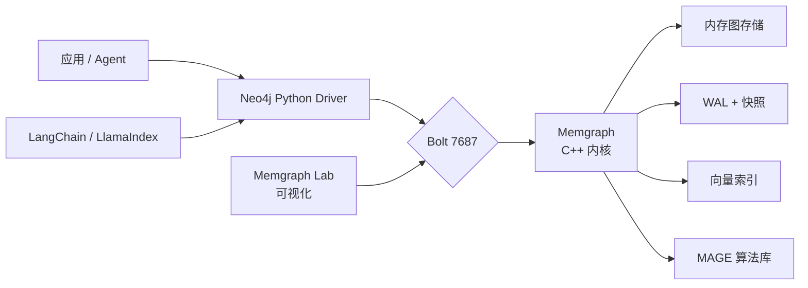
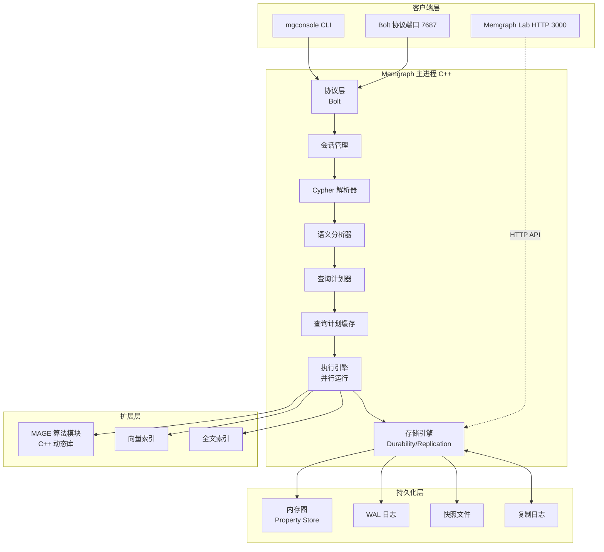
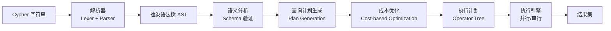
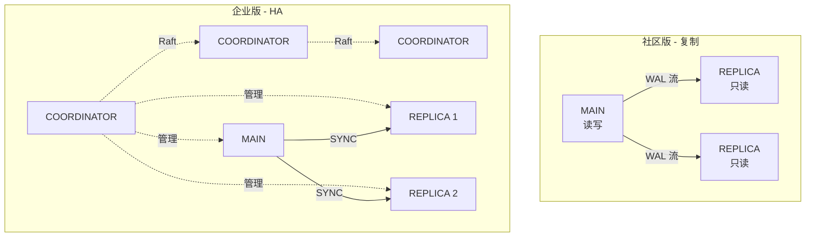

# Memgraph 架构设计与 Python 开发入门教程

> 本文系统介绍 Memgraph 图数据库的核心架构、部署方式与 Python 开发实践。Memgraph 是面向实时分析场景、用 C++ 编写的内存优先（in-memory first）图数据库，截至 2026 年 8 月，最新稳定版本为 3.8.x（2026 年 2 月发布），引入了 Atomic GraphRAG、Vector Single Store 与 Parallel Runtime 三大新特性 [1]。

## 一、为什么选择 Memgraph

在图数据库选型中，Memgraph 的核心定位是 **"实时分析 + 高吞吐 + AI 原生"**，与 Neo4j 的"通用 OLTP/混合负载"定位形成互补。理解其架构决策，需要从它的设计目标说起：

| 设计目标 | Memgraph 的取舍 |
|---------|---------------|
| 毫秒级延迟 | 内存优先存储，C++ 原生编译，避免 JVM GC 抖动 |
| 高并发写入 | 无锁数据结构 + 细粒度锁，支持超级节点并发写入 |
| 图算法与 AI | 内置动态图算法、MAGE 算法库、向量索引、GraphRAG |
| 标准兼容性 | 支持 openCypher、Bolt 协议、Neo4j 驱动可直接连接 |

下图给出了 Memgraph 在现代数据栈中的典型位置：



## 二、Memgraph 架构详解

### 2.1 总体架构

Memgraph 采用单体（monolithic）进程架构，所有组件（存储、查询引擎、执行器、协议层）都在同一 C++ 进程中，通过共享内存通信，避免了进程间序列化开销 [2]。



**关键设计要点**：

- **单进程**：Memgraph 故意不做"无状态层 + 存储层"分离。这避免了分布式共识带来的延迟，但也意味着扩展主要是**垂直扩展**（垂直加核 + 加内存），水平扩展通过复制集群实现。
- **C++ 内核**：相比 Neo4j 的 JVM 实现，消除了 GC 暂停，内存占用通常低 30%~50%（官方性能白皮书数据）[3]。
- **就地更新**：属性变更直接修改内存中的节点/边对象，对延迟敏感场景友好。

### 2.2 存储引擎与存储模式

Memgraph 提供**三种存储模式**，可通过配置切换：

| 模式 | 特点 | 适用场景 |
|------|------|---------|
| `IN_MEMORY_TRANSACTIONAL`（默认） | 强一致 ACID，WAL + 快照，导入需要更多时间和资源 | 生产环境的常规负载 |
| `IN_MEMORY_ANALYTICAL` | 允许模式变更，导入更快，适合 ETL 阶段 | 大批量数据导入、ETL |
| `ON_DISK_TRANSACTIONAL` | 数据落盘，内存占用小，但吞吐略低 | 超大规模图（>单机内存） |

**持久化机制**：

- **WAL（Write-Ahead Log）**：每个事务在提交前先追加到磁盘日志，保证崩溃恢复能力。
- **快照（Snapshot）**：周期性将内存图序列化到磁盘，作为 WAL 的 checkpoint。
- **触发条件**：快照间隔可配置（默认每 30 秒一次），也可手动触发 `CREATE SNAPSHOT`。

```cypher
-- 手动触发快照
CREATE SNAPSHOT;

-- 查看快照信息
SHOW SNAPSHOTS;

-- 恢复到最新快照
RECOVER SNAPSHOT LATEST;
```

**节点与边的物理存储**：

Memgraph 采用**属性存储（Property Store）+ 邻接列表**的混合方案：

- 每个节点保存其邻接边的物理指针（**免索引邻接**，Index-Free Adjacency）
- 邻居查询时间复杂度 **O(1)**，与图规模无关
- 属性按类型（int/str/list/map）紧凑编码，减少内存碎片

### 2.3 查询处理流水线

Cypher 查询经过 5 个阶段处理 [4]：



**几个关键概念**：

1. **逻辑计划 → 物理计划**：Memgraph 内部维护了一套丰富的逻辑算子（`ScanAll`、`Filter`、`Expand`、`HashJoin` 等），通过成本模型转换为物理算子。
2. **计划缓存**：相同 Cypher 字符串（参数化版本）第二次执行时复用缓存的物理计划，跳过优化阶段，显著降低延迟。
3. **索引感知**：执行器优先使用 `ScanAllByLabel`、`ScanAllByLabelPropertyRange` 等索引感知的算子，避免全图扫描。

**索引类型**：

```cypher
-- Label 索引
CREATE INDEX ON :Person(id);

-- Label + Property 索引
CREATE INDEX ON :Person(name);

-- 边索引
CREATE EDGE INDEX ON :KNOWS(since);

-- 复合索引（多属性）
CREATE INDEX ON :Person(name, age);

-- 向量索引（Memgraph 3.0+）
CREATE VECTOR INDEX vec_idx ON :Document(embedding) WITH DIMENSION 1536, TYPE "hnsw";
```

索引会加速读但**降低写吞吐**（每次写入需更新索引），按需创建。

### 2.4 高可用与复制

Memgraph 提供两种集群方案 [5]：



**复制模式**（社区版）：

| 模式 | 行为 | 一致性 vs 性能 |
|------|------|---------------|
| `ASYNC` | MAIN 提交后立即返回，不等待 REPLICA | 高吞吐、最终一致 |
| `SYNC` | 等待至少一个 REPLICA 确认 | 平衡 |
| `STRICT_SYNC` | 等待所有 REPLICA 确认 | 强一致，延迟较高 |

**企业版 HA** 增加了：

- 通过 Raft 协议选举新 MAIN（自动故障转移）
- Coordinator 节点负责集群状态
- 客户端通过 Bolt 路由协议自动发现 MAIN

### 2.5 Memgraph 3.8 的重大更新

2026 年 2 月发布的 3.8 版本带来三项关键能力 [1]：

| 特性 | 解决的问题 | 实现方式 |
|------|----------|---------|
| **Atomic GraphRAG** | GraphRAG 流水线跨多服务、多轮查询的开销 | 将向量召回、图扩展、重排序、Prompt 拼接合并为单个 Cypher 查询，数据库内一次性执行 |
| **Vector Single Store** | 顶点与边的向量索引数据重复存储，浪费内存 | 只在边属性中存储 `VectorIndexId`，元数据统一管理，可节省约 85% 向量内存 |
| **Parallel Runtime** | 单线程执行引擎在高核数服务器上浪费算力 | 多线程并行执行独立算子，提升复杂查询吞吐 |

## 三、快速开始：本地部署 Memgraph

### 3.1 使用 Docker 部署

最快的方式是使用官方 Docker 镜像 [6]：

```bash
# 仅启动数据库
docker run -d --name memgraph \
  -p 7687:7687 \
  -p 7444:7444 \
  memgraph/memgraph:latest

# 启动完整平台（含 Lab、MAGE、mgconsole）
docker run -d --name memgraph-mage \
  -p 7687:7687 \
  -p 7444:7444 \
  -p 3000:3000 \
  memgraph/memgraph-mage:latest

# 浏览器访问 Memgraph Lab
# http://localhost:3000
```

**Docker Compose 一致部署**（推荐生产/团队环境）：

```yaml
# docker-compose.yml
version: "3.8"
services:
  memgraph:
    image: memgraph/memgraph:latest
    container_name: memgraph
    ports:
      - "7687:7687"      # Bolt
      - "7444:7444"      # HTTP (Lab API)
    volumes:
      - mg-data:/var/lib/memgraph
    environment:
      - MEMGRAPH_USER=""
      - MEMGRAPH_PASSWORD=""
    restart: unless-stopped

  memgraph-lab:
    image: memgraph/memgraph-lab:latest
    container_name: memgraph-lab
    ports:
      - "3000:3000"
    depends_on:
      - memgraph
    restart: unless-stopped

volumes:
  mg-data:
```

### 3.2 安装 Python 客户端

Memgraph 兼容 Bolt 协议与 openCypher，因此**既可以使用官方 pymgclient，也可以直接使用 Neo4j 的 Python 驱动**。推荐两种方式：

```bash
# 方式 1：Neo4j Python 驱动（最常用，社区资料多）
pip install neo4j

# 方式 2：GQLAlchemy（对象图映射 OGM，支持 Memgraph 与 Neo4j）
pip install gqlalchemy

# 方式 3：Memgraph 原生 C 扩展客户端（DB-API 2.0 标准）
pip install pymgclient
```

## 四、Cypher 查询语言基础

虽然 Memgraph 兼容 openCypher，但 3.8 引入了部分扩展语法。先掌握基础：

### 4.1 CRUD 基础

```cypher
-- 创建节点
CREATE (:Person {name: 'Alice', age: 30});
CREATE (:Person {name: 'Bob', age: 28});

-- 创建带标签的节点
CREATE (a:Person {name: 'Charlie'})-[:KNOWS {since: 2020}]->(b:Person {name: 'David'});

-- 匹配 + 更新
MATCH (p:Person {name: 'Alice'})
SET p.age = 31
RETURN p;

-- 匹配 + 删除
MATCH (p:Person {name: 'Bob'})
DETACH DELETE p;  -- DETACH 同时删除关系

-- MERGE：存在则匹配，不存在则创建
MERGE (p:Person {email: 'alice@example.com'})
ON CREATE SET p.createdAt = timestamp()
RETURN p;
```

### 4.2 模式匹配与遍历

```cypher
-- 朋友的朋友（二度关系）
MATCH (a:Person {name: 'Alice'})-[:KNOWS]->(:Person)-[:KNOWS]->(fof:Person)
RETURN DISTINCT fof.name;

-- 最短路径
MATCH p = shortestPath(
  (a:Person {name: 'Alice'})-[:KNOWS*..6]-(b:Person {name: 'Eve'})
)
RETURN p;

-- 聚合
MATCH (p:Person)-[:LIVES_IN]->(c:City)
RETURN c.name, count(p) AS population
ORDER BY population DESC;
```

### 4.3 Memgraph 特有的 Cypher 扩展

```cypher
-- 内存分析模式切换（仅 IN_MEMORY_TRANSACTIONAL 支持）
STORAGE MODE IN_MEMORY_ANALYTICAL;

-- 显式触发持久化
CREATE SNAPSHOT;

-- 图算法调用（依赖 MAGE 库）
CALL pagerank.get() YIELD node, rank
RETURN node.name, rank
ORDER BY rank DESC
LIMIT 10;

-- 动态图算法：实时计算连通分量
CALL community_detection.get()
YIELD node, component_id
RETURN component_id, count(*) AS size
ORDER BY size DESC;
```

## 五、Python 开发实战

### 5.1 使用 Neo4j Python Driver（推荐）

Memgraph 与 Neo4j 共享 Bolt 协议与 openCypher，因此可使用 Neo4j 官方 Python 驱动 [7]：

```python
# connect.py
from neo4j import GraphDatabase

URI = "bolt://localhost:7687"

with GraphDatabase.driver(URI, auth=("", "")) as driver:
    # 健康检查
    driver.verify_connectivity()

    # 自动事务管理
    with driver.session() as session:
        # 写入
        session.execute_write(_create_friends)
        # 读取
        people = session.execute_read(_get_friends, name="Alice")
        print(people)


def _create_friends(tx):
    tx.run("""
        MERGE (a:Person {name: 'Alice'})
        MERGE (b:Person {name: 'Bob'})
        MERGE (a)-[:KNOWS {since: 2020}]->(b)
    """)


def _get_friends(tx, name):
    result = tx.run("""
        MATCH (p:Person {name: $name})-[:KNOWS]->(friend)
        RETURN friend.name AS name
    """, name=name)
    return [record["name"] for record in result]
```

### 5.2 参数化查询与结果处理

```python
# parameter_query.py
from neo4j import GraphDatabase

URI = "bolt://localhost:7687"


def main():
    driver = GraphDatabase.driver(URI, auth=("", ""))

    with driver.session() as session:
        # 参数化查询（避免 Cypher 注入）
        result = session.run(
            """
            MATCH (p:Person)
            WHERE p.age >= $min_age AND p.city = $city
            RETURN p.name AS name, p.age AS age
            ORDER BY age DESC
            """,
            min_age=25,
            city="Beijing"
        )

        # 处理节点对象
        for record in result:
            node = record.get("p") if "p" in record else None
            if node:
                print(f"name={node['name']}, age={node['age']}, "
                      f"labels={list(node.labels)}, "
                      f"element_id={node.element_id}")

        # 获取摘要信息（统计/通知）
        summary = result.consume()
        print(f"Query: {summary.query}")
        print(f"Nodes added: {summary.counters.nodes_created}")
        print(f"Relationships added: {summary.counters.relationships_created}")

    driver.close()


if __name__ == "__main__":
    main()
```

### 5.3 异步 API

对于高并发场景，推荐异步驱动 [8]：

```python
# async_query.py
import asyncio
from neo4j import AsyncGraphDatabase


async def main():
    driver = AsyncGraphDatabase.driver("bolt://localhost:7687", auth=("", ""))

    async with driver.session() as session:
        # 异步读写
        await session.execute_write(_create_person, name="Charlie", age=30)
        people = await session.execute_read(_get_people, min_age=20)
        print(people)

    await driver.close()


async def _create_person(tx, name, age):
    await tx.run(
        "MERGE (p:Person {name: $name}) SET p.age = $age",
        name=name, age=age
    )


async def _get_people(tx, min_age):
    result = await tx.run(
        "MATCH (p:Person) WHERE p.age >= $min_age RETURN p.name AS name",
        min_age=min_age
    )
    return [record["name"] async for record in result]


asyncio.run(main())
```

### 5.4 事务管理与冲突处理

Memgraph 与 Neo4j 同样支持显式事务，处理并发写冲突需要手动重试 [7]：

```python
# transaction_retry.py
from neo4j import GraphDatabase, exceptions

URI = "bolt://localhost:7687"


def transfer(driver, from_name, to_name, amount):
    """转账场景：演示写冲突重试"""
    with driver.session() as session:
        while True:
            try:
                session.execute_write(
                    _do_transfer, from_name, to_name, amount
                )
                return
            except exceptions.TransientError as e:
                print(f"写入冲突，1 秒后重试: {e}")
                import time
                time.sleep(1)


def _do_transfer(tx, from_name, to_name, amount):
    # 检查余额
    result = tx.run(
        "MATCH (p:Person {name: $name}) RETURN p.balance AS balance",
        name=from_name
    )
    record = result.single()
    if not record or record["balance"] < amount:
        raise ValueError(f"{from_name} 余额不足")

    # 扣款
    tx.run(
        "MATCH (p:Person {name: $name}) SET p.balance = p.balance - $amount",
        name=from_name, amount=amount
    )
    # 加款
    tx.run(
        "MATCH (p:Person {name: $name}) SET p.balance = p.balance + $amount",
        name=to_name, amount=amount
    )


if __name__ == "__main__":
    driver = GraphDatabase.driver(URI, auth=("", ""))
    try:
        # 初始化
        with driver.session() as session:
            session.run("""
                MERGE (a:Person {name: 'Alice'}) SET a.balance = 100
                MERGE (b:Person {name: 'Bob'})   SET b.balance = 50
            """)

        transfer(driver, "Alice", "Bob", 30)
        print("转账成功")
    finally:
        driver.close()
```

### 5.5 使用 GQLAlchemy OGM

如果更喜欢 ORM 风格的开发，GQLAlchemy 提供了 Python 类与图节点/边的映射 [9]：

```python
# models.py
from gqlalchemy import Memgraph, Node, Relationship


# 定义节点类型
class Person(Node):
    name: str
    age: int = 0


class City(Node):
    name: str


class Company(Node):
    name: str


# 定义关系类型
class Knows(Relationship):
    since: int


class LivesIn(Relationship):
    pass


class WorksAt(Relationship):
    position: str


# 连接数据库
db = Memgraph(host="127.0.0.1", port=7687)
```

```python
# crud.py
from models import db, Person, City, LivesIn, WorksAt


def main():
    # 创建节点
    alice = Person(name="Alice", age=30).save(db)
    beijing = City(name="Beijing").save(db)

    # 创建关系
    alice.lives_in.connect(beijing)

    # 通过属性匹配节点
    alice = Person(name="Alice").match_first(db)
    print(f"{alice.name}, age={alice.age}")

    # 链式遍历
    city = alice.lives_in.fetch()
    print(f"Alice lives in {city.name}")

    # 路径遍历
    for friend in Person.age >= 18:
        print(friend.name)


if __name__ == "__main__":
    main()
```

GQLAlchemy 还提供**查询构造器**，用 Python DSL 表达 Cypher 模式：

```python
# query_builder.py
from models import db, Person, Knows

# MATCH (a:Person {name: 'Alice'})-[:KNOWS]->(b:Person)
results = db.execute_and_fetch(
    """
    MATCH (a:Person {name: $name})-[:KNOWS]->(b:Person)
    RETURN b.name AS friend
    """,
    name="Alice"
)
for record in results:
    print(record["friend"])
```

### 5.6 使用 pymgclient（DB-API 2.0）

如果项目已有 DB-API 2.0 风格的数据库适配器（如 SQLAlchemy），pymgclient 可无缝接入 [10]：

```python
# dbapi_usage.py
import mgclient

# 创建连接
conn = mgclient.connect(host="127.0.0.1", port=7687)
conn.autocommit = True

# 创建游标
cursor = conn.cursor()

# 执行查询
cursor.execute("CREATE (p:Person {name: $name, age: $age})",
               {"name": "Alice", "age": 30})

cursor.execute("MATCH (p:Person {name: $name}) RETURN p", {"name": "Alice"})

# 拉取结果
for row in cursor.fetchall():
    print(row)  # row 是 (Node, Path, ...) 的元组

cursor.close()
conn.close()
```

## 六、高级特性

### 6.1 向量索引（Vector Index）

Memgraph 3.0+ 内置 HNSW 向量索引，用于语义检索和 GraphRAG [1]：

```cypher
-- 创建向量索引
CREATE VECTOR INDEX doc_vec_idx
ON :Document(embedding)
WITH DIMENSION 1536,        -- OpenAI text-embedding-3-small 维度
     TYPE "hnsw",
     CAPACITY 1000000;

-- 查询最近邻
MATCH (d:Document)
WITH collect(d) AS docs,
     vector_search(docs, $query_embedding, 5) AS similar_docs
UNWIND similar_docs AS result
RETURN result.node.title, result.score
ORDER BY result.score DESC;
```

### 6.2 MAGE 图算法库

MAGE（Memgraph Advanced Graph Extensions）提供 30+ 常用图算法 [11]。3.7+ 已合并到主仓库 [12]：

```cypher
-- PageRank
CALL pagerank.get() YIELD node, rank
RETURN node.name, round(rank * 1000) / 1000 AS score
ORDER BY score DESC
LIMIT 10;

-- 社区检测（Louvain）
CALL community_detection.get()
YIELD node, component_id
WITH component_id, collect(node.name) AS members, count(*) AS size
RETURN component_id, size, members
ORDER BY size DESC;

-- 节点相似度（Jaccard）
CALL node_similarity.jaccard()
YIELD node1, node2, similarity
WHERE similarity > 0.5
RETURN node1.name, node2.name, similarity
ORDER BY similarity DESC;

-- 最短路径
MATCH (a:City {name: 'Beijing'}), (b:City {name: 'Shanghai'})
CALL shortest_path.bfs(a, b, 5) YIELD path
RETURN path;
```

从 Python 调用：

```python
# gds_python.py
from neo4j import GraphDatabase


def run_pagerank():
    with GraphDatabase.driver("bolt://localhost:7687", auth=("", "")) as driver:
        with driver.session() as session:
            result = session.run("""
                CALL pagerank.get()
                YIELD node, rank
                RETURN node.name AS name, rank
                ORDER BY rank DESC LIMIT 10
            """)
            for record in result:
                print(f"{record['name']}: {record['rank']:.4f}")


if __name__ == "__main__":
    run_pagerank()
```

### 6.3 LangChain 集成与 GraphRAG

Memgraph 提供官方 `langchain-memgraph` 集成 [13]，配合 3.8 的 **Atomic GraphRAG**，可以在单个 Cypher 查询中完成端到端的检索流水线：

```python
# langchain_memgraph.py
import os
from langchain_openai import ChatOpenAI, OpenAIEmbeddings
from langchain_memgraph import Memgraph, MemgraphQAChain
from langchain_core.documents import Document

# 1. 连接数据库
graph = Memgraph(
    url="bolt://localhost:7687",
    username="",
    password=""
)

# 2. 写入文档（自动生成 Embedding + 抽取实体关系）
embeddings = OpenAIEmbeddings(model="text-embedding-3-small")

docs = [
    Document(
        page_content="Albert Einstein was born in 1879 in Ulm, Germany. "
                     "He developed the theory of relativity.",
        metadata={"source": "wikipedia"}
    ),
    Document(
        page_content="Marie Curie was a physicist and chemist. "
                     "She discovered polonium and radium.",
        metadata={"source": "wikipedia"}
    ),
]

# 3. 一次性构建带向量的知识图谱（Memgraph 内部完成实体抽取）
graph.add_documents(docs, embeddings=embeddings)

# 4. 自然语言问答（Text-to-Cypher + 向量召回 + 图扩展）
llm = ChatOpenAI(model="gpt-4o-mini")
chain = MemgraphQAChain.from_llm(
    llm=llm,
    graph=graph,
    embeddings=embeddings,
    verbose=True,
    allow_dangerous_requests=True,
)

answer = chain.invoke("Who developed the theory of relativity?")
print(answer["result"])
```

> 注意：`add_documents` 会自动调用 LLM 抽取实体与关系（需要配置 LLM），并创建 HNSW 向量索引。

### 6.4 流式变更订阅（Memgraph Enterprise）

监听 Cypher 触发器，使用 `STREAM` 子句订阅实时变更：

```python
# stream_changes.py
from neo4j import GraphDatabase


def listen_changes():
    """使用 execute_query 配合 SHOW STREAMS 监听"""
    with GraphDatabase.driver("bolt://localhost:7687", auth=("", "")) as driver:
        with driver.session() as session:
            # 列出所有变更流
            result = session.run("SHOW STREAMS")
            for record in result:
                print(record)


if __name__ == "__main__":
    listen_changes()
```

企业版还支持 Kafka 变更数据捕获（CDC），实时将图变更投递到 Kafka 主题供下游消费。

## 七、实战案例：欺诈环检测

以经典的"识别环转账网络"为例，展示端到端开发流程。

### 7.1 数据建模

```cypher
-- 账户节点
CREATE (a1:Account {id: 'A1', name: 'Alice'});
CREATE (a2:Account {id: 'A2', name: 'Bob'});
CREATE (a3:Account {id: 'A3', name: 'Charlie'});
CREATE (a4:Account {id: 'A4', name: 'Dave'});

-- 转账关系
CREATE (a1)-[:TRANSFER {amount: 1000, ts: timestamp()}]->(a2);
CREATE (a2)-[:TRANSFER {amount: 1100, ts: timestamp()}]->(a3);
CREATE (a3)-[:TRANSFER {amount: 900, ts: timestamp()}]->(a1);   -- 闭环！
CREATE (a3)-[:TRANSFER {amount: 500, ts: timestamp()}]->(a4);
```

### 7.2 检测环

```cypher
-- 查找所有 3 节点环
MATCH p = (a)-[:TRANSFER*3..6]->(a)
WHERE a = nodes(p)[size(p)-1]
RETURN [n IN nodes(p) | n.id] AS cycle,
       length(p) AS cycle_length;
```

### 7.3 Python 端调用

```python
# fraud_detection.py
from neo4j import GraphDatabase


def detect_cycles(uri="bolt://localhost:7687"):
    with GraphDatabase.driver(uri, auth=("", "")) as driver:
        with driver.session() as session:
            # 写入测试数据
            session.run("""
                MATCH (n) DETACH DELETE n;
                CREATE (a1:Account {id: 'A1'});
                CREATE (a2:Account {id: 'A2'});
                CREATE (a3:Account {id: 'A3'});
                CREATE (a1)-[:TRANSFER {amount: 1000}]->(a2);
                CREATE (a2)-[:TRANSFER {amount: 1100}]->(a3);
                CREATE (a3)-[:TRANSFER {amount: 900}]->(a1);
            """)

            # 检测 3 节点环
            result = session.run("""
                MATCH p = (a)-[:TRANSFER*3..6]->(a)
                WHERE a = nodes(p)[size(p)-1]
                RETURN [n IN nodes(p) | n.id] AS cycle, length(p) AS len
            """)

            for record in result:
                print(f"检测到环: {record['cycle']}, 长度: {record['len']}")


if __name__ == "__main__":
    detect_cycles()
```

## 八、生产最佳实践

### 8.1 连接管理

```python
# connection_pool.py
from neo4j import GraphDatabase

# 调整连接池大小（默认 100）
driver = GraphDatabase.driver(
    "bolt://localhost:7687",
    auth=("", ""),
    max_connection_pool_size=50,
    connection_acquisition_timeout=30,
    connection_timeout=10,
)

# Session 不是线程安全的，每个线程单独获取
import threading
from contextlib import contextmanager

@contextmanager
def get_session():
    session = driver.session()
    try:
        yield session
    finally:
        session.close()
```

### 8.2 批量导入

对于百万级以上数据导入，使用 `LOAD CSV` + UNWIND 批量插入：

```cypher
-- 创建索引提升导入速度
CREATE INDEX ON :Person(id);

-- 批量导入（推荐 10k~100k 每批）
UNWIND $batch AS row
MERGE (p:Person {id: row.id})
SET p.name = row.name, p.age = row.age;
```

Python 端：

```python
# batch_import.py
from neo4j import GraphDatabase
import csv


def batch_import(csv_path, batch_size=10_000):
    driver = GraphDatabase.driver("bolt://localhost:7687", auth=("", ""))
    with driver.session() as session:
        with open(csv_path) as f:
            reader = csv.DictReader(f)
            batch = []
            for row in reader:
                batch.append({"id": row["id"], "name": row["name"]})
                if len(batch) >= batch_size:
                    session.execute_write(_insert_batch, batch)
                    batch = []
            if batch:
                session.execute_write(_insert_batch, batch)
    driver.close()


def _insert_batch(tx, batch):
    tx.run("""
        UNWIND $batch AS row
        MERGE (p:Person {id: row.id})
        SET p.name = row.name
    """, batch=batch)
```

### 8.3 监控与调优

Memgraph 提供丰富的运行时指标 [14]：

```cypher
-- 当前会话
SHOW SESSION INFO;

-- 查询统计
SHOW QUERIES;

-- 终止慢查询
TERMINATE QUERY <id>;

-- 索引使用情况
SHOW INDEX INFO;
```

Python 端：

```python
# metrics.py
from neo4j import GraphDatabase

with GraphDatabase.driver("bolt://localhost:7687", auth=("", "")) as driver:
    with driver.session() as session:
        # 当前数据库的内存使用
        result = session.run("SHOW DATABASE INFO")
        for record in result:
            print(record)

        # 慢查询
        result = session.run("SHOW QUERIES")
        for record in result:
            if record.get("execution_time_ms", 0) > 1000:
                print(f"慢查询: {record}")
```

## 九、与 Neo4j 驱动的兼容性

由于 Memgraph 与 Neo4j 共享 Bolt 协议与 openCypher，**大量 Neo4j 的 Python 代码几乎可以无缝运行在 Memgraph 上**。但有几个差异需要注意：

| 差异点 | Neo4j | Memgraph |
|--------|-------|----------|
| 数据库管理 | `SHOW DATABASES` 支持多数据库 | 企业版多租户，社区版单数据库 |
| Fabric / Composite | 支持 | 不支持（HA 通过 Coordinator 替代） |
| 某些 openCypher 扩展 | 部分不支持（如 `EXISTS SUBQUERY`） | 支持更广（动态图算法、向量） |
| 用户自定义过程 | Neo4j 5+ APOC 集成 | MAGE 算法库 + 自定义 C++ 模块 |
| 驱动版本 | 推荐 6.x | 兼容 5.x+，6.x 部分功能 |

## 十、参考资源

### 官方文档

- [Memgraph 官方文档](https://memgraph.com/docs/)
- [Memgraph 3.8 发布说明](https://memgraph.com/docs/release-notes)
- [Memgraph Python 客户端指南](https://memgraph.com/docs/client-libraries/python)
- [查询处理系统（DeepWiki）](https://deepwiki.com/memgraph/memgraph/2-query-processing-system)

### Python 客户端

- [Neo4j Python Driver](https://neo4j.com/docs/python-manual/current/)（兼容 Memgraph）
- [GQLAlchemy（OGM）](https://memgraph.github.io/gqlalchemy/)
- [pymgclient（DB-API）](https://memgraph.github.io/pymgclient/)

### AI / GraphRAG

- [Memgraph GraphRAG 方案](https://memgraph.com/graphrag)
- [Atomic GraphRAG Demo](https://memgraph.com/blog/atomic-graphrag-demo-highlights)
- [langchain-memgraph](https://github.com/memgraph/langchain-memgraph/)

### 性能与基准

- [Memgraph vs Neo4j 性能白皮书](https://memgraph.com/white-paper/performance-benchmark-graph-databases)
- [Memgraph vs Neo4j 性能对比博客](https://memgraph.com/blog/memgraph-vs-neo4j-performance-benchmark-comparison)

### 算法与扩展

- [MAGE 算法库](https://memgraph.com/docs/advanced-algorithms)
- [MAGE GitHub](https://github.com/memgraph/mage)

## 参考来源

[1] Memgraph 3.8 发布博客，2026 年 2 月。<https://memgraph.com/blog/memgraph-3-8-release-atomic-graphrag-vector-single-store-parallel-runtime>

[2] Memgraph DeepWiki 查询处理系统。<https://deepwiki.com/memgraph/memgraph/2-query-processing-system>

[3] Memgraph 性能白皮书。<https://memgraph.com/white-paper/performance-benchmark-graph-databases>

[4] Memgraph 官方文档 - 查询计划。<https://memgraph.com/docs/querying/query-plan>

[5] Memgraph 官方文档 - 复制与高可用。<https://memgraph.com/docs/clustering/replication/how-replication-works>

[6] Memgraph Docker 安装。<https://memgraph.com/docs/getting-started/install-memgraph/docker>

[7] Memgraph 官方 Python 客户端指南。<https://memgraph.com/docs/client-libraries/python>

[8] Neo4j Python Driver 异步 API。<https://neo4j.com/docs/api/python-driver/current/async_api.html>

[9] GQLAlchemy OGM 文档。<https://memgraph.github.io/gqlalchemy/how-to-guides/ogm/>

[10] pymgclient 文档。<https://memgraph.github.io/pymgclient/usage.html>

[11] Memgraph MAGE 算法库。<https://memgraph.com/docs/advanced-algorithms>

[12] MAGE GitHub 仓库公告。<https://github.com/memgraph/mage>

[13] LangChain Memgraph 集成。<https://docs.langchain.com/oss/python/integrations/graphs/memgraph>

[14] Memgraph 监控与查询管理。<https://memgraph.com/docs/querying/show-queries>
