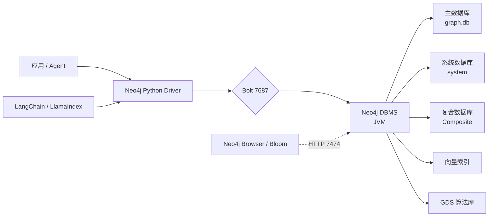
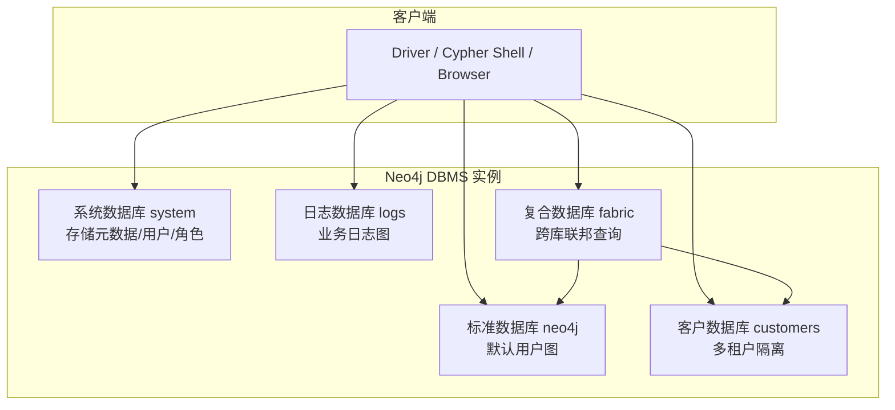
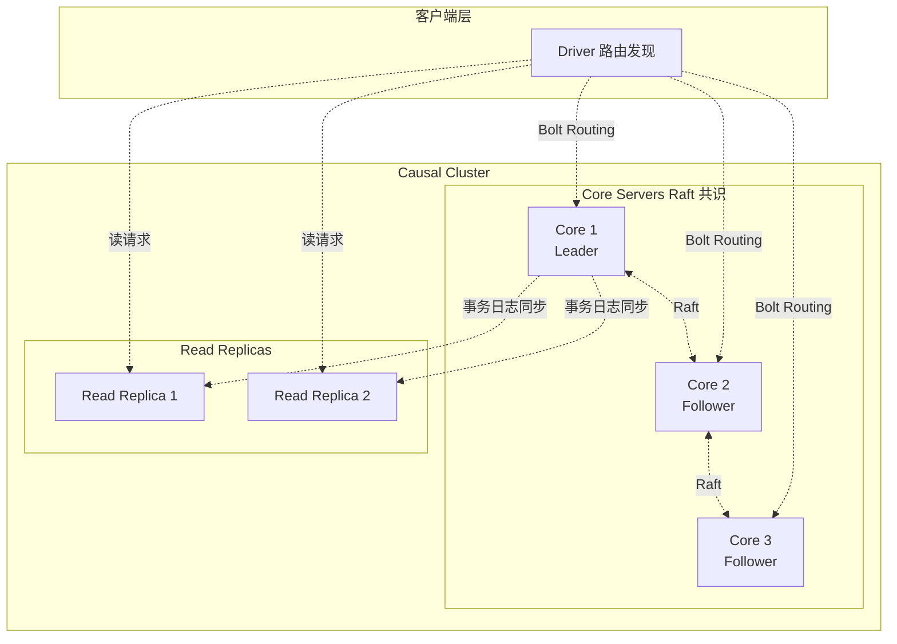
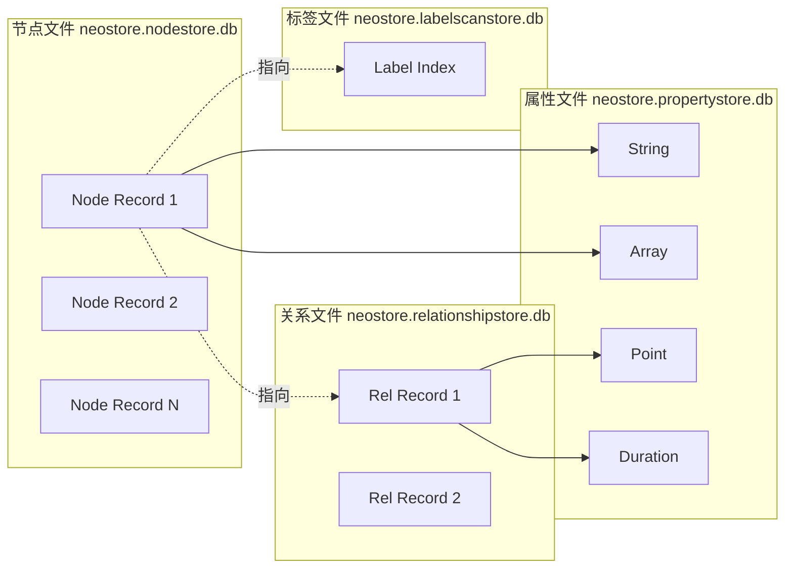
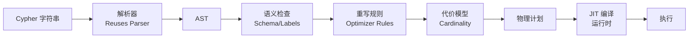

# Neo4j 架构设计与 Python 开发入门教程

> 本文系统介绍 Neo4j 图数据库的核心架构、部署方式与 Python 开发实践。Neo4j 是世界上部署最广泛的原生图数据库，截至 2026 年 8 月，**5.26 LTS**（2024 年 12 月发布）是当前长期支持版本，将持续维护至 2028 年 6 月 [1]；新特性开发进入 **2026.x** 系列（也称 Neo4j 6）。

## 一、为什么选择 Neo4j

Neo4j 在图数据库领域的地位类似关系型数据库中的 Oracle —— 起步最早（2007 年）、生态最完整、商业化最成熟、Cypher 已成为 openCypher/GQL 标准的事实基石。选择 Neo4j 的核心理由：

| 设计目标 | Neo4j 的实现路径 |
|---------|---------------|
| OLTP + OLAP 混合负载 | 单实例同时支撑事务与分析，Causal Cluster 提供水平扩展 |
| 标准化查询 | Cypher 5 是 GQL（ISO/IEC 39075）的核心 |
| 生态完整 | Bloom 可视化、Browser、GDS 图算法、GraphRAG 全栈 |
| 云原生 | AuraDB（DBaaS）+ AuraDS（专用云）+ Self-hosted 三种交付 |
| 严苛企业场景 | 强 ACID、复合索引、向量索引、Multi-Database、Composite DB |



## 二、Neo4j 架构详解

### 2.1 DBMS 与多数据库模型

Neo4j 5 引入了"**DBMS（Database Management System）**"概念。一个 DBMS 实例可以管理**多个独立数据库** [2]：



**关键概念**：

- **`system` 数据库**：管理用户、角色、权限、数据库元数据，本身不存业务数据。
- **标准数据库**：每个数据库都是一个物理目录，可独立备份、恢复、监控。
- **Composite Database（5.x 新增）**：替换 4.x 的 Fabric，统一跨数据库联邦查询的入口，本身**不存储数据**，仅作为虚拟视图。
- **Database Alias**：为物理数据库起一个或多个别名，方便平滑迁移。

### 2.2 Causal Cluster 架构

生产部署通常采用 Causal Cluster（因果一致性集群）[3]：



**三个角色**：

| 角色 | 职责 | 数量建议 |
|------|------|---------|
| **Core（Leader）** | 接收写请求，通过 Raft 协议向 Follower 复制 | 奇数（3 或 5） |
| **Core（Follower）** | 参与 Raft 共识，可在 Leader 失效时当选 | 与 Leader 同集群 |
| **Read Replica** | 异步复制事务日志，处理只读查询，水平扩展读吞吐 | 按需扩展（通常 2~10+） |

**Causal Consistency（因果一致性）**：

客户端通过 Bookmarks 机制跟踪事务因果关系，确保后续读操作能看到之前写操作的副作用。这是图数据库特有的强一致性保证。

### 2.3 存储引擎：原生图存储

Neo4j 采用**原生图存储（Native Graph Storage）**，不使用表结构：



**关键特性**：

- **节点和关系用定长记录存储**，通过 ID 直接寻址（类似 O(1) 数组访问）
- **属性使用动态长度的属性链**，支持 int、string、point、duration、list、map 等丰富类型
- **免索引邻接**：每个关系记录直接持有起点和终点节点的指针，邻居查询 O(1)
- **节点和关系文件分离**，便于独立扩展

### 2.4 查询执行与 Cypher 5

Neo4j 5.x 默认使用 **Cypher 5** 编译器（替代旧的运行时解析器），性能提升约 2-5 倍 [4]：



**Cypher 5 新增能力**：

- **EXISTS / COUNT subqueries**：子查询显式表达，提升可读性
- **COLLECT subqueries**：将子查询结果聚合为列表
- **Path pattern predicates**：在 MATCH 模式上直接应用谓词
- **`SHOW` 命令系列**：管理数据库、用户、索引、约束的统一入口

```cypher
-- EXISTS 子查询示例
MATCH (p:Person)
WHERE EXISTS {
  MATCH (p)-[:ACTED_IN]->(:Movie {genre: 'Sci-Fi'})
}
RETURN p.name;

-- 复合查询（5.x 引入）
SHOW DATABASES;
SHOW INDEXES YIELD name, type, entityType;
```

### 2.5 向量索引（Vector Index）

Neo4j 5.11+ 提供原生向量索引（基于 HNSW 算法），用于 GraphRAG 与语义检索 [5]：

```cypher
-- 创建向量索引
CREATE VECTOR INDEX movie_plots IF NOT EXISTS
FOR (m:Movie) ON (m.embedding)
OPTIONS {
  indexConfig: {
    `vector.dimensions`: 1536,
    `vector.similarity_function`: 'cosine'
  }
};
```

支持的相似度函数：`cosine`（默认）、`euclidean`。

### 2.6 GDS 图数据科学库

Neo4j Graph Data Science（GDS）是一个独立的图算法库，支持 60+ 算法 [6]：

| 类别 | 代表算法 | 应用 |
|------|---------|------|
| 中心性 | PageRank、Betweenness、ArticleRank | 影响力分析 |
| 社区检测 | Louvain、Label Propagation、Connected Components | 客户分群 |
| 路径 | Dijkstra、A*、Yen's K-Shortest | 路由规划 |
| 相似度 | Jaccard、Cosine、Node Similarity | 推荐系统 |
| 嵌入 | node2vec、FastRP、GraphSAGE | 下游 ML 任务 |
| 机器学习 | Link Prediction、Node Classification | 端到端 ML 流水线 |

## 三、快速开始：本地部署 Neo4j

### 3.1 使用 Docker 部署

Neo4j 提供官方 Docker 镜像 [7]：

```bash
# 启动社区版（社区版也支持向量索引与 GDS）
docker run -d --name neo4j \
  -p 7474:7474 \    # HTTP Browser / API
  -p 7687:7687 \    # Bolt
  -e NEO4J_AUTH=neo4j/password \
  -v neo4j-data:/data \
  neo4j:5.26
```

启动后：

- 浏览器访问 Neo4j Browser：<http://localhost:7474>
- Bolt 连接：`bolt://localhost:7687`
- 默认用户：`neo4j` / `password`

**Docker Compose 部署（推荐）**：

```yaml
# docker-compose.yml
version: "3.8"
services:
  neo4j:
    image: neo4j:5.26
    container_name: neo4j
    ports:
      - "7474:7474"
      - "7687:7687"
    volumes:
      - neo4j-data:/data
      - neo4j-logs:/logs
    environment:
      - NEO4J_AUTH=neo4j/password
      - NEO4J_PLUGINS=["graph-data-science", "apoc"]
      - NEO4J_dbms_security_procedures_unrestricted=gds.*,apoc.*
      - NEO4J_dbms_security_procedures_allowlist=gds.*,apoc.*
    restart: unless-stopped

volumes:
  neo4j-data:
  neo4j-logs:
```

> 注意：GDS 与 APOC 是企业版插件，社区版可评估使用，但部分算法仅企业可用。

### 3.2 安装 Python 驱动

```bash
# 官方 Python 驱动（推荐 6.x 系列）
pip install neo4j

# GDS Python 客户端
pip install graphdatascience

# Neo4j GraphRAG Python 包（官方）
pip install neo4j-graphrag

# LangChain 集成
pip install langchain-neo4j
```

## 四、Cypher 查询语言基础

Neo4j 是 Cypher 的发明者，因此语法最为完整和规范。

### 4.1 CRUD 与模式匹配

```cypher
-- 创建
CREATE (:Person {name: 'Alice', age: 30});
CREATE (:Person {name: 'Bob', age: 28});
CREATE (a:Person {name: 'Charlie'})-[:KNOWS {since: 2020}]->(b:Person {name: 'David'});

-- 读取
MATCH (p:Person {name: 'Alice'})
RETURN p;

-- 更新
MATCH (p:Person {name: 'Alice'})
SET p.age = 31, p.city = 'Beijing'
RETURN p;

-- 删除
MATCH (p:Person {name: 'Bob'})
DETACH DELETE p;

-- MERGE（幂等创建）
MERGE (p:Person {email: 'alice@example.com'})
ON CREATE SET p.createdAt = timestamp()
ON MATCH  SET p.lastSeen = timestamp()
RETURN p;
```

### 4.2 路径与图遍历

```cypher
-- 多跳关系
MATCH (a:Person {name: 'Alice'})-[:KNOWS*2..4]->(f)
RETURN DISTINCT f.name;

-- 最短路径
MATCH p = shortestPath(
  (a:Person {name: 'Alice'})-[:KNOWS*]-(b:Person {name: 'Eve'})
)
RETURN p, length(p);

-- 全最短路径
MATCH p = allShortestPaths(
  (a:Person {name: 'Alice'})-[:KNOWS*]-(b:Person {name: 'Eve'})
)
RETURN p;

-- EXISTS 子查询（Cypher 5）
MATCH (p:Person)
WHERE EXISTS {
  MATCH (p)-[:ACTED_IN]->(:Movie {year: 2020})
}
RETURN p.name;

-- 聚合
MATCH (p:Person)-[:LIVES_IN]->(c:City)
RETURN c.name AS city, count(p) AS population
ORDER BY population DESC;
```

### 4.3 向量检索（Cypher 语法）

```cypher
-- 向量相似度查询
MATCH (m:Movie)
WHERE m.embedding IS NOT NULL
WITH m, vector.similarity.cosine(m.embedding, $query_embedding) AS score
RETURN m.title, score
ORDER BY score DESC
LIMIT 5;
```

## 五、Python 开发实战

### 5.1 同步驱动

`neo4j` Python 驱动 6.x 是当前推荐版本，5.x 仍可使用 [8]：

```python
# connect.py
from neo4j import GraphDatabase

URI = "bolt://localhost:7687"
AUTH = ("neo4j", "password")


def main():
    with GraphDatabase.driver(URI, auth=AUTH) as driver:
        # 验证连接
        driver.verify_connectivity()

        with driver.session(database="neo4j") as session:
            # 写入
            session.execute_write(_create_graph)
            # 读取
            result = session.execute_read(_get_friends, "Alice")
            for record in result:
                print(record)


def _create_graph(tx):
    tx.run("""
        MERGE (a:Person {name: 'Alice'})
        MERGE (b:Person {name: 'Bob'})
        MERGE (a)-[:KNOWS {since: 2020}]->(b)
    """)


def _get_friends(tx, name):
    result = tx.run("""
        MATCH (:Person {name: $name})-[:KNOWS]->(friend)
        RETURN friend.name AS name
        ORDER BY name
    """, name=name)
    return [r["name"] for r in result]


if __name__ == "__main__":
    main()
```

### 5.2 异步驱动（6.0+ 稳定）

对于高并发 I/O 密集场景，使用 `AsyncGraphDatabase` [8]：

```python
# async_query.py
import asyncio
from neo4j import AsyncGraphDatabase


async def main():
    driver = AsyncGraphDatabase.driver(
        "bolt://localhost:7687",
        auth=("neo4j", "password"),
    )

    async with driver.session(database="neo4j") as session:
        # 异步执行多个写入
        await asyncio.gather(
            session.execute_write(_create_person, "Alice", 30),
            session.execute_write(_create_person, "Bob", 28),
            session.execute_write(_create_person, "Charlie", 35),
        )

        # 异步读取
        result = await session.execute_read(_get_people, min_age=25)
        print(result)

    await driver.close()


async def _create_person(tx, name, age):
    await tx.run(
        "MERGE (p:Person {name: $name}) SET p.age = $age",
        name=name, age=age
    )


async def _get_people(tx, min_age):
    result = await tx.run(
        "MATCH (p:Person) WHERE p.age >= $min_age RETURN p.name AS name",
        min_age=min_age
    )
    return [record["name"] async for record in result]


asyncio.run(main())
```

### 5.3 事务管理与 Causal Consistency

Neo4j 的事务支持 **Bookmark 机制**，客户端可通过书签传递因果上下文 [9]：

```python
# bookmark_example.py
from neo4j import GraphDatabase

URI = "bolt://localhost:7687"
AUTH = ("neo4j", "password")


def main():
    driver = GraphDatabase.driver(URI, auth=AUTH)

    bookmarks = []  # 用于在多个会话间传递因果上下文

    # 第一次会话：写入
    with driver.session(database="neo4j") as session:
        session.execute_write(_create_node, "Alice")
        # execute_write 提交后，session.last_bookmarks 包含最新书签
        bookmarks = session.last_bookmarks

    # 第二次会话：读取，使用第一次的书签
    with driver.session(database="neo4j", bookmarks=bookmarks) as session:
        # 保证能看到第一次写入的结果（即使副本尚未同步）
        result = session.execute_read(_read_alice)
        print(result)

    driver.close()


def _create_node(tx, name):
    tx.run("MERGE (p:Person {name: $name}) RETURN p", name=name)


def _read_alice(tx):
    result = tx.run("MATCH (p:Person {name: 'Alice'}) RETURN p")
    return list(result)


if __name__ == "__main__":
    main()
```

**手动重试处理 TransientError**：

```python
# retry.py
from neo4j import GraphDatabase, exceptions


def run_with_retry(session, query, **params):
    """执行可重试的事务"""
    max_retries = 5
    for attempt in range(max_retries):
        try:
            return session.execute_write(_do_query, query, params)
        except exceptions.TransientError as e:
            if attempt == max_retries - 1:
                raise
            import time
            time.sleep(0.1 * (2 ** attempt))  # 指数退避


def _do_query(tx, query, params):
    result = tx.run(query, **params)
    return list(result)
```

### 5.4 路由与连接池

生产环境使用 **bolt+routing** 协议，让驱动自动发现集群角色 [10]：

```python
# routing.py
from neo4j import GraphDatabase

# 集群场景使用 routing 协议
URI = "bolt+routing://core1.example.com:7687"
AUTH = ("neo4j", "password")

with GraphDatabase.driver(URI, auth=AUTH) as driver:
    # 驱动自动将写请求路由到 Leader，读请求负载均衡到 Read Replica
    with driver.session(database="neo4j", default_access_mode=neo4j.READ_ACCESS) as session:
        result = session.run("MATCH (n) RETURN count(n)")
        print(result.single()[0])
```

### 5.5 处理节点与路径对象

```python
# result_processing.py
from neo4j import GraphDatabase

URI = "bolt://localhost:7687"


def main():
    with GraphDatabase.driver(URI, auth=("neo4j", "password")) as driver:
        with driver.session() as session:
            # 返回节点
            result = session.run("MATCH (p:Person {name: 'Alice'}) RETURN p")
            for record in result:
                node = record["p"]
                # 节点属性
                print(f"name={node['name']}, age={node.get('age')}")
                # 标签与 element_id
                print(f"labels={list(node.labels)}, id={node.element_id}")

            # 返回路径
            result = session.run("""
                MATCH p = shortestPath(
                  (a:Person {name: 'Alice'})-[:KNOWS*]-(b:Person {name: 'Bob'})
                )
                RETURN p
            """)
            for record in result:
                path = record["p"]
                # 路径节点与关系
                for node in path.nodes:
                    print(f"  node: {node['name']}")
                for rel in path.relationships:
                    print(f"  rel: {rel.type}, since={rel.get('since')}")

            # 统计摘要
            summary = result.consume()
            print(f"Nodes created: {summary.counters.nodes_created}")
            print(f"Query type: {summary.query_type}")


if __name__ == "__main__":
    main()
```

## 六、高级特性

### 6.1 GDS 图数据科学 Python 客户端

使用 `graphdatascience` 包以纯 Python 方式调用 GDS 算法 [11]：

```python
# gds_pagerank.py
from graphdatascience import GraphDataScience

URI = "bolt://localhost:7687"
AUTH = ("neo4j", "password")

# 创建客户端
gds = GraphDataScience(URI, auth=AUTH)

# 查看 GDS 版本
print(gds.version())

# 1. 图投影（Graph Projection）
G = gds.graph.project(
    graph_name="person-graph",
    query="""
        MATCH (p:Person)-[r:KNOWS]->(other:Person)
        RETURN id(p) AS source, id(other) AS target,
               r.since AS since, type(r) AS type
    """,
    nodeQuery="MATCH (p:Person) RETURN id(p) AS id",
)

# 2. 运行 PageRank
result = gds.pageRank.write(G, writeProperty="pagerank_score")
print(f"PageRank 完成: {result}")

# 3. 读取结果
with gds._driver.session() as session:
    records = session.run("""
        MATCH (p:Person)
        RETURN p.name AS name, p.pagerank_score AS score
        ORDER BY score DESC LIMIT 10
    """)
    for r in records:
        print(f"{r['name']}: {r['score']:.4f}")

# 4. 删除投影
G.drop()
```

**节点相似度（Node Similarity）**：

```python
# node_similarity.py
from graphdatascience import GraphDataScience

gds = GraphDataScience("bolt://localhost:7687", auth=("neo4j", "password"))

# 投影图
G = gds.graph.project(
    "user-interests",
    """
    MATCH (u:User)-[:INTERESTED_IN]->(t:Topic)
    RETURN id(u) AS source, id(t) AS target
    """,
    nodeQuery="MATCH (u:User) RETURN id(u) AS id UNION MATCH (t:Topic) RETURN id(t) AS id",
)

# 计算相似度
result = gds.nodeSimilarity.write(
    G,
    writeRelationshipType="SIMILAR",
    writeProperty="score",
    similarityCutoff=0.2,
    topK=10,
)
print(f"相似度关系: {result['relationshipsWritten']}")

G.drop()
```

### 6.2 向量索引与混合检索

```python
# vector_search.py
from neo4j import GraphDatabase

URI = "bolt://localhost:7687"
AUTH = ("neo4j", "password")


def main():
    with GraphDatabase.driver(URI, auth=AUTH) as driver:
        with driver.session() as session:
            # 创建向量索引（如果不存在）
            session.run("""
                CREATE VECTOR INDEX doc_embedding IF NOT EXISTS
                FOR (d:Document) ON (d.embedding)
                OPTIONS {
                  indexConfig: {
                    `vector.dimensions`: 1536,
                    `vector.similarity_function`: 'cosine'
                  }
                }
            """)

            # 写入文档 + Embedding
            import numpy as np
            docs = [
                ("Doc 1", "Graph databases are great for connected data.", np.random.rand(1536).tolist()),
                ("Doc 2", "Neo4j is a leading graph database platform.", np.random.rand(1536).tolist()),
            ]
            session.execute_write(_insert_docs, docs)

            # 向量查询
            query_embedding = np.random.rand(1536).tolist()
            result = session.run("""
                CALL db.index.vector.queryNodes('doc_embedding', 5, $embedding)
                YIELD node, score
                RETURN node.title AS title, node.content AS content, score
            """, embedding=query_embedding)

            for r in result:
                print(f"{r['title']} (score={r['score']:.4f}): {r['content']}")


def _insert_docs(tx, docs):
    for title, content, embedding in docs:
        tx.run("""
            MERGE (d:Document {title: $title})
            SET d.content = $content, d.embedding = $embedding
        """, title=title, content=content, embedding=embedding)


if __name__ == "__main__":
    main()
```

### 6.3 Neo4j GraphRAG Python 包

`neo4j-graphrag` 是官方提供的图增强检索库 [12]：

```python
# graphrag_demo.py
import os
from neo4j import GraphDatabase
from neo4j_graphrag.llm import OpenAILLM
from neo4j_graphrag.embeddings import OpenAIEmbeddings
from neo4j_graphrag.retrievers import VectorRetriever, Text2CypherRetriever
from neo4j_graphrag.generation import GraphRAG


URI = "bolt://localhost:7687"
AUTH = ("neo4j", "password")


def main():
    driver = GraphDatabase.driver(URI, auth=AUTH)

    # 创建 LLM 与 Embedding 客户端
    llm = OpenAILLM(model_name="gpt-4o-mini", api_key=os.getenv("OPENAI_API_KEY"))
    embedder = OpenAIEmbeddings(model="text-embedding-3-small", api_key=os.getenv("OPENAI_API_KEY"))

    # 创建向量检索器
    vector_retriever = VectorRetriever(
        driver=driver,
        index_name="movie_plots",
        embedder=embedder,
    )

    # 创建 GraphRAG（向量召回 + LLM 回答）
    rag = GraphRAG(retriever=vector_retriever, llm=llm)

    # 提问
    response = rag.search(
        query="Tell me about movies involving artificial intelligence",
        return_context=True,
    )
    print(response.answer)

    # Text2Cypher：自然语言转 Cypher
    text2cypher = Text2CypherRetriever(driver=driver, llm=llm)
    result = text2cypher.search(query_text="Which actors played in The Matrix?")
    print(result)

    driver.close()


if __name__ == "__main__":
    main()
```

### 6.4 LangChain 集成

```python
# langchain_neo4j.py
import os
from langchain_neo4j import Neo4jGraph, Neo4jVector, GraphCypherQAChain
from langchain_openai import ChatOpenAI, OpenAIEmbeddings


def main():
    # 1. 连接图数据库
    graph = Neo4jGraph(
        url="bolt://localhost:7687",
        username="neo4j",
        password="password",
        database="neo4j",
    )

    # 自动读取 schema
    print(graph.schema)

    # 2. 创建向量索引（首次运行时）
    embeddings = OpenAIEmbeddings(model="text-embedding-3-small")
    vector_store = Neo4jVector.from_existing_graph(
        embedding=embeddings,
        url="bolt://localhost:7687",
        username="neo4j",
        password="password",
        index_name="document_embedding",
        node_label="Document",
        text_node_properties=["title", "content"],
        embedding_node_property="embedding",
    )

    # 3. 创建 Cypher QA Chain（Text2Cypher）
    llm = ChatOpenAI(model="gpt-4o-mini", temperature=0)
    chain = GraphCypherQAChain.from_llm(
        llm=llm,
        graph=graph,
        verbose=True,
        allow_dangerous_requests=True,  # 允许执行 LLM 生成的 Cypher
    )

    # 4. 提问
    response = chain.invoke({"query": "Who acted in The Matrix?"})
    print(response["result"])


if __name__ == "__main__":
    main()
```

### 6.5 多数据库管理

```python
# multi_database.py
from neo4j import GraphDatabase

URI = "bolt://localhost:7687"
AUTH = ("neo4j", "password")


def main():
    driver = GraphDatabase.driver(URI, auth=AUTH)

    # 1. 列出所有数据库
    with driver.session(database="system") as session:
        result = session.run("SHOW DATABASES")
        for r in result:
            print(f"{r['name']}: status={r['currentStatus']}")

    # 2. 创建新数据库
    with driver.session(database="system") as session:
        session.run("CREATE DATABASE customers IF NOT EXISTS")
        session.run("""
            CREATE DATABASE orders IF NOT EXISTS
            OPTIONS { existingData: 'use', seedUri: 'bolt://backup:7687' }
        """)

    # 3. 等待数据库上线
    with driver.session(database="system") as session:
        session.run("SHOW DATABASE customers WAIT")

    # 4. 切换到指定数据库
    with driver.session(database="customers") as session:
        session.run("CREATE (:Customer {id: 1, name: 'Alice'})")

    driver.close()


if __name__ == "__main__":
    main()
```

## 七、实战案例：推荐系统

以"基于共同兴趣的电影推荐"为例，演示端到端流程。

### 7.1 数据建模

```cypher
-- 用户、电影、标签
CREATE (:User {id: 'U1', name: 'Alice'});
CREATE (:User {id: 'U2', name: 'Bob'});
CREATE (:Movie {id: 'M1', title: 'The Matrix'});
CREATE (:Movie {id: 'M2', title: 'Inception'});
CREATE (:Genre {name: 'Sci-Fi'});
CREATE (:Genre {name: 'Action'});

-- 关系
MATCH (u:User {id: 'U1'}), (m:Movie {id: 'M1'})
MERGE (u)-[:WATCHED {rating: 5}]->(m);

MATCH (m:Movie {id: 'M1'}), (g:Genre {name: 'Sci-Fi'})
MERGE (m)-[:OF_GENRE]->(g);

MATCH (m:Movie {id: 'M2'}), (g:Genre {name: 'Sci-Fi'})
MERGE (m)-[:OF_GENRE]->(g);

MATCH (m:Movie {id: 'M2'}), (g:Genre {name: 'Action'})
MERGE (m)-[:OF_GENRE]->(g);
```

### 7.2 推荐查询

```cypher
-- 基于相似用户的协同过滤
MATCH (u:User {id: 'U1'})-[:WATCHED]->(m:Movie)-[:OF_GENRE]->(g:Genre)
      <-[:OF_GENRE]-(rec:Movie)<-[:WATCHED]-(other:User)
WHERE other <> u AND NOT (u)-[:WATCHED]->(rec)
WITH rec, count(DISTINCT other) AS recommenders, count(DISTINCT g) AS shared_genres
RETURN rec.title, recommenders, shared_genres
ORDER BY recommenders DESC, shared_genres DESC
LIMIT 5;
```

### 7.3 Python 实现

```python
# recommender.py
from neo4j import GraphDatabase


class MovieRecommender:
    def __init__(self, uri, auth):
        self.driver = GraphDatabase.driver(uri, auth=auth)

    def close(self):
        self.driver.close()

    def setup_data(self):
        """初始化测试数据"""
        with self.driver.session() as session:
            session.run("MATCH (n) DETACH DELETE n")
            session.run("""
                CREATE (u1:User {id: 'U1', name: 'Alice'})
                CREATE (u2:User {id: 'U2', name: 'Bob'})
                CREATE (u3:User {id: 'U3', name: 'Charlie'})
                CREATE (m1:Movie {id: 'M1', title: 'The Matrix'})
                CREATE (m2:Movie {id: 'M2', title: 'Inception'})
                CREATE (m3:Movie {id: 'M3', title: 'Interstellar'})
                CREATE (:Genre {name: 'Sci-Fi'})
                CREATE (:Genre {name: 'Action'})
                WITH 1 AS _
                MATCH (u1:User {id: 'U1'}), (m1:Movie {id: 'M1'})
                MERGE (u1)-[:WATCHED {rating: 5}]->(m1)
                WITH 1 AS _
                MATCH (u2:User {id: 'U2'}), (m1:Movie {id: 'M1'})
                MERGE (u2)-[:WATCHED {rating: 4}]->(m1)
                WITH 1 AS _
                MATCH (u2:User {id: 'U2'}), (m2:Movie {id: 'M2'})
                MERGE (u2)-[:WATCHED {rating: 5}]->(m2)
                WITH 1 AS _
                MATCH (u3:User {id: 'U3'}), (m2:Movie {id: 'M2'})
                MERGE (u3)-[:WATCHED {rating: 5}]->(m3)
                WITH 1 AS _
                MATCH (m:Movie), (g:Genre)
                WHERE m.title IN ['The Matrix', 'Inception'] AND g.name = 'Sci-Fi'
                MERGE (m)-[:OF_GENRE]->(g)
                WITH 1 AS _
                MATCH (m:Movie), (g:Genre)
                WHERE m.title IN ['Inception', 'Interstellar'] AND g.name = 'Action'
                MERGE (m)-[:OF_GENRE]->(g)
            """)

    def recommend_for(self, user_id, limit=5):
        """为用户生成推荐"""
        with self.driver.session() as session:
            result = session.run("""
                MATCH (u:User {id: $user_id})-[:WATCHED]->(m:Movie)
                      -[:OF_GENRE]->(g:Genre)
                      <-[:OF_GENRE]-(rec:Movie)
                      <-[:WATCHED]-(other:User)
                WHERE other <> u AND NOT (u)-[:WATCHED]->(rec)
                WITH rec, count(DISTINCT other) AS recommenders,
                     count(DISTINCT g) AS shared_genres
                RETURN rec.title AS title, recommenders, shared_genres
                ORDER BY recommenders DESC, shared_genres DESC
                LIMIT $limit
            """, user_id=user_id, limit=limit)

            return [dict(record) for record in result]


if __name__ == "__main__":
    recommender = MovieRecommender("bolt://localhost:7687", ("neo4j", "password"))
    try:
        recommender.setup_data()
        print("Alice 的推荐:")
        for rec in recommender.recommend_for("U1"):
            print(f"  - {rec['title']} (推荐人={rec['recommenders']}, 共同类型={rec['shared_genres']})")
    finally:
        recommender.close()
```

## 八、生产最佳实践

### 8.1 索引与约束

```cypher
-- 唯一约束（自动创建唯一索引）
CREATE CONSTRAINT person_id IF NOT EXISTS
FOR (p:Person) REQUIRE p.id IS UNIQUE;

-- 属性存在约束
CREATE CONSTRAINT person_name_exists IF NOT EXISTS
FOR (p:Person) REQUIRE p.name IS NOT NULL;

-- 复合约束（节点键）
CREATE CONSTRAINT movie_key IF NOT EXISTS
FOR (m:Movie) REQUIRE (m.id, m.title) IS NODE KEY;

-- 属性类型约束
CREATE CONSTRAINT person_age_type IF NOT EXISTS
FOR (p:Person) REQUIRE p.age IS :: INTEGER;

-- 关系属性存在约束（5.x）
CREATE CONSTRAINT acted_in_role IF NOT EXISTS
FOR ()-[r:ACTED_IN]-() REQUIRE r.role IS NOT NULL;

-- 查看所有约束
SHOW CONSTRAINTS;
```

### 8.2 批量导入

大规模数据导入推荐使用 `LOAD CSV` 或 Neo4j ETL 工具：

```python
# batch_import.py
from neo4j import GraphDatabase


def batch_import(uri, auth, csv_path, batch_size=10_000):
    driver = GraphDatabase.driver(uri, auth=auth)
    with driver.session() as session:
        # 1. 创建索引
        session.run("CREATE INDEX person_id IF NOT EXISTS FOR (p:Person) ON (p.id)")

        # 2. 使用 LOAD CSV（推荐）
        session.run(f"""
            LOAD CSV WITH HEADERS FROM 'file:///{csv_path}' AS row
            CALL {{
                WITH row
                MERGE (p:Person {{id: row.id}})
                SET p.name = row.name, p.age = toInteger(row.age)
            }} IN TRANSACTIONS OF batch_size ROWS
        """)
    driver.close()
```

或者通过驱动层：

```python
# api_batch.py
from neo4j import GraphDatabase
import csv


def api_batch_import(uri, auth, csv_path, batch_size=10_000):
    driver = GraphDatabase.driver(uri, auth=auth)
    with driver.session() as session:
        with open(csv_path) as f:
            reader = csv.DictReader(f)
            batch = []
            for row in reader:
                batch.append({"id": row["id"], "name": row["name"]})
                if len(batch) >= batch_size:
                    session.execute_write(_insert_batch, batch)
                    batch = []
            if batch:
                session.execute_write(_insert_batch, batch)
    driver.close()


def _insert_batch(tx, batch):
    tx.run("""
        UNWIND $batch AS row
        MERGE (p:Person {id: row.id})
        SET p.name = row.name
    """, batch=batch)
```

### 8.3 性能调优

```cypher
-- 分析查询（PROFILE）
PROFILE
MATCH (p:Person {city: 'Beijing'})-[:KNOWS]->(f)
RETURN f.name;

-- 执行计划（EXPLAIN）
EXPLAIN
MATCH (p:Person {city: 'Beijing'})-[:KNOWS]->(f)
RETURN f.name;
```

```python
# monitoring.py
from neo4j import GraphDatabase

with GraphDatabase.driver("bolt://localhost:7687", auth=("neo4j", "password")) as driver:
    with driver.session() as session:
        # 查看数据库信息
        result = session.run("SHOW DATABASES")
        for r in result:
            print(f"{r['name']}: status={r['currentStatus']}, "
                  f"role={r['requestedStatus']}")

        # 查看内存配置
        result = session.run("CALL dbms.listConfig() YIELD name, value "
                            "WHERE name STARTS WITH 'dbms.memory' "
                            "RETURN name, value")
        for r in result:
            print(f"{r['name']} = {r['value']}")
```

### 8.4 安全管理

```cypher
-- 创建用户（Neo4j 5+）
CREATE USER alice IF NOT EXISTS
SET PLAINTEXT_PASSWORD = 'alice_secret'
SET HOME DATABASE = 'customers';

-- 创建角色
CREATE ROLE data_scientist IF NOT EXISTS;

-- 授予权限
GRANT ROLE data_scientist TO alice;
GRANT MATCH {*} ON GRAPH customers NODE Person TO data_scientist;
GRANT WRITE ON GRAPH customers TO data_scientist;

-- 查看权限
SHOW USERS;
SHOW ROLES;
SHOW PRIVILEGES;
```

## 九、生态对比：社区版 vs 企业版

| 能力 | 社区版 | 企业版 |
|------|--------|--------|
| 单实例 Causal Cluster | ❌ | ✅ |
| 复合数据库（Fabric） | ❌ | ✅ |
| 角色级细粒度权限 | ❌ | ✅ |
| 多数据库（Multi-Database） | ✅ 数量受限 | ✅ 不限数量 |
| 向量索引 | ✅ | ✅ |
| GDS（部分算法受限） | 评估版 | 完整版 |
| APOC | ✅ | ✅ |
| Cypher 5 + GQL 标准 | ✅ | ✅ |
| 备份与恢复 | 手动 | 自动化备份 |

## 十、参考资源

### 官方文档

- [Neo4j 5 Operations Manual](https://neo4j.com/docs/operations-manual/5/)
- [Neo4j Cypher Manual](https://neo4j.com/docs/cypher-manual/5/)
- [Neo4j Python Driver](https://neo4j.com/docs/python-manual/current/)
- [Neo4j Architecture Guide](https://neo4j.com/architecture/)

### GDS 与 GraphRAG

- [Neo4j Graph Data Science](https://neo4j.com/docs/graph-data-science/current/)
- [GDS Python Client](https://neo4j.com/docs/graph-data-science-client/current/)
- [Neo4j GraphRAG for Python](https://neo4j.com/docs/neo4j-graphrag-python/current/)

### LangChain 集成

- [langchain-neo4j](https://github.com/langchain-ai/langchain-neo4j)
- [Neo4j Cypher QA Chain 文档](https://dev.graphacademy.neo4j.com/courses/genai-integration-langchain/3-text2cypher/1-cypher-qa-chain)

### 部署

- [Neo4j Docker 镜像](https://hub.docker.com/_/neo4j)
- [Neo4j Deployment Center](https://neo4j.com/deployment-center/)

## 参考来源

[1] Neo4j 5.26 LTS 发布博客。<https://neo4j.com/blog/developer/neo4j-v5-lts-evolution/>

[2] Neo4j 数据库管理（Composite Database）。<https://neo4j.com/docs/operations-manual/5/database-administration/composite-databases/concepts/>

[3] Neo4j Causal Cluster 架构。<https://neo4j.com/architecture/>

[4] Neo4j 5 与 Cypher 5 性能。<https://neo4j.com/docs/cypher-manual/5/introduction/cypher-neo4j/>

[5] Neo4j 向量索引。<https://neo4j.com/docs/cypher-manual/current/indexes/semantic-indexes/vector-indexes/>

[6] Neo4j Graph Data Science 算法列表。<https://neo4j.com/docs/graph-data-science/current/algorithms/>

[7] Neo4j Docker 入门。<https://neo4j.com/docs/operations-manual/current/docker/introduction/>

[8] Neo4j Python Driver 6.x 异步 API。<https://neo4j.com/docs/api/python-driver/current/async_api.html>

[9] Neo4j Python Driver Causal Consistency。<https://neo4j.com/docs/python-manual/current/concurrency/>

[10] Neo4j Driver 路由协议。<https://neo4j.com/docs/python-manual/current/connect-advanced/>

[11] GDS Python Client Getting Started。<https://neo4j.com/docs/graph-data-science-client/current/getting-started/>

[12] Neo4j GraphRAG for Python。<https://neo4j.com/docs/neo4j-graphrag-python/current/>
