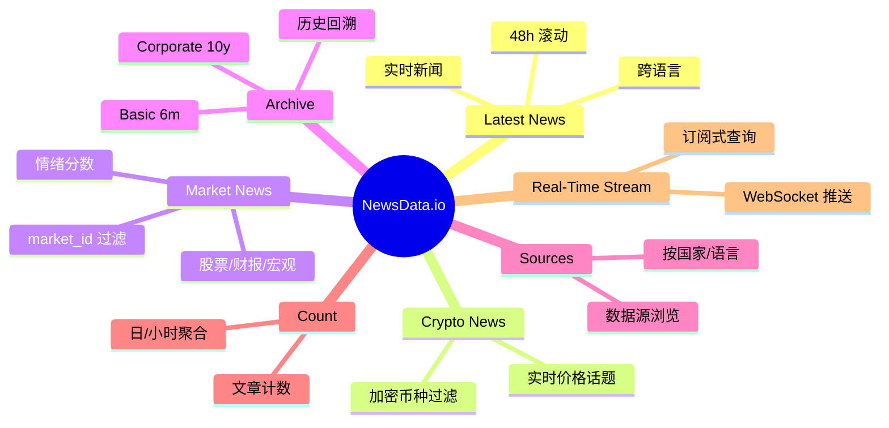
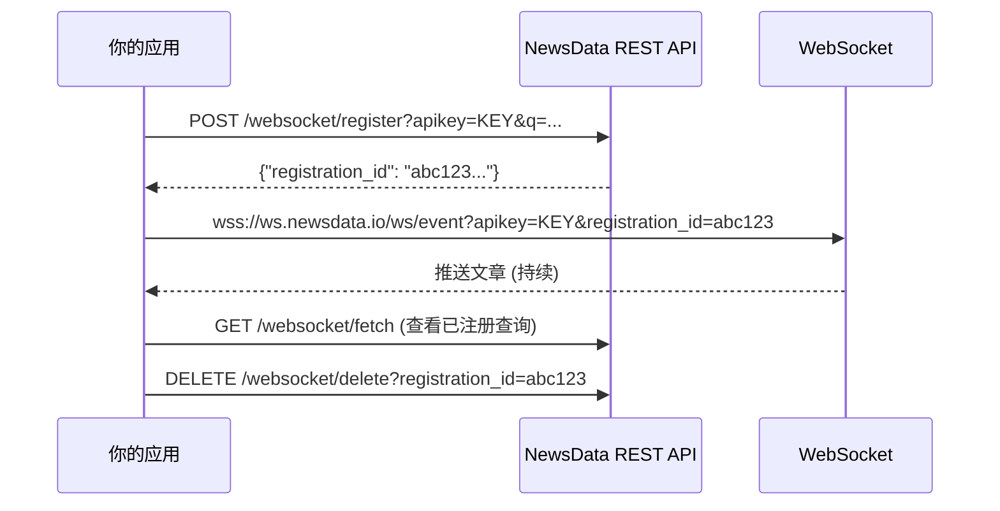

# NewsData.io 深入浅出教程 - Python 全攻略

> 本教程基于 NewsData.io 官方文档整理，所有代码示例均使用官方 `newsdataapi` Python SDK（`pip install newsdataapi`）。
> 通过本教程，你将系统掌握从"第一次调用 API"到"实时新闻流监控"的完整链路。

## 目录

- [第 1 章：NewsData.io 是什么？为什么用 Python？](#第-1-章newsdataio-是什么为什么用-python)
- [第 2 章：5 分钟跑通第一个请求](#第-2-章5-分钟跑通第一个请求)
- [第 3 章：核心概念（端点、认证、响应、分页）](#第-3-章核心概念端点认证响应分页)
- [第 4 章：基础实战 - Latest News 进阶搜索](#第-4-章基础实战---latest-news-进阶搜索)
- [第 5 章：领域端点 - Crypto / Market / Archive](#第-5-章领域端点---crypto--market--archive)
- [第 6 章：高级搜索语法（q / qInTitle / qInMeta）](#第-6-章高级搜索语法q--qintitle--qinmeta)
- [第 7 章：实时新闻流（WebSocket）](#第-7-章实时新闻流websocket)
- [第 8 章：综合实战 - 新闻聚合分析器](#第-8-章综合实战---新闻聚合分析器)
- [第 9 章：错误处理与配额管理](#第-9-章错误处理与配额管理)
- [第 10 章：HTTP 状态码速查表](#第-10-章http-状态码速查表)
- [附录 A：参考资源](#附录-a参考资源)

---

## 第 1 章：NewsData.io 是什么？为什么用 Python？

### 1.1 它是什么

NewsData.io 是一个聚合全球新闻的数据 API 服务，从超过 **102,244 个新闻源**抓取内容，覆盖 **206 个国家 / 89 种语言**，目前已索引超过 **1 亿篇文章**（数据自 2016 年至今）。它将复杂的网络爬虫、内容清洗、多语言处理、情感分析等基础设施封装在一组 REST 接口 + 一个 WebSocket 推送通道后面。

它的主要能力可以用一张图概括：



### 1.2 适用场景

| 场景 | 你会用到什么端点 |
| --- | --- |
| 财经舆情监控 | `market` + `sentiment` + WebSocket |
| 加密货币资讯面板 | `crypto` + `coin` + WebSocket |
| 竞品公关监测 | `latest` + `domain` + `excludedomain` |
| 学术/历史研究 | `archive` + `from_date` + `to_date` |
| 新闻摘要/AI 训练数据 | `latest` / `archive` + `ai_summary` |
| 突发事件告警 | WebSocket + 高优 `prioritydomain` |

### 1.3 为什么用 Python SDK 而不是裸 HTTP

虽然 NewsData.io 的所有端点都是普通 HTTPS GET，没有 Python 难度可言，但官方 `newsdataapi` SDK 提供了一些**工程级价值**：

1. **统一的客户端封装**：所有端点都用同一套关键字参数（`q`、`country`、`language`...）。
2. **自动分页**：`scroll=True` 自动跟随 `nextPage` 把多页合并成一个 `dict`；`paginate=True` 逐页生成（流式）。
3. **类型化异常**：`NewsdataAuthError`、`NewsdataRateLimitError` 等子异常，自带 `retry_after`。
4. **WebSocket 重连 + 心跳**：手动实现很烦，SDK 已经做了指数退避。
5. **CSV 一键导出**：调用 `client.save_to_csv(response)`。

如果你的项目不需要这些，可以跳过 SDK 直接用 `requests` —— 教程第 3 章会演示。

### 1.4 订阅计划速览

| Plan | 月费 (USD) | 配额 | 单次页大小 | 备注 |
| --- | --- | --- | --- | --- |
| Free | $0 | 200 credits/day | 10 | 适合学习与原型 |
| Basic | $199.99 | 20,000 credits/月 | 50 | 历史数据 6 个月 |
| Professional | $349.99 | 50,000 credits/月 | 50 | 历史 2 年 + AI Tags + Sentiment |
| Corporate | $1299.99 | 1,000,000 credits/月 | 50 | 历史 10 年 + AI Region + AI Org |

> **计量细节**：每次调用几乎都消耗 1 credit，`/archive` 端点固定 **5 credits/请求**；WebSocket 每篇文章到达每个连接的设备各扣 1 credit。

---

## 第 2 章：5 分钟跑通第一个请求

### 2.1 注册并获取 API Key

1. 打开 [https://newsdata.io/register](https://newsdata.io/register) 注册账号。
2. 验证邮箱。
3. 登录后在 Dashboard 找到 **API Key**（形如 `pub_xxxxxxxxxxxxxxxxxxxx`）。

### 2.2 用裸 `requests` 调用

无需安装任何第三方包，NewsData.io 是纯 HTTPS GET。

```python
import os
import requests

API_KEY = os.environ["NEWSDATA_API_KEY"]  # 建议用环境变量

resp = requests.get(
    "https://newsdata.io/api/1/latest",
    params={"apikey": API_KEY, "q": "pizza", "language": "en"},
    timeout=10,
)
resp.raise_for_status()
data = resp.json()

print("status       :", data["status"])
print("totalResults :", data["totalResults"])
for art in data["results"][:3]:
    print("-", art["title"], "|", art["link"])
```

### 2.3 用官方 Python SDK

```bash
pip install newsdataapi
# 或
uv add newsdataapi
```

```python
import os
from newsdataapi import NewsDataApiClient

with NewsDataApiClient(os.environ["NEWSDATA_API_KEY"]) as client:
    resp = client.latest_api(q="pizza", language="en")
    for art in resp["results"][:3]:
        print(f"- {art['title']} | {art['link']}")
```

> 💡 **建议**：把 API Key 放进环境变量（`.env` 文件 + `python-dotenv`），不要硬编码到源码里——后面会讲怎么更安全地管理。

### 2.4 第一次响应长什么样

```json
{
  "status": "success",
  "totalResults": 204,
  "results": [
    {
      "article_id": "5fe0f0a2800cc5557d848148176079ce",
      "title": "SHELL PLC SECOND QUARTER 2026 EURO AND GBP EQUIVALENT DIVIDEND PAYMENTS",
      "link": "https://www.globenewswire.com/news-release/2026/09/07/...",
      "description": "...",
      "content": "...",
      "keywords": ["dividend reports and estimates", "nyse:shel", ...],
      "creator": ["shell plc"],
      "language": "english",
      "country": ["united states of america"],
      "category": ["business"],
      "datatype": "pressrelease",
      "pubDate": "2026-09-07 06:00:00",
      "pubDateTZ": "UTC",
      "fetched_at": "2026-09-07 06:03:16",
      "image_url": null,
      "video_url": null,
      "source_id": "globenewswire",
      "source_name": "Globe Newswire",
      "source_priority": 7268,
      "source_url": "https://www.globenewswire.com",
      "source_icon": "https://i.newsdata.io/globenewswire.jpg",
      "sentiment": "neutral",
      "sentiment_stats": {"negative": 2.6, "neutral": 83.04, "positive": 14.36},
      "ai_tag": ["corporate news"],
      "ai_region": null,
      "ai_org": ["shell plc"],
      "ai_summary": "Shell plc announced the second quarter 2026 interim dividend...",
      "duplicate": false
    }
  ],
  "nextPage": "XXXPPPXXXXXXXXXX"
}
```

> 注意字段很多，但**最关键的是 `status`、`totalResults`、`results[]`、`nextPage`**。其它字段（`ai_tag`、`sentiment`、`ai_region` 等）通常只在 Professional / Corporate 套餐才有。

---

## 第 3 章：核心概念（端点、认证、响应、分页）

### 3.1 端点家族（6 个 REST + 1 个 WebSocket）

| 端点 | URL 模式 | 主要用途 |
| --- | --- | --- |
| Latest | `/api/1/latest` | 过去 48h 的实时新闻 |
| Crypto | `/api/1/crypto` | 加密货币相关新闻 |
| Market | `/api/1/market` | 金融/股票/财报 |
| Archive | `/api/1/archive` | 历史回溯（付费） |
| Sources | `/api/1/sources` | 浏览/查询支持的媒体源 |
| Count | `/api/1/count`、`/crypto/count`、`/market/count` | 计数（不返回文章） |
| Streaming | `wss://ws.newsdata.io/ws/event` | WebSocket 实时推送 |

### 3.2 认证

支持两种方式（两种完全等价，择一即可）：

```http
GET /api/1/latest?apikey=YOUR_API_KEY&q=pizza
GET /api/1/latest?q=pizza
X-ACCESS-KEY: YOUR_API_KEY
```

SDK 默认使用 query string：

```python
client = NewsDataApiClient("YOUR_API_KEY")
# 或者使用 header 形式
import requests
requests.get("https://newsdata.io/api/1/latest",
             params={"q": "pizza"},
             headers={"X-ACCESS-KEY": "YOUR_API_KEY"})
```

### 3.3 响应对象的"双层结构"

无论调用哪个端点，响应都是这样的：

```text
{
  "status": "success" | "error",
  "totalResults": <int>,
  "results": [ <article>, <article>, ... ],
  "nextPage": <cursor> | null
}
```

**关键点**：

- `status == "error"` 时，`results` 为空，错误信息会在 `code` 和 `message` 里。
- `totalResults` 是"匹配条件"的总条数，不是 `results` 数组的长度。
- `nextPage` 用于翻页，没有下一页时为 `null`。

### 3.4 单篇文章的关键字段

| 字段 | 类型 | 说明 |
| --- | --- | --- |
| `article_id` | str | 文章唯一 ID |
| `title` | str | 标题 |
| `link` | str | 原文 URL |
| `description` | str | 短描述 |
| `content` | str \| null | 正文（Free 只有 ~100 字） |
| `keywords` | list[str] | 关键词 |
| `creator` | list[str] | 作者 |
| `pubDate` | str | 发布日期（`YYYY-MM-DD HH:MM:SS`） |
| `pubDateTZ` | str | 时区 |
| `fetched_at` | str | NewsData 抓取时间 |
| `source_id` / `source_name` / `source_url` / `source_icon` | str | 数据源信息 |
| `source_priority` | int | 数字越小越权威 |
| `language` | str | 语言（英文小写，如 `english`） |
| `country` | list[str] | 发布国家 |
| `category` | list[str] | 类别（`top`、`business`、`sports`...） |
| `datatype` | str | 文章类型（`news`、`blog`、`pressrelease`...） |
| `image_url` / `video_url` | str \| null | 缩略图/视频 |
| `sentiment` | str | `positive` / `negative` / `neutral`（Professional+） |
| `sentiment_stats` | dict | 三类情感占比 |
| `ai_tag` | list[str] | AI 自动标签（Professional+） |
| `ai_summary` | str | AI 摘要（Basic+） |
| `ai_region` | list[str] | AI 提取的地理区域（Corporate） |
| `ai_org` | list[str] | AI 提取的组织名（Corporate） |
| `symbol` | list[str] | 提到的股票代码 |
| `coin` | list[str] | 提到的币种 |
| `duplicate` | bool | 是否被算法判为重复 |

### 3.5 分页的本质

NewsData.io 用的是 **cursor 分页**，不是 offset：

```python
# 第一页
r1 = client.latest_api(q="pizza")
print(r1["nextPage"])  # 例如 "XXXPPPXXXXXXXXXX"

# 翻到第二页
r2 = client.latest_api(q="pizza", page=r1["nextPage"])
print(r2["nextPage"])  # 下一页 cursor；null 表示没有更多
```

为什么不让你"上一页"？因为 cursor 是单向的，**所以 SDK 提供了两种自动模式**：

```python
# 模式 1：scroll —— 自动跟随 nextPage，合并成一个 dict（适合 ≤几千条）
merged = client.latest_api(q="news", scroll=True, max_result=200)

# 模式 2：paginate —— 按页迭代（适合"慢慢消费"）
for page in client.latest_api(q="news", paginate=True, max_pages=5):
    print(len(page["results"]))
```

两者互斥——`scroll` 严格截断到 `max_result`，`paginate` 按 `max_pages` 停止。

---

## 第 4 章：基础实战 - Latest News 进阶搜索

`/latest` 端点是 80% 用户的入口。这一章把所有常见查询场景串起来。

### 4.1 关键字搜索

```python
with NewsDataApiClient(API_KEY) as client:
    resp = client.latest_api(q="AI")
    for art in resp["results"][:5]:
        print(art["title"])
```

### 4.2 限定国家 + 语言 + 分类

```python
resp = client.latest_api(
    q="",
    country=["us", "gb"],          # 多个国家，列表或逗号串都行
    language="en",
    category=["top", "technology"],  # top、world、business、technology、sports...
)
```

### 4.3 限定特定媒体源

```python
# 用 source id（从 sources 端点查到）
resp = client.latest_api(domain="bbc,nytimes")

# 用完整域名
resp = client.latest_api(domainurl=["bbc.com", "nytimes.com"])
```

### 4.4 排除特定媒体 / 国家 / 类别

```python
resp = client.latest_api(
    q="tesla",
    excludedomain="reddit.com",
    excludecountry=["cn", "ru"],
    excludecategory="sports",
)
```

> ⚠️ **注意**：`country` 和 `excludecountry` **不能同时用**，`category` 和 `excludecategory` 同理。

### 4.5 只要带图的新闻

```python
resp = client.latest_api(q="olympics", image=True)
```

### 4.6 按时间窗口拉取

```python
# 最近 6 小时
resp = client.latest_api(q="earthquake", timeframe=6)

# 最近 30 分钟
resp = client.latest_api(q="earthquake", timeframe="30m")

# 自定义时区
resp = client.latest_api(q="earthquake", timezone="Asia/Shanghai")
```

### 4.7 去重

```python
resp = client.latest_api(q="ipo", removeduplicate=True)
```

### 4.8 排序方式

```python
# 最新优先（默认）、最相关、按来源权威性、按抓取时间
resp = client.latest_api(q="ipo", sort="relevancy")
resp = client.latest_api(q="ipo", sort="source")        # source priority 升序（最权威优先）
resp = client.latest_api(q="ipo", sort="fetched_at")
```

### 4.9 控制响应字段

想减小 payload：

```python
resp = client.latest_api(
    q="ipo",
    excludefield=["image_url", "video_url", "source_icon"],
)
```

### 4.10 一个完整的例子

```python
"""query_pizza_news.py - 一个'实际可用'的查询脚本"""
import os
from datetime import datetime
from newsdataapi import NewsDataApiClient

API_KEY = os.environ["NEWSDATA_API_KEY"]

with NewsDataApiClient(API_KEY) as client:
    merged = client.latest_api(
        q="pizza",
        language="en",
        category=["food", "top"],
        country=["us", "gb"],
        prioritydomain="top",       # 只要前 10% 权威媒体
        removeduplicate=True,
        scroll=True,
        max_result=30,
    )

    print(f"共匹配 {merged['totalResults']} 条，返回 {len(merged['results'])} 条")
    for art in merged["results"]:
        ts = art["pubDate"]
        print(f"[{ts}] {art['title']}\n  {art['link']}\n  来源: {art['source_name']}")
```

---

## 第 5 章：领域端点 - Crypto / Market / Archive

### 5.1 Crypto 端点

#### 5.1.1 基础用法

```python
resp = client.crypto_api(coin="btc")            # 比特币新闻
resp = client.crypto_api(coin=["btc", "eth"])   # 比特币 + 以太坊
```

#### 5.1.2 按关键字 + 媒体过滤

```python
resp = client.crypto_api(
    q="regulation",
    language="en",
    domainurl=["coindesk.com", "cointelegraph.com"],
    timeframe=24,
)
```

### 5.2 Market 端点

Market 端点专做金融新闻。两个独门参数：

- `market_id`：形如 `AAPL-US-NASDAQ` 的全球唯一公司 ID。
- `symbol`：股票代码（同交易所可能有重名）。

#### 5.2.1 查 Apple / Tesla 的市场新闻

```python
resp = client.market_api(
    market_id=["AAPL-US-NASDAQ", "TSLA-US-NASDAQ"],
    language="en",
)
```

#### 5.2.2 只看正面情绪的市场新闻（Professional+）

```python
resp = client.market_api(
    symbol=["MSFT", "GOOGL"],
    sentiment="positive",
    sentiment_score=70,   # 情感得分 >= 70
)
```

> 💡 你可以先调用 `/sources` 端点看一下支持的媒体有哪些"财经口"；再结合 `prioritydomain="top"` 提高信噪比。

### 5.3 Archive 端点

Archive 用于**历史回溯**，且**每次调用固定扣 5 credits**。仅付费计划可用，回溯时长按套餐：

| 套餐 | 回溯窗口 |
| --- | --- |
| Basic | 6 个月 |
| Professional | 2 年 |
| Corporate | 10 年 |

```python
resp = client.archive_api(
    q="artificial intelligence",
    from_date="2024-01-01",
    to_date="2024-12-31",
    language="en",
    category=["technology"],
    scroll=True,
    max_result=500,
)
```

> 也可以写完整时间戳：`from_date="2024-01-01 06:12:45"`。

### 5.4 Count 端点

只想要"这个关键词最近有多少条新闻"，不要真实文章？用 `/count`。

```python
# 每日聚合
resp = client.count_api(
    q="electric vehicle",
    from_date="2024-01-01",
    to_date="2024-01-31",
    interval="day",
)

# 总数
total = client.count_api(
    q="electric vehicle",
    from_date="2024-01-01",
    to_date="2024-01-31",
    interval="all",
)

# 每小时
hourly = client.crypto_count_api(
    q="bitcoin",
    from_date="2024-06-01",
    to_date="2024-06-15",
    interval="hour",
)
```

> Count 端点**每次调用 50 credits**，但能帮你"避免调用昂贵的 archive 来瞎试"。

---

## 第 6 章：高级搜索语法（q / qInTitle / qInMeta）

`q` 系列参数支持类 SQL 的布尔运算。**`q` / `qInTitle` / `qInMeta` 三选一，且单参数最长 512 字符**（含运算符、空格、括号）。

| 需求 | 写法 |
| --- | --- |
| 单一关键字 | `q=social` |
| 精确短语 | `q="social pizza"` |
| 多关键字 AND | `q=social AND pizza AND pasta` |
| 排除关键字 | `q=social NOT pizza` |
| 多关键字 NOT | `q=social NOT (pizza AND wildfire)` |
| 任一关键字 OR | `q=social OR pizza OR pasta` |
| 组合 OR + NOT | `q=(pizza OR social) NOT pasta` |

```python
resp = client.latest_api(q="(tesla OR byd) NOT recall", language="en")

# 只在标题里搜
resp = client.latest_api(qInTitle="IPO", category="business")

# 在标题/URL/meta 关键字里搜
resp = client.latest_api(qInMeta="kubernetes", language="en")
```

> `qInTitle`、`qInMeta` 都"窄于 `q`"——`qInTitle` 只看标题；`qInMeta` 看标题 + URL + meta keywords + meta description。所以**精度要求高时优先用 `qInTitle`**，能省很多过滤逻辑。

---

## 第 7 章：实时新闻流（WebSocket）

NewsData.io 提供了一条**持久 WebSocket 通道**：你"注册一个查询"，新文章一发布就被推过来——**不需要轮询**。

### 7.1 关键事实

- 没有内置"每秒多少条"限流，**但每篇文章到达每个连接的设备扣 1 credit**——一个查询命中 3 篇文章，3 个设备连接 = **9 credits**。
- 注册查询时**至少要给一个过滤条件**（`q` / `qInTitle` / `category` / `country` / `language` / `domain` / `domainurl` / `prioritydomain` / `image` / `video` / `full_content`）。
- 每账号最多同时注册的查询数：Free=1、Basic=5、Professional/Corporate=10。每个查询最多 5 个连接设备。

### 7.2 流程图



### 7.3 用 SDK 注册 + 接收

#### 7.3.1 同步版本（最常用）

```python
from newsdataapi import NewsDataApiClient, NewsDataApiWebSocket

API_KEY = "YOUR_API_KEY"

client = NewsDataApiClient(API_KEY)
ws = NewsDataApiWebSocket(client)

# 1) 注册一个查询
resp = ws.websocket_register(q="bitcoin", language="en")
reg_id = resp["results"]["registration_id"]
print("Registered:", reg_id)

# 2) 持续接收
with ws:
    try:
        for response in ws.stream(reg_id):
            for art in response["results"]:
                print(art["title"], "|", art["link"])
    except KeyboardInterrupt:
        print("stopped.")

# 3) 不用了，删掉
ws.websocket_delete(reg_id)
```

#### 7.3.2 异步版本（FastAPI / Discord bot）

```python
import asyncio
from newsdataapi import NewsDataApiClient, NewsDataApiWebSocket

async def stream_news():
    client = NewsDataApiClient("YOUR_API_KEY")
    ws = NewsDataApiWebSocket(client)
    reg_id = "YOUR_REGISTRATION_ID"

    async with ws:
        async for response in ws.stream_async(reg_id):
            for art in response["results"]:
                print(art["title"])

asyncio.run(stream_news())
```

### 7.4 处理"注册失败"（409 重复查询）

```python
from newsdataapi import NewsdataAPIError

try:
    resp = ws.websocket_register(q="bitcoin", language="en")
    reg_id = resp["results"]["registration_id"]
except NewsdataAPIError as e:
    if e.status_code == 409:
        # 已经注册过了——重用旧的 ID
        reg_id = e.response_body["results"]["registration_id"]
        print("reuse:", reg_id)
    else:
        raise
```

### 7.5 重连行为

SDK 默认**自动重连 + 指数退避**（1s → 2s → …，封顶 30s）。如果想停掉：

```python
ws = NewsDataApiWebSocket(client, reconnect=False)
```

### 7.6 配额提醒

> ⚠️ **重要**：如果你注册的查询匹配条件**过宽**（比如 `category=world` 这种），文章会以"刷屏"的速度到达，credits 会快速消耗。
>
> 经验法则：
>
> - **必须**至少用一个"窄"过滤（`q` / `country` / `domain`）。
> - Free 套餐做实验时，建议固定 `size=10` 或 `timeframe=1`。
> - 正式上线前用 `/count` 估算一下"命中量级"。

---

## 第 8 章：综合实战 - 新闻聚合分析器

下面把前面学到的东西拼成一个小项目。它会：

1. 拉过去 24h 关于 AI 的新闻。
2. 提取关键指标：情感分布、Top 媒体、Top 关键词。
3. 持久化到 CSV。
4. （可选）启动 WebSocket 监听"突发"事件。

### 8.1 项目结构

```text
news_analyzer/
├── pyproject.toml
├── .env.example
├── src/news_analyzer/
│   ├── __init__.py
│   ├── config.py
│   ├── fetch.py
│   ├── analyze.py
│   ├── persist.py
│   └── stream.py
└── tests/
    └── test_analyze.py
```

### 8.2 `pyproject.toml`（最小依赖）

```toml
[project]
name = "news-analyzer"
version = "0.1.0"
requires-python = ">=3.10"
dependencies = [
    "newsdataapi>=0.3",
    "python-dotenv>=1.0",
    "pydantic>=2.0",
]
```

### 8.3 `.env.example`

```env
NEWSDATA_API_KEY=pub_xxxxxxxxxxxxxxxxxxxx
```

### 8.4 `src/news_analyzer/config.py`

```python
from __future__ import annotations
import os
from dataclasses import dataclass
from dotenv import load_dotenv

load_dotenv()

@dataclass(frozen=True)
class Settings:
    api_key: str
    csv_dir: str = "news_csv"

    @classmethod
    def from_env(cls) -> "Settings":
        key = os.environ.get("NEWSDATA_API_KEY")
        if not key:
            raise RuntimeError("NEWSDATA_API_KEY is required")
        return cls(api_key=key)
```

### 8.5 `src/news_analyzer/fetch.py`

```python
from __future__ import annotations
from typing import Iterator
from newsdataapi import NewsDataApiClient


def iter_pages(
    client: NewsDataApiClient,
    *,
    q: str,
    language: str = "en",
    category: list[str] | None = None,
    max_pages: int = 5,
) -> Iterator[dict]:
    """Yield one response dict per page from /latest."""
    yield from client.latest_api(
        q=q,
        language=language,
        category=category,
        paginate=True,
        max_pages=max_pages,
    )
```

### 8.6 `src/news_analyzer/analyze.py`

```python
from __future__ import annotations
from collections import Counter
from dataclasses import dataclass, field


@dataclass
class Report:
    total: int = 0
    sentiment_counter: Counter = field(default_factory=Counter)
    source_counter: Counter = field(default_factory=Counter)
    keyword_counter: Counter = field(default_factory=Counter)
    sample_titles: list[str] = field(default_factory=list)

    def render(self) -> str:
        out = [
            f"Articles analyzed : {self.total}",
            "",
            "Sentiment distribution:",
            *(
                f"  - {k:<10} {v:>4}"
                for k, v in self.sentiment_counter.most_common()
            ),
            "",
            "Top 5 sources:",
            *(
                f"  - {name:<25} {cnt:>4}"
                for name, cnt in self.source_counter.most_common(5)
            ),
            "",
            "Top 10 keywords:",
            *(
                f"  - {kw:<25} {cnt:>4}"
                for kw, cnt in self.keyword_counter.most_common(10)
            ),
            "",
            "Sample titles:",
            *(f"  - {t}" for t in self.sample_titles[:5]),
        ]
        return "\n".join(out)


def build_report(articles: list[dict]) -> Report:
    rep = Report(total=len(articles))
    for art in articles:
        rep.sentiment_counter[art.get("sentiment") or "unknown"] += 1
        rep.source_counter[art.get("source_name") or "unknown"] += 1
        for kw in art.get("keywords") or []:
            rep.keyword_counter[kw.lower()] += 1
        if len(rep.sample_titles) < 5:
            rep.sample_titles.append(art.get("title") or "")
    return rep
```

### 8.7 `src/news_analyzer/persist.py`

```python
from __future__ import annotations
from pathlib import Path
from newsdataapi import NewsDataApiClient


def save_csv(client: NewsDataApiClient, response: dict, name: str) -> Path:
    """save_to_csv 自动写 folder_path 指定的目录"""
    return Path(client.save_to_csv(response, filename=name))
```

### 8.8 `src/news_analyzer/stream.py`

```python
from __future__ import annotations
import asyncio
from newsdataapi import NewsDataApiClient, NewsDataApiWebSocket


async def watch(
    api_key: str,
    q: str,
    language: str = "en",
    on_article=None,
) -> None:
    client = NewsDataApiClient(api_key)
    ws = NewsDataApiWebSocket(client)

    try:
        reg = ws.websocket_register(q=q, language=language)
    except Exception as e:
        # 已经注册过？
        from newsdataapi import NewsdataAPIError
        if isinstance(e, NewsdataAPIError) and e.status_code == 409:
            reg_id = e.response_body["results"]["registration_id"]
        else:
            raise
    else:
        reg_id = reg["results"]["registration_id"]
        print(f"[stream] registered: {reg_id}")

    async with ws:
        async for resp in ws.stream_async(reg_id):
            for art in resp["results"]:
                if on_article:
                    await on_article(art)
                else:
                    print(art["title"], "|", art["link"])
```

### 8.9 `main.py`

```python
"""一次性分析：过去 24h 关于 'artificial intelligence' 的英文新闻"""
import sys
from news_analyzer.config import Settings
from news_analyzer.fetch import iter_pages
from news_analyzer.analyze import build_report
from news_analyzer.persist import save_csv
from newsdataapi import NewsDataApiClient


def main() -> int:
    cfg = Settings.from_env()
    client = NewsDataApiClient(cfg.api_key, folder_path=cfg.csv_dir)

    all_articles = []
    with client:
        for page in iter_pages(
            client,
            q="artificial intelligence",
            language="en",
            category=["technology", "top"],
            max_pages=3,
        ):
            all_articles.extend(page["results"])

    report = build_report(all_articles)
    print(report.render())

    # 落盘
    save_csv(client, {"results": all_articles}, name="ai_24h")
    return 0


if __name__ == "__main__":
    sys.exit(main())
```

### 8.10 跑起来

```bash
uv sync
cp .env.example .env  # 填上 API Key
uv run python main.py
```

输出形如：

```text
Articles analyzed : 90

Sentiment distribution:
  - positive     18
  - neutral      62
  - negative     10

Top 5 sources:
  - reuters                       14
  - the verge                     11
  - techcrunch                     9
  - hacker news                    7
  - forbes                         6

Top 10 keywords:
  - openai                        23
  - llm                           19
  ...

Sample titles:
  - OpenAI announces ...
  - Anthropic launches ...
  ...
```

---

## 第 9 章：错误处理与配额管理

### 9.1 异常层次

```text
NewsdataException
├── NewsdataValidationError      (本地校验失败; .param)
├── NewsdataAPIError             (.status_code, .response_body)
│   ├── NewsdataAuthError        (401/403)
│   ├── NewsdataRateLimitError   (429; .retry_after)
│   └── NewsdataServerError      (5xx)
├── NewsdataNetworkError         (.original)
└── NewsdataWebSocketError
    └── NewsdataWebSocketAuthError
```

### 9.2 一个生产级的 try/except

```python
import time
from newsdataapi import (
    NewsDataApiClient,
    NewsdataAuthError,
    NewsdataRateLimitError,
    NewsdataAPIError,
    NewsdataNetworkError,
)

def fetch_with_resilience(client: NewsDataApiClient, **params):
    backoff = 1.0
    while True:
        try:
            return client.latest_api(**params)
        except NewsdataAuthError as e:
            # 401/403：API Key 不对，没有重试意义
            raise SystemExit(f"Auth failed (HTTP {e.status_code}): {e.response_body}")
        except NewsdataRateLimitError as e:
            wait = e.retry_after or 15
            print(f"rate limited; sleep {wait}s")
            time.sleep(wait)
            backoff = min(backoff * 2, 60)
        except NewsdataNetworkError as e:
            print(f"network: {e.original}; retry in {backoff}s")
            time.sleep(backoff)
            backoff = min(backoff * 2, 30)
        except NewsdataAPIError as e:
            print(f"api {e.status_code}: {e.response_body}")
            raise
```

### 9.3 WebSocket 错误

```python
from newsdataapi import (
    NewsDataApiClient,
    NewsDataApiWebSocket,
    NewsdataWebSocketAuthError,
    NewsdataWebSocketError,
)

client = NewsDataApiClient("YOUR_API_KEY")
ws = NewsDataApiWebSocket(client)

try:
    with ws:
        for response in ws.stream("YOUR_REG_ID"):
            ...
except NewsdataWebSocketAuthError as e:
    # Key 错、套餐没权限、reg_id 错、设备超限——不会自动重连
    raise
except NewsdataWebSocketError as e:
    print("stream error:", e)
```

### 9.4 配额监控建议

```python
def track_credit(client: NewsDataApiClient, label: str = "?"):
    # NewsData.io 没有官方"credit 余额"接口；建议自建计数
    pass
```

实际生产中，建议你在应用里：

1. 自己统计"今天调了多少次"，避免爆 quota。
2. Archive 端点每次扣 5 credits，**必须谨慎**。
3. WebSocket 每篇文章到每设备 1 credit——一个 device 时单独监听，多个 device 时用 `paginate` 拉而不是开多连接。

---

## 第 10 章：HTTP 状态码速查表

| 状态码 | 含义 | 你的应对 |
| --- | --- | --- |
| 200 | 成功 | — |
| 400 | 参数缺失/格式错 | 检查 `apikey` 等必填项 |
| 401 | API Key 无效/缺失 | 重新生成 Key |
| 403 | CORS / IP 限制 | 检查来源域名/IP 白名单 |
| 409 | 参数重复 | 同名参数只能出现一次；常见于重复注册 WebSocket |
| 415 | Content-Type 不支持 | 改用 JSON 格式 |
| 422 | 请求语义有错 | 检查运算符、日期格式 |
| 429 | 限流 | 等 `Retry-After` 秒数再试 |
| 500 | 服务器错误 | 指数退避重试 |

---

## 附录 A：参考资源

### A.1 官方资源

- 文档主页：[https://newsdata.io/documentation](https://newsdata.io/documentation)
- OpenAPI 3.1 规范：[https://newsdata.io/openapi.json](https://newsdata.io/openapi.json)
- Python SDK 仓库：[https://github.com/bytesview/python-client](https://github.com/bytesview/python-client)
- PyPI：[https://pypi.org/project/newsdataapi](https://pypi.org/project/newsdataapi)
- Postman Collection：[NewsData.io Postman](https://www.postman.com/newsdata-io/newsdata-io/collection/43496198-8063e249-5020-44a3-b912-0935b9f188dc)
- 更新日志：[https://newsdata.io/changelog](https://newsdata.io/changelog)
- 数据源目录：[https://newsdata.io/news-sources](https://newsdata.io/news-sources)
- 历史数据集：[https://newsdata.io/datasets](https://newsdata.io/datasets)

### A.2 重要 Blog 入口（每篇都覆盖一个具体痛点）

- 如何获取 API Key
- 如何发第一个请求
- 实时流 API 指南
- Latest News 端点详解
- 加密币端点详解
- Market 端点详解
- Archive 端点详解
- Pagination 全解
- 限流机制
- Credit 消耗规则
- `q` / `qInTitle` / `qInMeta` 语法
- `region` 参数实战

### A.3 时区代码参考

所有时区用 IANA tz database 字符串，例如：

```text
Asia/Shanghai
Asia/Tokyo
America/New_York
Europe/London
UTC
```

---

## 结语

NewsData.io 的能力边界：

- **横向广**：Latest / Crypto / Market / Archive / Sources / Count 一站式覆盖。
- **纵深深**：分页、布尔搜索、优先级媒体、情感、AI 摘要、AI 标签。
- **实时**：WebSocket 是它的"杀手锏"，订阅式查询让告警/看板不再轮询。

而 Python SDK 的价值在于把这些"工程脏活"——重连、限流感知、异常分类型、分页合并——藏到一行 import 里。

下一步推荐尝试：

1. 把第 8 章的项目部署成 FastAPI + Streamlit 小看板。
2. 用 WebSocket + Discord webhook 做一个"突发新闻告警机器人"。
3. 把 `archive` 数据接进向量数据库，做 RAG 新闻问答。
