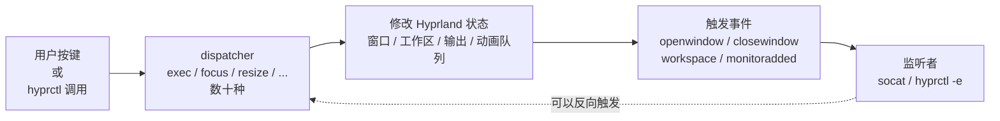
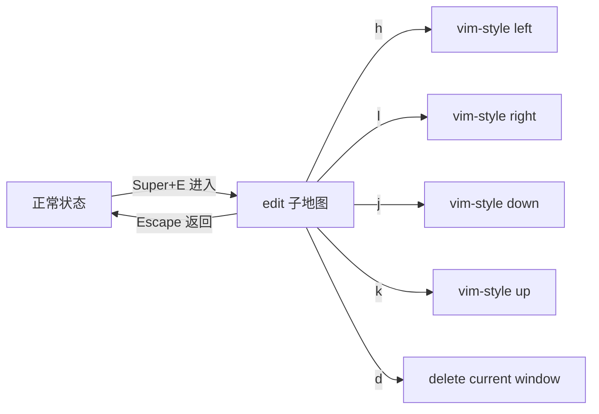

# Hyprland 进阶指南

> 本文是 [[Omarchy 与 Hyprland 操作和配置教程]] 的"下半场"。上一篇覆盖了装机、基础快捷键、改键盘布局、装主题、快照回滚——这些是"会用"。本文假设你已经会用 Hyprland，要把系统调到"懂行"的水准：理解动画曲线、读懂布局算法、用窗口规则控制每个应用、写出能动态响应事件的脚本。

## 0. 前言

### 0.1 本文能给你什么

| 你将掌握                                       | 你将摆脱                                       |
| ---------------------------------------- | ---------------------------------------- |
| 自定义 bezier 曲线，让动画"跟手但不刺眼"                | 默认动画看着别扭但不知道怎么改                        |
| 在 dwindle/master/spiral 三种布局间秒切              | 把所有窗口都丢进 dwindle 里"听天由命"               |
| 写出精准的 `windowrulev2`，给每个应用定身量             | 写一堆 if 试图让某个应用"听话"                     |
| 用 submap 写出 Vim 风格的模式切换                    | 快捷键一多就 `ctrl+alt+shift+s+x` 乱成一团          |
| 用 `hyprctl` 把 Hyprland 当成 API 用             | 改完配置必须重启会话才生效                          |
| 监听 Hyprland 事件，写出能"感知状态"的脚本             | 一堆轮询脚本互相打架                             |
| 把性能调到最稳，老显卡也不掉帧                          | 看着花哨但风扇狂转                              |

### 0.2 阅读前提

为了不重复造轮，本文默认你已经知道：

- `hyprctl reload` 让配置生效
- `~/.config/hypr/` 下有 `hyprland.conf` / `bindings.conf` / `windowrules.conf` / `looknfeel.conf` / `monitors.lua` 等分块文件
- `Super+Enter` / `Super+Q` / `Super+J` 等基础快捷键
- 终端、nvim、浏览器在多个工作区间的切换

如果你对这些还陌生，先回去读上一篇。

### 0.3 Hyprland 的"心智模型"

Hyprland 是一个**状态机 + 事件循环**的合成器，所有"动作"最终都通过 `dispatcher` 完成：



`★ 关键点`：本文章后面所有的"高级操作"，说白了就是熟练运用 dispatcher 和订阅事件——动画曲线、窗口规则、submap、IPC 全是这条主干上的不同分支。

---

## 1. 动画与视觉效果

Hyprland 的动画系统是它"颜值担当"的核心。但默认配置是一刀切的折中方案，想让它跟手且优雅，得懂底层机制。

### 1.1 动画三要素

每条 `animation =` 行包含三个核心参数：

```ini
animation = 类型, 速度（1-N）, 曲线名或 bezier, [可选参数]
```

| 位置 | 参数 | 含义 | 取值 |
|---|---|---|---|
| 1 | 类型 | 动画作用对象 | `windows` / `fade` / `border` / `shadow` / `workspaces` / `zoom` / `fadeShadow` |
| 2 | 速度 | "帧"数；越大越慢 | 1–30 经验值 |
| 3 | 曲线 | 缓动函数 | `default` / `linear` / `ease` 或自定义 bezier 名 |

### 1.2 bezier 曲线：动画的灵魂

`default` 是 Hyprland 写死的一条曲线。"想要更跟手"或"想要更优雅"都得自定义。

```ini
animations {
    enabled = yes

    # 命名一条 bezier：起止点 + 两个控制点（x,y）
    bezier = linear,     0.0, 0.0, 1.0, 1.0
    bezier = easeIn,     0.4, 0.0, 1.0, 1.0
    bezier = easeOut,    0.0, 0.0, 0.2, 1.0
    bezier = overshot,   0.05, 0.9, 0.1, 1.05   # 回弹一点
    bezier = snappy,     0.2, 0.0, 0.0, 1.0     # 极快前段
    bezier = smooth,     0.4, 0.0, 0.2, 1.0     # 平稳
    bezier = silky,      0.25, 0.1, 0.25, 1.0   # 丝滑

    animation = windows,    1, 7, snappy
    animation = fade,       1, 7, default
    animation = workspaces, 1, 5, smooth
}
```

> 💡 **控制点直观图**：把 `(0,0) → (1,1)` 想象成时间→进度。第一个控制点拉得越靠右上，"起步就越冲"；第二个控制点拉得越靠右下，"收尾越平稳"。`overshot` 故意让终点超过 1，制造回弹。

### 1.3 速度数字（速度档）的真实含义

"速度 7"听起来像"动画 7 秒"，但其实是"动画跑多少个 monitor refresh 周期的多少分之一"——不同刷新率下感觉不一样。

| 速度 | 60Hz 显示器 | 120Hz 显示器 | 主观感受 |
|---|---|---|---|
| 1 | 极快 | 极快 | 跟手但"跳" |
| 3 | 较快 | 较快 | 跟手不跳 |
| 7 | 默认 | 默认 | 默认观感 |
| 15 | 明显拖动 | 中等 | "优雅"但慢 |
| 30 | 戏剧性 | 慢 | 动画艺术用，**不适合日常** |

`★ 关键点`：高刷新率屏幕（120Hz+）上把速度调小 1–2 档，因为每帧时间更短。

### 1.4 decoration 阴影 / 模糊 / 圆角

```ini
decoration {
    rounding = 10
    active_opacity = 1.0
    inactive_opacity = 1.0
    fullscreen_opacity = 1.0

    blur {
        enabled = true
        size = 5          # 模糊半径；越大越吃 GPU
        passes = 3        # 模糊质量档（1=快, 5=清晰）
        new_optimizations = true   # Hyprland 0.45+ 启用新算法
        xray = true       # 让浮窗也参与背景模糊
    }

    shadow {
        enabled = true
        range = 15        # 阴影扩散半径
        render_power = 3  # 阴影质量档（1=快, 4=清晰）
        offset = 0, 0
        color = rgba(0, 0, 0, 0.5)
    }

    dim_inactive = false
}
```

### 1.5 模糊吃帧率

模糊参数 `size` 与 `passes` 是帧率第一杀手：

- `size = 5` + `passes = 3` 是平衡画质与帧率
- `size = 10` + `passes = 5` 老显卡会掉到 30Hz
- `new_optimizations = false` 走 CPU 软着色，老 CPU 时代慎开

模糊性能调优

| 显卡等级 | 推荐 size | 推荐 passes |
|---|---|---|
| 核显（Intel UHD 620+） | 低（1-3） | 低（1） |
| 入门独显（GTX 1050+） | 中（3-5） | 中（2-3） |
| 中端独显（RX 6700+ / RTX 3060+） | 中高（5-8） | 中高（3-4） |
| 高端独显（RTX 4070+） | 高（8-15） | 高（4-5） |

`★ 关键点`：开启模糊后，`hyprctl reload` 会让屏幕黑一下——这是正常的，Hyprland 重建模糊管线。

### 1.6 animation style override（动画覆盖）

`windowrulev2 = animationstyle "..."` 可以给某个应用覆盖动画风格（详见第 3 节）。常用场景：

- **截屏工具、计算器、临时贴通知**——动画可以做得非常快（甚至 0 速度）
- **媒体播放器**——慢一些有"仪式感"
- **终端类**——极快才跟手

```ini
# 始终最快（无感）
windowrulev2 = animationstyle windows, 1, 1, default, fade 1, 1, default
windowrulev2 = animationstyle fade, 1, 1, default
```

### 1.7 用 frame loop 检查动画成本

```bash
# 看当前显示器刷新率是否跟得上（目标 ~60Hz / ~120Hz）
hyprctl monitors | grep active
```

如果用 `super-j` 切分割方向时能看到明显"顿挫"，说明动画曲线太慢或者显示器在掉帧——回到 1.3 调小速度档。

---

## 2. 布局算法与动态工作区

Hyprland 的核心创新是它的**动态窗口布局**——所有平铺行为都是算法控制的，不是手动的。这一节让你搞懂"为什么窗口会这么排"以及"怎么让它按你想的排"。

### 2.1 三种平铺算法


**对比**：

| 算法 | 行为 | 适合 |
|---|---|---|
| `dwindle` | 每次分裂占最近空隙，呈"二叉树" | 通用、轻量 |
| `master` | 主窗口在左/顶，剩余以堆叠方式均分右侧/底部 | 一边看参考一边编码 |
| `spiral` | 类似 dwindle 但强制螺旋 | 视觉有规律 |
| `scrolling` | 平铺窗口单行/列排开，可用 `Super+方向键`滚动 | 屏幕宽、窗口多 |

### 2.2 在三种布局间切换

主布局切换 dispatcher：`layoutmsg`：

```ini
# 切换 dwindle
bind = SUPER, D, layoutmsg, dwindle

# 切换 master
bind = SUPER, M, layoutmsg, master

# 切换 spiral
bind = SUPER, S, layoutmsg, spiral

# 切换 scrolling
bind = SUPER SHIFT, S, layoutmsg, scrolling
```

> 💡 **技巧**：把 dwindle 和 master 都绑定上，按一个键在两种布局间来回切。很多 Hyprland 老用户的工作流就是"主用 dwindle，要做对比时切 master"。

### 2.3 主布局参数（master 详解）

master 算法有几条关键参数：

```ini
master {
    new_status = master          # 新窗口默认塞进 master 还是 slave
    new_position = before       # before=master 前（左侧）, after=stack 后
    orientation = left          # master 排在左（top=上, right=右, bottom=下）
    orientation_ccw = false     # 旋转方向（false=顺时针）
    slaves_count_for_center_master = 2
    center_master = false       # master 居中（适合双窗口对称）
    size_factor = 0.55          # master 占的宽度比例（0-1）
    inherits_work_area = false
}
```

`new_status = master` 是关键——很多人发现"按 master 之后新窗口还是塞右边"，是因为它默认是 `slave`。改成 `master` 后，新窗口会**成为新的主窗口**，主窗口变成 slave。

### 2.4 dwindle 详解

```ini
dwindle {
    pseudotile = false          # true=伪平铺（窗口保持原大小）
    no_gaps_when_only = false   # 只有一个窗口时取消 gap
    force_split = 0             # 0=自动选方向, 1=始终水平, 2=始终垂直
    preserve_split = true       # 切布局时尽量保留现有分割
    smart_resizing = true       # 智能缩放（不会覆盖旁边窗口）
    special_scale_factor = 1.0   # 全屏窗口的内部 padding
}
```

`pseudotile = true` 是关键开关——开启后所有窗口保持原大小，按 `Super+方向键` 能像 i3 那样手动平铺。关闭就是默认 dwindle 行为。

### 2.5 伪平铺与 i3 风格

如果你怀念 i3 / sway 的手动平铺感，可以把 pseudotile 开起来：

```ini
dwindle {
    pseudotile = true
    preserve_split = true
}

# 手动调整：把当前窗口缩为半屏或全屏
bind = SUPER, left,  resizeactive, -40 0
bind = SUPER, right, resizeactive,  40 0
bind = SUPER, up,    resizeactive, 0 -40
bind = SUPER, down,  resizeactive, 0  40
```

`★ 关键点`：pseudotile = true + dwindle = "既能自动平铺又能手动"——但失去了"窗口越大被挤压越小"的弹性。

### 2.6 动态工作区

默认 `workspace = w[], default` 限制在 9 个工作区。Hyprland 0.45+ 引入了**动态工作区**：

```ini
# 启用无限工作区
misc {
    workspace {
            monitor_aware = true   # 工作区按显示器分组
            enable_autoreload = true
            workspaces_per_monitor = 5   # 每个显示器默认 5 个，溢出时自动新建
    }
}
```

`monitor_aware = true` 之后，工作区不再全局唯一。同一编号（如 workspace 1）在不同显示器上是不同工作区。

### 2.7 预留工作区（reserved workspaces）

某些应用（如 OBS、Discord）希望永远不被切走——Hyprland 0.45+ 的 `pinned`:

```ini
# 给 Discord 永远预留 workspace 9
windowrulev2 = workspace 9, title: "^(Discord)$"
windowrulev2 = pin, title: "^(OBS)$"
```

`pin` 让窗口永远跟在自己 workspace 上；workspace 永远不会被自动清理。

### 2.8 工作区 vs 显示器的高级玩法

当 `monitor_aware = true` 时：

| 行为 | 命令 |
|---|---|
| 切到显示器 A 的工作区 3 | `Super+3` |
| 把窗口移到自己显示器的 w3 | `Super+Shift+3` |
| 把窗口移到另一显示器的 w3 | `hyprctl dispatch movetoworkspacesilent 3 DP-2` |
| 跟着 focus 走的 swap | `Super+Shift+方向键` 交换相邻 workspace 顺序 |

```bash
# 把当前窗口静默移到 DP-2 显示器的 workspace 3
hyprctl dispatch movetoworkspacesilent "3 DP-2"
```

`★ 关键点`：`movetoworkspace` vs `movetoworkspacesilent` 的差别是 silent 不跟随 focus——写脚本时优先用 silent。

### 2.9 scrolling 布局的高级用法

scrolling 把平铺变成"单行/单列"：

```ini
scroll_layout {
    columns = 2          # 同时显示几列
    column_gap = 12
    row_gap = 12
    force_horizontal = false
}

bind = SUPER, left,  layoutmsg, movefocus l
bind = SUPER, right, layoutmsg, movefocus r
bind = SUPER, up,    layoutmsg, movefocus u
bind = SUPER, down,  layoutmsg, movefocus d
```

适合**屏幕宽、窗口多**的场景，比如同时盯 5 个 Grafana 图表。

---

## 3. 窗口规则 windowrulev2 进阶

`windowrulev2` 是 Hyprland 给单个窗口"定身量"的钩子。上一篇教程给了几条基础规则，本节深入匹配、持久化、跨工作区/输出控制。

### 3.1 匹配字段速查

Hyprland 0.45+ 推荐用 `windowrulev2`（`windowrule` 已废弃），匹配字段：

| 字段 | 匹配目标 |
| --- | --- |
| `class:` | WMClass（应用主类名） |
| `title:` | 窗口标题 |
| `initialClass:` / `initialTitle:` | 启动时的初始值（窗口改 title 后不再匹配） |
| `workspace:` | 窗口当前所在 workspace |
| `monitor:` | 窗口当前所在 monitor |
| `floating:` | `on` / `off` |
| `fullscreen:` | `0` / `1` / `2` |
| `pinned:` | `on` / `off` |

```ini
# 同时按 class 和 title 匹配
windowrulev2 = float,        class:^(kitty)$, title:^(Terminal)$
windowrulev2 = float,        class:^(mpv)$, fullscreen:1
windowrulev2 = workspace 2,  class:^(code)$
```

> 💡 `class:` vs `initialClass:` 的区别：
>
> - `class:` 跟 WMClass，会**始终跟**直到窗口关闭
> - `initialClass:` 跟启动时第一帧的类名；之后窗口改标题就不再匹配
> - 一般用 `class:` 就够了，特殊场景（如 mpv 打开不同文件后 title 改变）才用 `initialTitle:`

### 3.2 规则类型大全

| 规则 | 含义 |
|---|---|
| `float` / `tile` | 浮动 / 平铺 |
| `size WxH` | 窗口尺寸 |
| `position X Y` | 窗口位置 |
| `center` | 居中（一次性） |
| `monitor NAME` | 强制窗口出现在某显示器 |
| `workspace N` | 窗口默认工作区 |
| `workspace N silent name` | 静默移到 workspace |
| `fullscreen` / `maximize` | 全屏 / 最大化 |
| `pin` / `unpin` | 固定 / 取消固定 |
| `opacity ALPHA` | 不透明度（0-1） |
| `animationstyle TYPE, SPEED, BEZIER[, TYPE2, ...]` | 动画风格覆盖（见 1.6） |
| `bordercolor COLOR` | 边框色 |
| `rounding N` | 单窗口圆角覆盖 |
| `prop:NAME VALUE` | 自定义 XWayland 属性 |
| `suppressevent MAXIMIZE` | 屏蔽 maximize 事件 |
| `keepaspectratio` | 保持宽高比 |
| `nearestneighbor` | 调整大小不推邻居（桌面图标类） |

### 3.3 浮动 + 居中 + 尺寸 三连

最常见的"小工具"组合：

```ini
# 所有特定应用的窗口强制浮动、居中、固定大小
windowrulev2 = float,        class:^(blueman-manager)$
windowrulev2 = size 800 600, class:^(blueman-manager)$
windowrulev2 = center,       class:^(blueman-manager)$

# 浮窗透明度 0.95（让后面看得到一点）
windowrulev2 = opacity 0.95 0.95, class:^(blueman-manager)$

# 屏蔽最大化按钮事件（避免意外最大化遮住其他窗口）
windowrulev2 = suppressevent maximize, class:^(blueman-manager)$
```

`★ 关键点`：`center` 是**初始中心化**——窗口首次出现时居中，之后用户拖动它就跟着用户走。如果想"始终居中"，改用 `move` dispatcher 在脚本里监听事件。

### 3.4 多表达式 AND/AND-NOT 组合

Hyprland 0.45+ 支持把多条规则合并到一行：

```ini
# AND：同时匹配 class 和 title
windowrulev2 = float, class:^(kitty)$, title:^(Settings)$

# NOT：dash 开头表示非
windowrulev2 = float, class:^(kitty)$, !title:^(Settings)$
```

这种"双重过滤"对 mpv 特别有用——它有窗口标题、关闭、悬浮播放三个状态区别。

### 3.5 持久化（persistent）

普通规则只对**首次启动**生效。如果你想"应用每次出现都用同一条规则"，需要：

```ini
windowrulev2 = float,        class:^(pavucontrol)$
windowrulev2 = size 900 600, class:^(pavucontrol)$
```

这两条规则**每次新窗口**都会触发，包括 `restart` 后重启窗口。

### 3.6 animation style override 实战

```ini
# 让计算器完全没有动画（秒开秒关）
windowrulev2 = animationstyle "windows, 1, 1, linear", class:^(gnome-calculator)$
windowrulev2 = animationstyle "fade, 1, 1, linear",     class:^(gnome-calculator)$

# 给 mpv 加 0.5 秒淡入，避免闪屏
windowrulev2 = animationstyle "fade, 2, 10, default",   class:^(mpv)$

# 给终端去掉 workspace 切换动画
viewMonBind = global, 1
```

注意 `animationstyle` 第二个数字是"速度档"（不是 0.5 秒）。

### 3.7 跨工作区/输出规则

```ini
# VSCode 永远在 workspace 2 启动
windowrulev2 = workspace 2 silent, class:^(code)$

# OBS 永远在 DP-2
windowrulev2 = monitor DP-2, class:^(obs)$

# Discord 永远在 workspace 9，并被 pin
windowrulev2 = workspace 9 silent, class:^(discord)$
windowrulev2 = pin, class:^(discord)$
```

### 3.8 应用全局动画风格

如果你想**所有应用**用同一套动画覆盖，不在 `windowrulev2` 里写，而是改主配置：

```ini
animations {
    enabled = yes
    bezier = snappy, 0.2, 0.0, 0.0, 1.0
    animation = windows, 1, 7, snappy
    animation = fade, 1, 7, snappy
    animation = workspaces, 1, 6, default
}
```

### 3.9 调试 windowrulev2

调试想知道当前窗口匹配到了哪些规则：

```bash
# 列出所有已激活规则（按当前窗口 class 过滤）
hyprctl clients | grep -A 2 "class: kitty"
# 输出包含 matchingRules 与 unmappedRules
```

如果想看某规则是否生效，最快方式是用 `class:.*gnome-calculator.*` 临时写一条 `bordercolor rgb(ff0000)`——窗口变红 = 规则匹配上了。

---

## 4. 子地图 submap：Vim 风格的模式切换

快捷键一多就乱——`Super+Shift+Ctrl+H` 谁都记不住。Hyprland 的 submap 让快捷键"按需出现"：先按一个键进入"子地图"，里面的快捷键只有在这个子地图里才生效。

### 4.1 submap 是什么



**子地图内的快捷键**只用字母/方向键，简洁好记。进入后一切"vim-style"——hjkl 是方向，d 是删，i 是插入（窗口），等等。

### 4.2 最简 submap 示例

```ini
submap = edit

# 退出子地图
binde = , Escape, submap, reset

# vim 风格移动焦点
binde = , h, movefocus, l
binde = , j, movefocus, d
binde = , k, movefocus, u
binde = , l, movefocus, r

# resize
binde = SHIFT, h, resizeactive, -40 0
binde = SHIFT, j, resizeactive, 0  40
binde = SHIFT, k, resizeactive, 0 -40
binde = SHIFT, l, resizeactive,  40 0

# 切换布局
binde = , d, layoutmsg, dwindle
binde = , m, layoutmsg, master

submap = reset
```

`★ 关键点`：用 `binde`（e = escape）而不是 `bind`——这样在子地图里按 `Escape` 会**自动 reset 子地图**而不会同时触发"Escape"。

### 4.3 双键 submap：媒体控制模式

```ini
submap = media

binde = , Escape, submap, reset
binde = , space, exec, playerctl play-pause
binde = , n, exec, playerctl next
binde = , p, exec, playerctl previous
binde = , right, exec, playerctl position 5+
binde = , left,  exec, playerctl position 5-

submap = reset

# 进入媒体模式
bind = SUPER, M, submap, media
```

按 `Super+M` 进入，按 `space` 暂停，按 `n` 下一首，按 `Escape` 退出。

### 4.4 submap 内的子 submap（嵌套）

Hyprland 0.45+ 支持嵌套：

```ini
submap = window
binde = , Escape, submap, reset
binde = , f, fullscreen, 1
binde = , p, pin
binde = , s, submap, swap   # 进入 swap 子地图

submap = swap
binde = , Escape, submap, reset
binde = , left,  swapactive, prev
binde = , right, swapactive, next

submap = reset
```

### 4.5 submap 与宏：批量操作

```ini
submap = session
binde = , Escape, submap, reset
binde = , 1, exec, hyprctl dispatch exec "[workspace 1 silent; fullscreen 1] code"
binde = , 2, exec, hyprctl dispatch exec "[workspace 2 silent; fullscreen 1] firefox"
binde = , 3, exec, hyprctl dispatch exec "[workspace 3 silent; fullscreen 1] kitty"
submap = reset
```

`★ 关键点`：用 `hyprctl dispatch exec "[dispatcher 1; dispatcher 2] command"` 可以在一条 dispatch 里跑多个 dispatcher——后面 5 节会更深入。

### 4.6 让 submap 状态在状态栏可见

submap 名可以通过 `hyprctl submap` 查询。Omarchy 状态栏 Quickshell 默认会显示当前 submap——不需要额外配置。

如果用第三方状态栏（如 waybar）：

```json
"hyprland/submap": {
    "format": "MODE: {}",
    "max-length": 30
}
```

### 4.7 submap 的常见陷阱

| 陷阱 | 现象 | 解决 |
|---|---|---|
| 用 `bind` 写 `Escape` | 按 Esc 不能退出 submap | 改用 `binde` |
| `binde` 后面忘了逗号 | 报错 | 逗号分隔参数 |
| submap 名拼写错误 | `submap, reset` 报错 | `submap = reset` 是固定写法 |
| 多个 binde 冲突 | 同按键对应多个动作 | 用子表名区分 |

---

## 5. hyprctl IPC：把 Hyprland 当成 API 用

Hyprland 暴露了完整的 IPC 接口——既可以**调用**它的功能（dispatch），也可以**订阅**事件（监听状态变化）。一旦掌握，你的 dotfiles 就从"配置文件"升级为"系统控制器"。

### 5.1 dispatch vs keyword

`hyprctl` 有两大类调用：

```bash
# dispatch = "动作"（被立即执行，类似按键绑定）
hyprctl dispatch exec firefox
hyprctl dispatch movetoworkspace 2
hyprctl dispatch layoutmsg dwindle

# keyword = "配置"（修改运行期配置，需要 reload 才永久生效）
hyprctl keyword animation "fade 1, 1, default"
hyprctl keyword gapsin 4
hyprctl keyword monitor "DP-1, 2560x1440@144, 0x0, 1"
```

| 类型 | 适用 |
|---|---|
| `dispatch` | 动作执行：切换窗口、移动、布局、变色 |
| `keyword` | 调整配置：动画、间距、显示器——**只有 reload 才写到文件** |

### 5.2 dispatch 大全速查

| dispatcher | 参数 | 用途 |
|---|---|---|
| `exec` | `[args] command` | 执行命令（可被 5.5 扩展语法串联） |
| `execr` | 跑脚本并用 shell 展开 | 在子 shell 里跑 |
| `killactive` | — | 关当前活动窗口 |
| `movetoworkspace` | `N[ MON]` / `N silent MON` | 移窗（含/不含 focus 跟随） |
| `movetoworkspacesilent` | 同上 | 静默移窗 |
| `togglespecialworkspace` | NAME | 切换特殊工作区（modal） |
| `focusmon` | `MON[, silent]` | focus 跳到另一显示器 |
| `movewindow` | `MON[, silent]` | 移窗到另一显示器 |
| `layoutmsg` | `dwindle` / `master` / `swapwith active` | 布局相关 |
| `resizeactive` | `DX DY` | 缩放当前窗口 |
| `movefocus` | `l/r/u/d` | focus 方向移动 |
| `swapactive` | `prev/next` | 切换 prev/next 活动 |
| `sendshortcut` | `MODS, KEY, APP` | 给某应用发快捷键 |
| `global` | `shortcut` | 全局快捷键（不受 submap 影响） |
| `submap` | `NAME` | 进入子地图 |

### 5.3 实际 API：socat 订阅事件

Hyprland 把事件输出到 socket：

```bash
# 列出所有 socket
ls -la /tmp/hypr/$(ls /tmp/hypr/ | head -1)/.socket2.sock

# 实时订阅所有事件（调试时加入 grep）
socat -U - UNIX-CONNECT:/tmp/hypr/$(ls /tmp/hypr/ | head -1)/.socket2.sock

# 订阅 "openwindow" 事件
socat -U - UNIX-CONNECT:/tmp/hypr/$(ls /tmp/hypr/ | head -1)/.socket2.sock \
    | grep --line-buffered "openwindow>>"
```

`★ 关键点`：`/tmp/hypr/` 下会跨用户/会话有多实例，要拿当前会话的 socket 路径。

### 5.4 实战：监听事件触发脚本

`~/.config/hypr/hyprland.conf` 启动时跑监听脚本：

```ini
exec-once = $HOME/.config/hypr/scripts/event-watcher.sh
```

`event-watcher.sh`：

```bash
#!/usr/bin/env bash
SOCKET=$(ls -t /tmp/hypr/*/.socket2.sock | head -1)

socat -U - "UNIX-CONNECT:${SOCKET}" | while read -r line; do
    case "$line" in
        openwindow\>\>*)
            CLASS=$(echo "$line" | awk -F'>>' '{print $2}' | awk -F',' '{print $1}')
            [[ "$CLASS" == "discord" ]] && notify-send "Discord 打开了"
            ;;
        workspace\>\>*)
            WS=$(echo "$line" | awk -F'>>' '{print $2}')
            notify-send "切到工作区 $WS"
            ;;
        monitoradded\>\>*)
            notify-send "新显示器接入"
            ;;
    esac
done
```

> ⚠️ **必须 `--line-buffered`**：`grep` 默认按块缓冲，事件输出会被批量延迟到 4KB 后才出。

### 5.5 高级 dispatch：复合命令

`exec` 里 `[dispatcher 1; dispatcher 2] command` 可以在一行里做多步：

```bash
# 打开 Firefox 并立即全屏 + 跳到 ws2
hyprctl dispatch exec "[workspace 2; fullscreen 1] firefox"

# 把当前窗口移到 ws3 并跟 focus
hyprctl dispatch exec "[movetoworkspace 3; fullscreen 1] code"

# 多 ws 都跑同一个命令（broadcast）
hyprctl dispatch exec "[workspace 1 silent; workspace 2 silent; workspace 3 silent] notify-send hello"
```

### 5.6 与 systemd、cron 联动

```bash
# /usr/local/bin/refresh-monitors.sh
#!/usr/bin/env bash
# 拔掉外接屏后自动保留笔记本屏幕的设置
hyprctl keyword monitor "eDP-1, 2880x1800@120, 0x0, 1.6"

# udev 监听显示器接入事件
ACTION=="change", SUBSYSTEM=="drm", RUN+="/usr/local/bin/refresh-monitors.sh"
```

### 5.7 hyprctl reload 还是 hot-reload

- `hyprctl reload` 完整重载（某些状态丢失）
- 大多数 `keyword` 调用是**热生效**——比如 `hyprctl keyword gapsin 4` 不需要 reload
- 改 `windowrulev2` 必须 `reload`

```bash
# 热改动画速度
hyprctl keyword animation "windows, 1, 3, snappy"
# 热改间隙
hyprctl keyword gapsin 8
hyprctl keyword gapsout 12
```

### 5.8 hyprctl introspection

调试最爱：

```bash
hyprctl version            # 版本信息
hyprctl monitors           # 当前显示器配置
hyprctl workspaces         # 所有 workspace 状态
hyprctl activeworkspace    # 当前焦点 workspace
hyprctl clients            # 所有窗口（含 class/title/at）
hyprctl activewindow       # 当前焦点窗口
hyprctl layers             # overlay 层（状态栏等）
hyprctl devices            # 输入设备列表
hyprctl decorations        # decoration 状态
hyprctl animations         # 动画 + bezier 列表
hyprctl submap             # 当前子地图
hyprctl dispatchers         # 所有可用的 dispatcher 名
hyprctl binds              # 所有 bind
hyprctl systray items      # 系统托盘
```

### 5.9 用 jq 解析输出

```bash
# 取所有 kitty 窗口的地址
hyprctl clients -j | jq -r '.[] | select(.class == "kitty") | .address'

# 取当前 workspace 编号
hyprctl activeworkspace -j | jq '.id'

# 取所有显示器的名称 + 缩放
hyprctl monitors -j | jq -r '.[] | "\(.name) scale=\(.scale)"'
```

`★ 关键点`：几乎所有 `hyprctl <command>` 加 `-j` 就出 JSON，再交给 jq 处理。

---

## 6. 性能调优

Hyprland 默认在现代硬件上表现已经不错，但老机器、笔记本、低端显卡上还得调。本节按"杀手级影响"由大到小排列调优点。

### 6.1 性能杀手排行榜

| 项 | 顿挫烈度 | 视觉代价 | 推荐场景 |
|---|---|---|---|
| `decoration.blur.size` | 高 | 中 | 老显卡调低 |
| `decoration.blur.passes` | 高 | 中 | 老显卡调低 |
| `decoration.shadow.render_power` | 中 | 低 | 老显卡调低 |
| 动画复杂度（多 bezier） | 中 | 高 | 低性能设备全部折收 |
| `cursor.no_hardware_cursors` | 中 | 低 | 装驱动后能开就开 |
| `misc.vrr` | 低 | 低 | 高刷显示器可选 |
| `render:direct_scanout` | 极低 | 零 | 仅多显示器项默认 false |

### 6.2 cursor warp：鼠标加速

默认鼠标走"即时（瞬移）"——光标跳得太快体验差。Hyprland 有三种：

```ini
cursor {
    warp_on_top_change = true      # 切换窗口时鼠标跳到新窗口中央
    warp_percent = 1.0            # 跳多少（0-1）
    no_hardware_cursors = false   # true=软件光标（旧驱动备选）
    inhibit_default_cursor = false
    hide_on_key_press = true      # 按键时隐藏光标
    inactive_timeout = 0          # 不活动多久隐藏（0=不）
}
```

老显卡装不上硬件光标驱动时，加 `no_hardware_cursors = true` 临时救场。

### 6.3 misc 段调优

```ini
misc {
    vfr = true           # 可变帧率（空闲时不去抨刷）
    vrr = false          # VRR 可变刷新率（FreeSync/G-Sync）
    animate_mouse_windowdragging = true
    animate_tiled_windows = true
    disable_autoreload = false     # hyprlang 重载；调式时可改 true
    enable_anr_dialog = true      # 动画卡住显示 “Not Responding”
    middle_click_paste = false
    focus_preferred_method = size # size: 焦点开头动中点位置；center: 速率最快
}
```

`focus_preferred_method = size` 是隐藏的"手指跟随"调优点——双显示器拖窗口时鼠标总是从窗口边缘靠里面中心跳动。

### 6.4 间隙与贤者模式

间隙是 dwindle 算法加围边：

```ini
general {
    gaps_in = 5
    gaps_out = 10
    gaps_workspaces = 0   # workspace 切换时的间隙
    border_size = 2
    no_border_on_floating = false
}

# 某些浮动窗口不要间隙
windowrulev2 = rounding 0, class:^(.*Picture-in-Picture.*)$
```

### 6.5 immediate 优化路径

某个 draw call 你不想等下一帧，立即出发：

```bash
# 动画焦点转为 XY 或调整 gap，立即生效
hyprctl keyword immediate "on"
```

谨慎使用——会造成 “黑帧”。

### 6.6 Hyprland 资源占用监测

```bash
# Hyprland 本身资源占用
top -p $(pgrep Hyprland)

# GPU 使用率
glxinfo -B
radeontop      # AMD 显卡
nvidia-smi     # NVIDIA

# 丢帧监测（实时）
hyprctl monitors
# "vrr" 与 "currentMode" 是否跟宣称匹配
```

### 6.7 老硬件 config 示例

```ini
# 2015 年以装 i5 + GTX 1050HD 这种机器上的实际使用配置
general {
    gaps_in = 5
    gaps_out = 8
    border_size = 2
}

animations {
    enabled = yes
    bezier = snappy, 0.2, 0.0, 0.0, 1.0
    animation = windows, 1, 5, snappy
    animation = fade, 1, 5, snappy
    animation = workspaces, 1, 4, default
}

decoration {
    rounding = 6
    blur {
        enabled = true
        size = 2
        passes = 1
    }
    shadow {
        enabled = true
        range = 8
        render_power = 2
    }
}
```

`★ 关键点`：这套配置调点：动画速度 5（默认 7）、模糊 passes 1（默认 3）、阴影 range 8（默认 15）——动画跟手、显示器不跳帧。

### 6.8 NVIDIA 专属优化

```ini
misc {
    # 避免 NVIDIA 卡 compositor 报错
    force_anirrut = false  # Hyprland 0.45+ 默认 false
}

cursor {
    no_hardware_cursors = true  # NVIDIA 需动动、老驱动必选
}
```

另外 NVIDIA 用户需要装 `nvidia-dkms` 并在 kernel 命令行加 `nvidia_drm.modeset=1`。

---

## 7. 调试与排错

即使所有配置都写对了，也会遇到“明明其他人都能跑就我报错”的场景。本节是高频调试场景的快查。

### 7.1 启动报错查看

如果 Hyprland 启动不了 或 reload 后出错：

```bash
# TTY 下查看日志（从另一个 TTY，Ctrl+Alt+F2~F6）
cat ~/.local/share/hyprland/hyprland.log | tail -80

# 实时跟踪 reload
journalctl -f | grep hypr

# 检查 hyprland.conf 语法
hyprctl version        # 能跑则语法 OK；运行期错误会出现在上述日志
```

`★ 关键点`：Hyprland 配置错误后会自动丢掉整个 config 并使用上一下能用的版本——不会黑屏，但是你会看到 “配置未生效”。

### 7.2 “reload 后什么都变了” 的根本原因

常见场景：

| 场景 | 原因 |
|---|---|
| 改 keybind 不生效 | 拼写错误，或者 reload 状态下 “禁用 bindings” 被开启 |
| layout 重置回 dwindle | 某些条件触发 `layout reset` 了 |
| Workarea/workspace 状态丢失 | reload 重置了状态——`hyprctl` 调用不受影响，但动态调过的状态会丢 |

调试方法：

```bash
# 动态验证是否 reload 成功
hyprctl reload
hyprctl binds | grep "MY_KEYBIND_NAME"
```

### 7.3 快捷键冲突检测

```bash
# 查看所有当前生效的 bind
hyprctl binds

# 查看某个具体键被绑到哪里
hyprctl binds | grep -E "(SUPER|Escape)" | head -30
```

如果出现重复绑定，后写的覆盖前写的——这往往是“super+K 全沉点”类快捷键冲突的根本原因。

### 7.4 子地图进不去的玄学答案

```bash
# 查看当前 submap
hyprctl submap
# 如果输出 "submap"（不是 "default"），说明被钉在了某个子地图里
```

常见原因：`binde = , Escape, submap, reset` 打字后 hyprctl reload 重启后**未能重新进入 default submap**——因为 `Escape` 被绑定在子地图里。

```bash
# 手动退出
hyprctl dispatch submap reset
```

### 7.5 windowrulev2 不生效调试

```bash
# 1. 验证窗口 class 是否拼写对
hyprctl activewindow
# "full title" 后括号里的是 initialTitle, class 就是 WMClass

# 2. 看实际规则匹配到了什么
hyprctl clients -j | jq '.[] | select(.class=="your-app")'

# 3. 在 windowrulev2 里临时加 bordercolor rgb(ff0000)验证匹配
windowrulev2 = bordercolor rgb(ff0000), class:^(kitty)$
```

### 7.6 查看事件序列

调试 submap、script 逻辑时，查看事件序列是必杀：

```bash
# 列出所有可能事件
socat -U - UNIX-CONNECT:/tmp/hypr/*/.socket2.sock 2>/dev/null
```

### 7.7 插件/调试环境

Hyprland 0.45+ 引入了插件机制：

```bash
# 添加仓库
hyprpm add https://github.com/hyprwm/hyprland-plugins

# 启用插件
hyprpm enable hyprbars
```

调试用的 `hyprctl` 会包含插件额外的输出（与调试插件状态）。

---

## 8. 总结与下一步

### 8.1 你已经掌握的内容

- ✅ 理解 bezier 曲线与动画速度档
- ✅ 在 dwindle / master / spiral / scrolling 四种布局间自由切换
- ✅ 编写带多表达式匹配的 windowrulev2
- ✅ 使用 submap 设计 Vim 风格的模式
- ✅ 用 hyprctl dispatch / keyword 动态控制 Hyprland
- ✅ 订阅 Hyprland 事件实现反应式脚本
- ✅ 根据硬件调整动画、模糊、阴影参数

### 8.2 下一步建议

按难度递增：

1. **从是踩点的技巧开始**——给 gnu screen / mpv / vscode 各自写一套 windowrulev2，体验“应用遵循你”的感觉
2. **写一个动态 submap**——例如 `Super+E` 进 “编辑模式”，里面 hjkl 移动、d 删除、m 切布局
3. **写一个 hot reload 脚本**——用 `inotifywait` 监听 hyprland.conf，自动 `hyprctl reload`
4. **接入一个外部事件**——例如 Spotify 播放时让状态栏变颜色
5. **使用 Hyprland Plugin 机制**——装一个插件（如 hyprbars）试试看
6. **写一套完整 dotfiles**——上面所有内容作为一个 Git 仓库管理的 dotfiles

### 8.3 参考资源

| 资源 | 用途 | 链接 |
|---|---|---|
| Hyprland Wiki | 官方文档 | <https://wiki.hyprland.org> |
| Hyprland Animations | 动画参数详解 | <https://wiki.hyprland.org/Configuring/Animations/> |
| Dispatchers | dispatcher 大全 | <https://wiki.hyprland.org/Configuring/Dispatchers/> |
| Window Rules | windowrulev2 大全 | <https://wiki.hyprland.org/Configuring/Window-Rules/> |
| Submaps | submap 说明 | <https://wiki.hyprland.org/Configuring/Submaps/> |
| IPC | hyprctl / socat 示例 | <https://wiki.hyprland.org/IPC/> |
| Plugins | 插件机制 | <https://wiki.hyprland.org/Plugins/Using-Plugins/> |
| Hyprland Plugins | 社区插件仓 | <https://github.com/hyprwm/hyprland-plugins> |
| 上一篇教程 | Omarchy 入门 | [[Omarchy 与 Hyprland 操作和配置教程]] |
| Arch Wiki | Linux 通用 | <https://wiki.archlinux.org> |

### 8.4 你可能会踩的坑汇总

| 坑 | 现象 | 解决 |
|---|---|---|
| windowrulev2 拼错字段名 | reload 警告但不报错 | 看日志，修正拼写 |
| bind 后未 reload | 后面接的新 bind 不生效 | `hyprctl reload` |
| submap 后 Escape 不退出 | 用了 bind | 改用 binde |
| dynamic workspace 关闭后窗口丢 | misc.workspace 置错 | 重设 enable_autoreload |
| hyprpm 装不上插件 | hyprland-git 未装 | 装 hyprland-git 再试 |
| socat 输出延迟 | grep 缓冲 | `--line-buffered` |
| reload 后 windowrulev2 不生效 | reload 状态错位 | `hyprctl reload` 重试 |
| JSON 解析报错 | jq 版本旧 | 装最新 jq（>=1.6） |

---

> **最后一句**：Hyprland 的越级不是“记住更多快捷键”，而是“掌控运行时”。当你能用 `hyprctl` / `socat` 写出与系统联动的脚本时，你就不是在“使用” Hyprland，而是在“设计” Hyprland。
