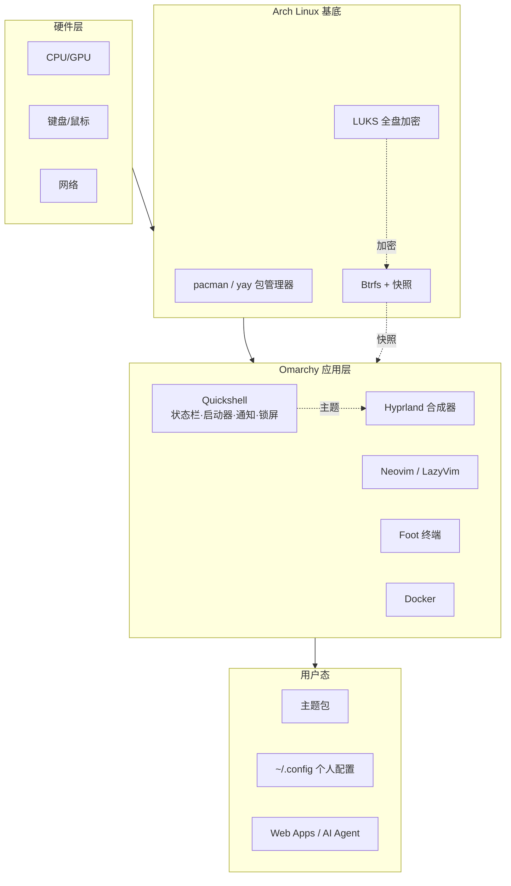
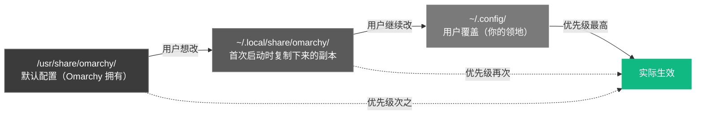

# Omarchy 与 Hyprland 操作和配置教程

> 写给想用 Arch + Hyprland、但不想自己拼装三周的开发者的实战指南。读完这篇教程，你将完成从装机到日常驱动、主题定制、问题排查的完整闭环。

## 0. 前言

### 0.1 Omarchy 是什么

Omarchy 是 **Ruby on Rails 创始人 DHH（David Heinemeier Hansson）** 在 2025 年 6 月发布的"主厨精选"（omakase）Linux 发行版，底层基于 **Arch Linux**，桌面环境使用 **Hyprland** 平铺窗口管理器，并以 **Quickshell** 提供统一的状态栏、启动器、通知、锁屏。[^github][^omarchy_org]

它的核心理念是：

- **开箱即用**：一个 ISO，15 分钟装完，就是一套完整的开发者工作站
- **键盘优先**：所有操作都有快捷键，没有图标海洋、没有开始菜单
- **审美当先**：内置 21 套主题，整套系统（终端、编辑器、状态栏、通知、锁屏）一键换肤
- **零供应商锁定**：磁盘可读、配置是纯文本、所有东西可导出[^ulrich]

> Hyprland 是基于 wlroots 的 Wayland 合成器。它把窗口按"平铺（tiling）"方式自动排列——你不再拖拽窗口，每个新窗口自动分走屏幕的一部分。

### 0.2 这份教程能给你什么

| 你将学会                     | 你将能避免           |
| ------------------------ | --------------- |
| 用 ISO 在 15 分钟内安装 Omarchy | 在 Arch 维基里迷失一整天 |
| 掌握 30 个核心快捷键             | 用鼠标反复点击找应用      |
| 理解 Omarchy 的配置层级         | 改了文件被更新覆盖       |
| 切换、安装、自制主题               | 在 GitHub 找配色方案  |
| 用 omarchy-* 命令工具箱管理系统    | 死记硬背配置路径        |
| 用快照（snapshot）回滚坏掉的更新     | 一次更新后重装系统       |
| 排查最常见的安装与运行问题            | 安装失败后抓耳挠腮       |

### 0.3 系统架构

先看一眼 Omarchy 的组件关系，理解后面所有操作的位置感：



`★ 关键点`：Omarchy 的所有配置都遵循"**用户态覆盖默认态**"原则——默认在 `/usr/share/omarchy`，你的修改在 `~/.config/`，这样每次系统更新都不会破坏你的设置。

---

## 1. 安装篇

### 1.1 准备工作

在开始之前，确认你具备以下条件：

- **UEFI 固件**的电脑（2012 年后的机器基本都满足）
- **≥4 GB U 盘**（推荐 8 GB）
- **有线键盘**或 2.4GHz 无线键鼠（**蓝牙键盘无法**输入 LUKS 加密密码）
- **稳定的有线网络**（首次安装强烈推荐有线，Wi-Fi 也可以）
- **目标磁盘 ≥20 GB** 空闲空间（推荐 50 GB+ 留出余地）

> 💡 **Omarchy 自己的"最低配置声明"**是 2011 年的 ThinkPad X220 加 2 GB 内存[^tuxai_review]。但要舒适运行 Docker、浏览器、IDE，建议至少 **8 GB RAM**。

如果你要双系统并存 Windows，准备工作多一步：

```text
1. 在 Windows 里打开"磁盘管理"
2. 右键 C: 盘 → "压缩卷" → 压出 350 GB 以上未分配空间
3. 务必关闭 BitLocker（Omarchy 会用自己的 LUKS 加密）
4. 不要把释放的空间"格式化"，保持"未分配"状态
```

### 1.2 下载 ISO

打开 [omarchy.org](https://omarchy.org)，下载最新版本（目前为 **v4.0.0 "Quattro"**）。建议使用种子下载或国内镜像加速。

下载后核对 SHA256：

```bash
sha256sum omarchy-4.0.0.iso
# 与 omarchy.org 上公布的校验码对比
```

### 1.3 制作启动盘

**macOS / Windows 用户**：下载 [balenaEtcher](https://etcher.balena.io)，三步写入。

**Linux 用户**：

```bash
# 1. 确认 U 盘设备名（千万别选错！）
lsblk

# 2. 写入 ISO（将 /dev/sdX 替换为你的 U 盘设备）
sudo dd if=omarchy-4.0.0.iso of=/dev/sdX bs=4M status=progress oflag=sync
```

> ⚠️ **`dd` 是不可逆操作。** 写错设备名会清空一块硬盘。三次确认 `of=/dev/sdX` 中的 `sdX`。

### 1.4 关闭 Secure Boot 与 TPM

Omarchy 安装器**未做微软签名**，因此 Secure Boot 必须禁用：

1. 重启电脑，启动时狂按 `Del` / `F2` / `F12` / `Esc`（按主板品牌）
2. 找到 **Security** 或 **Boot** 菜单
3. **Secure Boot → Disabled**
4. **TPM / PTT / fTPM → Disabled**（不同主板叫法不同）
5. **F10 保存退出**

| 品牌 | Secure Boot 路径 |
|---|---|
| ThinkPad | Security → Secure Boot |
| ASUS | Boot → Secure Boot Control |
| Dell | Security → Secure Boot → Secure Boot Enable |
| HP | Security → Secure Boot |

### 1.5 选择安装模式

重启，按 `F11` 或 `F12` 选择启动菜单，选 U 盘进入。从 Quattro（v4）开始，安装器先问你要哪种模式：

| 模式 | 何时用 | 后果 |
|---|---|---|
| **Full disk** | 全新装机、虚拟机 | 选中的整块磁盘被清空 |
| **Free space** | 与 Windows 共存 | 把未分配空间变成 Omarchy 分区，Windows 保留 |

> 💡 如果你是双系统，必须先在 Windows 里压缩卷并保留未分配空间（见 1.1），安装器才能识别出"free space"。

### 1.6 配置账号信息

依次填入：

- **Hostname**：机器名（例：`devbox`、`thinkpad-1`）
- **Username**：用户名（小写英文，不要有空格）
- **Password**：登录密码，**同时也是 LUKS 磁盘加密密码**——务必记牢！

> ⚠️ **LUKS 密码丢了没法恢复**。这是默认的全盘加密，没有后门。如果你不想要加密，在确认磁盘格式化时按 **Ctrl+C** 跳过。

### 1.7 等待安装完成

整个过程大约 **1–5 分钟**（Quattro 之后官方报告在 Dell、HP 上可短至 50–56 秒[^tuxai_install]）。结束后拔掉 U 盘，重启。

### 1.8 首次启动验证

重启后，Limine 引导菜单 → 选择 Omarchy → 在 LUKS 提示符输入密码 → 进入桌面。屏幕默认是 Tokyo Night 配色。

打开终端验证：

```bash
omarchy --version
# Omarchy v4.0.0

uname -r
# 6.x.x-arch1-1

hyprctl version
# Hyprland, built from branch...
```

你会看到：

```text
~ ❯ omarchy --version
Omarchy v4.0.0

~ ❯ hyprctl version
Hyprland, built from branch ... at commit ...
```

### 1.9 备选：在已有 Arch 上手动安装

如果你想保留自己的 Arch 分区布局，或者要精确控制 base 系统：

```bash
# 1. 用 archinstall 装好 Arch，**文件系统必须 btrfs，bootloader 必须 Limine**
archinstall

# 2. 一键跑 Omarchy 安装器（5-30 分钟）
curl -fsSL https://omarchy.org/install | bash
```

> ⚠️ 手动安装时如果文件系统或引导器选错（比如 ext4、systemd-boot），Omarchy 安装器会失败。

---

## 2. 基础操作篇

> 这一节是整个教程的"**Learn by Doing**"主体。请**在真实系统上一边做一边读**，每一步都会告诉你"你应该看到什么"。

### 2.1 第一次按快捷键：打开终端

Omarchy 没有"开始菜单"，所有操作都从键盘开始。

按下 `Super + Enter`（Mac 用户把 `Super` 想象成 `⌘`）。

你应该看到：

```text
┌────────────────────────────────────────┐
│                                        │
│  ~ ❯                                   │  ← Foot 终端，光标闪烁
│                                        │
│                                        │
└────────────────────────────────────────┘
```

`Super` 是键盘上的 **Windows 键**（macOS 上没有，但你可以外接键鼠或在 Omarchy 菜单里换）。这是你以后 99% 时间呆的地方。

### 2.2 第二次按快捷键：感受平铺

终端是空白的——浪费空间。再按一次 `Super + Enter`。

你应该看到：

```text
┌──────────────────┬──────────────────┐
│                  │                  │
│   终端 A         │   终端 B         │
│                  │                  │
│                  │                  │
└──────────────────┴──────────────────┘
```

屏幕被**自动平分**成左右两半。这不是巧合，这是 **Hyprland 的"平铺（tiling）"**行为——每个新窗口自动占据屏幕的一部分，不会重叠，也不会浪费像素。

按 `Super + J`：

```text
┌────────────────────────────────────────┐
│                                        │
│              终端 A                     │
├────────────────────────────────────────┤
│              终端 B                     │
└────────────────────────────────────────┘
```

分割方向从水平变成垂直。再按一次回到水平。

### 2.3 第三次按快捷键：工作区

打开两个终端后，假设你想跑点别的，比如打开 Obsidian。按 `Super + 2`。

你应该看到：终端不见了，屏幕变成空的工作区 2，状态栏第 2 格高亮。

> 💡 **工作区（workspace）就是你的"虚拟桌面"。** Omarchy 提供 9 个工作区，`Super+1` 到 `Super+9` 切换。**这是从 macOS / Windows 迁移过来最大的思维转换**——不再用"打开 20 个窗口在同一个桌面"。

按 `Super + Shift + Enter`（注意 Shift）打开浏览器：

```text
┌────────────────────────────────────────┐
│                                        │
│           Chromium 浏览器                │
│                                        │
└────────────────────────────────────────┘
```

按 `Super + 1` 回到工作区 1，再按 `Super + Shift + 2`——浏览器被"移走"到工作区 2，工作区 1 又空了。

**四个最重要的快捷键**：

| 按键 | 作用 |
|---|---|
| `Super+1..9` | 切换到工作区 N |
| `Super+Shift+1..9` | 把当前窗口移到工作区 N |
| `Super+Tab` | 切换到下一个工作区 |
| `Super+Shift+←/→` | 交换相邻窗口的位置 |

### 2.4 启动应用：Super+Space

按 `Super + Space`。你应该看到一个浮动的应用启动器，输入框、图标列表：

```text
┌──────────────────────────────────┐
│  🔍 search...                    │
├──────────────────────────────────┤
│  📁 Files                       │
│  ⚙️  Settings                   │
│  🖥️  Terminal                   │
│  🌐 Browser                     │
│  ...                            │
└──────────────────────────────────┘
```

输入 `obsi` 回车，会启动 Obsidian。这个启动器就是 Quickshell 自带的——v3 之前叫 **Walker**，v4 统一进 Quickshell。

### 2.5 万能菜单：Super+Alt+Space

按 `Super + Alt + Space`。这是 Omarchy 真正的"系统菜单"，分类清晰：

```text
┌──────────────────────────────────┐
│  Apps     → 应用启动              │
│  Install  → 装新软件 / 主题       │
│  Style    → 主题 / 壁纸 / 字体    │
│  Setup    → 显示器 / 输入 / 网络   │
│  Update   → 系统更新              │
│  System   → 锁屏 / 重启 / 关机    │
│  ...                            │
└──────────────────────────────────┘
```

> 💡 当你不知道某个功能在哪时，**第一反应应该是开这个菜单**。它覆盖了 90% 的日常需求。

### 2.6 万能快捷键查询：Super+K

按 `Super + K`，弹出**可搜索的快捷键速查表**。这是你第一周最常用的键——遇到忘了的快捷键就开它，输入关键词（比如 `theme`）过滤。

### 2.7 关闭系统：Super+Esc

按 `Super + Esc`，弹出系统菜单：锁屏、休眠、重启、关机。回车选择。

### 2.8 速查表（建议收藏）

| 类别 | 快捷键 | 功能 |
|---|---|---|
| 启动 | `Super+Enter` | 打开终端 |
| | `Super+Shift+Enter` | 打开浏览器 |
| | `Super+Alt+Space` | Omarchy 主菜单 |
| | `Super+Space` | 应用启动器 |
| | `Super+K` | 快捷键速查 |
| | `Super+Esc` | 系统菜单 |
| 窗口 | `Super+W` | 关闭窗口 |
| | `Super+Q` | 关闭窗口（同 W） |
| | `Super+F` | 全屏 |
| | `Super+T` | 浮动 ↔ 平铺 |
| | `Super+J` | 切换分割方向 |
| | `Super+O` | 钉住窗口（pinned floating） |
| | `Super+S` | 暂存区（scratchpad） |
| 工作区 | `Super+1..9` | 切换工作区 |
| | `Super+Shift+1..9` | 移动窗口到工作区 |
| | `Super+Tab` | 下一工作区 |
| 系统 | `Super+Ctrl+L` | 锁屏 |
| | `Super+Ctrl+N` | 夜间模式 |
| | `Super+Ctrl+W` | Wi-Fi 切换 |
| | `Super+Ctrl+B` | 蓝牙 |
| | `Super+Ctrl+A` | 音频 |
| | `Super+Ctrl+P` | 电源 |
| | `Super+C/V` | 通用复制/粘贴 |
| | `Super+Ctrl+V` | 剪贴板历史 |
| 捕获 | `PrtSc` | 截图 |
| | `Alt+PrtSc` | 录屏 |
| | `Super+PrtSc` | 取色器 |
| | `Super+Ctrl+PrtSc` | OCR 文字识别 |
| 主题 | `Super+Shift+Ctrl+Space` | 主题选择 |
| | `Super+Ctrl+Space` | 切换壁纸 |

> ⚠️ Quattro 把 Waybar / Walker / Mako / hyprlock / hypridle 全部替换成 Quickshell 的单一进程[^release_v4]，所以有些快捷键在不同小版本上略有差异。**以你本机 `Super+K` 显示的为准**。

---

## 3. 配置篇

> 这一节教你"改一个东西不动其它东西"的 Omarchy 配置方式。

### 3.1 配置层级关系

Omarchy 的所有文件分为两层，理解这张图就理解了 80% 的配置心智模型：



**三个真相**：

1. **不要直接改 `/usr/share/omarchy/`**——下次更新会被覆盖
2. **`~/.local/share/omarchy/` 是 Omarchy 自动管的**，里面是默认副本
3. **`~/.config/` 是你的领地**——放你的覆盖文件，优先级最高

### 3.2 Hyprland 配置文件结构

Hyprland 的所有配置都在 `~/.config/hypr/`：

```text
~/.config/hypr/
├── hyprland.conf         # 主入口，加载其它文件
├── input.lua             # 键盘、鼠标、触控板
├── monitors.lua          # 显示器布局、缩放、刷新率
├── bindings.conf         # 快捷键
├── windowrules.conf      # 窗口规则（哪些应用默认浮动等）
├── looknfeel.conf        # 外观（圆角、阴影、动画）
├── envs.conf             # 环境变量
└── autostart.conf        # 启动时自动运行的命令

```

主配置文件 `hyprland.conf` 通过 `source = ...` 指令串联其它文件，结构非常清晰[^hyprland_wiki]。

### 3.3 第一个修改：改变键盘布局

Omarchy 默认装好是 US QWERTY。如果你不是 QWERTY 用户（比如中文用户用拼音），第一件事就是改布局。

打开 `~/.config/hypr/input.lua`：

```lua
input {
    kb_layout = us  ← 改成 cn / fr / de / jp 等
    follow_mouse = 1
    ...
}
```

保存后让它生效：

```bash
hyprctl reload
```

你应该看到：**立即生效**——无需重启会话，无需重新登录。如果屏幕上的输入立刻按新布局工作，说明配置成功。

### 3.4 第二个修改：调显示缩放

高分辨率屏幕（2K、3K、4K）的默认缩放可能太大或太小。

打开 `~/.config/hypr/monitors.lua`，找到：

```lua
local omarchy_monitor_scale = "auto"
```

替换为具体数值[^ulrich]：

| 数值 | 适合 |
|---|---|
| `2.0` | 默认（最大、最锐） |
| `1.75` | 中间 |
| `1.6` | **多 25% 可用空间**（推荐） |
| `1.5` | 紧凑（屏幕小但内容多） |

```bash
hyprctl reload
```

你应该看到：**屏幕元素整体放大/缩小**，但分辨率不变（这与 Windows 的"改变分辨率"不同）。

### 3.5 第三个修改：加自定义快捷键

打开 `~/.config/hypr/bindings.conf`，添加一行：

```ini
# 触发自定义脚本
bind = SUPER, X, exec, ~/scripts/switch.sh
```

保存后：

```bash
hyprctl reload
```

按 `Super+X` 测试，脚本会被执行。

> 💡 **常用模式**：把 `bind` 的 `exec` 后面换成你想启动的程序，比如 `firefox`、`kitty`、`code`。

### 3.6 改完不想用了？安全回滚

如果改坏了，最简单的恢复方式是删除你的覆盖文件，让默认生效：

```bash
# 例：放弃所有键盘配置，恢复默认
rm ~/.config/hypr/input.lua
hyprctl reload
```

或者回滚整个 `~/.config/hypr/`：

```bash
mv ~/.config/hypr ~/.config/hypr.bak
omarchy-update   # 重新拉取默认配置
```

---

## 4. 主题与美化篇

### 4.1 21 套内置主题

Omarchy 内置 21 套完整主题（一键改变壁纸、终端、Neovim、状态栏、通知、锁屏）：

```text
aesthetic        catppuccin          catppuccin-latte
ethereal        everforest          flexoki-light
gruvbox         kanagawa            last-horizon
lumon           lupine              matte-black
mias            nord                osaka-jade
retro-82        ristretto           rose-pine
solitude        tokyo-night (默认)
```

### 4.2 用快捷键试主题

按 `Super+Shift+Ctrl+Space`。弹出主题选择器，每个主题**带实时预览**——选中的瞬间，整个系统的终端、编辑器、状态栏全部换肤。

你应该看到：**预览面板显示选中主题的配色**，按 Enter 应用，壁纸、终端、Neovim、状态栏**同步切换**。

### 4.3 用命令行切主题

```bash
omarchy-theme-set tokyo-night
```

只换壁纸：

```bash
# 或快捷键 Super+Ctrl+Space
omarchy-theme-bg-next
```

### 4.4 安装社区主题

社区在 [omarchythemes.com](https://omarchythemes.com) 维护主题目录。安装方式：

```bash
# 接受一个 Git 仓库作为主题
omarchy-theme-install https://github.com/<user>/<repo>

# 列出已安装主题
omarchy-theme-list

# 更新主题
omarchy-theme-update
```

> ⚠️ **安全提示**：Omarchy 安装主题时**只接受颜色文件和壁纸**，自动过滤掉 Lua / 终端配置等可执行内容[^ulrich]——主题作者无法通过主题运行任意代码。

### 4.5 自制主题

主题的目录结构（在 `~/.config/omarchy/themes/<your-theme>/`）：

```text
your-theme/
├── alacritty.toml          # 终端配色（如果用 alacritty）
├── btop.theme             # btop 主题
├── cava.conf              # 音频可视化
├── chromium.theme         # 浏览器配色
├── ghostty                # 终端
├── gtk.css                # GTK 应用
├── hyprland-colors.conf   # Hyprland 配色
├── hyprlock.conf          # 锁屏
├── mako.ini               # 通知
├── neovim.lua             # Neovim
├── spotify.ini
├── swayosd.css
├── vscode.json
├── waybar.css             # （v3 之前）
├── walker.css             # （v3 之前）
├── waybar.json
└── backgrounds/           # 壁纸
    ├── 1.jpg
    ├── 2.jpg
    └── 3.jpg
```

最简单的方式：**复制一份现有主题，改颜色值和壁纸**。

```bash
# 1. 复制一个主题
cp -r ~/.config/omarchy/themes/tokyo-night ~/.config/omarchy/themes/my-zen

# 2. 修改颜色：编辑 hyprland-colors.conf 里的 hex 值
# 3. 替换壁纸：覆盖 backgrounds/ 下的图片
# 4. 重新打开主题菜单（Super+Shift+Ctrl+Space）就能看到 my-zen
```

发布：推到 GitHub，让用户用 `omarchy-theme-install <url>` 安装。

---

## 5. 实用功能篇

### 5.1 截图、OCR、取色、录屏

Omarchy 把这些高频操作都做成了一键：

| 操作 | 快捷键 | 命令等价 |
|---|---|---|
| 区域截图 | `PrtSc` | `omarchy-capture-screenshot` |
| 全屏录屏 | `Alt+PrtSc` | `omarchy-capture-screenrecording` |
| OCR 提取文字 | `Super+Ctrl+PrtSc` | `omarchy-capture-text` |
| 取色器 | `Super+PrtSc` | — |
| 读 QR 码 | — | `omarchy-capture-qr` |

> 💡 **OCR 妙用**：选中区域里的所有文字（包括图片里的电话号码、邮箱、地址）会被复制到剪贴板，按 `Super+V` 粘贴。

### 5.2 剪贴板历史

按 `Super+Ctrl+V` 弹出剪贴板历史——所有复制过的文本、图片都保留可查。文本和图片都支持搜索。

### 5.3 Web Apps：把网页当原生应用

Omarchy 用 Chromium 把网页包装成"独立窗口"应用：

```bash
# 命令行
omarchy-webapp-install "WhatsApp" "https://web.whatsapp.com"
omarchy-webapp-install "YouTube" "https://youtube.com"
```

或者 `Super+Alt+Space` → **Install → Web App** → 输入名称、URL、图标 URL。

Omarchy 默认预装了 HEY、X、YouTube、WhatsApp、Google Maps、YouTube Music 等约 10 个 Web App。

卸载：`Super+Alt+Space` → **Remove → Web App**。

### 5.4 AI Agent 集成

Omarchy 4 把 AI 编程代理作为"一等公民"集成进状态栏[^release_v4]：

- 默认安装 **OpenCode**（`c` 命令）和 **Claude Code**（`cx` 命令）
- 状态栏右侧显示代理使用统计（Claude Code / Codex / Fireworks）
- `Super+Shift+Ctrl+A` 在独立窗口启动默认代理
- 切换默认代理：

```bash
omarchy default agent claude    # 或 codex / gemini / opencode
```

支持的代理：Claude Code、Codex、Gemini CLI、OpenCode、Cursor、Aider、Goose、Continue、Factory。

### 5.5 本地语音输入

```bash
omarchy-voxtype-install
```

按住 `F9` 在任何输入框语音输入，默认用本地 Whisper 模型（约 150 MB），数据不出本机。

### 5.6 命令工具箱一览

Omarchy 提供 200+ 个 `omarchy-*` 命令。在终端按 `omarchy-` 然后 `Tab` 补全会列出所有。常用分组：

```bash
# 主题
omarchy-theme list              # 列出可用主题
omarchy-theme set <name>       # 应用主题
omarchy-theme install <url>     # 从 git 安装

# 字体
omarchy-font list              # 列出字体
omarchy-font set <name>        # 设置全局字体

# 切换类
omarchy-toggle-nightlight      # 夜间模式
omarchy-toggle-idle            # 闲置锁定
omarchy-toggle-touchpad
omarchy-toggle-bar
omarchy-toggle-screensaver
omarchy-toggle-notification-silencing

# 捕获
omarchy-capture-screenshot
omarchy-capture-screenrecording
omarchy-capture-text           # OCR
omarchy-capture-qr             # QR

# 维护
omarchy-update                 # 系统+Omarchy 更新（先快照）
omarchy-update-firmware        # 固件更新
omarchy-update-orphan-pkgs     # 清理孤立包
omarchy-update-keyring          # 修复 pacman 签名
omarchy-update-analyze-logs    # 分析失败日志
omarchy-upload-log             # 生成日志分享链接

# 调试
omarchy-debug                  # 打印调试信息
hyprctl reload                 # 重载 Hyprland 配置
```

---

## 6. 更新与快照篇

### 6.1 Omarchy 更新机制

Omarchy 的更新是"**先快照，后升级**"的——每次更新前自动给系统拍一张 Btrfs 快照，万一升级出问题可以从 Limine 启动菜单回滚。

```bash
# 推荐：一次更新 Omarchy + 系统包 + AUR + 固件
omarchy-update

# 只更新 Arch 系统包
sudo pacman -Syu

# 检查 Omarchy 更新状态
omarchy dev status
```

**Omarchy 的更新频道**（`omarchy-channel-set` 切换）：

| 频道 | 适合 |
|---|---|
| `stable` | 默认，生产用 |
| `rc` | 想提前一周拿到功能 |
| `edge` | 当天构建 |
| `dev` | 开发者内部 |

### 6.2 Btrfs 快照回滚

Omarchy 用 **Limine 启动器**（不是 systemd-boot）配合 Btrfs 快照，每次更新都会创建可引导的快照。

回滚步骤：

```text
1. 重启电脑
2. 在 Limine 启动菜单（蓝色界面）选 "Snapshots"
3. 选一个之前的时间点
4. 回车启动
5. 如果确认没问题，可以把坏快照删掉：
   sudo btrfs subvolume delete /mnt/@snapshots/...
```

> 💡 **快照能救命**："昨天还能用、今天更新挂了"——以前重装，现在从菜单里选旧快照，30 秒回到昨天。

### 6.3 通道切换

```bash
omarchy-channel-current          # 查看当前频道
omarchy-channel-set edge         # 切换到 edge
```

---

## 7. 高级配置篇

### 7.1 多显示器配置

把笔记本接到外接显示器上，Omarchy 默认会**自动镜像**。想要扩展模式：

```bash
# 列出所有输出
hyprctl monitors

# 例：eDP-1 是笔记本，DP-1 是外接屏
hyprctl keyword monitor "eDP-1,2880x1800@120,0x0,1.6"
hyprctl keyword monitor "DP-1,1920x1080@60,2880x0,1"
```

或者编辑 `~/.config/hypr/monitors.lua`：

```lua
local omarchy_monitor_work = "DP-1, 3440x1440@144, 0x0, 1"
local omarchy_monitor_scale = "1"
```

```bash
hyprctl reload
```

### 7.2 高刷新率显示器

如果你设置 165Hz / 240Hz 后屏幕冻死：

```text
1. Ctrl+Alt+F3 切到 TTY
2. 用你的用户名密码登录
3. 编辑 ~/.config/hypr/monitors.lua，把刷新率改回安全值（如 60）
4. hyprctl reload（或 reboot）
```

### 7.3 远程桌面（VNC）

Hyprland 是 Wayland，传统 X11 远程桌面工具用不了。社区推荐 **WayVNC**：

```bash
sudo pacman -S wayvnc

# 创建虚拟 headless 输出
hyprctl output create headless VNC-1
hyprctl keyword monitor "VNC-1,1920x1080@60,auto,1"

# 启动 VNC 服务
wayvnc -o VNC-1 127.0.0.1 5900
```

用任意 VNC 客户端连 `5900` 端口。

### 7.4 NVIDIA 显卡

Omarchy 不自动装 NVIDIA 闭源驱动，需要手动装：

```bash
sudo pacman -S nvidia nvidia-utils nvidia-settings
sudo reboot

# 验证
nvidia-smi
```

AMD 显卡（amdgpu 内核自带）和 Intel 核显都开箱即用。

### 7.5 自定义 hooks（Quattro 新特性）

Quattro 引入了 `~/.config/omarchy/hooks/` 目录，你可以挂自定义脚本：

```bash
# 例：开机后自动拉取 dotfiles
mkdir -p ~/.config/omarchy/hooks
cat > ~/.config/omarchy/hooks/post-update.sh << 'EOF'
#!/bin/bash
cd ~/dotfiles && git pull
EOF
chmod +x ~/.config/omarchy/hooks/post-update.sh
```

参考 `omarchy dev add-migration` 添加更复杂的迁移逻辑。

---

## 8. 故障排除篇

### 8.1 安装时

| 症状 | 原因 | 解决方案 |
|---|---|---|
| "Secure Boot is enabled" | 未关闭 Secure Boot | 回到 BIOS 关闭 |
| LUKS 密码输不进 | 蓝牙键盘 | 换有线键盘或 USB 2.4GHz 无线 |
| 安装器看不到 free space | 没在 Windows 里压缩卷 | 回到 1.1 重做 |
| BitLocker 干扰 | Windows 启用了 BitLocker | Windows 里关闭 BitLocker |

### 8.2 启动时

| 症状 | 诊断 | 解决方案 |
|---|---|---|
| 黑屏不进入桌面 | GPU 驱动问题 | `Ctrl+Alt+F2` 切 TTY，`cat ~/.local/share/hyprland/hyprland.log \| tail -50` 看错误 |
| 卡死 | 高刷新率配置错误 | TTY 改回安全刷新率 |
| Hyprland 配置报错 | 配置文件写错 | `hyprctl reload`，看错误定位 |

### 8.3 运行时

| 症状 | 解决方案 |
|---|---|
| 屏幕分享在会议里不工作 | 重启 Chromium；Wayland portal 会弹出选源对话框 |
| 界面元素太大 / 太小 | 改 `~/.config/hypr/monitors.lua` 的 `omarchy_monitor_scale`，`hyprctl reload` |
| 某个应用模糊 | 它是 X11 应用（XWayland），给 Electron 应用加 `--ozone-platform=wayland` |
| `pacman` 报 GPG 签名错 | `omarchy-update-keyring`，再 `pacman -Syu` |
| 蓝牙抽风 | `Super+Ctrl+B` 看 GUI，或 `bluetoothctl` 命令行 |
| 更新挂掉 | 重启，从 Limine 选旧快照 |
| 想查日志 | `journalctl -b`（本会话），`journalctl -b -1`（上一次） |
| 想要帮助 | `omarchy-upload-log` 生成可分享链接 |

### 8.4 找 Omarchy 调试信息

```bash
omarchy debug
```

会打印系统版本、内核、Hyprland 版本、最近日志、硬件信息等。复制粘贴到 GitHub issue 或论坛求助。

---

## 9. 总结与下一步

### 9.1 你已经掌握的内容

- ✅ 用 ISO 在 15 分钟内装好 Omarchy（Full disk 与 Dual boot）
- ✅ 理解平铺窗口管理器的工作流（窗口自动排、工作区分屏）
- ✅ 30+ 核心快捷键（启动器、菜单、窗口、工作区、捕获、主题）
- ✅ 修改 Hyprland 配置（键盘、缩放、自定义快捷键）
- ✅ 切换、安装、自制主题
- ✅ 用 omarchy-* 命令工具箱管理日常
- ✅ 用 omarchy-update + Btrfs 快照安全更新
- ✅ 排查 8 类常见故障

### 9.2 下一步建议

按难度递增：

1. **探索 Omarchy 菜单**——把它当成你的"系统设置中心"，每个分类都点一遍
2. **建一个自己的工作流**——把常用应用固定到工作区（浏览器 1，编辑器 2，终端 3）
3. **写自己的第一个主题**——从 `tokyo-night` 复制，改 2 个颜色值，体验完整流程
4. **接一个 Web App**——把"每天开 10 次"的网站变成独立窗口
5. **深入 Hyprland**——读 [Hyprland Wiki](https://wiki.hyprland.org)，学动画、布局算法、脚本化控制
6. **试 AI Agent**——`omarchy default agent claude` 切换默认代理，体验 AI 与系统深度集成

### 9.3 命令清单速查

```text
# 安装相关
omarchy --version
omarchy help
omarchy update
omarchy dev status

# 主题
omarchy-theme list / set / install / update

# 字体
omarchy-font list / set

# 切换
omarchy-toggle-{nightlight,idle,touchpad,bar,screensaver,notification-silencing}

# 捕获
omarchy-capture-{screenshot,screenrecording,text,qr}

# 维护
omarchy-update
omarchy-update-firmware
omarchy-update-orphan-pkgs
omarchy-update-keyring
omarchy-upload-log

# Hyprland
hyprctl reload
hyprctl monitors
hyprctl clients
```

### 9.4 参考资源

| 资源 | 用途 | 链接 |
|---|---|---|
| Omarchy 官网 | ISO 下载、最新新闻 | <https://omarchy.org> |
| Omarchy GitHub | 源码、Issue、Release | <https://github.com/basecamp/omarchy> |
| Omarchy 官方手册 | 完整权威文档 | <https://learn.omacom.io/2/the-omarchy-manual> |
| Hyprland Wiki | Hyprland 深入文档 | <https://wiki.hyprland.org> |
| Arch Wiki | Linux 通用知识 | <https://wiki.archlinux.org> |
| omarchythemes.com | 社区主题 | <https://omarchythemes.com> |
| DHH 的博客 | 项目哲学 | <https://world.hey.com/dhh> |
| Omarchy Release Notes | 版本变更 | <https://github.com/basecamp/omarchy/releases> |

---

## 附录：常见配置代码片段

### A.1 调出常用应用

```ini
# ~/.config/hypr/bindings.conf

# VSCode
bind = SUPER, C, exec, code

# Firefox（如果你换了浏览器）
bind = SUPER SHIFT, F, exec, firefox

# Spotify
bind = SUPER, M, exec, spotify
```

### A.2 给特定应用设默认浮动

```ini
# ~/.config/hypr/windowrules.conf

# 始终浮动：任务管理器、截图工具、计算器
windowrulev2 = float, class:^(gnome-calculator)$
windowrulev2 = float, class:^(blueman-manager)$
windowrulev2 = float, class:^(pavucontrol)$

# 始终在某个工作区启动
windowrulev2 = workspace 2, class:^(code)$
```

### A.3 调动画速度

```ini
# ~/.config/hypr/looknfeel.conf

animations {
    enabled = yes
    
    # 越快越跟手，越慢越优雅
    bezier = myBezier, 0.05, 0.9, 0.1, 1.05
    
    animation = windows, 1, 7, myBezier
    animation = fade, 1, 7, default
    animation = workspaces, 1, 6, default
}
```

### A.4 给窗口圆角

```ini
decoration {
    rounding = 10        # 像素值，越大越圆
    blur {
        enabled = true
        size = 5
        passes = 3
    }
    
    shadow {
        enabled = true
        range = 15
        render_power = 3
        color = rgba(0, 0, 0, 0.5)
    }
}
```

### A.5 启动时自动跑脚本

```ini
# ~/.config/hypr/autostart.conf

exec-once = waybar
exec-once = ~/scripts/start-tailscale.sh
exec-once = /usr/lib/polkit-gnome/polkit-agent
```

### A.6 关闭 lid-switch（让合盖不挂起）

```ini
# ~/.config/hypr/autostart.conf

exec-once = systemctl mask sleep.target suspend.target hibernate.target hybrid-sleep.target
```

> ⚠️ 这会让**所有**挂起都失效，不只是合盖。慎重。

---

> **最后一句**：Omarchy 的精髓是"**先相信，再定制**"。第一次用别急着改配置，先用默认设置过一周，等你**真正**感到"这里不顺手"时再去改——你的每一次修改都会有的放矢，而不是空中楼阁。

[^github]: basecamp/omarchy GitHub Repository. <https://github.com/basecamp/omarchy>
[^omarchy_org]: Omarchy Official Website. <https://omarchy.org>
[^ulrich]: Omarchy: the complete guide (install, shortcuts, themes, tips). <https://ulrichrozier.com/omarchy/en/>
[^release_v4]: Omarchy v4.0.0 "Quattro" Release. <https://github.com/basecamp/omarchy/releases/tag/v4.0.0>
[^tuxai_install]: How to Install Omarchy on Arch Linux: Quattro (v4) Setup Guide. <https://tuxai.dev/how-to-install-omarchy-arch-linux/>
[^tuxai_review]: Omarchy Review: Is DHH's Quattro (v4) Arch Linux Distro Worth It?. <https://tuxai.dev/omarchy-review/>
[^hyprland_wiki]: Hyprland Official Wiki. <https://wiki.hyprland.org>
