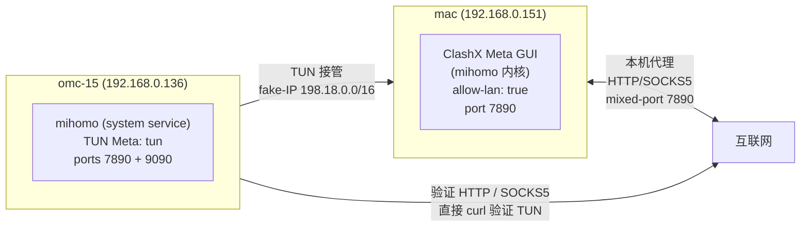

# Omarchy 安装 Mihomo (Clash Meta) 操作记录（v2 重写版）

> 在另一台机器（mac，已跑 ClashX Meta + 订阅）的前提下，把同一份订阅 + TUN 全流量接管搬到 Omarchy 主机。
> 本文档基于 2026-09-16 在 `omc-15`（Omarchy 4.0.3）上完整跑通一次后重写，所有命令都实测过。

## 0. 角色与前提

### 0.1 网络拓扑



| 角色 | 机器 | IP | 软件 |
|---|---|---|---|
| 上游代理（已有） | macOS | 192.168.0.151 | **ClashX Meta**（GUI + mihomo 内核），allow-lan |
| 下游代理（本次装） | Omarchy (Arch 内核, Hyprland) | 192.168.0.136 | mihomo + TUN 接管 |

### 0.2 订阅

- 提供商：**貝雪雲** (besnow)
- URL：`https://papaya.besnow.uk/api/v1/client/subscribe?token=...`（token 在订阅 URL 里，不存本地）
- **关键事实**：besnow 走 Cloudflare Bot Management，**只有 mihomo 内核客户端能过**；curl（无论直连还是走代理）一律 403。这是测过的实测，不是 playbook 抄来的。

### 0.3 与原 playbook 的 3 个差异

1. **mac 客户端是 ClashX Meta**（不是 Clash Verge）。订阅 cache 路径完全不同
2. **网络段是 192.168.0.0/24**（原 playbook 写的 192.168.31.0/24 已过时）
3. **playbook §10 mihomo-ctl 的 `groups` 段有 bug**：type 名大小写不匹配，下面有修复说明

---

## 1. mac 端准备：找到订阅 cache yaml

```bash
# === mac 终端 ===

# 1. 找到最新订阅 cache yaml
ls -lat ~/Library/Caches/com.MetaCubeX.ClashX.meta/cacheConfigs/ | head -3
# 输出类似：
#   -rw-r--r--  1 zhaoxin  staff  208721 Sep 16 11:03 F5E9D965-3E9C-4497-BE1E-E731EA91CFDC.yaml
#   -rw-r--r--  1 zhaoxin  staff  208890 Sep 14 12:34 6E40E121-AA17-4CC7-8109-1EB64ED15DA6.yaml

# 2. 验证 cache yaml 是不是完整订阅（应该看到 proxies: 段）
head -3 ~/Library/Caches/com.MetaCubeX.ClashX.meta/cacheConfigs/F5E9D965-3E9C-4497-BE1E-E731EA91CFDC.yaml
# 期望第一行: external-controller: 127.0.0.1:9090

# 3. mac 上还有 mmdb / geosite（不是 playbook 写的 Country.mmdb 大写）
ls -la ~/.config/clash.meta/{country.mmdb,geosite.dat}
# 期望看到 country.mmdb (7.9M) + geosite.dat (4.0M)
```

**坑提示**：
- 路径里 `Caches/com.MetaCubeX.ClashX.meta/` 这串不是固定值，但**不是** `Application Support/io.github.clash-verge-rev.*`（那是 Clash Verge 的路径，跟 ClashX Meta 完全不同）
- cache yaml 文件名是 GUID，每次刷新都会换。**永远 `ls -lat` 找最新的那个**

---

## 2. omc-15 端准备

### 2.1 SSH 登录 + 确认环境

```bash
ssh omc-15   # ~/.ssh/config 里配了 Host omc-15
uname -a      # 应该是 Linux omarchy-macbook15 ... x86_64
which yay     # 应该输出 /usr/bin/yay
```

### 2.2 配置 sudo 免密（必须，否则后续 `systemctl` 都得输密码）

```bash
# 必须用 visudo（做语法检查），不要 echo > /etc/sudoers
sudo visudo -f /etc/sudoers.d/99-nopasswd

# 在打开的文件里加一行（用户改成你自己的）：
zhaoxin ALL=(ALL) NOPASSWD: ALL

# 保存退出，sudo 会校验语法。下一个 sudo 命令立即生效，不用重启。
```

### 2.3 验证 mac 代理可达

```bash
# omc-15 上跑（注意每次 ssh 都要重新 export，因为不写 .bashrc）
export http_proxy=http://192.168.0.151:7890
export https_proxy=http://192.168.0.151:7890
export all_proxy=socks5://192.168.0.151:7890
export no_proxy=127.0.0.1,localhost,192.168.0.0/24

# 验证：经代理 → 200；直连 → 超时（GFW 挡了）
curl -sS --max-time 5 -x http://192.168.0.151:7890 -o /dev/null -w "via mac: HTTP %{http_code}\n" https://www.google.com
curl -sS --max-time 5 -o /dev/null -w "direct: HTTP %{http_code} time=%{time_total}s\n" https://www.google.com
```

**约定**：本文档后续所有命令都默认你已经 export 了上面 4 个变量。

---

## 3. 安装 mihomo + setcap + 验证

### 3.1 yay 装 mihomo-bin

```bash
# 确认包可见
yay -Ss mihomo-bin
# 期望: aur/mihomo-bin 1.19.31-1 ...

# 安装（二进制版，30-60 秒）
yes | yay -S --noconfirm --answeredit None --answerdiff None --removemake mihomo-bin
```

**踩坑**：
- `yay` 不认 `--noedit` / `--nodiff`，正确的是 `--answeredit None --answerdiff None`
- `--removemake` 装完删 makedepends（mihomo-bin 预编译，留着无害）

### 3.2 setcap（必须，否则 TUN 起不来）

```bash
sudo setcap cap_net_admin,cap_net_bind_service,cap_net_raw=+ep /usr/bin/mihomo
getcap /usr/bin/mihomo
# 期望: /usr/bin/mihomo cap_net_bind_service,cap_net_admin,cap_net_raw=ep
```

**关键**：**每次 `yay -S mihomo-bin` 升级后都要重跑这条**（新二进制覆盖会丢 cap）。

### 3.3 secret + 验证版本

```bash
mkdir -p ~/.config/mihomo
SECRET=$(openssl rand -hex 16)
echo "$SECRET" > ~/.config/mihomo/.secret
chmod 600 ~/.config/mihomo/.secret
echo "secret=$(cat ~/.config/mihomo/.secret)"   # 自己记下来

/usr/bin/mihomo -v
# 期望: Mihomo Meta v1.19.x linux amd64 with go1.x ... with_gvisor
```

---

## 4. 拉订阅 + mmdb + geosite（mac 端推过来）

在 **mac 终端**（不是 omc-15）跑这 4 条 scp：

```bash
# === mac 终端 ===

# 1. 推订阅 yaml（注意用 §1 找到的最新 cache 文件名）
scp ~/Library/Caches/com.MetaCubeX.ClashX.meta/cacheConfigs/<最新>.yaml \
    omc-15:.config/mihomo/config.yaml

# 2. 推 mmdb（mac 上是小写 country.mmdb，到 omc-15 上改成大写 Country.mmdb）
scp ~/.config/clash.meta/country.mmdb omc-15:.config/mihomo/Country.mmdb

# 3. 推 geosite
scp ~/.config/clash.meta/geosite.dat omc-15:.config/mihomo/

# 4. 验证（mac 端 ssh 过去看文件）
ssh omc-15 'ls -la ~/.config/mihomo/'
# 期望看到: config.yaml (~200K) + Country.mmdb (8M) + geosite.dat (4M) + .secret
```

**为什么不能从 omc-15 反向拉**：omc-15 上 curl 订阅必 403（Cloudflare JA3 指纹风控），而且 omc-15 没把 mac 加进 known_hosts（会卡 host key verification）。只能从 mac 端推。

---

## 5. 改 config.yaml

config.yaml 是订阅 cache yaml（已经是完整 clash/mihomo YAML 格式），需要改 3 处：

### 5.1 allow-lan: true → false

```bash
sed -i 's|allow-lan: true|allow-lan: false|' ~/.config/mihomo/config.yaml
grep -n "allow-lan" ~/.config/mihomo/config.yaml
# 期望: 2:allow-lan: false
```

### 5.2 awk 插入 tun + secret + geox-url（在 `^proxies:$` 前面）

```bash
SECRET=$(cat ~/.config/mihomo/.secret)

awk -v SECRET="$SECRET" '
/^proxies:$/ && !done_tun {
  print ""
  print "# --- omarchy TUN additions (Linux only) ---"
  print "geodata-mode: false"
  print "geox-url:"
  print "  geoip: \"file:///home/zhaoxin/.config/mihomo/Country.mmdb\""
  print "  geosite: \"file:///home/zhaoxin/.config/mihomo/geosite.dat\""
  print ""
  print "tun:"
  print "  enable: true"
  print "  stack: system"
  print "  auto-route: true"
  print "  auto-detect-interface: true"
  print "  auto-redirect: true"
  print "  dns-hijack:"
  print "    - any:53"
  print "    - tcp://any:53"
  print ""
  done_tun=1
}
/^external-controller:/ && !done_secret {
  print
  print "secret: \"" SECRET "\""
  done_secret=1
  next
}
{ print }
' ~/.config/mihomo/config.yaml > /tmp/new-config.yaml
mv /tmp/new-config.yaml ~/.config/mihomo/config.yaml
```

**踩坑**：
- `secret` **不能**写在 `external-controller:` 下面做子 key（它是 string 不是 map，YAML 解析会报 `did not find expected key`）
- `tun.dns-hijack` 格式必须是 `{addr}:{port}`，**不要**写 `- tcp:53`，正确是 `- tcp://any:53`
- `geox-url` 路径先用 `~/.config/mihomo/...`，**§6 移到 `/etc/mihomo/` 后会 sed 改**（下面会做）

### 5.3 验证 YAML

```bash
/usr/bin/mihomo -t -f ~/.config/mihomo/config.yaml
# 期望结尾: configuration file ... is successful
```

---

## 6. 移到 /etc/mihomo/ + 写 systemd service

### 6.1 移 config 到 system 标准位置

```bash
sudo mkdir -p /etc/mihomo
sudo cp -r ~/.config/mihomo/* /etc/mihomo/         # * 不匹配隐藏文件
sudo cp ~/.config/mihomo/.secret /etc/mihomo/.secret
sudo chown -R root:root /etc/mihomo
sudo chmod 700 /etc/mihomo
sudo chmod 600 /etc/mihomo/.secret
sudo chmod 755 /etc/mihomo/config.yaml
sudo chmod 644 /etc/mihomo/Country.mmdb /etc/mihomo/geosite.dat

# 修正 geox-url 路径（从 user home → /etc/mihomo）
sudo sed -i 's|/home/zhaoxin/.config/mihomo/|/etc/mihomo/|g' /etc/mihomo/config.yaml

# 验证
sudo grep -n "file:///etc/mihomo" /etc/mihomo/config.yaml
# 期望: 24:  geoip: "file:///etc/mihomo/Country.mmdb"
#       25:  geosite: "file:///etc/mihomo/geosite.dat"
```

### 6.2 写 systemd service（必须 root 跑，否则 TUN 接管失败）

```bash
sudo tee /etc/systemd/system/mihomo.service > /dev/null <<'EOF'
[Unit]
Description=mihomo (Clash Meta) daemon
Documentation=https://wiki.metacubex.one/
After=network-online.target
Wants=network-online.target

[Service]
Type=simple
ExecStart=/usr/bin/mihomo -d /etc/mihomo
Restart=on-failure
RestartSec=5
LimitNOFILE=1048576
CapabilityBoundingSet=CAP_NET_ADMIN CAP_NET_BIND_SERVICE CAP_NET_RAW
AmbientCapabilities=CAP_NET_ADMIN CAP_NET_BIND_SERVICE CAP_NET_RAW

[Install]
WantedBy=multi-user.target
EOF
```

**关键**：用 `AmbientCapabilities` 让 root systemd 服务的子进程继承 caps。**不能用 user systemd**（user systemd 拒绝 ambient caps，会报 `Failed at step CAPABILITIES spawning /bin/sh: Operation not permitted`，TUN 接管失败但 mixed proxy 还通，看着像工作其实没接管）。这是本文档最关键的一个坑。

### 6.3 启动

```bash
sudo systemctl daemon-reload
sudo systemctl enable --now mihomo.service
sleep 3
sudo systemctl status mihomo.service --no-pager
# 期望: Active: active (running)
#       Main PID 下: /usr/bin/mihomo -d /etc/mihomo
```

---

## 7. 验收（6 步全过才算成功）

```bash
# 7.1 service 状态
sudo systemctl status mihomo.service --no-pager    # Active: active (running)

# 7.2 端口监听
ss -tlnp | grep -E ':(7890|9090)'
# 期望: LISTEN 127.0.0.1:7890 / 127.0.0.1:9090

# 7.3 TUN 设备
ip tuntap list                       # 期望: Meta: tun
ip route | grep 198.18               # 期望: 198.18.0.0/30 dev Meta

# 7.4 mixed proxy（HTTP）
curl -sS --max-time 10 -x http://127.0.0.1:7890 -o /dev/null -w "google: %{http_code}\n" https://www.google.com
# 期望: google: 200

# 7.5 SOCKS5
curl -sS --max-time 10 --socks5-hostname 127.0.0.1:7890 -o /dev/null -w "youtube: %{http_code}\n" https://www.youtube.com
# 期望: youtube: 200

# 7.6 TUN 真接管（不配代理直连——这才是关键测试）
curl -sS --max-time 8 -o /dev/null -w "github: %{http_code}\n" https://github.com
# 期望: github: 200（直连被 GFW 挡，200 = TUN 接管成功）

# 7.7 Dashboard API
curl -sS -H "Authorization: Bearer $(sudo cat /etc/mihomo/.secret)" http://127.0.0.1:9090/version
# 期望: {"meta":true,"version":"v1.19.x"}

# 7.8 终极：git clone（DNS + TCP + TUN 全链路）
cd /tmp && rm -rf Hello-World 2>/dev/null
git clone --depth=1 https://github.com/octocat/Hello-World
ls Hello-World/
# 期望: README 文件落盘
```

**7.6 是决定性测试**：mixed proxy 通但 TUN 不接管 = 失败的安装（典型原因是 user systemd，需要换成 system service，见 §6.2）。

---

## 8. TUI 客户端 + 控制脚本

### 8.1 装 mihomo-tui-bin

```bash
yay -S --noconfirm --answeredit None --answerdiff None --removemake mihomo-tui-bin
```

### 8.2 写 TUI 配置

```bash
mkdir -p ~/.config/mihomo-tui
SECRET=$(sudo cat /etc/mihomo/.secret)
cat > ~/.config/mihomo-tui/config.yaml <<EOF
mihomo-api: http://127.0.0.1:9090
mihomo-secret: "$SECRET"
log-file: /tmp/mihomo-tui.log
log-level: error
proxy-setting:
  test-url: https://www.gstatic.com/generate_204
  test-timeout: 5000
EOF
```

### 8.3 写 mihomo-ctl 控制脚本

```bash
sudo tee /usr/local/bin/mihomo-ctl > /dev/null <<'BASH_EOF'
#!/bin/bash
# mihomo 控制脚本（system service 版）
SECRET=$(cat /etc/mihomo/.secret 2>/dev/null)
API="http://127.0.0.1:9090"
AUTH=(-H "Authorization: Bearer $SECRET")

sudo_needed() {
  if ! sudo -n true 2>/dev/null; then
    echo "(needs sudo: $1)"
    sudo -n "$@" 2>&1 || sudo "$@"
  fi
}

case "${1:-status}" in
  status)   sudo systemctl status mihomo --no-pager | head -10
            echo '--- listening ---'
            ss -tlnp 2>/dev/null | grep -E ':(7890|9090)\s'
            echo '--- TUN ---'
            ip tuntap list 2>/dev/null ;;
  restart)  sudo systemctl restart mihomo && sleep 2 && echo 'restarted' ;;
  stop)     sudo systemctl stop mihomo ;;
  start)    sudo systemctl start mihomo ;;
  logs)     sudo journalctl -u mihomo -f ;;
  log)      sudo journalctl -u mihomo -n 50 --no-pager ;;
  proxies)  curl -sS "${AUTH[@]}" $API/proxies | python3 -m json.tool 2>/dev/null | head -40 ;;
  groups)   curl -sS "${AUTH[@]}" $API/proxies | python3 -c 'import json,sys; d=json.load(sys.stdin); [print(k, "->", v.get("type")) for k,v in d.get("proxies",{}).items() if v.get("type") in ("Selector","URLTest","Fallback","LoadBalance")]' 2>/dev/null ;;
  refresh)  echo 're-download from mac: scp omc-15 mac:Library/.../<最新 cache>.yaml /etc/mihomo/config.yaml.bak'
            sudo systemctl restart mihomo ;;
  test)     echo 'HTTP proxy:'; curl -sS --max-time 5 -x http://127.0.0.1:7890 -I https://www.google.com 2>&1 | head -1
            echo 'SOCKS5:';     curl -sS --max-time 5 --socks5-hostname 127.0.0.1:7890 -I https://www.youtube.com 2>&1 | head -1
            echo 'TUN (no proxy):'; curl -sS --max-time 5 -I https://github.com 2>&1 | head -1 ;;
  tui)      command -v mihomo-tui >/dev/null 2>&1 || { echo 'mihomo-tui not installed (yay -S mihomo-tui-bin)'; exit 1; }
            exec mihomo-tui ;;
  *)        echo "Usage: mihomo-ctl {status|start|stop|restart|logs|log|proxies|groups|refresh|test|tui}" ;;
esac
BASH_EOF
sudo chmod +x /usr/local/bin/mihomo-ctl
sudo bash -n /usr/local/bin/mihomo-ctl && echo "syntax OK"
```

**playbook 原版的 bug**：原版 `groups` 段写的是 `"select","url-test","fallback","load-balance"`（小写），但 mihomo 1.19 实际返回的是 `"Selector","URLTest"`（大写），匹配不到任何东西。**上面版本已经修复**，type 名按 mihomo API 实际大小写。

### 8.4 TUI 启动

```bash
sudo mihomo-tui
```

TUI 键位（potoo0/mihomo-tui）：
- `Tab` / `Shift+Tab`：切换面板
- `↑/↓` 或 `j/k`：上下选
- `Enter`：确认
- `Space`：延迟测试
- `u` / `d`：上一/下一节点
- `?`：帮助
- `q` / `Esc`：退出
- `r`：reload 配置
- `:`：命令模式

**注意**：TUI 需要交互式 terminal，**SSH 直接跑会卡死**。在 Hyprland 桌面 / wezterm / alacritty 里直接跑。

---

## 9. 日常 ops 习惯

### 9.1 升级 mihomo-bin（必带 setcap）

```bash
yay -S --noconfirm mihomo-bin
sudo setcap cap_net_admin,cap_net_bind_service,cap_net_raw=+ep /usr/bin/mihomo
sudo systemctl restart mihomo.service
sudo mihomo-ctl test     # 验证 TUN 还在工作
```

升级后忘了 setcap 是最常见的故障（mixed proxy 通但 TUN 失败）。

### 9.2 日常三板斧

```bash
sudo mihomo-ctl            # service 状态 + 端口 + TUN
sudo mihomo-ctl test       # HTTP / SOCKS5 / TUN 三合一
sudo mihomo-ctl log        # 最近 50 行日志
sudo mihomo-ctl groups     # 列所有代理组（Selector / URLTest）
sudo mihomo-ctl tui        # 启动 TUI（在 user terminal）
```

### 9.3 订阅更新流程

订阅想刷新：

```bash
# === mac 终端 ===
# 1. ClashX Meta GUI 里点"更新订阅"
# 2. 找到最新 cache
NEW=$(ls -t ~/Library/Caches/com.MetaCubeX.ClashX.meta/cacheConfigs/*.yaml | head -1)
echo "新订阅: $NEW"
# 3. 推过去
scp "$NEW" omc-15:/etc/mihomo/config.yaml.new
ssh omc-15 'sudo bash -c "mv /etc/mihomo/config.yaml.new /etc/mihomo/config.yaml && systemctl restart mihomo" && sleep 3 && sudo mihomo-ctl test'
```

### 9.4 文件清单（最终态）

```
/etc/mihomo/
├── config.yaml          # 主配置（订阅 + Linux TUN/auto-redirect/dns-hijack）
├── Country.mmdb         # 从 mac 复制
├── geosite.dat          # 从 mac 复制
└── .secret              # controller secret（root only, chmod 600）

/etc/systemd/system/
└── mihomo.service       # system service（root 跑，带 AmbientCapabilities）

/usr/bin/mihomo          # AUR mihomo-bin
/usr/bin/mihomo-tui      # AUR mihomo-tui-bin

/usr/local/bin/
└── mihomo-ctl           # 控制脚本

~/.config/mihomo-tui/
└── config.yaml          # TUI 客户端配置
```

旧位置 `~/.config/mihomo/` 可以留着（已经是 root 占着了，但 mihomo-ctl 直接读 /etc/mihomo/.secret，所以没用）。

---

## 10. 故障排查

### 故障 1：服务起来了但 TUN 没接管流量（**最常见也最坑**）

**症状**：
- `mihomo -t` validate 通过
- `ip tuntap list` 看到 `Meta: tun`
- 端口 7890/9090 在监听
- `curl -x http://127.0.0.1:7890 https://github.com` 通
- **`curl https://github.com`（不配代理）超时**
- `ip route show table all | grep 198.18` 只看到 fake-IP 段，**没** default route via Meta
- mihomo log 里**完全没有** `TCP ... github.com` 这类条目

**根因**：mihomo 之前用 user systemd 跑（`~/.config/systemd/user/mihomo.service`）。user systemd 服务即使 setcap 加了 cap_net_admin，**子进程拿不到这些 caps**，会报 `Failed at step CAPABILITIES spawning /bin/sh: Operation not permitted`。后果：
- mihomo 加不上 iptables / nftables 的 DNS 重定向规则
- systemd-resolved 没改成指向 198.18.0.2
- auto-route 只加 fake-IP 范围（/30）的 ip rule，不加 default route 覆盖真实外网 IP

**修**：mihomo 必须以 **root 跑**（system service），见 §6.2。

### 故障 2：服务启动失败 / TUN device busy / 端口冲突

**症状**：log 里出现 `bind: address already in use` 或 `configure tun interface: device or resource busy`。

**根因**：旧的 mihomo 进程没被杀死（user service 残留 / 手动跑过 mihomo）。

**修**：
```bash
sudo pkill -9 mihomo        # 或 sudo pkill -9 -u zhaoxin mihomo（更精确）
sleep 2
sudo systemctl restart mihomo.service
sleep 3
ss -tlnp | grep -E ':(7890|9090)'   # 应该只剩新进程
ip tuntap list                       # 应该只剩一个 Meta: tun
```

### 故障 3：升级 mihomo-bin 后 TUN 挂了

**症状**：`yay -Syu` 升级后，service 起不来 / TUN 没权限。

**根因**：`setcap` 是设在旧二进制上的，新二进制覆盖会丢。

**修**：见 §9.1（升级 4 步）。

### 故障 4：YAML 验证报 "did not find expected key"

**症状**：`yaml: line N: did not find expected key`。

**根因**：用 sed 把 `secret: "..."` 错误地缩进到 `external-controller:` 下面。`external-controller` 是 string 不是 map，secret 必须是**顶层独立 key**。

**修**：用 §5.2 的 awk 插入，别用 sed `a\`（会破坏缩进）。

### 故障 5：besnow 订阅 curl 全 403

**症状**：从任何机器 `curl https://papaya.besnow.uk/api/v1/client/subscribe?token=...` 都拿到 Cloudflare HTML（Your IP: 154.x.x.x）。

**根因**：Cloudflare Bot Management 检测客户端 TLS 指纹（JA3），curl 不像 mihomo 客户端。**走代理也一样**，因为 Cloudflare 看的是出口 IP（154.x.x.x 是 GFW 分配的 IP，被风控）。

**修**：**别再试图 curl 拿订阅**。直接在 §1 的 ClashX Meta cache 路径里 scp 最新 yaml 出来。

### 故障 6：arch 用 nftables 而不是 iptables，所以 iptables 检查是空的

**症状**：`sudo iptables -t nat -L` 看不到 mihomo 的 DNS redirect 规则，但 TUN 实际工作。

**根因**：Arch 默认是 nftables 后端，`iptables` 命令其实是兼容层。

**修**：用 `sudo nft list ruleset` 查 mihomo 的规则，能看到就说明生效。**或者直接信 TUN 工作的事实**（§7.6 `curl github.com` 返回 200 = 工作）。

### 故障 7：`mihomo-ctl groups` 没输出（历史 playbook bug）

**症状**：`sudo mihomo-ctl groups` 命令跑完啥也没输出。

**根因**：playbook 原版用了小写 type 名 `("select","url-test","fallback","load-balance")`，但 mihomo 1.19 实际返回大写 `("Selector","URLTest")`。

**修**：用本文档 §8.3 给的版本（已经修好）。

---

## 11. mac 和 omc-15 的角色对照

| | mac | omc-15 |
|---|---|---|
| 跑的 client | ClashX Meta（GUI） | mihomo（TUI/CLI） |
| 跑的 core | 同一个 mihomo 内核 | 同一个 mihomo 内核 |
| 订阅源 | 貝雪雲（同一份 URL） | 貝雪雲（从 mac 缓存复制） |
| 配置文件 | `~/.config/clash.meta/config.yaml`（启动配置 + 订阅 URL） | `/etc/mihomo/config.yaml`（订阅 cache + Linux TUN 配置） |
| 进程身份 | 用户（GUI app） | **root**（system service） |
| mixed port | 7890（`allow-lan: true`，供 omc-15 用） | 7890（本机用） |
| TUN | mac utun | Linux tun（Meta） |
| DNS 接管 | ClashX Meta 自动改系统 DNS | mihomo 自己改（`auto-redirect: true` + `dns-hijack`） |
| 订阅 cache | `~/Library/Caches/com.MetaCubeX.ClashX.meta/cacheConfigs/*.yaml` | （直接吃 mac 推过来的） |

**两台机器互不直接通信**，各走各的代理。omc-15 的 TUN 把所有出网都接管到本地 mihomo，再走 mac 的 ClashX Meta 出国际。