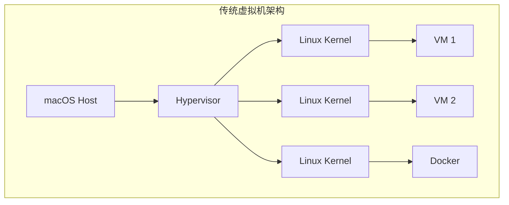
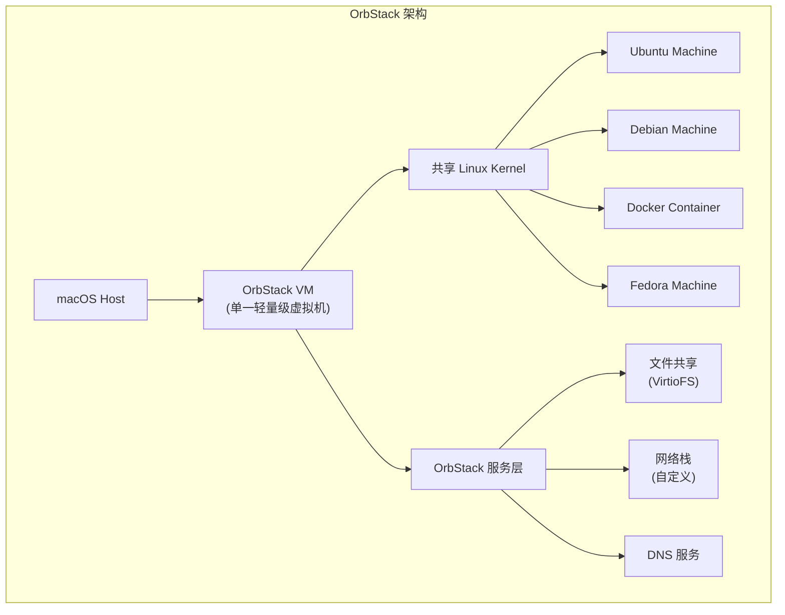
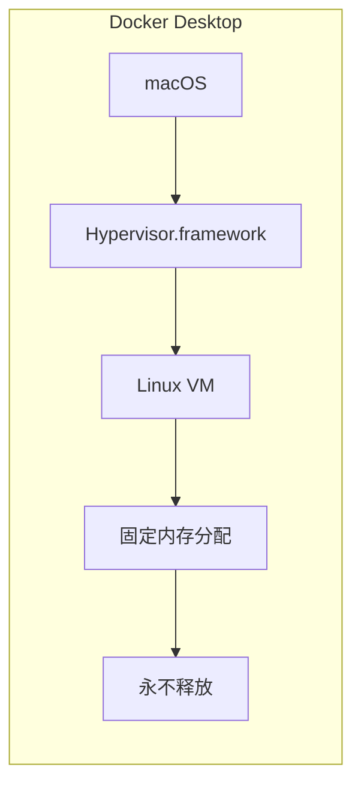
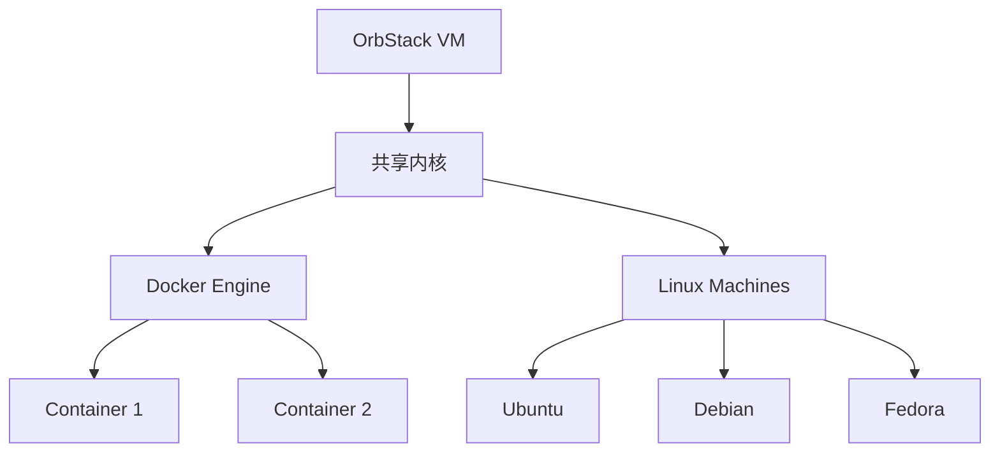
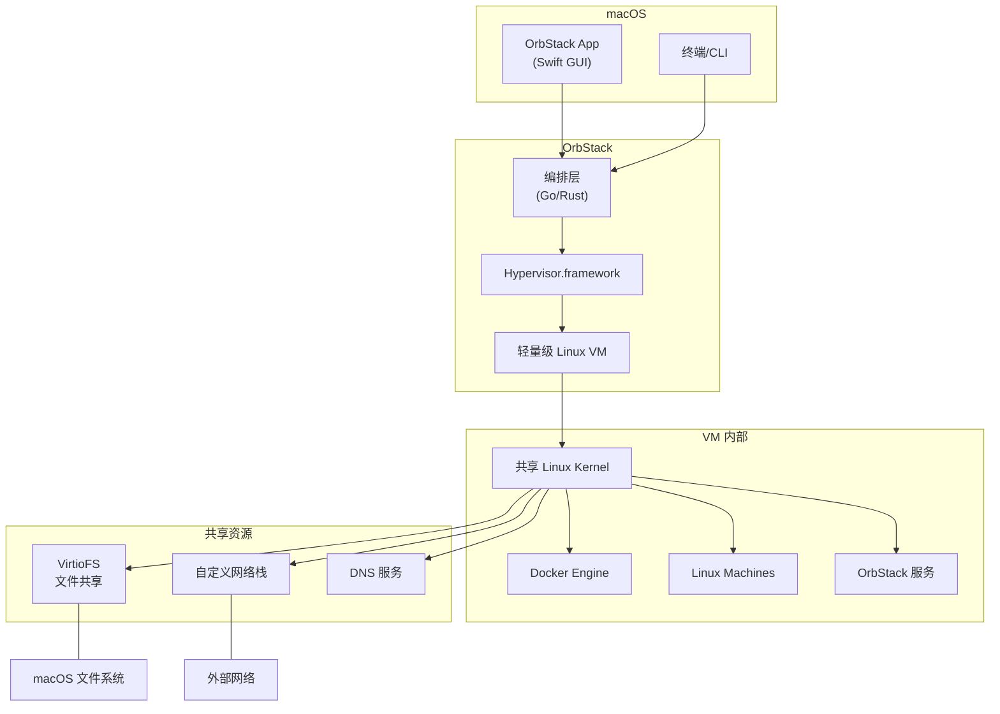

# OrbStack 工作原理深度解析

本文将帮助你理解 OrbStack 是如何工作的，以及它为什么比传统方案更轻量、更快速。

<Note>
本文面向希望深入了解技术原理的读者。如果你更倾向于通过实践学习，请参考：[使用 OrbStack 运行第一个 Ubuntu 虚拟机](./使用-OrbStack-运行第一个-Ubuntu-虚拟机.md)
</Note>

## OrbStack 是什么？

OrbStack 是一款运行在 macOS 上的容器和虚拟机运行时环境，它可以同时运行：

1. **Docker 容器** - 与 Docker Desktop 功能相同，但更轻量
2. **Linux 虚拟机** - 类似 WSL 2，运行完整的 Linux 发行版

## 核心架构：共享内核的轻量级虚拟机

### 与传统虚拟机的区别

要理解 OrbStack，首先需要了解传统虚拟机的工作方式：



传统虚拟机（如 UTM、VMware Fusion）中，每个虚拟机都运行自己的 Linux 内核。这导致：

- 每个虚拟机占用独立的内存空间
- 启动速度慢（需要加载完整内核）
- 资源消耗大

### OrbStack 的解决方案

OrbStack 采用**共享内核架构**：



**关键设计决策**：只运行**一个**轻量级虚拟机，所有 Linux 发行版和容器共享这个内核。

## 技术实现细节

### 1. 轻量级虚拟机的构建

OrbStack 的虚拟机经过深度优化：

| 优化项 | 说明 |
|--------|------|
| **最小化内存占用** | 虚拟机按需分配内存，空闲时几乎不占用资源 |
| **快速启动** | 启动时间约 2 秒（vs Docker Desktop 的 10-30 秒） |
| **电源效率** | 空闲时 CPU 占用几乎为零 |

这些优化包括：
- 低级 Linux 内核调优
- 针对 macOS 和 Apple Silicon 的专门优化
- 动态内存管理（需要时分配，不需要时释放）

### 2. 文件共享机制

OrbStack 使用 **VirtioFS** 作为文件共享的基础：

```
┌─────────────────────────────────────────┐
│           macOS 主机文件系统             │
└─────────────────────────────────────────┘
                    │
                    ▼
┌─────────────────────────────────────────┐
│           VirtioFS 动态缓存             │
│      (OrbStack 自定义优化层)            │
└─────────────────────────────────────────┘
                    │
        ┌───────────┼───────────┐
        ▼           ▼           ▼
   ┌─────────┐ ┌─────────┐ ┌─────────┐
   │Ubuntu   │ │Docker   │ │Debian   │
   │/mnt/mac │ │Volumes  │ │/mnt/mac │
   └─────────┘ └─────────┘ └─────────┘
```

VirtioFS 是一个高性能的共享文件系统协议，OrbStack 在其上增加了自定义动态缓存，进一步提升性能。

### 3. 网络架构

OrbStack 实现了自定义虚拟网络栈：

- **NAT 转发**：支持 IPv4 和 IPv6
- **自定义 DNS**：将 DNS 查询转发到 macOS，保持与 VPN 和 DNS 设置同步
- **事件驱动端口转发**：服务启动后立即可在 localhost 访问
- **统一网桥**：容器和虚拟机可以相互通信，也可以通过 IP 直接访问 macOS

### 4. Apple Silicon 优化：Rosetta x86 仿真

在 Apple Silicon Mac 上，OrbStack 使用 **Rosetta 2** 来运行 x86 程序：

| 仿真方式 | 速度 | 说明 |
|----------|------|------|
| Rosetta 2 | 快速 | OrbStack 使用，苹果自家技术，原生集成 |
| QEMU | 较慢 | 传统虚拟机常用，通用但效率低 |

这使得在 ARM Mac 上运行 Intel (x86) 虚拟机和程序时，几乎可以达到原生性能。

### 5. 安全设计

```
┌─────────────────────────────────────────┐
│         OrbStack 服务层                 │
│  ┌─────────────────────────────────┐    │
│  │     防火墙保护                   │    │
│  │  (阻止容器内代码访问内部服务)    │    │
│  └─────────────────────────────────┘    │
└─────────────────────────────────────────┘
                    │
        ┌───────────┼───────────┐
        ▼           ▼           ▼
   ┌─────────┐ ┌─────────┐ ┌─────────┐
   │ 可信区域 │ │ 可信区域 │ │ 可信区域 │
   │ (机器)   │ │ (机器)   │ │(容器)    │
   └─────────┘ └─────────┘ └─────────┘
```

- Linux 虚拟机被视为**可信**（因为 OrbStack 提供了与 macOS 的集成）
- 内部服务受防火墙保护，防止恶意代码干扰
- 在 Apple Silicon 上，增强的 KASLR 不需要 KPTI 缓解措施，提升系统调用性能

## 为什么比 Docker Desktop 快？

### Docker Desktop 的问题

Docker Desktop 在 macOS 上使用 Linux VM + Docker Engine 的架构，但它有几个效率问题：



| 问题 | 影响 |
|------|------|
| 固定 RAM 分配 | 启动时分配固定内存，永不释放回 macOS |
| 高空闲内存 | 不运行容器时也占用大量内存 |
| Electron UI | GUI 使用 Electron，资源消耗大 |

### OrbStack 的优势

| 特性 | OrbStack | Docker Desktop |
|------|----------|----------------|
| 内存分配 | 按需分配动态增长 | 固定分配 |
| 空闲 CPU | ≈0% | 较高 |
| 启动速度 | ~2秒 | 较慢 |
| 内存释放 | 可以 | 不能 |

## Linux 虚拟机 vs Docker 容器

很多人会问：什么时候用虚拟机？什么时候用容器？

### 使用容器的好处

- **快速启动**：几秒钟内启动
- **隔离性**：适合运行不信任的代码
- **镜像小**：通常几十到几百 MB
- **适合微服务**：适合运行独立的网络服务

### 使用虚拟机的好处

- **完整系统**：运行完整的 init 系统（systemd、OpenRC）
- **持久化**：配置持久保存
- **多发行版**：同时运行 Ubuntu、Debian、Fedora 等
- **系统级操作**：需要系统级权限的操作

### OrbStack 的独特之处

OrbStack 让两者可以**同时运行**且**低开销**：



所有容器和虚拟机共享同一个内核，但又相互隔离。

## 核心技术栈

OrbStack 的服务使用多种语言编写，针对不同场景选择最优语言：

| 语言 | 用途 |
|------|------|
| **Swift** | macOS 原生集成、用户界面 |
| **Go** | 网络服务、容器编排 |
| **Rust** | 性能关键组件、安全相关代码 |
| **C** | 内核级优化、低级系统交互 |

## 与 WSL 2 的对比

OrbStack 的架构与 Windows 的 WSL 2（Windows Subsystem for Linux 2）非常相似：

| 特性 | OrbStack | WSL 2 |
|------|----------|-------|
| 架构 | 共享内核虚拟机 | 共享内核虚拟机 |
| 启动速度 | 快 | 快 |
| 内存管理 | 动态 | 动态 |
| 多发行版 | 支持 | 部分支持 |
| Docker 集成 | 原生 | 需额外配置 |
| macOS/Windows | macOS 专用 | Windows 专用 |

## 架构图总结



## 总结

OrbStack 的核心创新在于：

1. **单一轻量级虚拟机**：所有 Linux 环境共享一个优化过的虚拟机
2. **共享内核架构**：避免传统虚拟机的重复内核开销
3. **深度系统优化**：专门针对 macOS 和 Apple Silicon 优化
4. **动态资源管理**：按需分配内存，空闲时几乎不占用资源
5. **原生集成**：无缝集成 macOS 的文件系统、网络、DNS 等

这使得 OrbStack 成为 macOS 上运行 Linux 开发环境的最佳选择之一。

## 参考资源

- [OrbStack 官方架构文档](https://docs.orbstack.dev/architecture)
- [OrbStack vs Docker Desktop 对比](https://docs.orbstack.dev/compare/docker-desktop)
- [Linux 虚拟机文档](https://docs.orbstack.dev/machines/)
- [VirtioFS 文档](https://docs.orbstack.dev/machines/file-sharing)