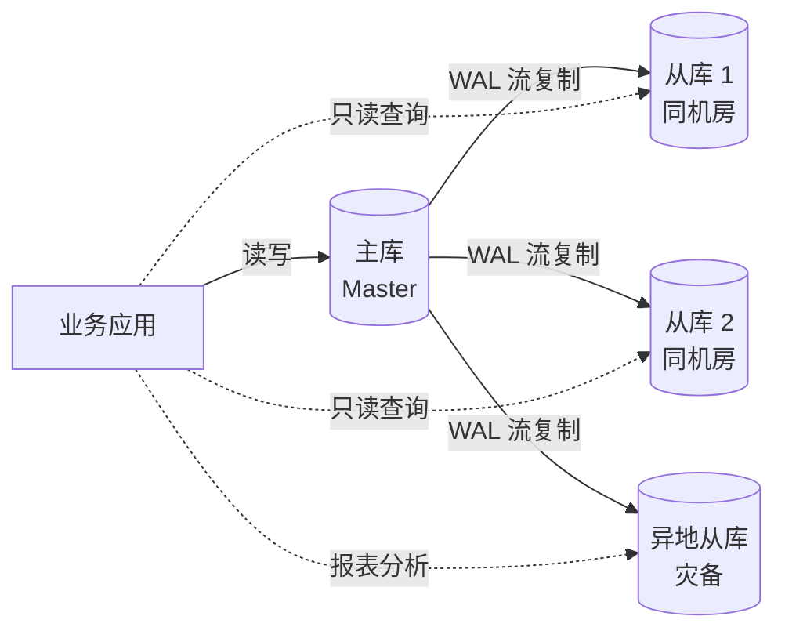
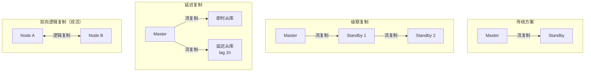
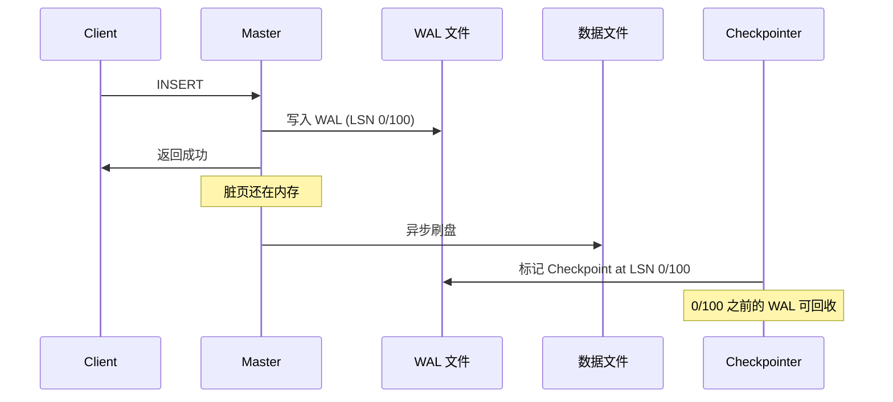
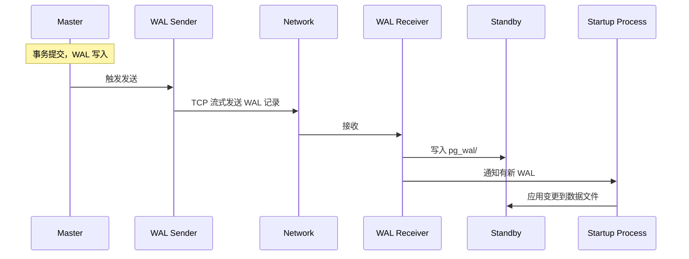
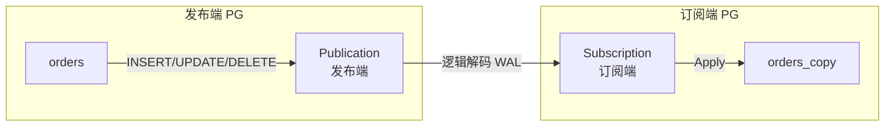
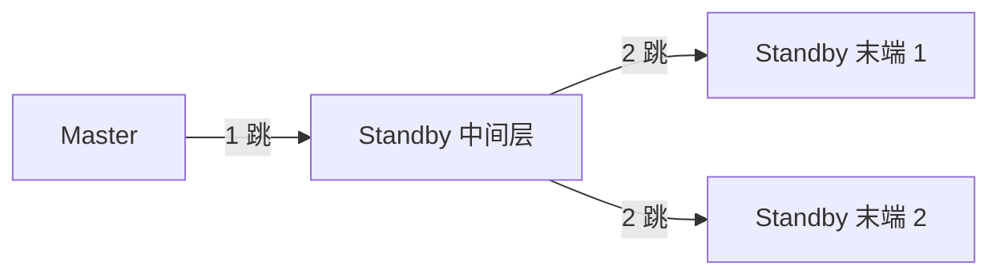
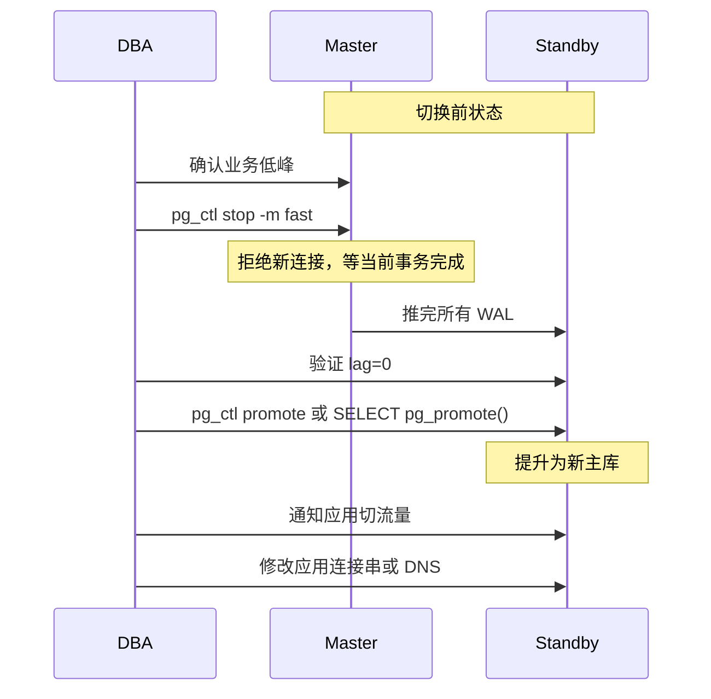
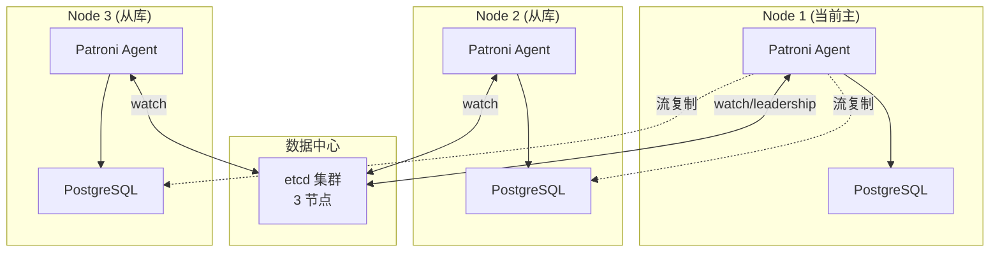
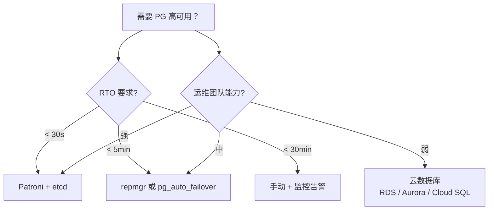
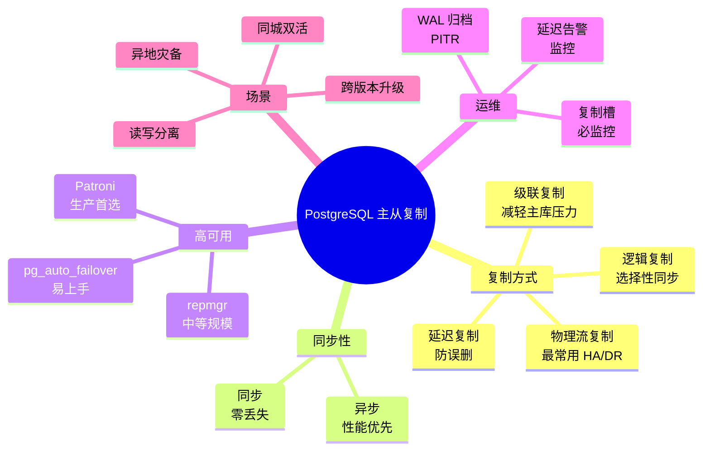

# PostgreSQL 主从复制从入门到精通

> 从原理到实战，系统讲解 PostgreSQL 主从复制的全部知识点。读完即可独立搭建、运维、调优一套生产级 PostgreSQL 高可用集群。

## 目录

1. [为什么需要主从复制](#一为什么需要主从复制)
2. [核心概念速览](#二核心概念速览)
3. [WAL：复制的基石](#三wal复制的基石)
4. [物理流复制（最常用方案）](#四物理流复制最常用方案)
5. [同步与异步复制模式](#五同步与异步复制模式)
6. [逻辑复制](#六逻辑复制)
7. [级联复制与延迟复制](#七级联复制与延迟复制)
8. [复制槽、归档与运维](#八复制槽归档与运维)
9. [故障切换与高可用架构](#九故障切换与高可用架构)
10. [监控、故障排查与调优](#十监控故障排查与调优)
11. [最佳实践与架构选型](#十一最佳实践与架构选型)

---

## 一、为什么需要主从复制

PostgreSQL 单机部署虽然简单，但生产中我们几乎不会这样用。主从复制是 PostgreSQL 高可用（HA）、读写扩展、灾难恢复（DR）的基础设施。

### 1.1 三个核心目标

| 目标            | 说明                 | 实现方式          |
| ------------- | ------------------ | ------------- |
| **高可用 (HA)**  | 主库挂了，从库接管，业务不停     | 流复制 + 自动故障切换  |
| **读扩展**       | 把读请求分摊到多台从库，减轻主库压力 | 流复制 + 应用层读写分离 |
| **灾难恢复 (DR)** | 机房级故障时，异地从库接管      | 流复制 + WAL 归档  |

### 1.2 典型应用场景



- **读写分离**：主库写入，从库承担报表、BI、备份等读请求
- **同城双活**：主库在 A 机房，热备从库在 B 机房（防机房级故障）
- **异地灾备**：跨城市部署从库，地震/断网也能恢复

### 1.3 主从 vs 主主

PostgreSQL 原生**不推荐主主复制**（multi-master），原因：

- 自增 ID 冲突、序列冲突
- 双向同步延迟导致数据冲突
- 实际生产中通过 **Patroni + 多副本 + 单写** 来模拟多活

> **业界共识**：PG 的主从是「一主多从」，多主需求用 CockroachDB、YugabyteDB 这类分布式数据库解决，不要硬上。

---

## 二、核心概念速览

在进入实操前，先把术语对齐。

### 2.1 关键术语

| 术语                      | 全称                       | 说明                              |
| ----------------------- | ------------------------ | ------------------------------- |
| **WAL**                 | Write-Ahead Log          | 预写日志，所有变更先写 WAL 再写数据文件          |
| **LSN**                 | Log Sequence Number      | WAL 中每个字节的位置（如 `0/16A8B40`）     |
| **流复制**                 | Streaming Replication    | 主库将 WAL 实时流式推送给从库               |
| **物理复制**                | Physical Replication     | 复制数据块的二进制变化，最常用                 |
| **逻辑复制**                | Logical Replication      | 复制 SQL 变更（INSERT/UPDATE/DELETE） |
| **同步复制**                | Synchronous Replication  | 主库提交事务前等待从库确认                   |
| **异步复制**                | Asynchronous Replication | 主库提交事务即返回，从库异步追平                |
| **复制槽**                 | Replication Slot         | 主库为每个从库保留 WAL 状态的机制             |
| **Promote**             | Promote                  | 把从库提升为新主库                       |
| **Failover**            | Failover                 | 主库故障后自动/手动切换到从库                 |
| **Switchover**          | Switchover               | 计划内的主从切换（如主库维护）                 |
| **WAL Sender/Receiver** | -                        | 主库发 WAL、从库收 WAL 的后台进程           |

### 2.2 复制拓扑一览



---

## 三、WAL：复制的基石

要理解 PostgreSQL 复制，必须先理解 **WAL（Write-Ahead Logging）**。

### 3.1 WAL 是什么

PostgreSQL 的写入流程：

1. 事务提交时，先把变更**追加写入 WAL 文件**（顺序写，速度快）
2. 后台进程（Background Writer）异步把脏页刷到数据文件
3. 即使宕机，重启后通过 WAL 恢复未刷盘的脏页

> **核心理念**：WAL 是「真理之源」，数据文件只是 WAL 的物化视图。

### 3.2 WAL 文件结构

WAL 文件存放在 `$PGDATA/pg_wal/`（PG 10 前叫 `pg_xlog`）目录下，每个文件默认 16MB。

```bash
pg_wal/
├── 000000010000000000000001   # 16MB
├── 000000010000000000000002
├── 000000010000000000000003
├── ...
└── archive_status/             # 归档状态标记
```

**文件名编码**：前 8 位十六进制 = 时间线 ID + LSN 高位，后 8 位 = LSN 序号。

### 3.3 LSN 详解

LSN 是一个 64 位地址，格式为 `时间线ID/偏移量`：

```text
0/16A8B40
↑ ↑
│ └── 偏移量（字节数）
└── 时间线 ID
```

**复制中的关键 LSN**：

| LSN 类型                     | 含义              |
| -------------------------- | --------------- |
| `pg_current_wal_lsn()`     | 主库最新写入位置        |
| `pg_last_wal_replay_lsn()` | 从库已重放位置         |
| `sent_lsn`                 | 主库已发送给从库        |
| `write_lsn`                | 从库已写入本地 WAL     |
| `flush_lsn`                | 从库已 fsync WAL   |
| `replay_lsn`               | 从库已 apply 到数据文件 |

**复制延迟** = `pg_current_wal_lsn() - pg_last_wal_replay_lsn()`

### 3.4 Checkpoint 机制

Checkpoint 把脏页刷盘，并标记 WAL 中某个点之前的变更已经持久化。



Checkpoint 之后，对应 LSN 之前的 WAL 文件才能被回收或删除。这就是为什么**复制槽至关重要**——没有它，主库可能把从库还没读取的 WAL 删了，导致复制中断。

---

## 四、物理流复制（最常用方案）

物理流复制是 PostgreSQL 最主流的复制方式，PG 9.0 引入，PG 17 仍是 HA 的基石。

### 4.1 原理



**关键点**：
- 复制单位是 WAL 记录（物理字节流），不是 SQL
- 从库接收 WAL 后**重放（replay）**到自己的数据文件
- 主从数据文件最终保持**逐字节一致**

### 4.2 实战：搭建一套最简主从

> 假设：主库 192.168.1.10，从库 192.168.1.11，PostgreSQL 16+。

#### Step 1：主库配置 `postgresql.conf`

```ini
# 开启 WAL 归档（可选，但生产推荐）
wal_level = replica                    # PG 9.6+ 默认值
max_wal_senders = 10                   # 允许最多 10 个从库连接
wal_keep_size = 1GB                    # 至少保留 1GB WAL（PG 13+，替代 wal_keep_segments）
# 或者用复制槽更安全（见第八章）

# 同步/异步模式（默认异步）
synchronous_standby_names = ''         # 空 = 异步；非空 = 同步复制
```

#### Step 2：主库配置 `pg_hba.conf`

允许从库用复制用户连接：

```text
# TYPE  DATABASE        USER            ADDRESS                 METHOD
host    replication     repl_user       192.168.1.11/32        scram-sha-256
```

#### Step 3：主库创建复制用户

```sql
CREATE USER repl_user WITH REPLICATION PASSWORD 'StrongPass123!';
```

#### Step 4：从库基础备份

在**从库**执行：

```bash
# 停止从库（如果是新装的）
pg_ctl stop -D /var/lib/postgresql/16/main

# 清理旧数据（如果是已有数据先备份）
mv /var/lib/postgresql/16/main /var/lib/postgresql/16/main.bak

# 从主库拉取基础备份
pg_basebackup -h 192.168.1.10 -U repl_user \
  -D /var/lib/postgresql/16/main \
  -Fp -Xs -P -R

# 参数说明：
# -F p: 平面格式（plain）目录，而非 tar
# -X s: 流式传输 WAL（streaming），无需额外归档
# -P: 显示进度
# -R: 自动写 standby.signal + postgresql.auto.conf
```

#### Step 5：启动从库

```bash
pg_ctl start -D /var/lib/postgresql/16/main
```

`pg_basebackup -R` 会自动创建：
- `standby.signal` 文件（标识这是从库）
- `postgresql.auto.conf` 中的连接配置：

```ini
primary_conninfo = 'host=192.168.1.10 port=5432 user=repl_user password=StrongPass123!'
```

#### Step 6：验证

**主库查看**：

```sql
SELECT pid, usename, application_name, client_addr, state, sync_state,
       sent_lsn, write_lsn, flush_lsn, replay_lsn
FROM pg_stat_replication;
```

输出类似：

```text
  pid  | usename   | application_name | client_addr   | state     | sync_state | sent_lsn    | flush_lsn   | replay_lsn
-------+-----------+------------------+---------------+-----------+------------+-------------+-------------+-------------
 12345 | repl_user | walreceiver      | 192.168.1.11  | streaming | async      | 0/16A8B40   | 0/16A8B40   | 0/16A8B40
```

**从库查看**：

```sql
SELECT pg_is_in_recovery();   -- 应返回 true
SELECT pg_last_wal_receive_lsn();
SELECT pg_last_wal_replay_lsn();
SELECT now() - pg_last_xact_replay_timestamp() AS replication_lag;
```

### 4.3 关键参数详解

#### 主库 `postgresql.conf`

| 参数 | 推荐值 | 说明 |
|------|--------|------|
| `wal_level` | `replica` | 物理复制必需（默认） |
| `max_wal_senders` | `10+` | 最多并发 WAL Sender 进程数 |
| `wal_keep_size` | `1GB+` | 旧 WAL 保留量（PG 13+） |
| `max_replication_slots` | `10+` | 复制槽数量上限 |
| `synchronous_standby_names` | 见下章 | 同步复制配置 |
| `wal_compression` | `on` | 压缩 WAL，节省带宽 |
| `archive_mode` | `on` | 是否归档（建议开启） |
| `archive_command` | 自定义 | 归档命令 |

#### 从库 `postgresql.conf`

| 参数 | 推荐值 | 说明 |
|------|--------|------|
| `hot_standby` | `on` | 默认开，允许从库提供只读 |
| `max_standby_streaming_delay` | `30s` | 主库冲突时从库查询最长等待 |
| `hot_standby_feedback` | `off` | 从库是否反馈给主库（详见 5.3） |
| `wal_receiver_create_temp_slot` | `false` | 临时复制槽开关 |
| `primary_conninfo` | 见上 | 连接主库信息 |
| `restore_command` | 自定义 | 从归档恢复 WAL（可选） |

---

## 五、同步与异步复制模式

### 5.1 三种模式对比

| 模式 | 数据安全性 | 性能影响 | 适用场景 |
|------|-----------|---------|---------|
| **异步（async）** | 可能丢数据 | 性能最好 | 大多数场景 |
| **同步（sync）** | 零数据丢失 | 每次提交多一跳 RTT | 金融、关键业务 |
| **remote_write** | 中等 | 中等 | 折中方案（少用） |

### 5.2 异步复制（默认）

```ini
synchronous_standby_names = ''
```

主库提交即返回，**性能最好**，但主库宕机时可能丢失尚未传到从库的数据。

> 生产环境绝大多数用异步，因为同步复制会显著拖慢事务提交（多一跳网络 RTT）。

### 5.3 同步复制（强一致）

```ini
# 任意 1 个同步从库
synchronous_standby_names = 'ANY 1 (standby1, standby2)'

# 至少 2 个同步从库（PG 10+）
synchronous_standby_names = 'ANY 2 (standby1, standby2, standby3)'

# 命名同步从库（PG 9.6+）
synchronous_standby_names = 'FIRST 2 (s1, s2, s3)'
```

**关键点**：
- 主库等待从库 `flush WAL` 后才返回客户端
- 同步从库宕机 → 主库会**阻塞所有写入**，直到至少一个同步从库恢复
- 这就是为什么生产里通常配 2 个同步从库 + 多个异步从库

### 5.4 热备反馈（hot_standby_feedback）

主库会清理「死亡元组」（DELETE/UPDATE 旧版本），如果从库长事务还在读旧版本，主库一清理，从库查询就会报错 `ERROR: canceling statement due to conflict`。

解决：

```ini
# 从库开启
hot_standby_feedback = on
```

从库会定期告诉主库「我的最老事务是这个」，主库**延迟清理**这些元组。代价：主库表膨胀会加剧。

---

## 六、逻辑复制

逻辑复制与物理复制是两种完全不同的范式。

### 6.1 原理对比

| 维度 | 物理复制 | 逻辑复制 |
|------|---------|---------|
| 复制单位 | WAL 字节流 | SQL/行变更 |
| 一致性 | 字节级一致 | 表级一致（可选择性） |
| 跨大版本 | ❌ 不支持（必须同大版本） | ✅ 支持（PG 9.4+） |
| 选择性 | ❌ 整库 | ✅ 单表 |
| 双向同步 | ❌ 困难 | ✅ 容易 |
| 主键要求 | ❌ 无 | ✅ 必须（UPDATE/DELETE 需要） |
| 性能 | 高 | 略低（需解码 WAL） |

### 6.2 架构



### 6.3 实战：搭建一张表的逻辑复制

**发布端**：

```sql
-- 必须设置
ALTER SYSTEM SET wal_level = logical;
-- 重启生效

-- 创建发布
CREATE PUBLICATION pub_orders FOR TABLE orders;
-- 或发布所有表：
-- CREATE PUBLICATION pub_all FOR ALL TABLES;
```

**订阅端**：

```sql
-- 创建订阅
CREATE SUBSCRIPTION sub_orders
CONNECTION 'host=192.168.1.10 port=5432 dbname=mydb user=repl_user password=xxx'
PUBLICATION pub_orders;
```

> ⚠️ 订阅创建时会自动从发布端同步初始数据（类似 `pg_basebackup`），大表可能耗时较长。

### 6.4 逻辑复制的杀手场景

1. **跨大版本升级**：PG 14 → PG 17，用逻辑复制做不停机迁移
2. **跨库数据分发**：把订单库的数据同步到 ClickHouse 做分析
3. **选择性同步**：只同步部分表到下游
4. **多主合并**：多个数据中心 → 中央汇聚（注意冲突处理）

### 6.5 PG 17 新特性：`pg_createsubscriber`

PG 17 提供了一个超实用的工具：把**已有的物理流复制从库**转换成**逻辑复制订阅者**。

```bash
# 在从库上执行
pg_createsubscriber -D /var/lib/postgresql/17/main \
  --publisher-server="host=192.168.1.10 port=5432 dbname=mydb user=repl_user" \
  --subscription=sub_orders \
  --replication-slot=slot_sub_orders
```

**价值**：在不停机的情况下，把传统物理从库升级为可灵活选表的逻辑订阅端，做平滑迁移。

---

## 七、级联复制与延迟复制

### 7.1 级联复制（Cascading Replication）

主库只发 WAL 给少数中间从库，中间从库再下发给更多末端从库。



**优势**：
- 减少主库 WAL 发送连接数（`max_wal_senders` 压力大时有用）
- 异地机房：A 机房发一份给 B 机房中间从库，B 机房内再分发

**配置**：从库的 `primary_conninfo` 指向中间层即可，无需额外配置。

### 7.2 延迟复制（Delayed Standby）

刻意让从库延迟 N 小时应用 WAL，用于防**人为误操作**。

```ini
# 从库配置
recovery_min_apply_delay = '1h'
```

**场景**：
- 早上 9 点 DBA 误删了重要数据
- 业务 9:05 发现问题
- 从库延迟 1 小时，回退到 8:55 的状态，数据还在

> ⚠️ 延迟从库不能用于读扩展（数据滞后），通常仅作「灾备防误删」用途。

---

## 八、复制槽、归档与运维

### 8.1 为什么需要复制槽

**问题**：主库回收 WAL 是基于「Checkpoint + 已发送」判断的。如果没有显式的「告诉主库我还在读」，主库可能把从库还没消费的 WAL 删了，从库下次连接会报错。

**复制槽**就是主库为从库做的 WAL 保留清单。

```sql
-- 创建复制槽
SELECT * FROM pg_create_physical_replication_slot('slot_standby1');

-- 查看所有复制槽
SELECT slot_name, plugin, slot_type, active, restart_lsn, confirmed_flush_lsn
FROM pg_replication_slots;
```

从库 `postgresql.auto.conf` 使用复制槽：

```ini
primary_conninfo = 'host=... user=...'
primary_slot_name = 'slot_standby1'
```

**警告**：如果复制槽对应的从库**永久下线**，主库会**无限堆积 WAL**，最终撑爆磁盘！

```sql
-- 删除失效复制槽
SELECT pg_drop_replication_slot('slot_dead_standby');
```

> **生产铁律**：监控 `pg_replication_slots` 中 `active=false` 的槽，定期清理。

### 8.2 WAL 归档（archive_mode）

把 WAL 永久备份到异地（OSS/S3/NFS），用于：

- PITR（Point-In-Time Recovery，时间点恢复）
- 异地灾备

```ini
# postgresql.conf
archive_mode = on
archive_command = 'cp %p /backup/wal_archive/%f'   # %p=完整路径, %f=文件名
# 或推到 S3：
# archive_command = 'aws s3 cp %p s3://my-bucket/wal/%f'
```

### 8.3 常用运维命令速查

```sql
-- 主库视角
SELECT * FROM pg_stat_replication;            -- 查看所有连接的从库
SELECT * FROM pg_replication_slots;           -- 查看所有复制槽
SELECT pg_current_wal_lsn();                  -- 主库当前 LSN
SELECT pg_size_pretty(pg_wal_lsn_diff(pg_current_wal_lsn(), '0/0'));  -- 已产生 WAL 量

-- 从库视角
SELECT pg_is_in_recovery();                   -- 是否为从库
SELECT pg_last_wal_receive_lsn();              -- 已接收 LSN
SELECT pg_last_wal_replay_lsn();              -- 已重放 LSN
SELECT pg_last_xact_replay_timestamp();       -- 最后重放事务时间
SELECT now() - pg_last_xact_replay_timestamp() AS lag;  -- 复制延迟

-- 切换主从（从库执行）
SELECT pg_promote();                          -- 提升自己为新主库
```

---

## 九、故障切换与高可用架构

### 9.1 手动切换流程（Switchover）

用于计划内维护，零数据丢失。



**关键命令**：

```bash
# 在从库执行
pg_ctl promote -D /var/lib/postgresql/16/main
# 或
psql -c "SELECT pg_promote();"
```

### 9.2 自动故障切换工具对比

| 工具 | 架构 | 复杂度 | 适用场景 |
|------|------|--------|---------|
| **Patroni** | Python + etcd/Consul | 高 | 生产级 HA，Kubernetes 友好 |
| **repmgr** | C + 元数据库 | 中 | 中小规模，简单可靠 |
| **pg_auto_failover** | C + monitor 节点 | 低 | 单机房、易上手 |
| **PgBouncer + Keepalived** | VIP 漂移 | 中 | 仅 IP 漂移，无脑裂防护 |
| **手动 + 脚本** | - | 低 | 小规模、非关键业务 |

### 9.3 Patroni 架构（推荐生产方案）



**Patroni 核心特性**：
- **脑裂防护**：使用 etcd/Consul 做分布式选举，主库 lease 过期才允许新主
- **自动恢复**：主库挂了自动 promote 从库，重启后自动以从库加入
- **REST API**：调用 `/switchover`/`/failover` 触发切换
- **Kubernetes 集成**：与 Operator 配合实现云原生 HA

**Patroni 切换的两种模式**：

| 模式 | 触发 | 是否等原主 | 适用场景 |
|------|------|-----------|---------|
| **switchover** | 手动 | 是（优雅停止） | 计划内维护 |
| **failover** | 自动/手动 | 否（立即） | 主库故障 |

### 9.4 如何选择



---

## 十、监控、故障排查与调优

### 10.1 必监控的核心指标

```sql
-- 1. 复制延迟（最关键）
SELECT
    client_addr,
    state,
    sync_state,
    sent_lsn,
    replay_lsn,
    pg_size_pretty(
        pg_wal_lsn_diff(sent_lsn, replay_lsn)
    ) AS apply_lag_bytes,
    EXTRACT(EPOCH FROM now() - pg_last_xact_replay_timestamp()) AS apply_lag_seconds
FROM pg_stat_replication;
```

**告警阈值建议**：

| 指标 | 警告 | 严重 |
|------|------|------|
| `apply_lag_seconds` | > 30s | > 5min |
| `apply_lag_bytes` | > 100MB | > 1GB |
| `pg_wal` 目录大小 | > 80% 磁盘 | > 95% |
| `active=false` 复制槽 | 存在 | 持续 1h+ |

### 10.2 常见故障排查

#### 故障 1：从库复制中断

```sql
-- 查看错误日志
SELECT * FROM pg_stat_wal_receiver;  -- PG 14+

-- 常见错误：
-- ERROR: requested WAL segment ... has already been removed
-- 原因：主库 WAL 被回收，从库缺数据
-- 解决：用 pg_basebackup 重建从库
```

#### 故障 2：主库磁盘爆满

```sql
-- 检查 WAL 目录
SELECT pg_size_pretty(pg_wal_directory_size());

-- 检查长事务、复制槽堆积
SELECT slot_name, active, restart_lsn,
       pg_size_pretty(pg_wal_lsn_diff(pg_current_wal_lsn(), restart_lsn)) AS retained_wal
FROM pg_replication_slots
WHERE NOT active;

-- 紧急：清理失效复制槽
SELECT pg_drop_replication_slot('slot_xxx');
```

#### 故障 3：主从延迟持续增大

可能原因：

1. **主库写入太猛**：检查 `pg_stat_activity` 长事务
2. **从库配置差**：CPU/磁盘 IO 不够
3. **从库查询太多**：常读拖慢 replay。开启 `hot_standby_feedback = on`
4. **大 DDL**：主库加索引、VACUUM FULL 等阻塞型操作
5. **网络瓶颈**：跨机房带宽打满

#### 故障 4：从库查询被取消

```text
ERROR: canceling statement due to conflict with recovery
```

主库清理了从库需要的元组。解决：

```ini
# 从库开启（视场景）
hot_standby_feedback = on

# 或主库调大冲突超时
max_standby_streaming_delay = 60s
```

### 10.3 性能调优清单

**主库**：

```ini
wal_compression = on                # 压缩 WAL，节省带宽
max_wal_size = '4GB'                # checkpoint 触发阈值
min_wal_size = '1GB'
checkpoint_timeout = '15min'        # 拉长 checkpoint 间隔，减少 IO
```

**从库**：

```ini
wal_receiver_timeout = '60s'
wal_receiver_status_interval = '10s'
max_standby_streaming_delay = '30s' # 长查询保护
effective_cache_size = '12GB'       # 适配大内存
shared_buffers = '4GB'
```

---

## 十一、最佳实践与架构选型

### 11.1 生产部署清单

✅ **必做项**：

- [ ] 用 `pg_basebackup -R` 初始化从库，配置 `primary_slot_name`
- [ ] 主库 `max_wal_senders >=` 从库数 + 备份
- [ ] 监控 `pg_replication_slots`，失效槽立即清理
- [ ] 监控 `pg_stat_replication` 的 `lag`，> 阈值告警
- [ ] 从库开启 `hot_standby_feedback`（视场景）
- [ ] 同步/异步策略明确：默认异步，核心业务同步
- [ ] 跨机房用级联复制，避免主库带宽压力
- [ ] 至少 2 个从库（同城 + 异地）
- [ ] 启用 `archive_mode` 做 PITR

✅ **推荐做**：

- [ ] 用 Patroni 做自动故障切换
- [ ] etcd/Consul 集群至少 3 节点，跨可用区
- [ ] VIP/DNS 切换脚本演练
- [ ] 定期演练 failover/switchover
- [ ] 备份策略：基础备份 + WAL 归档，定期验证可恢复

### 11.2 架构选型矩阵

| 业务等级 | 推荐架构 | RTO | RPO |
|---------|---------|-----|-----|
| **关键业务** | 2 同步 + 1 异步从库 + Patroni | < 30s | 0 |
| **重要业务** | 1 同步 + 2 异步 + repmgr | < 1min | < 1s |
| **普通业务** | 异步从库 + pg_auto_failover | < 5min | < 10s |
| **可丢数据** | 异步从库 + 监控告警 | 手动 | < 1min |

### 11.3 常见误区

❌ **误区 1：同步复制一定比异步好**
同步会显著降低写入吞吐（TPS 下降 30%+），不适合高写入场景。

❌ **误区 2：复制槽越多越安全**
失效的复制槽会撑爆主库磁盘，**比没有更危险**。

❌ **误区 3：从库越多读扩展越强**
每个从库也是完整 PG 实例，IO/CPU/内存全消耗，应用层路由也要改。

❌ **误区 4：物理复制可以跨大版本**
**不可以**！跨大版本必须用逻辑复制或 pg_upgrade。

❌ **误区 5：failover 工具能 100% 防脑裂**
错。即使 Patroni，etcd 集群本身故障也可能脑裂。**网络分区是分布式系统的天敌**。

### 11.4 一图总结



---

## 附录：速查命令

### 主从搭建

```bash
# 主库：创建用户
psql -c "CREATE USER repl_user WITH REPLICATION PASSWORD 'xxx';"

# 从库：拉取基础备份
pg_basebackup -h <master_ip> -U repl_user -D <data_dir> -Fp -Xs -P -R

# 从库：启动
pg_ctl start -D <data_dir>
```

### 状态检查

```sql
-- 主库：查看从库
SELECT * FROM pg_stat_replication;

-- 从库：检查状态
SELECT pg_is_in_recovery(), pg_last_wal_replay_lsn();
```

### 切换

```sql
-- 从库提升为主库
SELECT pg_promote();

-- 或者
pg_ctl promote -D <data_dir>
```

### 维护

```sql
-- 创建/删除复制槽
SELECT pg_create_physical_replication_slot('slot_name');
SELECT pg_drop_replication_slot('slot_name');

-- 暂停/恢复复制
SELECT pg_wal_replay_pause();    -- 从库
SELECT pg_wal_replay_resume();   -- 从库
```

---

## 参考资料

- [PostgreSQL 官方文档 - 高可用与复制](https://www.postgresql.org/docs/current/high-availability.html)
- [PostgreSQL 17 Release Notes](https://www.postgresql.org/docs/release/17.0/)
- [Patroni 官方文档](https://patroni.readthedocs.io/)
- [pglogical 文档](https://github.com/2ndQuadrant/pglogical)
- [Crunchy Data - PostgreSQL Replication Guide](https://www.crunchydata.com/blog/an-introduction-to-postgresql-physical-and-logical-replication)
- [EDB - PostgreSQL HA Comparison](https://www.enterprisedb.com/blog/dos-donts-postgres-high-availability-pt-3-tools-rules)