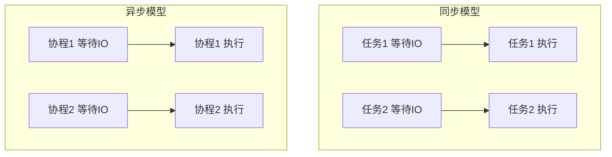
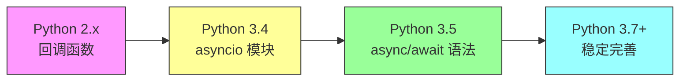
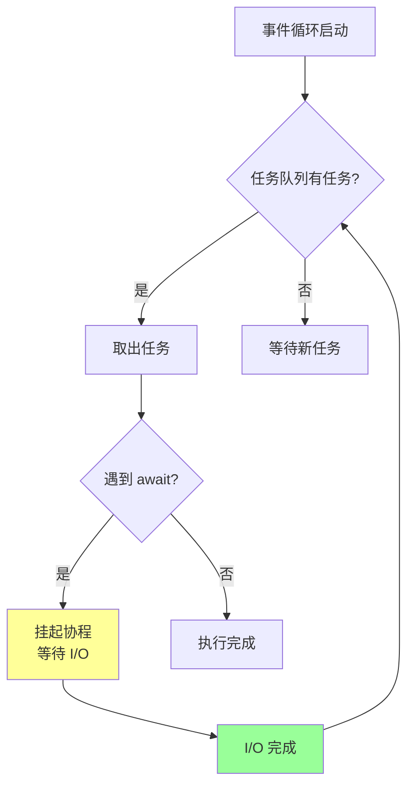
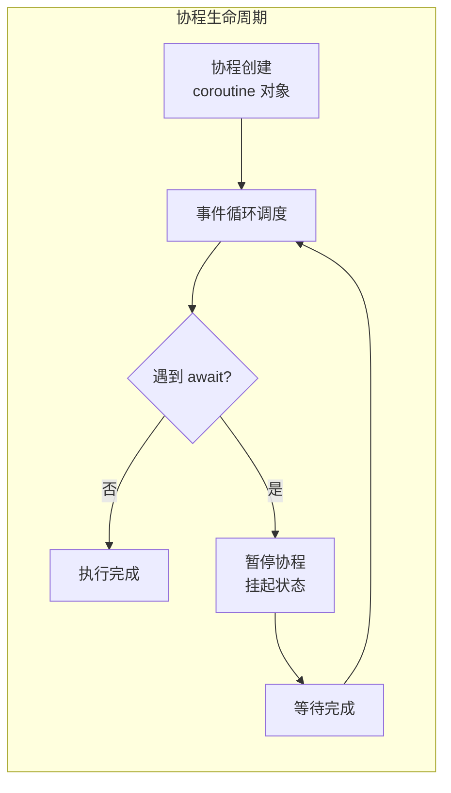
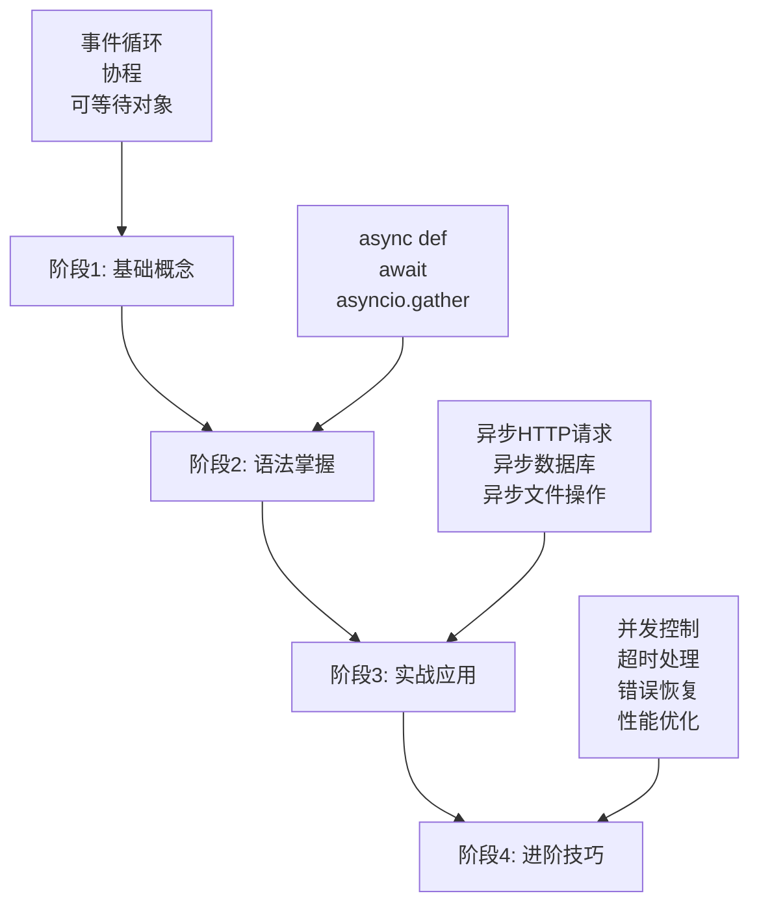

# Python Async Await 完全指南

> [!abstract] 概述
> 本文档全面介绍 Python 异步编程的核心语法 async/await，从技术诞生的背景到实现原理，从基础概念到最佳实践，帮助你建立完整的异步编程知识体系。

---

## 目录

1. [为什么需要异步编程？](#1-为什么需要异步编程)
2. [技术诞生的背景与演进](#2-技术诞生的背景与演进)
3. [核心概念](#3-核心概念)
4. [async/await 语法详解](#4-asyncawait-语法详解)
5. [实现原理](#5-实现原理)
6. [最佳实践](#6-最佳实践)
7. [学习路径与实战](#7-学习路径与实战)
8. [常见问题与解决方案](#8-常见问题与解决方案)

---

## 1. 为什么需要异步编程？

### 1.1 传统同步模型的局限性

在传统的同步编程模型中，程序的执行是**阻塞式**的：

```python
# 同步代码示例
import requests

def fetch_data():
    print("开始请求...")
    response = requests.get("https://api.example.com/data")  # 阻塞！
    print("请求完成")
    return response.json()
```

**问题**：
- 一个任务阻塞，整个线程就停住
- I/O 密集型任务（如网络请求、文件读写）浪费大量时间等待响应
- 线程创建和切换开销大

### 1.2 Python 的特殊挑战：GIL

Python 有**全局解释器锁（GIL）**，这意味着：
- 多线程无法真正并行执行 Python 字节码
- CPU 密集型任务无法通过多线程加速



### 1.3 异步编程的优势

| 特性    | 同步多线程      | 异步单线程    |
| ----- | ---------- | -------- |
| 资源开销  | 线程创建/切换开销大 | 协程开销极小   |
| 并发能力  | 受 GIL 限制   | 真正并发 I/O |
| 代码复杂度 | 需要锁机制      | 无需锁（单线程） |
| 适用场景  | CPU 密集型    | I/O 密集型  |

---

## 2. 技术诞生的背景与演进

### 2.1 异步编程在 Python 中的演进历程



### 2.2 各阶段详情

#### 阶段一：回调函数时代（Python 2.x）

最早的异步通过回调函数实现：

```python
# 回调函数示例（旧式）
def fetch_data(callback):
    # 模拟异步操作
    result = "data"
    callback(result)

def handle_result(data):
    print(f"收到数据: {data}")

fetch_data(handle_result)
```

**缺点**：
- 回调地狱（Callback Hell）
- 代码可读性差
- 错误处理复杂

#### 阶段二：生成器模拟协程（Python 2.5+）

```python
# 使用生成器模拟协程
def simple_coroutine():
    yield "第一步完成"
    yield "第二步完成"
    yield "第三步完成"

coro = simple_coroutine()
print(next(coro))  # 输出: 第一步完成
print(next(coro))  # 输出: 第二步完成
print(next(coro))  # 输出: 第三步完成
```

#### 阶段三：asyncio 模块诞生（Python 3.4）

2014 年，Python 3.4 引入了 `asyncio` 模块：

```python
import asyncio

@asyncio.coroutine
def fetch_data():
    yield from asyncio.sleep(2)  # 模拟 I/O 等待
    return {"data": 123}

# 运行
loop = asyncio.get_event_loop()
result = loop.run_until_complete(fetch_data())
```

#### 阶段四：async/await 语法（Python 3.5+）

2015 年，Python 3.5 正式引入 `async` 和 `await` 关键字：

```python
import asyncio

async def fetch_data():
    await asyncio.sleep(2)  # 模拟 I/O 等待
    return {"data": 123}

# Python 3.7+ 推荐写法
asyncio.run(fetch_data())
```

> [!tip] 版本建议
> - **Python 3.7+**：使用 `asyncio.run()` 启动事件循环
> - **Python 3.11+**：支持任务组 `TaskGroup`，更现代的并发管理

---

## 3. 核心概念

### 3.1 协程（Coroutine）

**协程**是一种"可暂停"的函数，可以在执行过程中暂停和恢复。

```python
# 定义协程函数
async def hello():
    print("Hello!")
    await asyncio.sleep(1)
    print("World!")

# 调用协程函数返回协程对象，不会立即执行
coro = hello()
print(coro)  # <coroutine object hello at 0x...>
```

### 3.2 事件循环（Event Loop）

事件循环是异步编程的**心脏**，负责：
- 调度协程的执行顺序
- 管理任务队列
- 处理 I/O 事件
- 切换协程执行



### 3.3 可等待对象（Awaitable）

以下对象可以被 `await`：

| 类型 | 说明 | 示例 |
|------|------|------|
| **协程** | async 函数 | `async def foo()` |
| **Task** | 任务封装 | `asyncio.create_task()` |
| **Future** | 延迟计算 | `asyncio.Future()` |

```python
import asyncio

async def demo():
    # 1. 协程对象
    coro = asyncio.sleep(1)

    # 2. Task（对协程的封装）
    task = asyncio.create_task(asyncio.sleep(1))

    # 3. Future
    future = asyncio.Future()

    # 都可以被 await
    await coro
    await task
    await future
```

### 3.4 任务（Task）

Task 是对协程的进一步封装，用于**并发执行**：

```python
import asyncio

async def fetch(url):
    await asyncio.sleep(1)  # 模拟网络请求
    return f"Data from {url}"

async def main():
    # 创建任务
    task1 = asyncio.create_task(fetch("https://a.com"))
    task2 = asyncio.create_task(fetch("https://b.com"))

    # 并发等待两个任务
    result1 = await task1
    result2 = await task2

    print(result1, result2)  # 同时完成，总耗时约 1 秒

asyncio.run(main())
```

---

## 4. async/await 语法详解

### 4.1 async def：定义协程函数

```python
# 基本语法
async def function_name(params):
    # async 函数体
    pass

# 示例
async def fetch_user(user_id):
    await asyncio.sleep(0.1)  # 模拟查询
    return {"id": user_id, "name": "Alice"}
```

### 4.2 await：暂停协程执行

`await` 的本质：
1. **暂停**当前协程
2. **等待**另一个可等待对象完成
3. 将**控制权**交回事件循环

```python
async def main():
    print("1. 开始")
    await asyncio.sleep(1)  # 暂停 1 秒，期间执行其他协程
    print("2. 结束")
```

> [!important] 关键点
> `await asyncio.sleep(1)` **不是**"睡眠 1 秒"，而是告诉事件循环："我这段时间没事做，你先去执行别的任务吧。"

### 4.3 启动事件循环

```python
import asyncio

async def main():
    print("Hello async world!")

# Python 3.7+ 推荐方式
asyncio.run(main())

# 旧写法（了解即可）
# loop = asyncio.get_event_loop()
# loop.run_until_complete(main())
```

---

## 5. 实现原理

### 5.1 协程的工作机制



### 5.2 事件循环的调度

```python
import asyncio

async def task_a():
    print("A 开始")
    await asyncio.sleep(2)
    print("A 完成")

async def task_b():
    print("B 开始")
    await asyncio.sleep(1)
    print("B 完成")

async def main():
    # 事件循环调度两个任务交替执行
    await asyncio.gather(task_a(), task_b())
    # 输出:
    # A 开始
    # B 开始
    # (1秒后) B 完成
    # (再1秒后) A 完成
    # 总耗时: 2秒（并发），而非 3秒（顺序）

asyncio.run(main())
```

### 5.3 底层实现概述

Python async/await 的底层依赖于：

1. **生成器（Generator）**：async 函数底层基于生成器实现
2. **yield from**：早期版本使用 `yield from` 调度协程
3. **PyFrameObject**：协程挂起时，Python 会保存整个栈帧

```python
# 协程对象的内部结构（简化）
# 当 await asyncio.sleep(1) 时：
# 1. 协程对象进入 suspend 状态
# 2. 当前栈帧被保存
# 3. 事件循环调度其他协程
# 4. 定时器到期后，协程被标记为 ready
# 5. 事件循环恢复协程执行
```

---

## 6. 最佳实践

### 6.1 基础最佳实践

#### ✅ 推荐：使用 asyncio.run() 启动

```python
# 推荐
async def main():
    ...

asyncio.run(main())
```

#### ✅ 推荐：使用 asyncio.gather() 并发执行

```python
async def fetch_all():
    # 并发执行多个任务
    results = await asyncio.gather(
        fetch_url("https://a.com"),
        fetch_url("https://b.com"),
        fetch_url("https://c.com"),
    )
    return results
```

#### ✅ 推荐：使用 asyncio.create_task() 后台执行

```python
async def main():
    # 创建后台任务
    task = asyncio.create_task(background_job())

    # 继续执行其他任务
    await do_something()

    # 等待后台任务完成
    await task
```

### 6.2 错误处理

```python
async def safe_fetch():
    try:
        async with asyncio.timeout(5):  # 设置超时
            result = await risky_operation()
            return result
    except asyncio.CancelledError:
        # 任务被取消
        print("任务被取消")
        raise
    except asyncio.TimeoutError:
        # 超时
        print("操作超时")
        return None
    except Exception as e:
        # 其他错误
        print(f"错误: {e}")
        raise
```

### 6.3 异步上下文管理器

```python
class AsyncDatabase:
    async def __aenter__(self):
        self.conn = await connect_to_db()
        return self

    async def __aexit__(self, exc_type, exc_val, exc_tb):
        await self.conn.close()

# 使用
async def main():
    async with AsyncDatabase() as db:
        await db.query("SELECT * FROM users")
```

### 6.4 异步迭代器

```python
class AsyncRange:
    def __init__(self, n):
        self.n = n
        self.current = 0

    def __aiter__(self):
        return self

    async def __anext__(self):
        if self.current >= self.n:
            raise StopAsyncIteration
        value = self.current
        self.current += 1
        await asyncio.sleep(0.1)  # 模拟延迟
        return value

async def main():
    async for i in AsyncRange(5):
        print(i)

asyncio.run(main())
```

### 6.5 并发控制

```python
import asyncio

# 限制并发数量
async def worker(semaphore, task_id):
    async with semaphore:  # 最多 3 个并发
        print(f"Worker {task_id} 开始")
        await asyncio.sleep(1)
        print(f"Worker {task_id} 完成")

async def main():
    semaphore = asyncio.Semaphore(3)  # 限制为 3 个并发

    tasks = [worker(semaphore, i) for i in range(10)]
    await asyncio.gather(*tasks)

asyncio.run(main())
```

### 6.6 异步 vs 同步代码混用

```python
import asyncio
from concurrent.futures import ThreadPoolExecutor

# 在异步代码中调用同步阻塞代码
def sync_io_operation():
    # 同步的 I/O 操作
    time.sleep(1)  # 阻塞！
    return "done"

async def main():
    # 使用 run_in_executor 在线程池中运行同步代码
    loop = asyncio.get_event_loop()
    result = await loop.run_in_executor(None, sync_io_operation)
    print(result)

asyncio.run(main())
```

---

## 7. 学习路径与实战

### 7.1 学习路线图



### 7.2 阶段一：基础练习

#### 练习 1.1：第一个异步程序

```python
import asyncio

async def hello():
    print("Hello!")
    await asyncio.sleep(1)
    print("World!")

# 运行
asyncio.run(hello())
```

#### 练习 1.2：理解协程不立即执行

```python
import asyncio

async def lazy():
    print("函数被调用")
    await asyncio.sleep(1)
    print("完成")

coro = lazy()  # 调用函数，但不执行函数体
print("协程已创建")
# 输出: 协程已创建（函数体还没执行！）

asyncio.run(coro)  # 运行后才会输出"函数被调用"
```

### 7.3 阶段二：并发编程

#### 练习 2.1：顺序执行 vs 并发执行

```python
import asyncio
import time

async def fake_request(n):
    await asyncio.sleep(1)
    return n

# 顺序执行
async def sequential():
    start = time.time()
    results = []
    for i in range(3):
        results.append(await fake_request(i))
    print(f"顺序: {time.time() - start:.2f}秒")
    return results

# 并发执行
async def concurrent():
    start = time.time()
    results = await asyncio.gather(*[fake_request(i) for i in range(3)])
    print(f"并发: {time.time() - start:.2f}秒")
    return results

async def main():
    await sequential()   # 输出: 顺序: 3.00秒
    await concurrent()   # 输出: 并发: 1.00秒

asyncio.run(main())
```

#### 练习 2.2：并发爬虫示例

```python
import asyncio
import aiohttp

async def fetch_url(session, url):
    async with session.get(url) as response:
        return await response.text()

async def crawl(urls):
    async with aiohttp.ClientSession() as session:
        tasks = [fetch_url(session, url) for url in urls]
        results = await asyncio.gather(*tasks, return_exceptions=True)

        for url, result in zip(urls, results):
            if isinstance(result, Exception):
                print(f"{url}: 失败 - {result}")
            else:
                print(f"{url}: 成功 - {len(result)} 字节")

urls = [
    "https://httpbin.org/delay/1",
    "https://httpbin.org/delay/2",
    "https://httpbin.org/delay/1",
]

asyncio.run(crawl(urls))  # 总耗时约 2 秒（而非 4 秒）
```

### 7.4 阶段三：实际应用场景

#### 场景 1：异步 Web 服务（FastAPI）

```python
from fastapi import FastAPI
import asyncio

app = FastAPI()

@app.get("/api/users/{user_id}")
async def get_user(user_id: int):
    # 异步查询数据库
    user = await fetch_user_from_db(user_id)
    return user

@app.get("/api/users/{user_id}/posts")
async def get_user_posts(user_id: int):
    # 并发查询多个数据源
    user, posts = await asyncio.gather(
        fetch_user_from_db(user_id),
        fetch_posts_from_db(user_id)
    )
    return {"user": user, "posts": posts}
```

#### 场景 2：异步定时任务

```python
import asyncio

async def periodic_task():
    count = 0
    while True:
        count += 1
        print(f"任务执行 {count}")
        await asyncio.sleep(5)  # 每 5 秒执行一次

async def main():
    task = asyncio.create_task(periodic_task())

    await asyncio.sleep(16)  # 运行 16 秒

    task.cancel()  # 取消任务
    try:
        await task
    except asyncio.CancelledError:
        print("任务已取消")

asyncio.run(main())
```

### 7.5 阶段四：进阶技巧

#### 超时控制

```python
import asyncio

async def slow_operation():
    await asyncio.sleep(10)
    return "完成"

async def main():
    try:
        # 方式 1：使用 asyncio.timeout (Python 3.11+)
        async with asyncio.timeout(3):
            result = await slow_operation()
    except asyncio.TimeoutError:
        print("操作超时")

    # 方式 2：使用 asyncio.wait_for
    try:
        result = await asyncio.wait_for(slow_operation(), timeout=3)
    except asyncio.TimeoutError:
        print("操作超时")

asyncio.run(main())
```

#### 任务组（Python 3.11+）

```python
import asyncio

async def task_with_error(n):
    if n == 2:
        raise ValueError("任务 2 出错")
    await asyncio.sleep(1)
    return n

async def main():
    # TaskGroup：所有任务共同进退
    async with asyncio.TaskGroup() as tg:
        task1 = tg.create_task(task_with_error(1))
        task2 = tg.create_task(task_with_error(2))
        task3 = tg.create_task(task_with_error(3))

    # 如果任一任务失败，所有任务都会被取消
    print(task1.result(), task3.result())

asyncio.run(main())
# 输出: ValueError: 任务 2 出错
```

---

## 8. 常见问题与解决方案

### Q1: 协程没有运行？

```python
# ❌ 错误：只创建了协程对象，但没有运行
async def hello():
    print("Hello")

hello()  # 什么都没发生！

# ✅ 正确：使用 asyncio.run() 运行
asyncio.run(hello())
```

### Q2: 忘记 await？

```python
# ❌ 错误：忘记 await
async def main():
    task = asyncio.create_task(fetch_data())
    result = task  # 错！task 是 Future 对象，不是结果

# ✅ 正确
async def main():
    task = asyncio.create_task(fetch_data())
    result = await task
```

### Q3: 在同步代码中调用异步函数？

```python
# ❌ 错误：同步函数中直接调用 async 函数
def sync_function():
    await async_function()  # SyntaxError!

# ✅ 正确：使用 asyncio.run()
def sync_function():
    asyncio.run(async_function())
```

### Q4: 异步请求库的选择

| 库 | 说明 | 安装 |
|---|------|------|
| **aiohttp** | 异步 HTTP 客户端/服务端 | `pip install aiohttp` |
| **httpx** | 支持同步/异步的 HTTP 客户端 | `pip install httpx` |
| **asyncpg** | 异步 PostgreSQL 驱动 | `pip install asyncpg` |
| **aiomysql** | 异步 MySQL 驱动 | `pip install aiomysql` |
| **aiosqlite** | 异步 SQLite | 内置 (asyncio) |

### Q5: 性能优化建议

```python
# ✅ 正确：创建少量任务，大量复用
async def efficient():
    # 复用连接
    async with aiohttp.ClientSession() as session:
        tasks = [fetch(session, url) for url in many_urls]
        await asyncio.gather(*tasks)

# ❌ 避免：每个请求创建新连接
async def inefficient():
    for url in many_urls:
        async with aiohttp.ClientSession() as session:  # 每次创建新 session
            await fetch(session, url)
```

---

## 总结

> [!success] 核心要点回顾
> 1. **async/await** 是 Python 3.5+ 引入的现代异步编程语法
> 2. **协程**是可以暂停和恢复的函数，通过事件循环调度
> 3. **事件循环**是异步编程的核心，负责协调多个协程的执行
> 4. **asyncio.gather()** 是并发执行多个任务的首选方式
> 5. 异步编程适合 **I/O 密集型** 任务（网络请求、文件读写、数据库查询）

---

## 参考资料

- [Python 官方文档 - asyncio](https://docs.python.org/3/library/asyncio.html)
- [PEP 492 - Coroutines with async and await syntax](https://peps.python.org/pep-0492/)
- [Real Python - Async IO in Python](https://realpython.com/async-io-python/)
- [MDN Web Docs - Async/await](https://developer.mozilla.org/en-US/docs/Web/JavaScript/Reference/Statements/async_function)
