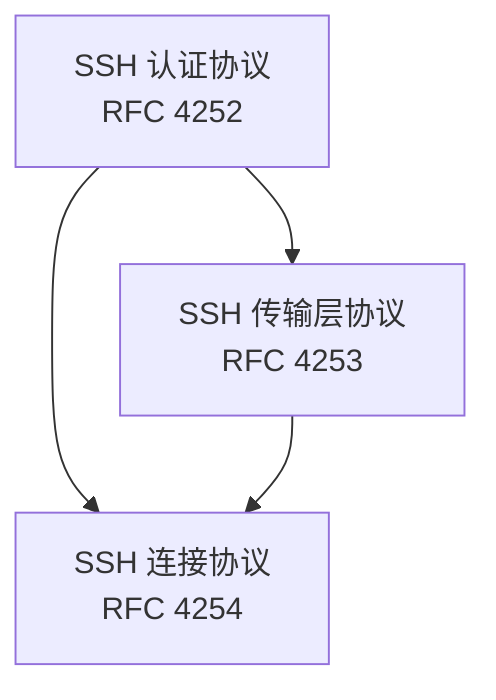
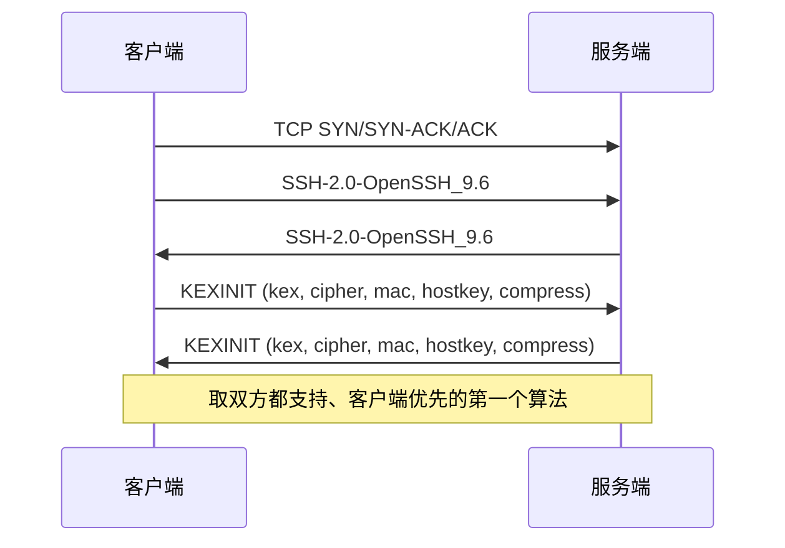
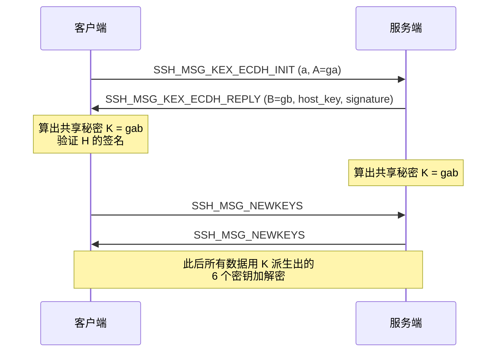
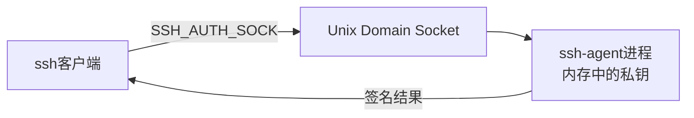
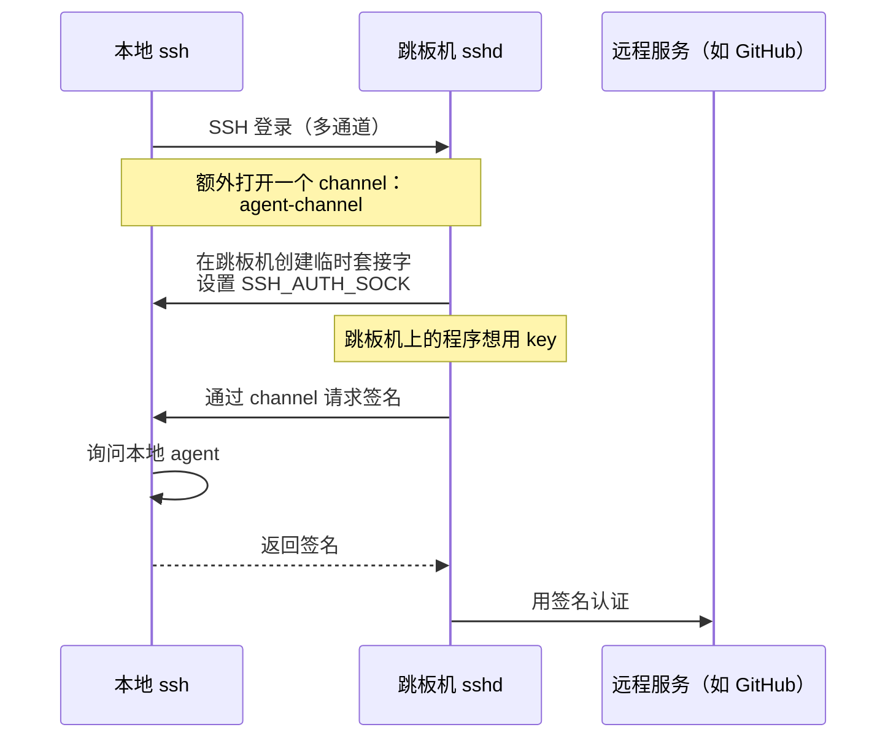
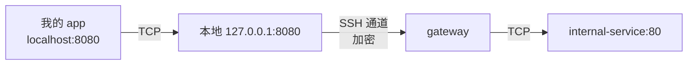

# SSH Config 深入教程：从协议原理到高级配置

> 适用对象：会用 SSH、配置过 `~/.ssh/config`，但对高级选项和底层原理仍不清晰的开发者。
> 目标：读完本文，你能看懂 SSH 握手日志、能设计自己的 config、能用 ProxyJump/ControlMaster/端口转发等高级特性解决真实问题。

## 目录

1. [前言：为什么 SSH 值得深入理解](#1-前言为什么-ssh-值得深入理解)
2. [SSH 协议原理](#2-ssh-协议原理)
   - 2.1 [整体架构](#21-整体架构)
   - 2.2 [TCP 握手](#22-tcp-握手)
   - 2.3 [协议版本交换](#23-协议版本交换)
   - 2.4 [算法协商（KEXINIT）](#24-算法协商kexinit)
   - 2.5 [密钥交换（Diffie-Hellman / ECDH / Curve25519）](#25-密钥交换diffie-hellman--ecdh--curve25519)
   - 2.6 [主机密钥认证](#26-主机密钥认证)
   - 2.7 [用户认证](#27-用户认证)
   - 2.8 [通道多路复用](#28-通道多路复用)
   - 2.9 [主密钥 vs 会话密钥](#29-主密钥-vs-会话密钥)
3. [`~/.ssh/config` 基础](#3-sshconfig-基础)
   - 3.1 [加载顺序与权限](#31-加载顺序与权限)
   - 3.2 [文件格式](#32-文件格式)
   - 3.3 [Host 模式匹配](#33-host-模式匹配)
   - 3.4 [选项"首次值生效"的语义](#34-选项首次值生效的语义)
4. [核心常用选项](#4-核心常用选项)
5. [高级特性详解](#5-高级特性详解)
   - 5.1 [ProxyJump：现代跳板机方案](#51-proxyjump现代跳板机方案)
   - 5.2 [ControlMaster：连接复用](#52-controlmaster连接复用)
   - 5.3 [ssh-agent 与 ForwardAgent](#53-ssh-agent-与-forwardagent)
   - 5.4 [端口转发：-L / -R / -D](#54-端口转发-l--r--d)
   - 5.5 [Include 与 Match：配置组织与条件化](#55-include-与-match配置组织与条件化)
6. [主机密钥与认证](#6-主机密钥与认证)
7. [密钥类型与最佳实践](#7-密钥类型与最佳实践)
8. [连接保活与优化](#8-连接保活与优化)
9. [调试技巧](#9-调试技巧)
10. [实战配置模板](#10-实战配置模板)
11. [进阶主题](#11-进阶主题)
12. [参考资料](#12-参考资料)

---

## 1. 前言：为什么 SSH 值得深入理解

SSH 是开发者最常用的工具之一：连服务器、跑命令、传文件、CI/CD、跳板机、git 推送…… 但大多数人从未深入了解过它，只停留在 `ssh user@host` 这一层。结果是：

- 看到 `Permission denied (publickey)` 就一脸懵；
- 跳板机需要 ssh 进中间机再 ssh 内网，记不住命令；
- 每次连服务器都要敲 `-i xxx.pem`，配置文件越改越乱；
- 听别人说"agent 转发不安全"却不知道为什么。

SSH 本身设计得非常优雅：它把"身份认证"、"密钥协商"、"会话加密"清晰分层；它的配置文件是一套**声明式的小型 DSL**，用得当能极大提升效率。本文从协议原理讲到实战配置，目标是让你**理解每一行配置在做什么，而不是死记硬背**。

读完本文你应该能够：

- 看懂 `ssh -vvv` 输出里的每个关键步骤；
- 设计一份分层、可维护的 `~/.ssh/config`；
- 用 ProxyJump 取代繁琐的多级 ssh；
- 用 ControlMaster 显著加速重复连接；
- 理解 agent 转发的风险并知道如何规避；
- 排查常见 SSH 故障。

---

## 2. SSH 协议原理

### 2.1 整体架构

SSH（Secure Shell）是一种**应用层协议**，跑在 TCP 之上，端口默认 22。它的协议栈被 RFC 4251–4254 规范成三层：



- **传输层（Transport Layer）**：负责 TCP 之后的所有事情——版本交换、算法协商、密钥交换、服务端身份认证、加密、完整性校验。**所有上层数据都经过这一层加密**。
- **认证层（Authentication Layer）**：在加密通道内运行。客户端用公开密钥、密码、键盘交互等方式证明"我是 user@host 的合法用户"。
- **连接层（Connection Layer）**：在加密通道里**复用**多个逻辑通道（channel），每个通道跑一个独立的会话、端口转发、X11、agent 转发等。

记住这个分层，下面的握手过程会更清晰。

### 2.2 TCP 握手

SSH 客户端先和服务器建立一条普通 TCP 连接（标准三次握手）。这一步和 SSH 协议本身无关，只是普通 socket。这一步失败你会看到 `Connection refused`（端口没开）或 `Connection timed out`（网络不通、防火墙、路由问题）。在 `ssh -v` 的最早几行会显示 `Connecting to ... port 22`。

### 2.3 协议版本交换

TCP 连通后，双方各自发送一行 ASCII 字符串告诉对方自己支持的协议版本，形如：

```
SSH-2.0-OpenSSH_9.6p1 Ubuntu-3ubuntu13.5
```

> 注意：协议版本行**必须以换行符结尾**（不是 CR LF）。

如果对端还在用 `SSH-1.99` 或 `SSH-1.x`，说明是过时的 SSH1 实现——存在已知漏洞，应拒绝连接。SSH1 的问题包括：不分层、CRC-32 完整性弱、不支持通道封装等。现代 OpenSSH 客户端默认只支持 SSH 2.0。

### 2.4 算法协商（KEXINIT）

接下来双方互相发送 `SSH_MSG_KEXINIT` 报文，里面列出**自己支持的算法清单及优先级**：



每个清单的具体内容：

- **KEX（密钥交换算法）**：curve25519-sha256、curve25519-sha256@libssh.org、diffie-hellman-group-exchange-sha256 等
- **对称加密**：chacha20-poly1305@openssh.com、aes256-gcm@openssh.com、aes256-ctr 等
- **MAC（消息认证）**：hmac-sha2-512、hmac-sha2-256 等
- **主机密钥算法**（用于验证服务端身份）：ssh-ed25519、ecdsa-sha2-nistp256、rsa-sha2-512 等
- **压缩**：none 或 zlib@openssh.com（默认 none）

算法协商的原则是"双方都支持且优先级最高"。这就是为什么客户端可以通过 `KexAlgorithms`、`Ciphers`、`MACs` 等配置覆盖默认值——只要把它放在自己列表前面即可。

### 2.5 密钥交换（Diffie-Hellman / ECDH / Curve25519）

KEXINIT 协商后进入密钥交换阶段。SSH 默认使用 **Diffie-Hellman** 类算法（包括 ECDH、Curve25519），它的精妙之处在于：**双方在网络上明文交换部分参数，最终推导出一个只有双方知道的共享秘密 K**。中间人即使截获了所有报文，也无法算出 K。

以 Curve25519 为例：



服务端还会把**主机公钥的签名**一起发过来，签名内容是 `H = HASH(M || A || B || K)`。这一步非常关键——它把"我能算出 K"这件事和"我有主机私钥"绑在了一起。即使攻击者替换了 B，没有主机私钥也签不出正确的 H。

K 还有个重要特性：**前向保密（forward secrecy）**。DH/ECDH 用的是**临时密钥对**，会话结束后就丢弃。即使未来主机私钥泄露，过去截获的流量也解不出。

### 2.6 主机密钥认证

为什么刚才的步骤不只是"算出 K"就行？因为如果不验证签名，攻击者可以做中间人攻击：他坐在你和服务器之间，和你协商出一个 K1、和服务器协商出另一个 K2，然后两边都能解密。

所以客户端必须用自己**预先知道的服务器公钥**去验证服务端刚刚发来的签名。这个公钥就是**主机密钥（host key）**。它的几个特点：

- 服务器在安装时生成，**长期不变**（除非主动轮换）；
- 默认路径：`/etc/ssh/ssh_host_*_key`（私钥）/ `ssh_host_*_key.pub`（公钥）；
- 客户端第一次连某个主机时，会把公钥写入 `~/.ssh/known_hosts`（详见 §6）；
- 主机密钥算法的当前最佳实践是 **Ed25519**（`ssh_host_ed25519_key`）。

> 注意：主机密钥和用户密钥是**两个完全不同的概念**。前者证明"你是和正确的服务器说话"，后者证明"你有这个服务器的合法账号"。

### 2.7 用户认证

服务器身份确认后，进入用户认证阶段。OpenSSH 客户端会按 `PreferredAuthentications`（默认 `publickey,keyboard-interactive,password`）顺序尝试：

1. **`publickey`**：客户端有一个私钥，把公钥提前放到了服务器的 `~/.ssh/authorized_keys`。客户端用私钥对一段服务器给出的随机挑战签名，服务器用公钥验证。
2. **`keyboard-interactive`**：通用框架，背后可以是密码、双因素、一次性口令等。
3. **`password`**：明文密码（在加密通道里传输，所以相对安全，但仍然不如公钥）。

`Permission denied (publickey)` 错误意味着公钥方式被拒，常见原因：客户端没把私钥送到 agent / 文件权限不对 / 公钥没放到服务器 authorized_keys。

### 2.8 通道多路复用

认证通过后，所有业务流量都跑在**连接层**的 channel 里：

| 类别             | Channel                       | 用途                 |
| ---------------- | ---------------------------- | -------------------- |
| `session`        | `SSH_CHANNEL_SESSION`        | 交互式 shell、exec   |
| `direct-tcpip`   | `SSH_CHANNEL_DIRECT_TCPIP`  | 本地/远程端口转发    |
| `forwarded-tcpip` | `SSH_CHANNEL_FORWARDED_TCPIP` | 反向端口转发监听端  |
| `x11`            | `SSH_CHANNEL_X11_OPEN`      | X11 转发             |
| `auth-agent@openssh.com` | 自定义                 | Agent forwarding      |

**同一个 SSH 连接上可以同时打开多个 channel**——这就是为什么 `scp`、sftp 能在已经认证的连接上跑、为什么 `ssh -L` 转发不阻塞当前会话。

### 2.9 主密钥 vs 会话密钥

一个常见误解：SSH 用的是非对称加密（公钥/私钥），所以私钥泄露等于会话被解密。这是错的。

- **主机密钥 / 用户密钥**：只用于**身份认证**和**密钥交换时的身份证明**。
- **会话密钥**：密钥交换完成后，双方用共享秘密 K 派生出的 6 个对称密钥（RFC 4253 §7.2）：
  - IV 客户端→服务端、服务端→客户端
  - 加密密钥 客户端→服务端、服务端→客户端
  - 完整性密钥 客户端→服务端、服务端→客户端

会话密钥是**对称的**，用来加密所有流量。会话结束 / rekey 时这些密钥就重新派生，旧密钥被丢弃。

这带来两个推论：

1. **私钥泄露 ≠ 历史会话泄露**。KEX 算法保证前向保密，攻击者拿到你的私钥只能伪造你的身份，但解不出过去抓的流量。
2. **AES-256-CBC + AES-256-CBC-MAC 不能混搭**。这就是为什么 RFC 规定 6 个密钥必须方向、配对严格对应。现代 AEAD 加密（chacha20-poly1305、aes*-gcm）合并了加密和 MAC 的密钥。

---

## 3. `~/.ssh/config` 基础

### 3.1 加载顺序与权限

OpenSSH 客户端按以下顺序获取配置：

1. **命令行选项**（`-p 2222`、`-i key.pem` 等）
2. 用户配置 `~/.ssh/config`
3. 系统配置 `/etc/ssh/ssh_config`

注意两点：
- 同一指令，**先获取的值生效**（少数指令例外：`IdentityFile`、`CertificateFile`、`Include`、`LocalForward`、`RemoteForward`、`SendEnv` 是累加式）。
- `/etc/ssh/ssh_config` 优先级最低——管理员可以在这里设置公司级默认。

**权限问题最容易踩坑**：OpenSSH 会拒绝读取权限过宽的 config：

```bash
chmod 700 ~/.ssh
chmod 600 ~/.ssh/config
chmod 600 ~/.ssh/id_ed25519
chmod 644 ~/.ssh/id_ed25519.pub
chmod 600 ~/.ssh/known_hosts
```

权限错误时，ssh 会**默默忽略**该文件并继续往下找——很多人就是在这里懵了：`明明写了配置为什么不生效？` 用 `ssh -G host | grep -i something` 或 `ssh -vvv` 可以看到警告。

### 3.2 文件格式

配置文件由"指令 + 值"对组成，每行一对：

```ssh_config
# 注释以 # 开头（行内也可以）
Host my-server                # Host 块开始
    HostName 10.0.0.5
    User deploy
    Port 2222
    IdentityFile ~/.ssh/id_work

Host *                         # 默认块
    ServerAliveInterval 60
```

格式规则：

- **关键字不区分大小写**（`Host` `host` `HOST` 都行）；
- **值区分大小写**（用户、主机名、文件路径）；
- 一行 `#` 是注释；行尾的 `#` 也可以加注释；
- 字符串可用双引号包围以保留空格；
- `=` 可代替空格分隔指令与值（`Port=2222`）；
- 缩进会被忽略——它只是视觉组织工具，**实际语义是"上一个 Host/Match 块结束之前的配置都属于这个块"**。

### 3.3 Host 模式匹配

`Host` 后的模式支持通配符 `*`（任意字符）和 `?`（一个字符），多个模式用空格分隔。`!` 前缀表示否定。

```ssh_config
Host *.example.com
    User alice

Host 192.168.0.?
    User admin

# 内网主机走跳板机
Host prod-* internal-*
    ProxyJump bastion

# 否定：所有 example.com 但不是 mail.example.com
Host *.example.com !mail.example.com
    User alice
```

**关键点**：`Host` 匹配的是**命令行输入的主机名**（除非启用 `CanonicalizeHostname`），不是 `HostName` 解析后的真实主机。

### 3.4 选项"首次值生效"的语义

这是配置文件最反直觉的地方：

```ssh_config
Host *
    User alice
    Port 22

Host github.com
    User git
    Port 22          # 不会生效，因为 Port 在 * 块已经设过
```

要避免这种混乱，**把更具体的块放前面**，默认块放最后。

例外——**累加式指令**：

- `IdentityFile`
- `CertificateFile`
- `Include`
- `LocalForward` / `RemoteForward`
- `SendEnv`

这些指令每次出现都会追加，而不是覆盖。比如多个 `IdentityFile` 会按顺序依次尝试。

---

## 4. 核心常用选项

这一节列出最常用的配置项。完整列表见 `man ssh_config`。

| 选项                         | 用途                      | 示例                                      |
| -------------------------- | ----------------------- | --------------------------------------- |
| `Host`                     | 块标识 + 模式匹配              | `Host *.example.com`                    |
| `HostName`                 | 真实主机名或 IP（命令行给的只是别名）    | `HostName 10.0.0.5`                     |
| `User`                     | 登录用户名                   | `User deploy`                           |
| `Port`                     | SSH 端口                  | `Port 2222`                             |
| `IdentityFile`             | 私钥路径（可多个）               | `IdentityFile ~/.ssh/id_ed25519_work`   |
| `IdentitiesOnly`           | 只用本块指定的 key，不让 agent 参与 | `IdentitiesOnly yes`                    |
| `PreferredAuthentications` | 认证方式顺序                  | `PreferredAuthentications publickey`    |
| `PubkeyAuthentication`     | 是否允许公钥认证                | `PubkeyAuthentication yes`              |
| `PasswordAuthentication`   | 是否允许密码认证                | `PasswordAuthentication no`             |
| `ForwardAgent`             | 转发 ssh-agent 套接字        | `ForwardAgent yes`                      |
| `ForwardX11`               | 转发 X11                  | `ForwardX11 yes`                        |
| `LocalForward`             | 本地端口转发                  | `LocalForward 8080 localhost:80`        |
| `RemoteForward`            | 远程端口转发                  | `RemoteForward 9000 localhost:3000`     |
| `DynamicForward`           | SOCKS 代理                | `DynamicForward 1080`                   |
| `ProxyJump`                | 跳板机                     | `ProxyJump bastion.example.com`         |
| `ProxyCommand`             | 自定义连接命令                 | `ProxyCommand ssh -W %h:%p jump`        |
| `ControlMaster`            | 连接复用                    | `ControlMaster auto`                    |
| `ControlPath`              | 控制套接字路径                 | `ControlPath ~/.ssh/cm-%C`              |
| `ControlPersist`           | 主连接空闲保留时长               | `ControlPersist 10m`                    |
| `ServerAliveInterval`      | 客户端保活探测间隔               | `ServerAliveInterval 60`                |
| `ServerAliveCountMax`      | 最多多少次无应答算断开             | `ServerAliveCountMax 3`                 |
| `TCPKeepAlive`             | 是否开启 TCP 层 keepalive    | `TCPKeepAlive yes`                      |
| `Compression`              | 是否压缩                    | `Compression yes`                       |
| `ConnectTimeout`           | TCP 连接超时（秒）             | `ConnectTimeout 10`                     |
| `ConnectionAttempts`       | 失败重试次数                  | `ConnectionAttempts 3`                  |
| `LogLevel`                 | 日志详细度                   | `LogLevel VERBOSE`                      |
| `StrictHostKeyChecking`    | 主机密钥校验严格度               | `StrictHostKeyChecking ask`             |
| `UserKnownHostsFile`       | 用户 known_hosts 路径       | `UserKnownHostsFile ~/.ssh/known_hosts` |
| `AddKeysToAgent`           | 是否自动把用过的 key 加入 agent   | `AddKeysToAgent yes`                    |

---

## 5. 高级特性详解

### 5.1 ProxyJump：现代跳板机方案

很多公司内网架构是：你 → 跳板机（bastion）→ 目标服务器。OpenSSH 7.3 之前人们用 `ProxyCommand`：

```bash
ssh -o ProxyCommand="ssh bastion nc %h %p" target.internal
```

OpenSSH 7.3+ 引入了 `ProxyJump`（命令行 `-J`），内部用更高效的协议实现。

```ssh_config
Host bastion
    HostName bastion.example.com
    User alice
    IdentityFile ~/.ssh/id_work

Host *.internal
    User alice
    IdentityFile ~/.ssh/id_work
    ProxyJump bastion
```

`ssh target.internal` 现在会：先连 bastion；在 bastion 上由 `sshd` 直接建立到 target 的 TCP 连接；把这个 TCP 流"接回"你的本地 ssh 客户端，**整个过程没有在 bastion 上跑 ssh 客户端**。这有几个好处：

- 跳板机不需要你的目标机器凭据；
- 减少了"在跳板机上留痕"；
- 可以多级串联：`ProxyJump bastion1,bastion2`。

**为什么 ProxyJump 比 ProxyCommand 安全**：因为 ProxyJump **不会把 agent 转发出跳板机**（详见 §5.3），跳板机的 root 用户不能用你的 key 进一步访问其他主机。

### 5.2 ControlMaster：连接复用

每次 `ssh user@host` 都重新走一遍 KEXINIT + 密钥交换 + 用户认证——单次开销数百毫秒到数秒。**ControlMaster** 让第一次连接保留一个"主连接"，后续同目标的连接复用它，省掉所有握手。

```ssh_config
Host *
    ControlMaster auto
    ControlPath ~/.ssh/cm-%C
    ControlPersist 10m
```

- `ControlMaster auto`：如果已有 master 就复用，否则新建；
- `ControlPath`：Unix 域套接字路径，`%C` 是基于 `{user}@{host}:{port}` 的哈希，保证每个目标一个独立套接字；
- `ControlPersist 10m`：最后一个客户端断开后，master 进程再存活 10 分钟，方便下次秒连。

#### 5 个值的语义

| 值         | 行为                       |
| --------- | ------------------------ |
| `no`（默认）  | 永远不成为 master             |
| `yes`     | 总是成为 master，如果有同名套接字则复用  |
| `ask`     | 同 `yes`，但用 askpass 二次确认  |
| `auto`    | 有 master 则复用，否则成为 master |
| `autoask` | 同 `auto`，但需要 askpass 确认  |

#### 通过复用套接字管理 master

```bash
ssh -O check    user@host   # 检查 master 是否存活
ssh -O exit     user@host   # 结束 master 及所有会话
ssh -O stop     user@host   # 关掉监听，但现有会话继续
ssh -O forward  -L 8080:localhost:80 user@host   # 动态加端口转发
ssh -O cancel   -L 8080:localhost:80 user@host
```

#### 底层原理（mux 协议）

复用不是"魔法"——它在内部走的是 OpenSSH 私有的 **mux 协议**（`PROTOCOL.mux`，不跨网络，只在本地 Unix 套接字上）。Client 请求消息如 `MUX_C_NEW_SESSION`、`MUX_C_OPEN_FWD`、`MUX_C_PROXY`，server 回复 `MUX_S_SESSION_OPENED` 等。控制消息格式：

```
uint32 packet length
uint32 request type
... payload ...
```

有一个细节常被忽略：**复用连接的 X11/Agent 转发归属于 master**，而不是新连进来的客户端。这有安全影响——见 §5.3。

#### 复用 + ProxyJump 的协同

`ProxyJump` 内部用了 mux 的 **proxy 模式**——`MUX_C_PROXY` 之后整个控制套接字切换成"未加密的 SSH 传输层协议"，让你在内层连接上复用 master 套接字。

### 5.3 ssh-agent 与 ForwardAgent

`ssh-agent` 是一个**常驻后台进程**，把解密后的私钥放在内存里，避免每次连接都输入密码。它通过 Unix 域套接字（路径由环境变量 `SSH_AUTH_SOCK` 指定）提供服务。客户端调用 `ssh` 时自动连这个套接字，发送"用 key X 签这段数据"的请求。



#### 启动和加载密钥

```bash
# 启动 agent（输出两个环境变量，eval 一下）
eval "$(ssh-agent -s)"

# 添加默认密钥（~/.ssh/id_rsa, id_ed25519, id_ecdsa, id_dsa）
ssh-add

# 添加指定密钥
ssh-add ~/.ssh/id_ed25519_work

# 列出已加载的 key
ssh-add -l

# 锁定/解锁 agent（用密码保护）
ssh-add -x    # 锁
ssh-add -X    # 解锁
```

#### AddKeysToAgent：自动化

每次新连服务器都要 `ssh-add` 很烦。可以在 config 里启用自动加入：

```ssh_config
Host *
    AddKeysToAgent yes   # 自动加入 agent
```

可选值：
- `no`（默认）—— 不自动加入
- `yes` / `confirm` / `ask` —— 自动或询问加入
- `1h` / `30m` 等时间值 —— 加入后多少时间后自动从 agent 删除

#### Agent Forwarding（ForwardAgent）

场景：你在本地 ssh 进了跳板机，想从跳板机再 git clone 一个私有 repo——这需要跳板机上有你的私钥，或者**把你的 agent 转发过去**。

```ssh_config
Host bastion
    ForwardAgent yes
```

或命令行：`ssh -A bastion`。

原理：



**关键：转发的是 agent 套接字（访问能力），不是私钥本身**。但这恰恰是危险所在：

> **警告**：任何拥有跳板机 root 的人都可以连那个临时套接字，向你的本地 agent 发起任意签名请求——他能用你的身份登入你能登入的任何主机。**密钥从未离开你的笔记本，但你的身份被借走了**。

**安全实践**：

1. **不要把 `ForwardAgent yes` 写在 `Host *` 全局默认里**。需要时用 `-A` 单次启用。
3. 如果必须转发，先 `ssh-add -x` 锁定 agent，操作完再 `ssh-add -X` 解锁。
4. 用 `ProxyJump` 替代传统转发——ProxyJump 不转发 agent，身份认证完全在本地客户端完成。
5. 实在需要转发且跳板机不可信，考虑 OpenSSH 9.3+ 的 `IdentitiesOnly=yes` + `-J` 组合，或者用更高级的方案（如 teleport）。

### 5.4 端口转发：-L / -R / -D

SSH 的三种端口转发模式经常被混淆。它们**都依赖同一个 SSH 通道**传输 TCP，区别只在**监听器在哪一边、目标在哪一边**。

#### LocalForward（-L）：本地监听 → 远程目标

```bash
ssh -L 8080:internal-service:80 user@gateway
```

含义：在我本机的 8080 端口监听。任何连过来的 TCP 流量经 SSH 加密通道送到 gateway，再由 gateway 出站到 `internal-service:80`。



典型场景：通过跳板机访问内网数据库；临时访问远程 Grafana。

#### RemoteForward（-R）：远程监听 → 本地目标

```bash
ssh -R 9000:localhost:3000 user@gateway
```

含义：在 gateway 的 9000 端口监听。任何连到 gateway:9000 的流量经 SSH 通道"返"到我的本地 3000。


典型场景：演示本地开发的 web 应用；webhook 测试。

**`GatewayPorts` 控制远程监听器绑哪**：

- `GatewayPorts no`（默认）：只绑 gateway 的 loopback——外部访问者连不到；
- `GatewayPorts yes`：绑 0.0.0.0——任何人都能连（极危险，公网慎用）；
- `GatewayPorts clientspecified`：客户端说了算。

#### DynamicForward（-D）：SOCKS 代理

```bash
ssh -D 1080 user@gateway
```

含义：在我本地 1080 端口起一个 **SOCKS5 代理**。浏览器设置 `socks5://127.0.0.1:1080` 后，所有流量从 gateway 出去。


典型场景：出差时用办公室网络；规避地域限制；翻越不友好网络的临时方案。

#### 对比

| 模式 | 监听位置 | 目标决定方式 | 适用 |
|------|----------|--------------|------|
| `-L` | 本地 | 命令行静态指定 | 访问固定的远端服务 |
| `-R` | 远程 | 命令行静态指定 | 把本地服务暴露给远端 |
| `-D` | 本地 | 客户端运行时决定（SOCKS） | 动态代理、临时 VPN |

`LocalForward` 和 `DynamicForward` 都在本地开监听，但 `-L` 是固定目标的 dumb forwarder（任何 TCP 客户端都能用），`-D` 是 SOCKS5 代理（需要应用支持 SOCKS）。

### 5.5 Include 与 Match：配置组织与条件化

#### Include：拆分配置文件

```ssh_config
Include ~/.ssh/config.d/*.conf

Host *
    ...
```

相对路径默认基于 `~/.ssh`（用户级）或 `/etc/ssh`（系统级）。`Include` 的特性：

- 路径支持 glob 通配符；
- 支持环境变量（`%h`、`%u`、`$HOME` 等 token）；
- 多文件按词法顺序处理；
- 可放在 `Match`/`Host` 块内。

实战拆分：

```
~/.ssh/
├── config                  # 主配置（默认设置）
├── config.d/
│   ├── 00-defaults.conf    # 默认选项
│   ├── 10-work.conf        # 工作机
│   ├── 20-personal.conf    # 个人项目
│   └── 30-github.conf      # GitHub 多账号
```

#### Match：条件化配置

`Match` 比 `Host` 更灵活，可以基于 host、user、localnetwork、exec 等多种条件。

```ssh_config
# 仅当从公司网络出口时启用某个设置
Match host *.internal exec "ip route | grep -q 10.0.0.0/8"
    ProxyJump bastion

# 仅本地用户是 alice 时生效
Match localuser alice
    ForwardAgent yes

# 当目标用户为 root 时关闭密码登录
Match user root
    PasswordAuthentication no

# 仅 SSH 版本 >= 9 时用新算法
Match version OpenSSH_9.*
    KexAlgorithms curve25519-sha256,[email protected]
```

Match 的判定条件：canonical / final / exec / localnetwork / host / originalhost / tagged / command / user / localuser / version / sessiontype 等，可任意组合。

---

## 6. 主机密钥与认证

### 6.1 known_hosts 与"信任首次使用"（TOFU）

第一次连一个服务器，你会看到：

```
The authenticity of host 'example.com (203.0.113.1)' can't be established.
ED25519 key fingerprint is SHA256:abc123xyz...
Are you sure you want to continue connecting (yes/no/[fingerprint])?
```

点 yes 后，服务器的主机公钥被写入 `~/.ssh/known_hosts`，下次连接自动比对。这就是 **TOFU（Trust On First Use）** 模型。

> `known_hosts` 不是缓存，是**服务器身份的可信数据库**。删除它意味着你"重新信任一切"，这会**让 MITM 攻击有机会**。

### 6.2 StrictHostKeyChecking / CheckHostIP

```ssh_config
Host *
    StrictHostKeyChecking ask       # 默认：未知主机询问，匹配不上的拒绝
    CheckHostIP no                   # 默认：不检查 IP（避免 DNS spoofing 漏报）
    UserKnownHostsFile ~/.ssh/known_hosts
```

- `StrictHostKeyChecking yes`：禁止写入 known_hosts，**任何未知主机直接拒绝**（自动化场景常用）。
- `StrictHostKeyChecking no`：**不安全**，MITM 攻击不会被发现，慎用。
- `StrictHostKeyChecking ask`：默认行为。
- `CheckHostIP yes`：连 IP 也校验——防止 DNS 劫持后的 MITM，但 DNS 重绑定会导致合法连接被拒。

### 6.3 主机密钥变更的场景

服务器重装、OpenSSH 升级或主动轮换都会改变主机密钥。客户端会看到：

```
@@@@@@@@@@@@@@@@@@@@@@@@@@@@@@@@@@@@@@@@@@@@@@@@@@@@@@@@@@@
@    WARNING: REMOTE HOST IDENTIFICATION HAS CHANGED!     @
@@@@@@@@@@@@@@@@@@@@@@@@@@@@@@@@@@@@@@@@@@@@@@@@@@@@@@@@@@@
IT IS POSSIBLE THAT SOMEONE IS DOING SOMETHING NASTY!
Someone could be eavesdropping on you right now (man-in-the-middle attack)...
```

正确处理：

1. **通过带外渠道（电话、运维群）确认**服务器真的轮换了密钥；
2. 拿到新指纹后，手动 `ssh-keygen -F example.com` 删除旧条目或编辑 known_hosts；
3. 重新连接接受新密钥。

**绝不能盲目删 known_hosts 后就接受新密钥**——这会让攻击者替换假密钥。

### 6.4 SSH 证书（高级）

管理大量主机时，靠 known_hosts 维护每个主机密钥非常痛苦。OpenSSH 支持 **SSH 证书**——由 CA 签名的服务器/用户公钥。

服务端配置（`/etc/ssh/sshd_config`）：

```
HostCertificate /etc/ssh/ssh_host_ed25519_key-cert.pub
TrustedUserCAKeys /etc/ssh/ca_user.pub
```

客户端（`~/.ssh/known_hosts`）：

```
@cert-authority *.example.com ssh-ed25519 AAAAC3Nza...（CA 公钥）
```

这样所有被这个 CA 签过名的服务器都自动可信，无需逐个接受新主机。这在大型基础设施里是必备方案。

---

## 7. 密钥类型与最佳实践

### 7.1 算法对比

| 算法 | 密钥大小 | 性能 | 安全 | 兼容性 |
|------|----------|------|------|--------|
| **Ed25519** | 固定 32 字节 | 极快 | 当前推荐 | OpenSSH 6.5+ (2014) |
| ECDSA P-256 | 短 (~91 字节) | 快 | NIST 曲线，存在争议 | OpenSSH 5.7+ |
| ECDSA P-384/P-521 | 稍长 | 中 | NIST 曲线 | 较好 |
| RSA 3072 | 较长 | 中 | 足够 | 极好 |
| RSA 4096 | 很长 | 慢 | 极好 | 极好 |
| DSA | 已废弃 | — | 不安全 | OpenSSH 默认禁用 |

**结论**：新机器**首选 Ed25519**。老机器兼容用 RSA 4096。ECDSA 仅在你信任 NIST 曲线时用。

生成密钥：

```bash
ssh-keygen -t ed25519 -C "alice@work-$(date +%Y)"
ssh-keygen -t ed25519 -f ~/.ssh/id_work -C "alice@work"
ssh-keygen -t rsa -b 4096 -f ~/.ssh/id_legacy
```

### 7.2 文件权限

| 文件 | 权限 |
|------|------|
| `~/.ssh/` | `700` |
| `~/.ssh/config` | `600` |
| `~/.ssh/id_*`（私钥） | `600` |
| `~/.ssh/id_*.pub`（公钥） | `644` |
| `~/.ssh/known_hosts` | `600` |
| `~/.ssh/authorized_keys` | `600` |

权限错误时 OpenSSH **会忽略该文件而不报错**，调试时记得检查。

### 7.3 passphrase 与 ssh-add

私钥可以加密码（passphrase）保护。即使私钥泄露，没有密码也用不了。

但每次输密码很烦——所以用 ssh-add 把已解锁的私钥交给 agent 暂存：

```bash
ssh-keygen -t ed25519 -f ~/.ssh/id_work    # 创建时设密码
ssh-add ~/.ssh/id_work                       # 输一次密码，agent 记住

# macOS：把密码存进 Keychain，下次开机自动加载
ssh-add --apple-use-keychain ~/.ssh/id_work
```

### 7.4 多账号管理（IdentitiesOnly）

如果你有多个 GitHub 账号，直接 `ssh github.com` 会让 ssh 把所有 key 试一遍——可能用错 key、被 GitHub 拒掉（"too many authentication failures"），或者**意外登错账号**。

```ssh_config
Host github.com-personal
    HostName github.com
    User git
    IdentityFile ~/.ssh/id_ed25519_personal
    IdentitiesOnly yes

Host github.com-work
    HostName github.com
    User git
    IdentityFile ~/.ssh/id_ed25519_work
    IdentitiesOnly yes
```

使用：

```bash
git clone git@github.com-personal:alice/personal-repo.git
git clone git@github.com-work:alice-work/work-repo.git
```

**`IdentitiesOnly yes` 至关重要**：它告诉 ssh **只使用本块指定的 key**，不要让 agent 把所有 key 都尝试。

---

## 8. 连接保活与优化

### 8.1 ServerAliveInterval

公司网络往往有 NAT 或防火墙，会在几分钟无活动后悄悄切断 TCP。SSH 默认没有客户端保活，你会看到"连接卡死但没断"。

```ssh_config
Host *
    ServerAliveInterval 60      # 每 60 秒发一个保活包
    ServerAliveCountMax 3       # 连续 3 次无应答则断开
```

`TCPKeepAlive`（默认 yes）是 OS 层的 keepalive，通常更慢（默认 2 小时）。优先用 `ServerAliveInterval`。

### 8.2 Compression

慢速网络（如跨洲）下，压缩能显著提速。但**不要在不可信和可信流量共享同一连接时启用**——压缩率会泄露内容信息（CRIME 类攻击）。

```ssh_config
Host *
    Compression no              # 默认

# 单独针对慢速连接
Host slow-server
    Compression yes
```

### 8.3 ConnectTimeout 与 ConnectionAttempts

```ssh_config
Host *
    ConnectTimeout 10           # TCP 连接超时
    ConnectionAttempts 3        # 重试 3 次
```

`ConnectionAttempts` 间隔默认 1 秒。

### 8.4 跳板机优化组合

跨洲跳板机经常掉线代理 + 慢：

```ssh_config
Host *
    ServerAliveInterval 30
    ServerAliveCountMax 6
    TCPKeepAlive no
    Compression yes

Host japan-bastion
    HostName bastion.example.jp
    User alice
    IdentityFile ~/.ssh/id_japan
```

---

## 9. 调试技巧

### 9.1 三个详细度级别

```bash
ssh -v   user@host    # 简略
ssh -vv  user@host    # 详细
ssh -vvv user@host    # 完整（含 debug3）
```

或者在 config 里设：

```ssh_config
Host *
    LogLevel VERBOSE
```

LogLevel 取值：QUIET / FATAL / ERROR / INFO / VERBOSE / DEBUG-1 / DEBUG-2 / DEBUG-3。

### 9.2 用 ssh -G 试运行

```bash
ssh -G user@host | grep -iE '^(hostname|user|port|identityfile|prox)'
```

`-G` 让 ssh **只解析 config 并打印最终生效值，不真正连接**。这是排查"为什么我的配置不生效"的最快工具。

### 9.3 用临时 config 调试

```bash
ssh -F /tmp/test-config user@host
```

### 9.4 常见故障速查

| 现象 | 排查方向 |
|------|----------|
| `Connection refused` | 端口错、服务端 sshd 未启、防火墙 |
| `Connection timed out` | 网络不通、安全组、路由、NAT |
| `Permission denied (publickey)` | key 路径错、权限过宽、`~/.ssh/authorized_keys` 没加、ssh-agent 没加 key |
| `Too many authentication failures` | server 设了 `MaxAuthTries`，agent key 太多被拒。设置 `IdentitiesOnly yes` |
| `Host key verification failed` | known_hosts 里的 key 跟服务端实际不符——确认未 MITM 后删除旧条目 |
| `Bad owner or permissions` | config/key 文件权限过宽。`chmod 600` |
| `ssh_exchange_identification: read: Connection reset` | 服务端 sshd 拒绝（多半 IP 被 deny，或 MaxStartups 满） |

### 9.5 调试跳板机链

多级跳板出问题怎么办？逐级打开详细度：

```bash
ssh -vvv -J bastion1,bastion2 target.internal
```

日志里会有 "Channel 0 opened"、"Connection to bastion1 closed" 等信息，能定位是哪个环节断开。

---

## 10. 实战配置模板

下面是一份**自用风格、模块化、面向 2024 年 OpenSSH 版本**的完整示例：

```ssh_config
# ============================================================
# ~/.ssh/config  --  SSH 客户端配置
# ============================================================
# 加载顺序：命令行 > 用户 config > 系统 config
# 同一选项先获取的值生效（IdentityFile 等少数指令累加）
# 权限：chmod 600 ~/.ssh/config

# ------------------------------------------------------------
# 默认设置（对所有主机生效，必须放最后）
# ------------------------------------------------------------
Host *
    # 基础
    User alice
    Port 22
    PreferredAuthentications publickey
    PubkeyAuthentication yes
    PasswordAuthentication no
    IdentitiesOnly no
    HashKnownHosts yes

    # 连接复用（重要）
    ControlMaster auto
    ControlPath ~/.ssh/cm-%C
    ControlPersist 10m

    # 保活
    ServerAliveInterval 60
    ServerAliveCountMax 3
    TCPKeepAlive no

    # 调试友好
    LogLevel INFO
    AddKeysToAgent yes

    # 安全默认值
    StrictHostKeyChecking ask
    HashKnownHosts yes
    VisualHostKey yes

# ------------------------------------------------------------
# 包含拆分的子配置
# ------------------------------------------------------------
Include ~/.ssh/config.d/*.conf
```

### 多 GitHub 账号

```ssh_config
# ~/.ssh/config.d/github.conf
Host github.com
    HostName github.com
    User git
    AddKeysToAgent yes

# 个人账号（默认走这个）
Host github.com
    IdentityFile ~/.ssh/id_ed25519_personal
    IdentitiesOnly yes

# 工作账号（用别名区分）
Host github-work
    HostName github.com
    User git
    IdentityFile ~/.ssh/id_ed25519_work
    IdentitiesOnly yes
```

### 跳板机 + 内网主机

```ssh_config
# ~/.ssh/config.d/work.conf
Host bastion
    HostName bastion.work.example.com
    User alice
    IdentityFile ~/.ssh/id_work
    ServerAliveInterval 30

Host *.internal *.staging
    User alice
    IdentityFile ~/.ssh/id_work
    ProxyJump bastion
    ServerAliveInterval 30

# 多级跳板
Host deep-internal
    HostName deep.internal.work.example.com
    User alice
    ProxyJump bastion,jumphost2
```

### 数据库访问

```ssh_config
# ~/.ssh/config.d/db.conf
Host db-tunnel
    HostName bastion.work.example.com
    User alice
    LocalForward 15432 postgres.internal:5432
    LocalForward 16379 redis.internal:6379
    IdentityFile ~/.ssh/id_work

# 用法：
#   ssh db-tunnel       # 保持连接，15432/16379 就能直连内网 DB
#   psql -h 127.0.0.1 -p 15432 -U myuser mydb
```

### Web 应用演示（远程暴露本地服务）

```ssh_config
# ~/.ssh/config.d/demo.conf
Host demo-tunnel
    HostName demo.example.com
    User alice
    RemoteForward 8080 localhost:3000
    RequestTTY no
    ExitOnForwardFailure yes
```

### WSL 访问 Windows 主机 / 反之

```ssh_config
# WSL 内访问 Windows 主机（默认从 WSL 视角）
Host win-host
    HostName $(cat /etc/resolv.conf | grep nameserver | awk '{print $2}')
    User your-windows-user

# Windows 访问 WSL
# 在 WSL 里跑：  ssh-keygen && cat ~/.ssh/id_ed25519.pub
# 把公钥加到 Windows 的 C:\Users\<you>\.ssh\authorized_keys
# 然后在 Windows 的 config 里：
Host wsl
    HostName 127.0.0.1
    Port 2222   # WSL sshd 端口（默认 22 也行）
    User $(wsl whoami)
```

### VS Code Remote SSH 友好设置

```ssh_config
Host dev-server
    HostName dev.internal
    User alice
    ServerAliveInterval 30
    ServerAliveCountMax 6
    # 让 VS Code Remote 体验更流畅
    Compression yes
```

---

## 11. 进阶主题

### 11.1 ProxyCommand 的遗留场景

虽然 `ProxyJump` 覆盖了 95% 的场景，但有些场景 `ProxyCommand` 仍有意义：

- **AWS SSM Session Manager**：
  ```ssh_config
  Host i-*
    ProxyCommand sh -c "aws ssm start-session --target %h --document-name AWS-StartSSHSession --parameters 'portNumber=%p'"
  ```
- **GCP IAP Tunnel**：
  ```bash
  gcloud compute ssh VM_NAME --tunnel-through-iap
  # 内部就是 ProxyCommand + gcloud
  ```
- **走 HTTP 代理**：
  ```ssh_config
  Host *
    ProxyCommand nc -X connect -x proxy.example.com:1080 %h %p
  ```

### 11.2 主机名规范化

```ssh_config
Host *
    CanonicalizeHostname yes
    CanonicalDomains internal.example.com example.com
    CanonicalizeFallbackLocal no
```

`CanonicalizeHostname yes` 让 ssh 自动补全域名：输入 `web1` 会尝试 `web1.internal.example.com`、`web1.example.com`。结合 `Match host` 块可以做非常多灵活的配置。

### 11.3 X11 转发

X11 转发在 macOS 上意义不大（没有 X server），但在 Linux 服务器调试 GUI 应用很方便：

```ssh_config
Host *
    ForwardX11 yes
    ForwardX11Trusted yes   # 较安全但功能受限；no 时只能用受限 X11
```

macOS 安装 XQuartz 后 `ssh -X user@host xterm` 即可。

### 11.4 SSH over WebSocket / HTTPS

有些网络封禁了 22 端口（公司、咖啡馆）。OpenSSH 本身不支持，但有几种方案：

- **cloudflared** / **ngrok**：在外网有跳板机时用；
- **ssh-tarpit**：自建；
- **WebSocket 代理**：如 `ws-tcp-relay`。

这类方案不在 OpenSSH 标准范围内，但思路都类似：把 SSH 流封装成 HTTPS。

### 11.5 配置文件同步

如果你有多台笔记本/工作站，想保持配置一致：

- 用 git 管理（裸仓库 + 软链接）；
- 用 `chezmoi`、`dotbot` 等 dotfile 管理工具；
- 或用 `Include ~/.ssh/config.d/*.conf` 把每台机器专属的部分拆出来。

注意：**绝不要把私钥放进 git**。`config` 和 `*.pub` 是可以的，私钥不行。

---

## 12. 参考资料

#### 官方文档（最权威）

- [ssh_config(5) - OpenBSD Manual Pages](https://man.openbsd.org/OpenBSD-current/man5/ssh_config.5) — 客户端配置完整手册
- [ssh(1) - OpenBSD Manual Pages](https://man.openbsd.org/man1/ssh.1) — ssh 命令完整手册
- [ssh-agent(1) - Linux Man Page](https://man7.org/linux/man-pages/man1/ssh-agent.1.html)
- [PROTOCOL.mux - OpenSSH 源码](https://github.com/openssh/openssh-portable/blob/master/PROTOCOL.mux) — 复用协议规范
- [OpenSSH 官方手册页](https://www.openssh.com/manual.html)
- [SSH agent restriction](https://www.openssh.org/agent-restrict.html)

#### 协议规范

- [RFC 4251 - SSH Protocol Architecture](https://www.rfc-editor.org/rfc/rfc4251.html)
- [RFC 4252 - SSH Authentication Protocol](https://www.rfc-editor.org/rfc/rfc4252.html)
- [RFC 4253 - SSH Transport Layer Protocol](https://datatracker.ietf.org/doc/html/rfc4253.html)
- [RFC 4254 - SSH Connection Protocol](https://www.rfc-editor.org/rfc/rfc4254.html)

#### 优秀的深度文章

- [SSH Agent Explained (smallstep)](https://smallstep.com/blog/ssh-agent-explained/) — agent 工作原理和风险
- [SSH Handshake Explained (Teleport)](https://goteleport.com/blog/ssh-handshake-explained/) — 握手细节
- [Understanding the SSH Encryption and Connection Process (DigitalOcean)](https://www.digitalocean.com/community/tutorials/understanding-the-ssh-encryption-and-connection-process)
- [OpenSSH Connection Multiplexing — ControlMaster (AccessDenied)](https://rya-sge.github.io/access-denied/2026/08/27/openssh-connection-multiplexing-controlmaster/) — mux 协议深入
- [SSH Tunneling: Local, Remote, and Dynamic Port Forwarding](https://readthemanual.co.uk/ssh-tunneling-port-forwarding/)
- [SSH ProxyJump and ProxyCommand (Teleport)](https://goteleport.com/blog/ssh-proxyjump-ssh-proxycommand/)
- [SSH to remote hosts through a proxy or bastion with ProxyJump (RedHat)](https://www.redhat.com/en/blog/ssh-proxy-bastion-proxyjump)
- [Comparing SSH Keys: RSA, DSA, ECDSA or EdDSA (Teleport)](https://goteleport.com/blog/comparing-ssh-keys/)
- [Quirks of parsing SSH configs](https://sthbrx.github.io/blog/2023/08/04/quirks-of-parsing-ssh-configs/) — 配置解析的隐藏细节

#### 实操参考

- [SSH ProxyJump Guide: Bastion Hosts & Config Examples](https://zerodatatools.com/blog/ssh-jump-hosts-proxyjump/)
- [Managing multiple accounts (GitHub Docs)](https://docs.github.com/en/account-and-profile/how-tos/account-management/managing-multiple-accounts)
- [The SSH config file (~/.ssh/config): a practical guide](https://termai.sh/blog/ssh-config-file)
- [Trust on first use (Wikipedia)](https://en.wikipedia.org/wiki/Trust_on_first_use)

---

## 附录：常用命令速查

```bash
# === 调试 ===
ssh -vvv user@host                    # 完整调试
ssh -G user@host                      # 打印最终生效配置
ssh -F /tmp/test user@host            # 用临时 config

# === 连接复用 ===
ssh -O check  user@host
ssh -O exit   user@host
ssh -O stop   user@host
ssh -O forward -L 8080:localhost:80 user@host

# === ssh-agent ===
eval "$(ssh-agent -s)"                # 启动
ssh-add                                # 加默认 key
ssh-add -l                             # 列出
ssh-add -D                             # 删除所有
ssh-add -x / -X                        # 锁定 / 解锁
ssh-add --apple-use-keychain           # macOS Keychain 集成

# === 端口转发 ===
ssh -L 8080:internal:80 user@gw       # 本地转远程
ssh -R 9000:localhost:3000 user@gw    # 远程转本地
ssh -D 1080 user@gw                   # SOCKS 代理

# === 主机密钥 ===
ssh-keyscan -t ed25519 host           # 拉取主机公钥（用于自动化）
ssh-keygen -F host                    # 查 known_hosts
ssh-keygen -R host                    # 删 known_hosts 条目
ssh-keygen -lf ~/.ssh/id_ed25519.pub  # 看公钥指纹
```