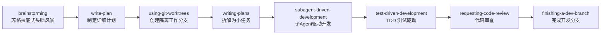
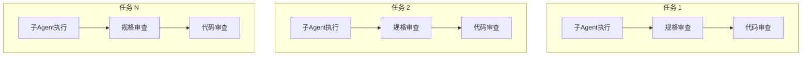

> Superpowers 是一个完整的软件 agent 开发工作流框架，为 Claude Code 提供 14+ 结构化技能，使其从简单的代码生成器转变为真正的资深 AI 开发者。

GitHub: [obra/superpowers](https://github.com/obra/superpowers) | 153K+ Stars | MIT License

## 核心价值

Superpowers 解决了 AI 辅助开发中最常见的问题：

- **代码优先，思考滞后** - Agent 直接跳到写代码，而不是先理解需求
- **架构靠猜** - 不询问、不讨论，直接实现
- **治标不治本** - 修复症状而非根本原因
- **跳过测试** - 快速交付但代码质量不稳定

Superpowers 的核心哲学：

1. **TDD 测试驱动** - 先写测试，始终遵循红-绿-重构循环
2. **系统化优于随机** - 流程优先于猜测
3. **简化优先** - 复杂性是敌人
4. **证据验证** - 验证后再声明成功

## 安装配置

### 方式一：Claude Code 官方市场（推荐）

Claude Code 已将 Superpowers 集成到官方插件市场：

```bash
# 添加市场
/plugin marketplace add obra/superpowers-marketplace

# 安装插件
/plugin install superpowers@claude-plugins-official
```

### 方式二：手动安装

```bash
# 直接安装
/plugin install superpowers@claude-plugins-official
```

### 方式三：通过 OpenSkills（跨平台）

如果希望在多个 IDE/Agent 间共享技能：

```bash
# 安装 OpenSkills
npm install -g prpm

# 安装 Superpowers
prpm install collections/superpowers
```

## 七阶段开发工作流

Superpowers 实现了完整的产品级软件开发流程，分为七个阶段：



### 阶段一：Brainstorming（头脑风暴）

**触发时机**：当你开始一个新项目或新功能时

Agent 会通过苏格拉底式提问来帮助你理清思路：
- 你真正想要解决的问题是什么？
- 有哪些替代方案？
- 每个方案的利弊是什么？

**核心原则**：不要急于说"直接做"，回答 Agent 的问题，批准设计文档。清晰的思路 = 更少返工。

### 阶段二：Write-Plan（制定计划）

**触发时机**：设计被批准后

Agent 创建一个详细的规格文档，包含：
- 明确的目标和范围
- 技术架构决策
- 风险评估
- 资源需求

### 阶段三：Using-Git-Worktrees（隔离分支）

**触发时机**：计划被批准后

使用 Git Worktree 创建隔离的工作分支：
- 不影响主分支的干净开发环境
- 可以同时处理多个任务
- 运行项目设置和验证测试基线

```bash
# Superpowers 自动为你创建类似这样的工作流
git worktree add -b feature/new-component ../feature-worktree
```

### 阶段四：Writing-Plans（任务拆解）

**触发时机**：Git Worktree 准备就绪

将工作分解为**小颗粒度任务**（每个 2-5 分钟）：
- 每个任务有精确的文件路径
- 完整的代码实现
- 验证步骤

### 阶段五：Subagent-Driven-Development（子Agent驱动开发）

**触发时机**：Plan 准备好后

Agent 自动启动子 Agent 并行处理每个任务：
- 每个任务两阶段审查（规格合规性 → 代码质量）
- 支持批量执行 + 人工检查点
- Claude 可以自主工作数小时而不偏离计划



### 阶段六：Test-Driven-Development（测试驱动）

**触发时机**：实现过程中

强制执行 RED-GREEN-REFACTOR 循环：

1. **RED** - 编写一个会失败的测试
2. **GREEN** - 编写最小代码让测试通过
3. **REFACTOR** - 重构代码，测试保持通过
4. **提交** - 每次循环后提交

**关键规则**：删除在测试之前编写的任何代码，确保代码完全由测试驱动。

### 阶段七：Requesting-Code-Review（代码审查）

**触发时机**：任务之间

Agent 自动进行代码审查：
- 对照计划检查实现
- 按严重程度报告问题
- 严重问题阻止进度

## 内置技能列表

### 核心工作流技能

| 技能名称 | 功能描述 |
|---------|---------|
| `brainstorming` | 苏格拉底式头脑风暴，探索替代方案 |
| `write-plan` | 创建详细的设计文档 |
| `using-git-worktrees` | 创建隔离的 Git Worktree |
| `writing-plans` | 将工作拆解为可执行任务 |
| `subagent-driven-development` | 并行子 Agent 开发 |
| `executing-plans` | 批量执行计划 + 检查点 |
| `test-driven-development` | TDD 红绿重构循环 |
| `requesting-code-review` | 代码审查与反馈 |
| `finishing-a-dev-branch` | 分支完成与合并选项 |

### 测试与调试技能

| 技能名称 | 功能描述 |
|---------|---------|
| `test-driven-development` | RED-GREEN-REFACTOR 测试循环 |
| `systematic-debugging` | 4 阶段根因分析（症状 → 根因 → 修复 → 验证） |

### 协作技能

| 技能名称 | 功能描述 |
|---------|---------|
| `brainstorming` | 协作式头脑风暴 |
| `dispersing-parallel-agents` | 并行 Agent 工作流协调 |
| `sharing-skills` | 技能分发与通信 |

### 操作技能

| 技能名称 | 功能描述 |
|---------|---------|
| `deploy` | 部署相关任务（预检、环境验证、回滚） |
| `migrate` | 数据库或代码迁移 |
| `optimize` | 性能分析与优化 |
| `audit` | 安全审查（漏洞、凭证、注入风险） |

### Meta 技能

| 技能名称 | 功能描述 |
|---------|---------|
| `writing-skills` | 创建新技能的最佳实践 |
| `using-superpowers` | 框架核心能力介绍 |

## 与 Claude Code 的深度集成

Superpowers 与 Claude Code 的集成包括：

1. **自动触发** - Agent 在任何任务前自动检查相关技能，无需手动调用
2. **CLAUDE.md 上下文** - 通过 Claude Code 的 `CLAUDE.md` 上下文系统工作
3. **子 Agent 支持** - 利用 Claude Code 原生子 Agent 支持实现并行开发
4. **沙箱执行** - 技能在受限代码执行环境中运行
5. **插件自动更新** - 通过 `/plugin update` 自动更新技能

## 实际使用示例

### 示例 1：开发新功能

```
你: 帮我开发一个用户认证系统
Agent: [触发 brainstorming] - 开始问你关于认证方式、Session 管理等问题
你: 回答问题，批准设计
Agent: [触发 write-plan] - 生成详细的认证架构设计
你: 批准计划
Agent: [自动执行后续所有阶段] - Worktree → 任务拆解 → TDD 开发 → 代码审查
```

### 示例 2：修复 Bug

```
你: 登录页面报错了
Agent: [触发 systematic-debugging] - 执行 4 阶段调试流程
  1. 收集症状信息
  2. 识别潜在根因
  3. 深入分析每个根因
  4. 验证修复方案
```

## 扩展 Superpowers

Superpowers 的技能系统支持扩展：

```bash
# 查看所有可用技能
ls skills/

# 创建新技能（遵循 writing-skills 指南）
# 编辑 skills 目录下的文件

# 更新插件获取最新技能
/plugin update superpowers
```

### 编写自定义技能

1. Fork 仓库
2. 创建新分支
3. 遵循 `skills/writing-skills/SKILL.md` 中的指南
4. 提交 PR

## 最佳实践

1. **用真实任务练习** - 框架在真实工作上表现出色，不是 hello world
2. **让头脑风暴完成** - 当 Agent 开始提问而非写代码时，回答问题并批准设计
3. **信任 TDD 流程** - 第一次看到"写测试→失败→写代码→通过"的循环时，你会感受到差异
4. **不要跳过审查** - 代码审查阶段发现的严重问题应及时修复
5. **保持任务小颗粒** - 2-5 分钟的任务比 2 小时的任务更容易保证质量

## 社区资源

- **Discord**: [加入社区](https://discord.gg/35wsABTezj) 获取支持
- **GitHub Issues**: [报告问题](https://github.com/obra/superpowers/issues)
- **Release 公告**: [订阅通知](https://primediamond.com/superpowers/) 获取新版本更新

## 参考资料

- [Superpowers 官方仓库](https://github.com/obra/superpowers)
- [Superpowers for Claude Code - MindStudio](https://www.mindstudio.ai/blog/what-is-superpowers-plugin-claude-code/)
- [Superpowers for Claude Code Complete Guide 2026](https://pasqualepillitteri.it/en/news/215/superpowers-claude-code-complete-guide)
- [Superpowers: Skills Framework Reshaping AI Dev](https://www.termdock.com/en/blog/superpowers-framework-agent-skills)
- [OpenSkills - Adding Superpowers for Any IDE](https://dev.to/wakeupmh/openskills-adding-claude-skills-and-superpowers-for-any-agent-or-ide-3j35)
