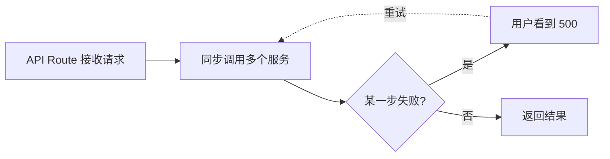
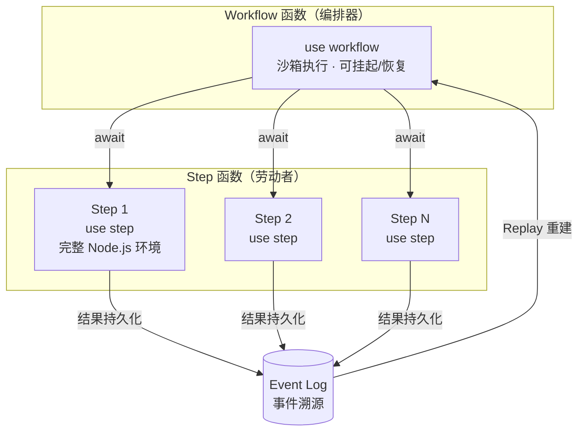
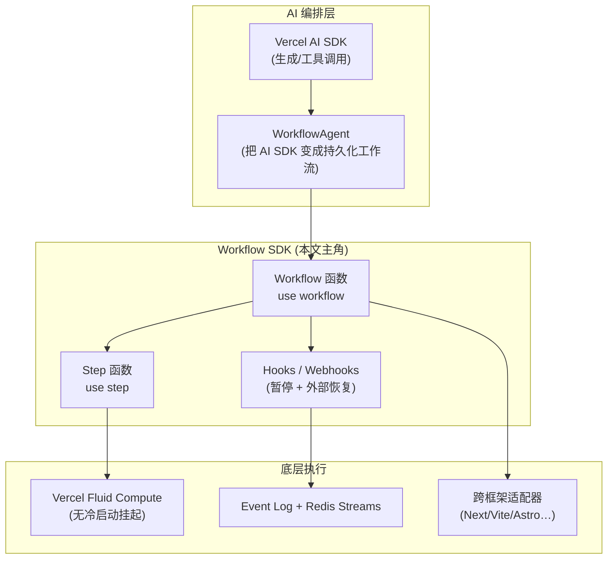
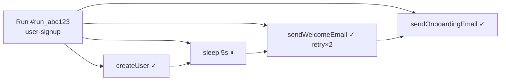
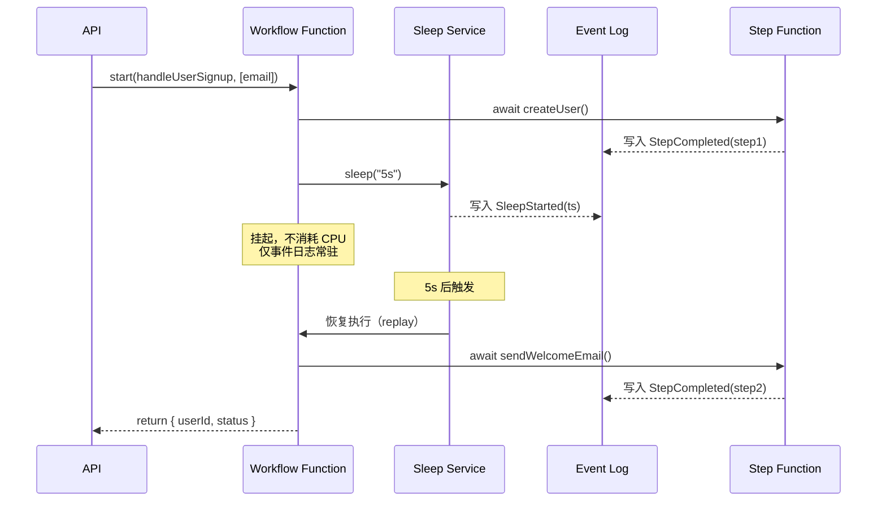
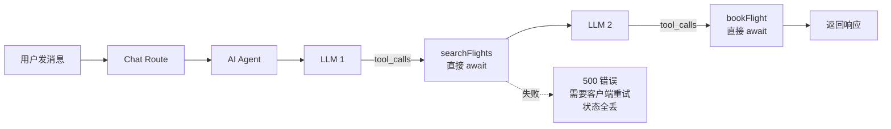
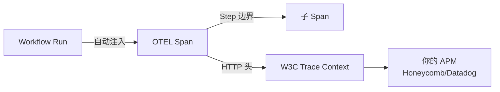
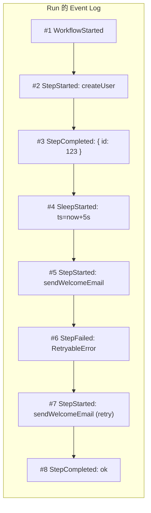

# Vercel Workflow SDK 入门教程：为 JavaScript 异步流程注入持久化能力

> 本文是一份 **学习笔记 + 实战教程**，系统性梳理 [workflow-sdk.dev](https://workflow-sdk.dev) 所描述的 Workflow SDK 技术——一个由 Vercel 开源的、用于给 JavaScript 异步代码引入"持久化执行（Durable Execution）"能力的开发工具包。

<Note type="info">
本文基于 Workflow SDK 4.x（2026 年正式版），所有源码示例与 API 行为来自 [workflow-sdk.dev 官方文档](https://workflow-sdk.dev/docs) 与 [vercel/workflow GitHub 仓库](https://github.com/vercel/workflow)。
</Note>

---

## 一、这份技术到底是什么？

### 1.1 一句话总结

**Workflow SDK 让 JavaScript 异步函数具备了"挂起—恢复"能力**：你的函数在 `await` 一个 step 或 `sleep` 时不再阻塞服务器资源，而是把执行状态写进持久化的事件日志，等条件满足后再从原来的断点继续执行。

### 1.2 它要解决什么问题

在传统 serverless 与 Node.js 服务里，长任务普遍长这样：



| 痛点 | 传统方案 | Workflow SDK 方案 |
| --- | --- | --- |
| **长时间任务（数小时/数天）** | 自建队列 + 定时器 + 状态表 | `sleep()` 不消耗资源，自动恢复 |
| **多步编排容易中断** | 自己写 Saga / 重试 / 补偿 | 失败自动重试，支持回滚（Rollback） |
| **LLM 调用漫长且易超时** | 流式转发 + 客户端 reconnect | 流式 + 断点续传 (`run.getReadable({ startIndex })`) |
| **外部回调（支付/审批/IM）** | 自己维护 Webhook 表 | `createHook()` / `createWebhook()` 自动暂停/恢复 |
| **AI Agent 工具调用追踪** | 单独搭观测栈 | `WorkflowAgent` 自动重试 + 内置 trace viewer |
| **难以调试** | 散落的日志 | `npx workflow web` 可视化整次运行 |

简而言之，Workflow SDK 把"durable functions（持久化函数）" 这种通常只有 Temporal、Inngest、AWS Step Functions 才具备的能力，通过 **编译器指令（directive）** 的方式带进了普通 JavaScript 项目，**不需要额外基础设施**就能在 Vercel 上跑[1]。

### 1.3 核心心智模型



两个关键指令：

- `"use workflow"` —— 函数进入 **沙箱执行**，不能直接调用 `fs`、`process` 等 Node.js API；目的是保证 **确定性（deterministic）**，从而可以被重放（replay）。
- `"use step"` —— 函数运行在完整 Node.js 环境中，负责真正的业务逻辑（数据库、HTTP、AI、文件等），**自动重试**，结果被持久化[2]。

---

## 二、技术定位与生态

### 2.1 在 AI/Serverless 技术栈中的位置



### 2.2 兼容性矩阵（截至 2026 v4）

| 框架 | 状态 | 备注 |
| --- | --- | --- |
| Next.js | ✅ 一等公民 | 通过 `withWorkflow()` 包装 `next.config.ts` |
| Vite | ✅ | — |
| Astro | ✅ | — |
| Express / Fastify / Hono | ✅ | 通用 Node 适配 |
| Nuxt / Nitro | ✅ | — |
| SvelteKit / TanStack Start | ✅ | — |
| NestJS | 🚧 Coming soon | — |
| Python | 🧪 Beta | 见 [Python getting started](https://workflow-sdk.dev/docs/getting-started/python) |

来源：[Getting Started 文档][https://workflow-sdk.dev/docs/getting-started](3)

### 2.3 与同类方案的对比

| 维度 | Temporal | Inngest | **Workflow SDK** |
| --- | --- | --- | --- |
| 部署形态 | 自托管/云 | 自托管/云 | 仅 Vercel（其它平台需自接 World） |
| 接入方式 | SDK + Worker 进程 | SDK + 函数 | 纯 `npm install` + 编译器指令 |
| 编程模型 | Activity/Workflow 双层 | Step 函数 | 函数指令（`"use workflow"` / `"use step"`） |
| AI Agent 集成 | 自己拼 | 内置 Agent Kit | 原生 `WorkflowAgent` + AI SDK |
| 跨框架 | 多语言 | TypeScript 优先 | 12+ Web 框架 + Python Beta |

> Vercel Workflow SDK 的差异化定位：**"AI 时代的 Durable Functions"**——把生成式 AI 长任务、工具调用、人工审批无缝串起来，开发者几乎不用关心基础设施。

---

## 三、快速上手：从零创建一个 Next.js 工作流

### 3.1 创建项目并安装

```bash
# 1. 创建 Next.js 项目
npm create next-app@latest my-workflow-app
cd my-workflow-app

# 2. 安装 Workflow SDK
npm install workflow
```

### 3.2 包装 `next.config.ts`

这是接入 Workflow SDK 的"魔法"——`withWorkflow()` 让 Next.js 的编译器识别 `"use workflow"` / `"use step"` 指令：

```ts
// next.config.ts
import { withWorkflow } from "workflow/next";
import type { NextConfig } from "next";

const nextConfig: NextConfig = {
  // 其余 Next.js 配置…
};

export default withWorkflow(nextConfig);
```

### 3.3 写第一个工作流

`workflows/user-signup.ts`：

```ts
import { sleep, FatalError } from "workflow";

// 【编排器】—— 定义整个用户注册的流程
export async function handleUserSignup(email: string) {
  "use workflow"; // ① 关键指令：声明这是一个 Workflow

  const user = await createUser(email);     // 步骤 1
  await sendWelcomeEmail(user);              // 步骤 2

  await sleep("5s");                         // 暂停 5s 不消耗资源
  await sendOnboardingEmail(user);           // 步骤 3

  return { userId: user.id, status: "onboarded" as const };
}

// 【劳动者】—— 真正干活的函数，都标记为 "use step"
async function createUser(email: string) {
  "use step"; // ② 完整 Node.js 环境

  console.log(`Creating user with email: ${email}`);
  return { id: crypto.randomUUID(), email };
}

async function sendWelcomeEmail(user: { id: string; email: string }) {
  "use step";

  console.log(`Sending welcome email to user: ${user.id}`);
  // 模拟不稳定：30% 概率失败，会被自动重试
  if (Math.random() < 0.3) throw new Error("Retryable!");
}

async function sendOnboardingEmail(user: { id: string; email: string }) {
  "use step";

  // 邮箱格式错误时不希望重试，抛 FatalError
  if (!user.email.includes("@")) {
    throw new FatalError("Invalid Email");
  }
  console.log(`Sending onboarding email to user: ${user.id}`);
}
```

> 注意三种关键行为：
>
> 1. **Step 默认会自动重试**（最多 3 次）。
> 2. `sleep("5s")` 让工作流挂起，**不消耗任何计算资源**[4]。
> 3. `FatalError` 跳过重试，直接失败。

### 3.4 启动入口（API Route）

`app/api/signup/route.ts`：

```ts
import { start } from "workflow/api";
import { NextResponse } from "next/server";
import { handleUserSignup } from "@/workflows/user-signup";

export async function POST(request: Request) {
  const { email } = await request.json();

  // start() 立即返回，不阻塞 API 响应
  const run = await start(handleUserSignup, [email]);

  return NextResponse.json({
    message: "User signup workflow started",
    runId: run.runId, // 可用于后续查询/追踪
  });
}
```

### 3.5 跑起来 & 观测

```bash
# 终端 1：启动开发服务器
npm run dev

# 终端 2：触发工作流
curl -X POST --json '{"email":"hello@example.com"}' http://localhost:3000/api/signup

# 终端 3：打开可视化观测面板
npx workflow web
```

观测面板长这样[5]：



---

## 四、进阶特性：四大支柱

### 4.1 支柱一：错误处理与重试（Errors & Retries）

#### 4.1.1 三类错误的处理策略

| 错误类型 | 类 | 默认行为 | 何时用 |
| --- | --- | --- | --- |
| 普通 `Error` | — | 自动重试，最多 3 次 | 暂时性故障（网络 5xx、限流 429） |
| `RetryableError` | `workflow` | 自动重试，可指定 `retryAfter` | 需要自定义退避策略 |
| `FatalError` | `workflow` | 立即终止工作流 | 业务上不可恢复（404、参数错误） |

#### 4.1.2 精细控制重试

```ts
import { FatalError, RetryableError, getStepMetadata } from "workflow";

async function callApi(endpoint: string) {
  "use step";

  const { attempt } = getStepMetadata();
  const response = await fetch(endpoint);

  if (response.status >= 500) {
    // 指数退避：1s, 4s, 9s...
    throw new RetryableError("Backing off...", {
      retryAfter: (attempt ** 2) * 1000,
    });
  }

  if (response.status === 404) {
    throw new FatalError("Resource not found");
  }

  if (response.status === 429) {
    // 1 分钟后重试
    throw new RetryableError("Rate limited", {
      retryAfter: "1m",
      // 或者使用绝对时间：new Date(Date.now() + 60000)
    });
  }

  return response.json();
}

callApi.maxRetries = 5; // 总共最多 6 次尝试
```

> 💡 `setting maxRetries = 0` 表示"只跑 1 次不重试"；默认为 3，即"1 次 + 3 次重试 = 4 次"[6]。

#### 4.1.3 Saga 模式：正向步骤 + 补偿回滚

```ts
async function reserveInventory(orderId: string) { "use step"; /* ... */ }
async function chargePayment(orderId: string)    { "use step"; /* ... */ }
async function releaseInventory(orderId: string) { "use step"; /* ... */ }
async function refundPayment(orderId: string)    { "use step"; /* ... */ }

export async function placeOrderSaga(orderId: string) {
  "use workflow";

  const rollbacks: Array<() => Promise<void>> = [];

  try {
    await reserveInventory(orderId);
    rollbacks.push(() => releaseInventory(orderId));

    await chargePayment(orderId);
    rollbacks.push(() => refundPayment(orderId));
  } catch (e) {
    // 反向回滚
    for (const rb of rollbacks.reverse()) await rb();
    throw e; // 让 Workflow 记录这次失败
  }
}
```

关键设计原则[7]：

- 回滚步骤本身也是 step（享受重试 + 可观测性）。
- 回滚必须是 **幂等** 的——它们可能因重试被多次执行。
- **只有当正向步骤成功后才登记补偿动作**。

### 4.2 支柱二：睡眠与挂起（Sleep & Suspension）

工作流在以下情况会 **挂起并释放计算资源**：

```ts
import { sleep } from "workflow";

export async function billingReminder(userId: string) {
  "use workflow";

  const user = await getUser(userId);
  await sendFirstReminder(user);
  await sleep("30d"); // ① 挂起 30 天，不占资源
  await sendSecondReminder(user);
  await sleep("7d");
  await sendFinalNotice(user);
}
```

挂起机制的实现原理[8]：



### 4.3 支柱三：Hooks & Webhooks（外部事件恢复）

如果说 `sleep()` 是"时间维度"的挂起，那么 Hook 就是"事件维度"的挂起——等一个外部系统的回调。

#### 4.3.1 Hooks vs Webhooks

| 维度 | `createHook()` | `createWebhook()` |
| --- | --- | --- |
| **数据格式** | 任意可序列化数据 | 完整 HTTP `Request` |
| **URL** | 无（你生成 token，自行分发） | 自动生成 `webhook.url` |
| **响应能力** | 无 | 支持 `respondWith()` 返回 HTTP Response |
| **触发方式** | `resumeHook(token, data)` | HTTP 请求到 `webhook.url` |
| **典型场景** | 主动分发 token（Slack 等） | 被动接收 HTTP（GitHub Webhook 等） |

#### 4.3.2 Hook 基础：人工审批工作流

```ts
import { createHook } from "workflow";

export async function approvalWorkflow(documentId: string) {
  "use workflow";

  // 1. 创建一个 Hook，token 自定义
  using hook = createHook<{ approved: boolean; comment: string }>({
    token: `approval:${documentId}`,
  });

  // 2. 把 token 发给审批人（邮件/Slack/控制台…）
  await sendApprovalEmail(documentId, hook.token);

  // 3. 挂起 —— 直到有人调用 resumeHook(token, {...})
  const result = await hook;
  console.log(`审批结果：${result.approved}，意见：${result.comment}`);
}
```

外部恢复入口[9]：

```ts
// app/api/approval/route.ts
import { resumeHook } from "workflow/api";

export async function POST(request: Request) {
  const { token, approved, comment } = await request.json();
  try {
    const { runId } = await resumeHook(token, { approved, comment });
    return Response.json({ success: true, runId });
  } catch {
    return Response.json({ error: "Invalid token" }, { status: 404 });
  }
}
```

#### 4.3.3 Webhook 进阶：自动生成 URL

```ts
import { createWebhook, type RequestWithResponse } from "workflow";

export async function eventCollectorWorkflow() {
  "use workflow";

  using webhook = createWebhook({ respondWith: "manual" });
  console.log("Send events to:", webhook.url);
  // → https://your-app.com/.well-known/workflow/v1/webhook/lJHkuMdQ2FxSFTbUMU84k

  // 接收多次事件
  for await (const req of webhook) {
    const data = await req.json();
    await processEvent(data); // step
    if (data.type === "done") break;
  }
}
```

> 安全提示：webhook 的 token 是公开端点的唯一鉴权，**生产环境建议用 `createHook()` 自己写鉴权中间件**。

#### 4.3.4 类型安全 Hook：`defineHook()`

```ts
import { defineHook } from "workflow";
import { z } from "zod";

// 定义：schema 校验 + 类型推断
export const approvalHook = defineHook({
  schema: z.object({
    approved: z.boolean(),
    approvedBy: z.string(),
    comment: z.string().transform((v) => v.trim()),
  }),
});

// Workflow 中
export async function docApproval(docId: string) {
  "use workflow";
  using hook = approvalHook.create({ token: `doc:${docId}` });
  const result = await hook; // 自动推断类型 + 自动校验
  console.log(result.approvedBy, result.comment);
}

// 恢复时（同上自动校验）
await approvalHook.resume("doc:123", { approved: true, approvedBy: "Alice", comment: "ok" });
```

### 4.4 支柱四：流式输出（Streaming）

AI 应用最爱的能力——一边生成一边推送给客户端。

#### 4.4.1 基础流式：step 写，run 读

```ts
import { getWritable } from "workflow";

async function writeProgress(msg: string) {
  "use step";
  const w = getWritable<string>().getWriter();
  await w.write(msg);
  w.releaseLock();
}

export async function progressWorkflow() {
  "use workflow";
  await writeProgress("开始...");
  await writeProgress("处理中...");
  await writeProgress("完成！");
}
```

API 路由返回流[10]：

```ts
import { start } from "workflow/api";

export async function POST() {
  const run = await start(progressWorkflow);
  return new Response(run.readable, {
    headers: { "Content-Type": "text/plain" },
  });
}
```

#### 4.4.2 断点续传：客户端 reconnect

```ts
import { getRun } from "workflow/api";

export async function GET(req: Request, { params }: { params: Promise<{ runId: string }> }) {
  const { runId } = await params;
  const startIndex = parseInt(new URL(req.url).searchParams.get("startIndex") ?? "0", 10);

  const run = getRun(runId);
  // 客户端可以从上次断开的位置继续读
  const stream = run.getReadable({ startIndex });
  return new Response(stream, { headers: { "Content-Type": "text/plain" } });
}
```

> 支持负数索引：`startIndex: -5` 表示从末尾倒数第 5 个 chunk 开始读。

#### 4.4.3 命名空间：多通道流

把日志、指标、数据分开：

```ts
async function writeLogs() {
  "use step";
  const w = getWritable({ namespace: "logs" }).getWriter();
  await w.write({ level: "info", message: "Task started" });
  w.releaseLock();
}

async function writeMetrics() {
  "use step";
  const w = getWritable({ namespace: "metrics" }).getWriter();
  await w.write({ cpu: 45, memory: 512 });
  w.releaseLock();
}
```

消费方：

```ts
const logs    = run.getReadable({ namespace: "logs" });
const metrics = run.getReadable({ namespace: "metrics" });
```

#### 4.4.4 Web Streams：标准 API 直接打通

`ReadableStream` / `WritableStream` 是 **Web 标准类型**，Workflow SDK 让它们也能作为参数跨工作流传[11]。这意味着：

- 直接把 `request.body`（上传文件流）传给 step；
- Step 之间用 `pipeThrough` 串数据；
- 不需要把整个文件读进内存。

```ts
export async function fileProcessingWorkflow(fileUrl: string) {
  "use workflow";
  const raw       = await downloadFile(fileUrl);     // step 返回 ReadableStream
  const processed = await transformData(raw);        // step 之间流转
  await uploadResult(processed);                    // step 上传
}

async function downloadFile(url: string): Promise<ReadableStream<Uint8Array>> {
  "use step";
  return (await fetch(url)).body!;
}
```

> ⚠️ 注意：流操作 **不能在 workflow 上下文里执行**，只能在 step 里——这是为了保证确定性 replay。

---

## 五、幂等性：让重试安全（Idempotency）

幂等性出现在两个层面。

### 5.1 Step 幂等：避免重试时的副作用重复

每个 step 都有一个稳定的 `stepId`（跨重试不变），**把它作为外部 API 的幂等键**：

```ts
import { getStepMetadata } from "workflow";

async function chargeUser(userId: string, amount: number) {
  "use step";
  const { stepId } = getStepMetadata();

  await stripe.charges.create(
    { amount, currency: "usd", customer: userId },
    { idempotencyKey: stepId }, // 防止重试时重复扣款
  );
}
```

### 5.2 Run 幂等：去重重复启动请求

API 端可能因为用户重复点击导致同一个订单被处理多次。用 **hook token 做幂等键**：

```ts
// processOrder.ts
import { createHook } from "workflow";

type OrderRequest = { confirmed: boolean };

export async function processOrder(orderId: string) {
  "use workflow";

  using request = createHook<OrderRequest>({
    token: `order:${orderId}`, // 同一订单号 → 同一 token
  });

  // 主动挂起一次注册 token
  const conflict = await request.getConflict();
  if (conflict) {
    // 已有活跃 run 占据这个 token → 让它去做
    return { status: "duplicate" as const, runId: conflict.runId };
  }

  const { confirmed } = await request;
  if (!confirmed) return { status: "cancelled" as const };
  await chargeOrder(orderId);
  return { status: "processed" as const };
}
```

API 路由[12]：

```ts
import { resumeHook, start } from "workflow/api";
import { HookNotFoundError } from "workflow/errors";
import { processOrder } from "./workflows/process-order";

export async function POST(request: Request) {
  const { orderId, confirmed } = await request.json();
  const token = `order:${orderId}`;
  const payload = { confirmed };

  // 先尝试 resume（如果 run 已存在）
  try {
    const r = await resumeHook(token, payload);
    return Response.json({ runId: r.runId, reused: true });
  } catch (e) {
    if (!HookNotFoundError.is(e)) throw e;
  }

  // 否则启动 + 重试 resume（解决 start 与 hook 注册之间的竞态）
  const run = await start(processOrder, [orderId]);
  let resumed;
  for (let i = 0; i < 5; i++) {
    try { resumed = await resumeHook(token, payload); break; }
    catch (e) { if (!HookNotFoundError.is(e)) throw e; await new Promise(r => setTimeout(r, 100)); }
  }

  return Response.json({
    runId: resumed.runId,
    reused: resumed.runId !== run.runId, // 别人抢先了？
  });
}
```

冲突处理的可选策略（按业务选择）[13]：

| 策略 | 行为 |
| --- | --- |
| 拒绝重复 | 返回 owner `runId` 给调用方决定 |
| 采纳 owner 结果 | `await getRun(conflict.runId).returnValue` |
| 检查 owner 状态再决定 | 读 `run.status` 后分支 |
| 把数据转发给 owner | `resumeHook(token, payload)` |
| 最新写入胜出 | `getRun(conflict.runId).cancel()`，再抢 token |

---

## 六、AI Agent 实战：把 AI SDK 改造成持久化

### 6.1 痛点：一个普通 AI Agent 的脆弱性



五大生产痛点[14]：

1. **状态难以持久化**——会话在内存，崩溃即丢；
2. **工具调用没有重试**——暂时性错误会直接挂；
3. **流式响应无法断点续传**——客户端重连要重头读；
4. **没有可观测性**——工具调用、日志、LLM 调用混在一起；
5. **人工审批（Human-in-the-Loop）难实现**——需要额外的状态机。

Workflow SDK 把这些问题一次性解决[15]：

```mermaid
flowchart TB
    U[用户] --> R[Chat Route]
    R --> W[chatWorkflow<br/>use workflow]
    W --> AG[WorkflowAgent<br/>@ai-sdk/workflow]
    AG -->|stream| LLMS[LLM 流式]
    AG -->|tool call| T1[searchFlights<br/>use step]
    AG -->|tool call| T2[bookFlight<br/>use step]
    AG -->|need approval| H[bookingApproval<br/>defineHook]
    H -.等待用户.-> U
    U -.approve.-> H
    AG -->|stream chunks| RW[run.readable]
    RW -->|pipeThrough| CTR[createModelCallToUIChunkTransform]
    CTR --> CC[Chat UI]
    T1 --> EL[(Event Log)]
    T2 --> EL
```

### 6.2 三步改造成 Durable Agent

#### 步骤 1：把 Agent 变成 Workflow

```ts
// workflows/chat/workflow.ts
import { WorkflowAgent, type ModelCallStreamPart } from "@ai-sdk/workflow";
import { getWritable } from "workflow";
import { flightBookingTools } from "@/ai/tools";
import { openai } from "@ai-sdk/openai";
import { convertToModelMessages, type UIMessage } from "ai";

export async function chatWorkflow(messages: UIMessage[]) {
  "use workflow";

  const writable = getWritable<ModelCallStreamPart>();

  const agent = new WorkflowAgent({
    model: openai("gpt-5.1"),
    // 或者：model: "bedrock/claude-4-5-haiku-20251001-v1"
    instructions: "你是一个航班预订助手。",
    tools: flightBookingTools,
  });

  await agent.stream({
    messages: await convertToModelMessages(messages),
    writable, // 持久化所有 stream chunks
  });
}
```

#### 步骤 2：API Route 改成 `start()`

```ts
import { createModelCallToUIChunkTransform } from "@ai-sdk/workflow";
import { createUIMessageStreamResponse, type UIMessage } from "ai";
import { start } from "workflow/api";
import { chatWorkflow } from "@/workflows/chat/workflow";

export async function POST(req: Request) {
  const { messages }: { messages: UIMessage[] } = await req.json();
  const run = await start(chatWorkflow, [messages]);

  // 原始 ModelCall chunks → AI SDK UI message chunks
  return createUIMessageStreamResponse({
    stream: run.readable.pipeThrough(createModelCallToUIChunkTransform()),
  });
}
```

#### 步骤 3：把每个工具标成 `"use step"`

```ts
export async function searchFlights(args: SearchArgs) {
  "use step"; // ✅ 自动重试 + 完整观测
  // 查询逻辑…
}

export async function checkFlightStatus(args: StatusArgs) {
  "use step";
  // …
}

export async function bookFlight(args: BookArgs) {
  "use step";
  // …
}
```

搞定。重启后这些自动获得：

- ✅ 工具失败自动重试 3 次；
- ✅ 每个工具调用作为独立 step 出现在观测面板；
- ✅ Agent 状态可恢复；
- ✅ 流式响应可断点续传。

### 6.3 Human-in-the-Loop：航班预订审批

```ts
// workflows/hooks/booking-approval.ts
import { defineHook } from "workflow";
import { z } from "zod";

export const bookingApprovalHook = defineHook({
  schema: z.object({
    approved: z.boolean(),
    comment: z.string().optional(),
  }),
});
```

工具实现：

```ts
async function executeBookingApproval(
  { flightNumber, passengerName, price }: { flightNumber: string; passengerName: string; price: number },
  { toolCallId }: { toolCallId: string },
) {
  // 注意：这里不能加 "use step" —— hook 必须在 workflow 上下文创建
  const hook = bookingApprovalHook.create({ token: toolCallId });

  // 这里工作流挂起，用户在 UI 上点 "Approve"
  const { approved, comment } = await hook;

  return approved
    ? `Booking approved for ${passengerName} on ${flightNumber}`
    : `Booking rejected: ${comment ?? "No reason"}`;
}
```

恢复 API：

```ts
// app/api/hooks/approval/route.ts
import { bookingApprovalHook } from "@/workflows/hooks/booking-approval";

export async function POST(request: Request) {
  const { toolCallId, approved, comment } = await request.json();
  await bookingApprovalHook.resume(toolCallId, { approved, comment });
  return Response.json({ success: true });
}
```

> 工作流在 `await hook` 处 **完全挂起**，**不消耗任何资源**——即便用户三天后才点 Approve。

---

## 七、可观测性：调试与监控

### 7.1 CLI 与 Web UI

```bash
# 列出最近的 run
npx workflow inspect runs

# 启动可视化面板（默认 .next/workflow-data）
npx workflow inspect runs --web
# 或简写
npx workflow web

# 生成深链（不打开浏览器）
npx workflow inspect run <run_id> --url

# 检查 Vercel 部署的 run
npx workflow inspect runs --backend vercel
```

Web UI 支持[16]：

- 每次 run 的完整 step 树视图；
- 重试次数、错误堆栈、每次重试的输入输出；
- 每个 step 的执行时长；
- 流式 chunks 的实时回放；
- 在 Vercel 部署时端到端加密，按 **Decrypt** 按钮才解密敏感字段。

### 7.2 OpenTelemetry 集成



每个 run 自动注入 `workflow.run.*`、`workflow.step.*` 属性；`workflow.error.code` 是错误分类（`USER_ERROR` / `RUNTIME_ERROR`）。

---

## 八、项目结构与最佳实践

### 8.1 推荐目录结构

```
my-workflow-app/
├── app/
│   ├── api/
│   │   ├── signup/route.ts           # 启动入口
│   │   ├── hooks/                    # Hook 恢复入口
│   │   │   └── approval/route.ts
│   │   └── webhooks/                 # （可选）签名校验
│   └── .well-known/workflow/         # 自动生成的 webhook 路由
├── workflows/
│   ├── user-signup.ts                # 工作流定义
│   ├── chat/
│   │   └── workflow.ts               # AI Agent 工作流
│   └── hooks/
│       └── booking-approval.ts       # defineHook
├── steps/                            # 复用的 step
│   ├── billing.ts
│   └── notifications.ts
├── shared/                           # 同时被 workflow 和 step 引用
│   └── types.ts
├── ai/
│   └── tools.ts                      # AI SDK 工具
├── next.config.ts                    # withWorkflow(...)
└── package.json
```

来源：[Workflows and Steps 文档][https://workflow-sdk.dev/docs/foundations/workflows-and-steps](17)

### 8.2 十条最佳实践

| # | 实践 | 原因 |
| --- | --- | --- |
| 1 | **Step 参数按值传递**，不要 mutate | 工作流是确定的，必须 replay[18] |
| 2 | **避免在 workflow 里访问 `Math.random()` / `new Date()` 之外的"非确定性"** | 框架已自动固定这些，但其它来源仍需小心 |
| 3 | **流操作一定要在 step 里** | 直接读 `request.body` 在 workflow 里会破环确定性 |
| 4 | **每个外部副作用 step 都要幂等** | step 会重试 3 次 |
| 5 | **总是 `releaseLock()`** | 否则 step 请求会一直挂着直到超时 |
| 6 | **webhook 的 `respondWith` 在 step 里调用** | 序列化要求 |
| 7 | **Sleep 大于几分钟？尽量用 hook + webhook** | sleep 几十天当然可以，但要考虑跨部署的 token 持久性 |
| 8 | **永远开启 Vercel Fluid Compute** | 否则每次 resume 都有冷启动成本[19] |
| 9 | **Monorepo 用 Turborepo 时把 `app/.well-known/workflow/**` 加入 outputs** | 否则缓存命中可能让 workflow 注册失败 |
| 10 | **错误用 `WorkflowRunFailedError.is(err)` 分类** | 自动提供 `errorCode`：USER_ERROR vs RUNTIME_ERROR |

### 8.3 常见坑 & 解答

| 错误现象 | 原因 + 解决 |
| --- | --- |
| `'start' received an invalid workflow function` | 1) 漏写 `"use workflow"`；2) `next.config.ts` 没 `withWorkflow()` 包装[20] |
| `Cannot find module 'next/dist/lib/server-external-packages.json'` | Next.js 16.1+ 兼容问题，升级 `workflow@4.0.1-beta.26`+ |
| Step 多次执行 | 检查是否抛出了 `FatalError`；或检查外部 API 是否真的幂等 |
| Webhook 一直 404 | 检查 webhooks URL 是否带 token；`createWebhook()` 必须 `await` 才会注册 |

---

## 九、版本与发布节奏

- **当前版本**：v4.x（Latest），已经在 2026 年正式发布[21]。
- **Python Beta**：已开放[22]。
- **NestJS**：Coming Soon。
- **API 演进策略**：每个 `workflow@x.y.z` 都遵循 semver；破坏性变更走 `migration guides`。

变更通过 [`@changesets`](https://github.com/changesets/changesets) 管理，仓库根目录有海量 changeset 文件，反映迭代密度[23]：

```bash
# 一些最近的 fix
fix-step-vs-wait-race.md
allow-sync-step-functions.md
atomic-runs-publish.md
quiet-build-logs.md
```

---

## 十、原理速览：事件溯源（Event Sourcing）

Workflow SDK 是 **事件溯源架构**：



- 每次 workflow 恢复都 **从事件日志重放**——这就是为什么 workflow 函数必须是确定性的。
- step 结果和 stream chunk **不** 走事件日志（性能考量），改由 world（Vercel Redis / 本地文件系统）存储。
- **事件日志 = 单次 run 的全部真相**；面板里看到的就是它。

---

## 十一、亲手跑一遍：五分钟示例

```bash
# 1. 克隆官方示例
git clone https://github.com/vercel/workflow-examples
cd workflow-examples/flight-booking-app

# 2. 安装依赖
npm install

# 3. 设置 AI API Key
echo 'OPENAI_API_KEY=sk-xxx' > .env.local

# 4. 启动
npm run dev

# 5. 在浏览器打开 http://localhost:3000 聊天体验
# 6. 在另一终端观察
npx workflow web
```

例子是基于 Flight Booking Agent（用 Next.js + AI SDK + Shadcn UI 构建）[24]。

---

## 十二、参考资料

> 编号对应正文中 `[N]` 引用脚注。

[1] Workflow SDK 首页介绍 — <https://workflow-sdk.dev/>
[2] Workflows and Steps 基础 — <https://workflow-sdk.dev/docs/foundations/workflows-and-steps>
[3] Getting Started 总览 — <https://workflow-sdk.dev/docs/getting-started>
[4] Next.js Getting Started（含 sleep 解释） — <https://workflow-sdk.dev/docs/getting-started/next>
[5] Observability & Web UI — <https://workflow-sdk.dev/docs/observability>
[6] Errors & Retrying — <https://workflow-sdk.dev/docs/foundations/errors-and-retries>
[7] Saga / Rollback 模式 — <https://workflow-sdk.dev/docs/foundations/errors-and-retries#rollback-rollback-step-pattern>
[8] Suspension & Resumption — <https://workflow-sdk.dev/docs/foundations/workflows-and-steps#suspension-and-resumption>
[9] Hooks & Webhooks — <https://workflow-sdk.dev/docs/foundations/hooks>
[10] Streaming 文档 — <https://workflow-sdk.dev/docs/foundations/streaming>
[11] Web Streams 在 Workflow 中的支持 — <https://workflow-sdk.dev/docs/foundations/streaming#web-streams-and-pipe-throughs>
[12] Run Idempotency — <https://workflow-sdk.dev/docs/foundations/idempotency#run-idempotency>
[13] Conflict-handling Strategies — <https://workflow-sdk.dev/docs/foundations/idempotency#conflict-handling-strategies>
[14] AI Agents 痛点概述 — <https://workflow-sdk.dev/docs/ai>
[15] Building Durable AI Agents — <https://workflow-sdk.dev/docs/ai>
[16] Observability Web UI — <https://workflow-sdk.dev/docs/observability>
[17] Project structure 建议 — <https://workflow-sdk.dev/docs/foundations/workflows-and-steps#project-structure>
[18] Pass-by-Value Semantics — <https://workflow-sdk.dev/docs/foundations/workflows-and-steps#important-due-to-serialization-parameters-are-passed-by-value-not-by-reference>
[19] Fluid Compute 提示 — <https://workflow-sdk.dev/docs/foundations/workflows-and-steps#enable-fluid-compute-before-deploying>
[20] `start()` says it received an invalid workflow function — <https://workflow-sdk.dev/docs/getting-started/next#start-says-it-received-an-invalid-workflow-function>
[21] Workflow SDK v4 文档版本说明 — <https://workflow-sdk.dev/docs/getting-started>
[22] Python Beta — <https://workflow-sdk.dev/docs/getting-started/python>
[23] vercel/workflow GitHub 仓库 — <https://github.com/vercel/workflow>
[24] Flight Booking Agent 示例 — <https://github.com/vercel/workflow-examples/tree/main/flight-booking-app>

---

## 十三、附：API 速查表

### Workflow / Step 运行时 API（`workflow` 包）

| 函数 | 用途 |
| --- | --- |
| `"use workflow"` | 指令：将函数标记为 workflow |
| `"use step"` | 指令：将函数标记为 step |
| `sleep(duration)` | 挂起一段时间（`"5s"`, `"30d"`, `new Date()`） |
| `createHook<T>(opts?)` | 创建自定义 token 的 hook，await 后阻塞 workflow |
| `createWebhook(opts?)` | 创建自动 URL 的 webhook |
| `defineHook({ schema })` | 类型安全 + schema 校验的 hook |
| `getWritable<T>(opts?)` | 获取当前 run 的可写流（默认或按 namespace） |
| `getStepMetadata()` | 在 step 内取 `{ stepId, attempt }` |
| `FatalError`, `RetryableError` | 自定义错误类，控制是否重试 |

### Server API（`workflow/api` 包）

| 函数 | 用途 |
| --- | --- |
| `start(fn, args)` | 启动一个新 run，立即返回 `Run` |
| `getRun(runId)` | 通过 runId 获取已有 `Run` |
| `resumeHook(token, payload)` | 恢复一个等待中的 hook |
| `resumeWebhook(token, req)` | 等价于 HTTP 打到 `/.well-known/workflow/v1/webhook/:token` |
| `getHookByToken(token)` | 预检查 hook 是否存在（advisory） |

### Run 对象属性

| 属性 | 类型 | 用途 |
| --- | --- | --- |
| `runId` | string | 唯一 ID |
| `status` | Promise<"running" \| "completed" \| "failed"> | 当前状态 |
| `returnValue` | Promise<T> | 工作流的返回值（阻塞直到完成） |
| `readable` / `getReadable(opts)` | ReadableStream | 流式消费 |
| `cancel()` | Promise | 取消运行 |

### 错误分类（`@workflow/errors` 包）

| 错误类 | 含义 |
| --- | --- |
| `WorkflowRunFailedError` | run 失败；`.cause` 是原始 throw 值；`.errorCode` 是 USER_ERROR / RUNTIME_ERROR |
| `HookNotFoundError` | token 没找到或未注册 |
| `HookConflictError` | hook token 已被另一个活跃 run 占用 |

---

> **下一步建议**：
>
> 1. 把本文的 §3 跑一遍——这是 80% 价值的 20%；
> 2. 尝试给一个现有的长任务（如 PDF 生成）加 workflow 化；
> 3. 把 §6 的 Flight Booking Agent clone 下来跑，一边读 docs 一边改。
