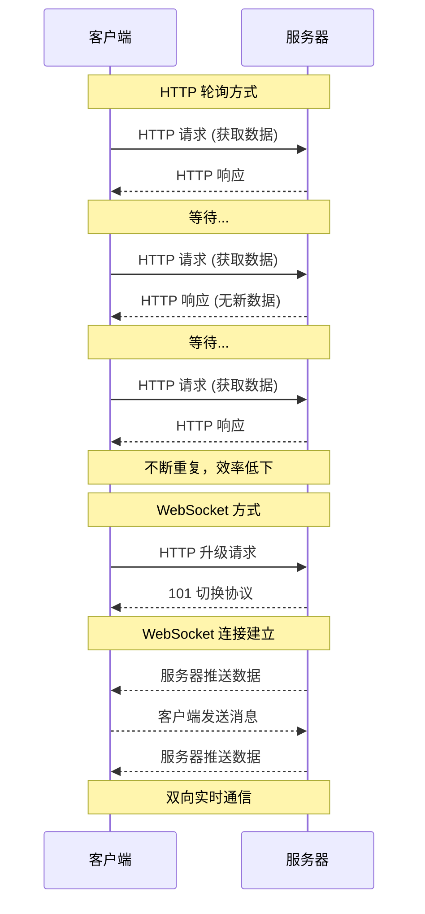
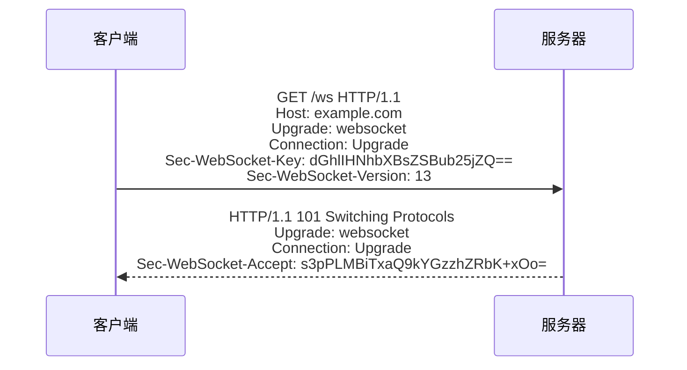

# WebSocket 入门教程

> 本教程介绍 WebSocket 协议的核心概念，并通过 Node.js 实现完整的示例。

## 目录

- [概述](#概述)
- [WebSocket vs HTTP](#websocket-vs-http)
- [协议原理](#协议原理)
- [Node.js 服务端实现](#nodejs-服务端实现)
- [浏览器客户端实现](#浏览器客户端实现)
- [实战：构建实时聊天应用](#实战构建实时聊天应用)
- [最佳实践与安全](#最佳实践与安全)
- [常见问题](#常见问题)

---

## 概述

WebSocket 是一种在单个 TCP 连接上提供全双工通信的协议。它允许服务器主动向客户端推送数据，而无需客户端先发起请求。

### 核心特性

| 特性 | 说明 |
|------|------|
| **全双工通信** | 客户端和服务器可以同时发送消息 |
| **持久连接** | 连接建立后保持打开状态 |
| **低延迟** | 避免了 HTTP 请求/响应开销 |
| **实时性** | 适合需要即时数据更新的应用 |

### 典型应用场景

- 实时聊天应用
- 在线协作工具
- 股票行情推送
- 在线游戏
- 实时通知系统

---

## WebSocket vs HTTP



### 关键区别

| 对比项 | HTTP | WebSocket |
|--------|------|-----------|
| 连接方式 | 短连接，每次请求新建 | 长连接，持久化 |
| 通信方向 | 半双工（请求-响应） | 全双工（双向） |
| 服务器推送 | 不支持（需轮询） | 原生支持 |
| 头部开销 | 每次请求都带完整 Header | 仅首次握手有 Header |
| 适用场景 | RESTful API | 实时应用 |

---

## 协议原理

### 握手过程

WebSocket 连接的建立始于 HTTP 协议的「升级」请求：



### 关键 Header 说明

| Header | 说明 |
|--------|------|
| `Upgrade` | 必须为 `websocket`，表示请求升级协议 |
| `Connection` | 必须为 `Upgrade` |
| `Sec-WebSocket-Key` | 客户端生成的随机 Base64 字符串 |
| `Sec-WebSocket-Version` | 协议版本，当前为 13 |
| `Sec-WebSocket-Accept` | 服务器根据 Key 计算的验证值 |

### 数据帧结构

```
 0                   1                   2                   3
 0 1 2 3 4 5 6 7 8 9 0 1 2 3 4 5 6 7 8 9 0 1 2 3 4 5 6 7 8 9 0 1
+-+-+-+-+-------+-+-------------+-------------------------------+
|F|R|R|R| opcode|M| Payload len |    Extended payload length    |
|I|S|S|S|  (4)  |A|     (7)     |             (16/64)           |
|N|V|V|V|       |S|             |   (if payload len==126/127)   |
| |1|2|3|       |K|             |                               |
+-+-+-+-+-------+-+-------------+ - - - - - - - - - - - - - - - +
|     Extended payload length continued, if payload len == 127  |
+ - - - - - - - - - - - - - - - +-------------------------------+
|                               | Masking-key, if MASK set to 1 |
+-------------------------------+-------------------------------+
| Masking-key (continued)       |          Payload Data         |
+-------------------------------- - - - - - - - - - - - - - - - +
:                     Payload Data continued ...                :
+ - - - - - - - - - - - - - - - - - - - - - - - - - - - - - - - +
|                     Payload Data continued ...                |
+---------------------------------------------------------------+
```

### Opcode 类型

| Opcode | 含义 |
|--------|------|
| 0x0 | 连续帧（Continuation） |
| 0x1 | 文本帧 |
| 0x2 | 二进制帧 |
| 0x8 | 关闭连接 |
| 0x9 | Ping |
| 0xA | Pong |

---

## Node.js 服务端实现

### 使用原生模块（无依赖）

```javascript
// server-basic.js - 基础 WebSocket 服务器
const { createServer } = require('http');
const crypto = require('crypto');

const server = createServer((req, res) => {
  res.writeHead(200, { 'Content-Type': 'text/plain' });
  res.end('普通 HTTP 响应');
});

server.on('upgrade', (req, socket, head) => {
  // 1. 验证是否为 WebSocket 升级请求
  if (req.headers['upgrade'] !== 'websocket') {
    socket.destroy();
    return;
  }

  // 2. 获取并验证 Sec-WebSocket-Key
  const key = req.headers['sec-websocket-key'];
  if (!key) {
    socket.destroy();
    return;
  }

  // 3. 计算 Sec-WebSocket-Accept
  const GUID = '258EAFA5-E914-47DA-95CA-C5AB0DC85B11';
  const acceptKey = crypto
    .createHash('sha1')
    .update(key + GUID)
    .digest('base64');

  // 4. 发送握手响应
  const responseHeaders = [
    'HTTP/1.1 101 Switching Protocols',
    'Upgrade: websocket',
    'Connection: Upgrade',
    `Sec-WebSocket-Accept: ${acceptKey}`,
    '',
    ''
  ].join('\r\n');

  socket.write(responseHeaders);

  // 5. WebSocket 连接已建立，开始处理消息
  socket.on('data', (buffer) => {
    // 解析 WebSocket 帧
    const frame = parseFrame(buffer);
    
    if (frame.opcode === 0x8) {
      // 收到关闭帧
      socket.end();
      return;
    }

    if (frame.opcode === 0x1) {
      // 收到文本消息
      const message = frame.payload.toString('utf8');
      console.log('收到消息:', message);
      
      // 发送响应
      const response = createTextFrame(`服务器收到: ${message}`);
      socket.write(response);
    }
  });
});

// 解析 WebSocket 帧
function parseFrame(buffer) {
  const firstByte = buffer[0];
  const secondByte = buffer[1];
  
  const opcode = firstByte & 0x0f;
  const isMasked = Boolean(secondByte & 0x80);
  let payloadLength = secondByte & 0x7f;
  
  let offset = 2;
  
  // 处理扩展长度
  if (payloadLength === 126) {
    payloadLength = buffer.readUInt16BE(2);
    offset = 4;
  } else if (payloadLength === 127) {
    payloadLength = Number(buffer.readBigUInt64BE(2));
    offset = 10;
  }
  
  // 解码掩码（如果需要）
  let payload = buffer.slice(offset, offset + payloadLength);
  if (isMasked) {
    const mask = buffer.slice(offset - 4, offset);
    payload = Buffer.from(payload.map((byte, i) => byte ^ mask[i % 4]));
  }
  
  return { opcode, payload };
}

// 创建文本帧
function createTextFrame(message) {
  const payload = Buffer.from(message, 'utf8');
  const payloadLength = payload.length;
  
  let frame;
  
  if (payloadLength <= 125) {
    frame = Buffer.alloc(2 + payloadLength);
    frame[0] = 0x81; // FIN + 文本 opcode
    frame[1] = payloadLength;
    payload.copy(frame, 2);
  } else if (payloadLength <= 65535) {
    frame = Buffer.alloc(4 + payloadLength);
    frame[0] = 0x81;
    frame[1] = 126;
    frame.writeUInt16BE(payloadLength, 2);
    payload.copy(frame, 4);
  } else {
    frame = Buffer.alloc(10 + payloadLength);
    frame[0] = 0x81;
    frame[1] = 127;
    frame.writeBigUInt64BE(BigInt(payloadLength), 2);
    payload.copy(frame, 10);
  }
  
  return frame;
});

const PORT = 8080;
server.listen(PORT, () => {
  console.log(`WebSocket 服务器运行在 ws://localhost:${PORT}`);
});
```

### 使用 ws 库（推荐）

`ws` 是最流行的 Node.js WebSocket 库：

```bash
npm install ws
```

```javascript
// server-ws.js - 使用 ws 库的服务器
const { WebSocketServer } = require('ws');

const wss = new WebSocketServer({ port: 8080 });

// 存储所有连接的客户端
const clients = new Set();

wss.on('connection', (ws, req) => {
  console.log('新客户端连接:', req.socket.remoteAddress);
  
  // 添加到客户端集合
  clients.add(ws);
  
  // 发送欢迎消息
  ws.send(JSON.stringify({
    type: 'system',
    message: '欢迎连接到服务器！'
  }));
  
  // 处理消息
  ws.on('message', (data) => {
    const message = data.toString();
    console.log('收到消息:', message);
    
    // 广播给所有客户端
    broadcast(message, ws);
  });
  
  // 处理关闭
  ws.on('close', () => {
    console.log('客户端断开连接');
    clients.delete(ws);
  });
  
  // 处理错误
  ws.on('error', (error) => {
    console.error('WebSocket 错误:', error);
    clients.delete(ws);
  });
});

// 广播消息给所有客户端
function broadcast(message, sender) {
  clients.forEach((client) => {
    if (client !== sender && client.readyState === 1) {
      client.send(message);
    }
  });
}

console.log('WebSocket 服务器运行在 ws://localhost:8080');
```

### 带心跳检测的服务器

```javascript
// server-heartbeat.js - 带心跳检测的服务器
const { WebSocketServer } = require('ws');

const wss = new WebSocketServer({ port: 8080 });

const HEARTBEAT_INTERVAL = 30000; // 30秒
const HEARTBEAT_TIMEOUT = 35000;  // 35秒无响应则断开

// 存储客户端及其心跳状态
const clients = new Map();

function heartbeat() {
  this.isAlive = true;
}

wss.on('connection', (ws) => {
  ws.isAlive = true;
  ws.on('pong', heartbeat);
  
  clients.set(ws, { isAlive: true });
  
  ws.on('message', (data) => {
    const message = data.toString();
    
    // 解析并处理消息
    try {
      const parsed = JSON.parse(message);
      handleMessage(ws, parsed);
    } catch (e) {
      ws.send(JSON.stringify({ error: '无效的 JSON 格式' }));
    }
  });
  
  ws.on('close', () => {
    clients.delete(ws);
  });
});

// 心跳检测间隔
const interval = setInterval(() => {
  wss.clients.forEach((ws) => {
    if (ws.isAlive === false) {
      console.log('终止无响应连接');
      clients.delete(ws);
      return ws.terminate();
    }
    
    ws.isAlive = false;
    ws.ping();
  });
}, HEARTBEAT_INTERVAL);

wss.on('close', () => {
  clearInterval(interval);
});

function handleMessage(ws, message) {
  switch (message.type) {
    case 'ping':
      ws.send(JSON.stringify({ type: 'pong', timestamp: Date.now() }));
      break;
    case 'broadcast':
      broadcast(JSON.stringify({
        type: 'message',
        content: message.content,
        sender: 'anonymous'
      }), ws);
      break;
    default:
      ws.send(JSON.stringify({ type: 'ack', received: message }));
  }
}

function broadcast(message, sender) {
  wss.clients.forEach((client) => {
    if (client !== sender && client.readyState === 1) {
      client.send(message);
    }
  });
}
```

---

## 浏览器客户端实现

### 原生 WebSocket API

```javascript
// client-basic.html
<!DOCTYPE html>
<html lang="zh-CN">
<head>
  <meta charset="UTF-8">
  <title>WebSocket 客户端</title>
  <style>
    #messages {
      border: 1px solid #ccc;
      height: 300px;
      overflow-y: auto;
      padding: 10px;
      margin-bottom: 10px;
    }
    .message { margin: 5px 0; }
    .sent { color: blue; }
    .received { color: green; }
  </style>
</head>
<body>
  <h1>WebSocket 客户端</h1>
  <div id="status">连接状态: 断开</div>
  <div id="messages"></div>
  <input type="text" id="input" placeholder="输入消息..." />
  <button id="send">发送</button>
  <button id="connect">连接</button>
  <button id="disconnect">断开</button>

  <script>
    let ws = null;

    const statusEl = document.getElementById('status');
    const messagesEl = document.getElementById('messages');
    const inputEl = document.getElementById('input');
    const sendBtn = document.getElementById('send');
    const connectBtn = document.getElementById('connect');
    const disconnectBtn = document.getElementById('disconnect');

    function updateStatus(state) {
      const states = {
        0: '连接中',
        1: '已连接',
        2: '正在关闭',
        3: '已关闭'
      };
      statusEl.textContent = `连接状态: ${states[state] || '未知'}`;
    }

    function addMessage(text, type) {
      const div = document.createElement('div');
      div.className = `message ${type}`;
      div.textContent = text;
      messagesEl.appendChild(div);
      messagesEl.scrollTop = messagesEl.scrollHeight;
    }

    function connect() {
      if (ws && ws.readyState === WebSocket.OPEN) {
        addMessage('已经连接', 'system');
        return;
      }

      ws = new WebSocket('ws://localhost:8080');

      ws.onopen = () => {
        updateStatus(ws.readyState);
        addMessage('连接已建立', 'system');
      };

      ws.onmessage = (event) => {
        addMessage(`收到: ${event.data}`, 'received');
      };

      ws.onerror = (error) => {
        addMessage('发生错误', 'error');
        console.error(error);
      };

      ws.onclose = () => {
        updateStatus(ws.readyState);
        addMessage('连接已关闭', 'system');
      };
    }

    function disconnect() {
      if (ws) {
        ws.close();
        ws = null;
      }
    }

    function send() {
      const message = inputEl.value.trim();
      if (!message) return;

      if (ws && ws.readyState === WebSocket.OPEN) {
        ws.send(message);
        addMessage(`发送: ${message}`, 'sent');
        inputEl.value = '';
      } else {
        addMessage('未连接', 'error');
      }
    }

    connectBtn.addEventListener('click', connect);
    disconnectBtn.addEventListener('click', disconnect);
    sendBtn.addEventListener('click', send);
    inputEl.addEventListener('keypress', (e) => {
      if (e.key === 'Enter') send();
    });

    // 页面加载时自动连接
    connect();
  </script>
</body>
</html>
```

### 带重连机制的客户端

```javascript
// client-reconnect.js
class WebSocketClient {
  constructor(url, options = {}) {
    this.url = url;
    this.options = {
      reconnectInterval: options.reconnectInterval || 1000,
      maxReconnectAttempts: options.maxReconnectAttempts || 10,
      ...options
    };
    this.ws = null;
    this.reconnectAttempts = 0;
    this.reconnectTimer = null;
    this.listeners = new Map();
  }

  connect() {
    try {
      this.ws = new WebSocket(this.url);

      this.ws.onopen = () => {
        console.log('连接已建立');
        this.reconnectAttempts = 0;
        this.emit('open');
      };

      this.ws.onmessage = (event) => {
        this.emit('message', event.data);
      };

      this.ws.onerror = (error) => {
        console.error('WebSocket 错误:', error);
        this.emit('error', error);
      };

      this.ws.onclose = () => {
        console.log('连接已关闭');
        this.emit('close');
        this.scheduleReconnect();
      };
    } catch (error) {
      console.error('连接失败:', error);
      this.scheduleReconnect();
    }
  }

  scheduleReconnect() {
    if (this.reconnectAttempts >= this.options.maxReconnectAttempts) {
      console.log('达到最大重连次数');
      this.emit('maxReconnectAttemptsReached');
      return;
    }

    const delay = Math.min(
      this.options.reconnectInterval * Math.pow(2, this.reconnectAttempts),
      30000 // 最大延迟 30 秒
    );

    console.log(`${delay}ms 后尝试重连...`);
    
    this.reconnectTimer = setTimeout(() => {
      this.reconnectAttempts++;
      this.connect();
    }, delay);
  }

  send(data) {
    if (this.ws && this.ws.readyState === WebSocket.OPEN) {
      this.ws.send(typeof data === 'object' ? JSON.stringify(data) : data);
      return true;
    }
    return false;
  }

  close() {
    if (this.reconnectTimer) {
      clearTimeout(this.reconnectTimer);
    }
    if (this.ws) {
      this.ws.close();
    }
  }

  on(event, callback) {
    if (!this.listeners.has(event)) {
      this.listeners.set(event, []);
    }
    this.listeners.get(event).push(callback);
  }

  emit(event, ...args) {
    const callbacks = this.listeners.get(event) || [];
    callbacks.forEach(cb => cb(...args));
  }
}

// 使用示例
const client = new WebSocketClient('ws://localhost:8080', {
  reconnectInterval: 1000,
  maxReconnectAttempts: 5
});

client.on('open', () => console.log('已连接'));
client.on('message', (data) => console.log('收到:', data));
client.on('close', () => console.log('连接关闭'));
client.on('error', (err) => console.error('错误:', err));

client.connect();

// 发送消息
client.send('Hello, Server!');

// 关闭连接
// client.close();
```

---

## 实战：构建实时聊天应用

### 项目结构

```
chat-app/
├── server/
│   ├── package.json
│   └── index.js
├── client/
│   ├── index.html
│   ├── styles.css
│   └── app.js
```

### 服务端实现

```javascript
// chat-app/server/index.js
const { WebSocketServer } = require('ws');
const http = require('http');
const fs = require('fs');
const path = require('path');

const PORT = process.env.PORT || 8080;

// 创建 HTTP 服务器（用于提供静态文件）
const httpServer = http.createServer((req, res) => {
  let filePath = req.url === '/' ? '/index.html' : req.url;
  filePath = path.join(__dirname, '../client', filePath);

  const ext = path.extname(filePath);
  const contentTypes = {
    '.html': 'text/html',
    '.css': 'text/css',
    '.js': 'application/javascript'
  };

  fs.readFile(filePath, (err, content) => {
    if (err) {
      res.writeHead(404);
      res.end('Not Found');
    } else {
      res.writeHead(200, { 'Content-Type': contentTypes[ext] || 'text/plain' });
      res.end(content);
    }
  });
});

// 创建 WebSocket 服务器
const wss = new WebSocketServer({ server: httpServer });

// 聊天室数据结构
const rooms = new Map(); // roomId -> Set of { ws, username }
const users = new Map(); // ws -> { username, roomId }

wss.on('connection', (ws) => {
  console.log('新用户连接');

  ws.on('message', (data) => {
    try {
      const message = JSON.parse(data.toString());
      handleMessage(ws, message);
    } catch (e) {
      ws.send(JSON.stringify({ type: 'error', message: '无效的消息格式' }));
    }
  });

  ws.on('close', () => {
    handleDisconnect(ws);
  });
});

function handleMessage(ws, message) {
  switch (message.type) {
    case 'join':
      handleJoin(ws, message);
      break;
    case 'leave':
      handleLeave(ws);
      break;
    case 'chat':
      handleChat(ws, message);
      break;
    case 'private':
      handlePrivate(ws, message);
      break;
    case 'list':
      handleList(ws);
      break;
  }
}

function handleJoin(ws, message) {
  const { username, roomId = 'general' } = message;
  
  if (!username) {
    ws.send(JSON.stringify({ type: 'error', message: '用户名不能为空' }));
    return;
  }

  // 离开之前的房间
  handleLeave(ws);

  // 加入新房间
  if (!rooms.has(roomId)) {
    rooms.set(roomId, new Set());
  }
  rooms.get(roomId).add(ws);
  users.set(ws, { username, roomId });

  // 发送加入成功消息
  ws.send(JSON.stringify({
    type: 'joined',
    roomId,
    username,
    users: getRoomUsers(roomId)
  }));

  // 广播用户加入消息
  broadcastToRoom(roomId, {
    type: 'system',
    message: `${username} 加入了聊天室`,
    userCount: rooms.get(roomId).size
  }, ws);
}

function handleLeave(ws) {
  const user = users.get(ws);
  if (!user) return;

  const { username, roomId } = user;
  
  if (rooms.has(roomId)) {
    rooms.get(roomId).delete(ws);
    
    // 如果房间空了，删除房间
    if (rooms.get(roomId).size === 0) {
      rooms.delete(roomId);
    } else {
      // 广播用户离开消息
      broadcastToRoom(roomId, {
        type: 'system',
        message: `${username} 离开了聊天室`,
        userCount: rooms.get(roomId).size
      });
    }
  }
  
  users.delete(ws);
}

function handleChat(ws, message) {
  const user = users.get(ws);
  if (!user) {
    ws.send(JSON.stringify({ type: 'error', message: '请先加入聊天室' }));
    return;
  }

  broadcastToRoom(user.roomId, {
    type: 'chat',
    username: user.username,
    content: message.content,
    timestamp: Date.now()
  });
}

function handlePrivate(ws, message) {
  const user = users.get(ws);
  if (!user) {
    ws.send(JSON.stringify({ type: 'error', message: '请先加入聊天室' }));
    return;
  }

  const { to, content } = message;
  
  // 找到目标用户
  let targetWs = null;
  for (const [client, info] of users.entries()) {
    if (info.username === to) {
      targetWs = client;
      break;
    }
  }

  if (!targetWs) {
    ws.send(JSON.stringify({ type: 'error', message: `用户 ${to} 不在线` }));
    return;
  }

  targetWs.send(JSON.stringify({
    type: 'private',
    from: user.username,
    content,
    timestamp: Date.now()
  }));

  // 发送确认
  ws.send(JSON.stringify({
    type: 'privateSent',
    to,
    content,
    timestamp: Date.now()
  }));
}

function handleList(ws) {
  const user = users.get(ws);
  if (!user) {
    ws.send(JSON.stringify({ type: 'error', message: '请先加入聊天室' }));
    return;
  }

  ws.send(JSON.stringify({
    type: 'roomList',
    rooms: Array.from(rooms.keys()),
    currentRoom: user.roomId
  }));
}

function handleDisconnect(ws) {
  handleLeave(ws);
  console.log('用户断开连接');
}

function broadcastToRoom(roomId, message, exclude = null) {
  if (!rooms.has(roomId)) return;

  const data = JSON.stringify(message);
  rooms.get(roomId).forEach((client) => {
    if (client !== exclude && client.readyState === 1) {
      client.send(data);
    }
  });
}

function getRoomUsers(roomId) {
  if (!rooms.has(roomId)) return [];
  return Array.from(rooms.get(roomId))
    .map(ws => users.get(ws)?.username)
    .filter(Boolean);
}

httpServer.listen(PORT, () => {
  console.log(`聊天服务器运行在 http://localhost:${PORT}`);
});
```

### 客户端实现

```html
<!-- chat-app/client/index.html -->
<!DOCTYPE html>
<html lang="zh-CN">
<head>
  <meta charset="UTF-8">
  <meta name="viewport" content="width=device-width, initial-scale=1.0">
  <title>实时聊天室</title>
  <link rel="stylesheet" href="styles.css">
</head>
<body>
  <div class="container">
    <div class="sidebar">
      <h2>聊天室</h2>
      <div class="join-form">
        <input type="text" id="username" placeholder="输入用户名" />
        <button id="joinBtn">加入</button>
      </div>
      <div id="userList" class="user-list"></div>
    </div>
    
    <div class="main">
      <div class="header">
        <h1 id="roomTitle">实时聊天室</h1>
        <span id="userCount">0 人在线</span>
      </div>
      
      <div id="messages" class="messages"></div>
      
      <div class="input-area">
        <input type="text" id="messageInput" placeholder="输入消息..." disabled />
        <button id="sendBtn" disabled>发送</button>
      </div>
    </div>
  </div>
  
  <script src="app.js"></script>
</body>
</html>
```

```css
/* chat-app/client/styles.css */
* {
  box-sizing: border-box;
  margin: 0;
  padding: 0;
}

body {
  font-family: -apple-system, BlinkMacSystemFont, 'Segoe UI', Roboto, sans-serif;
  background: #f5f5f5;
}

.container {
  display: flex;
  height: 100vh;
  max-width: 1200px;
  margin: 0 auto;
}

.sidebar {
  width: 250px;
  background: #2c3e50;
  color: white;
  padding: 20px;
}

.sidebar h2 {
  margin-bottom: 20px;
  font-size: 1.2rem;
}

.join-form {
  display: flex;
  flex-direction: column;
  gap: 10px;
  margin-bottom: 20px;
}

.join-form input {
  padding: 10px;
  border: none;
  border-radius: 4px;
}

.join-form button {
  padding: 10px;
  background: #3498db;
  color: white;
  border: none;
  border-radius: 4px;
  cursor: pointer;
}

.join-form button:hover {
  background: #2980b9;
}

.user-list {
  font-size: 0.9rem;
}

.main {
  flex: 1;
  display: flex;
  flex-direction: column;
  background: white;
}

.header {
  display: flex;
  justify-content: space-between;
  align-items: center;
  padding: 15px 20px;
  background: #34495e;
  color: white;
}

.messages {
  flex: 1;
  padding: 20px;
  overflow-y: auto;
}

.message {
  margin-bottom: 15px;
  padding: 10px;
  border-radius: 8px;
  max-width: 70%;
}

.message.system {
  background: #ecf0f1;
  color: #7f8c8d;
  text-align: center;
  margin: 0 auto 15px;
  font-size: 0.9rem;
}

.message.own {
  background: #3498db;
  color: white;
  margin-left: auto;
}

.message.other {
  background: #ecf0f1;
  color: #2c3e50;
}

.message .meta {
  font-size: 0.75rem;
  opacity: 0.7;
  margin-bottom: 5px;
}

.message.private {
  border: 2px solid #e74c3c;
}

.input-area {
  display: flex;
  padding: 15px;
  border-top: 1px solid #ddd;
}

.input-area input {
  flex: 1;
  padding: 10px 15px;
  border: 1px solid #ddd;
  border-radius: 4px;
  margin-right: 10px;
}

.input-area button {
  padding: 10px 20px;
  background: #3498db;
  color: white;
  border: none;
  border-radius: 4px;
  cursor: pointer;
}

.input-area button:disabled {
  background: #bdc3c7;
  cursor: not-allowed;
}
```

```javascript
// chat-app/client/app.js
class ChatClient {
  constructor() {
    this.ws = null;
    this.connected = false;
    this.username = null;
    
    this.initElements();
    this.bindEvents();
  }

  initElements() {
    this.elements = {
      username: document.getElementById('username'),
      joinBtn: document.getElementById('joinBtn'),
      messages: document.getElementById('messages'),
      messageInput: document.getElementById('messageInput'),
      sendBtn: document.getElementById('sendBtn'),
      roomTitle: document.getElementById('roomTitle'),
      userCount: document.getElementById('userCount'),
      userList: document.getElementById('userList')
    };
  }

  bindEvents() {
    this.elements.joinBtn.addEventListener('click', () => this.join());
    this.elements.sendBtn.addEventListener('click', () => this.send());
    this.elements.messageInput.addEventListener('keypress', (e) => {
      if (e.key === 'Enter') this.send();
    });
  }

  connect() {
    return new Promise((resolve, reject) => {
      this.ws = new WebSocket('ws://localhost:8080');

      this.ws.onopen = () => {
        this.connected = true;
        resolve();
      };

      this.ws.onmessage = (event) => {
        const message = JSON.parse(event.data);
        this.handleMessage(message);
      };

      this.ws.onerror = (error) => {
        console.error('WebSocket 错误:', error);
        reject(error);
      };

      this.ws.onclose = () => {
        this.connected = false;
        this.showSystemMessage('连接已断开');
        this.elements.joinBtn.textContent = '重新连接';
      };
    });
  }

  async join() {
    const username = this.elements.username.value.trim();
    if (!username) {
      alert('请输入用户名');
      return;
    }

    if (!this.connected) {
      try {
        await this.connect();
      } catch (e) {
        alert('连接服务器失败');
        return;
      }
    }

    this.username = username;
    this.send({
      type: 'join',
      username: this.username,
      roomId: 'general'
    });
  }

  send(data) {
    if (this.ws && this.ws.readyState === WebSocket.OPEN) {
      this.ws.send(JSON.stringify(data));
      return true;
    }
    return false;
  }

  handleMessage(message) {
    switch (message.type) {
      case 'joined':
        this.onJoined(message);
        break;
      case 'system':
        this.showSystemMessage(message.message);
        this.updateUserCount(message.userCount);
        break;
      case 'chat':
        this.showChatMessage(message);
        break;
      case 'private':
        this.showPrivateMessage(message);
        break;
      case 'privateSent':
        this.showSystemMessage(`私信已发送给 ${message.to}`);
        break;
      case 'error':
        alert(message.message);
        break;
    }
  }

  onJoined(message) {
    this.elements.username.disabled = true;
    this.elements.joinBtn.disabled = true;
    this.elements.joinBtn.textContent = '已加入';
    this.elements.messageInput.disabled = false;
    this.elements.sendBtn.disabled = false;
    this.elements.messageInput.focus();
    
    this.updateUserList(message.users);
    this.showSystemMessage(`欢迎 ${this.username}！`);
  }

  sendMessage() {
    const content = this.elements.messageInput.value.trim();
    if (!content) return;

    this.send({
      type: 'chat',
      content
    });

    this.showOwnMessage(content);
    this.elements.messageInput.value = '';
  }

  showSystemMessage(text) {
    const div = document.createElement('div');
    div.className = 'message system';
    div.textContent = text;
    this.elements.messages.appendChild(div);
    this.scrollToBottom();
  }

  showChatMessage(message) {
    const isOwn = message.username === this.username;
    const div = document.createElement('div');
    div.className = `message ${isOwn ? 'own' : 'other'}`;
    div.innerHTML = `
      <div class="meta">${message.username} · ${new Date(message.timestamp).toLocaleTimeString()}</div>
      <div>${this.escapeHtml(message.content)}</div>
    `;
    this.elements.messages.appendChild(div);
    this.scrollToBottom();
  }

  showPrivateMessage(message) {
    const div = document.createElement('div');
    div.className = 'message other private';
    div.innerHTML = `
      <div class="meta">私聊 - ${message.from} · ${new Date(message.timestamp).toLocaleTimeString()}</div>
      <div>${this.escapeHtml(message.content)}</div>
    `;
    this.elements.messages.appendChild(div);
    this.scrollToBottom();
  }

  showOwnMessage(content) {
    const div = document.createElement('div');
    div.className = 'message own';
    div.innerHTML = `
      <div class="meta">${this.username} · ${new Date().toLocaleTimeString()}</div>
      <div>${this.escapeHtml(content)}</div>
    `;
    this.elements.messages.appendChild(div);
    this.scrollToBottom();
  }

  updateUserCount(count) {
    this.elements.userCount.textContent = `${count} 人在线`;
  }

  updateUserList(users) {
    this.elements.userList.innerHTML = users
      .map(u => `<div class="user">${u}${u === this.username ? ' (你)' : ''}</div>`)
      .join('');
  }

  scrollToBottom() {
    this.elements.messages.scrollTop = this.elements.messages.scrollHeight;
  }

  escapeHtml(text) {
    const div = document.createElement('div');
    div.textContent = text;
    return div.innerHTML;
  }
}

// 初始化聊天客户端
const chat = new ChatClient();
```

### 运行项目

```bash
# 进入服务器目录
cd chat-app/server

# 初始化项目
npm init -y
npm install ws

# 启动服务器
node index.js
```

然后在浏览器中打开 `http://localhost:8080` 即可体验聊天室。

---

## 最佳实践与安全

### 连接管理

```javascript
// 最佳实践：限制连接数
const MAX_CONNECTIONS = 100;

wss.on('connection', (ws, req) => {
  if (wss.clients.size >= MAX_CONNECTIONS) {
    ws.close(1001, '服务器已满');
    return;
  }
  
  // 添加连接超时
  ws.isAlive = true;
  ws.on('pong', () => { ws.isAlive = true; });
  
  // 设置关闭超时
  ws.terminateTimeout = setTimeout(() => {
    if (ws.readyState === WebSocket.CONNECTING) {
      ws.terminate();
    }
  }, 10000);
  
  ws.on('open', () => {
    clearTimeout(ws.terminateTimeout);
  });
});
```

### 安全考虑

```javascript
// 1. 验证 Origin
wss.on('connection', (ws, req) => {
  const origin = req.headers.origin;
  const allowedOrigins = ['http://localhost:3000', 'https://example.com'];
  
  if (!allowedOrigins.includes(origin)) {
    ws.close(1008, '不允许的来源');
    return;
  }
});

// 2. 限制消息大小
const MAX_MESSAGE_SIZE = 64 * 1024; // 64KB

ws.on('message', (data) => {
  if (data.length > MAX_MESSAGE_SIZE) {
    ws.close(1009, '消息过大');
    return;
  }
  // 处理消息...
});

// 3. 清理用户输入
function sanitize(input) {
  return input
    .replace(/[<>]/g, '') // 移除 HTML 标签
    .substring(0, 1000);   // 限制长度
}
```

### 性能优化

```javascript
// 1. 使用压缩
const { WebSocketServer } = require('ws');
const { createServer } = require('https');
const { readFileSync } = require('fs');

// 对于需要压缩的场景，考虑使用 ws 库的 permessage-deflate
const wss = new WebSocketServer({ 
  server: createServer({
    cert: readFileSync('/path/to/cert.pem'),
    key: readFileSync('/path/to/key.pem')
  }),
  // 启用压缩
  webSocketServer: 'WS'
});

// 2. 消息批处理
const messageQueue = new Map();
const BATCH_INTERVAL = 50;

function queueMessage(ws, message) {
  if (!messageQueue.has(ws)) {
    messageQueue.set(ws, []);
  }
  messageQueue.get(ws).push(message);
  
  // 定期发送批量消息
  setTimeout(() => {
    const messages = messageQueue.get(ws);
    if (messages && ws.readyState === WebSocket.OPEN) {
      ws.send(JSON.stringify({ batch: messages }));
      messageQueue.delete(ws);
    }
  }, BATCH_INTERVAL);
}

// 3. 优雅关闭
async function gracefulShutdown() {
  console.log('开始关闭服务器...');
  
  // 通知所有客户端
  wss.clients.forEach((client) => {
    client.send(JSON.stringify({ type: 'shutdown', message: '服务器即将关闭' }));
    client.close(1001, '服务器维护');
  });
  
  // 等待一段时间让客户端关闭
  await new Promise(resolve => setTimeout(resolve, 5000));
  
  // 强制关闭剩余连接
  wss.close();
  process.exit(0);
}
```

### 生产环境部署

```javascript
// 使用 Nginx 作为反向代理（chat-app/server/nginx.conf）
/*
upstream websocket_backend {
    server 127.0.0.1:8080;
}

server {
    listen 443 ssl;
    server_name example.com;

    ssl_certificate /path/to/cert.pem;
    ssl_certificate_key /path/to/key.pem;

    location / {
        proxy_pass http://websocket_backend;
        proxy_http_version 1.1;
        proxy_set_header Upgrade $http_upgrade;
        proxy_set_header Connection "upgrade";
        proxy_set_header Host $host;
        proxy_set_header X-Real-IP $remote_addr;
        proxy_read_timeout 86400;
    }
}
*/
```

---

## 常见问题

### Q1: WebSocket 和 Socket.io 有什么区别？

| 特性 | WebSocket | Socket.io |
|------|-----------|-----------|
| 协议 | 原生协议 | 封装了多种传输方式 |
| 兼容性 | 现代浏览器 | 所有浏览器（包括 IE） |
| 自动重连 | 需要手动实现 | 内置支持 |
| 房间/命名空间 | 需要手动实现 | 内置支持 |
| 体积 | 无额外依赖 | 需要引入库 |

### Q2: 如何调试 WebSocket？

1. **浏览器开发者工具**：Chrome DevTools → Network → WS 选项卡
2. **在线测试工具**：如 [WebSocket King Client](https://websocketking.com)
3. **命令行工具**：`wscat`

   ```bash
   npm install -g wscat
   wscat -c ws://localhost:8080
   ```

### Q3: 如何处理 CORS 问题？

服务端配置（以 ws 库为例）：

```javascript
const { WebSocketServer } = require('ws');

const wss = new WebSocketServer({ 
  port: 8080,
  verifyClient: (info, done) => {
    const origin = info.req.headers.origin;
    // 验证 origin
    done(origin === 'http://localhost:3000');
  }
});
```

### Q4: 如何让 WebSocket 通过 HTTPS/WSS 访问？

```javascript
const https = require('https');
const { WebSocketServer } = require('ws');
const fs = require('fs');

const server = https.createServer({
  cert: fs.readFileSync('/path/to/fullchain.pem'),
  key: fs.readFileSync('/path/to/privkey.pem')
});

const wss = new WebSocketServer({ server });

// 客户端使用 wss://
const ws = new WebSocket('wss://example.com/ws');
```

### Q5: 如何实现心跳检测？

```javascript
// 服务端
const HEARTBEAT_INTERVAL = 30000;

wss.on('connection', (ws) => {
  ws.isAlive = true;
  
  ws.on('pong', () => { ws.isAlive = true; });
});

setInterval(() => {
  wss.clients.forEach((ws) => {
    if (ws.isAlive === false) {
      ws.terminate();
      return;
    }
    ws.isAlive = false;
    ws.ping();
  });
}, HEARTBEAT_INTERVAL);

// 客户端
setInterval(() => {
  if (ws.readyState === WebSocket.OPEN) {
    ws.send(JSON.stringify({ type: 'ping' }));
  }
}, 30000);
```

---

## 参考资源

- [WebSocket 协议规范 (RFC 6455)](https://tools.ietf.org/html/rfc6455)
- [MDN WebSocket 文档](https://developer.mozilla.org/zh-CN/docs/Web/API/WebSocket)
- [ws 库文档](https://github.com/websockets/ws)

---

*最后更新：2024年*
