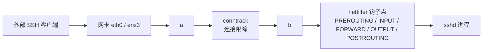
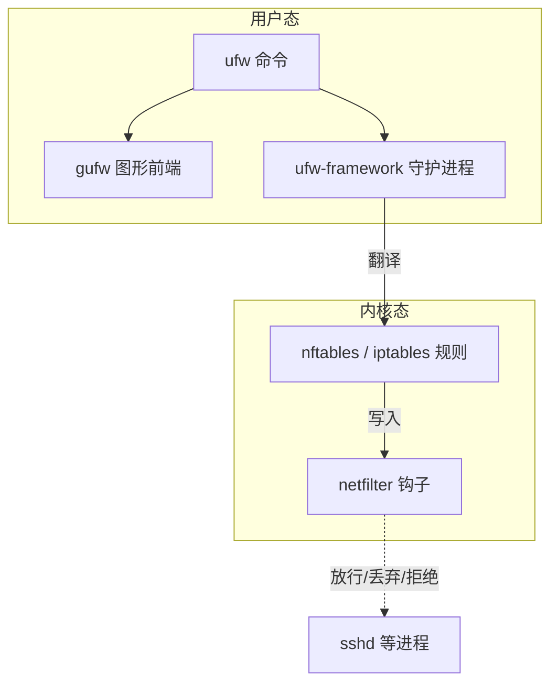
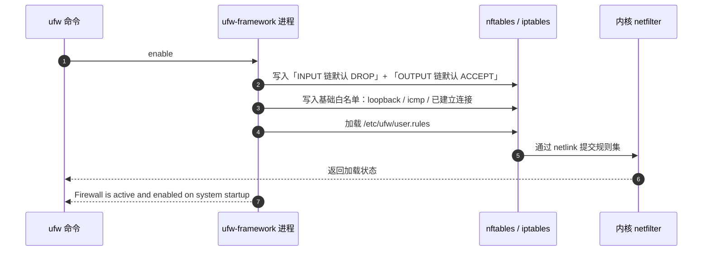
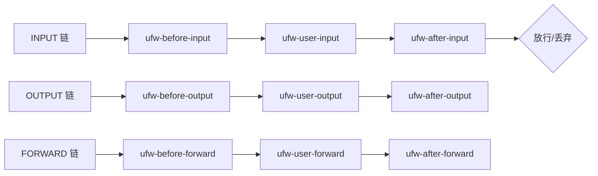
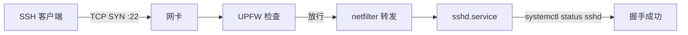

# Linux ufw 防火墙原理、配置与操作实战 —— 以 sshd 为例

> 本文从「为什么需要防火墙」讲到「ufw 命令的真实底层」，再以「正确开放 sshd 端口并阻断一切其他流量」为主线，把 UFW 的默认行为、规则编写、应用集成、日志、容器/云环境注意事项一次性讲清。Ubuntu/Debian 系必读，其它发行版思路通用。

## 一、先讲清楚：ufw 是什么、不是什么

### 1.1 网络层的位置

一台跑着 sshd 的服务器，外面连接进来时，数据包会经过这条链路：



- **netfilter**：Linux 内核里的流量处理框架，在 5 个 hook 点拦截数据包。
- **iptables / nftables**：用户面工具，向 netfilter 写入规则。
- **ufw（Uncomplicated Firewall）**：iptables（早期）/ nftables（Ubuntu 22.04+ 默认）的**一个上层包装器**，目标是「让 Ubuntu 默认能用、最少命令开防火墙」。

关系图：



### 1.2 为什么不要直接写 iptables

ufw 的存在不是为了限制能力，**而是为了避免你写出下面这种坑货规则**：

```bash
# 经典错误：清空 INPUT 默认策略后忘了设置回 DROP，又执行了下面这条
iptables -F
# 结果：服务器瞬间失联，要去机房插显示器
```

ufw 把这些坑封装成「**默认拒绝所有入站 + 显式 allow 才放行**」的范式，强制你思考白名单。

### 1.3 适用边界

| 场景                                | 是否推荐用 ufw        |
| ----------------------------------- | --------------------- |
| 个人 Ubuntu/Debian 桌面 / VPS        | ✅ 强烈推荐            |
| 小型团队服务器（云厂商已配安全组）   | ✅ 可用，组合云上安全组 |
| 高并发生产环境、复杂 NAT、QoS       | ❌ 直接用 nftables    |
| 仅暴露 1-2 个端口的家庭 NAS        | ✅ 完美匹配            |

> 一台云服务器上**通常 ufw + 云厂商安全组双层防护**：安全组是大边界（防整个子网），ufw 是机内精细控制。

## 二、工作原理：ufw 是怎么影响流量的

### 2.1 启动时做了什么

```bash
sudo ufw enable
```

执行流程：



`ufw-framework` 是一个常驻 Python 进程（不是守护服务）。**真正干活的是内核里的 netfilter**，ufw 只是「规则生成器」。

### 2.2 默认策略

ufw 装好后**默认关闭**，第一次 `enable` 会同时写入默认策略：

```bash
sudo ufw status verbose
# Status: active
# Logging: on (low)
# Default: deny (incoming), allow (outgoing), disabled (routed)
# New profiles: skip
```

四组默认行为：

| 方向        | 默认策略              | 含义                                |
| ----------- | --------------------- | ----------------------------------- |
| `incoming`  | `deny`（丢弃不响应）  | 没被允许的入站都丢 |
| `outgoing`  | `allow`               | 出站全放（默认信任自己）|
| `routed`    | `disabled`            | 转发流量不处理（默认不开 IP 转发） |
| `applied`   | —                     | 仅当「Default policy 已应用」时显示 |

> **关键点**：`deny` 是「**drop**」（静默丢弃，不回 RST/ICMP），`reject` 才是「**拒绝并回包**」。对攻击者更友好的是 deny（少给信息），对运维更友好的是 reject（连不上立刻知道是端口关）。生产建议保持默认 `deny`。

### 2.3 规则链结构

ufw 生成的所有 iptables/nftables 规则，会插到一组**自己专用的链**里：



你用 `ufw allow` 加的规则，**全部写入 `ufw-user-input` 这一段**。`ufw-before-*` 是 ufw 内置的安全规则（established/related 放行、loopback 放行、常见攻击防护），`ufw-after-*` 通常空着供高级用户加 drop 兜底。

> 看一眼实际生成结果就能秒懂：
>
> ```bash
> sudo iptables -L ufw-user-input -n -v   # iptables 后端
> sudo nft list chain inet ufw user-input  # nftables 后端（Ubuntu 22.04+）
> ```

### 2.4 后端切换：iptables → nftables

Ubuntu 22.04 起，ufw 默认改用 **nftables** 后端。判断当前用哪个：

```bash
sudo ufw status
# 如果提示「ERROR: /lib/ufw/ufw-init-scripts ...」
# 多半是 /etc/ufw/ufw.conf 里 BACKEND 不匹配

cat /etc/ufw/ufw.conf | grep -i backend
# Backend=nftables
```

两种后端**对用户几乎无差异**——`ufw allow 22` 的命令语法一样，区别只在内核里的规则格式和性能。如果你的脚本里调用 `iptables`/`ip6tables` 直接读规则，记得 nftables 模式下要在 `nft` 里查。

## 三、配置文件全景

### 3.1 配置文件结构

```mermaid
flowchart TB
    subgraph etc[/etc 下的 ufw 目录]
        A[ufw.conf] -->|主开关 + 日志级别| X[总控制]
        C[sysctl.conf] -->|IP 转发等内核参数| X
        D[ufw.before.init] -->|rules 加载前| X
        E[ufw.after.init] -->|rules 加载后| X
    end
    subgraph rules[/etc/ufw/rules.d/]
        R1[user.rules 维护中的规则]
        R2[user6.rules IPv6 版]
        R3[before.rules 预处理规则]
        R4[after.rules 后置规则]
    end
    subgraph apps[/etc/ufw/applications.d/]
        P1[ssh.profile OpenSSH]
        P2[Nginx profile]
        P3[自定义 .profile]
    end
```

### 3.2 主配置：`/etc/ufw/ufw.conf`

```ini
ENABLED=yes                 # 是否开机启用
LOGLEVEL=low                # 日志级别：off/low/medium/high/full
POLICY_INCOMING=DROP        # 默认入站：drop/reject/accept
POLICY_OUTGOING=ACCEPT      # 默认出站
POLICY_ROUTED=DISABLED      # 默认转发
DEFAULT_INPUT_POLICY=""     # 兼容字段，留空
DEFAULT_OUTPUT_POLICY=""
DEFAULT_FORWARD_POLICY=""
DEFAULT_APPLICATION_POLICY=""
IPT_SYSCTL=/etc/ufw/sysctl.conf
IPT_MODULES="nf_conntrack_ftp nf_nat_ftp nf_conntrack_netbios_ns"
BACKEND=nftables            # iptables 或 nftables
```

> 关键点：**用 `ufw default <direction> <policy>` 命令改默认值，不要直接改这个文件**，否则下次 `ufw reload` 会被覆盖。

### 3.3 规则文件：`/etc/ufw/user.rules`

这是 ufw **真正持久化的规则位置**，格式与 iptables-restore 兼容（nftables 模式则是 nftables 格式）。**不要手改这个文件**——用 `ufw` 命令改，否则下次 reload 你的手动编辑会被 ufw 重写。

可以用 `cat /etc/ufw/user.rules` 看 ufw 把你的命令翻译成什么样：

```bash
### tuple ### allow tcp 22 0.0.0.0/0 any 0.0.0.0/0 in
-A ufw-user-input -p tcp --dport 22 -j ACCEPT
```

### 3.4 应用集成：`/etc/ufw/applications.d/*.profile`

ufw 最优雅的设计之一：**按服务名而不是端口号开规则**。这样 sshd 从 22 改成 2222 时，你不用回去改防火墙。

查看内置的 OpenSSH profile：

```bash
cat /etc/ufw/applications.d/openssh-server
# [OpenSSH]
# title=Secure shell server
# description=OpenSSH is a secure shell server
# ports=22/tcp
# 1301/tcp 是 OpenSSH Ubuntu 增强版，部分发行版会有

sudo ufw app list
# Available applications:
#   OpenSSH
#   Nginx Full
#   Nginx HTTP
#   Nginx HTTPS
```

`ufw allow OpenSSH` 等价于 `ufw allow 22/tcp`，但更**语义化且会随包升级自动更新端口**。

## 四、操作实战（围绕 sshd）

### 4.1 环境假设

- OS：Ubuntu 24.04 LTS（ufw 0.36+，nftables 后端）
- 服务：`openssh-server`，默认 22 端口
- 操作账号：root 或 sudo

### 4.2 安装与初始化

```bash
# 大多数 Ubuntu 默认装了
sudo apt install ufw

# 检查版本 & 状态
sudo ufw version
sudo ufw status verbose   # 装好后默认 inactive
```

### 4.3 经典开局五步

**核心原则：先放行 SSH，再 enable，最后关其它。**反着做 = 立刻被锁。

```bash
# 第 1 步：先开 SSH（不然 enable 之后你就连不进来了！）
sudo ufw allow OpenSSH

# 第 2 步：如果你改了 sshd 端口（比如 2222），不要用 app 名，直接开端口
sudo ufw allow 2222/tcp

# 第 3 步：enable（此时默认入站 DROP 已生效，但 SSH 已经在白名单）
sudo ufw enable
# 会有交互确认：[Y]es / [N]o

# 第 4 步：验证当前规则
sudo ufw status numbered
#      To                         Action      From
#      --                         ------      ----
# [ 1] OpenSSH                    ALLOW IN    Anywhere
# [ 2] 2222/tcp                   ALLOW IN    Anywhere
# [ 3] OpenSSH (v6)               ALLOW IN    Anywhere (v6)

# 第 5 步：把 SSH 限制到指定来源 IP（强烈推荐家庭/固定 IP）
sudo ufw delete 2                                  # 先删掉太宽的 2222 规则
sudo ufw allow from 203.0.113.10 to any port 2222 proto tcp
```

> ⚠️ **永远在另一个会话保持 SSH 连接，并测试从新窗口能否登录，再确认关闭当前会话**。云服务器上要先去控制台准备 VNC/串口控制。

### 4.4 规则语法速查

```bash
# 1. 简单放行
ufw allow 22                  # tcp/udp 都放（不推荐）
ufw allow 22/tcp              # ✅ 推荐，明确协议
ufw allow OpenSSH             # 按应用名

# 2. 按来源限制
ufw allow from 192.168.1.0/24 to any port 22
ufw allow from 203.0.113.10   # 仅该 IP 全部端口

# 3. 端口范围
ufw allow 6000:6007/tcp

# 4. 拒绝
ufw deny 23                   # 拒绝 23/tcp 入站
ufw reject 23                 # reject 显式拒绝并回包

# 5. 删除规则（两种方式）
sudo ufw status numbered      # 找到编号
sudo ufw delete 3             # 按编号删
sudo ufw delete allow 22/tcp  # 按语法删

# 6. 插入到指定位置
sudo ufw insert 1 deny from 203.0.113.99  # 在最前面插一条拒

# 7. 默认策略
sudo ufw default deny incoming
sudo ufw default allow outgoing
sudo ufw default reject routed   # 转发流量全部 REJECT

# 8. 重置 / 禁用
sudo ufw reset                # ⚠️ 删除全部规则，谨慎
sudo ufw disable              # 关闭防火墙（规则保留）
```

### 4.5 按 IP 限速（防 SSH 暴破）

```bash
sudo ufw limit OpenSSH
# 等价于最近 30 秒最多 6 次新连接，常用于防端口扫描
```

或者更精细：

```bash
sudo ufw limit 22/tcp
# iptables 翻译结果里你能看到它用了 recent 模块
```

### 4.6 日志配置

ufw 把命中规则的包写入 syslog（`/var/log/ufw.log` 或 kern.log）：

```bash
# 查看日志级别
sudo ufw status verbose | grep Logging

# 调高日志级别（排查时很有用）
sudo ufw logging medium

# 实时跟踪拒绝的连接
sudo tail -f /var/log/ufw.log
# [UFW BLOCK] IN=eth0 OUT= MAC=... SRC=203.0.113.66 DST=198.51.100.10
#   LEN=60 TOS=0x00 TTL=51 ID=12345 PROTO=TCP SPT=54321 DPT=22 WINDOW=29200 RES=0x00 SYN URGP=0
```

日志级别：

| 级别  | 含义                                |
| ----- | ----------------------------------- |
| off   | 不记                                |
| low   | 记被阻断的包（默认）                |
| medium| + 记无效包、SPAM、NEW 连接        |
| high  | + 记所有速率限制的包               |
| full  | + 记速率限制通过的所有包（很吵）   |

排查 SSH 连不上时，把日志调到 `medium` 然后让客户端重连一次，能立刻看出包是「被阻断」还是「没到达」。

### 4.7 自定义应用 profile

如果你的 sshd 改了端口，让 OpenSSH profile 跟着更新是个好习惯：

```bash
sudo nano /etc/ufw/applications.d/openssh-server
```

```ini
[OpenSSH]
title=Secure shell server
description=OpenSSH is a secure shell server
ports=2222/tcp
```

```bash
sudo ufw app update OpenSSH    # 强制刷新
sudo ufw app info OpenSSH      # 验证新端口已生效
```

更激进的做法：**给生产 sshd 起一个独立 profile**，避免和默认 OpenSSH 混在一起：

```ini
# /etc/ufw/applications.d/sshd-prod
[SSHD-Prod]
title=Production SSH
description=Non-default port SSH for production
ports=2222/tcp
```

```bash
sudo ufw allow SSHD-Prod
```

### 4.8 进阶：使用 `before.rules` 加自定义链

`/etc/ufw/before.rules` 是**最先生效**的规则表（加载在 ufw 内置白名单之前）。典型用法：内网端口透出、VPN 规则。

例如：让 ufw 启动前先允许 WireGuard：

```bash
sudo nano /etc/ufw/before.rules
```

```
*filter
:ufw-before-input - [0:0]
:ufw-before-output - [0:0]

# 在 COMMIT 之前插入
-A ufw-before-input -p udp --dport 51820 -j ACCEPT

COMMIT
```

```bash
sudo ufw reload
```

> 风险提示：`before.rules` 改坏了很容易锁机，**必须留备用控制台**再操作。

## 五、与 systemd sshd 的协作关系

把 ufw 和上一讲的 systemctl 放到一起看，理解它们在 SSH 场景里各自的角色：



| 层次    | 工具            | 关心的问题                          |
| ------- | --------------- | ----------------------------------- |
| 流量入口 | ufw             | 谁**能到达**这台机器的端口          |
| 服务管控 | systemctl       | sshd **是否在运行**                 |
| 业务配置 | sshd_config     | 端口、认证方式、算法等              |

四层独立意味着你可以：

- `systemctl stop sshd` 但保留防火墙开 → 别人 TCP 端口通了但 SSH 握手失败。
- ufw deny 22 但 sshd 在跑 → 端口连不上（最常见）。
- systemctl restart sshd 但 ufw 关了 → 安全降级，要立刻补回来。

## 六、故障排查清单

### 6.1 `ufw: ERROR: /etc/ufw/ufw.conf line N: bad value`

通常是 `BACKEND=` 字段配错。**Ubuntu 22.04 默认是 nftables**，18.04 是 iptables。混用包管理器安装会出问题。

```bash
# 看下内核支持的子系统
sudo ufw --version
sudo cat /etc/ufw/ufw.conf | grep BACKEND

# 强制重置一次
sudo ufw reset
sudo ufw enable
```

### 6.2 「明明 allow 了，为什么连不上？」

按这个顺序排查：

```bash
# 1. ufw 状态确认规则生效
sudo ufw status verbose

# 2. ufw 日志看包到底去哪了
sudo ufw logging medium
sudo tail -f /var/log/ufw.log &
# 让客户端重连一次
# 看是否有 [UFW BLOCK] 含 DPT=22

# 3. sshd 自身监听了吗
sudo systemctl status sshd
sudo ss -tlnp | grep :22

# 4. 是不是云厂商安全组也拦了（独立于 ufw）
# 在云控制台检查「入站规则」是否包含 22/2222

# 5. 是不是 listen 在 127.0.0.1 而不是 0.0.0.0
sudo ss -tlnp | grep sshd
# Address: 127.0.0.1 是 sshd 配置 ListenAddress 限制
```

### 6.3 SSH 偶发超时 / 慢

- 客户端先 `ufw status numbered` 看是否规则被插入到 deny 之后（顺序很重要）。
- 检查 `ufw limit` 是否在某种网络抖动下误杀合法连接（改回 `allow`）。
- 大流量环境（日志级别 high/full）可能影响 conntrack —— 调回 low。

### 6.4 IPv6 不通

```bash
# 1. IPv6 没启用内核
cat /proc/sys/net/ipv6/conf/all/disable_ipv6
# 0 = 启用，1 = 禁用

# 2. ufw 没启用 v6
sudo nano /etc/ufw/ufw.conf
# IPV6=yes

sudo ufw reload

# 3. 规则只加了 v4
# ufw allow 22/tcp 会自动加 v4 + v6，但如果用 from 限制，要分开写
sudo ufw allow from 2001:db8::/32 to any port 22 proto tcp
```

### 6.5 容器 / 容器化部署中无效

Docker 默认用 iptables 直接操作 netfilter，**会绕过 ufw**。这是有名的「UFW 已开但 Docker 端口全暴露」问题。

**最简解法**：改 Docker 用 `--iptables=false`（要求手动管理 docker 网络的端口转发）或用 Docker 24+ 的 ufw 集成：

```bash
sudo nano /etc/ufw/after.rules
```

在 COMMIT 前加：

```
*filter
:DOCKER-USER - [0:0]
-A DOCKER-USER -j RETURN -s 10.0.0.0/8
-A DOCKER-USER -j RETURN -s 172.16.0.0/12
-A DOCKER-USER -j RETURN -s 192.168.0.0/16
-A DOCKER-USER -j ufw-user-input
-A DOCKER-USER -j RETURN -j DROP
COMMIT
```

```bash
sudo ufw reload
sudo systemctl restart docker
```

> **生产环境永远别用 `--iptables=true` + 默认配置 + ufw** —— 它们抢 netfilter 规则会互相打架。

## 七、常用命令速查表

```bash
# 状态
ufw status                          # 简化输出
ufw status verbose                  # 含默认策略 + 日志级别
ufw status numbered                 # 带编号（删除/插入用）
ufw show raw                          # 看翻译后的 iptables/nftables 规则

# 开关
ufw enable                          # 启用
ufw disable                         # 关闭（规则保留）
ufw reload                          # 重新加载（修改配置后用）
ufw reset                           # ⚠️ 清空所有规则

# 规则增删
ufw allow <port>/<proto>
ufw deny <port>
ufw reject <port>
ufw allow from <ip> to any port <port>
ufw limit <port>
ufw delete <num|rule>
ufw insert <num> <rule>
ufw status numbered                  # 先列出编号再 delete

# 默认策略
ufw default deny incoming
ufw default allow outgoing
ufw default reject routed

# 应用 profile
ufw app list
ufw app info <name>
ufw allow <name>
ufw app update <name>

# 日志
ufw logging off|low|medium|high|full
tail -f /var/log/ufw.log
```

## 八、一张图总结

```mermaid
flowchart TB
    subgraph 你（用户态）
        A[ufw 命令] -->|解析| B[Python ufw-framework]
        B -->|写规则| C[/etc/ufw/user.rules]
        B -->|执行| D[iptables-restore / nft -f]
    end
    subgraph 内核（netfilter）
        D -->|通过 netlink| E[nftables / iptables 内核模块]
        E -->|匹配| F{规则匹配?}
        F -->|DROP| G[静默丢弃]
        F -->|REJECT| H[回 RST/ICMP]
        F -->|ACCEPT| I[交付给 sshd 等进程]
    end
    subgraph 持久化
        C -->|下次 reload| B
    end
    subgraph 日志
        G -->|LOG 目标| KLOG[/var/log/ufw.log/]
        H --> KLOG
        I -->|正常日志| SL[/var/log/auth.log/]
    end
```

完整链路：**敲 `ufw allow OpenSSH` → ufw-framework 解析 → 写入 `/etc/ufw/user.rules` → 调用 nft/iptables-restore 翻译 → 提交到内核 → 内核在 `ufw-user-input` 链上插一条 ACCEPT → 后续 22/tcp 进入时直接放行 → 同时被阻断的包按 LOG 级别写入 `/var/log/ufw.log`**。

---

## 附录：与 systemd sshd 教程的对照阅读

| 主题                | 对应章节                            |
| ------------------- | ----------------------------------- |
| sshd 服务管控       | 《Linux systemctl 教程》第四节       |
| 端口冲突 / 监听检查 | 《Linux systemctl 教程》第六节 6.1  |
| 容器内 systemd 与 ufw 共同失效 | 本教程第六节 6.5       |

## 推荐阅读

- `man ufw`、`ufw --help`、`ufw app update --help`
- Ubuntu Server Guide: <https://ubuntu.com/server/docs/security-firewall>
- nftables 官方 wiki: <https://wiki.nftables.org/>
- Docker + ufw 解决方案：<https://github.com/chaifeng/ufw-docker>
