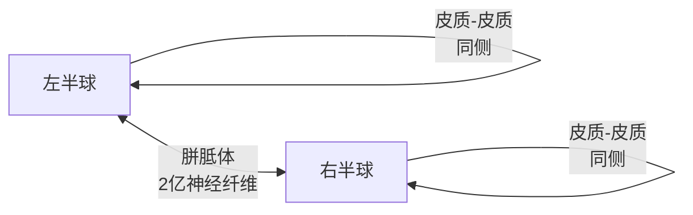
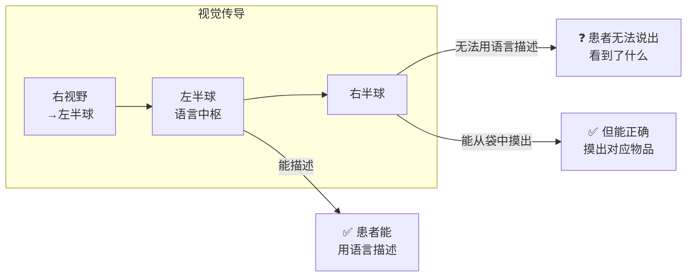
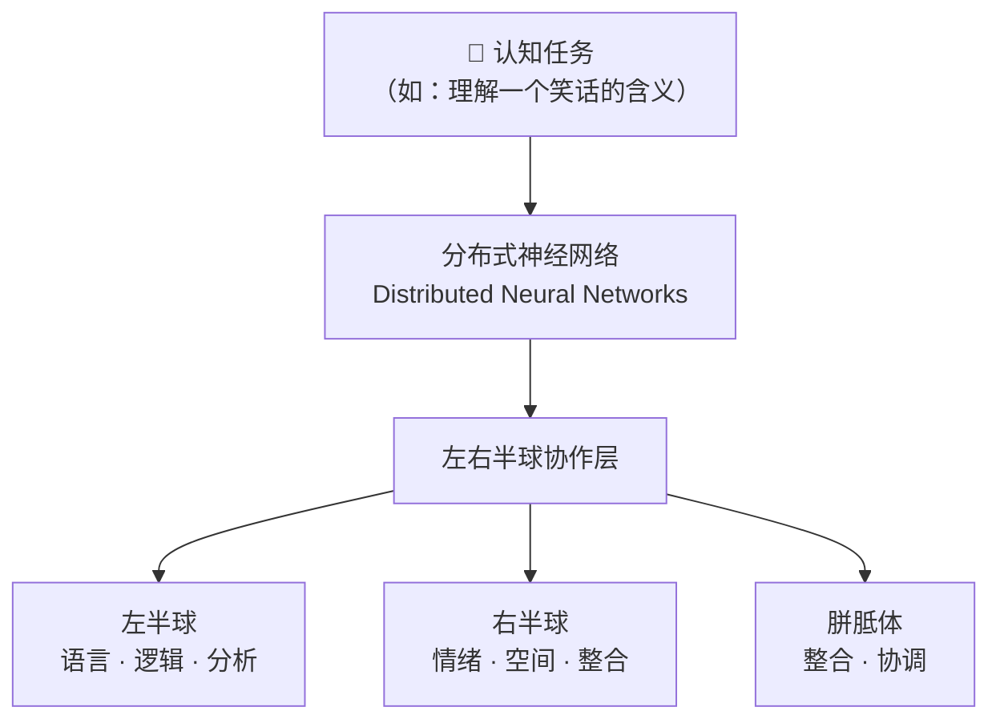

# 大脑左右半球：分工与协作

> 🧠 本笔记基于 Roger Sperry 裂脑实验研究（1981诺贝尔奖）、fMRI 大样本研究（n=1011, 2013）、PNAS 功能偏侧化研究等多项科学文献的综合调研。

---

## 一、神经解剖学基础

### 胼胝体（Corpus Callosum）——两侧桥梁

| 结构 | 描述 |
|------|------|
| **胼胝体** | 大脑最大的连合纤维束，约含 **2亿条** 神经纤维，连接左右半球 |
| **功能** | 传递感官、运动、高级认知信息，实现半球间协调 |
| **历史误解** | 1936年 Walter Dandy 认为"切断后无任何症状"，后被 Sperry 证伪 |

### 半球间信息通路



- **半球内连接（intrahemispheric）**：同侧区域间的通讯
- **半球间连接（interhemispheric）**：跨半球的信息传递

---

## 二、功能偏侧化（Brain Lateralization）

### 2.1 左半球主导的功能

| 功能 | 关键脑区 | 说明 |
|------|---------|------|
| **语言产生** | Broca区 | 言语生成、语法加工 |
| **语言理解** | Wernicke区 | 语义理解 |
| **逻辑分析** | 前额叶（左侧） | 顺序处理、线性推理 |
| **数学计算** | 顶内沟（左侧） | 精确运算 |
| **右手控制** | 初级运动皮层 | 约90%的人右利手 |

### 2.2 右半球主导的功能

| 功能 | 关键脑区 | 说明 |
|------|---------|------|
| **空间注意** | 顶叶（右侧） | 注意力定向 |
| **面孔识别** | 梭状回（右侧） | 面孔加工 |
| **情绪识别** | 杏仁核（右侧） | 负性情绪、恐惧表情 |
| **整体整合** | 多个区域 | 立体思维、模式识别 |

### 2.3 情绪处理的半球差异

| 情绪类型 | 主导半球 | 证据 |
|---------|---------|------|
| **负性情绪**（恐惧、悲伤） | 右半球 | 右侧杏仁核激活更强 |
| **正性情绪**（快乐、乐观） | 左半球 | 左半球额叶激活 |
| **临床证据** | — | 左额叶损伤→抑郁；右额叶损伤→欣快/不当愉悦 |

---

## 三、经典研究：裂脑实验（Split Brain）

> [!quote] Roger Sperry 的开创性工作（1959-1981）
> 通过对接受**胼胝体切断术（commissurotomy）**的癫痫患者进行研究，揭示了左右半球可独立运作。

### 3.1 经典实验设计



### 3.2 核心发现

| 发现 | 说明 |
|------|------|
| **左半球主导** | 语言、言语、逻辑分析、顺序处理 |
| **右半球独立能力** | 空间视觉、非言语情绪理解、模式识别 |
| **惊人发现** | 右半球也具有一定语言理解能力（阅读、理解简单指令） |
| **双重意识** | 切断后每侧半球可独立运作，产生"两个意识"的哲学争议 |

> [!success] 1981年诺贝尔奖
> Roger Sperry 因此获 **1981年诺贝尔生理学或医学奖**

---

## 四、现代神经影像研究（fMRI/PET）

### 4.1 犹他大学大样本研究（2013，n=1011）

> 📌 **扫描7,000个脑区，未发现个体层面存在"全脑偏侧化"证据**

| 结论 | 说明 |
|------|------|
| "左脑人"/"右脑人" | 不存在——是比喻，不是解剖学事实 |
| 偏侧化是局部的 | 仅限于特定功能区，不是整个半球 |

### 4.2 PNAS 研究：两种偏侧化形式

| 偏侧化类型 | 左半球特点 | 右半球特点 |
|-----------|-----------|-----------|
| **分离化（Segregation）** | 偏好半球内通讯 | — |
| **整合化（Integration）** | — | 偏好双侧通讯 |

> 💡 右半球对半球间连接有更强的偏好，解释了为何它在整合双侧信息中更有效。

---

## 五、"左脑理性、右脑创意"流行观念的真相

> [!warning] 已被证伪的流行观念

| ❌ 流行说法 | ✅ 科学事实 |
|-----------|-----------|
| "左脑人理性，右脑人创意" | 功能偏侧化是**局部的**，非全脑性 |
| "创造力全部来自右脑" | 创意依赖**分布式网络**（默认模式网络DMN） |
| "右半球=艺术，左半球=逻辑" | 艺术家创作时同样激活左半球（分析、规划） |

> [!tip] 有科学依据的事实

| ✅ 事实 | 说明 |
|-----|------|
| 某些功能确实偏侧化 | 语言主要在左半球，面孔识别主要在右半球 |
| 偏侧化程度因人而异 | 约90%右利手者左半球语言优势；左利手者变异更大 |
| 偏侧化随发育成熟 | 4-6岁儿童语言激活双侧，青春期后逐渐左化 |
| **协作优于单侧** | 数学天才青少年的半球间协作更好，而非单侧更强 |

---

## 六、半球间协作机制

### 协作的三层架构



### 协作的关键发现

- **数学天才**的大脑中，两个半球的**协作更好**，而非某一侧更强
- **神经可塑性**：一侧受损，另一侧可部分代偿
- **亚胼胝体通路**：天生无胼胝体者，仍有**皮层下通路**实现半球间信息传递

---

## 七、核心结论

> [!important] 六大核心结论

1. **功能确实偏侧化，但程度是局部的，非全脑性**
2. **语言主要在左半球，空间/情绪主要在右半球**
3. **没有"左脑人"或"右脑人"——每个人都需要两个半球协作**
4. **创造力依赖分布式网络，而非单独右半球**
5. **胼胝体是半球整合的关键；切断后每侧可独立运作**
6. **偏侧化随年龄增长而增强，但协作始终必要**

### 核心 Takeaway

```
大脑左右半球的分工是真实的（语言↔空间、逻辑↔整合），
但"左脑人理性、右脑人创意"是过度简化的 neuromyth。

真实的大脑是一个高度整合的系统，
最强的认知能力来自两个半球的无缝协作，
而非某一半球的单打独斗。
```

---

## 📚 参考来源

1. Sperry, R.W. (1981). **Nobel Lecture** — Cerebral Lateralization
2. Nielsen, J.A. et al. (2013). *PLOS ONE* — 左脑vs右脑假说的功能性连接MRI评估
3. Gotts, S.J. et al. (2013). *PNAS* — 人类大脑两种不同的功能偏侧化形式
4. Dana Foundation — "Right Brain, Left Brain: A Misnomer"
5. Harvard Health — "Right brain/left brain, right?"
6. PMC3897366 — "Left Brain, Right Brain: Facts and Fantasies"

---

标签: #神经科学 #认知科学 #大脑偏侧化 #Sperry #裂脑实验 #胼胝体
