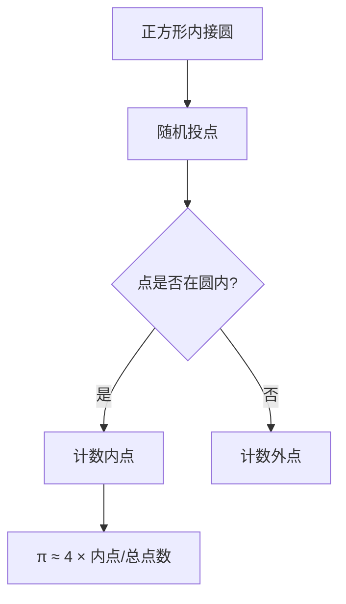

# 蒙特卡洛算法与应用

## 概述

蒙特卡洛方法（Monte Carlo Method）是一类基于随机抽样的计算算法，通过使用随机数来解决计算问题。其核心思想是利用随机采样来获得数值结果，广泛应用于物理、金融、工程、统计学等领域[^1]。

该方法的名字来源于摩纳哥的蒙特卡洛赌场，因为赌博与随机性密切相关。二战期间，Stanislaw Ulam 和 John von Neumann 在核武器研究中使用这种方法进行了开创性工作[^2]。

## 蒙特卡洛方法的基本原理

### 核心思想

蒙特卡洛方法的基本思想可以用一个经典例子说明：**估算圆周率 $\pi$**。



```python
import random

def estimate_pi(n_samples):
    """用蒙特卡洛方法估算圆周率"""
    inside_circle = 0

    for _ in range(n_samples):
        x = random.uniform(-1, 1)
        y = random.uniform(-1, 1)
        # 判断点是否在单位圆内
        if x**2 + y**2 <= 1:
            inside_circle += 1

    # 圆的面积/正方形面积 = π/4
    return 4 * inside_circle / n_samples

# 测试
for n in [100, 1000, 10000, 100000, 1000000]:
    print(f"样本数={n:>10}: π ≈ {estimate_pi(n):.6f}")
```

输出示例：
```
样本数=       100: π ≈ 3.120000
样本数=      1000: π ≈ 3.148000
样本数=     10000: π ≈ 3.141200
样本数=    100000: π ≈ 3.141512
样本数=   1000000: π ≈ 3.141592
```

### 大数定律

蒙特卡洛方法的数学基础是**大数定律**：当样本数量足够大时，样本均值趋近于期望值。

$$
\bar{X}_n = \frac{1}{n}\sum_{i=1}^{n} X_i \xrightarrow{n \to \infty} E[X]
$$

### 收敛性

蒙特卡洛方法的**标准误差**：

$$
SE = \frac{\sigma}{\sqrt{n}}
$$

其中 $\sigma$ 是样本标准差，$n$ 是样本数量。这意味着要提高一位精度（将误差减半），需要增加4倍的样本量[^1]。

## 随机数生成

### 伪随机数生成器

计算机使用**伪随机数生成器（PPRNG）**产生随机数序列。

```python
# Python 随机数生成
import random

# [0, 1) 均匀分布
random.random()

# 指定范围内的均匀分布
random.uniform(a, b)

# 正态分布（高斯分布）
random.gauss(mu=0, sigma=1)

# 指数分布
random.expovariate(lambd=1)
```

### 随机种子

设置种子可以复现结果：

```python
random.seed(42)  # 固定种子
print(random.random())  # 每次运行输出相同
```

### 高级随机数生成

```python
# NumPy 的随机数生成（更高效）
import numpy as np

# 设置全局种子
np.random.seed(42)

# 生成随机数组
arr = np.random.rand(1000)        # 均匀分布
arr = np.random.randn(1000)        # 标准正态分布
arr = np.random.randint(0, 10, 100)  # 整数均匀分布

# 随机选择
choices = np.random.choice(data, size=10, replace=False)
```

## 蒙特卡洛积分

### 基本积分方法

对于难以解析积分的函数，可以使用蒙特卡洛方法近似计算。

$$
I = \int_a^b f(x) dx
$$

**均值估计法**：

```python
def mc_integrate(f, a, b, n):
    """蒙特卡洛积分 - 均值估计法"""
    x = np.random.uniform(a, b, n)
    return (b - a) * np.mean(f(x))

# 示例：计算 ∫₀¹ x² dx = 1/3
result = mc_integrate(lambda x: x**2, 0, 1, 100000)
print(f"∫₀¹ x² dx ≈ {result:.6f}")  # 理论值: 0.333333
```

### 重要性采样

重要性采样（Importance Sampling）通过选择更"重要"的采样区域来提高效率。

```python
def mc_integrate_importance(f, n):
    """使用指数分布作为建议分布的重要性采样"""
    # 从指数分布采样
    x = np.random.exponential(scale=1, size=n)

    # 计算权重（似然比）
    weights = np.exp(-x)  # exp(x)/exp(x) 简化

    # 加权平均
    return np.mean(weights * f(x))

# 示例
result = mc_integrate_importance(lambda x: x * np.exp(-x), 100000)
print(f"结果: {result:.6f}")
```

### 方差缩减技术

| 技术 | 原理 | 效率提升 |
|------|------|----------|
| 对偶变量 | 使用负相关的随机数 | 显著 |
| 分层采样 | 将区域分层后采样 | 中等 |
| 控制变量 | 使用相关变量的已知期望 | 中等 |
| 重要性采样 | 聚焦高方差区域 | 取决于建议分布 |

```python
def mc_with_antithetic(f, a, b, n):
    """对偶变量法"""
    # 生成两个负相关的样本
    u = np.random.uniform(0, 1, n // 2)
    x1 = a + (b - a) * u
    x2 = a + (b - a) * (1 - u)

    # 平均两个估计
    return (b - a) * np.mean((f(x1) + f(x2)) / 2)
```

## 蒙特卡洛优化

### 模拟退火

模拟退火（Simulated Annealing）是一种全局优化算法，受金属退火过程启发[^3]。

```python
import math

def simulated_annealing(objective, bounds, n_iter=1000, temp=1000, cool=0.95):
    """
    模拟退火算法
    objective: 目标函数（最小化）
    bounds: [(min, max), ...] 变量边界
    """
    best = None
    current = None

    for i in range(n_iter):
        if current is None:
            # 初始化
            current = [random.uniform(b[0], b[1]) for b in bounds]
            best = current[:]
        else:
            # 生成邻域解
            candidate = []
            for j, (val, (low, high)) in enumerate(zip(current, bounds)):
                # 在当前解附近随机扰动
                delta = random.gauss(0, temp / 100)
                new_val = val + delta
                new_val = max(low, min(high, new_val))
                candidate.append(new_val)

            # 计算能量差
            current_energy = objective(current)
            candidate_energy = objective(candidate)
            delta_e = candidate_energy - current_energy

            # 接受准则
            if delta_e < 0 or random.random() < math.exp(-delta_e / temp):
                current = candidate
                if candidate_energy < objective(best):
                    best = candidate

        # 降温
        temp *= cool

    return best, objective(best)

# 示例：求解 Rastrigrin 函数最小值
def rastrigrin(x):
    return 10 * len(x) + sum(xi**2 - 10 * math.cos(2 * math.pi * xi) for xi in x)

# 运行
bounds = [(-5.12, 5.12)] * 2
solution, value = simulated_annealing(rastrigrin, bounds)
print(f"最优解: x={solution[0]:.4f}, y={solution[1]:.4f}")
print(f"函数值: {value:.4f}")
```

### 马尔可夫链蒙特卡洛（MCMC）

MCMC 是一类从复杂概率分布中抽样的算法[^4]。

#### Metropolis-Hastings 算法

```python
def metropolis_hastings(target, proposal_std=1, n_samples=10000):
    """
    Metropolis-Hastings MCMC 采样
    target: 目标分布（未归一化）
    """
    samples = []
    current = random.gauss(0, 1)

    for _ in range(n_samples):
        # 提议分布（正态分布）
        proposal = current + random.gauss(0, proposal_std)

        # 计算接受率
        acceptance = min(1, target(proposal) / target(current))

        # 接受或拒绝
        if random.random() < acceptance:
            current = proposal

        samples.append(current)

    return np.array(samples)

# 示例：从标准正态分布采样
samples = metropolis_hastings(lambda x: math.exp(-x**2 / 2))

import matplotlib.pyplot as plt
plt.hist(samples, bins=50, density=True, alpha=0.7)
plt.xlabel('x')
plt.ylabel('Density')
plt.title('MCMC Sampling from Standard Normal')
plt.savefig('mcmc_sampling.png', dpi=150)
```

#### Gibbs 采样

当可以计算条件分布时，使用 Gibbs 采样。

## 金融应用

### 期权定价

蒙特卡洛方法在金融工程中广泛应用，尤其适用于复杂期权的定价[^5]。

```python
import numpy as np

def black_scholes_call(S, K, T, r, sigma):
    """Black-Scholes 解析解"""
    from scipy.stats import norm
    d1 = (np.log(S / K) + (r + sigma**2 / 2) * T) / (sigma * np.sqrt(T))
    d2 = d1 - sigma * np.sqrt(T)
    return S * norm.cdf(d1) - K * np.exp(-r * T) * norm.cdf(d2)

def monte_carlo_option(S, K, T, r, sigma, n_paths=100000):
    """
    蒙特卡洛期权定价
    几何布朗运动模拟
    """
    # 模拟多个路径
    dt = T / 252  # 交易日
    Z = np.random.standard_normal(n_paths)
    ST = S * np.exp((r - sigma**2 / 2) * T + sigma * np.sqrt(T) * Z)

    # 计算看涨期权 payoff
    payoffs = np.maximum(ST - K, 0)

    # 折现到现值
    price = np.exp(-r * T) * np.mean(payoffs)

    # 标准误差
    se = np.exp(-r * T) * np.std(payoffs) / np.sqrt(n_paths)

    return price, se

# 参数
S, K, T, r, sigma = 100, 105, 1, 0.05, 0.2

# 比较两种方法
bs_price = black_scholes_call(S, K, T, r, sigma)
mc_price, se = monte_carlo_option(S, K, T, r, sigma)

print(f"Black-Scholes 价格: {bs_price:.4f}")
print(f"蒙特卡洛价格: {mc_price:.4f} ± {1.96*se:.4f} (95% CI)")
```

### 风险评估（VaR）

**Value at Risk** 使用蒙特卡洛模拟计算。

```python
def calculate_var(returns, portfolio_value, confidence=0.95, horizon=10):
    """
    蒙特卡洛 VaR 计算
    returns: 历史收益率数据
    portfolio_value: 组合当前价值
    """
    # 计算收益率统计量
    mu = np.mean(returns)
    sigma = np.std(returns)

    # 模拟未来收益
    n_simulations = 100000
    future_returns = np.random.normal(mu * horizon, sigma * np.sqrt(horizon), n_simulations)

    # 计算组合损失
    portfolio_losses = portfolio_value * (1 - np.exp(future_returns))

    # VaR 是损失分布的分位数
    var = np.percentile(portfolio_losses, (1 - confidence) * 100)

    return var

# 示例
np.random.seed(42)
returns = np.random.normal(0.0005, 0.02, 252)  # 日收益率
var_95 = calculate_var(returns, 1000000, confidence=0.95)
print(f"95% VaR (1天): ${var_95:,.2f}")
```

### 亚式期权

亚式期权的 payoff 取决于整个路径的平均价格：

```python
def monte_carlo_asian_option(S, K, T, r, sigma, n_paths=50000, n_steps=252):
    """
    蒙特卡洛亚式期权定价
    平均价格看涨期权
    """
    dt = T / n_steps

    # 存储每条路径的平均价格
    path_averages = []

    for _ in range(n_paths):
        price = S
        price_sum = 0

        for _ in range(n_steps):
            Z = random.gauss(0, 1)
            price = price * np.exp((r - sigma**2 / 2) * dt + sigma * np.sqrt(dt) * Z)
            price_sum += price

        # 算术平均
        avg_price = price_sum / n_steps
        path_averages.append(max(avg_price - K, 0))

    # 折现
    price = np.exp(-r * T) * np.mean(path_averages)
    se = np.exp(-r * T) * np.std(path_averages) / np.sqrt(n_paths)

    return price, se

# 运行
price, se = monte_carlo_asian_option(100, 100, 1, 0.05, 0.2)
print(f"亚式期权价格: {price:.4f} ± {1.96*se:.4f}")
```

## 物理模拟应用

### 粒子输运模拟

蒙特卡洛方法最初用于核武器研究中的中子输运模拟[^2]。

```python
def simulate_neutron_transport(n_particles=10000, wall_thickness=1.0):
    """
    简化的中子穿透模拟
    """
    transmitted = 0
    absorbed = 0

    for _ in range(n_particles):
        x = 0  # 初始位置
        alive = True

        while alive:
            # 自由程（指数分布）
            mean_free_path = 0.5
            l = np.random.exponential(mean_free_path)
            x += l

            if x < 0:
                # 从背面逃逸
                break
            elif x > wall_thickness:
                # 从正面穿透
                transmitted += 1
                break

            # 吸收概率
            absorption_prob = 0.1
            if random.random() < absorption_prob:
                absorbed += 1
                break

            # 散射方向随机
            # 继续循环

    return transmitted / n_particles, absorbed / n_particles

trans, absorb = simulate_neutron_transport()
print(f"穿透率: {trans:.4f}, 吸收率: {absorb:.4f}")
```

### 伊辛模型

使用蒙特卡洛模拟二维伊辛模型（相变研究）：

```python
def ising_model(L=20, n_steps=100000, temperature=2.27):
    """
    二维伊辛模型的 Metropolis 算法
    """
    # 初始化（随机自旋）
    spins = np.random.choice([-1, 1], size=(L, L))

    # 预计算常数
    beta = 1 / temperature

    for _ in range(n_steps):
        # 随机选择一个格点
        i, j = np.random.randint(0, L, 2)

        # 计算能量变化
        delta_E = 2 * spins[i, j] * (
            spins[(i-1) % L, j] + spins[(i+1) % L, j] +
            spins[i, (j-1) % L] + spins[i, (j+1) % L]
        )

        # Metropolis 接受准则
        if delta_E < 0 or random.random() < math.exp(-beta * delta_E):
            spins[i, j] *= -1

    return spins

# 可视化
spins = ising_model(L=50, temperature=2.0)
plt.figure(figsize=(8, 8))
plt.imshow(spins, cmap='binary')
plt.title('2D Ising Model - Monte Carlo Simulation')
plt.savefig('ising_model.png', dpi=150)
```

## 统计学应用

### Bootstrap 置信区间

```python
def bootstrap_ci(data, statistic_func, n_bootstrap=10000, confidence=0.95):
    """
    Bootstrap 置信区间
    """
    n = len(data)
    bootstrap_stats = []

    for _ in range(n_bootstrap):
        # 有放回抽样
        sample = np.random.choice(data, size=n, replace=True)
        bootstrap_stats.append(statistic_func(sample))

    # 计算置信区间
    alpha = 1 - confidence
    lower = np.percentile(bootstrap_stats, alpha / 2 * 100)
    upper = np.percentile(bootstrap_stats, (1 - alpha / 2) * 100)

    return lower, upper

# 示例：估计中位数的置信区间
data = np.random.exponential(scale=2, size=100)
lower, upper = bootstrap_ci(data, np.median)
print(f"中位数 95% CI: [{lower:.2f}, {upper:.2f}]")
```

### 贝叶斯推断

MCMC 用于贝叶斯后验采样：

```python
def bayesian_inference(data, n_samples=10000):
    """
    简化的贝叶斯推断示例
    假设 data ~ Normal(mu, sigma)，推断 mu
    """
    # 先验参数
    mu_prior_mean = 0
    mu_prior_std = 10
    sigma_known = 1

    samples = []
    current_mu = 0

    for _ in range(n_samples):
        # 提议
        proposal_mu = current_mu + random.gauss(0, 0.5)

        # 计算后验比
        prior_ratio = math.exp(-(proposal_mu**2 - current_mu**2) / (2 * mu_prior_std**2))
        likelihood_ratio = np.exp(
            -np.sum((data - proposal_mu)**2 - (data - current_mu)**2) / (2 * sigma_known**2)
        )

        acceptance = min(1, prior_ratio * likelihood_ratio)

        if random.random() < acceptance:
            current_mu = proposal_mu

        samples.append(current_mu)

    return np.array(samples)

# 示例
data = np.random.normal(loc=5, scale=1, size=50)
samples = bayesian_inference(data)
print(f"mu 的后验均值: {np.mean(samples):.4f}")
print(f"mu 的后验标准差: {np.std(samples):.4f}")
```

## 算法复杂度分析

| 问题规模 | 计算量 | 精度 (标准误差) |
|----------|--------|----------------|
| n 个样本 | O(n) | O(1/√n) |
| d 维积分 | O(n) | O(1/√n) |
| d 维优化 | 指数级 | 取决于算法 |

蒙特卡洛方法的**维度无关性**是其相对于格子方法的主要优势。对于高维问题，格子方法的计算量随维度指数增长，而蒙特卡洛方法保持 O(1/√n) 的收敛速度[^1]。

## Python 实践指南

### NumPy 矢量化的蒙特卡洛

```python
import numpy as np

def vectorized_mc_pi(n):
    """向量化版本 - 更快"""
    # 一次性生成所有点
    x = np.random.uniform(-1, 1, n)
    y = np.random.uniform(-1, 1, n)

    # 判断是否在圆内
    inside = x**2 + y**2 <= 1

    return 4 * np.sum(inside) / n

# 性能对比
import time
n = 10_000_000

start = time.time()
result = vectorized_mc_pi(n)
elapsed = time.time() - start

print(f"向量化版本: {result:.6f}, 耗时: {elapsed:.4f}s")
```

### 并行化蒙特卡洛

```python
from concurrent.futures import ProcessPoolExecutor
import multiprocessing

def parallel_mc_pi(n, n_workers=None):
    """并行蒙特卡洛"""
    if n_workers is None:
        n_workers = multiprocessing.cpu_count()

    # 分割任务
    chunk_size = n // n_workers
    results = []

    with ProcessPoolExecutor(max_workers=n_workers) as executor:
        futures = [executor.submit(vectorized_mc_pi, chunk_size)
                   for _ in range(n_workers)]
        results = [f.result() for f in futures]

    return np.mean(results)

# 使用所有 CPU 核心
result = parallel_mc_pi(10_000_000)
print(f"并行结果: {result:.6f}")
```

## 蒙特卡洛方法的优缺点

### 优点

1. **维度无关性**：收敛速度不受问题维度影响
2. **灵活性**：适用于任意复杂的功能和约束
3. **随机性**：天然适合随机系统的模拟
4. **易于实现**：核心算法简单直观
5. **可并行化**：各次采样相互独立

### 缺点

1. **收敛速度慢**：标准误差 O(1/√n)
2. **精度限制**：难以获得高精度结果
3. **随机误差**：结果带有统计波动
4. **调试困难**：随机性使结果难以复现

## 总结

蒙特卡洛方法是一类强大而灵活的数值计算技术。其核心思想——利用随机抽样来获得数值结果——看似简单，却能解决从圆周率计算到金融衍生品定价的广泛应用问题[^1][^2][^5]。

关键要点：

1. **大数定律**是蒙特卡洛方法的数学基础
2. **方差缩减技术**可以显著提高效率
3. **MCMC** 拓展了方法在贝叶斯统计中的应用
4. **向量化**和**并行化**是处理大规模模拟的关键
5. 在**高维问题**上，蒙特卡洛方法优于确定性网格方法

随着计算能力的提升，蒙特卡洛方法的应用范围将继续扩大，特别是在金融工程、物理模拟、数据科学等领域。

## 参考资料

[^1]: Metropolis, N., & Ulam, S. (1949). The Monte Carlo Method. *Journal of the American Statistical Association*, 44(247), 335-341.

[^2]: Eckhardt, R. (1987). Stanislaw Ulam, John von Neumann, and the Monte Carlo Method. *Los Alamos Science*, 15, 131-137.

[^3]: Kirkpatrick, S., Gelatt, C. D., & Vecchi, M. P. (1983). Optimization by Simulated Annealing. *Science*, 220(4598), 671-680.

[^4]: Hastings, W. K. (1970). Monte Carlo Sampling Methods Using Markov Chains and Their Applications. *Biometrika*, 57(1), 97-109.

[^5]: Boyle, P. P. (1977). Options: A Monte Carlo Approach. *Journal of Financial Economics*, 4(3), 323-338.

---

*文档创建日期：2026-04-17*
