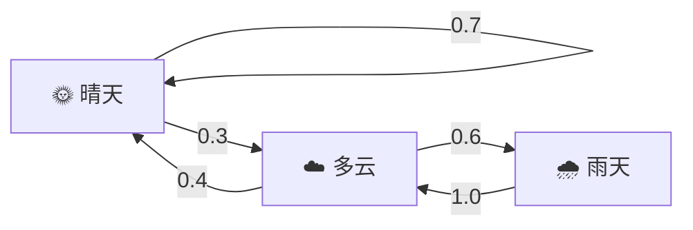
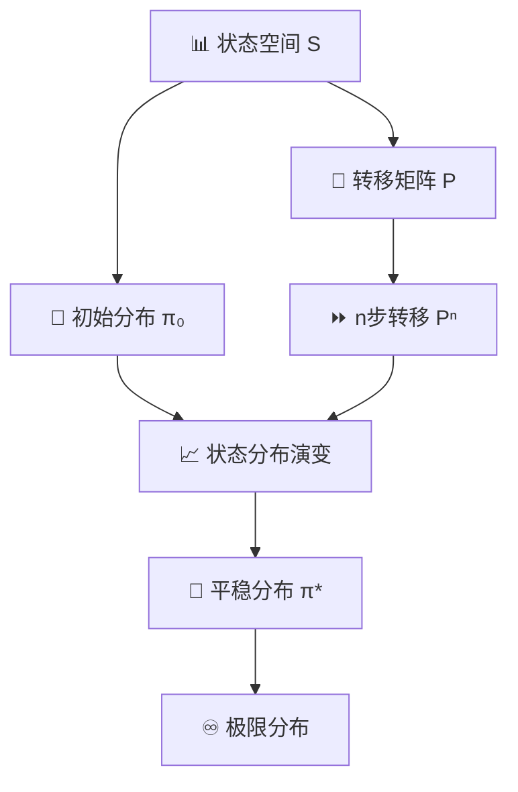

# 马尔可夫链（Markov Chain）完全指南

## 概述

马尔可夫链是概率论与统计学中最重要的概念之一，广泛应用于自然语言处理、金融建模、搜索引擎排名等领域。本教程将带你从基础概念出发，逐步深入理解马尔可夫链的原理，并通过 Python 代码实现经典应用。

## 一、什么是马尔可夫链

### 1.1 马尔可夫性质

马尔可夫链的核心是**马尔可夫性质（Markov Property）**，也称为"无记忆性"或"无后效性"：

> **在给定当前状态的条件下，未来状态的概率分布仅依赖于当前状态，而与过去的状态无关。**

用数学语言表示：对任意 $n$ 和任意状态序列 $i_0, i_1, \ldots, i_n, i_{n+1}$，有：

$$P(X_{n+1}=i_{n+1} | X_0=i_0, X_1=i_1, \ldots, X_n=i_n) = P(X_{n+1}=i_{n+1} | X_n=i_n)$$

这意味着：要预测下一个状态，只需要知道当前状态，不需要了解整个历史。

### 1.2 马尔可夫链的定义

若随机序列 $\{X_n: n \geq 0\}$ 满足马尔可夫性质，则称其为**马尔可夫链（Markov Chain）**。

马尔可夫链包含以下关键元素：

| 元素 | 说明 |
|------|------|
| **状态空间（State Space）** | 所有可能状态的集合，记为 $S = \{s_1, s_2, \ldots\}$ |
| **状态转移（Transition）** | 从当前状态到下一个状态的变化 |
| **转移概率（Transition Probability）** | 从状态 $i$ 转移到状态 $j$ 的概率 $p_{ij}$ |

### 1.3 直观理解

想象天气预测：

```
🌞 晴天 → ☁️ 多云（概率 0.3）→ 🌧️ 雨天（概率 0.6）
   ↓ 0.7
🌞 晴天（概率保持）
```

如果你想知道明天是否下雨，只需要知道今天是什么天气（当前状态），而不需要知道昨天、前天甚至一周前的天气。这就是马尔可夫性质在现实中的直观体现。

## 二、转移矩阵

### 2.1 一步转移概率矩阵

设马尔可夫链有 $n$ 个状态，则**转移矩阵** $P$ 是一个 $n \times n$ 的矩阵：

$$P = \begin{pmatrix} p_{11} & p_{12} & \cdots & p_{1n} \\ p_{21} & p_{22} & \cdots & p_{2n} \\ \vdots & \vdots & \ddots & \vdots \\ p_{n1} & p_{n2} & \cdots & p_{nn} \end{pmatrix}$$

其中 $p_{ij} = P(X_{n+1}=j | X_n=i)$，表示从状态 $i$ 转移到状态 $j$ 的概率。

**转移矩阵的性质**：

- 所有元素非负：$p_{ij} \geq 0$
- 每行之和等于 1：$\sum_{j} p_{ij} = 1$

### 2.2 状态转移图

除了矩阵表示，还可以用**状态转移图**直观展示：



### 2.3 多步转移

已知一步转移矩阵 $P$，可以通过矩阵乘法计算多步转移：

$$P^{(n)} = P^n$$

这意味着 $k$ 步转移概率矩阵是 $k$ 个转移矩阵的乘积。

## 三、Python 实现

### 3.1 基础实现

以下是一个完整的马尔可夫链 Python 实现：

```python
import numpy as np
from typing import Dict, List, Tuple

class MarkovChain:
    """马尔可夫链实现"""

    def __init__(self, states: List[str], transition_matrix: np.ndarray):
        """
        初始化马尔可夫链

        Args:
            states: 状态列表
            transition_matrix: 转移概率矩阵 (n x n)
        """
        self.states = states
        self.transition_matrix = transition_matrix
        self.n_states = len(states)
        self._validate()

    def _validate(self):
        """验证转移矩阵的有效性"""
        # 检查矩阵维度
        assert self.transition_matrix.shape == (self.n_states, self.n_states), \
            "转移矩阵维度错误"

        # 检查每行之和是否为1
        row_sums = self.transition_matrix.sum(axis=1)
        assert np.allclose(row_sums, 1.0), "每行之和必须等于1"

    def get_next_state(self, current_state: str) -> str:
        """
        根据当前状态获取下一个状态（随机）

        Args:
            current_state: 当前状态

        Returns:
            下一个状态
        """
        idx = self.states.index(current_state)
        probabilities = self.transition_matrix[idx]
        next_idx = np.random.choice(self.n_states, p=probabilities)
        return self.states[next_idx]

    def get_next_state_probability(self, from_state: str, to_state: str) -> float:
        """获取从指定状态转移到另一个状态的概率"""
        i = self.states.index(from_state)
        j = self.states.index(to_state)
        return self.transition_matrix[i, j]

    def simulate(self, start_state: str, steps: int) -> List[str]:
        """
        模拟马尔可夫链的运行

        Args:
            start_state: 起始状态
            steps: 模拟步数

        Returns:
            状态序列
        """
        history = [start_state]
        current = start_state
        for _ in range(steps):
            current = self.get_next_state(current)
            history.append(current)
        return history

    def compute_n_step_transition(self, n: int) -> np.ndarray:
        """计算 n 步转移矩阵"""
        return np.linalg.matrix_power(self.transition_matrix, n)

    def find_stationary_distribution(self) -> Tuple[np.ndarray, bool]:
        """
        计算平稳分布

        Returns:
            (平稳分布, 是否收敛)
        """
        eigenvalues, eigenvectors = np.linalg.eig(self.transition_matrix.T)

        # 找到特征值为1的特征向量
        idx = np.argmin(np.abs(eigenvalues - 1))
        stationary = eigenvectors[:, idx].real

        # 归一化
        stationary = stationary / stationary.sum()

        # 检查是否收敛（特征值接近1）
        is_converged = np.abs(eigenvalues[idx] - 1) < 1e-10

        return stationary, is_converged
```

### 3.2 天气模型示例

```python
# 定义状态
states = ['晴天', '多云', '雨天']

# 定义转移矩阵
# P[i][j] = 从状态i转移到状态j的概率
transition_matrix = np.array([
    [0.7, 0.3, 0.0],  # 晴天 → 晴天:0.7, 多云:0.3, 雨天:0.0
    [0.4, 0.0, 0.6],  # 多云 → 晴天:0.4, 多云:0.0, 雨天:0.6
    [0.0, 1.0, 0.0]   # 雨天 → 晴天:0.0, 多云:1.0, 雨天:0.0
])

# 创建马尔可夫链
weather_chain = MarkovChain(states, transition_matrix)

# 模拟30天天气
np.random.seed(42)
simulation = weather_chain.simulate('晴天', 30)
print("天气模拟:", ' → '.join(simulation))

# 计算平稳分布
stationary, converged = weather_chain.find_stationary_distribution()
print(f"\n平稳分布: 晴天={stationary[0]:.3f}, 多云={stationary[1]:.3f}, 雨天={stationary[2]:.3f}")
print(f"是否收敛: {converged}")
```

**输出示例**：

```
天气模拟: 晴天 → 多云 → 雨天 → 多云 → 晴天 → 晴天 → ...

平稳分布: 晴天=0.308, 多云=0.462, 雨天=0.231
是否收敛: True
```

### 3.3 股市模型

马尔可夫链也常用于金融建模。下面的例子模拟股票市场的三种状态：

```python
# 股市状态：牛市(Bull)、熊市(Bear)、横盘(Stagnant)
stock_states = ['牛市', '熊市', '横盘']

# 转移矩阵
stock_transition = np.array([
    [0.8, 0.15, 0.05],  # 牛市
    [0.2, 0.5,  0.3],   # 熊市
    [0.1, 0.2,  0.7]    # 横盘
])

stock_chain = MarkovChain(stock_states, stock_transition)

# 模拟一年（252个交易日）的市场走势
np.random.seed(123)
year_simulation = stock_chain.simulate('横盘', 252)
print("股市模拟（部分）:", ' → '.join(year_simulation[:20]))
```

## 四、文本生成器

马尔可夫链最有趣的应用之一是**文本生成器**。原理很简单：

1. 将文本分割成单词序列
2. 构建状态转移图：每个单词是一个状态，根据上下文构建转移概率
3. 从某个单词开始，按照转移概率随机选择下一个单词

```python
import random
import re
from collections import defaultdict

class MarkovTextGenerator:
    """基于马尔可夫链的文本生成器"""

    def __init__(self, order: int = 2):
        """
        初始化文本生成器

        Args:
            order: 马尔可夫链的阶数（考虑前n个词预测下一个词）
        """
        self.order = order
        self.graph = defaultdict(lambda: defaultdict(int))

    def train(self, text: str):
        """
        训练模型

        Args:
            text: 训练文本
        """
        words = self._tokenize(text)
        if len(words) <= self.order:
            return

        for i in range(len(words) - self.order):
            key = tuple(words[i:i + self.order])
            next_word = words[i + self.order]
            self.graph[key][next_word] += 1

    def _tokenize(self, text: str) -> List[str]:
        """将文本分词"""
        # 简单分词：保留标点作为独立token
        words = re.findall(r"[\w]+|[.,!?;]", text.lower())
        return words

    def generate(self, seed: str = None, max_words: int = 50) -> str:
        """
        生成文本

        Args:
            seed: 起始词（如果为None，随机选择）
            max_words: 最大词数

        Returns:
            生成的文本
        """
        if not self.graph:
            return ""

        # 选择起始词
        if seed:
            seed_words = self._tokenize(seed)
            if len(seed_words) >= self.order:
                current = tuple(seed_words[-self.order:])
            else:
                current = random.choice(list(self.graph.keys()))
        else:
            current = random.choice(list(self.graph.keys()))

        result = list(current)

        for _ in range(max_words):
            if current not in self.graph:
                break

            # 获取下一个词的概率分布
            next_words = self.graph[current]
            total = sum(next_words.values())
            probabilities = [count / total for count in next_words.values()]
            choices = list(next_words.keys())

            # 按概率随机选择
            next_word = random.choices(choices, probabilities)[0]
            result.append(next_word)

            # 更新状态
            current = tuple(result[-self.order:])

        return ' '.join(result)


# 使用示例
if __name__ == "__main__":
    # 训练文本（可以用任何英文文本）
    sample_text = """
    The quick brown fox jumps over the lazy dog. The dog barks at the fox.
    The fox runs away from the dog. The lazy dog sleeps in the sun.
    A quick brown fox is a happy fox. Happiness is a warm puppy.
    """

    generator = MarkovTextGenerator(order=2)
    generator.train(sample_text)

    # 生成文本
    np.random.seed(42)
    random.seed(42)
    generated = generator.generate(max_words=30)
    print("生成的文本:")
    print(generated)
```

## 五、平稳分布与极限分布

### 5.1 平稳分布的定义

如果一个概率分布 $\pi$ 满足：

$$\pi = \pi P$$

则称 $\pi$ 为马尔可夫链的**平稳分布（Stationary Distribution）**。

这意味着：如果链在某个时刻处于平稳分布，那么它将永远保持这个分布。

### 5.2 极限分布

对于许多马尔可夫链，无论初始状态如何，经过足够多的步骤后，状态分布会收敛到平稳分布。这称为**极限分布**。

**定理**：如果马尔可夫链是**不可约的（irreducible）**且**非周期的（aperiodic）**，则它有唯一的平稳分布，且极限分布等于平稳分布。

```python
# 计算极限分布
def compute_limit_distribution(P, num_steps=100):
    """
    计算转移矩阵的极限分布

    Args:
        P: 转移矩阵
        num_steps: 迭代次数

    Returns:
        极限分布
    """
    P_n = np.linalg.matrix_power(P, num_steps)
    # 取任意一行作为极限分布（对于不可约链，所有行都相同）
    return P_n[0]


# 示例
P = np.array([
    [0.7, 0.3, 0.0],
    [0.4, 0.0, 0.6],
    [0.0, 1.0, 0.0]
])

limit_dist = compute_limit_distribution(P, num_steps=50)
print(f"极限分布: {limit_dist}")
print(f"验证 P^n * π ≈ π: {P @ limit_dist}")
```

## 六、实战应用

### 6.1 PageRank 算法

PageRank 是 Google 创始人 Larry Page 提出的网页排名算法，其核心思想基于马尔可夫链。

**基本思想**：

1. 将互联网抽象成一个有向图，每个网页是一个节点
2. 用户随机点击链接浏览网页，这个过程可以用马尔可夫链描述
3. 网页的 PageRank 值等价于马尔可夫链的平稳分布

**简化实现**：

```python
def pagerank(adjacency_matrix, damping=0.85, max_iterations=100, tol=1e-6):
    """
    简化的 PageRank 算法

    Args:
        adjacency_matrix: 邻接矩阵（如果是稀疏矩阵效果更好）
        damping: 阻尼系数（通常为0.85）
        max_iterations: 最大迭代次数
        tol: 收敛阈值

    Returns:
        PageRank 分数
    """
    n = adjacency_matrix.shape[0]

    # 构建转移矩阵
    # 将邻接矩阵按列归一化
    col_sums = adjacency_matrix.sum(axis=0)
    col_sums[col_sums == 0] = 1  # 避免除零
    P = adjacency_matrix / col_sums

    # 添加随机跳转（Spider Trap 问题的解决方案）
    P = damping * P + (1 - damping) / n

    # 初始化 PageRank
    pr = np.ones(n) / n

    # 迭代计算
    for _ in range(max_iterations):
        new_pr = P @ pr
        if np.linalg.norm(new_pr - pr) < tol:
            break
        pr = new_pr

    return pr


# 示例：4个网页的链接关系
# 网页0 → 网页1, 网页2
# 网页1 → 网页2
# 网页2 → 网页0, 网页3
# 网页3 → 网页2

adjacency = np.array([
    [0, 0, 1, 0],  # 0 → 2
    [0, 0, 1, 0],  # 1 → 2
    [1, 0, 0, 1],  # 2 → 0, 3
    [0, 0, 1, 0],  # 3 → 2
], dtype=float)

pr_scores = pagerank(adjacency)
print("PageRank 分数:", pr_scores)
print("网页排名:", np.argsort(pr_scores)[::-1] + 1)
```

### 6.2 多渠道归因分析

在营销分析中，马尔可夫链可以用于归因分析，将转化功劳分配给不同的营销渠道。

```python
def markov_attribution(channels_data, channel_names):
    """
    基于马尔可夫链的归因分析

    Args:
        channels_data: 渠道转化数据，格式为 [(渠道序列), ...]
        channel_names: 渠道名称列表

    Returns:
        各渠道的归因权重
    """
    n_channels = len(channel_names)
    transition_counts = np.ones((n_channels, n_channels))  # 拉普拉斯平滑

    # 统计转移次数
    for path in channels_data:
        for i in range(len(path) - 1):
            from_idx = channel_names.index(path[i])
            to_idx = channel_names.index(path[i + 1])
            transition_counts[from_idx][to_idx] += 1

    # 计算转移概率
    transition_probs = transition_counts / transition_counts.sum(axis=1, keepdims=True)

    # 计算移除效应
    removal_effects = []
    for i in range(n_channels):
        # 临时移除渠道i
        temp_probs = transition_probs.copy()
        temp_probs[i, :] = 0
        temp_probs[:, i] = 0
        temp_probs[i, i] = 1

        # 计算到达转化的概率（假设从第一个渠道开始）
        current = np.zeros(n_channels)
        current[0] = 1

        # 简化：计算转化概率
        conversion_prob = 0
        for _ in range(10):
            current = current @ temp_probs
            conversion_prob += current[-1]  # 假设最后一个渠道是转化

        removal_effects.append(conversion_prob)

    # 计算归因权重
    total_removal = sum(removal_effects)
    attributions = [1 - (effect / total_removal) for effect in removal_effects]

    return attributions


# 示例数据
channels = [
    ['搜索', '社交', '直接', '转化'],
    ['社交', '搜索', '邮件', '转化'],
    ['直接', '社交', '转化'],
]

names = ['搜索', '社交', '直接', '邮件', '转化']
attributions = markov_attribution(channels, names)

print("归因分析结果:")
for name, attr in zip(names, attributions):
    print(f"  {name}: {attr:.2%}")
```

## 七、可视化

### 7.1 状态分布演变图

```python
import matplotlib.pyplot as plt

def plot_distribution_evolution(p0, P, steps=30):
    """
    绘制概率分布随时间演变

    Args:
        p0: 初始概率分布
        P: 转移矩阵
        steps: 迭代步数
    """
    distributions = [p0]
    current = p0

    for _ in range(steps):
        current = current @ P
        distributions.append(current)

    distributions = np.array(distributions)

    fig, ax = plt.subplots(figsize=(12, 6))
    for i in range(distributions.shape[1]):
        ax.plot(distributions[:, i], label=f'状态 {i}', linewidth=2)

    ax.set_xlabel('迭代步骤', fontsize=12)
    ax.set_ylabel('概率', fontsize=12)
    ax.set_title('马尔可夫链概率分布演变', fontsize=14)
    ax.legend()
    ax.grid(True, alpha=0.3)
    plt.tight_layout()
    plt.savefig('/tmp/claude/markov_distribution.png', dpi=150)
    plt.show()


# 示例
p0 = np.array([0.5, 0.3, 0.2])
P = np.array([
    [0.7, 0.2, 0.1],
    [0.3, 0.5, 0.2],
    [0.2, 0.3, 0.5]
])

plot_distribution_evolution(p0, P, steps=50)
```

### 7.2 转移矩阵热力图

```python
import matplotlib.pyplot as plt
import seaborn as sns

def plot_transition_heatmap(P, state_names=None):
    """
    绘制转移矩阵热力图

    Args:
        P: 转移矩阵
        state_names: 状态名称列表
    """
    fig, ax = plt.subplots(figsize=(8, 6))
    sns.heatmap(P, annot=True, fmt='.2f', cmap='YlOrRd',
                xticklabels=state_names or range(len(P)),
                yticklabels=state_names or range(len(P)),
                ax=ax)
    ax.set_title('马尔可夫链转移矩阵热力图', fontsize=14)
    ax.set_xlabel('目标状态', fontsize=12)
    ax.set_ylabel('源状态', fontsize=12)
    plt.tight_layout()
    plt.savefig('/tmp/claude/markov_heatmap.png', dpi=150)
    plt.show()
```

## 八、关键概念总结

### 马尔可夫链的核心要素



### 重要性质速查表

| 性质 | 定义 | 检验方法 |
|------|------|----------|
| **不可约（Irreducible）** | 从任意状态可以到达任意其他状态 | 检查转移图的连通性 |
| **非周期（Aperiodic）** | 不存在固定周期的循环 | 检查 $\gcd\{n: p_{ii}^{(n)} > 0\}$ |
| **平稳分布** | 满足 $\pi = \pi P$ | 求解特征向量 |
| **遍历性** | 极限分布存在且唯一 | 不可约 + 非周期 |

## 九、延伸学习

### 推荐资源

- **书籍**：《随机过程》（Ross著）是随机过程领域的经典教材
- **在线课程**：MIT OpenCourseWare 的 "Probability and Statistics" 课程
- **实践项目**：尝试用马尔可夫链实现一个博客文章生成器

### 下一步

1. 尝试用更大的语料库训练文本生成器
2. 研究隐马尔可夫模型（HMM），它扩展了马尔可夫链用于隐藏状态
3. 探索蒙特卡洛马尔可夫链（MCMC），用于贝叶斯推断

---

*本教程基于马尔可夫链的核心原理编写，代码示例可作为实战参考。*
