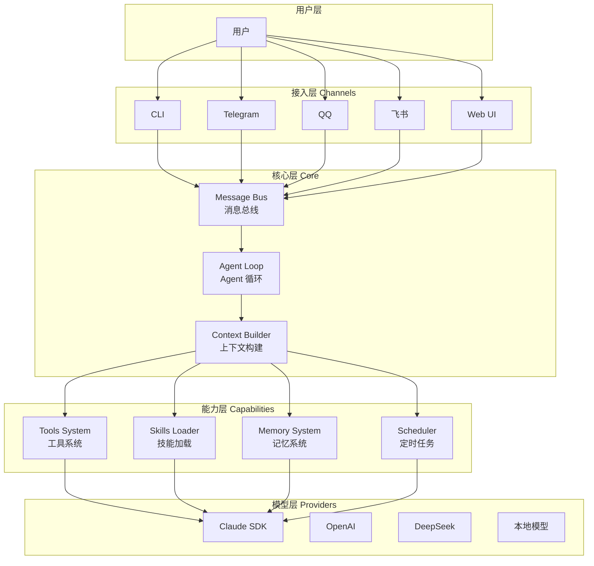

# AntAgent 项目方案

> 项目代号：antagent
> 参考项目：nanobot (超轻量个人AI助手)、OpenClaw (Claude Code实现的全能助手)
> 目标：打造一个轻量、可扩展的个人 AI 助手框架

---

## 1. 项目概述

### 1.1 核心理念

**AntAgent** 定位为「超轻量级个人 AI 助手框架」，继承 nanobot 的极简主义：

- **代码量目标**：~5000 行 Python（核心 agent 代码）
- **资源占用**：低内存启动，快速响应
- **模块化设计**：每个组件可独立演进
- **开箱即用**：通过 `antagent init` 快速启动

### 1.2 与 nanobot/OpenClaw 的对比

| 特性 | nanobot | OpenClaw | AntAgent |
|------|---------|----------|----------|
| 代码量 | ~4000 行 | ~40000+ 行 | ~5000 行 |
| 实现方式 | Python | Claude Code AI生成 | Claude Code SDK |
| 系统权限 | 无 | 有 (Full Access) | 可选 (分级授权) |
| 记忆系统 | Markdown | Markdown + 结构化 | Markdown (简化版) |
| 多渠道 | 丰富 | 丰富 | 核心渠道 (Telegram/QQ/飞书) |
| 技能系统 | 支持 | 支持 | 支持 |

### 1.3 目标用户

- 个人开发者，想要自己的 AI 助手
- 需要本地部署，保证数据隐私
- 追求轻量、低资源占用的用户

---

## 2. 架构设计

### 2.1 整体架构图



### 2.2 核心组件

#### 2.2.1 消息总线 (Message Bus)

```python
# antagent/core/message_bus.py
class MessageBus:
    """消息分发中心"""

    def __init__(self):
        self.subscribers: Dict[str, List[Callable]] = {}
        self.message_queue: asyncio.Queue = asyncio.Queue()

    async def publish(self, channel: str, message: Message):
        """发布消息到指定频道"""
        await self.message_queue.put((channel, message))

    async def subscribe(self, channel: str, handler: Callable):
        """订阅频道"""
        if channel not in self.subscribers:
            self.subscribers[channel] = []
        self.subscribers[channel].append(handler)

    async def start(self):
        """启动消息循环"""
        while True:
            channel, message = await self.message_queue.get()
            if channel in self.subscribers:
                for handler in self.subscribers[channel]:
                    await handler(message)
```

#### 2.2.2 Agent 循环 (Agent Loop)

```python
# antagent/core/agent_loop.py
class AgentLoop:
    """核心 Agent 执行循环"""

    def __init__(self, provider: LLMProvider, tools: ToolsRegistry):
        self.provider = provider
        self.tools = tools
        self.conversation_history: List[Message] = []

    async def run(self, user_message: str) -> str:
        """执行单轮对话"""
        # 1. 构建上下文
        context = await self.build_context(user_message)

        # 2. 调用 LLM
        response = await self.provider.chat(context)

        # 3. 处理工具调用
        while response.tool_calls:
            for tool_call in response.tool_calls:
                result = await self.execute_tool(tool_call)
                context.add_tool_result(tool_call.id, result)

            # 重新调用 LLM 处理结果
            response = await self.provider.chat(context)

        # 4. 记录历史
        self.conversation_history.append(
            Message(role="user", content=user_message),
            Message(role="assistant", content=response.content)
        )

        return response.content

    async def execute_tool(self, tool_call: ToolCall) -> str:
        """执行工具调用"""
        tool = self.tools.get(tool_call.name)
        if not tool:
            return f"Error: Tool {tool_call.name} not found"

        try:
            result = await tool.execute(**tool_call.arguments)
            return json.dumps(result)
        except Exception as e:
            return f"Error: {str(e)}"
```

#### 2.2.3 工具系统 (Tools System)

```python
# antagent/tools/registry.py
class ToolsRegistry:
    """工具注册表"""

    def __init__(self):
        self.tools: Dict[str, Tool] = {}
        self._register_builtin_tools()

    def register(self, tool: Tool):
        """注册工具"""
        self.tools[tool.name] = tool

    def get(self, name: str) -> Optional[Tool]:
        """获取工具"""
        return self.tools.get(name)

    def _register_builtin_tools(self):
        """注册内置工具"""
        self.register(FileReadTool())
        self.register(FileWriteTool())
        self.register(BashTool())
        self.register(WebSearchTool())
        self.register(URLFetchTool())
```

### 2.3 目录结构

```
antagent/
├── antagent/
│   ├── __init__.py
│   ├── cli.py                 # CLI 入口
│   ├── config.py              # 配置管理
│   │
│   ├── core/                  # 核心模块
│   │   ├── __init__.py
│   │   ├── message_bus.py     # 消息总线
│   │   ├── agent_loop.py     # Agent 循环
│   │   ├── context.py        # 上下文构建
│   │   └── session.py         # 会话管理
│   │
│   ├── tools/                 # 工具系统
│   │   ├── __init__.py
│   │   ├── registry.py        # 工具注册表
│   │   ├── base.py           # 工具基类
│   │   ├── file_tools.py     # 文件操作
│   │   ├── shell_tools.py    # Shell 命令
│   │   ├── web_tools.py      # 网络工具
│   │   └── custom_tools.py   # 自定义工具
│   │
│   ├── skills/                # 技能系统
│   │   ├── __init__.py
│   │   ├── loader.py         # 技能加载器
│   │   └── builtin/          # 内置技能
│   │
│   ├── memory/                # 记忆系统
│   │   ├── __init__.py
│   │   ├── storage.py        # 记忆存储
│   │   ├── user_profile.py   # 用户画像
│   │   └── summary.py        # 记忆摘要
│   │
│   ├── providers/             # LLM 提供商
│   │   ├── __init__.py
│   │   ├── base.py           # 基类
│   │   ├── claude.py         # Claude SDK
│   │   ├── openai.py         # OpenAI
│   │   └── deepseek.py       # DeepSeek
│   │
│   ├── channels/             # 接入渠道
│   │   ├── __init__.py
│   │   ├── base.py           # 基类
│   │   ├── cli.py            # 命令行
│   │   ├── telegram.py       # Telegram
│   │   ├── feishu.py         # 飞书
│   │   └── qq.py             # QQ
│   │
│   └── scheduler/            # 定时任务
│       ├── __init__.py
│       └── scheduler.py
│
├── config/
│   ├── default.yaml          # 默认配置
│   └── config.yaml           # 用户配置
│
├── workspace/                # 工作目录
│   ├── memory/               # 记忆文件
│   ├── skills/               # 自定义技能
│   └── logs/                 # 日志
│
├── tests/                    # 测试
├── docs/                     # 文档
├── pyproject.toml
├── README.md
└── Makefile
```

---

## 3. 功能规划

### 3.1 核心功能 (MVP)

| 功能 | 描述 | 优先级 |
|------|------|--------|
| CLI 对话 | 命令行对话模式 | P0 |
| Claude Provider | 支持 Claude SDK | P0 |
| 基础工具 | 文件读写、Shell 执行 | P0 |
| 记忆系统 | Markdown 记忆存储 | P0 |
| 配置管理 | YAML 配置加载 | P0 |
| Telegram 接入 | Telegram Bot 接入 | P1 |
| 技能系统 | 加载自定义技能 | P1 |
| 定时任务 | Cron 任务支持 | P2 |

### 3.2 扩展功能

| 功能 | 描述 | 优先级 |
|------|------|--------|
| 飞书接入 | 飞书机器人 | P2 |
| Web UI | 网页对话界面 | P2 |
| 多模型支持 | OpenAI/DeepSeek | P2 |
| 语音输入 | 语音转文字 | P3 |
| 多代理协作 | 多 Agent 协作 | P3 |

### 3.3 工具列表 (内置)

```python
# 基础工具
- file_read: 读取文件
- file_write: 写入文件
- file_list: 列出目录
- bash: 执行 Shell 命令
- web_search: 搜索网页
- web_fetch: 获取网页内容

# 进阶工具
- memory_read: 读取记忆
- memory_write: 写入记忆
- calendar: 日历操作
- send_email: 发送邮件
```

---

## 4. 技术选型

### 4.1 技术栈

| 类别 | 选择 | 理由 |
|------|------|------|
| 语言 | Python 3.11+ | nanobot 验证，轻量 |
| LLM SDK | Anthropic Claude SDK | 官方 SDK，稳定 |
| 异步 | asyncio | 高并发支持 |
| 配置 | PyYAML | 简单易用 |
| 消息队列 | asyncio.Queue | 内置，无需额外依赖 |
| Web 框架 | FastAPI | 轻量 Web UI |
| 存储 | Markdown 文件 | 兼容性好，易于查看 |

### 4.2 依赖列表

```toml
# pyproject.toml
dependencies = [
    "anthropic>=0.25.0",
    "pyyaml>=6.0",
    "python-telegram-bot>=21.0",
    "httpx>=0.27.0",
    "aiofiles>=23.0",
    "fastapi>=0.110.0",
    "uvicorn>=0.27.0",
    "tenacity>=8.0",
    "rich>=13.0",
    "python-dotenv>=1.0",
]
```

---

## 5. 实现路线图

### 5.1 Phase 1: 核心框架 (Week 1-2)

```
✓ 项目初始化
  - 创建 pyproject.toml
  - 设置目录结构
  - 配置日志

✓ 配置系统
  - config.py 实现
  - default.yaml 定义
  - 环境变量支持

✓ 消息总线
  - MessageBus 实现
  - 频道订阅机制

✓ Agent Loop
  - AgentLoop 核心逻辑
  - Context Builder
  - Provider 接口
```

### 5.2 Phase 2: 工具系统 (Week 3)

```
✓ 内置工具
  - FileReadTool
  - FileWriteTool
  - BashTool
  - WebSearchTool
  - WebFetchTool

✓ 工具注册表
  - ToolsRegistry
  - 工具定义规范
```

### 5.3 Phase 3: 记忆系统 (Week 4)

```
✓ 记忆存储
  - MarkdownStorage
  - 用户画像存储
  - 会话历史

✓ 记忆检索
  - 关键词匹配
  - 相关记忆召回
```

### 5.4 Phase 4: 渠道接入 (Week 5-6)

```
✓ CLI 渠道
  - 命令行对话
  - 交互式输入

✓ Telegram 渠道
  - Bot 开发
  - 消息处理

✓ 飞书渠道 (可选)
  - 机器人开发
```

### 5.5 Phase 5: 技能系统 (Week 7)

```
✓ 技能加载器
  - 技能定义格式
  - 动态加载

✓ 基础技能
  - 代码解释器
  - 数据处理
```

### 5.6 Phase 6: 完善与发布 (Week 8)

```
✓ 文档完善
✓ 测试编写
✓ 发布 PyPI
✓ README 完善
```

---

## 6. 安全设计

### 6.1 分级授权模式

```python
# config.yaml
security:
  # 授权级别
  level: "sandbox"  # sandbox | limited | full

  # 沙箱模式限制
  sandbox:
    allowed_commands:
      - git
      - npm
      - pip
    allowed_paths:
      - /home/user/projects
    denied_patterns:
      - "rm -rf /"
      - "curl | sh"

  # 限制模式
  limited:
    allowed_commands: all
    allowed_paths:
      - /home/user
    timeout: 30

  # 完全模式 (谨慎使用)
  full:
    allow_all: true
```

### 6.2 安全措施

- 命令白名单/黑名单
- 路径访问限制
- 超时控制
- 操作日志审计
- 敏感信息过滤

---

## 7. 配置示例

### 7.1 基础配置

```yaml
# config.yaml
antagent:
  name: "AntAgent"
  version: "0.1.0"

provider:
  type: "claude"
  api_key: "${ANTHROPIC_API_KEY}"
  model: "claude-sonnet-4-20250514"

security:
  level: "sandbox"
  workspace: "./workspace"

channels:
  cli:
    enabled: true
  telegram:
    enabled: false
    bot_token: "${TELEGRAM_BOT_TOKEN}"

memory:
  type: "markdown"
  path: "./workspace/memory"
  max_history: 100

tools:
  enabled:
    - file_read
    - file_write
    - bash
    - web_search
    - web_fetch
```

### 7.2 启动命令

```bash
# 初始化
antagent init

# 配置 API Key
export ANTHROPIC_API_KEY="sk-ant-..."

# 命令行模式
antagent chat

# Telegram 模式
antagent run --channel telegram

# Web UI 模式
antagent run --channel web
```

---

## 8. 下一步

1. **确认技术选型**：是否采用 Python + Claude SDK？
2. **确定核心功能优先级**：哪些功能是必须的？
3. **安全问题**：需要怎样的授权级别？
4. **渠道需求**：需要支持哪些平台？

---

*文档版本: 0.1*
*创建时间: 2026-02-27*
