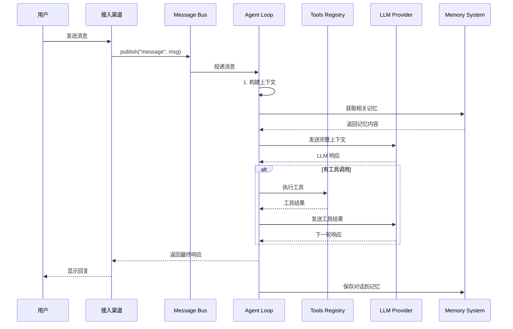
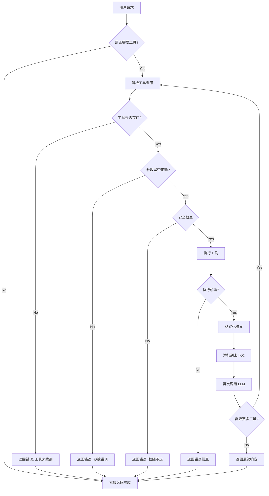
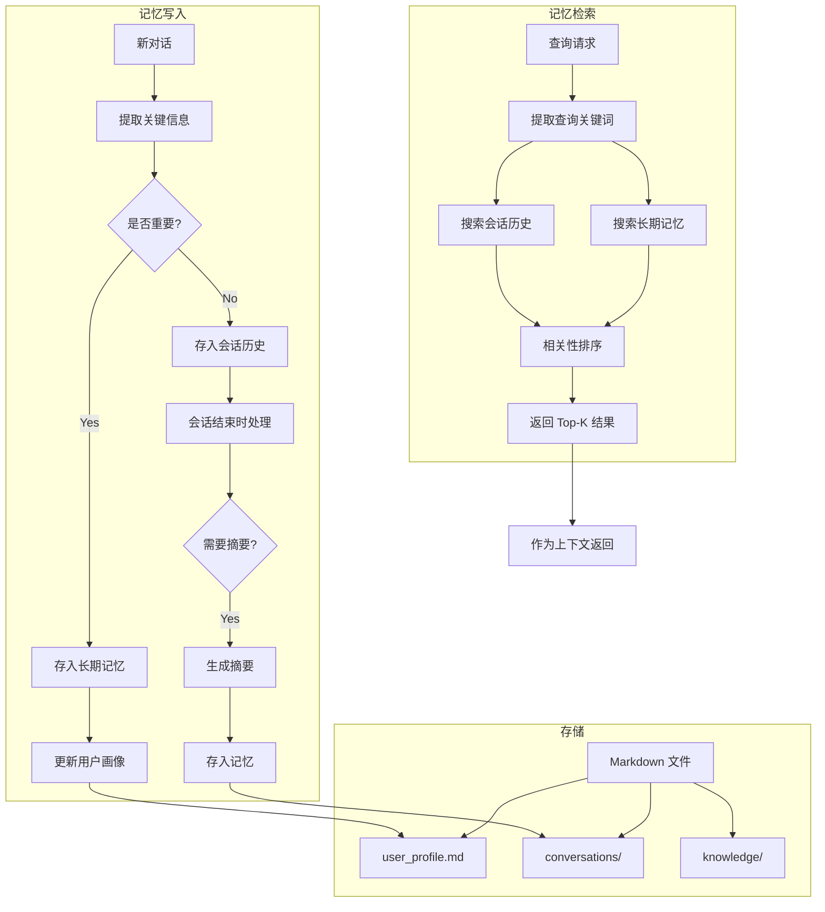
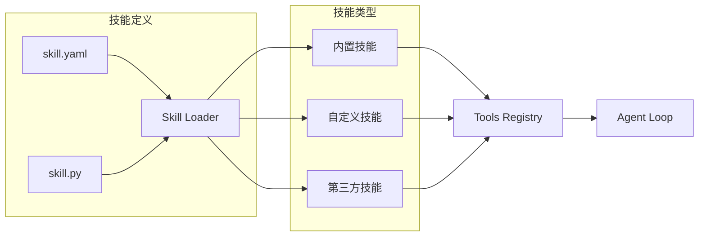
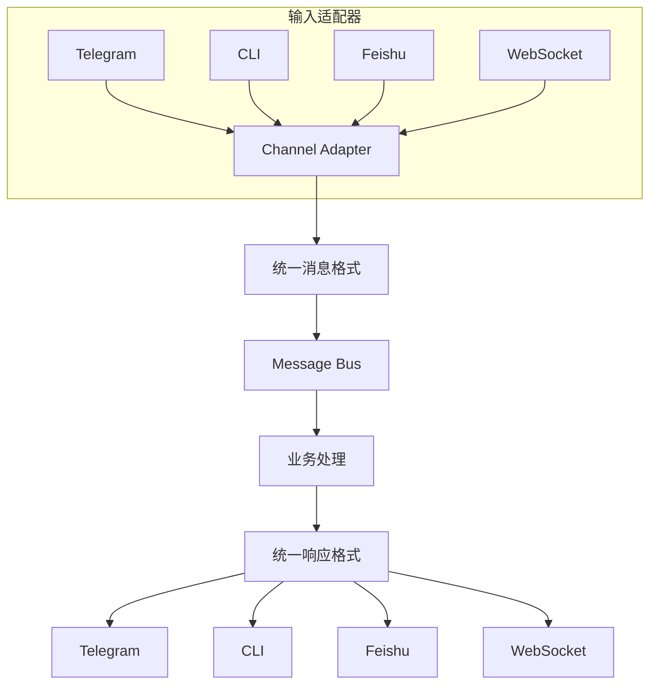
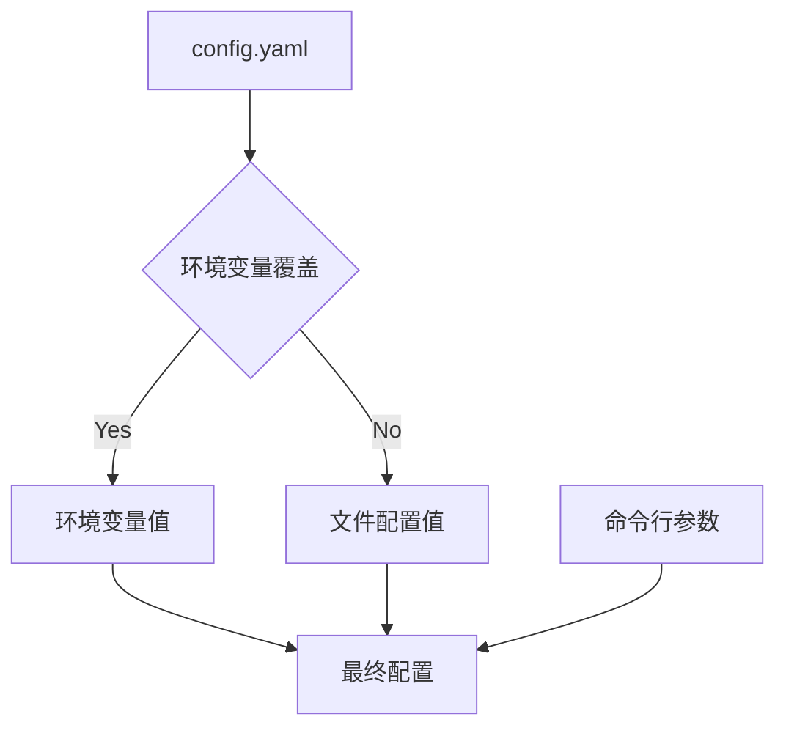

# AntAgent 架构详解

## 1. 消息流转图



## 2. 工具执行流程



## 3. 记忆系统架构



## 4. 技能系统



### 技能定义示例

```yaml
# skills/code_runner.yaml
name: code_runner
description: "执行代码并返回结果"
language: python
tool_name: run_code
parameters:
  - name: code
    type: string
    required: true
  - name: language
    type: string
    default: python
```

## 5. 渠道架构



## 6. 配置层次



---

## 7. 核心代码结构

### 7.1 入口点 (cli.py)

```python
# antagent/cli.py
import click
from antagent.core.agent_loop import AgentLoop
from antagent.providers.claude import ClaudeProvider
from antagent.tools.registry import ToolsRegistry

@click.group()
def cli():
    """AntAgent - 超轻量个人 AI 助手"""
    pass

@cli.command()
def chat():
    """启动交互式对话"""
    # 初始化组件
    provider = ClaudeProvider()
    tools = ToolsRegistry()
    agent = AgentLoop(provider, tools)

    # 启动循环
    while True:
        user_input = input("You: ")
        if user_input.lower() in ["exit", "quit"]:
            break

        response = await agent.run(user_input)
        print(f"AntAgent: {response}")

@cli.command()
@click.option("--channel", default="cli", help="接入渠道")
def run(channel):
    """启动服务"""
    # 根据 channel 启动对应服务
    pass

@cli.command()
def init():
    """初始化项目"""
    # 创建配置目录
    # 创建工作目录
    # 生成默认配置
    pass
```

### 7.2 Provider 接口

```python
# antagent/providers/base.py
from abc import ABC, abstractmethod
from typing import List, Dict, Any
from dataclasses import dataclass

@dataclass
class Message:
    role: str
    content: str
    tool_calls: List[Any] = None

@dataclass
class Response:
    content: str
    tool_calls: List[Any] = None

class LLMProvider(ABC):
    @abstractmethod
    async def chat(self, messages: List[Message]) -> Response:
        """发送聊天请求"""
        pass

    @abstractmethod
    async def get_available_models(self) -> List[str]:
        """获取可用模型"""
        pass
```

---

*文档版本: 0.1*
