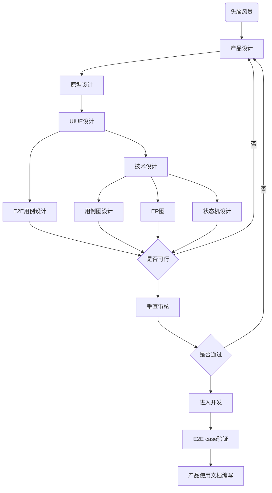

```mermaid
flowchart TB

n1["头脑风暴"] --> n2["产品设计"]

n2 --> n15["原型设计"]

n3["UIUE设计"] --> n4["技术设计"] & n6["E2E用例设计"]

n4 --> n7["用例图设计"] & n8["ER图"] & n9["状态机设计"]

n5["是否可行"] -- 否 --> n2

n6 --> n5

n7 --> n5

n8 --> n5

n9 --> n5

n5 --> n10["垂直审核"]

n10 --> n11["是否通过"]

n11 -- 否 --> n2

n11 --> n12["进入开发"]

n12 --> n13["E2E case验证"]

n13 --> n14["产品使用文档编写"]

n15 --> n3

n1@{ shape: rounded}

n5@{ shape: diam}

n11@{ shape: diam}
```

