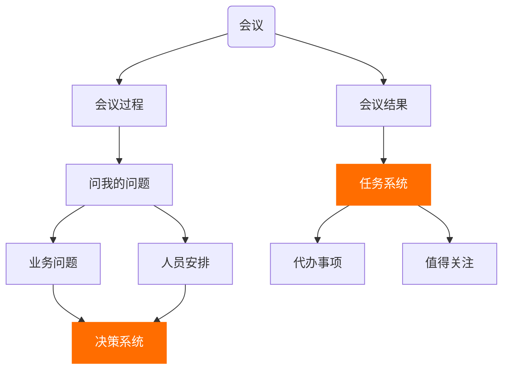
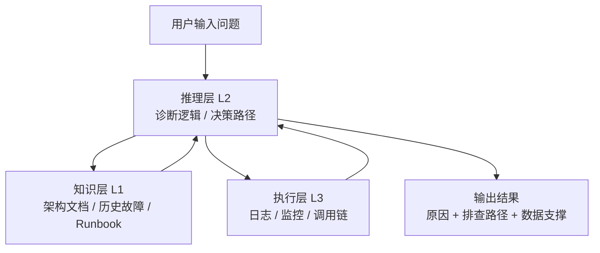

## 日常

### 会议

如果有了数字分身，日常会议应该像如下的结构

```mermaid
flowchart TB

n2["会议"] --> n5["会议结果"] & n6["会议过程"]

n5 --> n11["任务系统"]

n6 --> n7["问我的问题"]

n7 --> n9["业务问题"] & n10["人员安排"]

n9 --> n8["决策系统"]

n10 --> n8

n11 --> n3["代办事项"] & n4["值得关注"]

  

n2@{ shape: rounded}

n5@{ shape: rect}

n6@{ shape: rect}

n11@{ shape: rect}

n9@{ shape: rect}

n10@{ shape: rect}

n3@{ shape: rect}

n4@{ shape: rect}

style n11 fill:#FF6D00,color:#ffffff,stroke:#FF6D00

style n8 fill:#FF6D00,color:#ffffff,stroke:#FF6D00
```

## 决策系统架构图

```mermaid
flowchart TD
    A[用户输入问题] --> B[推理层 L2<br/>诊断逻辑 / 决策路径]

    B --> C[知识层 L1<br/>架构文档 / 历史故障 / Runbook]
    B --> D[执行层 L3<br/>日志 / 监控 / 调用链]

    C --> B
    D --> B

    B --> E[输出结果<br/>原因 + 排查路径 + 数据支撑]
```
