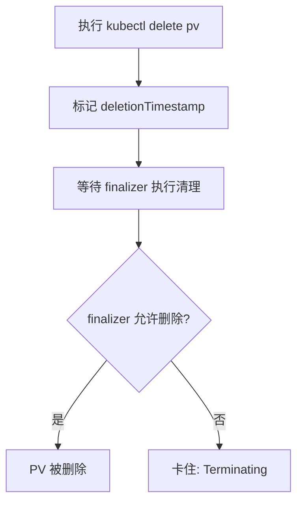

## 一、问题背景

在 Kubernetes 中执行以下命令：

```bash
kubectl delete pv <pv-name>
```

如果该 PV **仍然被 PVC / Pod 使用**，通常会出现：

```
STATUS: Terminating
```

此时：
- PV 不会被真正删除
- 但也无法正常使用（处于"半删除"状态）

---

## 二、适用场景

> **✅ 可以使用本方法的前提：**
> - PV 处于 `Terminating` 状态
> - PVC 仍然存在，且业务仍在使用该存储
> - **误删除 PV**，希望恢复

> **❌ 不适用：**
> - PV 已经完全消失（`kubectl get pv` 查不到）
> - 底层存储已经被删除（如云盘被释放）

---

## 三、问题本质

Kubernetes 为了防止误删，给 PV 加了 **finalizer**：

```yaml
metadata:
  finalizers:
    - kubernetes.io/pv-protection
```

> 作用是：只要资源还在被使用，就不允许删除。

所以当你删除 PV 时：

1. K8s 标记删除（进入 Terminating）
2. 发现仍被使用
3. 被 finalizer **拦住**
4. 卡住

---

## 四、解决方案

### 一条命令恢复

```bash
kubectl patch pv <pv-name> -p '{"metadata":{"finalizers":null}}'
```

---

## 五、操作步骤

### 1. 确认 PV 状态

```bash
kubectl get pv
```

看到 `Terminating` 状态。

---

### 2. 查看 finalizer（可选）

```bash
kubectl get pv <pv-name> -o yaml
```

通常会看到：

```yaml
finalizers:
  - kubernetes.io/pv-protection
```

---

### 3. 移除 finalizer（关键步骤）

```bash
kubectl patch pv <pv-name> -p '{"metadata":{"finalizers":null}}'
```

---

### 4. 验证恢复

```bash
kubectl get pv
```

期望结果：
- 不再是 `Terminating`
- 恢复为 `Bound`

---

### 5. 检查 PVC

```bash
kubectl get pvc
```

确认 STATUS 为 `Bound`。

---

## 六、原理解释

删除流程如下：



执行 `patch finalizers=null` 等于：

> **强制告诉 K8s：跳过保护机制，停止删除流程**

---

## 七、风险提示

> [!WARNING]
> 这个操作是"强制干预"，要注意以下风险：

### 1. 不要乱用

如果你真的想删除 PV，不应该移除 finalizer。

---

### 2. 可能导致状态不一致

比如：
- 外部存储还在
- 但 K8s 以为已经处理完

---

### 3. StorageClass 相关风险

对于动态存储（如 AWS EBS、Ceph、CSI Driver），可能存在以下 finalizer：

```
external-provisioner.volume.kubernetes.io/finalizer
```

> 强删可能绕过存储清理逻辑。

---

## 八、最佳实践

### 正确删除顺序

```bash
kubectl delete pvc <pvc-name>
```

而不是直接删 PV。

---

### 重要数据使用 Retain

```yaml
persistentVolumeReclaimPolicy: Retain
```

---

### 生产环境建议

- 避免手动操作 PV
- 通过 PVC + StorageClass 管理

---

## 九、一句话总结

> **PV 进入 Terminating，本质是被 finalizer 卡住；移除 finalizer 可以"撤销删除"，恢复资源。**
