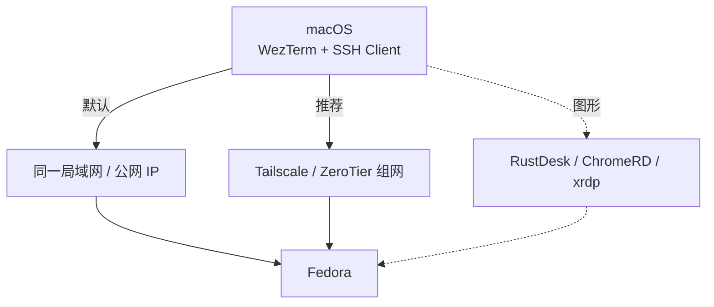
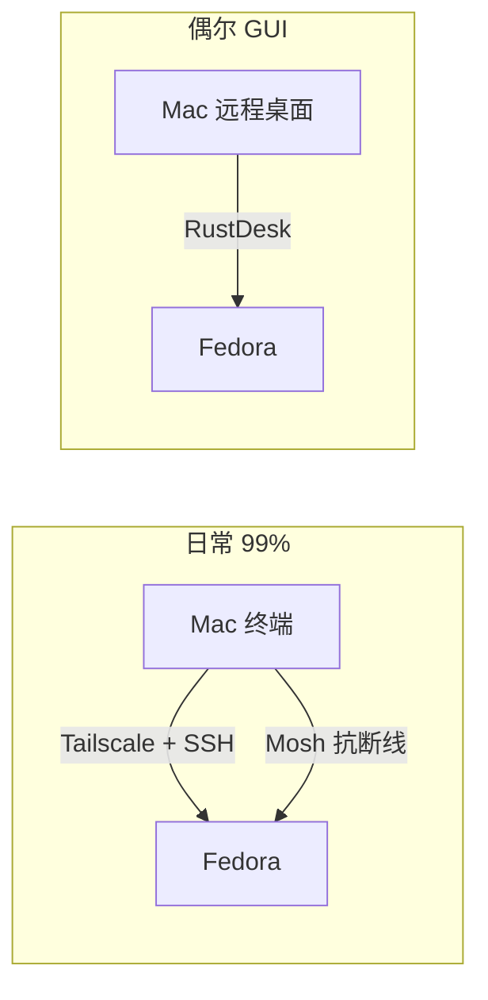

# Fedora 远程控制方案（Mac → Fedora）

> 场景：你在 macOS 上工作，Fedora 在同一局域网 / 不同网络。需要：
>
> 1. 命令行远程（SSH、Mosh）
> 2. 偶尔图形远程（RustDesk / Chrome Remote Desktop / VNC-over-SSH）

## 总览



**我的推荐组合**：

| 用途 | 方案 | 备注 |
| ---- | ---- | ---- |
| 日常命令 | **Tailscale + SSH** | 国内可用，速度稳定 |
| 抗断线 / 移动网络 | Mosh over Tailscale | sshd 之上的 udp |
| 偶尔 GUI | **RustDesk** | 开源、自带中继 |
| 团队 / 跨网络 | Tailscale + xrdp | GNOME 远程桌面原生 |

---

## 1. SSH（必须）

`Fedora安装与初始化` 已经默认装好 sshd，这里补充安全和密钥。

### 密钥登录

```bash
# 在 Mac 上
ssh-keygen -t ed25519 -C "macbook-fedora"
ssh-copy-id zhaoxin@<fedora-ip>
# Fedora 侧关闭密码登录
sudo vi /etc/ssh/sshd_config
# PasswordAuthentication no
# PermitRootLogin prohibit-password
sudo systemctl restart sshd
```

### SSH 配置（Mac 侧 `~/.ssh/config`）

```
Host fedora
  HostName 100.x.x.x    # Tailscale IP 或局域网 IP
  User zhaoxin
  IdentityFile ~/.ssh/id_ed25519
  ServerAliveInterval 30
  ServerAliveCountMax 6
  ForwardAgent yes

Host fedora-lan
  HostName 192.168.1.x
  User zhaoxin
  IdentityFile ~/.ssh/id_ed25519
```

之后 `ssh fedora` 一键连。

---

## 2. Tailscale（推荐组网方案）

无需公网 IP、不用配置 NAT，跨网络直通。

### Fedora 侧

```bash
# 官方源
curl -fsSL https://tailscale.com/install.sh | sh
sudo systemctl enable --now tailscaled
sudo tailscale up
# 输出登录链接，浏览器打开
sudo tailscale status
```

### Mac 侧

```bash
brew install --cask tailscale-app
# 登录同一账户
```

之后 Mac 和 Fedora 拿到 100.x.x.x 的内网 IP，相互 ssh 直连（已穿透 NAT）。

**国内替代**：ZeroTier / 自建 Headscale / Nebula。TailScale 在国内偶尔不稳时切 ZeroTier。

---

## 3. Mosh（移动网络 / 跨网络稳定）

适合笔记本切换 Wi-Fi、断开重连。

```bash
# Fedora
sudo dnf install -y mosh
sudo firewall-cmd --permanent --add-port=60001-60010/udp
sudo firewall-cmd --reload

# Mac
brew install mosh
mosh fedora
```

> mosh 依赖 UDP 60001-60010 端口，Tailscale 网络下无需开防火墙。

---

## 4. RustDesk（图形远程，开源、自带中继）

**最省心的图形方案**。比 NoMachine / AnyDesk 强在：自带 hbbs/hbbr 中继服务，可以完全自托管。

### Fedora 侧（被控）

```bash
# 下载 RPM
curl -L -o /tmp/rustdesk.rpm \
  https://github.com/rustdesk/rustdesk/releases/latest/download/rustdesk-1.3.0-fedora28-x86_64.rpm
sudo dnf install -y /tmp/rustdesk.rpm

# 首次启动：设置固定 ID + 密码 或 用 key
rustdesk
# 设置里：
#   - ID：会随机给一个 9 位数
#   - 临时密码：设一个 8 位以上
#   - 或者用 "Key" 字段填 Mac 那边的 key
```

### Mac 侧（控制）

```bash
brew install --cask rustdesk
# 输入 Fedora 的 ID + 密码
```

### 自建中继（可选）

```bash
# 拿一台 VPS 跑
docker run -d --name hbbs --net host \
  -v /var/lib/rustdesk-server:/root \
  -e IP=<your-server-ip> \
  -e PORT=21116 \
  rustdesk/rustdesk-server hbbs
docker run -d --name hbbr --net host \
  -v /var/lib/rustdesk-server:/root \
  rustdesk/rustdesk-server hbbr
# 然后在 Fedora 客户端设置 ID Server + Relay Server = VPS IP
```

> Wayland 下 RustDesk 需额外配置（见下面常见问题）。

---

## 5. Chrome Remote Desktop（图形远程，Google 账号登录）

无需任何 IP 配置，浏览器控制即可，但画质一般、延迟大。

### Fedora 侧

```bash
wget https://dl.google.com/linux/direct/google-chrome-stable_current_x86_64.rpm
sudo dnf install -y ./google-chrome-stable_current_x86_64.rpm

# 下载 Chrome Remote Desktop 包
curl -L -o /tmp/chrome-remote-desktop.rpm \
  https://github.com/tautcony/Chrome-Remote-Desktop-for-Fedora-Linux/releases/latest/download/chrome-remote-desktop.rpm
sudo dnf install -y /tmp/chrome-remote-desktop.rpm

# 设置 PIN
sudo /opt/google/chrome-remote-desktop/chrome-remote-desktop --setup
```

浏览器开 remotedesktop.google.com 用同一 Google 账号登录即可。

> Fedora 41+ Wayland 默认兼容，可直接用。

---

## 6. xrdp（GNOME 原生 RDP 体验）

需要 Tailscale/VPN，局域网/WAN 都行。

```bash
sudo dnf install -y xrdp
sudo systemctl enable --now xrdp
sudo firewall-cmd --permanent --add-port=3389/tcp
sudo firewall-cmd --reload

# 加入 ssl-cert 组以读取证书
sudo usermod -aG ssl-cert xrdp
```

Mac 客户端：系统自带「远程桌面连接」（⌃+⌘+K），或 Microsoft Remote Desktop。

> Wayland 下需要额外：见下面"Wayland 屏幕共享"。

---

## 7. Wayland 屏幕共享（重要！）

Fedora 默认 Wayland。多数远程工具（VNC/xrdp/RustDesk）需要通过 xdg-desktop-portal。

```bash
sudo dnf install -y xdg-desktop-portal xdg-desktop-portal-gtk xdg-desktop-portal-gnome

# 检查
ps aux | grep xdg-desktop-portal
```

GNOME 设置 → 共享 → 启用远程桌面（这其实就是 GNOME Remote Desktop）：

```bash
# 启用 GNOME 内置 RDP server（grd）
sudo dnf install -y gnome-remote-desktop
sudo systemctl enable --now gnome-remote-desktop
sudo firewall-cmd --permanent --add-port=3389/tcp
sudo firewall-cmd --reload

# 设置 RDP 凭据
sudo gnome-remote-desktop --set-rdp-credentials
```

Mac 用「屏幕共享」或 Microsoft Remote Desktop 连 `fedora-ip:3389`。

---

## 8. 我的推荐组合（按你的使用场景）



**你只要干一件事：先装 Tailscale，剩下问题 80% 解决。**

## 常见问题

- **SSH 连不上**：`sudo systemctl status sshd`，`sudo firewall-cmd --list-all`
- **Tailscale 连不上**：`sudo tailscale status`，`sudo journalctl -u tailscaled`
- **RustDesk 黑屏**：Fedora 是 Wayland，需要 `xdg-desktop-portal-gnome` 已装，且 RustDesk 用 Wayland pipe
- **xrdp 灰屏**：把 `xfce4-session` 换成 `gnome-session`，或装 `xorgxrdp`
- **远程看 GUI 卡**：Fedora 默认开了 fractional scaling，调低或关闭

## 后续

- 一切就绪后，回到 [[Fedora上手教程]] 看是否还有遗漏
