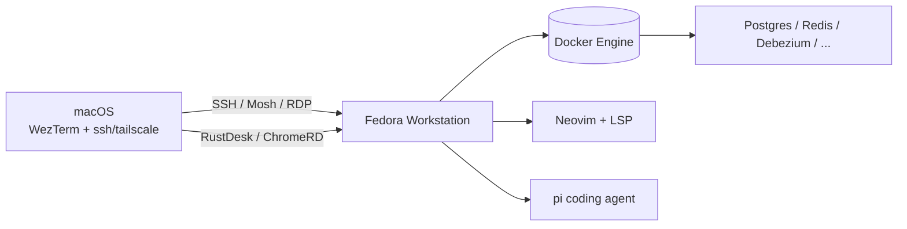

# Fedora 上手教程（总览）

> 目标：在 Mac mini（macOS）旁搭建一台 Fedora Workstation，作为**主开发与 Docker 宿主机**，并能远程控制与美化。
> 适用版本：Fedora 41/42（Workstation，GNOME，Wayland 默认）。

## 教程导航

按顺序阅读体验最佳，但每一篇都独立可查。

| # | 章节 | 用途 |
| - | ---- | ---- |
| 1 | [[01-Fedora安装与初始化]] | 装机、镜像源、系统更新、基础工具 |
| 2 | [[02-Fedora-Docker安装与使用]] | Docker + Compose + 国内镜像加速 |
| 3 | [[03-Fedora-终端美化与字体]] | Nerd Font、GNOME 主题、图标、扩展 |
| 4 | [[04-Fedora-zsh与终端工具链]] | zsh + oh-my-zsh + starship + eza/btop/yazi |
| 5 | [[05-Fedora-Neovim配置]] | neovim + lazy.nvim + LSP |
| 6 | [[06-Fedora-Wezterm与Zellij]] | 终端模拟器 + 多窗格复用 |
| 7 | [[07-Fedora-pi-agent安装与配置]] | pi coding agent 部署 |
| 8 | [[08-Fedora-远程控制方案]] | SSH / Mosh / Tailscale / RustDesk |
| 9 | [[09-Fedora-开发环境与常用软件]] | Python / Node / Java / Chrome / git |

## 推荐安装顺序

1. **系统层** → 1 → 2 → 3（字体一定要先装，否则后面终端全是方块）
2. **终端层** → 4 → 5 → 6 → 7（按这个顺序装完，命令行体验就齐了）
3. **远程层** → 8（先开 SSH + Tailscale，再开图形远程）
4. **业务层** → 9（按你开发栈选装）

## 总体架构

## 通用注意事项

- 国内网络下需要走代理，参考 [[01-Fedora安装与初始化#代理配置]]
- 教程中所有 `dnf install` 都需要 `sudo`
- 如果遇到 dnf 下载慢，先看 [[01-Fedora安装与初始化#DNF 镜像加速]]
- Fedora 默认是 Wayland，不是 X11，部分远程工具要专门选 Wayland 节点

## 我的判断

- **Fedora 而不是 Ubuntu**：滚动式更新、工具链新（默认 Python 3.12+、GCC 14、systemd 最新），对开发者友好，缺点是企业级稳定性不如 RHEL。如果你做生产服务器，请用 RHEL / Rocky / Alma。
- **GNOME 而不是 KDE**：默认简洁、对 Wayland 支持最好（这直接影响远程桌面质量），扩展生态成熟。
- **wezterm + zellij 而非 iTerm2 + tmux**：跨平台（macOS/Fedora 同款配置），配置用 Lua 可版本管理。
